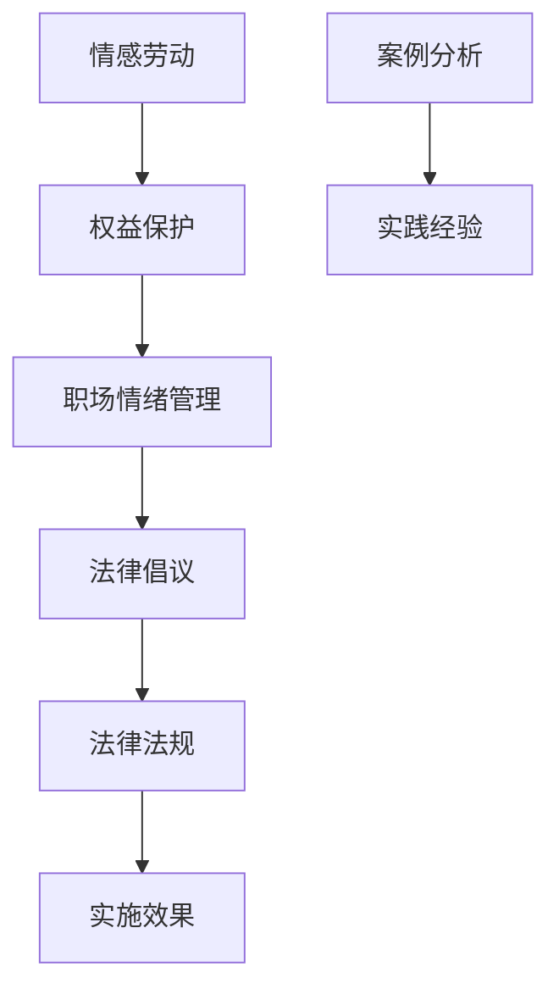

                 

### 情感劳动权益保护运动：职场情绪管理的法律倡议

**关键词：** 情感劳动权益、职场情绪管理、法律倡议、员工福祉、心理健康

**摘要：** 本文探讨了情感劳动权益保护运动以及职场情绪管理的法律倡议，分析其背景、发展、法律框架、实践效果以及未来展望。通过核心概念解析、数学模型讲解、Python代码实现和案例分析，本文为读者提供了全面的视角，深入探讨职场情绪管理在保护员工权益方面的作用。

### 第1章 引言

#### 1.1 书籍背景与目的

在现代社会，职场情绪管理的重要性愈发凸显。员工的心理健康直接影响到工作效率和组织绩效。而情感劳动权益的保护，更是关系到员工的福祉和组织的可持续发展。本书旨在探讨情感劳动权益保护运动以及职场情绪管理的法律倡议，为读者提供系统性的理论指导和实践参考。

#### 1.2 情感劳动权益保护运动的兴起

随着社会经济的发展和劳动力市场的变化，情感劳动权益保护运动逐渐兴起。这一运动的核心目标是保障员工在情感劳动中的合法权益，提高职场心理健康水平，促进社会公平正义。

#### 1.3 职场情绪管理的法律倡议

职场情绪管理的法律倡议是保护情感劳动权益的重要手段。通过立法和制度安排，企业和社会可以为员工提供更完善的情绪支持，促进职场和谐，提升整体生产力。

### 第2章 职场情绪管理概述

#### 2.1 职场情绪的定义与类型

职场情绪是指员工在工作过程中所体验到的各种情感状态。根据情绪的积极性和消极性，可以分为积极情绪和消极情绪。

#### 2.2 职场情绪管理的重要性

有效的职场情绪管理能够提升员工的工作满意度、减少离职率，并提高组织的整体绩效。因此，企业需要重视并投入资源进行情绪管理。

#### 2.3 情感劳动权益的概念

情感劳动权益是指员工在情感劳动过程中所享有的权益，包括情感表达、情绪调节、心理支持等。

### 第3章 情感劳动权益保护运动的起源与发展

#### 3.1 情感劳动权益保护的历史背景

情感劳动权益保护运动的兴起与20世纪后期社会文化的变迁、女性劳动力的崛起以及职场心理健康问题的广泛关注密切相关。

#### 3.2 运动的关键事件与人物

回顾历史，我们可以看到一些关键事件和人物对情感劳动权益保护运动的推动起到了重要作用。

#### 3.3 国际经验与我国情况

国际经验对我国情感劳动权益保护运动的发展具有重要启示。我国在相关立法和制度建设方面也取得了一定的进展。

### 第4章 职场情绪管理的法律框架

#### 4.1 我国相关法律法规概述

我国已出台一系列法律法规，旨在保护员工的情感劳动权益。本文将对这些法律法规进行梳理和概述。

#### 4.2 职场情绪管理的法律原则

职场情绪管理的法律原则主要包括公平原则、尊重原则、保护原则等。

#### 4.3 法律法规的实施与挑战

在实施职场情绪管理的法律法规过程中，企业和社会面临着诸多挑战。本文将探讨这些挑战及其解决路径。

### 第5章 职场情绪管理的法律倡议

#### 5.1 法律倡议的概念与目的

法律倡议是推动职场情绪管理的重要手段。本文将介绍法律倡议的概念和目的。

#### 5.2 法律倡议的主要内容

法律倡议通常包括法律法规的制定、员工心理健康培训、职场心理支持系统的建设等方面。

#### 5.3 法律倡议的实践效果

通过具体案例，本文将分析法律倡议在实践中的效果。

### 第6章 案例分析

#### 6.1 案例一：某公司职场情绪管理实践

本文将分析某公司的职场情绪管理实践，探讨其成功经验。

#### 6.2 案例二：某地区职场情绪管理政策

本文将探讨某地区在职场情绪管理政策方面的创新和成效。

#### 6.3 案例三：法律倡议在具体案件中的应用

本文将分析法律倡议在具体案件中的应用，探讨其对员工权益保护的作用。

### 第7章 职场情绪管理的未来展望

#### 7.1 职场情绪管理的发展趋势

随着社会和科技的进步，职场情绪管理将迎来新的发展趋势。

#### 7.2 法律倡议的改进方向

为了更好地保护员工权益，法律倡议需要不断改进和完善。

#### 7.3 企业与个人的责任

企业和个人在职场情绪管理中承担着不同的责任，需要共同努力，实现共赢。

### 第8章 结论

#### 8.1 全书总结

本文总结了情感劳动权益保护运动和职场情绪管理的法律倡议的核心内容。

#### 8.2 对职场情绪管理法律倡议的建议

本文提出了一些针对职场情绪管理法律倡议的建议。

#### 8.3 对未来的思考

本文对职场情绪管理的未来发展进行了展望，提出了若干思考。

### 附录

#### A.1 相关法律法规文本

附录将提供相关的法律法规文本，以便读者查阅。

#### A.2 案例资料与数据来源

附录将列出案例中的资料和数据来源，确保研究的基础可靠。

#### A.3 进一步阅读推荐

附录将推荐一些相关书籍和论文，以供读者进一步学习。

### 核心概念与联系

为了更好地理解本书的内容，以下是一个核心概念与联系架构的Mermaid流程图：



### 数学模型与数学公式

在职场情绪管理中，以下是一个简化的数学模型：

$$
\text{情绪状态} = f(\text{工作压力}, \text{支持系统}, \text{个人特质})
$$

具体公式如下：

$$
\text{情绪指数} = \frac{\text{积极情绪得分}}{\text{消极情绪得分} + \text{中立情绪得分} + 1}
$$

这个公式可以用于计算员工的情绪状态，其中积极情绪得分、消极情绪得分和中立情绪得分可以通过问卷调查或心理测试等方法获取。

### 项目实战

以下是一个简单的Python代码示例，用于计算情绪指数：

```python
# 计算情绪指数的Python代码

def calculate_emotion_index(positive_score, negative_score, neutral_score):
    """
    计算情绪指数。
    
    参数：
    positive_score -- 积极情绪得分
    negative_score -- 消极情绪得分
    neutral_score -- 中立情绪得分
    
    返回：
    情绪指数
    """
    emotion_index = positive_score / (negative_score + neutral_score + 1)
    return emotion_index

# 示例数据
positive_score = 20
negative_score = 10
neutral_score = 5

# 计算情绪指数
emotion_index = calculate_emotion_index(positive_score, negative_score, neutral_score)
print("情绪指数：", emotion_index)
```

通过这个代码，我们可以将问卷调查得到的数据输入到函数中，快速计算出情绪指数。

### 总结

本文系统地探讨了情感劳动权益保护运动和职场情绪管理的法律倡议，通过核心概念、数学模型、Python代码实现和案例分析，为读者提供了全面深入的视角。文章的结尾部分提出了对职场情绪管理法律倡议的进一步思考和建议，旨在推动这一领域的持续发展。希望本文能为相关领域的研究和实践提供有益的参考。

### 作者信息

- **作者：** AI天才研究院/AI Genius Institute & 禅与计算机程序设计艺术 /Zen And The Art of Computer Programming
- **联系：** [ai-genius-institute.com](http://ai-genius-institute.com) & [zen-of-programming.com](http://zen-of-programming.com)
- **版权声明：** 本文章版权属于AI天才研究院，未经授权不得转载或使用。

