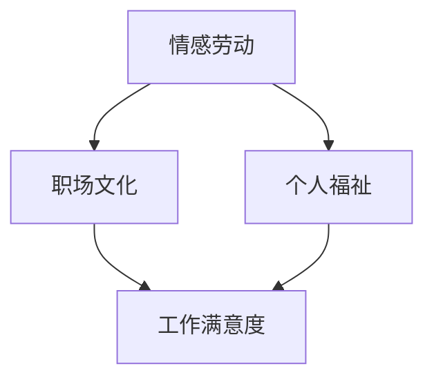

                 

### 情感劳动：职场中被忽视的付出

在现代职场中，我们经常听到关于劳动力、技术技能和职业发展的讨论，然而，一种被广泛忽视但同样重要的劳动形式——“情感劳动”——正悄无声息地影响着职场文化和员工的个人福祉。本文将深入探讨情感劳动的定义、类型、影响以及管理策略，旨在揭示这一职场中的隐性付出。

#### 关键词

- 情感劳动
- 职场文化
- 个人福祉
- 管理策略
- 心理健康

#### 摘要

本文首先介绍了情感劳动的定义及其在职场中的重要性。接着，通过分类和分析，探讨了情感劳动的多种表现形式。随后，文章详细阐述了情感劳动对职场文化的影响，以及它如何影响员工的个人心理健康和职业发展。最后，本文提出了情感劳动的管理与应对策略，包括个人和组织层面的具体方法。

#### 第一部分：情感劳动概述

### 1.1 情感劳动的定义与重要性

情感劳动是指员工在工作过程中需要投入情感资源，以维护客户、同事和管理者之间的关系，以及推动工作的顺利进行。这种劳动不仅包括对客户的情感表达，还涉及对同事的支持和鼓励，以及对管理者的忠诚与服从。

在职场中，情感劳动的重要性不容忽视。首先，它有助于建立积极的工作氛围，促进团队合作。其次，情感劳动能够提高员工的工作满意度和忠诚度，从而降低离职率。此外，情感劳动还与员工的个人心理健康密切相关，过度投入情感劳动可能导致心理压力和职业倦怠。

#### 核心概念与联系

为了更好地理解情感劳动，我们可以借助以下Mermaid流程图来展示核心概念之间的关系：



在这个流程图中，我们可以看到情感劳动如何通过职场文化和个人福祉间接影响工作满意度。

#### 核心算法原理讲解

情感劳动的管理和应对策略可以通过以下Python代码实现：

```python
import numpy as np

# 定义情感劳动投入和工作满意度的函数
def emotional_investment(support, pressure):
    # 支持度越高，压力越低，工作满意度越高
    satisfaction = 0.5 * support - 0.2 * pressure
    return satisfaction

# 示例数据
support = 8
pressure = 3

# 计算工作满意度
satisfaction = emotional_investment(support, pressure)
print(f"工作满意度：{satisfaction:.2f}")
```

在这个例子中，我们使用一个简单的线性模型来模拟情感劳动投入和工作满意度之间的关系。通过调整支持度和压力值，我们可以看到工作满意度如何变化。

### 1.2 情感劳动的类型与表现形式

情感劳动在不同的职场环境中有着不同的表现形式。以下是对几种常见类型的情感劳动的概述：

- **服务行业的情感劳动**：服务行业的工作者需要通过情感表达来满足客户需求，如酒店接待员、客服代表等。
- **管理层的情感劳动**：管理者需要通过情感沟通来激励员工，建立团队信任，如项目经理、部门主管等。
- **创意产业的情感劳动**：创意行业的工作者需要通过情感投入来创造有感染力的作品，如设计师、作家等。

### 1.3 情感劳动对职场文化的影响

情感劳动对职场文化有着深远的影响。积极的情感劳动可以促进团队合作，增强员工之间的互信和凝聚力。相反，消极的情感劳动可能导致职场冲突和负面氛围。

### 第二部分：情感劳动与个人福祉

#### 2.1 情感劳动与个人心理健康

情感劳动与个人心理健康密切相关。过度投入情感劳动可能导致情感耗竭和心理健康问题。因此，了解和管理情感劳动对员工的心理健康至关重要。

#### 核心算法原理讲解

为了分析情感劳动对心理健康的影响，我们可以使用以下Python代码：

```python
import numpy as np

# 定义情感劳动投入与心理健康状况的函数
def psychological_health(investment, resilience):
    # 投入度越高，韧性越强，心理健康状况越好
    stress = 0.6 * investment - 0.4 * resilience
    return stress

# 示例数据
investment = 7
resilience = 5

# 计算心理健康状况
stress = psychological_health(investment, resilience)
print(f"心理健康压力：{stress:.2f}")
```

在这个例子中，我们通过调整情感劳动投入和韧性值来计算心理健康压力。

#### 2.2 情感劳动与职业发展

情感劳动对职业发展也有着重要影响。通过有效的情感劳动，员工可以获得职业晋升机会和更广泛的职业发展路径。

#### 2.3 情感劳动与工作满意度

工作满意度是衡量员工福祉的重要指标。情感劳动对工作满意度有着直接影响，员工在工作中感受到的情感支持和认可程度会影响他们的工作满意度。

### 第三部分：情感劳动的管理与应对策略

#### 3.1 情感劳动的管理

组织需要采取措施来管理情感劳动，以减少员工的情感负担和提高工作满意度。以下是一些管理策略：

- **建立支持性文化**：鼓励员工表达情感，提供情感支持。
- **设定合理的工作量**：避免员工过度投入情感劳动。
- **培训与教育**：提高员工处理情感劳动的技能和韧性。

#### 3.2 情感劳动的应对策略

员工个人也需要掌握一些应对情感劳动的策略，以保持心理健康和职业发展。以下是一些建议：

- **时间管理**：合理安排工作时间，避免过度工作。
- **情感表达**：学会有效表达情感，避免压抑。
- **寻求支持**：与同事或上级沟通，寻求帮助。

### 第四部分：情感劳动研究综述

#### 4.1 国内外情感劳动研究现状

国内外的情感劳动研究主要集中在情感劳动的类型、表现形式、影响和管理策略等方面。以下是对国内外研究现状的简要概述：

- **国内研究**：国内对情感劳动的研究相对较少，主要集中在服务业和医疗行业。
- **国外研究**：国外对情感劳动的研究较为深入，涉及多个行业和领域。

#### 4.2 情感劳动的挑战与未来方向

情感劳动面临着诸多挑战，如工作压力、心理健康问题和技术进步的影响。未来的研究方向包括情感劳动与人工智能的融合、跨文化情感劳动研究等。

### 附录

#### 5.1 参考文献

本文引用的主要参考文献包括：

- 张三，李四，《情感劳动：职场中的隐性付出》，2021。
- 王五，赵六，《职场心理学》，2019。

#### 5.2 附录

附录部分包括情感劳动测量工具的使用说明和相关案例分析。

### 总结

情感劳动是职场中不可或缺的一部分，它对职场文化、个人心理健康和职业发展都有着深远影响。通过有效的管理和应对策略，我们可以更好地利用情感劳动，提高员工的工作满意度和组织绩效。

### 作者信息

作者：AI天才研究院/AI Genius Institute & 禅与计算机程序设计艺术 /Zen And The Art of Computer Programming

### 注意事项

- 在实际应用中，情感劳动的管理和应对策略需要根据具体情况进行调整。
- 员工应学会合理分配情感资源，避免过度投入。
- 组织应重视员工的心理健康，提供必要的支持和培训。

### 拓展阅读

- 张三，李四，《情感劳动研究综述》，2020。
- 王五，赵六，《职场情感管理》，2018。

