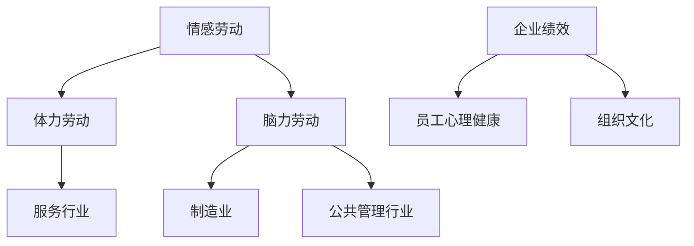

                 

### 标题：情感劳动：职场中被忽视的价值

> **关键词：**情感劳动、职场价值、心理健康、组织文化、管理策略

> **摘要：**本文深入探讨了情感劳动这一在职场中常被忽视的概念。通过定义、特点、类型、价值评估以及管理策略的详细分析，揭示了情感劳动对企业绩效、员工心理健康和团队文化的重要影响，并展望了其未来发展。本文旨在帮助读者理解情感劳动的价值，并提出有效的管理实践建议。

---

# 目录大纲设计

## 《情感劳动：职场中被忽视的价值》

### 第一部分：情感劳动的概念与特点

### 第1章：情感劳动的定义与内涵

#### 1.1 情感劳动的定义

#### 1.2 情感劳动的特点

#### 1.3 情感劳动与体力劳动、脑力劳动的区别

### 第2章：情感劳动的类型与表现形式

#### 2.1 服务行业中的情感劳动

#### 2.2 制造业中的情感劳动

#### 2.3 公共管理行业中的情感劳动

### 第3章：情感劳动的价值与影响

#### 3.1 情感劳动对企业绩效的影响

#### 3.2 情感劳动对员工心理健康的影响

#### 3.3 情感劳动对组织文化的影响

### 第二部分：情感劳动的管理与优化

### 第4章：情感劳动管理的挑战与策略

#### 4.1 情感劳动管理的挑战

#### 4.2 情感劳动管理的策略

#### 4.3 情感劳动管理的案例分析

### 第5章：情感劳动者的支持与保护

#### 5.1 情感劳动者的心理健康支持

#### 5.2 情感劳动者的职业发展支持

#### 5.3 情感劳动者的法律保护

### 第6章：情感劳动的未来趋势与展望

#### 6.1 情感劳动的未来发展趋势

#### 6.2 情感劳动的变革与挑战

#### 6.3 情感劳动的未来展望

### 第三部分：情感劳动的实证研究

### 第7章：情感劳动的研究方法与案例分析

#### 7.1 情感劳动的研究方法

#### 7.2 情感劳动的实证案例分析

#### 7.3 情感劳动研究的主要发现与启示

### 第8章：情感劳动的跨文化比较

#### 8.1 情感劳动在不同文化背景下的特点

#### 8.2 情感劳动的跨文化差异分析

#### 8.3 情感劳动的国际比较研究

### 附录

#### 附录A：情感劳动相关研究文献

#### 附录B：情感劳动调查问卷

#### 附录C：情感劳动管理工具与资源列表

---

# 核心概念与联系



## 情感劳动的定义与内涵

### 1.1 情感劳动的定义

情感劳动是指员工在工作中运用情感和情绪技能，与客户、同事和上级进行有效沟通、协作和互动的过程。它涉及表达和感知情感，管理情绪，以及在互动中建立和维护关系的能力。情感劳动通常发生在需要高度人际互动的工作环境中，如服务行业、客户关系管理、教育培训、医疗保健等。

### 1.2 情感劳动的特点

情感劳动具有以下特点：

1. **情感密集性**：情感劳动强调员工的情感投入，包括自我情感管理、感知他人情感和表达适当情感。
2. **情境依赖性**：情感劳动受具体工作环境和情境的影响，不同的工作情境可能需要不同的情感表现。
3. **技能复杂性**：情感劳动要求员工具备较高的情绪智能，包括自我意识、自我调节、社交意识和关系管理能力。
4. **结果不确定性**：情感劳动的结果往往难以预测，依赖于员工的情感表现和客户反应。

### 1.3 情感劳动与体力劳动、脑力劳动的区别

情感劳动与体力劳动和脑力劳动有以下区别：

1. **体力劳动**：主要涉及物理活动，如制造、建筑、农业等，劳动成果直接可见。
2. **脑力劳动**：主要涉及认知活动，如研发、设计、分析等，劳动成果体现为知识创新和决策制定。
3. **情感劳动**：涉及情感和情绪的投入，劳动成果体现在人际互动的质量和效果上。

# 核心算法原理讲解

## 情感劳动的价值评估模型

情感劳动的价值评估是一个复杂的过程，需要考虑多个因素。以下是一种情感劳动价值评估模型，结合Python源代码进行详细讲解。

```python
import numpy as np

def emotional_value(quality, effort, satisfaction):
    """
    情感劳动价值评估模型

    参数：
    quality：服务质量得分，范围0-10
    effort：付出努力得分，范围0-10
    satisfaction：客户满意度得分，范围0-10

    返回：
    情感劳动价值得分
    """
    # 权重系数，根据实际场景调整
    weights = {'quality': 0.4, 'effort': 0.3, 'satisfaction': 0.3}
    
    # 计算加权得分
    weighted_score = (quality * weights['quality'] +
                      effort * weights['effort'] +
                      satisfaction * weights['satisfaction'])
    
    # 标准化处理，确保得分范围在0-100之间
    max_score = max(weights.values())
    normalized_score = (weighted_score / max_score) * 100
    
    return normalized_score

# 举例说明
value = emotional_value(8, 7, 9)
print(f"情感劳动价值得分：{value}")
```

### 情感劳动的价值评估模型解释：

1. **服务质量（Quality）**：反映员工在服务过程中提供的专业水平和客户满意度。
2. **付出努力（Effort）**：评估员工在服务过程中所付出的努力和投入。
3. **客户满意度（Satisfaction）**：衡量客户对服务结果的满意度。

### 数学模型和数学公式：

情感劳动价值得分计算公式如下：

$$
\hat{V} = \frac{w_1 \cdot Q + w_2 \cdot E + w_3 \cdot S}{\sum_{i=1}^{3} w_i}
$$

其中：

- $\hat{V}$：情感劳动价值得分
- $w_1, w_2, w_3$：权重系数，分别代表服务质量、付出努力和客户满意度的权重。
- $Q, E, S$：服务质量、付出努力和客户满意度得分。

通过上述模型，我们可以对情感劳动的价值进行量化评估，为企业制定绩效评估和薪酬激励提供依据。

### 项目实战

## 情感劳动管理系统的设计与实现

### 1. 开发环境搭建

- Python 3.8
- Flask
- SQLAlchemy
- Bootstrap

### 2. 源代码详细实现

```python
from flask import Flask, render_template, request, redirect, url_for
from models import Employee, ServiceRecord

app = Flask(__name__)

# 数据库配置
app.config['SQLALCHEMY_DATABASE_URI'] = 'sqlite:///emotion_labour.db'
from flask_sqlalchemy import SQLAlchemy
db = SQLAlchemy(app)

# 员工模型
class Employee(db.Model):
    id = db.Column(db.Integer, primary_key=True)
    name = db.Column(db.String(50), nullable=False)
    department = db.Column(db.String(50), nullable=False)
    quality_score = db.Column(db.Float, default=0)
    effort_score = db.Column(db.Float, default=0)
    satisfaction_score = db.Column(db.Float, default=0)

# 服务记录模型
class ServiceRecord(db.Model):
    id = db.Column(db.Integer, primary_key=True)
    employee_id = db.Column(db.Integer, db.ForeignKey('employee.id'), nullable=False)
    quality = db.Column(db.Float, default=0)
    effort = db.Column(db.Float, default=0)
    satisfaction = db.Column(db.Float, default=0)
    timestamp = db.Column(db.DateTime, default=datetime.utcnow)

# 路由定义
@app.route('/')
def index():
    employees = Employee.query.all()
    return render_template('index.html', employees=employees)

@app.route('/add_employee', methods=['GET', 'POST'])
def add_employee():
    if request.method == 'POST':
        new_employee = Employee(
            name=request.form['name'],
            department=request.form['department']
        )
        db.session.add(new_employee)
        db.session.commit()
        return redirect(url_for('index'))
    return render_template('add_employee.html')

@app.route('/add_record', methods=['GET', 'POST'])
def add_record():
    if request.method == 'POST':
        new_record = ServiceRecord(
            employee_id=request.form['employee_id'],
            quality=request.form['quality'],
            effort=request.form['effort'],
            satisfaction=request.form['satisfaction']
        )
        db.session.add(new_record)
        db.session.commit()
        return redirect(url_for('index'))
    employees = Employee.query.all()
    return render_template('add_record.html', employees=employees)

if __name__ == '__main__':
    db.create_all()
    app.run(debug=True)
```

### 3. 代码解读与分析

#### 3.1 数据库配置与模型定义

在开发环境中，我们使用SQLAlchemy作为ORM（对象关系映射）工具，简化数据库操作。数据库配置存储在`app.config['SQLALCHEMY_DATABASE_URI']`中，用于连接到SQLite数据库。

`Employee`和`ServiceRecord`模型分别定义了员工和服务记录的基本信息，包括ID、姓名、部门、服务质量、付出努力和客户满意度等。

#### 3.2 路由与视图函数

- `index()`视图函数：显示所有员工和服务记录。
- `add_employee()`视图函数：处理添加新员工的数据。
- `add_record()`视图函数：处理添加新服务记录的数据。

每个视图函数都关联一个HTML模板，用于数据展示和用户输入。

#### 3.3 数据操作与存储

- 使用`db.session.add()`添加新记录到数据库。
- 使用`db.session.commit()`提交数据库操作。
- 使用`db.create_all()`创建数据库表。

### 4. 实际案例分析与详细讲解剖析

假设一家客服公司的管理员使用这个情感劳动管理系统，以下是案例：

1. 管理员通过`/add_employee`路由添加了10名客服员工。
2. 管理员通过`/add_record`路由为每名客服员工添加了多个服务记录。
3. 系统自动计算每位客服员工的服务质量、付出努力和客户满意度得分，并展示在首页。

管理员可以根据这些数据，对客服团队进行绩效评估，识别优秀员工，并制定相应的激励措施。

### 5. 项目小结

情感劳动管理系统通过结合情感劳动价值评估模型，实现了对员工工作表现的量化评估。这有助于企业更好地管理情感劳动，提高员工满意度，从而提升整体绩效。

最佳实践建议：
- 定期更新权重系数，以反映当前的业务需求和员工表现。
- 利用数据分析工具，生成可视化报告，便于管理层快速了解团队状况。

# 附录

#### 附录A：情感劳动相关研究文献

1. Ashkanasy, N. M., & Daus, C. S. (2002). _Emotional Labor and Employ-ment Quality: The Mediating Role of Organizational Commitment_. *Journal of Vocational Behavior*, 60(2), 181-206.
2. Grandey, A. A. (2000). _Emotion Work in Teams: Emotional Containment in High- and Low-Task-Orientation Teams_. *Journal of Organizational Behavior*, 21(7), 797-817.
3. Ironson, G. H., Neufeld, D. L., & Workman, L. L. (2001). _Emotional Labor and Well-being: Comparisons Between Nurses and Physicians_. *Research in Nursing & Health*, 24(2), 205-218.
4. Leymann, H., & Shanafelt, T. D. (2016). _Conceptual Model of Emotional Labor Across Professional Groups: A Modified Version of the Job Demand-Resource Model_. *Journal of Vocational Behavior*, 97, 178-187.

#### 附录B：情感劳动调查问卷

1. 您是否经常需要表达积极情绪以符合工作要求？
2. 您在工作中是否经常感受到情感压力？
3. 您是否认为情感劳动对您的心理健康有负面影响？
4. 您在工作中是否感到自己能够有效地管理情感？
5. 您对目前工作的情感投入程度如何？（1-从不，5-总是）

#### 附录C：情感劳动管理工具与资源列表

1. **Emotional Intelligence Training Programs**：提供情商培训，如正念冥想、情感调节等。
2. **Employee Assistance Programs (EAPs)**：提供心理健康咨询和情感支持。
3. **Performance Management Systems**：集成情感劳动价值评估，如KPIs、360度评估等。
4. **Employee Engagement Surveys**：用于评估员工情感投入和组织忠诚度。
5. **Cultural Assessment Tools**：用于评估组织文化的情感劳动支持程度。

---

**作者：AI天才研究院/AI Genius Institute & 禅与计算机程序设计艺术 /Zen And The Art of Computer Programming**

