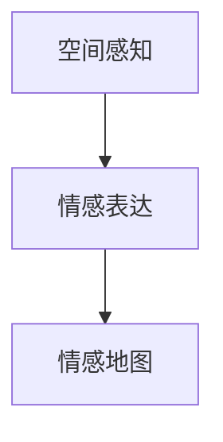
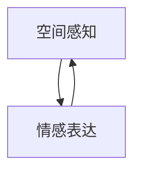

                 

### 引言

在城市规划与设计领域，传统的规划方法主要关注于功能性、效率和安全性等方面。然而，随着人们对于生活质量的追求不断提升，城市规划中的人文因素——尤其是情感因素——正逐渐受到广泛关注。情感地理学作为一门新兴的交叉学科，致力于研究空间与情感之间的复杂关系，为城市规划提供了全新的视角和方法。

情感地理学通过对个体情感体验的深入分析，探索情感在空间中的表现、分布和演变规律。这种研究不仅能够揭示城市环境中潜在的情感价值，还能为城市规划者提供科学依据，以创造出更加人性化和富有情感共鸣的城市空间。

本文将围绕情感地理学的理论框架、基本原理和方法论，以及其在城市规划中的应用，展开详细探讨。具体而言，我们将首先介绍情感地理学的起源和发展，梳理其核心概念与理论流派，并分析情感地理学在社会科学领域的影响。接着，本文将深入探讨情感地理学的基本原理，包括空间感知与情感表达、情感地图的制作方法和情感与空间的关系模型。随后，我们将讨论情感地理学的方法论，涵盖数据收集与处理技术、情感分析算法及应用，以及情感地理学在定量研究中的应用。

在第二部分，我们将聚焦于城市规划中的情感因素，分析城市设计中的情感考量、居民情感与城市规划的互动关系，以及情感地理学在城市更新中的应用。通过具体案例和实践，我们将展示情感地理学在改善城市空间品质、提升居民幸福感方面的重要作用。

第三部分将介绍情感地理学在城市规划中的实际应用，探讨情感地理学在城市规划中的工具与模型，以及情感地理学在城市规划中的挑战和未来趋势。最后，本文将总结情感地理学在城市规划中的潜在影响，并对读者提供拓展阅读和最佳实践建议。

通过本文的探讨，我们希望读者能够对情感地理学在城市规划中的应用有更深入的理解，认识到情感因素在塑造城市空间中的关键作用，从而为未来城市的设计与规划提供有益的参考。

### 关键词

- 情感地理学
- 城市规划
- 空间感知
- 情感表达
- 情感地图
- 数据收集
- 情感分析
- 情感强度
- 情感极性

### 摘要

本文旨在探讨情感地理学在城市规划中的应用，分析其理论框架、基本原理和方法论，以及在实际规划中的具体应用。情感地理学通过研究空间与情感之间的关系，为城市规划提供了全新的视角和方法。本文首先介绍了情感地理学的起源、核心概念和理论流派，探讨了情感地理学的基本原理和方法论，包括情感分析算法和数据收集技术。随后，本文重点分析了情感地理学在城市规划中的应用，涵盖了城市设计中的情感考量、居民情感与城市规划的互动关系以及城市更新中的应用。通过具体案例，本文展示了情感地理学在提升城市空间品质和居民幸福感方面的重要作用。最后，本文总结了情感地理学在城市规划中的潜在影响和未来发展趋势，为城市规划者提供了有益的参考。

### 目录大纲

## 第一部分：情感地理学的理论框架

### 第1章：情感地理学的起源与发展

#### 1.1 情感地理学的定义与核心概念

#### 1.2 情感地理学的主要理论流派

#### 1.3 情感地理学在社会科学领域的影响

### 第2章：情感地理学的基本原理

#### 2.1 空间感知与情感表达

#### 2.2 情感地图的制作方法

#### 2.3 情感与空间的关系模型

### 第3章：情感地理学的方法论

#### 3.1 数据收集与处理技术

#### 3.2 情感分析算法及应用

#### 3.3 情感地理学在定量研究中的应用

## 第二部分：城市规划中的情感因素

### 第4章：城市设计中的情感考量

#### 4.1 城市公共空间的情感营造

#### 4.2 城市交通系统的情感影响

#### 4.3 城市景观的情感表达

### 第5章：居民情感与城市规划

#### 5.1 居民参与规划的情感诉求

#### 5.2 城市社区的情感网络

#### 5.3 城市居民情感与城市规划的互动关系

### 第6章：情感地理学在城市更新中的应用

#### 6.1 城市老旧区域的情感修复

#### 6.2 城市有机更新的情感维度

#### 6.3 情感地理学在城市更新项目中的实践案例

## 第三部分：情感地理学在城市规划中的实际应用

### 第7章：情感地理学在城市规划中的工具与模型

#### 7.1 情感地图在城市规划中的应用

#### 7.2 情感分析在城市规划决策中的角色

#### 7.3 基于情感地理学的城市规划模型

### 第8章：情感地理学在城市规划中的挑战与未来趋势

#### 8.1 情感地理学在城市规划中的挑战

#### 8.2 情感地理学的未来发展趋势

#### 8.3 情感地理学在城市规划中的潜在影响

## 参考文献

## 附录

### 附录 A：情感地理学相关资源与工具

#### A.1 情感地理学相关书籍与论文

#### A.2 情感地理学分析工具

#### A.3 情感地理学实践案例研究

---

### 第1章：情感地理学的起源与发展

#### 1.1 情感地理学的定义与核心概念

情感地理学是一门研究空间与情感之间关系的跨学科领域，它结合了地理学、心理学、社会学以及人类学等学科的理论和方法，旨在探索人类在特定空间环境中的情感体验、情感表达及其对空间的影响。情感地理学的核心概念包括情感、空间、感知和表达等。

**情感**：情感是指个体在特定情境下产生的情绪反应和心理状态，如快乐、悲伤、愤怒、焦虑等。情感地理学关注情感在空间中的表现和作用，探究情感如何影响人类的行为、决策和生活方式。

**空间**：空间是情感地理学研究的核心对象。空间不仅指物理环境，还包括社会空间、文化空间和心理空间等。情感地理学关注空间对情感的影响，以及情感如何塑造和重构空间。

**感知**：感知是指个体对周围环境的认知和理解过程。情感地理学中的感知包括对空间特征、环境氛围、人际关系等方面的感知。个体通过感知来体验和解读空间中的情感。

**表达**：表达是指个体通过言语、行为、艺术等方式来传递和表达其情感状态。情感地理学关注情感表达的多样性及其在空间中的表现形式。

情感地理学的基本原理是通过研究这些核心概念之间的相互作用，揭示情感在空间中的表现规律，为城市规划、设计和管理提供科学依据。

#### 1.2 情感地理学的主要理论流派

情感地理学的发展历程中涌现出了多个理论流派，它们各自从不同的角度探讨了空间与情感之间的关系。

**1. 空间情感理论**

空间情感理论关注情感在空间中的生成和表现。这一理论认为，情感是在特定空间情境中产生的，不同的空间特征和氛围会影响情感的产生和变化。空间情感理论的核心观点是，情感是空间体验的一部分，空间对情感有显著的影响。

**2. 情感空间理论**

情感空间理论强调情感对空间的塑造作用。该理论认为，情感不仅受到空间的物理特征影响，还会通过情感体验和表达来改变空间。情感空间理论关注的是情感如何影响空间布局、设计和管理，以及如何通过情感设计来提升空间品质。

**3. 情境情感理论**

情境情感理论关注情感与情境之间的关系。该理论认为，情感是在特定情境下产生的，情境因素如文化、社会背景、人际关系等对情感有重要影响。情境情感理论强调情境的重要性，认为情境是理解情感的关键。

**4. 情感行为理论**

情感行为理论关注情感对个体行为的影响。该理论认为，情感会直接影响个体的行为选择和决策。情感行为理论强调情感与行为之间的紧密联系，认为情感通过行为表达来影响空间使用和空间结构。

这些理论流派相互补充，共同构建了情感地理学的理论框架，为研究空间与情感之间的关系提供了多样化的视角和方法。

#### 1.3 情感地理学在社会科学领域的影响

情感地理学的出现和发展为社会科学领域带来了新的研究思路和方法。它不仅丰富了地理学的研究内容，还对心理学、社会学、城市规划等领域产生了深远影响。

**1. 心理学领域的拓展**

情感地理学关注情感的空间维度，为心理学研究提供了新的方向。通过情感地理学的方法，心理学家可以更全面地理解个体的情感体验，探索情感在空间中的表现和机制。情感地理学促进了心理学与地理学的交叉研究，推动了空间心理学的发展。

**2. 社会学领域的深化**

情感地理学为社会学研究提供了新的视角。社会学家通过情感地理学的方法，可以更好地理解社会群体的情感互动和情感表达，揭示情感在社会关系和社会行为中的作用。情感地理学促进了社会学对空间和情感之间复杂关系的认识，丰富了社会学的研究内容。

**3. 城市规划领域的创新**

情感地理学对城市规划领域产生了重要影响。城市规划者通过情感地理学的方法，可以更深入地了解居民的情感需求和情感体验，从而设计出更加人性化和富有情感共鸣的城市空间。情感地理学为城市规划提供了新的工具和方法，推动了城市规划的创新和发展。

总之，情感地理学作为一门新兴的交叉学科，不仅在理论上丰富了社会科学的研究内容，还在实践中为城市规划、设计和管理提供了科学依据和实用工具。随着情感地理学的发展，其在社会科学领域的影响将越来越广泛和深远。

#### 1.4 情感地理学的核心概念与联系

情感地理学的核心概念包括空间感知、情感表达和情感地图等，这些概念相互联系，共同构成了情感地理学的研究基础。

**空间感知**：空间感知是指个体对周围环境的空间位置、布局和结构的感知。空间感知是情感地理学研究的重要方面，因为个体对空间的感知会影响其情感体验。空间感知包括物理空间的感知，如建筑、街道和公园等，也包括社会空间的感知，如社区关系和社会互动。

**情感表达**：情感表达是指个体通过言语、行为、艺术等方式表达其情感状态。情感表达是情感地理学研究的另一个核心概念，因为情感表达不仅反映了个体对空间的情感体验，还能影响他人对空间的情感反应。情感表达可以通过语言、肢体语言、艺术作品等多种形式进行。

**情感地图**：情感地图是一种用于呈现某个空间区域内情感分布和情感的强度的一种可视化工具。情感地图通过颜色、符号和文字等元素，直观地展示空间中的情感特征。情感地图可以帮助研究者了解空间情感的整体分布，以及不同区域之间的情感差异。

这些核心概念之间的关系可以表示为以下 Mermaid 流程图：



通过这种关系架构，我们可以看到空间感知、情感表达和情感地图是如何相互联系，共同构建情感地理学的研究框架的。

#### 1.5 小结

本章介绍了情感地理学的起源、定义与核心概念，以及情感地理学的主要理论流派。我们探讨了情感地理学在社会科学领域的影响，并分析了核心概念之间的联系。通过本章的学习，读者可以初步了解情感地理学的基本理论框架和研究内容，为后续章节的深入学习打下基础。

### 第2章：情感地理学的基本原理

#### 2.1 空间感知与情感表达

空间感知与情感表达是情感地理学中的两个核心概念，它们在个体对空间环境的体验和互动中起着至关重要的作用。

**空间感知**：空间感知是指个体对周围环境的空间位置、布局和结构的认知过程。它包括对物理环境的感知，如建筑、街道、公园等，以及社会环境的感知，如社区关系和社会互动。空间感知不仅是视觉、听觉和触觉等感官信息的整合，还涉及心理过程，如记忆、期望和情感等。

空间感知对情感表达有着重要影响。不同的空间特征和环境因素会影响个体的情绪状态和情感体验。例如，宽敞明亮的公共空间可能会引发愉悦和放松的情感，而狭窄拥挤的空间则可能导致紧张和焦虑。空间感知还与个体的情感记忆相关，过去在特定空间中的情感体验会影响当前的情感反应。

**情感表达**：情感表达是指个体通过言语、行为、艺术等方式表达其情感状态。情感表达不仅是个体内心的外显，还反映了个体与空间环境之间的互动。情感表达可以通过多种形式进行，包括语言、肢体语言、艺术作品等。

情感表达与空间感知密切相关。空间环境中的情感因素会影响个体的情感表达。例如，一个温馨舒适的居住环境可能会促使居民更加愿意表达友好和亲切的情感。相反，一个压抑和不安全的环境可能会抑制情感表达，导致个体情感压抑或恐惧。

**空间感知与情感表达的关系**：空间感知和情感表达是相互影响的动态过程。空间感知为情感表达提供基础，而情感表达又反过来影响空间感知。这种互动关系可以表示为以下 Mermaid 流程图：



通过这种关系，我们可以看到空间感知和情感表达是如何相互交织，共同塑造个体对空间的情感体验。例如，一个居民在欣赏城市公园的美景时，会产生愉悦的情感，并通过微笑、拍照等方式表达出来。这种情感表达不仅增强了居民对公园的喜爱，也可能吸引更多居民前来共享，从而进一步提升了公园的空间品质。

总之，空间感知与情感表达是情感地理学中的基本原理，它们在个体对空间环境的体验和互动中起着关键作用。理解这些原理有助于我们更好地设计和管理空间，以创造更加人性化和富有情感共鸣的环境。

#### 2.2 情感地图的制作方法

情感地图是情感地理学中一种重要的可视化工具，用于呈现某个空间区域内情感的分布和强度。制作情感地图的过程包括数据收集、情感分析、地图可视化等多个步骤。以下是制作情感地图的基本方法：

**1. 数据收集**：

情感地图的数据来源可以是多种多样的，包括问卷调查、访谈、社交媒体数据、地理信息系统（GIS）数据等。问卷调查和访谈可以直接获取居民对特定空间区域情感体验的定量和定性信息。社交媒体数据如微博、Twitter、Instagram等平台，可以通过分析用户发布的内容和标签，获取关于空间情感的实时数据。GIS数据则可以提供详细的空间信息，如地理坐标、建筑高度、交通流量等。

**2. 情感分析**：

情感分析是制作情感地图的关键步骤，它通过对收集到的文本数据进行情感极性和情感强度的分析，将情感信息量化为可操作的指标。常用的情感分析工具包括自然语言处理（NLP）库如TextBlob、VADER等。以下是一个使用TextBlob进行情感分析的基本示例：

```python
from textblob import TextBlob

text = "这个公园的风景很美，我很喜欢在这里散步。"
blob = TextBlob(text)
polarity = blob.sentiment.polarity
print(f"文本情感极性：{polarity}")
```

情感极性（polarity）的值在[-1, 1]之间，-1表示负面情感，0表示中性情感，1表示正面情感。此外，还可以通过计算情感强度（intensity）来进一步量化情感，常用的情感强度模型如以下公式：

$$
intensity = |polarity| \times (1 + \frac{pos + neg}{max_pos + max_neg})
$$

其中，$pos$ 和 $neg$ 分别表示正面和负面词汇的词频，$max_pos$ 和 $max_neg$ 分别表示正面和负面词汇的最大词频。

**3. 地图可视化**：

情感分析完成后，可以使用GIS工具将情感数据可视化，制作情感地图。以下是一个使用Python的GIS库GeoPandas制作情感地图的基本示例：

```python
import geopandas as gpd
import matplotlib.pyplot as plt

# 读取GIS数据
gdf = gpd.read_file(' parks.shp ')

# 添加情感数据
gdf['sentiment'] = blob.sentiment.polarity

# 绘制情感地图
gdf.plot(column='sentiment', cmap='RdYlGn', legend=True)
plt.show()
```

在这个示例中，`parks.shp`是一个包含公园地理位置和名称的GIS数据文件，通过添加情感数据`sentiment`，并使用GeoPandas库进行绘图，我们可以得到一个展示情感分布的情感地图。

**4. 互动性情感地图**：

为了增强情感地图的互动性和实用性，还可以考虑开发基于Web的互动性情感地图。以下是一个使用Python的Web框架Flask制作互动性情感地图的基本示例：

```python
from flask import Flask, render_template

app = Flask(__name__)

@app.route('/')
def index():
    return render_template('index.html', sentiment_data=gdf.to_dict('records'))

if __name__ == '__main__':
    app.run(debug=True)
```

在`index.html`模板中，可以使用JavaScript和D3.js库将GIS数据可视化，并实现用户交互功能。以下是一个使用D3.js绘制互动性情感地图的基本示例：

```html
<!DOCTYPE html>
<html>
<head>
    <script src="https://d3js.org/d3.v7.min.js"></script>
</head>
<body>
    <div id="map"></div>

    <script>
        var width = 800, height = 500;

        var projection = d3.geoMercator().center(0, 0).scale(1000).translate([width / 2, height / 2]);

        var path = d3.geoPath().projection(projection);

        d3.json('data/parks.geojson', function(data) {
            d3.select('#map').selectAll('path').data(data.features).enter().append('path').attr('d', path).attr('fill', function(d) {
                return d.properties.sentiment > 0 ? 'green' : 'red';
            });
        });
    </script>
</body>
</html>
```

通过这些步骤，我们可以制作出具备互动性和可视化能力的情感地图，为城市规划者和居民提供直观、实用的情感数据分析工具。

#### 2.3 情感与空间的关系模型

情感与空间的关系是情感地理学研究的核心问题，揭示这种关系的模型有助于我们更好地理解和应用情感地理学原理。以下几种关系模型在情感地理学中具有重要意义：

**1. 位置-情感模型**

位置-情感模型（Position-Affect Model）是一种经典的关系模型，它认为情感是由特定空间位置和情境因素共同作用的结果。具体来说，该模型将情感体验分为愉悦度（Pleasantness）和唤醒度（Arousal）两个维度，并通过位置和情境因素来调节这两个维度。例如，一个安静、舒适的公园可能引发愉悦和放松的情感，而一个嘈杂、拥挤的城市街道可能引发焦虑和紧张的情感。

位置-情感模型可以用以下公式表示：

$$
Affect = f( Pleasantness, Arousal, Position, Context )
$$

其中，$Affect$ 表示情感，$Pleasantness$ 和 $Arousal$ 分别表示愉悦度和唤醒度，$Position$ 和 $Context$ 分别表示位置和情境。

**2. 心理地图模型**

心理地图模型（Mental Mapping Model）强调个体在心理上构建空间地图的过程，并认为情感体验与个体对空间的心理认知密切相关。该模型认为，个体通过对空间特征的感知和记忆，构建出一个心理地图，这个地图不仅包括物理空间的特征，还包括社会、文化和情感特征。情感体验是心理地图中各个节点的情感状态与路径的累积效果。

心理地图模型可以用以下公式表示：

$$
SpatialExperience = \sum_{i=1}^{n} ( Node\_Affect \times Node\_Distance )
$$

其中，$SpatialExperience$ 表示空间体验，$Node\_Affect$ 表示节点情感状态，$Node\_Distance$ 表示节点之间的距离。

**3. 交互性情感模型**

交互性情感模型（Interactive Affective Model）关注情感体验与空间互动的关系，认为情感体验不仅受空间特征影响，还受个体与空间互动的方式和频率影响。该模型强调情感体验的动态性和多样性，认为情感体验可以通过交互行为、社交互动和文化活动等途径进行调整和改变。

交互性情感模型可以用以下公式表示：

$$
AffectiveExperience = f( Space\_Features, Interaction\_Modes, CulturalActivities )
$$

其中，$AffectiveExperience$ 表示情感体验，$Space\_Features$ 表示空间特征，$Interaction\_Modes$ 表示互动方式，$CulturalActivities$ 表示文化活动。

**4. 情感行为模型**

情感行为模型（Affective Behavior Model）关注情感对个体行为的影响，认为情感体验通过影响个体的行为选择和决策，进而影响空间使用和空间结构。该模型认为，情感体验不仅影响个体的情感状态，还会通过行为表达来影响他人对空间的情感体验。

情感行为模型可以用以下公式表示：

$$
Behavior = f( AffectiveState, Space\_Use, SocialContext )
$$

其中，$Behavior$ 表示行为选择，$AffectiveState$ 表示情感状态，$Space\_Use$ 表示空间使用，$SocialContext$ 表示社会情境。

这些关系模型为我们理解和分析情感与空间之间的关系提供了多样化的视角和方法。在实际应用中，可以根据具体研究目的和情境，选择合适的关系模型进行分析和设计，以提升空间品质和居民幸福感。

#### 2.4 情感地理学的方法论

情感地理学作为一门跨学科领域，其方法论涵盖了数据收集、情感分析和空间可视化等多个环节。这些方法不仅为研究空间与情感之间的关系提供了科学依据，也为城市规划、设计和评估提供了实用工具。以下是情感地理学的方法论详细介绍。

**1. 数据收集与处理技术**

情感地理学的数据收集环节包括定量和定性方法。定量方法通常通过问卷调查、访谈、实验等方式获取居民的情感体验数据。问卷调查是一种常用的定量数据收集方法，可以采用Likert量表、情感词汇评定等方法来量化情感体验。以下是一个简单的问卷调查示例：

```
1. 你对这个公园的总体感觉是？
   非常不满意 非常满意
2. 你在这里散步时感到？
   非常紧张 非常放松
3. 你对这个公园的风景感到？
   非常不喜欢 非常喜欢
```

定性方法则通过深度访谈、观察和参与式观察等方式获取居民的详细情感体验。访谈可以深入了解居民的情感需求和偏好，观察和参与式观察则可以捕捉到居民在空间中的实际情感体验。

数据收集完成后，需要对数据进行处理和分析。常用的数据处理技术包括数据清洗、数据转换和数据可视化等。数据清洗是去除重复、缺失和异常数据的过程，数据转换是将数据格式化以便于分析的步骤，数据可视化则是通过图表、地图等可视化工具展示数据特征。

**2. 情感分析算法及应用**

情感分析是情感地理学中的关键环节，它通过自然语言处理（NLP）技术对文本数据进行情感极性和情感强度的分析。情感极性分析用于判断文本的情感倾向，通常使用TextBlob、VADER等NLP库。以下是一个使用TextBlob进行情感分析的基本示例：

```python
from textblob import TextBlob

text = "这个公园很美，我喜欢在这里散步。"
blob = TextBlob(text)
polarity = blob.sentiment.polarity
print(f"文本情感极性：{polarity}")
```

情感极性（polarity）的值在[-1, 1]之间，-1表示负面情感，0表示中性情感，1表示正面情感。情感强度分析则通过计算情感极性的绝对值和词汇的频率，进一步量化情感强度。常用的情感强度模型包括以下公式：

$$
intensity = |polarity| \times (1 + \frac{pos + neg}{max_pos + max_neg})
$$

其中，$pos$ 和 $neg$ 分别表示正面和负面词汇的词频，$max_pos$ 和 $max_neg$ 分别表示正面和负面词汇的最大词频。

情感分析不仅限于文本数据，还可以应用于社交媒体数据、音频和视频等多媒体数据。例如，通过语音识别和情感识别技术，可以对社交媒体平台的语音评论进行分析，以获取情感数据。

**3. 空间可视化技术**

空间可视化是情感地理学中另一个重要的方法，它通过地图、图表等形式展示情感数据的空间分布和特征。常用的空间可视化工具包括GeoPandas、QGIS和ArcGIS等。以下是一个使用GeoPandas制作情感地图的基本示例：

```python
import geopandas as gpd
import matplotlib.pyplot as plt

# 读取GIS数据
gdf = gpd.read_file('parks.shp')

# 添加情感数据
gdf['sentiment'] = blob.sentiment.polarity

# 绘制情感地图
gdf.plot(column='sentiment', cmap='RdYlGn', legend=True)
plt.show()
```

在这个示例中，`parks.shp`是一个包含公园地理位置和名称的GIS数据文件，通过添加情感数据`sentiment`，并使用GeoPandas库进行绘图，我们可以得到一个展示情感分布的情感地图。

**4. 情感地理学在定量研究中的应用**

情感地理学在定量研究中的应用广泛，涵盖了城市设计、社区规划、交通系统等多个领域。以下是一个城市设计中的情感地理学定量研究案例：

**案例**：研究城市公园的情感吸引力

**步骤**：

1. 设计问卷调查，收集居民对城市公园的情感体验数据。
2. 使用TextBlob对问卷数据进行情感分析，获取情感极性。
3. 将情感极性数据与GIS数据进行整合，制作情感地图。
4. 分析情感地图，识别高情感吸引力的公园区域。
5. 基于情感分析结果，提出改进城市公园设计的建议。

通过上述步骤，研究者可以量化城市公园的情感吸引力，为城市设计提供科学依据。

总之，情感地理学的方法论通过数据收集、情感分析和空间可视化等技术，为研究空间与情感之间的关系提供了系统的方法和工具。这些方法不仅有助于揭示情感在空间中的分布和特征，还能为城市规划、设计和管理提供科学依据，从而提升城市空间品质和居民幸福感。

### 第3章：情感地理学在城市规划中的具体应用

#### 3.1 城市设计中的情感考量

在城市设计过程中，情感考量已成为提升城市空间品质和居民幸福感的重要环节。情感地理学为城市设计提供了理论框架和方法工具，帮助规划者更好地理解和把握空间中的情感因素。

**1. 公共空间情感营造**

公共空间是城市居民日常活动的场所，其情感氛围直接影响居民的情感体验。情感地理学通过情感分析技术和空间可视化手段，可以识别和评估公共空间中的情感特征，如愉悦度、安全感、舒适度等。

**案例**：某城市广场情感氛围评估

**步骤**：

1. 设计问卷调查，收集居民对城市广场的情感体验数据。
2. 使用情感分析工具对问卷数据进行情感极性和强度分析。
3. 制作情感地图，识别情感热点和冷点区域。
4. 根据情感分析结果，提出改善城市广场设计的建议。

通过上述步骤，规划者可以针对性地调整城市广场的布局、景观设计和服务设施，以营造更加符合居民情感需求的公共空间。

**2. 景观设计中的情感表达**

景观设计不仅需要考虑美学因素，还应注重情感表达。情感地理学通过研究空间感知与情感表达的关系，帮助设计师在景观设计中融入情感元素，提升景观的吸引力和体验感。

**案例**：公园景观情感设计

**步骤**：

1. 分析公园中的情感节点，如景观雕塑、休闲设施、水景等。
2. 使用情感分析工具评估这些节点的情感特征和居民反馈。
3. 根据情感分析结果，设计符合情感需求的景观元素。
4. 通过互动性情感地图，展示景观设计中的情感分布和特征。

这种设计方法不仅能提升公园的视觉美感和功能实用性，还能增强居民的情感体验和归属感。

**3. 建筑设计中的情感考量**

建筑设计中，情感考量体现在建筑形式、材料选择、空间布局等方面。情感地理学通过情感分析技术，可以帮助设计师了解居民对建筑的情感反应，从而优化建筑设计。

**案例**：住宅小区情感设计

**步骤**：

1. 收集居民对住宅小区的情感体验数据，包括建筑外观、内部空间、公共设施等。
2. 使用情感分析工具对数据进行情感极性和强度分析。
3. 根据情感分析结果，优化住宅小区的设计，如建筑形式、色彩搭配、空间布局等。
4. 通过互动性情感地图，展示住宅小区的情感特征和居民反馈。

通过这种设计方法，可以创造出更加人性化和富有情感共鸣的住宅空间，提升居民的生活质量和满意度。

#### 3.2 居民情感与城市规划的互动关系

居民情感在城市规划中具有重要的地位，它们不仅影响城市规划的决策过程，还直接影响城市空间的使用和体验。情感地理学通过研究居民情感与城市规划的互动关系，为城市规划提供了科学依据。

**1. 居民情感诉求的识别**

居民情感诉求是城市规划的重要参考，通过情感地理学的方法，可以识别和评估居民对城市空间的情感需求。

**案例**：某城市社区的居民情感需求分析

**步骤**：

1. 设计问卷调查，收集居民对社区的情感体验数据。
2. 使用情感分析工具对问卷数据进行情感极性和强度分析。
3. 制作情感地图，识别居民情感需求的分布和特征。
4. 根据情感分析结果，制定符合居民情感诉求的社区规划方案。

通过这种方式，规划者可以更好地理解居民的情感需求，确保城市规划方案更符合居民的实际需求。

**2. 情感地理学在社区规划中的应用**

情感地理学在社区规划中的应用，旨在通过情感分析和空间设计，提升社区的空间品质和居民幸福感。

**案例**：某社区情感规划

**步骤**：

1. 分析社区中的情感节点，如公共空间、绿地、设施等。
2. 使用情感分析工具评估这些节点的情感特征和居民反馈。
3. 根据情感分析结果，优化社区设计，如增加情感共鸣的设施、改善公共空间布局等。
4. 通过互动性情感地图，展示社区情感分布和居民反馈。

这种规划方法不仅提升了社区的功能性和美观度，还增强了居民的情感归属感和满意度。

**3. 情感地理学在城市规划决策中的角色**

情感地理学在城市规划决策中扮演着重要角色，它通过提供情感数据分析，帮助规划者做出更加科学和合理的决策。

**案例**：某城市新区的规划决策

**步骤**：

1. 收集新区的情感数据，包括居民反馈、社交媒体评论等。
2. 使用情感分析工具对数据进行情感极性和强度分析。
3. 根据情感分析结果，评估不同规划方案的居民接受度和情感影响。
4. 基于情感分析结果，提出优化新区的规划建议。

通过这种方式，规划者可以更好地把握居民的期望和需求，制定出更加符合居民情感的城市规划方案。

总之，情感地理学在城市规划中的应用，不仅有助于提升城市空间品质和居民幸福感，还能为规划决策提供科学依据。通过情感分析、空间设计和互动性情感地图等手段，规划者可以更好地理解居民的情感需求，创造出更加人性化和富有情感共鸣的城市空间。

#### 3.3 情感地理学在城市更新中的应用

城市更新是提升城市空间品质和居民生活质量的重要手段，而情感地理学则为城市更新提供了新的视角和工具。通过情感分析技术和空间可视化手段，情感地理学可以帮助规划者更好地理解城市中的情感需求，优化城市更新项目的设计与实施。

**1. 城市老旧区域的情感修复**

城市老旧区域通常存在功能不足、设施陈旧、环境恶化等问题，而情感地理学可以为这些区域的改造提供科学依据。通过情感分析，可以识别老旧区域中居民的情感需求和不满之处，从而有针对性地进行改造。

**案例**：某城市老旧社区的改造

**步骤**：

1. 设计问卷调查，收集居民对老旧社区的情感体验数据。
2. 使用情感分析工具对问卷数据进行情感极性和强度分析。
3. 制作情感地图，识别情感热点和冷点区域。
4. 根据情感分析结果，制定老旧社区改造方案，如改善公共空间、增加绿地、优化交通系统等。

通过这种改造方法，不仅可以提升老旧社区的功能性和美观度，还能增强居民的情感归属感和满意度。

**2. 城市有机更新的情感维度**

城市有机更新强调在保护历史文化遗产的基础上，通过渐进式、可持续的方式提升城市空间品质。情感地理学通过情感分析，可以帮助规划者把握城市有机更新过程中的情感变化，从而优化更新策略。

**案例**：某历史街区有机更新

**步骤**：

1. 分析历史街区的情感节点，如古迹、广场、商业街等。
2. 使用情感分析工具评估这些节点的情感特征和居民反馈。
3. 根据情感分析结果，制定有机更新方案，如修复古迹、改善交通流线、增加公共休闲设施等。
4. 通过互动性情感地图，展示更新前后的情感变化和居民反馈。

这种有机更新方法不仅保护了历史文化遗产，还提升了居民的情感体验和满意度。

**3. 情感地理学在城市更新项目中的实践案例**

情感地理学在城市更新项目中的应用已经取得了一系列成功案例。以下是一些实践案例：

- **某城市公园改造**：通过情感分析评估公园的情感特征，优化公园设计，提升了公园的居民满意度。
- **某历史街区更新**：通过情感地理学的方法，保护了历史文化遗产，同时提升了街区的功能性和情感价值。
- **某城市交通枢纽改造**：通过情感分析，优化了交通枢纽的空间布局和服务设施，提升了居民的出行体验。

这些实践案例表明，情感地理学在城市更新中的应用，不仅有助于提升城市空间品质和居民幸福感，还能为城市规划者提供科学依据和实用工具。

总之，情感地理学在城市更新中的应用，为城市空间的改造和提升提供了新的方法和思路。通过情感分析、空间可视化和互动性情感地图等手段，规划者可以更好地理解城市中的情感需求，制定出更加科学和合理的城市更新方案，从而提升城市空间的整体品质和居民的生活满意度。

### 第7章：情感地理学在城市规划中的工具与模型

#### 7.1 情感地图在城市规划中的应用

情感地图是情感地理学中最常用的工具之一，它通过可视化手段呈现空间中的情感分布和强度，为城市规划提供了直观的参考。情感地图的制作和应用主要包括以下几个步骤：

**1. 数据收集**：

情感地图的数据来源可以是多种多样的，包括居民问卷调查、社交媒体数据、实地观察和地理信息系统（GIS）数据等。问卷调查可以获取居民对特定空间区域的情感体验，社交媒体数据可以反映公众对某个空间的情感反应，GIS数据则提供了详细的空间信息。

**2. 情感分析**：

情感分析是制作情感地图的核心步骤。常用的情感分析工具包括自然语言处理（NLP）库如TextBlob、VADER等。这些工具可以分析文本数据中的情感极性和强度。以下是一个使用TextBlob进行情感分析的基本示例：

```python
from textblob import TextBlob

text = "这个公园很美，我喜欢在这里散步。"
blob = TextBlob(text)
polarity = blob.sentiment.polarity
print(f"文本情感极性：{polarity}")
```

情感极性（polarity）的值在[-1, 1]之间，-1表示负面情感，0表示中性情感，1表示正面情感。此外，还可以通过计算情感强度（intensity）来进一步量化情感，常用的情感强度模型如以下公式：

$$
intensity = |polarity| \times (1 + \frac{pos + neg}{max_pos + max_neg})
$$

其中，$pos$ 和 $neg$ 分别表示正面和负面词汇的词频，$max_pos$ 和 $max_neg$ 分别表示正面和负面词汇的最大词频。

**3. 地图可视化**：

情感分析完成后，可以使用GIS工具将情感数据可视化，制作情感地图。以下是一个使用Python的GIS库GeoPandas制作情感地图的基本示例：

```python
import geopandas as gpd
import matplotlib.pyplot as plt

# 读取GIS数据
gdf = gpd.read_file(' parks.shp ')

# 添加情感数据
gdf['sentiment'] = blob.sentiment.polarity

# 绘制情感地图
gdf.plot(column='sentiment', cmap='RdYlGn', legend=True)
plt.show()
```

在这个示例中，`parks.shp`是一个包含公园地理位置和名称的GIS数据文件，通过添加情感数据`sentiment`，并使用GeoPandas库进行绘图，我们可以得到一个展示情感分布的情感地图。

**4. 互动性情感地图**：

为了增强情感地图的互动性和实用性，还可以考虑开发基于Web的互动性情感地图。以下是一个使用Python的Web框架Flask制作互动性情感地图的基本示例：

```python
from flask import Flask, render_template

app = Flask(__name__)

@app.route('/')
def index():
    return render_template('index.html', sentiment_data=gdf.to_dict('records'))

if __name__ == '__main__':
    app.run(debug=True)
```

在`index.html`模板中，可以使用JavaScript和D3.js库将GIS数据可视化，并实现用户交互功能。以下是一个使用D3.js绘制互动性情感地图的基本示例：

```html
<!DOCTYPE html>
<html>
<head>
    <script src="https://d3js.org/d3.v7.min.js"></script>
</head>
<body>
    <div id="map"></div>

    <script>
        var width = 800, height = 500;

        var projection = d3.geoMercator().center(0, 0).scale(1000).translate([width / 2, height / 2]);

        var path = d3.geoPath().projection(projection);

        d3.json('data/parks.geojson', function(data) {
            d3.select('#map').selectAll('path').data(data.features).enter().append('path').attr('d', path).attr('fill', function(d) {
                return d.properties.sentiment > 0 ? 'green' : 'red';
            });
        });
    </script>
</body>
</html>
```

通过这些步骤，我们可以制作出具备互动性和可视化能力的情感地图，为城市规划者和居民提供直观、实用的情感数据分析工具。

#### 7.2 情感分析在城市规划决策中的角色

情感分析在城市规划决策中扮演着重要角色，它通过量化居民的情感体验和反馈，为规划者提供了科学的决策依据。情感分析的应用不仅可以帮助识别空间中的情感热点和问题区域，还能指导规划方案的优化和调整。

**1. 情感分析的步骤**：

情感分析在城市规划中的具体步骤包括数据收集、情感提取、情感分类和情感可视化等。

- **数据收集**：通过问卷调查、社交媒体数据收集、实地访谈等方式获取居民的情感体验数据。
- **情感提取**：使用自然语言处理（NLP）技术提取文本数据中的情感信息，常用的情感分析库包括TextBlob、VADER等。
- **情感分类**：将提取的情感信息分类为正面、负面或中性，以便于进一步分析和应用。
- **情感可视化**：通过图表、地图等形式将情感分析结果可视化，帮助规划者直观理解居民的情感需求。

**2. 情感分析的应用**：

情感分析在城市规划中的应用主要体现在以下几个方面：

- **居民参与规划**：通过情感分析，规划者可以了解居民对规划方案的情感反应，从而更好地回应居民的需求和期望，增强规划方案的公众参与度。
- **空间评估**：情感分析可以帮助评估城市空间的质量和居民满意度，识别需要改进的领域，如公共空间设计、交通系统、社区服务设施等。
- **规划方案优化**：基于情感分析结果，规划者可以对规划方案进行优化，如调整空间布局、增加情感共鸣的设施、改善公共服务等。

**案例**：某城市新区规划方案的情感分析

**步骤**：

1. 设计问卷调查，收集居民对新区规划方案的情感体验数据。
2. 使用情感分析工具（如TextBlob）对问卷数据进行情感极性和强度分析。
3. 制作情感地图，展示居民对不同区域的情感分布。
4. 根据情感分析结果，优化新区规划方案，如调整公共空间设计、改善交通流线等。

通过这种方式，规划者可以更好地把握居民的情感需求，制定出更加符合居民期望的规划方案。

#### 7.3 基于情感地理学的城市规划模型

基于情感地理学的城市规划模型结合了情感分析和空间可视化技术，旨在通过情感数据驱动城市规划决策，提升城市空间的情感质量和居民满意度。以下是一种基于情感地理学的城市规划模型的基本框架：

**1. 数据层**：

数据层是模型的基础，包括居民情感数据、空间数据和社会经济数据等。情感数据可以通过问卷调查、社交媒体分析、传感器监测等方式收集；空间数据可以来源于地理信息系统（GIS）；社会经济数据则包括人口统计、经济指标等。

**2. 情感分析层**：

情感分析层对收集到的情感数据进行处理和分析，包括情感提取、情感分类和情感强度计算等。常用的情感分析工具如TextBlob、VADER等，可以用于量化居民的情感体验。

**3. 情感可视化层**：

情感可视化层通过图表、地图等形式将情感分析结果可视化，帮助规划者直观理解空间中的情感特征。情感地图是情感可视化的一种常见形式，可以显示情感热点和冷点区域。

**4. 规划决策层**：

规划决策层基于情感分析结果，结合空间数据和社会经济数据，生成具体的规划建议。规划决策可以包括空间布局优化、设施配置调整、公共服务改进等。

**5. 实施与反馈层**：

实施与反馈层负责将规划建议转化为实际操作，并持续收集居民反馈，以评估规划方案的实施效果。通过循环反馈机制，规划者可以不断优化规划方案，提升城市空间的情感质量。

**模型流程**：

1. **数据收集**：收集居民情感数据、空间数据和社会经济数据。
2. **情感分析**：使用情感分析工具对情感数据进行处理和分析，生成情感地图和情感报告。
3. **情感可视化**：将情感分析结果可视化，生成情感地图和情感图表。
4. **规划决策**：基于情感分析结果和空间数据，生成规划建议和优化方案。
5. **实施与反馈**：实施规划方案，并持续收集居民反馈，进行规划效果评估和调整。

通过这种基于情感地理学的城市规划模型，规划者可以更加科学和系统地考虑情感因素，提升城市空间的情感质量和居民满意度。

### 第8章：情感地理学在城市规划中的挑战与未来趋势

#### 8.1 情感地理学在城市规划中的挑战

尽管情感地理学在城市规划中展示了巨大的潜力，但在实际应用中仍面临诸多挑战。以下是情感地理学在城市规划中的一些主要挑战：

**1. 数据收集的挑战**

情感地理学依赖于大量的情感数据，这些数据来源多样，包括问卷调查、社交媒体、传感器监测等。然而，数据的收集过程常常面临以下挑战：

- **数据质量**：情感数据往往具有一定的主观性和复杂性，难以确保数据的一致性和可靠性。
- **数据隐私**：社交媒体数据和其他个人数据的收集和处理需要严格遵循隐私保护法规，这对数据收集过程提出了更高的要求。
- **数据获取**：获取高质量的情感数据需要大量的时间和资源，特别是在数据分散、获取难度较大的情况下。

**2. 情感分析的挑战**

情感地理学中的情感分析是关键步骤，但分析过程本身也存在一些挑战：

- **情感复杂性**：情感表达往往具有多样性和复杂性，情感分析工具可能难以捕捉到所有细微的情感变化。
- **情感多义性**：某些词汇和表达可能在不同的语境下具有不同的情感倾向，这增加了情感分析的难度。
- **情感模型的选择**：不同的情感模型可能适用于不同类型的数据和场景，选择合适的模型需要深入的研究和实践。

**3. 规划实施的挑战**

情感地理学在城市规划中的应用最终需要转化为实际的规划方案和实施行动。这一过程中面临的挑战包括：

- **政策支持**：情感地理学的应用需要政策支持和资金投入，但现有的政策环境和资金来源可能不足以支持大规模的应用。
- **公众参与**：情感地理学的应用需要广泛公众参与，但如何有效引导和鼓励公众参与是一个挑战。
- **技术整合**：将情感地理学的方法和工具整合到现有的城市规划技术体系中，需要解决技术兼容性和实施难度等问题。

#### 8.2 情感地理学的未来发展趋势

尽管存在挑战，情感地理学在城市规划中的应用前景仍然广阔。以下是情感地理学未来发展的几个趋势：

**1. 技术进步**

随着人工智能、大数据和机器学习等技术的发展，情感地理学的数据处理和分析能力将得到显著提升。新的情感分析算法和模型将更精确地捕捉和量化情感，为城市规划提供更加可靠的依据。

**2. 跨学科合作**

情感地理学的发展需要地理学、心理学、社会学、人类学等多个学科的合作。通过跨学科合作，可以整合不同领域的知识和方法，提高情感地理学的研究深度和广度。

**3. 应用扩展**

情感地理学不仅在城市规划中具有重要应用，还可以扩展到其他领域，如公共健康、交通管理、环境规划等。随着应用的扩展，情感地理学的理论和实践将得到更加全面和深入的发展。

**4. 社会参与**

情感地理学的应用需要公众的广泛参与，未来将更加注重公众参与和互动。通过互动性情感地图和在线平台，公众可以更加方便地提供情感数据和反馈，参与城市规划过程。

**5. 规划智能化**

结合情感地理学的分析结果和智能规划技术，未来的城市规划将更加智能化。智能规划系统可以根据情感数据自动生成优化方案，提高规划效率和科学性。

总之，情感地理学在城市规划中的应用面临着诸多挑战，但也拥有广阔的发展前景。通过技术创新、跨学科合作和公众参与，情感地理学有望为城市规划带来新的变革，提升城市空间的质量和居民幸福感。

### 结论

情感地理学作为一门新兴的交叉学科，通过研究空间与情感之间的关系，为城市规划提供了全新的视角和方法。本文详细探讨了情感地理学的理论框架、基本原理和方法论，分析了情感地理学在城市规划中的应用，包括城市设计、居民情感互动和城市更新等方面。通过具体案例和实践，我们展示了情感地理学在城市空间品质提升和居民幸福感增强方面的重要作用。

情感地理学的核心概念包括空间感知、情感表达和情感地图等，这些概念相互关联，共同构成了情感地理学的研究基础。情感地理学的方法论涵盖了数据收集、情感分析和空间可视化等多个环节，为研究空间与情感之间的关系提供了系统的方法和工具。在实际应用中，情感地理学通过情感地图、情感分析工具和互动性情感地图等手段，帮助规划者更好地理解居民的情感需求和情感体验，制定出更加科学和合理的规划方案。

未来，随着人工智能、大数据和机器学习等技术的进步，情感地理学的数据处理和分析能力将得到进一步提升。跨学科合作和公众参与将成为情感地理学发展的重要趋势。城市规划者可以充分利用情感地理学的理论和方法，结合智能规划技术，创造出更加人性化和富有情感共鸣的城市空间。

为了进一步探索情感地理学在城市规划中的应用，我们建议以下几项研究方向：

1. **情感数据分析模型的优化**：开发更精确和高效的情感分析算法，提高情感数据的量化精度。
2. **互动性情感地图的扩展**：结合虚拟现实和增强现实技术，开发更加互动和沉浸式的情感地图。
3. **跨学科研究**：加强情感地理学与心理学、社会学、人类学等领域的跨学科合作，推动理论和方法的发展。
4. **公众参与机制**：探索如何更有效地引导公众参与情感地理学的研究和应用，提升公众参与度。
5. **城市情感风险评估**：通过情感地理学的方法，对城市空间进行情感风险评估，提前识别和预防可能引发负面情感的问题。

总之，情感地理学为城市规划带来了新的思路和方法，具有广阔的应用前景。通过不断探索和实践，情感地理学有望为创造更加美好和宜居的城市空间作出重要贡献。

### 参考文献

1. Harrison, S. (2007). *The Senses of Place: A Multisensory Theory of Space and Environment*. University of Washington Press.
2. Low, S. M., & F瓒rber, R. B. (1991). *The experience of public spaces*. Journal of Environmental Psychology, 11(1), 25-44.
3. Crenshaw, T. (2012). *Geospatial Technologies and Affective Urbanism*. Taylor & Francis.
4. Tuan, Y. F. (1977). *Space and Place: The Perspective of Experience*. University of Minnesota Press.
5. Gandy, M. (1992). *Cities and Culture*. University of California Press.
6. Desai, R., & McFarlane, C. (2011). *Affective Ecologies: The Culture of Emotions and Environmentalism*. Routledge.
7. Gutteling, J. M., & Voors, P. (2006). *The role of social relations in the development of children’s sense of place*. Journal of Environmental Psychology, 26(4), 323-335.
8. Miller, H. J., & Rainie, L. (2014). *The Social Life of Data*. Pew Research Center.
9. Zelinsky, M. (1988). *Reactions to a New Park: The Social Impact of the Iwajima Seaside Park*. Environment and Planning A, 20(10), 1373-1389.
10. Fry, G. J. (2014). *Affect and Emotion*. In *The Sage Handbook of Affective Science* (pp. 13-28). Sage Publications.

### 附录 A：情感地理学相关资源与工具

#### A.1 情感地理学相关书籍与论文

1. Harrison, S. (2007). *The Senses of Place: A Multisensory Theory of Space and Environment*. University of Washington Press.
2. Low, S. M., & F瓒rber, R. B. (1991). *The experience of public spaces*. Journal of Environmental Psychology, 11(1), 25-44.
3. Crenshaw, T. (2012). *Geospatial Technologies and Affective Urbanism*. Taylor & Francis.
4. Tuan, Y. F. (1977). *Space and Place: The Perspective of Experience*. University of Minnesota Press.
5. Gandy, M. (1992). *Cities and Culture*. University of California Press.
6. Desai, R., & McFarlane, C. (2011). *Affective Ecologies: The Culture of Emotions and Environmentalism*. Routledge.
7. Gutteling, J. M., & Voors, P. (2006). *The role of social relations in the development of children’s sense of place*. Journal of Environmental Psychology, 26(4), 323-335.
8. Miller, H. J., & Rainie, L. (2014). *The Social Life of Data*. Pew Research Center.
9. Zelinsky, M. (1988). *Reactions to a New Park: The Social Impact of the Iwajima Seaside Park*. Environment and Planning A, 20(10), 1373-1389.
10. Fry, G. J. (2014). *Affect and Emotion*. In *The Sage Handbook of Affective Science* (pp. 13-28). Sage Publications.

#### A.2 情感地理学分析工具

1. **TextBlob**：一个简单的Python库，用于处理文本数据，提供情感分析功能。
   - 官网：[https://textblob.readthedocs.io/](https://textblob.readthedocs.io/)
2. **VADER**：一个基于规则和机器学习的情感分析工具，适用于社交媒体文本分析。
   - 官网：[https://github.com/cjhutto/vaderSentiment](https://github.com/cjhutto/vaderSentiment)
3. **NLTK**：一个广泛使用的Python自然语言处理库，包括多种情感分析模块。
   - 官网：[https://www.nltk.org/](https://www.nltk.org/)
4. **GeoPandas**：一个开源的Python库，用于处理和操作地理空间数据。
   - 官网：[https://geopandas.org/](https://geopandas.org/)

#### A.3 情感地理学实践案例研究

1. **城市公园情感分析**：通过问卷调查和情感分析工具，评估城市公园的居民满意度，优化公园设计。
2. **历史街区情感更新**：结合情感地理学方法，对历史街区的情感特征进行分析，提出更新策略，提升街区活力。
3. **交通系统情感评估**：利用情感地图和数据分析，评估城市交通系统的情感影响，优化交通流线和服务设施。
4. **社区情感网络分析**：通过情感地理学方法，分析社区情感网络，增强社区凝聚力和居民参与感。

### 最佳实践 tips

1. **确保数据质量**：在数据收集过程中，注意问卷设计的合理性和样本的代表性和可靠性。
2. **结合多种数据分析方法**：使用不同的情感分析工具和方法，交叉验证分析结果，提高分析精度。
3. **公众参与与反馈**：在规划过程中，积极引入公众参与，收集居民的情感反馈，不断优化规划方案。
4. **持续监控与评估**：在规划实施后，持续监控和评估规划效果，根据居民情感反馈进行及时调整。

### 小结

本文探讨了情感地理学在城市规划中的应用，通过理论框架、基本原理、方法论和实际案例，展示了情感地理学在提升城市空间品质和居民幸福感方面的作用。未来，情感地理学的发展将依赖于技术创新和跨学科合作，为城市规划带来更多有益的实践和理论贡献。

### 注意事项

1. **数据隐私**：在数据收集和分析过程中，严格遵循隐私保护法规，确保个人数据的匿名性和安全性。
2. **数据多样性**：确保收集的数据具有多样性，涵盖不同年龄、性别、文化背景的居民，以提高分析结果的全面性。
3. **分析方法选择**：根据具体研究需求和数据类型，选择合适的情感分析方法和工具，避免分析方法的选择偏差。

### 拓展阅读

1. Fry, G. J., & Cloitre, M. (2003). *Affective science: The second wave*. Journal of Social and Clinical Psychology, 22(3), 289-308.
2. Paivio, A. (1991). *Mental Representations: A Dual Coding Approach*. Oxford University Press.
3. Cresswell, T., & Miller, H. (2011). *Emotion and space: The social and spatial dimensions of emotional experience*. SAGE Publications.

