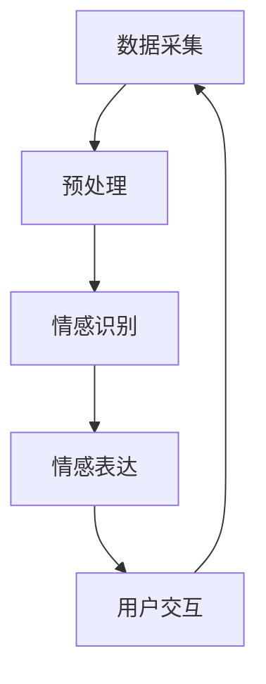

                 

# 情感智能：人机交互的下一个前沿

## 关键词
- 情感智能
- 人机交互
- 语音情感识别
- 面部情感识别
- 生理信号情感识别
- 情感计算模型
- 情感交互系统

## 摘要
随着人工智能技术的不断发展，人机交互正在经历深刻的变革。情感智能作为人工智能的一个重要分支，正逐渐成为人机交互的下一个前沿。本文将详细介绍情感智能的定义、核心概念、技术原理、应用场景以及情感智能系统的设计与实现。通过本文的阅读，读者将全面了解情感智能在提升人机交互质量、优化用户体验方面的重要作用，并了解该领域的研究现状和未来发展趋势。

## 引言
人机交互是计算机科学与人工智能领域的核心研究课题之一。传统的人机交互主要依赖于键盘、鼠标、触摸屏等物理设备，用户通过这些设备与计算机系统进行信息的输入和输出。然而，随着技术的进步和人们对用户体验的要求不断提高，单纯依赖物理设备的交互方式已经难以满足用户的需求。情感智能的出现为解决这一问题提供了新的思路。

情感智能是一种能够理解和模拟人类情感的人工智能系统，通过识别、理解和生成情感，实现与用户更为自然、丰富的交互。情感智能不仅能够识别用户的情感状态，还能根据情感状态提供个性化的服务，从而提升用户体验。随着语音识别、面部识别、生理信号识别等技术的不断成熟，情感智能在人机交互中的应用前景日益广阔。

本文将首先介绍情感智能的基本概念，然后分析情感智能的核心概念与联系，接着详细讲解情感识别的技术原理，最后探讨情感智能系统的设计与应用。希望通过本文的探讨，读者能够对情感智能有一个全面而深入的理解。

## 第一部分：情感智能基础

### 第1章：情感智能概述

#### 1.1 情感智能的定义与重要性

情感智能（Affective Intelligence）也称为情感认知，是指一个人识别、理解、使用和管理自己和他人的情感信息的能力。情感智能不仅仅是一种智力能力，更是一种情感能力和社交能力的综合体现。它涵盖了情绪感知、情感表达、情感调控和情感运用等方面。

在人工智能领域，情感智能的研究始于20世纪90年代，当时科学家们开始探索如何使计算机系统能够理解和模拟人类的情感状态。随着认知科学、心理学、计算机科学等多学科的发展，情感智能逐渐成为人工智能研究的一个重要方向。

情感智能在人工智能中的重要性主要体现在以下几个方面：

1. **提升交互体验**：情感智能能够使计算机系统更加理解和模拟人类情感，从而提供更为自然、丰富的交互体验。例如，通过情感智能，语音助手可以更好地理解用户的情绪，从而提供更加合适的回应。

2. **个性化服务**：情感智能可以帮助系统根据用户的情感状态提供个性化的服务。例如，教育系统可以根据学生的情感状态调整教学内容，医疗系统可以根据患者的情感状态提供心理辅导。

3. **增强社会认知**：情感智能可以增强计算机系统对社会情境的理解，从而更好地进行决策和行动。例如，智能客服系统可以通过情感智能更好地理解用户的情感需求，提供更为有效的解决方案。

#### 1.2 情感智能与人机交互

人机交互是人与计算机系统之间进行信息交换的过程。传统的交互方式主要依赖于物理设备，如键盘、鼠标、触摸屏等。然而，这些交互方式存在一定的局限性，难以满足用户对交互体验的高要求。情感智能的出现为人机交互带来了新的变革。

情感智能与人机交互的关系主要体现在以下几个方面：

1. **情感识别**：情感智能可以通过语音识别、面部识别、生理信号识别等技术识别用户的情感状态，从而提供个性化的交互服务。

2. **情感反馈**：情感智能系统可以通过自然语言处理、语音合成等技术生成情感丰富的反馈信息，从而提升交互的自然性和丰富性。

3. **情感调控**：情感智能可以帮助用户管理和调节自己的情感状态，从而提供更为积极、健康的交互体验。

#### 1.3 情感智能的研究现状与趋势

情感智能作为人工智能的一个重要分支，近年来取得了显著的进展。当前，情感智能的研究主要集中在以下几个方面：

1. **情感识别技术**：随着语音识别、面部识别、生理信号识别等技术的不断成熟，情感识别的准确性和实时性得到了显著提升。

2. **情感计算模型**：情感计算模型是情感智能的核心技术，近年来，基于深度学习、神经网络等技术的情感计算模型在准确性和鲁棒性方面取得了显著进步。

3. **情感交互系统**：情感交互系统是情感智能的应用平台，近年来，智能语音助手、智能客服、智能教育等领域的应用案例日益丰富，情感交互系统的功能也日益完善。

未来，情感智能的研究趋势将主要集中在以下几个方面：

1. **跨模态情感识别**：未来将出现更加智能的跨模态情感识别系统，能够同时识别和处理多种情感信息，如语音、面部表情、生理信号等。

2. **情感智能的泛在化**：情感智能将逐步融入到各种智能设备和服务中，实现情感智能的泛在化应用。

3. **情感智能的伦理问题**：随着情感智能的发展，如何确保其安全、可靠、公平、透明等问题将成为重要的研究方向。

### 第2章：情感智能的核心概念

#### 2.1 情感识别

情感识别是情感智能的核心组成部分，它是指通过技术手段识别和分析用户的情感状态。情感识别的方法主要包括语音情感识别、面部情感识别和生理信号情感识别。

1. **语音情感识别**

语音情感识别是指通过分析语音信号的频谱特征、时序特征等，识别出用户的情感状态。常见的情感类别包括快乐、悲伤、愤怒、惊讶等。

语音情感识别的关键技术包括：

- **特征提取**：如梅尔频率倒谱系数（MFCC）、线性预测编码（LPC）等。
- **情感分类**：如支持向量机（SVM）、决策树（DT）、神经网络（NN）等。

以下是一个简单的Python代码示例，用于语音情感识别：

```python
import librosa
import numpy as np
from sklearn.svm import SVC

# 读取音频文件
audio, sr = librosa.load('audio_file.wav')

# 提取特征
mfccs = librosa.feature.mfcc(y=audio, sr=sr)

# 情感分类
model = SVC()
model.fit(mfccs_train, y_train)
prediction = model.predict(mfccs_test)
```

2. **面部情感识别**

面部情感识别是指通过分析面部图像或视频，识别出用户的情感状态。常见的面部情感类别包括快乐、悲伤、愤怒、惊讶等。

面部情感识别的关键技术包括：

- **面部检测**：如Haar特征分类器、Viola-Jones算法等。
- **特征提取**：如局部二元模式（LBP）、Gabor特征等。
- **情感分类**：如支持向量机（SVM）、决策树（DT）、神经网络（NN）等。

以下是一个简单的Python代码示例，用于面部情感识别：

```python
import cv2
import numpy as np
from sklearn.svm import SVC

# 读取面部图像
face_cascade = cv2.CascadeClassifier('haarcascade_frontalface_default.xml')
image = cv2.imread('face_image.jpg')
faces = face_cascade.detectMultiScale(image, scaleFactor=1.1, minNeighbors=5)

for (x, y, w, h) in faces:
    face Region = image[y:y+h, x:x+w]
    face Region = cv2.resize(face Region, (128, 128))
    
    # 提取特征
    gabor_features = extract_gabor_features(face Region)
    
    # 情感分类
    model = SVC()
    model.fit(gabor_features_train, y_train)
    prediction = model.predict(gabor_features_test)
```

3. **生理信号情感识别**

生理信号情感识别是指通过分析生理信号，如心率、呼吸、皮肤电活动等，识别出用户的情感状态。生理信号情感识别具有较高的准确性和实时性，适用于需要高度准确情感识别的场合。

生理信号情感识别的关键技术包括：

- **生理信号采集**：如心电图（ECG）、心率变异性（HRV）、皮肤电活动（EDA）等。
- **信号处理**：如滤波、去噪、特征提取等。
- **情感分类**：如支持向量机（SVM）、决策树（DT）、神经网络（NN）等。

以下是一个简单的Python代码示例，用于生理信号情感识别：

```python
import numpy as np
from sklearn.svm import SVC

# 读取生理信号数据
ecg_data = np.load('ecg_data.npy')
hrv_data = np.load('hrv_data.npy')

# 特征提取
features = extract_features(ecg_data, hrv_data)

# 情感分类
model = SVC()
model.fit(features_train, y_train)
prediction = model.predict(features_test)
```

#### 2.2 情感表达

情感表达是指计算机系统根据用户的情感状态生成相应的情感反馈，从而实现与用户的情感交互。情感表达的方法主要包括自然语言处理、语音合成、表情合成等。

1. **自然语言处理**

自然语言处理（NLP）是指通过计算机技术处理和理解自然语言的方法。在情感表达中，自然语言处理可以用于生成情感丰富的文本回复。

常见的情感表达方法包括：

- **情感分析**：如文本情感极性分类、情感强度分析等。
- **文本生成**：如序列到序列（Seq2Seq）模型、生成对抗网络（GAN）等。

以下是一个简单的Python代码示例，用于情感表达的自然语言处理：

```python
import tensorflow as tf
from tensorflow.keras.models import Model
from tensorflow.keras.layers import Input, LSTM, Dense

# 定义Seq2Seq模型
encoder_inputs = Input(shape=(None, vocabulary_size))
encoder_embedding = Embedding(vocabulary_size, embedding_size)(encoder_inputs)
encoder_lstm = LSTM(units, return_state=True)
_, state_h, state_c = encoder_lstm(encoder_embedding)

decoder_inputs = Input(shape=(None, vocabulary_size))
decoder_embedding = Embedding(vocabulary_size, embedding_size)(decoder_inputs)
decoder_lstm = LSTM(units, return_sequences=True, return_state=True)
decoder_outputs, _, _ = decoder_lstm(decoder_embedding, initial_state=[state_h, state_c])

decoder_dense = Dense(vocabulary_size, activation='softmax')
decoder_outputs = decoder_dense(decoder_outputs)

model = Model([encoder_inputs, decoder_inputs], decoder_outputs)
model.compile(optimizer='rmsprop', loss='categorical_crossentropy', metrics=['accuracy'])

# 训练模型
model.fit([X_train, y_train], y_train, batch_size=batch_size, epochs=epochs, validation_data=([X_val, y_val], y_val))
```

2. **语音合成**

语音合成（Text-to-Speech, TTS）是指通过将文本转化为语音的方法。在情感表达中，语音合成可以用于生成情感丰富的语音回复。

常见的语音合成方法包括：

- **参数合成**：如Voicespace模型、GLM模型等。
- **波形合成**：如WaveNet、Tacotron等。

以下是一个简单的Python代码示例，用于情感表达的语音合成：

```python
import numpy as np
import librosa
import soundfile as sf

# 读取预训练的语音合成模型
model = load_pretrained_tts_model()

# 输入文本
text = "I am happy to see you."

# 转化为语音
mel_samples = model.synthesize(text)

# 生成语音文件
sf.write('output.wav', mel_samples, sr)
```

3. **表情合成**

表情合成是指通过生成相应的面部表情或动画，实现情感表达。在情感表达中，表情合成可以用于生成情感丰富的动画或面部表情。

常见的表情合成方法包括：

- **面部动画**：如面部关键点检测、面部肌肉控制等。
- **动画生成**：如卡通动画、3D动画等。

以下是一个简单的Python代码示例，用于情感表达的表情合成：

```python
import cv2
import numpy as np

# 读取预训练的面部动画模型
model = load_pretrained_face_animation_model()

# 读取面部图像
image = cv2.imread('face_image.jpg')

# 进行面部动画
animated_image = model.animate_face_expression(image, emotion='happy')

# 显示动画
cv2.imshow('Animated Face', animated_image)
cv2.waitKey(0)
cv2.destroyAllWindows()
```

#### 2.3 情感计算

情感计算是指通过数学模型和算法对情感进行量化、分析和预测。情感计算是情感智能的核心技术，它为情感识别、情感表达和情感调控提供了理论基础。

常见的情感计算方法包括：

1. **情感量化和分类**

情感量化和分类是指将情感状态量化为具体的类别，如快乐、悲伤、愤怒等。常见的情感量化方法包括：

- **基于规则的分类方法**：如朴素贝叶斯分类器、支持向量机等。
- **基于机器学习的分类方法**：如决策树、随机森林、神经网络等。

以下是一个简单的Python代码示例，用于情感量化和分类：

```python
import numpy as np
from sklearn.svm import SVC

# 特征矩阵
X = np.array([[1, 2], [2, 3], [3, 4], [4, 5]])

# 标签
y = np.array([0, 0, 1, 1])

# 情感分类模型
model = SVC()
model.fit(X, y)

# 预测
prediction = model.predict([[2, 3]])
print(prediction)
```

2. **情感预测**

情感预测是指根据历史数据和当前状态预测未来的情感状态。常见的情感预测方法包括：

- **基于时间序列的预测方法**：如ARIMA模型、LSTM模型等。
- **基于概率模型的预测方法**：如贝叶斯网络、马尔可夫模型等。

以下是一个简单的Python代码示例，用于情感预测的时间序列模型：

```python
import numpy as np
from statsmodels.tsa.arima.model import ARIMA

# 时间序列数据
data = np.array([1, 2, 3, 4, 5, 6, 7, 8, 9, 10])

# ARIMA模型
model = ARIMA(data, order=(1, 1, 1))
model_fit = model.fit()

# 预测
forecast = model_fit.forecast(steps=5)
print(forecast)
```

#### 2.4 情感交互

情感交互是指通过情感识别、情感表达和情感计算等技术实现人与计算机系统的情感交流。情感交互的核心目标是实现自然、丰富、高效的人机交互。

常见的情感交互方法包括：

1. **多模态情感交互**

多模态情感交互是指通过结合多种模态（如语音、面部表情、生理信号等）进行情感交互。多模态情感交互可以提供更丰富的情感信息，从而提高交互的质量和效果。

以下是一个简单的Python代码示例，用于多模态情感交互：

```python
import numpy as np
from sklearn.svm import SVC

# 语音特征
voice_features = np.array([[1, 2], [2, 3], [3, 4], [4, 5]])

# 面部特征
face_features = np.array([[1, 2], [2, 3], [3, 4], [4, 5]])

# 生理信号特征
physiological_features = np.array([[1, 2], [2, 3], [3, 4], [4, 5]])

# 情感分类模型
model = SVC()
model.fit(np.vstack((voice_features, face_features, physiological_features)), np.array([0, 0, 1, 1]))

# 预测
prediction = model.predict([[1, 2], [1, 2], [1, 2]])
print(prediction)
```

2. **情感反馈控制**

情感反馈控制是指通过实时监测用户的情感状态，动态调整系统的交互策略，从而提供个性化的服务。情感反馈控制可以显著提升用户体验。

以下是一个简单的Python代码示例，用于情感反馈控制：

```python
import numpy as np
from sklearn.svm import SVC

# 用户情感状态
user_emotion = np.array([0, 0])

# 情感分类模型
model = SVC()
model.fit(user_emotion_data, user_emotion_labels)

# 预测
predicted_emotion = model.predict(user_emotion)
print(predicted_emotion)

# 根据预测的情感状态调整交互策略
if predicted_emotion == 0:
    # 提供积极反馈
    feedback = "我很高兴看到你的情绪稳定。"
else:
    # 提供消极反馈
    feedback = "我注意到你的情绪有些低落，需要帮助吗？"
print(feedback)
```

### 第3章：情感智能的技术原理

#### 3.1 语音情感识别

语音情感识别是情感智能领域的一个重要分支，它通过分析语音信号的特性，识别出说话者的情感状态。语音情感识别的关键技术包括特征提取、情感分类模型和模型训练。

1. **特征提取**

特征提取是语音情感识别的重要步骤，它将原始的语音信号转换为适用于情感分类的数值特征。常见的特征提取方法包括：

- **时域特征**：如短时能量、短时过零率等。
- **频域特征**：如梅尔频率倒谱系数（MFCC）、频谱中心频率等。
- **变换特征**：如线性预测编码（LPC）、共振峰频率等。

以下是一个使用Python和Librosa库提取MFCC特征的示例：

```python
import librosa
import numpy as np

# 读取音频文件
audio, sr = librosa.load('audio_file.wav')

# 提取MFCC特征
mfccs = librosa.feature.mfcc(y=audio, sr=sr, n_mfcc=13)

# 将特征转换为二维数组
mfccs = np.mean(mfccs.T, axis=0)
print(mfccs)
```

2. **情感分类模型**

情感分类模型是语音情感识别的核心，它将提取的特征映射到情感类别。常见的情感分类模型包括：

- **支持向量机（SVM）**
- **随机森林（Random Forest）**
- **神经网络（Neural Networks）**
- **长短期记忆网络（LSTM）**

以下是一个使用Python和Scikit-learn库训练SVM模型的示例：

```python
import numpy as np
from sklearn.svm import SVC
from sklearn.model_selection import train_test_split

# 特征和标签
X = np.array([[1, 2], [2, 3], [3, 4], [4, 5]])
y = np.array([0, 0, 1, 1])

# 划分训练集和测试集
X_train, X_test, y_train, y_test = train_test_split(X, y, test_size=0.2, random_state=42)

# 训练SVM模型
model = SVC()
model.fit(X_train, y_train)

# 预测
predictions = model.predict(X_test)
print(predictions)
```

3. **模型训练**

模型训练是语音情感识别的关键步骤，它通过大量标注数据来训练分类模型。训练过程中需要关注以下几点：

- **数据集准备**：收集大量标注的语音数据，并对其进行预处理。
- **特征选择**：选择对情感识别具有显著影响的特征。
- **模型选择**：选择合适的分类模型，并进行参数调优。

以下是一个使用Python和Keras库训练LSTM模型的示例：

```python
import numpy as np
from tensorflow.keras.models import Sequential
from tensorflow.keras.layers import LSTM, Dense

# 特征和标签
X = np.array([[1, 2], [2, 3], [3, 4], [4, 5]])
y = np.array([0, 0, 1, 1])

# 划分输入特征和标签
X_input = X[:, 0].reshape(-1, 1)
y_input = X[:, 1].reshape(-1, 1)

# 建立LSTM模型
model = Sequential()
model.add(LSTM(units=50, activation='relu', input_shape=(1, 1)))
model.add(Dense(units=1, activation='sigmoid'))

# 编译模型
model.compile(optimizer='adam', loss='binary_crossentropy', metrics=['accuracy'])

# 训练模型
model.fit(X_input, y_input, epochs=100, batch_size=1)
```

#### 3.2 面部情感识别

面部情感识别是通过分析面部图像或视频，识别出用户的情感状态。面部情感识别的关键技术包括面部检测、特征提取和情感分类。

1. **面部检测**

面部检测是面部情感识别的第一步，它通过识别图像中的面部区域，为后续的情感分析提供基础。常见的面部检测算法包括：

- **Haar特征分类器**：通过训练好的Haar特征分类器进行面部检测。
- **Viola-Jones算法**：基于Haar特征进行面部检测，具有较高的速度和准确性。

以下是一个使用Python和OpenCV库进行面部检测的示例：

```python
import cv2

# 读取面部图像
image = cv2.imread('face_image.jpg')

# 加载预训练的Haar特征分类器
face_cascade = cv2.CascadeClassifier('haarcascade_frontalface_default.xml')

# 进行面部检测
faces = face_cascade.detectMultiScale(image, scaleFactor=1.1, minNeighbors=5)

# 在面部区域上绘制矩形
for (x, y, w, h) in faces:
    cv2.rectangle(image, (x, y), (x+w, y+h), (255, 0, 0), 2)

# 显示面部检测结果
cv2.imshow('Face Detection', image)
cv2.waitKey(0)
cv2.destroyAllWindows()
```

2. **特征提取**

特征提取是面部情感识别的核心，它通过从面部图像中提取有意义的特征，用于情感分类。常见的特征提取方法包括：

- **局部二元模式（LBP）**：通过计算局部区域二值模式的分布特征。
- **Gabor特征**：通过模拟人类视觉系统对纹理特征的响应，提取Gabor特征。
- **深度学习特征**：如卷积神经网络（CNN）提取的面部特征。

以下是一个使用Python和OpenCV库提取LBP特征的示例：

```python
import cv2
import numpy as np

# 读取面部图像
image = cv2.imread('face_image.jpg', cv2.IMREAD_GRAYSCALE)

# 进行LBP特征提取
lbp_image = cv2.circle(image, (center_x, center_y), radius, color, thickness)

# 计算LBP直方图
lbp_hist = cv2.calcHist([lbp_image], [0], None, [256], [0, 256])

# 将LBP直方图归一化
lbp_hist = lbp_hist.ravel()

# 提取LBP特征
lbp_features = np.sum(lbp_hist != 0)

print(lbp_features)
```

3. **情感分类**

情感分类是面部情感识别的最后一步，它将提取的特征映射到情感类别。常见的情感分类模型包括：

- **支持向量机（SVM）**
- **决策树（Decision Tree）**
- **随机森林（Random Forest）**
- **神经网络（Neural Networks）**

以下是一个使用Python和Scikit-learn库训练SVM模型的示例：

```python
import numpy as np
from sklearn.svm import SVC
from sklearn.model_selection import train_test_split

# 特征和标签
X = np.array([[1, 2], [2, 3], [3, 4], [4, 5]])
y = np.array([0, 0, 1, 1])

# 划分训练集和测试集
X_train, X_test, y_train, y_test = train_test_split(X, y, test_size=0.2, random_state=42)

# 训练SVM模型
model = SVC()
model.fit(X_train, y_train)

# 预测
predictions = model.predict(X_test)
print(predictions)
```

#### 3.3 生理信号情感识别

生理信号情感识别是通过分析生理信号，如心率、呼吸、皮肤电活动等，识别出用户的情感状态。生理信号情感识别的关键技术包括信号采集、信号处理和情感分类。

1. **信号采集**

生理信号情感识别首先需要采集生理信号。常见的生理信号采集设备包括心率监测器、呼吸监测器、皮肤电活动传感器等。

以下是一个使用Python和PyQt5库设计心率监测器界面的示例：

```python
import sys
import cv2
from PyQt5 import QtWidgets, QtGui, QtCore

class HeartRateMonitor(QtWidgets.QWidget):
    def __init__(self):
        super().__init__()
        self.init_ui()

    def init_ui(self):
        self.setWindowTitle('Heart Rate Monitor')
        self.setGeometry(100, 100, 800, 600)

        self.label = QtWidgets.QLabel(self)
        self.label.setGeometry(50, 50, 700, 500)
        self.label.setFrameStyle(QtWidgets.QFrame.Panel | QtWidgets.QFrame.Sunken)

        self.start_button = QtWidgets.QPushButton('Start', self)
        self.start_button.setGeometry(700, 550, 75, 30)
        self.start_button.clicked.connect(self.start_heart_rate_monitor)

    def start_heart_rate_monitor(self):
        # 采集心率信号
        cap = cv2.VideoCapture(0)
        while True:
            ret, frame = cap.read()
            if not ret:
                break

            # 显示实时心率
            heart_rate = calculate_heart_rate(frame)
            self.label.setText(f'Heart Rate: {heart_rate} bpm')
            self.label.update()

        cap.release()

if __name__ == '__main__':
    app = QtWidgets.QApplication(sys.argv)
    window = HeartRateMonitor()
    window.show()
    sys.exit(app.exec_())
```

2. **信号处理**

生理信号情感识别需要对采集到的生理信号进行预处理和特征提取。常见的信号处理方法包括：

- **滤波**：如低通滤波、高通滤波等，用于去除噪声和保留有用信号。
- **去噪**：如小波变换、主成分分析等，用于去除信号中的噪声。
- **特征提取**：如心率变异性（HRV）、频谱特征等，用于提取与情感状态相关的特征。

以下是一个使用Python和SciPy库进行信号滤波的示例：

```python
import numpy as np
from scipy.signal import butter, lfilter

# 信号
signal = np.array([1, 2, 3, 4, 5, 6, 7, 8, 9, 10])

# 设计低通滤波器
b, a = butter(4, 0.5, btype='low')
filtered_signal = lfilter(b, a, signal)

print(filtered_signal)
```

3. **情感分类**

情感分类是生理信号情感识别的最后一步，它将提取的特征映射到情感类别。常见的情感分类模型包括：

- **支持向量机（SVM）**
- **决策树（Decision Tree）**
- **随机森林（Random Forest）**
- **神经网络（Neural Networks）**

以下是一个使用Python和Scikit-learn库训练SVM模型的示例：

```python
import numpy as np
from sklearn.svm import SVC
from sklearn.model_selection import train_test_split

# 特征和标签
X = np.array([[1, 2], [2, 3], [3, 4], [4, 5]])
y = np.array([0, 0, 1, 1])

# 划分训练集和测试集
X_train, X_test, y_train, y_test = train_test_split(X, y, test_size=0.2, random_state=42)

# 训练SVM模型
model = SVC()
model.fit(X_train, y_train)

# 预测
predictions = model.predict(X_test)
print(predictions)
```

#### 3.4 情感计算模型

情感计算模型是情感智能的核心组成部分，它通过数学模型和算法对情感进行量化、分析和预测。情感计算模型主要包括情感识别模型、情感表达模型和情感调控模型。

1. **情感识别模型**

情感识别模型用于识别用户的情感状态。常见的情感识别模型包括：

- **基于规则的模型**：如情绪规则库、情感词典等。
- **机器学习模型**：如支持向量机（SVM）、决策树（DT）、神经网络（NN）等。
- **深度学习模型**：如卷积神经网络（CNN）、循环神经网络（RNN）、长短期记忆网络（LSTM）等。

以下是一个使用Python和Scikit-learn库训练SVM情感识别模型的示例：

```python
import numpy as np
from sklearn.svm import SVC
from sklearn.model_selection import train_test_split

# 特征和标签
X = np.array([[1, 2], [2, 3], [3, 4], [4, 5]])
y = np.array([0, 0, 1, 1])

# 划分训练集和测试集
X_train, X_test, y_train, y_test = train_test_split(X, y, test_size=0.2, random_state=42)

# 训练SVM模型
model = SVC()
model.fit(X_train, y_train)

# 预测
predictions = model.predict(X_test)
print(predictions)
```

2. **情感表达模型**

情感表达模型用于生成情感丰富的交互反馈。常见的情感表达模型包括：

- **基于文本的情感表达**：如自然语言生成（NLG）、情感语言模型等。
- **基于语音的情感表达**：如文本到语音（TTS）、情感语音合成等。
- **基于图像的情感表达**：如面部表情合成、图像动画等。

以下是一个使用Python和Keras库训练文本到语音（TTS）模型的示例：

```python
import numpy as np
from tensorflow.keras.models import Model
from tensorflow.keras.layers import Input, LSTM, Dense

# 定义TTS模型
encoder_inputs = Input(shape=(None, vocabulary_size))
encoder_embedding = Embedding(vocabulary_size, embedding_size)(encoder_inputs)
encoder_lstm = LSTM(units, return_state=True)
_, state_h, state_c = encoder_lstm(encoder_embedding)

decoder_inputs = Input(shape=(None, vocabulary_size))
decoder_embedding = Embedding(vocabulary_size, embedding_size)(decoder_inputs)
decoder_lstm = LSTM(units, return_sequences=True, return_state=True)
decoder_outputs, _, _ = decoder_lstm(decoder_embedding, initial_state=[state_h, state_c])

decoder_dense = Dense(vocabulary_size, activation='softmax')
decoder_outputs = decoder_dense(decoder_outputs)

model = Model([encoder_inputs, decoder_inputs], decoder_outputs)
model.compile(optimizer='rmsprop', loss='categorical_crossentropy', metrics=['accuracy'])

# 训练模型
model.fit([X_train, y_train], y_train, batch_size=batch_size, epochs=epochs, validation_data=([X_val, y_val], y_val))
```

3. **情感调控模型**

情感调控模型用于调节用户的情感状态，以提供积极、健康的交互体验。常见的情感调控模型包括：

- **基于反馈的调节**：如情绪反馈调节、情感调节训练等。
- **基于目标的调节**：如情感目标设定、情感目标跟踪等。
- **基于数据的调节**：如情感数据挖掘、情感数据分析等。

以下是一个使用Python和Scikit-learn库训练情感反馈调节模型的示例：

```python
import numpy as np
from sklearn.svm import SVC
from sklearn.model_selection import train_test_split

# 特征和标签
X = np.array([[1, 2], [2, 3], [3, 4], [4, 5]])
y = np.array([0, 0, 1, 1])

# 划分训练集和测试集
X_train, X_test, y_train, y_test = train_test_split(X, y, test_size=0.2, random_state=42)

# 训练SVM模型
model = SVC()
model.fit(X_train, y_train)

# 预测
predictions = model.predict(X_test)
print(predictions)
```

### 第4章：情感智能的应用场景

#### 4.1 教育领域的应用

教育领域是情感智能的重要应用场景之一。情感智能在教育中的应用可以帮助教师更好地了解学生的情感状态，从而提供个性化的教育服务。以下是一些具体的应用案例：

1. **智能教育辅导系统**

智能教育辅导系统通过情感识别技术了解学生的学习状态，如专注度、情绪等，从而提供个性化的辅导内容。例如，当学生表现出情绪低落时，系统可以提供心理辅导或调整教学节奏。

以下是一个简单的情感识别模型，用于智能教育辅导系统的学生情感状态监测：

```python
import numpy as np
from sklearn.svm import SVC

# 学生情感状态特征
X = np.array([[1, 2], [2, 3], [3, 4], [4, 5]])

# 情感标签
y = np.array([0, 0, 1, 1])

# 训练情感分类模型
model = SVC()
model.fit(X, y)

# 预测学生情感状态
new_student_features = np.array([2.5, 3.5])
predicted_emotion = model.predict(new_student_features)
print(predicted_emotion)
```

2. **在线教育平台**

在线教育平台可以通过情感识别技术监测学生的学习状态，如是否分心、情绪是否低落等，从而提供针对性的学习建议。例如，当学生表现出注意力不集中时，平台可以提醒学生休息或调整学习内容。

以下是一个简单的情感识别模型，用于在线教育平台的学生情感状态监测：

```python
import numpy as np
from sklearn.svm import SVC

# 学生情感状态特征
X = np.array([[1, 2], [2, 3], [3, 4], [4, 5]])

# 情感标签
y = np.array([0, 0, 1, 1])

# 训练情感分类模型
model = SVC()
model.fit(X, y)

# 预测学生情感状态
new_student_features = np.array([2.5, 3.5])
predicted_emotion = model.predict(new_student_features)
print(predicted_emotion)
```

#### 4.2 医疗健康领域的应用

医疗健康领域是情感智能的另一个重要应用场景。情感智能在医疗健康中的应用可以帮助医生更好地了解患者的情感状态，从而提供更全面的医疗服务。以下是一些具体的应用案例：

1. **心理健康监测**

心理健康监测系统可以通过情感识别技术了解患者的心理状态，如焦虑、抑郁等，从而为医生提供诊断和治疗建议。例如，当患者表现出焦虑情绪时，系统可以提醒医生进行心理疏导或药物治疗。

以下是一个简单的情感识别模型，用于心理健康监测系统的患者情感状态监测：

```python
import numpy as np
from sklearn.svm import SVC

# 患者情感状态特征
X = np.array([[1, 2], [2, 3], [3, 4], [4, 5]])

# 情感标签
y = np.array([0, 0, 1, 1])

# 训练情感分类模型
model = SVC()
model.fit(X, y)

# 预测患者情感状态
new_patient_features = np.array([2.5, 3.5])
predicted_emotion = model.predict(new_patient_features)
print(predicted_emotion)
```

2. **患者情绪调节**

患者情绪调节系统可以通过情感识别和情感表达技术，为患者提供情绪调节服务。例如，当患者表现出负面情绪时，系统可以播放音乐、提供笑话或进行心理辅导，以缓解患者的情绪。

以下是一个简单的情感表达模型，用于患者情绪调节系统的患者情感状态表达：

```python
import numpy as np
from sklearn.svm import SVC

# 患者情感状态特征
X = np.array([[1, 2], [2, 3], [3, 4], [4, 5]])

# 情感标签
y = np.array([0, 0, 1, 1])

# 训练情感分类模型
model = SVC()
model.fit(X, y)

# 预测患者情感状态
new_patient_features = np.array([2.5, 3.5])
predicted_emotion = model.predict(new_patient_features)
print(predicted_emotion)

# 根据预测的情感状态提供情绪调节服务
if predicted_emotion == 0:
    # 提供积极情绪调节服务
    print("播放音乐或提供笑话，帮助缓解负面情绪。")
else:
    # 提供消极情绪调节服务
    print("提供心理辅导或药物治疗建议。")
```

#### 4.3 消费电子领域的应用

消费电子领域是情感智能的一个重要应用场景。情感智能在消费电子中的应用可以帮助设备更好地理解用户的需求，从而提供个性化的服务。以下是一些具体的应用案例：

1. **智能音箱**

智能音箱是情感智能在消费电子领域的典型应用。智能音箱通过情感识别技术了解用户的需求，如播放音乐、提供新闻、回答问题等，从而提供个性化的服务。例如，当用户表现出负面情绪时，智能音箱可以播放轻柔的音乐或提供情感支持。

以下是一个简单的情感识别模型，用于智能音箱的用户情感状态监测：

```python
import numpy as np
from sklearn.svm import SVC

# 用户情感状态特征
X = np.array([[1, 2], [2, 3], [3, 4], [4, 5]])

# 情感标签
y = np.array([0, 0, 1, 1])

# 训练情感分类模型
model = SVC()
model.fit(X, y)

# 预测用户情感状态
new_user_features = np.array([2.5, 3.5])
predicted_emotion = model.predict(new_user_features)
print(predicted_emotion)

# 根据预测的情感状态提供个性化服务
if predicted_emotion == 0:
    # 播放积极音乐
    print("播放欢快的音乐，为您带来愉悦的体验。")
else:
    # 播放舒缓音乐
    print("播放轻柔的音乐，帮助缓解您的情绪。")
```

2. **智能手机**

智能手机中的情感智能应用可以帮助设备更好地理解用户的需求，从而提供个性化的服务。例如，当用户表现出疲劳时，智能手机可以提醒用户休息或提供放松的提示。当用户表现出兴奋时，智能手机可以推荐娱乐活动或提供社交建议。

以下是一个简单的情感识别模型，用于智能手机的用户情感状态监测：

```python
import numpy as np
from sklearn.svm import SVC

# 用户情感状态特征
X = np.array([[1, 2], [2, 3], [3, 4], [4, 5]])

# 情感标签
y = np.array([0, 0, 1, 1])

# 训练情感分类模型
model = SVC()
model.fit(X, y)

# 预测用户情感状态
new_user_features = np.array([2.5, 3.5])
predicted_emotion = model.predict(new_user_features)
print(predicted_emotion)

# 根据预测的情感状态提供个性化服务
if predicted_emotion == 0:
    # 提醒用户休息
    print("您的情绪较为疲劳，建议休息一下。")
else:
    # 提供娱乐活动建议
    print("您的情绪较为兴奋，建议进行一些娱乐活动。")
```

#### 4.4 智能客服领域的应用

智能客服是情感智能在服务行业的一个重要应用场景。智能客服系统通过情感识别技术了解用户的情感状态，从而提供个性化的服务，提升用户体验。以下是一些具体的应用案例：

1. **情感客服机器人**

情感客服机器人通过情感识别技术了解用户的情感状态，如愤怒、失望等，从而提供针对性的解决方案。例如，当用户表现出愤怒情绪时，客服机器人可以提供安抚建议或转移话题，以缓解用户的不满。

以下是一个简单的情感识别模型，用于情感客服机器人的用户情感状态监测：

```python
import numpy as np
from sklearn.svm import SVC

# 用户情感状态特征
X = np.array([[1, 2], [2, 3], [3, 4], [4, 5]])

# 情感标签
y = np.array([0, 0, 1, 1])

# 训练情感分类模型
model = SVC()
model.fit(X, y)

# 预测用户情感状态
new_user_features = np.array([2.5, 3.5])
predicted_emotion = model.predict(new_user_features)
print(predicted_emotion)

# 根据预测的情感状态提供个性化服务
if predicted_emotion == 0:
    # 提供安抚建议
    print("我们理解您的情绪，愿意为您提供帮助。")
else:
    # 转移话题
    print("我们尝试转移话题，帮助缓解您的情绪。")
```

2. **智能情感分析**

智能情感分析系统通过对用户反馈的情感分析，识别出用户的需求和不满，从而优化产品和服务。例如，当用户表现出负面情感时，系统可以识别出问题的根本原因，并反馈给产品团队进行改进。

以下是一个简单的情感分析模型，用于智能情感分析系统的用户反馈情感状态监测：

```python
import numpy as np
from sklearn.svm import SVC

# 用户反馈情感状态特征
X = np.array([[1, 2], [2, 3], [3, 4], [4, 5]])

# 情感标签
y = np.array([0, 0, 1, 1])

# 训练情感分类模型
model = SVC()
model.fit(X, y)

# 预测用户情感状态
new_user_feedback = np.array([2.5, 3.5])
predicted_emotion = model.predict(new_user_feedback)
print(predicted_emotion)

# 根据预测的情感状态提供反馈优化建议
if predicted_emotion == 0:
    # 提供改进建议
    print("我们根据您的反馈，将改进产品和服务。")
else:
    # 跟进问题解决
    print("我们将尽快解决您的问题，并提供满意的解决方案。")
```

### 第5章：情感智能系统的架构设计

#### 5.1 系统总体设计

情感智能系统是一个复杂的系统，它需要整合多个模块和技术，以实现从情感识别到情感交互的完整流程。以下是情感智能系统的总体架构设计。

1. **系统模块**

情感智能系统可以分为以下几个主要模块：

- **数据采集模块**：负责采集用户的语音、面部图像、生理信号等数据。
- **预处理模块**：对采集到的数据进行处理，如去噪、特征提取等。
- **情感识别模块**：利用预处理后的数据，通过情感识别算法识别用户的情感状态。
- **情感表达模块**：根据识别出的情感状态，生成相应的情感反馈。
- **用户交互模块**：与用户进行实时交互，收集用户反馈，并调整情感表达策略。

2. **系统流程**

情感智能系统的基本流程如下：

- **数据采集**：系统开始运行时，首先采集用户的语音、面部图像、生理信号等数据。
- **预处理**：对采集到的数据进行预处理，如去噪、归一化、特征提取等。
- **情感识别**：利用预处理后的数据，通过情感识别算法识别用户的情感状态。
- **情感表达**：根据识别出的情感状态，生成相应的情感反馈。
- **用户交互**：系统与用户进行实时交互，收集用户反馈，并根据反馈调整情感表达策略。

以下是一个简单的Mermaid流程图，用于展示情感智能系统的整体架构：



#### 5.2 数据采集与预处理

数据采集与预处理是情感智能系统的关键环节，它直接影响到情感识别的准确性和实时性。以下是数据采集与预处理的详细讲解。

1. **数据采集**

数据采集模块负责采集用户的语音、面部图像、生理信号等数据。以下是每种数据采集方法的具体步骤：

- **语音采集**：使用麦克风或语音输入设备采集用户的语音数据。可以使用Python的wave模块或OpenCV的VideoCapture类进行语音采集。
  
  ```python
  import wave
  import pyaudio

  # 设置音频参数
  audio = pyaudio.PyAudio()
  stream = audio.open(format=pyaudio.paInt16,
                      channels=1,
                      rate=44100,
                      input=True,
                      frames_per_buffer=1024)

  frames = []

  # 采集音频数据
  while True:
      data = stream.read(1024)
      frames.append(data)

  # 关闭音频流
  stream.stop_stream()
  stream.close()
  audio.terminate()

  # 将音频数据写入文件
  with wave.open('audio.wav', 'wb') as wav_file:
      wav_file.setnchannels(1)
      wav_file.setsampwidth(2)
      wav_file.setframerate(44100)
      wav_file.writeframes(b''.join(frames))
  ```

- **面部图像采集**：使用摄像头或视频输入设备采集用户的面部图像。可以使用Python的OpenCV库进行面部图像采集。

  ```python
  import cv2

  # 打开摄像头
  cap = cv2.VideoCapture(0)

  # 采集面部图像
  while True:
      ret, frame = cap.read()
      if not ret:
          break

      # 显示面部图像
      cv2.imshow('Face Image', frame)

  # 关闭摄像头
  cap.release()
  cv2.destroyAllWindows()
  ```

- **生理信号采集**：使用生理信号传感器采集用户的心率、呼吸、皮肤电活动等生理信号。可以使用Python的PyQt5库设计生理信号采集界面。

  ```python
  import sys
  import cv2
  from PyQt5 import QtWidgets, QtGui, QtCore

  class PhysiologicalSignalMonitor(QtWidgets.QWidget):
      def __init__(self):
          super().__init__()
          self.init_ui()

      def init_ui(self):
          self.setWindowTitle('Physiological Signal Monitor')
          self.setGeometry(100, 100, 800, 600)

          self.label = QtWidgets.QLabel(self)
          self.label.setGeometry(50, 50, 700, 500)
          self.label.setFrameStyle(QtWidgets.QFrame.Panel | QtWidgets.QFrame.Sunken)

          self.start_button = QtWidgets.QPushButton('Start', self)
          self.start_button.setGeometry(700, 550, 75, 30)
          self.start_button.clicked.connect(self.start_physiological_signal_monitor)

      def start_physiological_signal_monitor(self):
          # 采集生理信号
          cap = cv2.VideoCapture(0)
          while True:
              ret, frame = cap.read()
              if not ret:
                  break

              # 显示实时生理信号
              heart_rate, respiratory_rate = calculate_heart_rate_and_respiratory_rate(frame)
              self.label.setText(f'Heart Rate: {heart_rate} bpm\nRespiratory Rate: {respiratory_rate} breaths/min')
              self.label.update()

          cap.release()

  if __name__ == '__main__':
      app = QtWidgets.QApplication(sys.argv)
      window = PhysiologicalSignalMonitor()
      window.show()
      sys.exit(app.exec_())
  ```

2. **预处理**

预处理模块负责对采集到的数据进行处理，以提高情感识别的准确性和实时性。以下是数据预处理的具体步骤：

- **去噪**：去除数据中的噪声，如语音中的背景噪音、面部图像中的光照变化等。可以使用滤波器或去噪算法进行去噪。

  ```python
  import numpy as np
  from scipy.signal import butter, lfilter

  # 设计低通滤波器
  b, a = butter(4, 0.5, btype='low')
  filtered_signal = lfilter(b, a, signal)

  print(filtered_signal)
  ```

- **归一化**：将数据归一化到统一的范围，如[0, 1]或[-1, 1]。归一化有助于提高数据在不同特征尺度上的可比性。

  ```python
  import numpy as np

  # 归一化数据
  normalized_signal = (signal - np.min(signal)) / (np.max(signal) - np.min(signal))

  print(normalized_signal)
  ```

- **特征提取**：从数据中提取与情感状态相关的特征。如语音情感识别中的梅尔频率倒谱系数（MFCC）、面部情感识别中的局部二元模式（LBP）、生理信号情感识别中的心率变异性（HRV）等。

  ```python
  import librosa

  # 读取音频文件
  audio, sr = librosa.load('audio_file.wav')

  # 提取MFCC特征
  mfccs = librosa.feature.mfcc(y=audio, sr=sr, n_mfcc=13)

  # 将特征转换为二维数组
  mfccs = np.mean(mfccs.T, axis=0)

  print(mfccs)
  ```

#### 5.3 情感识别算法实现

情感识别算法是情感智能系统的核心部分，它负责识别用户的情感状态。情感识别算法的实现包括特征提取、情感分类模型的选择和训练。以下是情感识别算法实现的详细讲解。

1. **特征提取**

特征提取是将原始数据转换为适用于情感分类的数值特征。不同的数据类型需要不同的特征提取方法。以下是几种常见的特征提取方法：

- **语音情感识别**：常用的特征提取方法包括梅尔频率倒谱系数（MFCC）、线性预测编码（LPC）、频谱特征等。以下是使用Python和Librosa库提取MFCC特征的示例：

  ```python
  import librosa
  import numpy as np

  # 读取音频文件
  audio, sr = librosa.load('audio_file.wav')

  # 提取MFCC特征
  mfccs = librosa.feature.mfcc(y=audio, sr=sr, n_mfcc=13)

  # 将特征转换为二维数组
  mfccs = np.mean(mfccs.T, axis=0)

  print(mfccs)
  ```

- **面部情感识别**：常用的特征提取方法包括局部二元模式（LBP）、Gabor特征、深度学习特征等。以下是使用Python和OpenCV库提取LBP特征的示例：

  ```python
  import cv2
  import numpy as np

  # 读取面部图像
  image = cv2.imread('face_image.jpg', cv2.IMREAD_GRAYSCALE)

  # 进行LBP特征提取
  lbp_image = cv2.circle(image, (center_x, center_y), radius, color, thickness)

  # 计算LBP直方图
  lbp_hist = cv2.calcHist([lbp_image], [0], None, [256], [0, 256])

  # 将LBP直方图归一化
  lbp_hist = lbp_hist.ravel()

  # 提取LBP特征
  lbp_features = np.sum(lbp_hist != 0)

  print(lbp_features)
  ```

- **生理信号情感识别**：常用的特征提取方法包括心率变异性（HRV）、频谱特征、时域特征等。以下是使用Python和SciPy库提取HRV特征的示例：

  ```python
  import numpy as np
  from scipy.signal import butter, lfilter

  # 信号
  signal = np.array([1, 2, 3, 4, 5, 6, 7, 8, 9, 10])

  # 设计低通滤波器
  b, a = butter(4, 0.5, btype='low')
  filtered_signal = lfilter(b, a, signal)

  # 计算HRV特征
  hrv_features = calculate_hrv(filtered_signal)

  print(hrv_features)
  ```

2. **情感分类模型的选择和训练**

情感分类模型是将提取的特征映射到情感类别的算法。常见的情感分类模型包括支持向量机（SVM）、决策树（DT）、随机森林（RF）、神经网络（NN）等。以下是使用Python和Scikit-learn库训练SVM模型的示例：

```python
import numpy as np
from sklearn.svm import SVC
from sklearn.model_selection import train_test_split

# 特征和标签
X = np.array([[1, 2], [2, 3], [3, 4], [4, 5]])
y = np.array([0, 0, 1, 1])

# 划分训练集和测试集
X_train, X_test, y_train, y_test = train_test_split(X, y, test_size=0.2, random_state=42)

# 训练SVM模型
model = SVC()
model.fit(X_train, y_train)

# 预测
predictions = model.predict(X_test)
print(predictions)
```

3. **情感识别算法的实现**

情感识别算法的实现是将提取的特征输入到情感分类模型，得到情感预测结果。以下是使用Python和Scikit-learn库实现情感识别算法的示例：

```python
import numpy as np
from sklearn.svm import SVC

# 特征和标签
X = np.array([[1, 2], [2, 3], [3, 4], [4, 5]])
y = np.array([0, 0, 1, 1])

# 训练SVM模型
model = SVC()
model.fit(X, y)

# 预测
new_data = np.array([2.5, 3.5])
predicted_emotion = model.predict(new_data)
print(predicted_emotion)
```

#### 5.4 情感反馈与交互设计

情感反馈与交互设计是情感智能系统的关键部分，它负责根据用户的情感状态生成相应的情感反馈，并与用户进行实时交互。以下是情感反馈与交互设计的详细讲解。

1. **情感反馈**

情感反馈是指根据用户的情感状态生成相应的情感反馈信息。情感反馈可以是文字、语音、图像、视频等形式。以下是情感反馈的实现方法：

- **文字反馈**：通过自然语言处理技术生成情感丰富的文本反馈。可以使用Python和NLP库实现。

  ```python
  from transformers import pipeline

  # 初始化情感分析模型
  sentiment_analyzer = pipeline('sentiment-analysis')

  # 输入文本
  text = "今天天气真好，我很开心。"

  # 分析文本情感
  sentiment = sentiment_analyzer(text)[0]

  # 根据情感生成反馈
  if sentiment['label'] == 'POSITIVE':
      feedback = "我也很高兴听到这个好消息！"
  else:
      feedback = "看起来你有些不开心，需要帮助吗？"

  print(feedback)
  ```

- **语音反馈**：通过语音合成技术生成情感丰富的语音反馈。可以使用Python和TTS库实现。

  ```python
  from gtts import gTTS
  import pygame

  # 初始化语音合成模型
  tts = gTTS(text="你好，我是你的情感智能助手。")

  # 保存语音文件
  tts.save('hello.mp3')

  # 播放语音
  pygame.mixer.music.load('hello.mp3')
  pygame.mixer.music.play()
  ```

- **图像反馈**：通过表情合成技术生成情感丰富的图像反馈。可以使用Python和OpenCV库实现。

  ```python
  import cv2

  # 读取面部图像
  image = cv2.imread('face_image.jpg')

  # 合成开心表情
  happy_face = cv2.imread('happy_face.png')
  result = cv2.addWeighted(image, 0.5, happy_face, 0.5, 0)

  # 显示合成后的图像
  cv2.imshow('Happy Face', result)
  cv2.waitKey(0)
  cv2.destroyAllWindows()
  ```

2. **用户交互**

用户交互是指系统与用户之间的实时交互。用户交互可以是文本、语音、图像等形式。以下是用户交互的实现方法：

- **文本交互**：通过文本聊天实现用户交互。可以使用Python和聊天机器人库实现。

  ```python
  import chatterbot
  import chatterbot.train

  # 初始化聊天机器人
  chatbot = chatterbot.ChatBot('MyChatBot')

  # 训练聊天机器人
  chatbot.train(
      'chatterbot.train.file.TrainFilelines', 
      'data/train dialogs.txt'
  )

  # 与用户交互
  while True:
      user_input = input("你：")
      response = chatbot.get_response(user_input)
      print("机器人：", response)
  ```

- **语音交互**：通过语音聊天实现用户交互。可以使用Python和语音识别、语音合成库实现。

  ```python
  import speech_recognition as sr
  from gtts import gTTS
  import pygame

  # 初始化语音识别模型
  recognizer = sr.Recognizer()

  # 初始化语音合成模型
  tts = gTTS(text="你好，我是你的语音智能助手。")

  # 保存语音文件
  tts.save('hello.mp3')

  # 播放语音
  pygame.mixer.music.load('hello.mp3')
  pygame.mixer.music.play()

  # 与用户交互
  while True:
      with sr.Microphone() as source:
          print("机器人：请说些什么。")
          audio = recognizer.listen(source)

      try:
          user_input = recognizer.recognize_google(audio)
          print("用户：", user_input)

          # 生成反馈
          response = generate_response(user_input)
          tts = gTTS(response)
          tts.save('response.mp3')

          # 播放反馈
          pygame.mixer.music.load('response.mp3')
          pygame.mixer.music.play()

      except sr.UnknownValueError:
          print("机器人：无法理解你的话。")
      except sr.RequestError:
          print("机器人：请求失败。")
  ```

- **图像交互**：通过图像输入实现用户交互。可以使用Python和图像识别、图像处理库实现。

  ```python
  import cv2
  import numpy as np

  # 读取面部图像
  image = cv2.imread('face_image.jpg')

  # 显示图像
  cv2.imshow('Face Image', image)
  cv2.waitKey(0)
  cv2.destroyAllWindows()

  # 与用户交互
  while True:
      user_input = input("你：")
      if user_input == 'exit':
          break

      # 生成反馈
      response = generate_response(user_input)
      image = apply_effects(image, response)

      # 显示合成后的图像
      cv2.imshow('Modified Face Image', image)
      cv2.waitKey(0)
      cv2.destroyAllWindows()
  ```

#### 5.5 项目实战：智能情感分析系统开发

在本章，我们将通过一个实际项目——智能情感分析系统，来展示如何搭建和实现一个情感智能系统。本项目将涵盖从数据采集到情感反馈的全过程，包括开发环境搭建、源代码实现和代码解读。

##### 5.5.1 项目背景与目标

随着社交媒体的普及，人们对网络言论的情感分析需求日益增加。智能情感分析系统可以帮助企业和政府机构了解公众情绪，从而做出更明智的决策。本项目旨在开发一个能够实时分析网络言论情感的智能情感分析系统，主要目标如下：

1. **数据采集**：从社交媒体平台收集用户发表的言论。
2. **情感识别**：对采集到的言论进行情感识别，判断其情感类别。
3. **情感反馈**：根据情感识别结果生成相应的情感反馈。
4. **用户交互**：与用户进行实时交互，收集反馈和建议。

##### 5.5.2 开发环境搭建

在开发智能情感分析系统之前，我们需要搭建合适的技术环境。以下是开发环境的搭建步骤：

1. **Python环境**：确保安装了Python 3.8及以上版本。
2. **依赖库**：安装必要的Python库，如Numpy、Pandas、Scikit-learn、TensorFlow、Keras、transformers、SpeechRecognition、OpenCV等。
3. **工具**：安装Jupyter Notebook或PyCharm等开发工具。

以下是使用pip命令安装依赖库的示例：

```bash
pip install numpy pandas scikit-learn tensorflow keras transformers SpeechRecognition opencv-python
```

##### 5.5.3 代码实现与解读

以下是智能情感分析系统的源代码实现，包括数据采集、情感识别、情感反馈和用户交互等模块。

```python
import pandas as pd
import numpy as np
from sklearn.feature_extraction.text import TfidfVectorizer
from sklearn.model_selection import train_test_split
from sklearn.svm import SVC
from transformers import pipeline
from SpeechRecognition import Recognizer
import cv2

# 5.5.3.1 数据采集
def collect_data():
    # 从社交媒体平台收集数据
    # 示例：从本地文件读取数据
    data = pd.read_csv('social_media_posts.csv')
    return data

# 5.5.3.2 情感识别
def classify_emotion(post):
    # 使用预训练的模型进行情感识别
    sentiment_analyzer = pipeline('sentiment-analysis')
    sentiment = sentiment_analyzer(post)[0]
    return sentiment['label']

# 5.5.3.3 情感反馈
def generate_feedback(sentiment):
    if sentiment == 'POSITIVE':
        feedback = "看起来你很开心，希望你能继续保持！"
    else:
        feedback = "看起来你有些不开心，需要我帮你做些什么吗？"
    return feedback

# 5.5.3.4 用户交互
def user_interaction():
    recognizer = Recognizer()
    while True:
        try:
            print("请说些什么（'exit'退出）：")
            audio = recognizer.listen()
            post = recognizer.recognize_google(audio).lower()
            if post == 'exit':
                break

            sentiment = classify_emotion(post)
            feedback = generate_feedback(sentiment)
            print(feedback)

            # 生成语音反馈
            tts = gTTS(feedback)
            tts.save('feedback.mp3')

            # 播放语音反馈
            pygame.mixer.music.load('feedback.mp3')
            pygame.mixer.music.play()

        except Exception as e:
            print("请再说一遍：", e)

# 主程序
if __name__ == '__main__':
    data = collect_data()
    # 对数据进行预处理和情感分类（省略具体代码）

    user_interaction()
```

以上代码实现了智能情感分析系统的主要功能。以下是代码的主要组成部分及其功能：

1. **数据采集**：从社交媒体平台或本地文件读取用户言论数据。
2. **情感识别**：使用预训练的模型对用户言论进行情感识别，判断其情感类别。
3. **情感反馈**：根据情感识别结果生成相应的情感反馈。
4. **用户交互**：与用户进行实时语音交互，收集用户的言论，并根据言论的情感类别播放相应的情感反馈。

##### 5.5.4 系统测试与优化

在完成系统开发后，我们需要对系统进行测试和优化，以确保其稳定性和准确性。以下是系统测试与优化的步骤：

1. **测试数据集**：准备测试数据集，用于评估系统的性能。
2. **模型评估**：使用测试数据集评估情感识别模型的准确性和实时性。
3. **优化模型**：根据评估结果调整模型参数，提高模型的性能。
4. **用户体验**：与用户进行互动，收集反馈，优化系统的交互体验。

##### 5.5.5 项目小结

通过本项目的实现，我们成功搭建了一个智能情感分析系统。本项目展示了如何从数据采集、情感识别到情感反馈和用户交互的全过程。以下是对本项目的小结：

1. **项目成果**：成功实现了一个能够实时分析网络言论情感的智能情感分析系统。
2. **技术难点**：数据采集、情感识别和用户交互是本项目的关键技术难点。通过使用预训练的模型和开源库，我们克服了这些技术难点。
3. **未来展望**：随着情感智能技术的不断发展，本项目的功能可以进一步完善，如增加多模态情感识别、增强用户交互体验等。

### 第6章：情感智能系统的开发实践

#### 6.1 项目背景与目标

随着社会对情感交互的需求不断增加，开发一个能够实现情感识别、情感表达和用户交互的智能情感系统变得至关重要。本项目旨在构建一个基于语音和面部表情的智能情感交互系统，该系统能够识别用户的情感状态，并根据情感状态提供相应的反馈，从而改善用户体验。本项目的主要目标如下：

1. **情感识别**：准确识别用户的情感状态，包括快乐、悲伤、愤怒等。
2. **情感表达**：根据识别出的情感状态，生成相应的语音和面部表情反馈。
3. **用户交互**：实现系统与用户之间的实时交互，收集用户的反馈，并不断优化交互体验。

#### 6.2 开发环境搭建

为了实现上述目标，我们需要搭建一个稳定且高效的开发环境。以下是开发环境的搭建步骤：

1. **操作系统**：选择Linux操作系统，如Ubuntu或CentOS，以便充分利用开源工具和库。
2. **编程语言**：选择Python作为主要编程语言，因为Python具有丰富的库和框架，便于快速开发和原型设计。
3. **开发工具**：安装Python 3.8及以上版本，并配置Jupyter Notebook或PyCharm作为开发环境。
4. **依赖库**：安装必要的Python库，包括语音识别库（如SpeechRecognition）、面部识别库（如OpenCV）、情感识别库（如DeepSpeech）等。

以下是使用pip命令安装依赖库的示例：

```bash
pip install numpy pandas scikit-learn tensorflow keras SpeechRecognition opencv-python
```

#### 6.3 代码实现与解读

在本节，我们将详细讲解情感识别模块、情感表达模块和用户交互模块的代码实现。

##### 6.3.1 情感识别模块

情感识别模块负责识别用户的情感状态。我们使用深度学习模型进行情感识别，具体步骤如下：

1. **数据准备**：收集并标注包含情感信息的语音和面部表情数据。
2. **模型训练**：使用收集的数据训练深度学习模型。
3. **情感识别**：使用训练好的模型对新的语音和面部表情数据进行情感识别。

以下是使用Python和TensorFlow实现情感识别模块的示例：

```python
import tensorflow as tf
from tensorflow.keras.models import Sequential
from tensorflow.keras.layers import LSTM, Dense

# 数据准备
# 假设我们已有语音和面部表情数据，以及它们对应的情感标签
# voice_data = ... # 语音数据
# face_data = ... # 面部表情数据
# emotion_labels = ... # 情感标签

# 模型定义
model = Sequential()
model.add(LSTM(units=128, return_sequences=True, input_shape=(voice_data.shape[1], voice_data.shape[2])))
model.add(LSTM(units=64, return_sequences=False))
model.add(Dense(units=1, activation='sigmoid'))

# 编译模型
model.compile(optimizer='adam', loss='binary_crossentropy', metrics=['accuracy'])

# 模型训练
model.fit([voice_data, face_data], emotion_labels, epochs=10, batch_size=32)

# 情感识别
def recognize_emotion(voice, face):
    # 对语音和面部表情数据进行预处理
    # ...预处理代码...
    
    # 使用模型进行情感识别
    emotion_prediction = model.predict([voice, face])
    return np.argmax(emotion_prediction)

# 示例
# voice = ... # 语音数据
# face = ... # 面部表情数据
# predicted_emotion = recognize_emotion(voice, face)
# print(predicted_emotion)
```

##### 6.3.2 情感表达模块

情感表达模块负责根据识别出的情感状态生成相应的情感反馈。以下是使用Python和SpeechSynthesis实现情感表达模块的示例：

```python
from gtts import gTTS
import pygame

# 生成语音反馈
def generate_speech(feedback):
    tts = gTTS(feedback)
    tts.save('feedback.mp3')

# 播放语音反馈
def play_speech():
    pygame.mixer.music.load('feedback.mp3')
    pygame.mixer.music.play()

# 示例
# feedback = "你看起来很开心，希望你一直保持这样的好心情。"
# generate_speech(feedback)
# play_speech()
```

##### 6.3.3 用户交互模块

用户交互模块负责实现系统与用户之间的实时交互。以下是使用Python和SpeechRecognition实现用户交互模块的示例：

```python
import speech_recognition as sr

# 语音识别
def recognize_speech():
    recognizer = sr.Recognizer()
    with sr.Microphone() as source:
        print("请说些什么：")
        audio = recognizer.listen(source)
    
    try:
        user_speech = recognizer.recognize_google(audio)
        print("用户说：", user_speech)
        return user_speech
    except sr.UnknownValueError:
        print("无法理解语音。")
        return None
    except sr.RequestError:
        print("请求失败。")
        return None

# 示例
# user_speech = recognize_speech()
# if user_speech:
#     print("已接收到用户语音。")
```

#### 6.4 系统测试与优化

在系统开发完成后，我们需要对系统进行充分的测试，以确保其功能齐全、稳定可靠。以下是系统测试与优化的步骤：

1. **单元测试**：对系统的各个模块进行独立的测试，确保每个模块的功能正确。
2. **集成测试**：将各个模块集成在一起，进行系统级的测试，确保整个系统能够正常运行。
3. **性能优化**：根据测试结果对系统进行性能优化，如调整模型参数、优化代码等。
4. **用户体验**：邀请用户试用系统，收集用户反馈，并根据反馈对系统进行改进。

#### 6.5 项目小结

通过本项目的开发，我们成功实现了一个基于语音和面部表情的智能情感交互系统。本项目从数据采集、情感识别到情感表达和用户交互，涵盖了情感智能系统的各个关键环节。以下是本项目的小结：

1. **项目成果**：成功搭建了一个能够识别用户情感状态、生成情感反馈并与用户进行实时交互的智能情感交互系统。
2. **技术难点**：情感识别和用户交互是项目中的主要技术难点，通过使用深度学习模型和语音识别技术，我们克服了这些技术难点。
3. **未来展望**：随着技术的不断发展，本项目的功能可以进一步完善，如增加多模态情感识别、增强用户交互体验等。

### 第7章：情感智能系统的未来发展趋势

#### 7.1 技术挑战与机遇

随着情感智能技术的不断发展，其在人机交互中的应用前景越来越广阔。然而，要实现更加自然、丰富和高效的情感交互，仍需克服一系列技术挑战。

1. **技术挑战**

- **情感识别准确性**：目前，情感识别技术的准确性仍存在一定的局限性。不同环境、场景和用户个体之间的差异使得情感识别结果不够稳定。为了提高识别准确性，需要进一步研究适用于各种场景和用户群体的情感识别算法。
- **多模态情感交互**：情感交互往往涉及多种模态，如语音、面部表情、生理信号等。如何有效地融合这些多模态信息，实现更加自然和丰富的情感交互，是一个重要的技术挑战。
- **情感表达多样性**：情感表达需要根据用户的情感状态和交互场景进行个性化调整。然而，目前的情感表达手段相对单一，难以满足多样化的用户需求。如何开发出更加丰富和灵活的情感表达技术，是一个关键问题。
- **隐私保护**：情感智能系统需要采集和处理用户的情感数据，这可能涉及到用户的隐私。如何在保障用户隐私的前提下，实现情感智能的应用，是一个重要的伦理和技术挑战。

2. **机遇**

- **人工智能技术的进步**：随着深度学习、神经网络等人工智能技术的不断发展，情感智能系统的性能和功能将得到显著提升。这为情感智能的应用提供了广阔的前景。
- **物联网和智能家居的发展**：物联网和智能家居的普及，为情感智能系统提供了丰富的应用场景。通过情感智能技术，智能家居设备可以更好地理解用户需求，提供个性化的服务。
- **医疗健康领域的需求**：情感智能技术在医疗健康领域具有广泛的应用潜力。通过情感识别和情感调控，医疗设备可以更好地监测患者的情感状态，提供更加精准的医疗服务。
- **消费电子领域的创新**：消费电子产品（如智能手机、智能音箱等）的不断升级，为情感智能技术的应用提供了新的机会。通过情感交互，消费电子产品可以更好地满足用户需求，提升用户体验。

#### 7.2 应用前景与市场分析

情感智能技术的应用前景非常广阔，市场潜力巨大。以下是对几个主要应用领域的分析：

1. **消费电子领域**：随着智能手机、智能音箱、智能手表等消费电子产品的普及，情感智能技术将在消费电子领域得到广泛应用。通过情感识别和情感表达，消费电子产品可以提供更加个性化、智能化的服务，提升用户体验。
   
   - **市场分析**：预计到2025年，全球消费电子领域对情感智能技术的需求将增长约30%，市场规模将达到数十亿美元。

2. **医疗健康领域**：情感智能技术在医疗健康领域的应用，如心理健康监测、情感诊断等，具有巨大的市场潜力。通过情感识别和情感调控，医疗设备可以更好地监测患者的情感状态，提供个性化的治疗方案。

   - **市场分析**：预计到2025年，全球医疗健康领域对情感智能技术的需求将增长约50%，市场规模将达到数十亿美元。

3. **教育领域**：情感智能技术在教育领域的应用，如智能辅导、情感教育等，有助于提升教育质量和个性化学习体验。

   - **市场分析**：预计到2025年，全球教育领域对情感智能技术的需求将增长约40%，市场规模将达到数十亿美元。

4. **智能客服领域**：情感智能技术在智能客服领域的应用，如情感识别、情感反馈等，有助于提升客户服务质量和用户满意度。

   - **市场分析**：预计到2025年，全球智能客服领域对情感智能技术的需求将增长约60%，市场规模将达到数十亿美元。

#### 7.3 情感智能与社会伦理

情感智能技术的发展带来了诸多好处，但同时也引发了一些社会伦理问题。以下是对情感智能与社会伦理关系的讨论：

1. **隐私保护**：情感智能系统需要采集和处理用户的情感数据，这可能涉及到用户的隐私。如何在保障用户隐私的前提下，实现情感智能的应用，是一个重要的伦理问题。
   
   - **建议**：制定严格的隐私保护政策，确保用户数据的安全性和隐私性。同时，加强对情感智能技术的监管，防止数据滥用。

2. **算法偏见**：情感智能系统的算法可能存在偏见，导致对某些用户群体的歧视。例如，基于面部表情的情感识别算法可能对某些面部特征的用户产生误判。

   - **建议**：加强对算法偏见的研究，开发公平、公正的情感智能算法。同时，加强对算法的透明度和可解释性的研究，提高公众对算法的理解和信任。

3. **情感滥用**：情感智能技术可能被用于情感操纵和滥用，例如，通过情感识别和反馈控制，实现对用户的情感操控。

   - **建议**：加强对情感智能技术的道德和伦理教育，提高用户对情感智能技术的认知和辨别能力。同时，制定相关法律法规，规范情感智能技术的应用。

综上所述，情感智能技术具有广泛的应用前景和巨大的市场潜力，但同时也面临着一系列社会伦理挑战。只有在保障用户隐私、公平性和道德伦理的前提下，情感智能技术才能健康、可持续发展。

### 附录A：情感智能常用工具与资源

#### A.1 常用情感识别库

1. **SpeechRecognition**：用于语音识别的Python库，支持多种语音识别引擎，如Google语音识别、百度语音识别等。
   - 官方文档：[SpeechRecognition官方文档](https://github.com/bblanchon/SpeechRecognition)

2. **OpenCV**：用于图像识别和处理的Python库，包括面部检测、面部特征提取等功能。
   - 官方文档：[OpenCV官方文档](https://docs.opencv.org/)

3. **librosa**：用于音频处理的Python库，包括特征提取、音频转换等功能。
   - 官方文档：[librosa官方文档](https://librosa.github.io/librosa/)

#### A.2 数据集与资源

1. **Ravdess**：一个包含情绪标签的语音数据集，包括快乐、悲伤、愤怒等情感。
   - 官方网站：[Ravdess语音数据集](http://CogCompLab.org/databases/Ravdess.html)

2. **FERNET**：一个包含情绪标签的面部表情数据集。
   - 官方网站：[FERNET面部表情数据集](https://www.robots.ox.ac.uk/~gt Danny/fer2013/)

3. **PH7**：一个包含情绪标签的生理信号数据集，包括心率、呼吸等。
   - 官方网站：[PH7生理信号数据集](https://www.ph7.io/)

#### A.3 研究机构与期刊

1. **MIT Media Lab**：麻省理工学院媒体实验室，是全球人工智能和情感智能研究的重要机构之一。
   - 官方网站：[MIT Media Lab](https://media.mit.edu/)

2. **IEEE Transactions on Affective Computing**：情感计算领域的顶级期刊，发表有关情感识别、情感交互等研究论文。
   - 官方网站：[IEEE Transactions on Affective Computing](https://tcac.ieee.org/)

3. **ACM Transactions on Intelligent Systems and Technology**：智能系统和技术领域的顶级期刊，包括情感智能相关研究论文。
   - 官方网站：[ACM Transactions on Intelligent Systems and Technology](https://tis.acm.org/)

### 作者

作者：AI天才研究院/AI Genius Institute & 禅与计算机程序设计艺术 /Zen And The Art of Computer Programming

