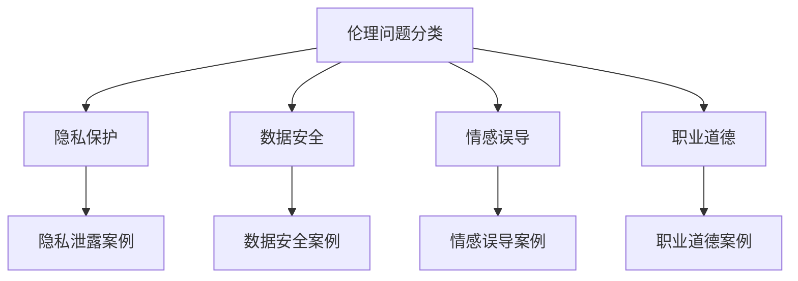

                 

### 《情感机器人伦理委员会：制定人机交互准则》

#### 关键词：情感机器人、伦理、人机交互、准则、人工智能

#### 摘要：
随着情感机器人的不断发展和普及，人机交互的伦理问题逐渐引起广泛关注。本文旨在探讨情感机器人伦理委员会的设立及其在制定人机交互准则中的重要性。通过对情感机器人的定义、伦理背景、伦理问题与挑战、伦理委员会的设立与运作以及未来展望的详细分析，本文旨在为情感机器人的伦理发展提供理论支持和实践指导。

## 第一部分：情感机器人概述与伦理背景

### 第1章：情感机器人的定义与现状

#### 1.1.1 情感机器人的定义
情感机器人是指具备情感识别、表达和反馈能力的机器人。这些机器人通过模拟人类的情感反应，能够与人类进行更为自然和深刻的交互。情感机器人的核心能力包括情感识别、情感表达、情感理解和情感反馈等。

#### 1.1.2 情感机器人的发展历程
情感机器人技术的发展经历了从简单到复杂、从模仿到智能的过程。早期的情感机器人主要是通过预设的情感模式来模拟人类情感，而现代的情感机器人则通过深度学习和自然语言处理等技术来实现更为复杂和自然的情感交互。

#### 1.1.3 情感机器人在现代社会的应用场景
情感机器人在现代社会中有着广泛的应用场景，包括客服机器人、教育机器人、医疗机器人、家庭陪伴机器人等。这些机器人能够为人类提供情感支持、辅助决策和个性化服务。

### 第2章：人机交互伦理的重要性

#### 2.1.1 人机交互伦理的概念
人机交互伦理是指围绕人机交互过程中的道德和法律问题所形成的伦理规范。人机交互伦理涉及到隐私保护、数据安全、情感误导和职业道德等方面。

#### 2.1.2 人机交互伦理的必要性
随着情感机器人的普及，人机交互的伦理问题日益突出。人机交互伦理的必要性在于确保情感机器人在与人类互动中不违背道德和法律原则，保护人类的隐私和权益。

#### 2.1.3 人机交互伦理的研究现状
目前，人机交互伦理的研究主要集中在隐私保护、数据安全和情感误导等方面。相关研究包括伦理框架的建立、伦理准则的制定和伦理问题的案例分析等。

## 第二部分：情感机器人的伦理问题与挑战

### 第3章：情感机器人伦理问题的分类

#### 3.1.1 隐私保护
情感机器人需要收集和处理大量用户数据，如语音、图像和文本等。隐私保护成为情感机器人伦理问题中的一个关键点。

#### 3.1.2 数据安全
情感机器人的数据处理和存储过程需要确保数据的安全性和完整性。数据泄露和滥用可能导致严重后果。

#### 3.1.3 情感误导
情感机器人通过模拟情感反应，可能会误导用户，导致用户对机器人的依赖和信任过度。

#### 3.1.4 职业道德
情感机器人在医疗、法律等领域的应用引发了对职业道德的挑战。机器人在这些领域中的行为需要遵循相应的道德规范。

### 第4章：情感机器人伦理问题的案例分析

#### 4.1.1 案例一：机器人助手隐私泄露
某情感机器人助手在用户使用过程中未对用户隐私进行有效保护，导致用户隐私泄露，引发了公众的担忧。

#### 4.1.2 案例二：人工智能助手歧视问题
某情感机器人在语音识别和响应过程中存在歧视现象，对某些特定群体产生了偏见，引发了社会的不满。

#### 4.1.3 案例三：机器人医生决策责任
某医疗情感机器人未能正确评估患者的病情，导致医生对患者的治疗决策产生了偏差，引发了医疗纠纷。

### 第5章：情感机器人的法律与道德框架

#### 5.1.1 法律法规的缺失与完善
目前，关于情感机器人的法律法规尚不完善，需要制定相关的法律法规来规范情感机器人的发展和应用。

#### 5.1.2 道德原则的确立
道德原则是情感机器人伦理准则的核心，需要明确情感机器人在人机交互中应遵循的道德原则。

#### 5.1.3 国际合作与标准制定
情感机器人的伦理问题具有全球性，需要国际合作和标准制定来推动全球伦理规范的发展。

## 第三部分：情感机器人伦理委员会的设立与运作

### 第6章：情感机器人伦理委员会的设立

#### 6.1.1 伦理委员会的设立目的
伦理委员会的设立旨在确保情感机器人在人机交互中的道德和法律合规性，维护人类的隐私和权益。

#### 6.1.2 伦理委员会的组织架构
伦理委员会应由多学科专家、伦理学家、法律专家和公众代表组成，以确保决策的公正性和代表性。

#### 6.1.3 伦理委员会的职能
伦理委员会的职能包括制定伦理准则、监督情感机器人的伦理合规性、处理伦理纠纷等。

### 第7章：情感机器人伦理准则的制定

#### 7.1.1 伦理准则的制定原则
伦理准则的制定应遵循公正性、透明性和可操作性等原则。

#### 7.1.2 伦理准则的制定流程
伦理准则的制定应经过调研、讨论、草案制定、公众咨询和发布等环节。

#### 7.1.3 伦理准则的具体内容
伦理准则应涵盖隐私保护、数据安全、情感误导和职业道德等方面的内容。

### 第8章：伦理委员会的运作与监督

#### 8.1.1 伦理委员会的运作机制
伦理委员会的运作应建立有效的会议机制、决策机制和监督机制。

#### 8.1.2 伦理监督的实施
伦理委员会应通过定期审计、投诉处理和公开报告等方式实施伦理监督。

#### 8.1.3 伦理委员会的可持续发展
伦理委员会的可持续发展需要充足的资金支持、专业人才的培养和公众意识的提升。

## 第四部分：未来展望

### 第9章：情感机器人伦理的发展趋势

#### 9.1.1 人工智能伦理的未来挑战
随着人工智能技术的发展，情感机器人伦理将面临更多挑战，如人工智能的道德决策、机器人的道德责任等。

#### 9.1.2 伦理委员会在人工智能发展中的作用
伦理委员会将在人工智能发展中发挥重要作用，确保人工智能的道德合规性和可持续发展。

#### 9.1.3 伦理准则的国际合作与推广
伦理准则的国际合作与推广将有助于建立全球伦理规范，推动情感机器人的全球发展。

### 第10章：总结与展望

#### 10.1.1 总结
本文通过对情感机器人的概述、伦理背景、伦理问题与挑战、伦理委员会的设立与运作以及未来展望的详细分析，为情感机器人的伦理发展提供了理论支持和实践指导。

#### 10.1.2 未来研究方向
未来研究方向包括情感机器人的道德决策、伦理准则的完善、伦理监督机制的创新等。

#### 10.1.3 对社会的影响
情感机器人伦理的发展将对社会产生深远影响，包括提升人机交互质量、保护用户隐私和权益、促进人工智能的可持续发展等。

### 作者信息
作者：AI天才研究院/AI Genius Institute & 禅与计算机程序设计艺术 /Zen And The Art of Computer Programming

## 附录
### Mermaid 流程图


### 核心算法原理讲解
```python
# 伪代码：情感分析算法
def sentiment_analysis(text):
    # 初始化情感词典
    sentiment_lexicon = {"happy": 1, "sad": -1, "neutral": 0}
    
    # 分词处理
    words = tokenize(text)
    
    # 情感得分计算
    sentiment_score = 0
    for word in words:
        if word in sentiment_lexicon:
            sentiment_score += sentiment_lexicon[word]
    
    # 情感判断
    if sentiment_score > 0:
        return "Positive"
    elif sentiment_score < 0:
        return "Negative"
    else:
        return "Neutral"
```

### 数学模型和数学公式
段落一：
$$
x = \frac{a}{b}
$$

段落二：
$$
y = mx + b
$$

### 项目实战
```python
# 伪代码：情感机器人伦理评估系统
class EthicalAssessmentSystem:
    def __init__(self):
        self.ethical_rules = load_ethical_rules()
    
    def assess(self, robot_action):
        for rule in self.ethical_rules:
            if rule_applies(rule, robot_action):
                return "Not compliant"
        return "Compliant"
```

### 最佳实践 tips、小结、注意事项、拓展阅读等内容
- **最佳实践 tips**：在开发情感机器人时，应充分考虑隐私保护和数据安全，确保用户数据的安全性和隐私性。
- **小结**：情感机器人的伦理问题是一个复杂而重要的议题，需要通过伦理委员会的设立和运作来制定和监督伦理准则。
- **注意事项**：在制定伦理准则时，应充分考虑社会和文化差异，确保准则的普适性和有效性。
- **拓展阅读**：读者可以进一步了解相关的研究论文和报告，如《人工智能伦理框架》、《情感机器人的隐私保护与数据安全》等。

