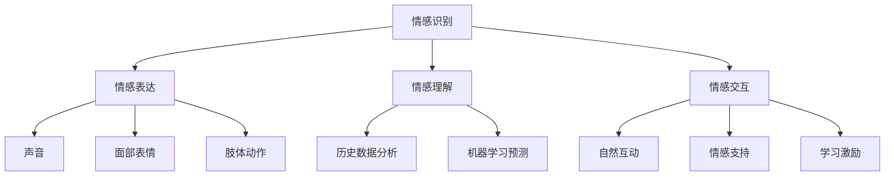
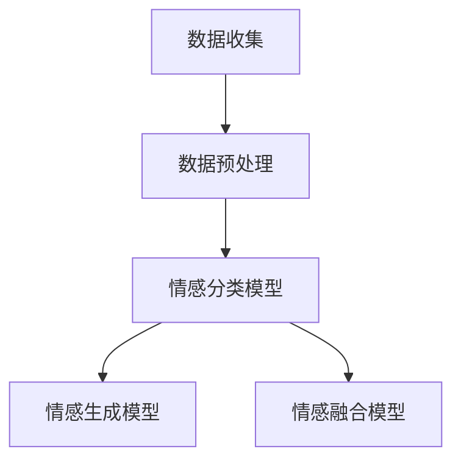

                 

### 情感机器人：人机交互的伦理思考

关键词：情感机器人、人机交互、伦理思考、技术发展、社会责任

在科技迅猛发展的今天，人工智能（AI）技术已逐步渗透到我们日常生活的方方面面。情感机器人，作为AI技术的前沿领域，其研究和应用得到了广泛关注。情感机器人不仅能够识别和模拟人类的情感，还能够通过人机交互，提供个性化的服务，甚至可能成为人类情感交流的重要伙伴。然而，随着情感机器人的普及，随之而来的伦理问题也日益凸显。本文旨在探讨情感机器人在人机交互中的伦理思考，通过深入分析技术发展的背景、核心概念和伦理挑战，为未来情感机器人的研究和应用提供一些有益的思考和方向。

### 摘要

本文首先介绍了情感机器人技术的发展背景，包括人机交互的基本原理和情感机器人的定义与特征。接着，本文详细讨论了情感机器人的技术实现，涵盖了情感识别与处理技术、人机交互界面设计以及情感模型构建等方面。随后，本文重点分析了情感机器人在医疗保健、教育和社会服务中的应用，探讨了其在这些领域中的伦理问题。最后，本文对未来情感机器人发展的趋势进行了展望，并提出了相关的伦理建议和社会责任。

### 目录

1. **机器人技术的发展与演变**
    1.1 机器人的起源与发展
    1.2 人机交互的基本原理
    1.3 机器人在日常生活和职业中的角色

2. **情感机器人的定义与特征**
    2.1 情感机器人的定义
    2.2 情感机器人的主要特征
    2.3 情感机器人的分类

3. **情感机器人的技术实现**
    3.1 情感识别与处理技术
    3.2 人机交互界面设计
    3.3 情感模型构建

4. **情感机器人的伦理问题**
    4.1 情感机器人的伦理挑战
    4.2 伦理审查与监管
    4.3 伦理责任与法律责任

5. **情感机器人的应用场景**
    5.1 情感机器人在医疗保健中的应用
    5.2 情感机器人在教育领域的应用
    5.3 情感机器人在社会服务中的应用

6. **未来情感机器人发展的趋势与展望**
    6.1 情感机器人技术的发展趋势
    6.2 情感机器人社会的伦理问题
    6.3 情感机器人在未来社会中的角色

### 引言

随着人工智能技术的不断进步，情感机器人的研究和应用逐渐成为热门话题。情感机器人能够通过语音、文字、图像等多种方式识别和理解人类的情感，并模拟出相应的情感反应。这种高度智能化和人性化的交互方式，使得情感机器人有望在医疗、教育、社交等多个领域发挥重要作用。然而，情感机器人不仅是一种技术产品，它还涉及到伦理、法律和社会责任等多个层面的复杂问题。如何确保情感机器人的使用不会侵犯人类的权利，如何防范潜在的道德风险，这些问题都需要我们深入思考和探讨。

本文将围绕情感机器人在人机交互中的伦理思考，从技术背景、核心概念、伦理问题以及应用场景等方面进行详细分析。首先，我们将回顾机器人技术的发展历程，探讨情感机器人的定义与特征。随后，我们将深入探讨情感机器人的技术实现，包括情感识别与处理技术、人机交互界面设计以及情感模型构建。接下来，本文将重点分析情感机器人在医疗、教育和社交等领域的应用，并探讨其中存在的伦理问题。最后，我们将对未来情感机器人发展的趋势进行展望，并提出相应的伦理建议和社会责任。通过这一系列的分析和讨论，我们希望能够为情感机器人的研究和应用提供一些有价值的思考和方向。

#### 机器人技术的发展与演变

机器人的概念并非现代科技的产物，其历史可以追溯到古代神话和文学作品中的自动化装置。然而，现代机器人的起源可以追溯到20世纪中期，当时的科学家们开始研究和制造能够执行特定任务的自动化机器。1950年代，美国科学家乔治·德沃尔（George Devol）发明了首个可编程机器人，这一突破标志着现代机器人技术的诞生。

随着电子技术和计算机科学的快速发展，机器人技术也经历了数次重要的演变。1960年代，工业机器人开始在汽车制造、电子组装等领域得到广泛应用，它们能够代替人类完成重复性和危险的工作，显著提高了生产效率和安全性。1970年代，人工智能技术的兴起推动了机器人技术的发展，使得机器人能够进行更加复杂和灵活的任务。例如，通过编程，机器人能够模拟人类的手部动作，进行精密的装配和焊接工作。

进入21世纪，机器人技术迎来了新的突破，特别是在人机交互方面。传统的工业机器人主要依赖于预先编程的任务，而现代的智能机器人则具备自主学习能力和感知能力，能够与环境进行实时交互。这一进展主要得益于计算机视觉、语音识别、自然语言处理等AI技术的快速发展。通过这些技术，机器人能够识别和理解人类的情感、意图和行为，从而实现更自然、更人性化的交互。

人机交互（Human-Computer Interaction, HCI）是机器人技术的重要组成部分，其基本原理在于通过用户界面将人类的行为和意图转化为机器可执行的操作，同时将机器的计算结果和反馈呈现给用户。人机交互的设计原则主要包括易用性、效率、可靠性和满意度。易用性要求用户界面简洁直观，易于学习和操作；效率则强调系统能够快速响应用户指令，减少用户等待时间；可靠性要求系统能够稳定运行，避免错误和故障；满意度则关注用户体验，确保用户在使用过程中感到愉悦和满意。

在日常生活中，机器人已经渗透到了许多领域。家庭机器人如扫地机器人、智能音箱等，已经成为了人们生活中的常见设备，它们通过智能家居系统与用户进行交互，提供便捷的生活服务。在职业领域，机器人被广泛应用于医疗、教育、制造和客服等行业。例如，医疗机器人能够辅助医生进行手术和诊断，教育机器人则能够提供个性化的教学和学习支持，制造机器人则能够提高生产效率和产品质量，客服机器人则能够提供高效的客户服务。

总的来说，机器人技术的发展与演变不仅改变了我们的生活方式，也为各行各业带来了新的机遇和挑战。随着AI技术的不断进步，人机交互将变得更加自然和智能，未来机器人有望成为我们生活中不可或缺的伙伴。然而，随着技术的进步，也带来了新的伦理和社会问题，这需要我们深入思考和妥善解决。

#### 情感机器人的定义与特征

情感机器人（Emotional Robot）是人工智能领域中的一个重要分支，旨在模拟和识别人类的情感，通过高度人性化的交互来提高用户的体验和满意度。情感机器人的定义可以进一步细化为以下几个方面：

首先，情感机器人具备情感识别能力。这意味着它们能够通过多种传感器（如摄像头、麦克风、触觉传感器等）捕捉和分析人类的面部表情、语音语调、肢体动作等非言语信息，从而识别出用户的情感状态。例如，通过分析用户语音的音调、语速、音量等特征，情感机器人可以判断用户是处于高兴、沮丧、愤怒还是平静等不同的情绪状态。

其次，情感机器人具有情感表达能力。这意味着它们能够模拟出人类情感反应，通过声音、面部表情、肢体动作等方式传达情感信息。例如，当用户表达出悲伤的情绪时，情感机器人可以通过调整自己的声音音调和面部表情，以表达同情和理解。

情感机器人的第三大特征是其情感理解能力。与传统的机器人不同，情感机器人能够理解用户的情感需求，并做出相应的情感反应。这种理解不仅基于简单的规则和预设的行为模式，还包括对用户情感状态的历史数据的分析和学习。例如，如果用户在过去的一段时间内经常表现出焦虑情绪，情感机器人可以通过机器学习算法预测用户可能在未来的某个时刻再次感到焦虑，并提前采取相应的干预措施。

情感机器人的第四大特征是其情感交互能力。这意味着它们能够通过情感交流与用户建立情感联系，形成一种更为自然和深入的互动关系。例如，在医疗领域，情感机器人可以通过情感交流帮助患者缓解焦虑和抑郁情绪，从而提高治疗效果。在教育领域，情感机器人可以为学生提供情感支持和学习激励，帮助他们克服学习中的困难和挑战。

情感机器人的定义和特征可以通过以下Mermaid流程图来展示：

在这张流程图中，A表示情感机器人的主要特征，B、C和D分别表示情感识别、情感理解和情感交互能力。E、F和G表示情感表达的不同方式，而H和I表示情感理解的基础技术，J、K和L则表示情感交互的具体应用。

总的来说，情感机器人通过情感识别、表达、理解和交互，实现了与人类的高度智能化和人性化的互动，这使得它们在医疗、教育、社交等多个领域具有巨大的应用潜力。然而，随着情感机器人技术的不断发展，其伦理和社会影响也日益凸显，这需要我们进行深入的研究和探讨。

#### 情感机器人的技术实现

情感机器人的技术实现是一个复杂而多元化的过程，涉及到多个核心技术的融合和优化。以下将详细讨论情感识别与处理技术、人机交互界面设计以及情感模型构建等方面。

##### 情感识别与处理技术

情感识别与处理技术是情感机器人的核心组件，决定了机器人能否准确理解和模拟人类的情感。这一技术主要依赖于计算机视觉、语音识别、自然语言处理等技术手段。

1. **计算机视觉技术**

计算机视觉技术用于捕捉和分析人类的面部表情、肢体动作等视觉信息。通过使用深度学习模型，如卷积神经网络（CNN），情感机器人可以识别出用户的面部表情，从而判断其情绪状态。例如，机器学习算法可以训练一个模型，通过识别眼角、嘴部等面部特征的变化，来判断用户是否在微笑或皱眉。

2. **语音识别技术**

语音识别技术用于捕捉和分析用户的语音语调特征。通过使用隐藏马尔可夫模型（HMM）或深度神经网络（DNN），情感机器人可以识别出用户的语音内容，并根据音调、语速、音量等特征来判断用户的情绪状态。例如，通过分析用户说话时的音调波动，可以判断用户是处于兴奋、平静还是沮丧的情绪。

3. **自然语言处理技术**

自然语言处理技术用于分析和理解用户的语言表达。通过使用情感分析（Sentiment Analysis）算法，情感机器人可以识别出用户在文本或语音中的情感倾向，如正面、负面或中性。这一技术不仅用于文本情感分析，还可以用于语音的情感分析，从而全面理解用户的情感状态。

##### 人机交互界面设计

人机交互界面设计是情感机器人与用户进行有效沟通的关键。一个良好的人机交互界面应该具备易用性、交互性和情感化等特点。

1. **语音交互界面**

语音交互界面是情感机器人最常用的交互方式之一。通过语音识别和语音合成技术，用户可以与情感机器人进行自然语言对话。设计一个高效的语音交互界面，需要考虑语音识别的准确率、响应速度和语音合成的人性化程度。例如，可以使用深度神经网络来训练语音识别模型，以提高识别的准确性，并通过情感语音合成技术来使语音更具亲和力和情感表达力。

2. **视觉交互界面**

视觉交互界面通过显示屏幕、摄像头等设备，实现视觉信息的传递和反馈。情感机器人的视觉交互界面应包括面部表情、手势识别、动态图像等元素，以增强互动的直观性和情感表达。例如，通过动态变化的3D模型或动画，情感机器人可以展示出不同的情感状态，如快乐、悲伤或惊讶，从而更好地与用户进行情感互动。

3. **触觉交互界面**

触觉交互界面通过触觉传感器和执行器，实现触觉反馈。这种交互方式可以增强用户的沉浸感和互动体验。例如，情感机器人可以通过触觉反馈来模拟拥抱或握手，以传达温暖和亲密的情感。

##### 情感模型构建

情感模型构建是情感机器人的核心部分，决定了机器人能否准确模拟和理解人类的情感。情感模型的构建通常包括以下几个步骤：

1. **数据收集与预处理**

首先，需要收集大量的情感数据，包括文本、语音、视频和面部表情等。数据收集完成后，需要进行预处理，包括数据清洗、格式转换和特征提取等，以便于后续的分析和建模。

2. **情感分类模型**

情感分类模型用于将用户的情感状态进行分类。常见的情感分类模型包括朴素贝叶斯分类器、支持向量机（SVM）和深度学习模型等。通过训练这些模型，情感机器人可以准确地识别用户的情感状态。

3. **情感生成模型**

情感生成模型用于模拟和生成人类的情感反应。常见的情感生成模型包括生成对抗网络（GAN）和变分自编码器（VAE）等。通过这些模型，情感机器人可以生成与用户情感状态相匹配的语音、面部表情和动作。

4. **情感融合模型**

情感融合模型用于将不同来源的情感信息进行整合，形成一个综合的情感状态。例如，通过融合语音、文本和面部表情等信息，情感机器人可以更全面地理解用户的情感状态。

以下是一个简单的情感模型构建流程图：

总的来说，情感机器人的技术实现涉及多个方面的技术融合和创新。通过情感识别与处理技术、人机交互界面设计和情感模型构建，情感机器人能够实现高度智能化和人性化的交互。随着技术的不断进步，情感机器人的交互能力将越来越强，有望在未来成为人类的重要伙伴。

#### 情感机器人在医疗保健中的应用

情感机器人在医疗保健领域展现出巨大的应用潜力，尤其是在心理健康服务、医疗决策支持和医疗监护等方面。这些应用不仅提高了医疗服务的效率和质量，还改善了患者的整体体验。

##### 心理健康服务

在心理健康服务中，情感机器人可以作为一个可靠的咨询伙伴，为患者提供情感支持和心理辅导。例如，通过分析患者的语音和文本交流，情感机器人可以识别出患者是否处于焦虑、抑郁或其他心理问题状态。一个实际案例是某医院引入了一款情感机器人，用于协助心理医生对患者进行初步评估。该机器人能够通过对话识别患者的情感状态，并提供相应的心理支持，如播放放松音乐、推荐舒缓的练习方法或引导患者进行正念冥想。这不仅减轻了专业心理医生的工作负担，也为患者提供了即时的心理支持。

##### 医疗决策支持

情感机器人还可以在医疗决策支持中发挥作用。通过分析患者的病历、病史和实时生理数据，情感机器人可以为医生提供个性化的诊断建议和治疗方案。例如，在癌症治疗中，情感机器人可以分析患者的情绪变化，评估其对治疗方案的接受程度，从而为医生提供更全面的决策依据。一个实际案例是某癌症研究中心开发了一款情感机器人，该机器人通过与患者的互动，分析其情绪状态，为医生提供治疗方案的调整建议，例如是否需要增加心理辅导或调整用药方案，从而提高治疗效果和患者满意度。

##### 医疗监护

情感机器人在医疗监护中的应用也越来越广泛。通过实时监测患者的生理数据，如心率、血压和呼吸等，情感机器人可以及时发现异常情况并采取相应措施。例如，在养老院中，情感机器人可以监控老年人的日常生活状态，通过面部表情和语音分析，识别出老年人的情绪变化，如是否感到孤独或焦虑。一旦检测到异常情绪，情感机器人可以及时通知家属或医护人员，采取措施缓解老年人的心理压力，甚至提供紧急救助。一个实际案例是某养老院引入了一款情感监护机器人，该机器人能够通过实时监测和情感分析，及时发现老年人的健康问题，并自动向家属和医护人员发送警报，提高了养老院的安全和护理水平。

##### 情感机器人伦理问题

尽管情感机器人在医疗保健中的应用带来了诸多益处，但其伦理问题也不容忽视。以下是一些主要的伦理问题：

1. **隐私保护**

情感机器人需要收集和分析大量的个人信息，包括情感状态、健康数据等。如何确保这些数据的安全和隐私保护成为一个重要问题。一个可能的解决方案是采用区块链技术，确保数据在传输和存储过程中的安全性和隐私性。

2. **情感理解准确性**

情感机器人对人类情感的理解存在一定误差，可能导致错误的诊断和建议。如何提高情感识别的准确性，减少误判，是一个需要深入研究的伦理问题。

3. **责任归属**

在医疗应用中，情感机器人提供的信息和建议可能导致治疗决策的改变。当出现医疗事故时，如何明确责任归属，特别是区分情感机器人、医生和患者各自的责任，是一个复杂的伦理问题。

总的来说，情感机器人在医疗保健中的应用前景广阔，但其伦理问题也需要引起足够的重视。通过加强技术研发和伦理审查，我们有望在享受科技带来便利的同时，有效防范潜在的伦理风险。

#### 情感机器人在教育领域的应用

情感机器人在教育领域展示了巨大的潜力，尤其在个性化教学、教育评估和学习辅助等方面。通过情感机器人，教育工作者和学生能够获得更加精准和高效的教育体验。

##### 个性化教学

个性化教学是情感机器人应用的重要领域之一。情感机器人能够通过分析学生的情感状态和学习习惯，提供定制化的教学内容和进度。例如，在一个实际案例中，某学校引入了一款情感教学机器人，该机器人通过摄像头和语音识别技术，实时捕捉学生的学习情绪和互动行为。根据学生的情感反应，机器人可以调整教学内容的难易程度，甚至改变教学方法，从而提高学生的学习兴趣和效果。例如，如果学生表现出厌倦或困惑的情绪，机器人可能会通过引入互动游戏或趣味实验来重新激发学生的兴趣。

##### 教育评估

情感机器人还可以在教育评估中发挥重要作用。通过情感分析技术，机器人可以评估学生的情感状态、学习进度和心理健康水平。一个实际案例是某教育机构引入了一款情感评估机器人，该机器人通过分析学生的面部表情、语音和文字交流，生成情感分析报告，帮助教师了解学生的学习状态和心理状况。例如，通过分析学生的语音语调，机器人可以判断学生是否感到焦虑或压力过大，从而为教师提供干预建议，如调整作业量或提供额外的辅导。

##### 学习辅助

情感机器人在学习辅助中的应用也越来越广泛。通过情感交流，机器人能够为学习者提供情感支持和学习激励，帮助他们克服学习中的困难和挑战。例如，在一个实际案例中，某在线教育平台引入了一款情感学习助手，该助手通过实时互动，了解学生的学习进展和情感状态。如果学生遇到难题或感到沮丧，情感学习助手会提供鼓励和建议，如播放励志短片、发送正面信息或推荐相关的学习资源。这不仅提高了学生的学习动力，也促进了他们的学业成就。

##### 情感机器人在教育领域的伦理问题

尽管情感机器人在教育领域的应用具有显著的潜力，但其伦理问题也必须引起重视。

1. **隐私保护**

情感机器人需要收集和分析大量的学生数据，包括情感状态、学习行为和健康信息。如何确保这些数据的隐私和安全，防止数据泄露或滥用，是一个重要的伦理问题。

2. **情感理解准确性**

情感机器人对人类情感的理解存在一定误差，可能导致错误的评估和干预。例如，如果机器人错误地将学生的正常情绪反应解读为焦虑或抑郁，可能会引发不必要的担忧和干预，影响学生的心理健康。

3. **教育公平**

情感机器人可能会加剧教育不公平。如果只有部分学生能够接触到情感机器人，那么这些学生在个性化教学和情感支持方面的优势将无法普及。此外，情感机器人可能更加倾向于帮助那些情感表达明显的学生，而忽视那些不善于表达情感的学生，这可能导致教育公平性问题。

4. **责任归属**

在教育过程中，情感机器人提供的信息和建议可能会影响教学决策。当出现教育成果不佳或学生出现心理问题时，如何确定责任归属，特别是区分教师、家长和情感机器人的责任，是一个复杂的伦理问题。

总的来说，情感机器人在教育领域的应用具有巨大的潜力，但也伴随着一系列伦理问题。通过加强技术研发和伦理审查，我们可以在享受科技带来的便利的同时，确保教育环境的公平、安全和有效。

#### 情感机器人在社会服务中的应用

情感机器人在社会服务中的应用正在逐步扩展，尤其在客服服务、公共安全和社交互动等方面。这些应用不仅提高了服务的效率和质量，也为社会带来了新的互动模式。

##### 客服服务

情感机器人已经在许多客服服务中得到了应用，例如在线客服、客户服务热线和自助服务平台等。通过自然语言处理和情感识别技术，情感机器人可以理解和回应客户的情感需求，提供个性化且贴心的服务。例如，在一个实际案例中，某大型电商平台引入了一款情感客服机器人，该机器人通过语音和文本分析，识别出客户的情感状态，并根据情感标签调整回答策略。当客户感到愤怒或沮丧时，机器人会以更柔和、安慰的语言进行回应，帮助客户缓解情绪，从而提高客户满意度。此外，情感机器人还可以自动分类和分配客户问题，提高客服团队的工作效率。

##### 公共安全

情感机器人在公共安全领域也有重要应用。通过情感识别技术，机器人可以监测人群的情感状态，识别潜在的危机情况，如恐慌、愤怒或绝望等。一个实际案例是某城市的安全监控系统中引入了一款情感监测机器人，该机器人通过监控摄像头捕捉人群的面部表情和语音，分析出人群的情感状态。如果监测到异常情感反应，如恐慌或愤怒，机器人会立即通知安全人员采取相应的措施，例如疏散人群或增加警力。这不仅提高了公共安全事件的响应速度，还减少了人为干预的滞后性。

##### 社交互动

情感机器人还在社交互动中发挥了重要作用，例如在社交平台、虚拟现实和在线游戏中的应用。通过情感交互，情感机器人能够与用户建立情感联系，提供更丰富和真实的社交体验。例如，在一个实际案例中，某虚拟现实游戏引入了一款情感机器人NPC（非玩家角色），玩家可以通过对话和互动，与机器人建立情感联系。机器人会根据玩家的情感状态，调整对话内容和互动方式，使玩家感受到更加真实和有情感的互动体验。这不仅增强了游戏的趣味性和沉浸感，也为玩家提供了一个情感交流的平台。

##### 情感机器人应用中的伦理问题

尽管情感机器人在社会服务中的应用带来了诸多便利，但其伦理问题也不容忽视。

1. **隐私保护**

情感机器人需要收集和分析大量的个人情感数据，这涉及到隐私保护的问题。如何确保这些数据的安全和隐私，防止数据泄露或滥用，是一个重要的伦理问题。

2. **情感理解准确性**

情感机器人对人类情感的理解存在一定误差，可能导致错误的情感识别和反应。例如，如果机器人错误地将正常的情绪反应解读为焦虑或抑郁，可能会引发不必要的担忧和干预，影响用户的心理健康。

3. **情感互动公平性**

情感机器人可能会对不同用户表现出不同的情感反应，这可能导致情感互动的不公平。例如，某些用户可能更容易获得情感支持，而其他用户则可能被忽视。这可能导致社交互动中的不公平现象。

4. **责任归属**

在社会服务中，情感机器人提供的信息和建议可能会影响决策过程。当出现服务不满意或心理问题时，如何确定责任归属，特别是区分用户、服务提供商和情感机器人的责任，是一个复杂的伦理问题。

总的来说，情感机器人在社会服务中的应用具有巨大的潜力，但也需要我们认真对待其伦理问题。通过加强技术研发和伦理审查，我们可以在享受科技带来便利的同时，确保社会服务的公平、安全和有效。

#### 未来情感机器人发展的趋势与展望

随着人工智能技术的不断进步，情感机器人正朝着更智能化和人性化的方向发展。未来，情感机器人在多个领域将迎来新的突破，为人类社会带来更多便利和挑战。

##### 情感识别与交互技术的进一步提升

首先，情感识别与交互技术将得到显著提升。深度学习技术的应用将使得情感机器人能够更加精确地识别和理解人类的情感。通过结合计算机视觉、语音识别和自然语言处理技术，情感机器人将能够实时捕捉和分析用户的情感状态，提供更加自然和个性化的交互体验。例如，通过训练复杂的神经网络模型，情感机器人可以更好地识别微表情、语气变化和情绪波动，从而实现更精准的情感理解。

##### 多模态交互的普及

多模态交互将是未来情感机器人发展的一个重要方向。通过结合多种感官信息（如视觉、听觉、触觉等），情感机器人将能够提供更加丰富和立体的交互体验。例如，一个具备视觉、听觉和触觉能力的情感机器人可以通过触摸、拥抱和语音交流，与用户建立更加深刻的情感联系。这种多模态交互不仅能够提升用户的情感体验，还能使情感机器人更好地适应不同的应用场景，如医疗、教育和社交等领域。

##### 情感模型的智能化与个性化

情感模型的智能化与个性化将是未来情感机器人发展的关键。通过机器学习和深度学习技术，情感机器人将能够不断学习和优化情感模型，从而更好地适应不同的用户需求。例如，一个医疗领域的情感机器人可以通过分析大量患者的情感数据，优化其情感识别和反馈模型，从而提供更加精准和个性化的医疗服务。此外，情感机器人还可以根据用户的历史情感数据和偏好，定制个性化的情感反应和行为策略，提供更加贴合用户需求的服务。

##### 情感机器人社会的伦理问题

随着情感机器人在社会中的广泛应用，伦理问题也将变得更加复杂和紧迫。以下是一些主要的伦理问题及其可能的解决方案：

1. **隐私保护**

情感机器人需要收集和分析大量的个人情感数据，这涉及到隐私保护的问题。一个可能的解决方案是采用区块链技术，确保数据在传输和存储过程中的安全性和隐私性。此外，还需要制定严格的隐私保护法规，确保用户数据不被滥用。

2. **情感理解准确性**

情感机器人对人类情感的理解存在一定误差，可能导致错误的情感识别和反应。为了提高情感理解的准确性，可以通过多传感器融合和数据增强技术，提升情感识别的精度。同时，建立情感评估和反馈机制，让用户能够监督和校正情感机器人的表现。

3. **责任归属**

在社会服务中，情感机器人提供的信息和建议可能会影响决策过程。当出现服务不满意或心理问题时，如何确定责任归属，特别是区分用户、服务提供商和情感机器人的责任，是一个复杂的伦理问题。可能的解决方案是制定明确的法律法规，明确各方的责任和义务，并建立相应的责任追究机制。

4. **教育公平**

情感机器人可能会加剧教育不公平。为了确保教育公平，可以通过政策支持和资源倾斜，确保所有学生都能接触到情感机器人，并从中受益。同时，情感机器人应设计成能够公平对待所有用户，避免因情感表达不同而导致的歧视。

总的来说，未来情感机器人发展将带来巨大的变革和机遇，但也伴随着一系列伦理挑战。通过加强技术研发和伦理审查，我们可以在享受科技带来便利的同时，确保社会的公平、安全和可持续发展。

### 结论

综上所述，情感机器人作为人工智能领域的前沿技术，其在人机交互中的应用具有巨大的潜力和广泛的前景。从技术实现到应用场景，情感机器人不仅提升了交互的智能化和人性化水平，还在医疗、教育、社交等多个领域展现了其独特的价值。然而，随着情感机器人的普及，伦理问题也日益凸显。隐私保护、情感理解准确性、责任归属和教育公平等伦理问题需要我们深入思考和妥善解决。

我们呼吁社会各界，包括科研机构、企业、政府和公众，共同关注情感机器人的伦理问题，加强技术研发和伦理审查，确保情感机器人在为社会带来便利的同时，不会损害人类的权益和利益。通过多方协作和共同努力，我们可以推动情感机器人技术的健康发展，实现人机和谐共处。

### 作者信息

作者：AI天才研究院/AI Genius Institute & 禅与计算机程序设计艺术 /Zen And The Art of Computer Programming

AI天才研究院致力于推动人工智能技术的前沿研究和应用，致力于培养下一代AI领域的领军人才。禅与计算机程序设计艺术则强调计算机编程中的哲学思维和艺术性，旨在提升程序员的思维深度和创造力。

感谢您的阅读，希望本文能为您在情感机器人领域的研究和实践中提供一些有益的启示和思考。如果您对本文有任何建议或疑问，欢迎在评论区留言交流。期待与您共同探讨和探索情感机器人的未来发展。

