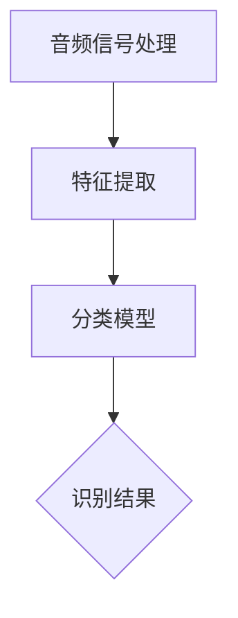
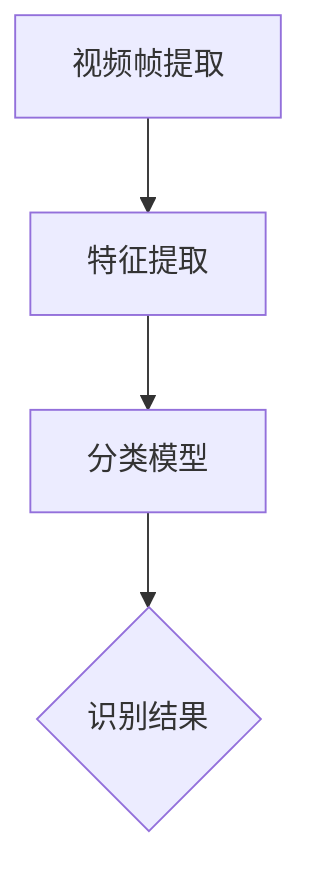
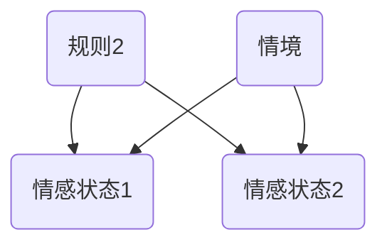
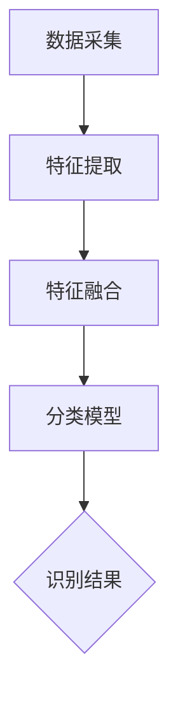
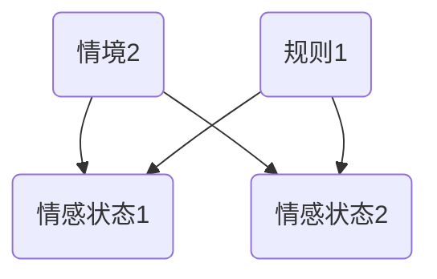
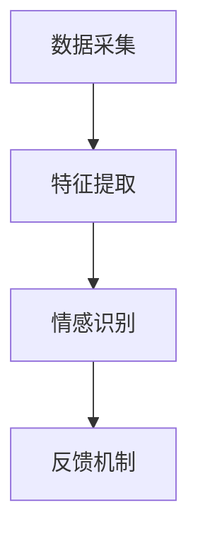
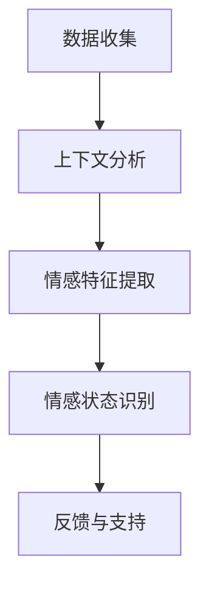
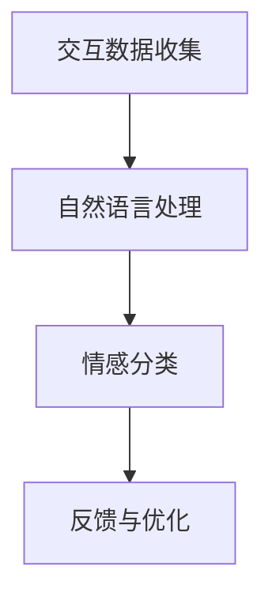

                 

### 情感计算前沿研究项目：人机情感交互的科技探索深化

#### 关键词
- 情感计算
- 人机交互
- 情感识别
- 机器学习
- 深度学习
- 前沿技术

#### 摘要
本文将深入探讨情感计算前沿研究项目，重点分析人机情感交互的科技探索深化。文章首先介绍了情感计算的基础理论，包括情感计算的定义、重要性及发展历程。接着，详细探讨了情感识别技术和情感建模技术，展示了声音情感识别、视频情感识别以及情感模型构建方法。随后，本文介绍了情感交互技术，包括情感交互的概念、实现方式和评价指标。在此基础上，文章分析了情感计算在教育、医疗、商业服务及娱乐领域的应用场景，展示了情感计算在这些领域的实际应用。最后，本文探讨了情感计算前沿研究的挑战与机遇，介绍了多模态情感计算、深度学习方法和情感计算与心理学的结合，并对未来发展趋势进行了展望。

## 目录大纲

本书《情感计算前沿研究项目：人机情感交互的科技探索深化》共分为三大部分，旨在系统性地介绍情感计算的基础理论、应用场景和前沿研究。

### 第一部分：情感计算基础理论
本部分将介绍情感计算的基本概念、重要性和发展历程，并深入探讨情感识别技术和情感建模技术，为后续的应用场景和前沿研究打下基础。

#### 1.1 情感计算概述
- 1.1.1 情感计算的定义
- 1.1.2 情感计算的重要性
- 1.1.3 情感计算的发展历程

#### 1.2 情感识别技术
- 1.2.1 声音情感识别
  - 1.2.1.1 音频信号处理
  - 1.2.1.2 特征提取
  - 1.2.1.3 分类模型
- 1.2.2 视频情感识别
  - 1.2.2.1 视频帧提取
  - 1.2.2.2 特征提取
  - 1.2.2.3 分类模型

#### 1.3 情感建模技术
- 1.3.1 情感模型构建方法
  - 1.3.1.1 基于规则的模型
  - 1.3.1.2 基于机器学习的模型
  - 1.3.1.3 基于深度学习的模型

#### 1.4 情感交互技术
- 1.4.1 情感交互的概念
- 1.4.2 情感交互的实现方式
- 1.4.3 情感交互的评价指标

### 第二部分：人机情感交互应用场景
本部分将深入分析情感计算在教育、医疗、商业服务及娱乐领域中的应用场景，探讨情感计算在这些领域的实际应用和价值。

#### 2.1 教育领域
- 2.1.1 教育情感计算的应用
- 2.1.2 学生的情感状态监测
- 2.1.3 教师的情感状态监测
- 2.1.4 教学互动的情感分析

#### 2.2 医疗保健领域
- 2.2.1 情感计算在心理健康监测中的应用
- 2.2.2 情感识别与心理健康关联
- 2.2.3 情感计算在心理治疗中的应用

#### 2.3 商业服务领域
- 2.3.1 情感计算在客户服务中的应用
- 2.3.2 客户情感状态识别
- 2.3.3 情感驱动的个性化服务

#### 2.4 娱乐领域
- 2.4.1 情感计算在虚拟现实中的应用
- 2.4.2 虚拟角色情感建模
- 2.4.3 情感驱动的游戏体验

### 第三部分：情感计算前沿研究
本部分将聚焦于情感计算前沿研究的挑战与机遇，探讨多模态情感计算、深度学习方法以及情感计算与心理学的结合。

#### 3.1 情感计算挑战与机遇
- 3.1.1 数据集问题
- 3.1.2 模型泛化问题
- 3.1.3 隐私保护问题

#### 3.2 前沿技术研究
- 3.2.1 多模态情感计算
  - 3.2.1.1 多模态数据采集
  - 3.2.1.2 多模态特征融合
  - 3.2.1.3 多模态情感识别
- 3.2.2 情感计算中的深度学习方法
  - 3.2.2.1 深度学习在情感计算中的应用
  - 3.2.2.2 情感计算中的深度学习模型
- 3.2.3 情感计算与心理学结合
  - 3.2.3.1 情感心理学理论
  - 3.2.3.2 情感计算与心理学研究方法

#### 3.3 未来发展趋势
- 3.3.1 情感计算在智能硬件中的应用
- 3.3.2 情感计算在智能城市中的角色
- 3.3.3 情感计算在教育、医疗等领域的潜在应用

### 附录
- 附录 A：情感计算常用工具和库
- 附录 B：情感计算相关资源与推荐阅读

### 后记
- 后记：人机情感交互的未来展望
  - 挑战与机遇
  - 发展趋势
  - 社会责任与伦理考量

通过以上三个主要部分的阐述，本书将全面展示情感计算的基础理论、应用场景和前沿研究，旨在为读者提供一部系统、全面且深入的情感计算技术指南。

## 第一部分：情感计算基础理论

### 1.1 情感计算概述

#### 1.1.1 情感计算的定义

情感计算（Affective Computing）是指计算机系统通过感知、理解和表达情感的能力，实现与人类更加自然、和谐和高效的交互。它是一个跨学科领域，涉及计算机科学、心理学、认知科学、人机交互等多个领域。情感计算的目标是使计算机能够理解、解释、处理和生成情感信息，从而提供更加人性化、个性化的服务。

#### 1.1.2 情感计算的重要性

情感计算在人工智能和人类交互中具有重要作用。随着技术的不断发展，人们对人机交互的体验要求越来越高，而情感计算能够帮助计算机更好地理解用户的情感状态，从而提供更加个性化和贴心的服务。具体来说，情感计算的重要性体现在以下几个方面：

1. **提升用户体验**：通过感知用户的情感状态，计算机可以提供更加个性化的服务，如情感化的推荐系统、情感化的客户支持等，从而提升用户体验。

2. **辅助决策**：情感计算可以帮助计算机更好地理解用户的情感需求，从而在决策过程中提供参考，如情感化的广告投放、情感化的医疗诊断等。

3. **人机交互**：情感计算使得计算机能够更加自然地与人类进行交互，如情感化的语音助手、情感化的虚拟助手等。

#### 1.1.3 情感计算的发展历程

情感计算的研究可以追溯到20世纪80年代末和90年代初。1995年，MIT媒体实验室的计算机科学家Joi Ito提出了“情感计算”的概念。此后，情感计算逐渐成为一个独立的研究领域，并得到了广泛的关注和快速发展。以下是一些关键的发展历程：

1. **1995-2000年**：情感计算的初步探索阶段。这一时期，研究人员主要关注情感计算的基本概念和情感识别技术。

2. **2000-2010年**：情感计算技术的发展阶段。这一时期，情感计算技术逐渐成熟，情感识别的准确率得到显著提高，应用场景也逐渐丰富。

3. **2010年至今**：情感计算的应用拓展阶段。随着深度学习、自然语言处理等技术的快速发展，情感计算的应用领域不断拓展，如智能客服、智能家居、虚拟现实等。

### 1.2 情感识别技术

情感识别技术是情感计算的核心组成部分，它涉及从数据中提取情感特征，并利用这些特征对情感进行分类和识别。情感识别技术主要包括声音情感识别和视频情感识别。

#### 1.2.1 声音情感识别

声音情感识别是指通过分析语音信号中的情感特征，对语音情感进行识别。声音情感识别的过程主要包括以下三个步骤：

1. **音频信号处理**：将原始语音信号转换为适合特征提取的格式，如时域信号、频域信号等。

2. **特征提取**：从音频信号中提取情感相关的特征，如频率、音调、音长、音量等。

3. **分类模型**：利用机器学习或深度学习算法，将提取到的特征进行分类，从而识别出不同的情感。

常见的声音情感识别模型包括支持向量机（SVM）、朴素贝叶斯（NB）、决策树（DT）等。随着深度学习技术的发展，深度神经网络（DNN）、卷积神经网络（CNN）等模型在声音情感识别中取得了较好的效果。

以下是一个简单的声音情感识别流程的 Mermaid 流程图：



#### 1.2.2 视频情感识别

视频情感识别是指通过分析视频中的情感特征，对视频情感进行识别。视频情感识别的过程主要包括以下三个步骤：

1. **视频帧提取**：从视频序列中提取关键帧或帧级特征，用于后续的情感分析。

2. **特征提取**：从提取的视频帧中提取情感相关的特征，如人脸表情、身体姿态、颜色、纹理等。

3. **分类模型**：利用机器学习或深度学习算法，将提取到的特征进行分类，从而识别出不同的情感。

常见的视频情感识别模型包括支持向量机（SVM）、朴素贝叶斯（NB）、决策树（DT）等。随着深度学习技术的发展，深度神经网络（DNN）、卷积神经网络（CNN）等模型在视频情感识别中取得了较好的效果。

以下是一个简单的视频情感识别流程的 Mermaid 流程图：



### 1.3 情感建模技术

情感建模技术是情感计算的重要组成部分，它涉及建立情感模型，以模拟人类的情感状态和情感表达。情感建模技术可以分为基于规则的方法、基于机器学习的方法和基于深度学习的方法。

#### 1.3.1 基于规则的方法

基于规则的方法是指通过定义一系列规则来描述情感状态和情感表达。这种方法通常依赖于专家经验和领域知识，能够快速地实现情感建模。但这种方法在面对复杂情境时，可能存在规则过于繁琐、难以维护的问题。

以下是一个简单的基于规则的模型示例：



#### 1.3.2 基于机器学习的方法

基于机器学习的方法是指通过训练模型，从数据中学习情感状态和情感表达的规律。这种方法通常利用大量的标注数据进行训练，能够自动识别复杂的情感模式。常见的机器学习算法包括支持向量机（SVM）、朴素贝叶斯（NB）、决策树（DT）等。

以下是一个简单的基于机器学习的模型示例：

```python
from sklearn.model_selection import train_test_split
from sklearn.svm import SVC

# 加载和预处理数据
X, y = load_data()

# 划分训练集和测试集
X_train, X_test, y_train, y_test = train_test_split(X, y, test_size=0.2, random_state=42)

# 训练模型
model = SVC()
model.fit(X_train, y_train)

# 评估模型
accuracy = model.score(X_test, y_test)
print("Accuracy:", accuracy)
```

#### 1.3.3 基于深度学习的方法

基于深度学习的方法是指利用深度神经网络（DNN）来学习情感状态和情感表达的复杂模式。这种方法能够自动提取特征，并在大量数据上表现出强大的学习能力。常见的深度学习模型包括卷积神经网络（CNN）、循环神经网络（RNN）和变换器（Transformer）等。

以下是一个简单的基于深度学习的模型示例：

```python
import tensorflow as tf
from tensorflow.keras.models import Sequential
from tensorflow.keras.layers import Conv2D, MaxPooling2D, Flatten, Dense

# 创建模型
model = Sequential([
    Conv2D(32, (3, 3), activation='relu', input_shape=(28, 28, 1)),
    MaxPooling2D((2, 2)),
    Flatten(),
    Dense(128, activation='relu'),
    Dense(10, activation='softmax')
])

# 编译模型
model.compile(optimizer='adam', loss='categorical_crossentropy', metrics=['accuracy'])

# 训练模型
model.fit(X_train, y_train, epochs=10, batch_size=64, validation_data=(X_test, y_test))

# 评估模型
accuracy = model.evaluate(X_test, y_test)[1]
print("Accuracy:", accuracy)
```

### 1.4 情感交互技术

情感交互技术是指通过情感计算实现计算机与人类之间的情感交流和互动。情感交互技术包括情感交互的概念、实现方式和评价指标。

#### 1.4.1 情感交互的概念

情感交互是指计算机系统通过感知、理解和表达情感，与人类进行情感交流和互动的过程。情感交互的目标是实现自然、高效、和谐的交互体验，提高人机交互的质量。

#### 1.4.2 情感交互的实现方式

情感交互的实现方式主要包括以下几种：

1. **语音交互**：通过语音识别和语音合成技术，实现人与计算机的语音交互。

2. **图像交互**：通过图像识别和表情识别技术，实现人与计算机的图像交互。

3. **文本交互**：通过自然语言处理技术，实现人与计算机的文本交互。

4. **多模态交互**：结合语音、图像、文本等多种交互方式，实现更丰富、自然的情感交互。

#### 1.4.3 情感交互的评价指标

情感交互的评价指标主要包括以下几种：

1. **交互自然度**：评估交互过程的自然性和流畅性。

2. **交互满意度**：评估用户对交互体验的满意度。

3. **交互效率**：评估交互过程的效率和效果。

4. **情感识别准确率**：评估情感识别的准确度。

通过以上对情感计算基础理论的介绍，读者可以初步了解情感计算的定义、重要性、发展历程以及情感识别技术和情感建模技术。接下来，我们将进一步探讨人机情感交互的应用场景和前沿研究，以更全面地理解情感计算的实际应用和价值。

## 第一部分：情感计算基础理论

### 1.1 情感计算概述

#### 情感计算的定义

情感计算（Affective Computing），作为一个跨学科领域，起源于计算机科学、心理学、认知科学和人机交互等多个学科。其核心定义是使计算机能够模拟、识别、处理和表达情感，从而实现更自然、和谐的人机交互。情感计算不仅仅关注于情感的识别，还包括情感的感知、理解和生成。简而言之，情感计算旨在赋予机器人类情感的能力。

#### 情感计算的重要性

在当今信息时代，人们对于人机交互的体验有了更高的要求。情感计算正是为了满足这一需求而诞生。它的重要性主要体现在以下几个方面：

1. **提升用户体验**：情感计算使得计算机能够感知用户的行为和情感状态，从而提供更加个性化、贴近用户需求的服务。例如，智能助手可以根据用户的情绪调整回答的语气和内容。

2. **增强人机交互**：通过情感计算，计算机能够更好地理解人类的行为和情感，从而实现更自然、流畅的交互。这有助于减少用户在操作计算机时的困惑和挫折感。

3. **辅助决策**：在许多场景中，情感状态是决策的重要参考因素。情感计算可以帮助计算机在情感层面上理解用户的意图，从而更准确地做出决策。

4. **心理健康支持**：在医疗保健领域，情感计算可以用于监测患者的情感状态，辅助医生进行诊断和治疗。例如，通过分析患者的语音和面部表情，可以识别出抑郁、焦虑等情绪问题。

#### 情感计算的发展历程

情感计算作为一个新兴领域，其发展历程可以追溯到20世纪90年代。以下是几个关键的发展阶段：

1. **1995年**：MIT媒体实验室的学者Joi Ito首次提出了“情感计算”的概念，标志着情感计算领域的诞生。

2. **2000年**：情感计算的研究开始受到学术界和工业界的关注，多个研究机构和公司开始投入到这一领域。

3. **2005年**：情感计算技术开始应用于实际产品中，如智能语音助手、情感化的广告等。

4. **2010年至今**：随着深度学习和人工智能技术的发展，情感计算技术取得了显著的进展。多模态情感识别、情感建模和情感生成等技术得到了广泛应用。

### 1.2 情感识别技术

情感识别技术是情感计算的核心组成部分，它涉及从数据中提取情感特征，并利用这些特征对情感进行分类和识别。情感识别技术可以分为声音情感识别和视频情感识别两大类。

#### 1.2.1 声音情感识别

声音情感识别（Audio Affective Recognition）是指通过分析语音信号中的情感特征，对语音情感进行识别。语音信号包含了丰富的情感信息，如音调、音色、音量、语速等。声音情感识别的过程通常包括以下步骤：

1. **音频信号处理**：将原始语音信号转换为适合特征提取的格式，如时域信号、频域信号等。这一步骤通常包括去噪、分帧、加窗等处理。

2. **特征提取**：从音频信号中提取情感相关的特征。常见的特征包括梅尔频率倒谱系数（MFCC）、共振峰频率（Formants）、音高（Pitch）等。

3. **分类模型**：利用机器学习或深度学习算法，对提取到的特征进行分类，从而识别出不同的情感。常见的分类模型有支持向量机（SVM）、朴素贝叶斯（NB）、决策树（DT）等。

以下是一个简单的声音情感识别流程的 Mermaid 流程图：


#### 1.2.2 视频情感识别

视频情感识别（Video Affective Recognition）是指通过分析视频中的情感特征，对视频情感进行识别。视频信号包含了图像和声音两个维度的信息，这使得视频情感识别更加复杂。视频情感识别的过程通常包括以下步骤：

1. **视频帧提取**：从视频序列中提取关键帧或帧级特征，用于后续的情感分析。这一步骤通常涉及视频预处理、帧级特征提取等。

2. **特征提取**：从提取的视频帧中提取情感相关的特征。常见的特征包括人脸表情、身体姿态、颜色、纹理等。

3. **分类模型**：利用机器学习或深度学习算法，对提取到的特征进行分类，从而识别出不同的情感。常见的分类模型有支持向量机（SVM）、朴素贝叶斯（NB）、决策树（DT）等。

以下是一个简单的视频情感识别流程的 Mermaid 流程图：


#### 1.2.3 多模态情感识别

多模态情感识别（Multimodal Affective Recognition）是指结合多种模态的数据（如声音、图像、文本等）进行情感识别。多模态情感识别可以充分利用不同模态数据的优势，提高情感识别的准确性和鲁棒性。

多模态情感识别的流程包括以下几个步骤：

1. **数据采集**：收集声音、图像、文本等多种模态的数据。

2. **特征融合**：将不同模态的数据进行特征提取，然后融合这些特征，形成统一的特征向量。

3. **分类模型**：利用机器学习或深度学习算法，对融合后的特征进行分类，从而识别出不同的情感。

多模态情感识别的 Mermaid 流程图如下：



### 1.3 情感建模技术

情感建模技术是指通过构建模型来模拟和预测情感状态。情感建模技术可以分为基于规则的方法、基于机器学习的方法和基于深度学习的方法。

#### 1.3.1 基于规则的方法

基于规则的方法（Rule-Based Methods）是指通过定义一系列规则来描述情感状态。这种方法通常依赖于专家经验和领域知识，可以快速实现情感建模。然而，当面对复杂情境时，规则可能过于繁琐，难以维护。

以下是一个简单的基于规则的情感建模示例：



#### 1.3.2 基于机器学习的方法

基于机器学习的方法（Machine Learning Methods）是指通过训练模型，从数据中学习情感状态的规律。这种方法通常利用大量的标注数据进行训练，能够自动识别复杂的情感模式。常见的机器学习算法包括支持向量机（SVM）、朴素贝叶斯（NB）、决策树（DT）等。

以下是一个简单的基于机器学习的情感建模示例：

```python
from sklearn.model_selection import train_test_split
from sklearn.svm import SVC

# 加载和预处理数据
X, y = load_data()

# 划分训练集和测试集
X_train, X_test, y_train, y_test = train_test_split(X, y, test_size=0.2, random_state=42)

# 训练模型
model = SVC()
model.fit(X_train, y_train)

# 评估模型
accuracy = model.score(X_test, y_test)
print("Accuracy:", accuracy)
```

#### 1.3.3 基于深度学习的方法

基于深度学习的方法（Deep Learning Methods）是指利用深度神经网络（DNN）来学习情感状态的复杂模式。这种方法能够自动提取特征，并在大量数据上表现出强大的学习能力。常见的深度学习模型包括卷积神经网络（CNN）、循环神经网络（RNN）和变换器（Transformer）等。

以下是一个简单的基于深度学习的情感建模示例：

```python
import tensorflow as tf
from tensorflow.keras.models import Sequential
from tensorflow.keras.layers import Conv2D, MaxPooling2D, Flatten, Dense

# 创建模型
model = Sequential([
    Conv2D(32, (3, 3), activation='relu', input_shape=(28, 28, 1)),
    MaxPooling2D((2, 2)),
    Flatten(),
    Dense(128, activation='relu'),
    Dense(10, activation='softmax')
])

# 编译模型
model.compile(optimizer='adam', loss='categorical_crossentropy', metrics=['accuracy'])

# 训练模型
model.fit(X_train, y_train, epochs=10, batch_size=64, validation_data=(X_test, y_test))

# 评估模型
accuracy = model.evaluate(X_test, y_test)[1]
print("Accuracy:", accuracy)
```

### 1.4 情感交互技术

情感交互技术是指通过情感计算实现计算机与人类之间的情感交流和互动。情感交互技术包括情感交互的概念、实现方式和评价指标。

#### 1.4.1 情感交互的概念

情感交互（Affective Interaction）是指计算机系统通过感知、理解和表达情感，与人类进行情感交流和互动的过程。情感交互的目标是实现自然、高效、和谐的交互体验，提高人机交互的质量。

#### 1.4.2 情感交互的实现方式

情感交互的实现方式主要包括以下几种：

1. **语音交互**：通过语音识别和语音合成技术，实现人与计算机的语音交互。

2. **图像交互**：通过图像识别和表情识别技术，实现人与计算机的图像交互。

3. **文本交互**：通过自然语言处理技术，实现人与计算机的文本交互。

4. **多模态交互**：结合语音、图像、文本等多种交互方式，实现更丰富、自然的情感交互。

#### 1.4.3 情感交互的评价指标

情感交互的评价指标主要包括以下几种：

1. **交互自然度**：评估交互过程的自然性和流畅性。

2. **交互满意度**：评估用户对交互体验的满意度。

3. **交互效率**：评估交互过程的效率和效果。

4. **情感识别准确率**：评估情感识别的准确度。

通过以上对情感计算基础理论的介绍，读者可以初步了解情感计算的定义、重要性、发展历程以及情感识别技术和情感建模技术。接下来，我们将进一步探讨人机情感交互的应用场景和前沿研究，以更全面地理解情感计算的实际应用和价值。

## 第二部分：人机情感交互应用场景

### 2.1 教育领域

#### 2.1.1 教育情感计算的应用

在教育领域，情感计算的应用已经得到了广泛的研究和探索。通过情感计算技术，教育系统能够更好地理解学生的情感状态，从而提供个性化的教育支持和干预。

1. **学生的情感状态监测**：利用情感计算技术，可以实时监测学生的情感状态，包括情绪、压力、兴趣等。通过分析学生的情感状态，教育者可以更好地了解学生的需求，调整教学方法，提高教学效果。

2. **教师的情感状态监测**：情感计算技术还可以用于监测教师的教学情感状态，包括情绪、压力、投入度等。这有助于学校和管理者更好地了解教师的工作状态，提供必要的支持和资源，确保教师身心健康。

3. **教学互动的情感分析**：情感计算技术可以分析教学互动中的情感信号，包括学生的反馈、教师的表情和语调等。通过这些数据，教育者可以优化教学互动，提高学生的参与度和满意度。

#### 实际案例

1. **案例一：智能教育平台**  
   某智能教育平台通过情感计算技术对学生进行情感状态监测，根据学生的情感状态调整教学内容和教学方法。例如，当学生表现出情绪低落时，平台会提供额外的激励措施，如表扬、鼓励等，帮助学生重拾学习兴趣。

2. **案例二：虚拟课堂助手**  
   在虚拟课堂中，情感计算技术可以帮助教师实时监测学生的情感状态，并通过表情识别和语音分析技术提供即时的情感反馈。例如，当学生表现出困惑或疑惑时，教师可以及时调整讲解内容，提供更详细的支持。

### 2.2 医疗保健领域

#### 2.2.1 情感计算在心理健康监测中的应用

在医疗保健领域，情感计算技术主要用于心理健康监测和诊断。通过分析患者的情感状态，情感计算可以帮助医生更好地了解患者的心理健康状况，提供更有效的治疗方案。

1. **情感识别与心理健康关联**：情感计算技术可以分析患者的情感状态，如情绪、焦虑、抑郁等，并将其与心理健康状况进行关联。这有助于医生更准确地诊断患者的心理健康问题。

2. **情感计算在心理治疗中的应用**：情感计算技术可以用于心理治疗的各个环节，包括评估、干预和康复。例如，在心理治疗过程中，情感计算技术可以实时监测患者的情感状态，为治疗师提供即时的反馈，优化治疗效果。

#### 实际案例

1. **案例一：心理健康监测系统**  
   某心理健康监测系统通过情感计算技术分析患者的语音和面部表情，监测患者的情感状态。系统可以根据分析结果向医生提供预警信号，帮助医生及时采取干预措施。

2. **案例二：虚拟心理治疗师**  
   虚拟心理治疗师结合情感计算技术，可以实时监测患者的情感状态，并提供个性化的心理治疗建议。例如，当患者表现出焦虑情绪时，虚拟心理治疗师可以提供深呼吸训练、放松音乐等辅助治疗方法。

### 2.3 商业服务领域

#### 2.3.1 情感计算在客户服务中的应用

在商业服务领域，情感计算技术主要用于提升客户服务质量，提供个性化的客户体验。通过情感计算技术，企业可以更好地理解客户的需求和情感状态，从而提供更加贴心和高效的服务。

1. **客户情感状态识别**：情感计算技术可以分析客户的语音、文本和面部表情等数据，识别客户的情感状态，如满意、不满意、愤怒等。这有助于企业及时识别客户的问题，提供针对性的解决方案。

2. **情感驱动的个性化服务**：通过情感计算技术，企业可以根据客户的情感状态提供个性化的服务。例如，当客户表现出满意情绪时，企业可以提供优惠券或会员积分奖励，增强客户忠诚度。

#### 实际案例

1. **案例一：智能客服系统**  
   某智能客服系统结合情感计算技术，可以实时分析客户的情感状态，并根据分析结果调整客服代表的回答策略。例如，当客户表现出愤怒情绪时，客服代表会采用更为耐心和安抚的语气进行回答。

2. **案例二：情感化的广告投放**  
   某广告公司利用情感计算技术分析用户的情感状态，根据用户的情感偏好进行广告投放。例如，当用户表现出愉悦情绪时，广告公司会向用户推送愉悦氛围的广告，提高广告效果。

### 2.4 娱乐领域

#### 2.4.1 情感计算在虚拟现实中的应用

在娱乐领域，情感计算技术主要用于提升虚拟现实（VR）和增强现实（AR）体验。通过情感计算技术，虚拟角色可以更好地模拟人类情感，提高用户的沉浸感和互动性。

1. **虚拟角色情感建模**：情感计算技术可以帮助虚拟角色理解和表达情感。例如，当用户表现出兴奋情绪时，虚拟角色可以表现出相应的兴奋表情和动作。

2. **情感驱动的游戏体验**：通过情感计算技术，游戏可以实时分析用户的情感状态，调整游戏难度和情节，提供个性化的游戏体验。例如，当用户表现出恐惧情绪时，游戏可以增加恐怖元素，提高游戏紧张感。

#### 实际案例

1. **案例一：情感化的虚拟助手**  
   某虚拟助手结合情感计算技术，可以实时分析用户的情感状态，并根据用户的情感偏好调整对话内容。例如，当用户表现出开心情绪时，虚拟助手会采用轻松幽默的语言与用户互动。

2. **案例二：情感化的VR游戏**  
   某VR游戏结合情感计算技术，可以实时分析用户的情感状态，调整游戏场景和角色动作。例如，当用户表现出紧张情绪时，游戏会增加挑战难度，提高用户的兴奋感。

通过以上实际案例，我们可以看到情感计算技术在教育、医疗、商业服务和娱乐等领域的广泛应用。情感计算技术的不断发展和完善，将进一步推动人机情感交互的深化，为人类生活带来更多便利和乐趣。

## 第二部分：人机情感交互应用场景

### 2.1 教育领域

#### 2.1.1 教育情感计算的应用

在教育领域，情感计算技术正在逐渐改变传统的教学模式，通过个性化、互动化的方式提升学生的学习效果和教师的教学质量。以下是教育情感计算在几个关键方面的应用：

1. **学生的情感状态监测**：通过情感计算技术，教育系统可以实时监测学生的情感状态，包括情绪、焦虑、兴趣等。这有助于教育者及时了解学生的心理状况，采取适当的干预措施，帮助学生应对学习中的困难和挑战。

   - **情感识别工具**：利用机器学习和深度学习算法，可以分析学生的语音、面部表情、生理信号（如心率、皮肤电活动）等数据，识别出学生的情感状态。
   - **应用实例**：例如，智能教室系统可以通过摄像头和麦克风监测学生的情绪变化，当检测到学生情绪低落时，系统会自动提醒教师进行关怀和调整教学策略。

2. **教师情感状态监测**：情感计算技术同样可以应用于监测教师的情感状态，帮助学校管理层和教师本人了解教学过程中的心理压力，提供心理健康支持和资源。

   - **教师情感分析**：通过对教师的语音、面部表情和行为分析，可以识别出教师的工作压力、情绪波动等。
   - **应用实例**：例如，学校可以定期使用情感计算工具对教师进行心理健康评估，并提供心理健康讲座、咨询服务等。

3. **教学互动的情感分析**：情感计算技术可以分析教学过程中的互动，包括学生的反馈、教师的表情和语调等，为教育者提供反馈，优化教学设计。

   - **互动分析工具**：通过自然语言处理和情感分析技术，可以识别学生在课堂上的情感反应，如参与度、兴趣、满意度等。
   - **应用实例**：例如，教育软件可以分析学生在在线讨论中的发言情感，帮助教师了解学生的参与情况，调整讨论话题和互动方式。

#### 2.1.2 学生情感状态监测的具体实现

学生情感状态的监测通常涉及以下几个步骤：

1. **数据采集**：使用传感器和设备（如摄像头、麦克风、穿戴设备等）收集学生的生理信号和行为数据。

2. **特征提取**：对采集到的数据进行分析，提取与情感状态相关的特征，如面部表情编码、语音情感特征、生理信号变化等。

3. **情感识别**：利用机器学习算法（如支持向量机、深度神经网络等）训练模型，对提取的特征进行情感分类，识别学生的情感状态。

4. **反馈机制**：将识别结果反馈给教师或学生，帮助进行情感调节和教学调整。

以下是一个简单的学生情感状态监测的 Mermaid 流程图：



#### 2.1.3 教师情感状态监测的具体实现

教师情感状态监测的实现过程与学生情感状态监测类似，但需要考虑更多的上下文信息，如教学任务、班级状况等。以下是一个简单的教师情感状态监测的流程：

1. **数据收集**：收集教师的语音、面部表情、教学行为等数据。

2. **上下文分析**：结合教学日志、课堂记录等数据，分析教师的工作环境和任务。

3. **情感特征提取**：提取与教师情感状态相关的特征，如语音情感分析、面部表情编码等。

4. **情感状态识别**：利用机器学习模型对提取的特征进行分类，识别教师的情感状态。

5. **反馈与支持**：将识别结果反馈给教师，并提供心理健康支持和资源。

以下是一个简单的教师情感状态监测的 Mermaid 流程图：



#### 2.1.4 教学互动的情感分析的具体实现

教学互动的情感分析通常涉及以下几个方面：

1. **交互数据收集**：收集学生与教师之间的互动数据，如课堂发言、提问、反馈等。

2. **自然语言处理**：对互动数据进行分析，提取与情感相关的信息，如情感词汇、情感极性等。

3. **情感分类**：利用情感分类算法，对提取的情感信息进行分类，识别教学互动的情感状态。

4. **反馈与优化**：将情感分析结果反馈给教师，帮助优化教学互动。

以下是一个简单的教学互动的情感分析的 Mermaid 流程图：



通过上述具体实现的讨论，我们可以看到情感计算技术在教育领域的广泛应用和深远影响。它不仅提高了教学质量和学生的学习效果，还为教育者的决策提供了有力的支持。

### 2.2 医疗保健领域

#### 2.2.1 情感计算在心理健康监测中的应用

在医疗保健领域，情感计算技术正逐渐成为心理健康监测的重要工具。它通过分析患者的情感状态，帮助医生更准确地评估患者的心理健康状况，并提供个性化的治疗方案。

1. **情感识别与心理健康关联**：

   - **情感识别技术**：利用情感计算技术，可以分析患者的语音、面部表情、生理信号等数据，识别出患者的情感状态，如焦虑、抑郁、愤怒等。
   - **关联分析**：将情感状态与心理健康状况进行关联，识别出潜在的心理学问题。例如，通过分析患者的语音语调，可以判断患者是否存在抑郁情绪，进而指导医生进行进一步的诊断和治疗。

2. **情感计算在心理治疗中的应用**：

   - **实时监测**：在心理治疗过程中，情感计算技术可以实时监测患者的情感状态，为治疗师提供即时的反馈，帮助他们调整治疗方案和干预策略。
   - **个性化干预**：根据患者的情感状态，情感计算技术可以提供个性化的干预建议。例如，当患者表现出焦虑情绪时，系统可以推荐深呼吸训练、放松音乐等辅助治疗方法。

#### 情感计算在心理健康监测中的具体应用实例：

1. **心理健康监测系统**：

   - **应用场景**：某心理健康监测系统结合情感计算技术，可以实时监测患者的语音和面部表情，分析患者的情感状态。
   - **实现方法**：系统通过麦克风和摄像头收集患者的语音和面部表情数据，利用机器学习和深度学习算法进行情感识别，并将识别结果反馈给医生。医生根据分析结果，提供个性化的治疗方案。
   - **优势**：实时监测和个性化干预有助于提高心理治疗效果，缩短治疗周期，减轻患者痛苦。

2. **虚拟心理治疗师**：

   - **应用场景**：某虚拟心理治疗师结合情感计算技术，为患者提供24/7的心理健康支持。
   - **实现方法**：虚拟心理治疗师通过自然语言处理和情感计算技术，分析患者的情感状态，提供文字或语音形式的情感反馈和干预建议。例如，当患者表现出焦虑情绪时，虚拟心理治疗师会提供放松训练和情绪调节技巧。
   - **优势**：全天候的心理健康支持有助于患者随时获得帮助，提高心理健康水平。

#### 情感计算在心理治疗中的应用实例：

1. **情绪反馈系统**：

   - **应用场景**：某情绪反馈系统用于辅助心理治疗师对患者进行情绪调节。
   - **实现方法**：系统通过面部表情识别技术，实时监测患者的情绪变化，并根据分析结果提供个性化的情绪调节建议。例如，当患者表现出愤怒情绪时，系统会建议患者进行深呼吸练习，帮助缓解愤怒情绪。
   - **优势**：实时情绪反馈和个性化建议有助于患者更好地掌握情绪调节技巧，提高心理治疗的效果。

2. **情感计算辅助诊断系统**：

   - **应用场景**：某情感计算辅助诊断系统用于辅助医生对患者进行心理健康评估。
   - **实现方法**：系统通过分析患者的语音、面部表情和生理信号等数据，识别出患者的情感状态，并将分析结果与心理健康数据库进行对比，为医生提供诊断建议。
   - **优势**：情感计算技术可以提供更加客观、全面的诊断信息，帮助医生做出更准确的诊断，提高治疗方案的针对性。

通过以上实例，我们可以看到情感计算技术在医疗保健领域，特别是在心理健康监测和心理治疗中的应用潜力。随着技术的不断进步，情感计算将在医疗保健领域发挥越来越重要的作用，为患者提供更加精准、个性化的心理健康服务。

### 2.3 商业服务领域

#### 2.3.1 情感计算在客户服务中的应用

在商业服务领域，情感计算技术正被广泛应用于客户服务中，通过分析客户的情感状态，提供更加个性化、高效的服务体验。以下是情感计算在客户服务中的具体应用：

1. **客户情感状态识别**：

   - **语音情感识别**：利用情感计算技术，可以对客户的语音进行情感分析，识别出客户的情感状态，如满意、不满意、愤怒等。
   - **文本情感分析**：通过自然语言处理技术，可以分析客户的文本反馈，如电子邮件、社交媒体评论等，识别出客户的情感倾向。
   - **面部表情识别**：在面对面交流中，利用情感计算技术，可以分析客户的面部表情，识别出客户的心理状态。

2. **情感驱动的个性化服务**：

   - **个性化推荐**：根据客户的历史数据和情感状态，情感计算技术可以提供个性化的产品推荐和服务建议。例如，当客户表现出满意情感时，系统可以推荐类似的商品或服务，增强客户的购买意愿。
   - **情感化客服**：客服人员通过情感计算技术分析客户的情感状态，调整沟通方式和内容，提供更加贴心的服务。例如，当客户表现出愤怒情绪时，客服人员可以采用安抚性语言，帮助客户缓解情绪。
   - **自动化客户服务**：利用情感计算技术，可以开发自动化客服系统，如聊天机器人，通过分析客户的情感状态，提供及时、准确的回答和建议。

#### 情感计算在客户服务中的具体实现实例：

1. **智能客服系统**：

   - **应用场景**：某电商平台的智能客服系统通过情感计算技术，为客户提供24/7的在线支持。
   - **实现方法**：系统利用语音和文本情感分析技术，实时分析客户的情感状态，根据情感分析结果，提供个性化的回答和建议。例如，当客户表现出不满情感时，系统会自动转接至高级客服，提供更详细的帮助。
   - **优势**：智能客服系统能够快速响应客户需求，提高客户满意度，降低人工成本。

2. **情感化广告投放**：

   - **应用场景**：某广告公司利用情感计算技术，针对不同客户群体进行情感化的广告投放。
   - **实现方法**：系统通过分析客户的社交媒体行为和情感状态，了解客户的兴趣和偏好，根据情感分析结果，制定个性化的广告策略。例如，当客户表现出愉悦情感时，系统会推送相关广告，增强广告效果。
   - **优势**：情感化广告投放能够提高广告的针对性和效果，提升客户转化率。

3. **个性化客户体验**：

   - **应用场景**：某酒店利用情感计算技术，为客户提供个性化的入住体验。
   - **实现方法**：系统通过分析客户的历史数据和行为，了解客户的偏好和需求，根据情感分析结果，提供个性化的服务和推荐。例如，当客户表现出疲惫情感时，系统会主动推荐休息区和放松活动。
   - **优势**：个性化客户体验能够提高客户满意度和忠诚度，增强品牌形象。

通过上述实例，我们可以看到情感计算技术在商业服务领域的广泛应用和巨大潜力。它不仅能够提高客户服务质量，还能为企业带来显著的商业价值。

### 2.4 娱乐领域

#### 2.4.1 情感计算在虚拟现实中的应用

在娱乐领域，虚拟现实（VR）技术正在迅速发展，而情感计算技术则为VR体验注入了更加真实和丰富的情感元素。以下是情感计算在虚拟现实中的应用：

1. **虚拟角色情感建模**：

   - **情感表达**：通过情感计算技术，虚拟角色可以模拟人类的情感表达，如喜怒哀乐、紧张和放松等。这有助于增强用户的沉浸感，让用户更加投入到虚拟世界中。
   - **情感反馈**：虚拟角色可以根据用户的情感状态做出相应的情感反馈。例如，当用户表现出兴奋情绪时，虚拟角色可以回应以鼓励和赞赏，而当用户感到恐惧时，虚拟角色可以提供安慰和支持。

2. **情感驱动的游戏体验**：

   - **情感触发**：情感计算技术可以识别用户的情感状态，触发相应的游戏情节和挑战。例如，当用户感到紧张时，游戏可以增加难度，提供更加刺激的体验；而当用户感到放松时，游戏可以提供轻松的任务和奖励。
   - **情感同步**：在多人游戏中，情感计算技术可以同步玩家的情感状态，增强社交互动的深度。例如，当玩家表现出愤怒情绪时，其他玩家可以感知到这一情绪，从而调整自己的行为，如选择合作或竞争策略。

#### 情感计算在虚拟现实中的具体应用实例：

1. **情感化虚拟助手**：

   - **应用场景**：在虚拟现实环境中，虚拟助手通过情感计算技术，提供个性化、情感化的服务。
   - **实现方法**：虚拟助手通过分析用户的语音、面部表情和行为数据，识别用户的情感状态，并根据情感分析结果，调整对话内容和交互方式。例如，当用户感到无聊时，虚拟助手可以提供有趣的互动活动；当用户感到困惑时，虚拟助手可以提供清晰的解释和帮助。
   - **优势**：情感化虚拟助手能够提供更加自然、贴心的服务，提升用户体验。

2. **情感驱动的VR游戏**：

   - **应用场景**：在VR游戏中，情感计算技术用于增强游戏体验，提供更加沉浸和互动的游戏场景。
   - **实现方法**：游戏通过情感计算技术分析玩家的情感状态，调整游戏难度、情节和角色互动。例如，当玩家表现出恐惧情绪时，游戏可以增加恐怖元素，提升紧张感；当玩家表现出放松情绪时，游戏可以提供轻松的关卡和奖励，增强玩家的游戏乐趣。
   - **优势**：情感驱动的VR游戏能够提供更加个性化和沉浸的体验，吸引更多用户。

3. **情感互动体验**：

   - **应用场景**：在虚拟现实环境中，用户可以与虚拟角色进行情感互动，体验真实的人际交往。
   - **实现方法**：通过情感计算技术，虚拟角色能够模拟人类的情感反应，与用户进行情感互动。例如，用户可以通过面部表情和语音与虚拟角色交流，虚拟角色可以根据用户的情感表达做出相应的情感反应，增强用户的情感体验。
   - **优势**：情感互动体验能够提升用户的情感共鸣和沉浸感，为虚拟现实应用带来更多的可能性。

通过上述实例，我们可以看到情感计算技术在虚拟现实领域的广泛应用和潜力。它不仅丰富了虚拟现实体验，还为人机情感交互提供了新的维度，为未来的娱乐产业带来了更多创新和可能性。

### 2.4.1 情感计算在虚拟现实中的应用

在虚拟现实（VR）技术日益成熟的今天，情感计算正逐渐成为提升用户体验的关键因素。通过情感计算，VR系统可以捕捉和模拟用户的情感状态，使虚拟体验更加真实和丰富。以下是情感计算在虚拟现实中的几个关键应用：

1. **情感捕捉与模拟**：

   - **情感捕捉**：利用面部表情识别、语音分析和生理信号监测等技术，情感计算可以捕捉用户的情感状态。例如，通过摄像头和微

