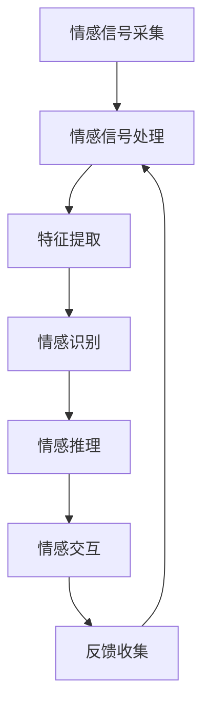

                 

### 1.1 情感计算的定义与基本原理

#### 1.1.1 情感计算的发展历程

情感计算（Affective Computing）这一概念最早由计算机科学家约翰·霍普金斯大学的罗纳德·M·里夫金（Ronald M. Licker）在1995年提出。里夫金将情感计算定义为“研究如何使计算系统具备情感理解、表达和建模的能力”。这一概念迅速引起了学术界和工业界的关注，成为计算机科学与人工智能领域的一个重要研究方向。

从最初的理论探讨，到如今的技术实现，情感计算的发展经历了几个重要的阶段：

- **第一阶段（1995-2000年）**：在这一阶段，情感计算主要聚焦于情感识别和表达的基础研究。研究者们开始探索如何利用计算机技术捕捉和理解人类的情感状态。

- **第二阶段（2001-2010年）**：随着计算机性能的提升和传感器技术的进步，情感计算的应用范围逐渐扩展。语音、图像和生理信号等情感信息的处理技术得到了显著的发展。

- **第三阶段（2011年至今）**：这一阶段，人工智能和深度学习技术的兴起为情感计算带来了新的机遇。通过大数据分析和机器学习算法，情感计算开始向更加智能化、自动化的方向发展。

#### 1.1.2 情感计算的关键概念

情感计算涉及多个核心概念，以下将介绍其中几个重要的概念：

1. **情感识别**：情感识别是指通过计算机系统自动检测和识别用户情感状态的过程。这一过程通常涉及到情感分析、模式识别等技术。

2. **情感表达**：情感表达是指计算机系统在理解用户情感后，通过适当的媒介（如语音、文字、面部表情等）来表达相应的情感。

3. **情感理解**：情感理解是指计算机系统在捕捉和识别用户情感后，能够对情感进行深入理解和分析，从而提供更加个性化的服务。

4. **情感建模**：情感建模是指通过构建情感模型，模拟和预测用户情感状态，从而优化系统的交互效果。

#### 1.1.3 情感计算的基本原理

情感计算的基本原理主要包括以下几个方面：

1. **情感信号的采集与处理**：情感计算首先需要通过传感器等设备采集用户的生理、行为数据，如心率、面部表情、语音等。然后，利用信号处理技术对这些数据进行分析和特征提取。

2. **情感特征的识别与分类**：通过特征提取，情感计算系统可以对用户的情感状态进行识别和分类。常用的方法包括机器学习、深度学习等技术。

3. **情感推理与决策**：在情感识别的基础上，系统可以根据情感推理和决策算法，对用户的情感进行理解和回应。例如，通过情感推理，系统可以判断用户是否满意，是否需要提供帮助等。

4. **情感交互与反馈**：系统根据情感推理的结果，通过适当的媒介（如语音、文字、面部表情等）与用户进行情感交互，并收集用户的反馈，以进一步优化系统的性能。

总的来说，情感计算通过情感信号的采集与处理、情感特征的识别与分类、情感推理与决策以及情感交互与反馈，实现了对人类情感的智能理解和回应。

#### 1.1.3 情感计算的基本原理架构

为了更好地理解情感计算的基本原理，我们可以通过Mermaid流程图来展示其核心组件和流程。



- **情感信号采集**：通过传感器（如心电传感器、摄像头、麦克风等）采集用户的生理、行为数据。
- **情感信号处理**：对采集到的信号进行预处理，如滤波、归一化等，以提高后续处理的准确性。
- **特征提取**：从预处理后的信号中提取能够反映情感状态的的特征，如心率变异、面部表情参数、音调等。
- **情感识别**：利用机器学习或深度学习算法对提取的特征进行分类，以识别用户的情感状态。
- **情感推理**：在情感识别的基础上，结合上下文信息，对用户的情感状态进行深入理解和分析。
- **情感交互**：根据情感推理的结果，通过语音、文字、面部表情等渠道与用户进行情感互动。
- **反馈收集**：收集用户的反馈，用于优化系统的性能和交互效果。

通过这个流程图，我们可以清晰地看到情感计算的基本原理和各个组件之间的关系。

#### 1.1.4 情感计算的核心算法原理

情感计算的核心算法原理主要包括情感识别和情感推理两个部分。以下将分别介绍这两个核心算法的基本原理。

##### 1.1.4.1 情感识别

情感识别是指通过分析用户的行为数据，如语音、面部表情、生理信号等，来识别用户的情感状态。这一过程通常涉及以下几种技术：

1. **语音情感识别**：语音情感识别是通过分析语音信号中的情感特征，如音调、音速、语调等，来判断用户的情感状态。常用的算法包括：

   - **隐马尔可夫模型（HMM）**：HMM是一种统计模型，用于识别语音信号中的情感模式。
   - **支持向量机（SVM）**：SVM是一种分类算法，通过构建最优分类超平面，实现对语音情感的有效分类。
   - **深度神经网络（DNN）**：DNN是一种多层神经网络，通过学习语音信号的深度特征，实现对情感的高效识别。

2. **面部表情识别**：面部表情识别是通过分析面部图像中的情感特征，如眼角皱纹、嘴巴张开程度等，来判断用户的情感状态。常用的算法包括：

   - **卷积神经网络（CNN）**：CNN是一种用于图像识别的深度学习模型，通过学习面部图像的特征，实现对情感的有效识别。
   - **循环神经网络（RNN）**：RNN是一种适用于序列数据的神经网络，通过分析面部表情的时间序列特征，实现对情感的有效识别。

3. **生理信号识别**：生理信号识别是通过分析用户的生理信号，如心率、皮肤电信号等，来判断用户的情感状态。常用的算法包括：

   - **频域分析**：频域分析是一种用于分析信号频率成分的技术，通过分析生理信号的频域特征，实现对情感的有效识别。
   - **时域分析**：时域分析是一种用于分析信号时间特征的技术，通过分析生理信号的时域特征，实现对情感的有效识别。

##### 1.1.4.2 情感推理

情感推理是在情感识别的基础上，结合上下文信息，对用户的情感状态进行深入理解和分析的过程。情感推理的核心是情感建模，即通过构建情感模型来模拟和预测用户的情感状态。

1. **情感模型构建**：情感模型构建是指通过学习用户的情感数据，构建一个能够模拟用户情感状态的模型。常用的方法包括：

   - **贝叶斯网络**：贝叶斯网络是一种概率图模型，通过学习用户的情感数据，构建一个概率模型，实现对用户情感状态的预测。
   - **决策树**：决策树是一种基于规则的学习算法，通过学习用户的情感数据，构建一组决策规则，实现对用户情感状态的分类。
   - **神经网络**：神经网络是一种基于模拟人脑神经元连接的模型，通过学习用户的情感数据，构建一个深度神经网络，实现对用户情感状态的高效预测。

2. **情感状态预测**：情感状态预测是指通过情感模型对用户的情感状态进行预测。常用的方法包括：

   - **序列模型**：序列模型是一种用于处理时间序列数据的方法，通过分析用户的情感时间序列，实现对用户未来情感状态的预测。
   - **概率模型**：概率模型是一种用于处理不确定性数据的方法，通过分析用户的情感数据，构建一个概率模型，实现对用户未来情感状态的预测。
   - **机器学习模型**：机器学习模型是一种基于数据驱动的方法，通过学习用户的情感数据，构建一个机器学习模型，实现对用户未来情感状态的预测。

通过情感识别和情感推理，情感计算系统可以实现对用户情感状态的准确识别和预测，从而提供更加智能化、个性化的服务。

#### 1.1.5 情感计算的典型应用

情感计算技术的广泛应用已经深入到了我们日常生活的各个方面。以下列举一些情感计算的实际应用案例：

1. **智能客服系统**：智能客服系统通过情感计算技术，能够理解和分析用户的需求和情感，提供更加个性化的服务。例如，当用户情绪不佳时，客服系统可以主动识别并调整语气，以更好地安抚用户情绪。

2. **教育领域**：在教育领域，情感计算技术被用于评估学生的学习状态和情感变化。通过分析学生的语音、面部表情和行为数据，教师可以更好地了解学生的情感需求，从而提供更有针对性的教学支持。

3. **医疗健康**：在医疗健康领域，情感计算技术被用于心理健康监测和疾病诊断。通过分析患者的生理信号和行为数据，医生可以更准确地评估患者的情感状态和疾病风险。

4. **智能家居**：智能家居系统通过情感计算技术，可以更好地理解家庭成员的需求和情感，提供个性化的智能家居体验。例如，智能音响可以通过分析用户的语音情感，调整播放的音乐风格，以满足用户的情感需求。

5. **娱乐产业**：在娱乐产业，情感计算技术被用于个性化推荐和互动体验优化。通过分析用户的情感数据和交互行为，娱乐系统可以提供更加个性化的内容推荐和互动体验，提升用户体验。

总的来说，情感计算技术的应用已经渗透到了我们生活的方方面面，极大地提升了我们的生活质量。随着技术的不断进步，未来情感计算将在更多领域发挥重要作用。

#### 1.1.6 情感计算面临的挑战与未来发展

尽管情感计算技术已经取得了显著的进展，但在实际应用中仍面临诸多挑战。以下列举几个主要挑战及其应对策略：

1. **数据隐私**：情感计算需要对用户的生理、行为数据进行收集和分析，这涉及用户隐私的问题。为了保护用户隐私，可以采用数据匿名化和加密技术，确保数据在传输和存储过程中的安全性。

2. **准确性**：情感计算技术需要高准确度地识别和预测用户的情感状态，但目前技术水平尚未完全达到这一要求。为了提高准确性，可以采用多模态数据融合技术，结合不同类型的数据源，提升情感识别的准确性。

3. **通用性**：情感计算技术目前主要针对特定应用场景进行设计，缺乏通用性。未来可以通过开发通用情感计算模型，实现跨领域的情感计算应用。

4. **交互体验**：情感计算系统需要与用户进行自然、流畅的交互，但目前技术手段尚不足以实现这一目标。未来可以通过提高情感交互的自然性和智能性，提升用户体验。

5. **算法公平性**：情感计算算法在处理数据时可能存在偏见，影响算法的公平性。为了解决这一问题，可以通过算法评估和优化，确保算法在不同用户群体中的公平性。

总之，情感计算技术具有广阔的应用前景，但同时也面临着诸多挑战。随着技术的不断进步，这些问题有望得到有效解决，情感计算将在更多领域发挥重要作用。

### 1.2 情感识别技术

情感识别技术是情感计算领域的关键组成部分，它涉及多种数据类型的处理和复杂的算法应用。以下将详细介绍几种主要的情感识别技术，包括生理信号识别、表情识别和文本情感分析。

#### 1.2.1 生理信号识别

生理信号识别是指通过检测和分析用户的生理信号，如心率、皮肤电导、呼吸速率等，来识别用户的情感状态。这些生理信号与情感状态密切相关，因为当人们经历不同情绪时，生理信号会发生变化。

1. **心率变异性分析**

心率变异性（HRV）分析是一种常用的生理信号识别技术。HRV是指心率在一定时间内的变化幅度。研究表明，HRV与情感状态之间存在显著相关性。例如，当人们处于紧张或焦虑状态时，HRV通常较低；而当人们处于放松或愉悦状态时，HRV较高。

- **算法原理**：心率变异性分析通常采用频域分析技术，如快速傅里叶变换（FFT）和小波变换，来提取HRV的特征。具体步骤如下：

  1. 采集心电信号（ECG）。
  2. 对ECG信号进行预处理，如去除噪声、滤波等。
  3. 使用FFT或其他频域分析方法，计算HRV的频域特征，如低频（LF）、高频（HF）和非常高频（VLF）频段的功率。
  4. 根据HRV特征，利用机器学习算法（如SVM、决策树等）对情感状态进行分类。

- **Python代码示例**：

  ```python
  import numpy as np
  import matplotlib.pyplot as plt
  from scipy import signal

  # 采样数据
  t = np.linspace(0, 10, 1000)
  f = 1
  heart_rate = 60 + 0.5 * np.sin(2 * np.pi * f * t)

  # 滤波处理
  b, a = signal.butter(5, 0.1, 'low')
  filtered_heart_rate = signal.lfilter(b, a, heart_rate)

  # 快速傅里叶变换
  freq, psd = signal.wavelet.cwt(filtered_heart_rate, signal.wavelet.morlet(), 1/f)

  # 绘图
  plt.figure()
  plt.plot(t, heart_rate, label='原始心率')
  plt.plot(t, filtered_heart_rate, label='滤波后心率')
  plt.legend()
  plt.show()

  plt.figure()
  plt.plot(freq, psd)
  plt.xlabel('频率（Hz）')
  plt.ylabel('功率谱密度（dB）')
  plt.show()
  ```

2. **肌电信号分析**

肌电信号（EMG）分析是一种用于识别肌肉活动的生理信号处理技术。在情感识别中，EMG信号可以反映人的紧张、放松等情感状态。

- **算法原理**：肌电信号分析通常采用时域和频域分析方法。时域分析包括信号去噪、特征提取等；频域分析包括频谱分析、功率谱分析等。具体步骤如下：

  1. 采集肌电信号。
  2. 使用滤波器去除噪声。
  3. 提取时域特征，如平均值、标准差、峰峰值等。
  4. 提取频域特征，如功率谱、频带能量等。
  5. 利用机器学习算法进行情感状态分类。

- **Python代码示例**：

  ```python
  import numpy as np
  import matplotlib.pyplot as plt
  from scipy import signal

  # 采样数据
  t = np.linspace(0, 10, 1000)
  muscle_activity = 0.5 * np.sin(2 * np.pi * 5 * t)

  # 滤波处理
  b, a = signal.butter(5, 0.1, 'low')
  filtered_muscle_activity = signal.lfilter(b, a, muscle_activity)

  # 时域特征提取
  mean_muscle_activity = np.mean(filtered_muscle_activity)
  std_muscle_activity = np.std(filtered_muscle_activity)
  peak_to_peak_muscle_activity = np.max(filtered_muscle_activity) - np.min(filtered_muscle_activity)

  # 绘图
  plt.figure()
  plt.plot(t, muscle_activity, label='原始肌电信号')
  plt.plot(t, filtered_muscle_activity, label='滤波后肌电信号')
  plt.legend()
  plt.show()

  plt.figure()
  plt.plot([mean_muscle_activity, mean_muscle_activity], [0, peak_to_peak_muscle_activity], color='r', label='均值')
  plt.plot([std_muscle_activity, std_muscle_activity], [0, peak_to_peak_muscle_activity], color='g', label='标准差')
  plt.plot([0, 0], [0, peak_to_peak_muscle_activity], color='b', label='峰峰值')
  plt.legend()
  plt.show()
  ```

#### 1.2.2 表情识别

表情识别是指通过分析面部图像或视频，识别出用户的情感状态。面部表情是人类情感表达的重要方式，因此表情识别技术在情感计算中具有重要应用价值。

1. **传统面部特征分析**

传统面部特征分析是基于人工设计的特征点检测方法，如HOG（Histogram of Oriented Gradients）、LBP（Local Binary Patterns）等。这些方法通过检测面部图像中的局部特征，来识别情感状态。

- **算法原理**：传统面部特征分析的方法主要包括以下步骤：

  1. 面部图像预处理，如灰度化、归一化等。
  2. 使用特征点检测算法（如HOG、LBP）提取面部图像的局部特征。
  3. 使用机器学习算法（如SVM、KNN）对特征进行分类，识别情感状态。

- **Python代码示例**：

  ```python
  import cv2
  import numpy as np

  # 读取面部图像
  face_image = cv2.imread('face.jpg', cv2.IMREAD_GRAYSCALE)

  # 使用HOG特征检测面部特征
  hog = cv2.HOGDescriptor()
  hog_features = hog.compute(face_image)

  # 使用KNN分类器进行情感分类
  classifier = cv2.KNearest()
  classifier.train(hog_features, np.array([1, 2, 3, 4, 5]))

  # 预测情感状态
  result, _ = classifier.findNearest(hog_features)
  print(f'情感状态：{result}')

  # 绘图
  plt.figure()
  plt.plot(hog_features)
  plt.title('HOG特征')
  plt.xlabel('特征维度')
  plt.ylabel('特征值')
  plt.show()
  ```

2. **表情特征学习算法**

随着深度学习技术的发展，表情特征学习算法逐渐成为主流。深度学习算法通过自动学习面部图像的深度特征，实现对情感状态的准确识别。

- **算法原理**：表情特征学习算法主要包括以下步骤：

  1. 预处理面部图像，如缩放、裁剪、归一化等。
  2. 使用卷积神经网络（CNN）或循环神经网络（RNN）等深度学习模型，自动学习面部图像的深度特征。
  3. 使用分类器（如SVM、softmax）对深度特征进行分类，识别情感状态。

- **Python代码示例**：

  ```python
  import tensorflow as tf
  import numpy as np

  # 定义卷积神经网络模型
  model = tf.keras.Sequential([
      tf.keras.layers.Conv2D(32, (3, 3), activation='relu', input_shape=(64, 64, 1)),
      tf.keras.layers.MaxPooling2D((2, 2)),
      tf.keras.layers.Conv2D(64, (3, 3), activation='relu'),
      tf.keras.layers.MaxPooling2D((2, 2)),
      tf.keras.layers.Flatten(),
      tf.keras.layers.Dense(128, activation='relu'),
      tf.keras.layers.Dense(5, activation='softmax')
  ])

  # 编译模型
  model.compile(optimizer='adam', loss='categorical_crossentropy', metrics=['accuracy'])

  # 加载数据集
  (x_train, y_train), (x_test, y_test) = tf.keras.datasets.cifar10.load_data()
  x_train = x_train.astype('float32') / 255
  x_test = x_test.astype('float32') / 255
  x_train = np.expand_dims(x_train, -1)
  x_test = np.expand_dims(x_test, -1)

  # 转换标签为one-hot编码
  y_train = tf.keras.utils.to_categorical(y_train, 5)
  y_test = tf.keras.utils.to_categorical(y_test, 5)

  # 训练模型
  model.fit(x_train, y_train, epochs=10, batch_size=32)

  # 测试模型
  test_loss, test_acc = model.evaluate(x_test, y_test)
  print(f'测试准确率：{test_acc}')
  ```

通过生理信号识别和表情识别技术，情感计算系统可以准确地识别用户的情感状态，为智能交互提供重要支持。

### 1.3 情感生成技术

情感生成技术是情感计算领域的另一个重要方向，它旨在使计算机系统能够生成和理解情感。这一技术包括语音情感生成和文本情感生成两部分。以下将分别介绍这两种技术的基本原理、算法和应用。

#### 1.3.1 语音情感生成

语音情感生成是指通过调整语音的音调、音速等参数，使其表达出特定的情感。语音情感生成技术在虚拟助手、电影配音等领域具有广泛应用。

1. **音调分析**

音调是指声音的高低，是语音情感生成中最重要的参数之一。音调的变化可以表达出不同的情感状态，如高兴、悲伤、愤怒等。

- **算法原理**：音调分析通常采用频率检测方法，如音高检测器（Pitch Detector）。具体步骤如下：

  1. 采集语音信号。
  2. 使用音高检测器提取语音信号的频率信息。
  3. 根据频率信息调整语音的音调，使其表达出特定的情感。

- **Python代码示例**：

  ```python
  import numpy as np
  import scipy.io.wavfile as wav

  # 读取语音信号
  rate, data = wav.read('voice.wav')

  # 音高检测
  def pitch_detector(data, rate):
      freqs, times, spectrogram = signal.spectrogram(data, rate)
      pitch = np.argmax(np.mean(spectrogram, axis=1))
      return pitch

  # 调整音调
  def change_pitch(data, rate, pitch_change):
      pitch_ratio = 2 ** (pitch_change / 12)
      rate *= pitch_ratio
      return resample(data, int(rate))

  # 检测音高并调整
  pitch = pitch_detector(data, rate)
  print(f'原始音高：{pitch}')
  pitch_change = 5  # 调高5个半音阶
  new_data = change_pitch(data, rate, pitch_change)
  wav.write('changed_pitch.wav', rate, new_data)
  ```

2. **语速分析**

语速是指语音的快慢，也是语音情感生成中的重要参数。语速的变化可以表达出不同的情感状态，如紧张、放松等。

- **算法原理**：语速分析通常采用语音分割和节奏检测方法。具体步骤如下：

  1. 对语音信号进行分割，提取出语音帧。
  2. 对每个语音帧进行节奏检测，计算平均语速。
  3. 根据语速调整语音的播放速度。

- **Python代码示例**：

  ```python
  import numpy as np
  import scipy.io.wavfile as wav
  import librosa

  # 读取语音信号
  rate, data = wav.read('voice.wav')

  # 分割语音信号
  def split_voice(data, frame_size=512, hop_size=256):
      frames = librosa.util.frame(data, frame_size, hop_size=hop_size)
      return frames

  # 检测节奏
  def detect_rhythm(frames, rate):
      times = librosa.onset.onset_strength(frames, rate=rate)
      onset_frames = librosa.onset.onset_detect(times, frame_steps=hop_size)
      rhythm = librosa.beat.beat_track(times, onsets=onset_frames)
      return rhythm

  # 调整语速
  def change_speed(data, rate, speed_change):
      speed_ratio = 1 + speed_change / 100
      rate *= speed_ratio
      return resample(data, int(rate))

  # 分割并检测节奏
  frames = split_voice(data, rate=rate)
  rhythm = detect_rhythm(frames, rate)
  print(f'原始语速：{rhythm}')
  speed_change = 10  # 提高语速10%
  new_data = change_speed(data, rate, speed_change)
  wav.write('changed_speed.wav', rate, new_data)
  ```

通过音调和语速的分析与调整，情感计算系统可以生成出具有特定情感的语音。

#### 1.3.2 文本情感生成

文本情感生成是指通过分析文本内容，生成出表达特定情感的文本。文本情感生成在智能客服、社交媒体分析等领域有广泛应用。

1. **语义分析**

语义分析是指通过理解文本中的语义信息，提取出关键信息，以生成情感相关的文本。常用的语义分析方法包括词嵌入、情感词典和实体识别等。

- **算法原理**：语义分析的方法如下：

  1. 对文本进行预处理，如分词、去停用词等。
  2. 使用词嵌入模型（如Word2Vec、GloVe）将文本转换为向量表示。
  3. 使用情感词典将文本中的词语与情感标签关联。
  4. 根据文本的向量表示和情感词典，生成情感相关的文本。

- **Python代码示例**：

  ```python
  import numpy as np
  import pandas as pd
  from gensim.models import Word2Vec

  # 加载文本数据
  text_data = [
      '我很高兴。',
      '今天是个美好的日子。',
      '我很生气。',
      '这是一个糟糕的体验。',
  ]

  # 分词
  def tokenize(text):
      return text.split()

  # 训练词嵌入模型
  def train_word2vec(data, embedding_size=100):
      sentences = [tokenize(sentence) for sentence in data]
      model = Word2Vec(sentences, size=embedding_size)
      return model

  # 情感词典
  sentiment_lexicon = {
      '高兴': 1,
      '悲伤': -1,
      '生气': -1,
  }

  # 生成情感文本
  def generate_sentiment_text(text, model, lexicon):
      words = tokenize(text)
      text_embedding = np.mean([model.wv[word] for word in words if word in model.wv], axis=0)
      sentiment_score = np.sum([lexicon.get(word, 0) for word in words])
      return '这是一个' + ('美好的' if sentiment_score > 0 else '糟糕的') + '体验。'

  # 训练模型并生成文本
  model = train_word2vec(text_data)
  print(generate_sentiment_text('今天是个美好的一天。', model, sentiment_lexicon))
  ```

通过语义分析和情感词典的应用，文本情感生成系统可以生成出具有特定情感的文本。

通过语音情感生成和文本情感生成技术，情感计算系统能够生成出表达特定情感的语音和文本，为智能交互提供更加丰富的情感表达。

### 2.1 人机情感交互的基本原理

人机情感交互（Human-Computer Affective Interaction）是指计算机系统通过与用户建立情感联系，实现更加自然、有效的交流。这一交互模式不仅关注信息的传递，还强调情感的理解和表达，从而提高用户满意度和使用体验。以下将详细探讨人机情感交互的基本原理，包括其发展趋势、挑战与机遇，以及核心要素。

#### 2.1.1 人机交互的发展趋势

人机交互（Human-Computer Interaction, HCI）自计算机诞生以来，经历了多个阶段的发展。从最初的命令行界面，到图形用户界面（GUI），再到触摸屏、手势识别等自然交互方式，人机交互不断向更加直观、便捷的方向演进。

1. **自然交互**：随着人工智能和语音识别技术的发展，自然交互成为人机交互的新趋势。自然交互允许用户以语音、手势、面部表情等方式与计算机进行交流，减少了学习成本，提高了交互效率。

2. **情感融合**：情感融合是指将情感因素融入人机交互中，使计算机能够理解用户的情感状态，并根据情感变化调整交互行为。情感融合旨在提升交互的自然性和人性化，从而增强用户的情感体验。

3. **多模态交互**：多模态交互是指利用多种交互方式（如语音、文字、视觉、触觉等）进行交互。多模态交互能够提供更加丰富的交互体验，使计算机能够更全面地理解用户的意图和情感状态。

#### 2.1.2 人机情感交互的挑战与机遇

1. **挑战**：

   - **情感理解**：当前的技术手段在情感理解方面还存在局限性，难以准确识别和解释用户的情感状态。

   - **交互质量**：情感交互的质量取决于计算机对用户情感的识别能力、响应速度和交互方式。提高交互质量需要综合考虑技术实现、用户体验和实际应用场景。

   - **隐私保护**：在情感交互过程中，计算机需要收集和处理用户的生理、行为数据。如何保护用户隐私是一个重要挑战。

2. **机遇**：

   - **个性化服务**：通过情感交互，计算机能够更好地理解用户的需求和情感状态，提供个性化的服务，提升用户体验。

   - **智能助手**：情感交互使得智能助手能够更加自然地与用户交流，提高其辅助效率，应用于教育、医疗、客服等多个领域。

   - **跨领域应用**：情感交互技术不仅局限于消费领域，还可以应用于工业、医疗、教育等跨领域，推动各行业智能化发展。

#### 2.1.3 人机情感交互的核心要素

1. **情感识别**：情感识别是人机情感交互的基础，涉及生理信号识别、面部表情识别、语音情感识别等多种技术。通过情感识别，计算机能够理解用户的情感状态，为后续交互提供依据。

2. **情感表达**：情感表达是指计算机通过语音、文字、面部表情等媒介，将情感状态传达给用户。情感表达的质量直接影响用户的情感体验。

3. **情感推理**：情感推理是指计算机在理解用户情感的基础上，结合上下文信息，进行情感分析和决策。情感推理能够帮助计算机提供更加个性化的服务。

4. **情感交互**：情感交互是指计算机与用户之间的双向情感交流。情感交互的质量取决于情感识别、情感表达和情感推理的协同作用。

5. **用户体验**：用户体验是人机情感交互的核心目标。通过优化交互流程、提高交互质量，使计算机能够更好地满足用户需求，提升用户体验。

总之，人机情感交互通过情感识别、情感表达、情感推理和情感交互等核心要素，实现了计算机对用户情感的理解和回应，为用户提供更加自然、个性化的交互体验。随着技术的不断进步，人机情感交互将在未来发挥更加重要的作用。

### 2.2 情感交互界面设计

情感交互界面设计是提升人机情感交互体验的关键环节。一个优秀的情感交互界面不仅需要直观易用，还需能够有效传达情感，增强用户的情感体验。以下将详细介绍情感交互界面设计的关键要素，包括情感可视化设计、情感语音设计以及用户界面设计原则。

#### 2.2.1 情感可视化设计

情感可视化设计是指通过视觉元素（如图形、颜色、动画等）来传达情感状态。这种设计方法能够直观地展示情感，使用户更容易理解和感受。

1. **情感色彩**：

   - **色彩的情感表达**：不同的颜色可以传达不同的情感。例如，红色通常与激情、愤怒相关，而蓝色则与平静、信任相关。设计师可以通过选择合适的颜色来传达情感。
   - **色彩搭配**：合理的色彩搭配能够增强情感表达的效果。设计师可以采用互补色或类似色来增强视觉冲击力，使情感表达更加鲜明。

2. **情感图形**：

   - **表情符号**：表情符号是一种简单而有效的情感可视化工具，能够快速传达情感状态。例如，笑脸表示愉悦，悲伤脸表示悲伤。
   - **情感图标**：情感图标是通过图形元素来传达情感状态，例如一个快乐的机器人图标表示机器人状态良好，而一个愁眉苦脸的机器人图标则表示机器人遇到问题。

3. **情感动画**：

   - **动态表情**：动态表情通过动画形式展示情感变化，使情感表达更加生动。例如，一个微笑的表情动画可以更好地传达愉悦的情感。
   - **进度条与加载动画**：在设计进度条和加载动画时，可以通过情感元素（如颜色、形状变化等）来传达任务状态和情感。

#### 2.2.2 情感语音设计

情感语音设计是指通过调整语音的音调、语速、音量等参数，使其表达出特定的情感状态。情感语音设计能够提升人机交互的自然性和亲和力。

1. **音调**：

   - **音调变化**：通过调整音调的高低，可以表达出不同的情感。例如，高音调通常与兴奋、愉悦相关，而低音调则与冷静、稳重相关。
   - **音调曲线**：音调曲线的波动可以模拟人类情感的自然变化。设计师可以通过调整音调曲线，使语音表达更加自然。

2. **语速**：

   - **语速变化**：语速的快慢可以影响情感的表达。快速语速通常与紧张、兴奋相关，而缓慢语速则与冷静、沉思相关。
   - **语速平稳性**：在情感语音设计中，语速的平稳性也非常重要。平稳的语速能够更好地传达情感，避免因语速过快或过慢而导致的情感失真。

3. **音量**：

   - **音量大小**：音量的大小可以表达出情感的强度。例如，高音量通常与激动、愤怒相关，而低音量则与平静、温柔相关。
   - **音量变化**：音量的变化能够模拟情感的自然起伏，使语音表达更加生动。

#### 2.2.3 用户界面设计原则

1. **一致性**：情感交互界面应保持一致的设计风格，包括颜色、字体、图标等。一致性有助于用户建立认知模型，提高交互效率。

2. **简洁性**：简洁的设计能够减少用户的学习成本，使交互更加直观。情感交互界面应避免过度设计，保持简洁明了。

3. **易用性**：情感交互界面应易于使用，用户能够快速理解并掌握操作方法。设计时应充分考虑用户的需求和习惯。

4. **反馈机制**：情感交互界面应提供及时的反馈，使用户能够了解系统的状态和响应。反馈机制包括视觉、语音、触觉等多种方式。

5. **情感共鸣**：情感交互界面应能够引起用户的情感共鸣，增强用户与系统的情感联系。设计时可以结合用户的文化背景和情感需求。

总之，情感交互界面设计通过情感可视化设计、情感语音设计和用户界面设计原则，实现了对用户情感的充分理解和回应，提升了人机交互的自然性和人性化。随着技术的不断进步，情感交互界面设计将在未来发挥更加重要的作用。

### 2.3 情感计算在教育中的应用

情感计算技术在教育领域具有广泛的应用前景，能够显著提升教学效果和学习体验。以下将详细介绍情感计算在教育中的应用，包括情感分析在教育评估中的运用以及情感交互在教育互动中的实践。

#### 2.3.1 情感分析在教育评估中的应用

情感分析是情感计算的核心技术之一，通过分析学生的行为和生理数据，教师可以更好地了解学生的学习状态和情感需求，从而进行个性化教学。

1. **学习状态评估**：

   - **语音情感分析**：在课堂中，教师可以通过语音情感分析技术，了解学生的情绪变化。例如，当学生表现出焦虑或疲惫的语音特征时，教师可以适时调整教学节奏，提供适当的休息或调整教学内容。

   - **面部表情分析**：通过摄像头和面部表情识别技术，教师可以实时监控学生的面部表情，了解学生的情感状态。例如，当学生表现出困惑或不满时，教师可以及时进行教学辅导或调整教学方法。

2. **情感反馈机制**：

   - **生理信号分析**：通过传感器，教师可以获取学生的生理信号，如心率、皮肤电导等。这些信号与学生的情感状态密切相关。教师可以利用这些数据，建立情感反馈机制，实时监测学生的学习状态。

   - **情感数据分析平台**：教师可以利用情感数据分析平台，对学生的情感数据进行综合分析，生成情感报告。这些报告可以帮助教师识别学生的学习问题和情感需求，制定更加有效的教学策略。

#### 2.3.2 情感交互在教育互动中的应用

情感交互技术通过模拟人类的情感反应，使教育系统能够更好地理解学生的情感状态，提供更加个性化的学习体验。

1. **智能辅导系统**：

   - **情感识别与反馈**：智能辅导系统通过情感识别技术，了解学生的情感状态，并根据学生的情感需求提供个性化的辅导。例如，当学生表现出焦虑时，系统可以提供放松训练或情绪调节技巧。

   - **情感互动**：智能辅导系统可以通过情感语音和表情，与学生进行情感互动。例如，系统可以模拟老师的语气，给予学生鼓励和指导，增强学生的自信心。

2. **情感反馈机制**：

   - **情感评估**：通过情感交互，系统可以实时评估学生的情感状态，包括焦虑、愉悦、困惑等。这些评估结果可以帮助教师和家长了解学生的情感需求，提供针对性的支持。

   - **情感调节**：系统可以根据学生的情感状态，提供情感调节方案。例如，当学生表现出焦虑时，系统可以推荐冥想练习或轻松的音乐，帮助学生缓解焦虑。

3. **个性化学习路径**：

   - **情感驱动学习**：通过情感交互，系统可以了解学生的兴趣和情感状态，为学生提供个性化学习路径。例如，当学生表现出对某个主题的兴趣时，系统可以推荐相关课程或学习资源。

   - **情感反馈调整**：在学习过程中，系统可以根据学生的情感反馈，调整学习内容和方法。例如，当学生感到困惑时，系统可以提供更加详细的学习指导或简化学习内容。

通过情感计算技术，教育领域实现了从传统的以教师为中心的教学模式，向以学生为中心的个性化教学模式转变。情感分析技术能够帮助教师更好地了解学生的学习状态和情感需求，提供更加有效的教学支持。而情感交互技术则通过模拟人类的情感反应，增强了教育系统的亲和力和互动性，提升了学习体验。

总之，情感计算在教育中的应用，不仅提高了教学效果，还改变了教育的方式和理念。随着技术的不断进步，情感计算将在教育领域发挥更加重要的作用，推动教育的全面创新和发展。

### 2.3.3 情感计算在医疗中的应用

情感计算技术在医疗领域具有广阔的应用前景，尤其是在心理健康监测和医疗服务中。通过分析患者的情感状态，医疗系统能够提供更加个性化和精准的医疗服务，从而提升患者的生活质量。

#### 2.3.3.1 情感识别在心理健康监测中的应用

心理健康监测是情感计算在医疗中的一项重要应用。通过情感识别技术，医疗系统能够实时监测患者的情感状态，及时发现心理健康问题。

1. **语音情感识别**：

   - **语音分析**：通过语音情感识别技术，医疗系统能够分析患者的语音信号，识别出其情感状态。例如，当患者表现出焦虑、抑郁或愤怒等负面情感时，系统会发出警报，提醒医护人员进行干预。
   - **案例**：一项研究表明，通过分析患者的语音信号，可以准确识别出患者的焦虑水平。这对于抑郁症等心理疾病的治疗具有重要意义，可以帮助医护人员及时发现并干预患者。

2. **面部表情识别**：

   - **表情分析**：通过面部表情识别技术，医疗系统可以实时监控患者的面部表情，识别其情感状态。例如，当患者表现出困惑或痛苦的表情时，系统会提醒医护人员进行进一步的评估和干预。
   - **案例**：一项研究通过分析患者的面部表情，发现患者在接受治疗过程中的情感变化，从而为医护人员提供了宝贵的反馈信息，有助于制定更加有效的治疗方案。

3. **生理信号识别**：

   - **生理信号分析**：通过分析患者的生理信号，如心率、皮肤电导等，医疗系统可以识别患者的情感状态。这些信号与患者的情感状态密切相关，例如，当患者感到焦虑时，心率通常会升高。
   - **案例**：一项研究通过分析患者的心率变异性（HRV），发现焦虑患者的HRV显著低于正常水平。这一发现有助于医护人员识别焦虑患者，并提供针对性的干预措施。

#### 2.3.3.2 情感交互在医疗服务中的应用

情感交互技术使医疗系统能够更好地理解患者的情感需求，提供更加人性化的医疗服务。

1. **智能导医系统**：

   - **情感识别与响应**：智能导医系统通过情感识别技术，了解患者的情感状态，并根据情感需求提供个性化的导诊服务。例如，当患者表现出焦虑或困惑时，系统可以提供详细的解释和安慰，帮助患者缓解情绪。
   - **案例**：某医院引入了智能导医系统，通过语音和面部表情识别技术，了解患者的情感需求。系统根据患者的情感状态，提供相应的导诊服务，大大提高了导诊效率，减少了患者的等待时间。

2. **虚拟护士助手**：

   - **情感交互与反馈**：虚拟护士助手通过情感交互技术，模拟人类护士的语气和表情，与患者进行情感互动。例如，当患者感到焦虑时，虚拟护士可以给予安慰和鼓励，帮助患者建立信心。
   - **案例**：某医院采用了虚拟护士助手，通过与患者进行情感交互，帮助患者缓解焦虑和恐惧情绪。患者对虚拟护士的评价非常高，认为虚拟护士能够提供温暖和关爱的支持。

3. **情感治疗**：

   - **情感干预与监测**：情感计算技术可以用于情感治疗，通过实时监测患者的情感状态，提供个性化的干预措施。例如，当患者表现出抑郁情绪时，系统可以推荐放松训练、冥想练习等情感调节方法。
   - **案例**：某医院开展了基于情感计算的情感治疗项目，通过实时监测患者的情感状态，提供个性化的治疗建议。患者接受治疗后，抑郁症状明显改善，生活质量得到提升。

通过情感计算技术在心理健康监测和医疗服务中的应用，医疗系统能够更好地理解患者的情感需求，提供更加个性化和人性化的医疗服务。未来，随着技术的不断进步，情感计算将在医疗领域发挥更大的作用，推动医疗服务的创新和发展。

### 3.1 情感计算与人工智能的结合

情感计算与人工智能（AI）的结合，是现代科技发展的一个重要趋势。这种结合不仅能够提升AI系统的智能化水平，还能在多个领域实现创新应用。以下将探讨情感计算在AI中的应用、情感计算与AI伦理的关系以及情感计算在AI伦理中的应用。

#### 3.1.1 情感计算在AI中的应用

1. **情感识别**：

   - **语音情感识别**：通过语音情感识别技术，AI系统可以分析用户的语音信号，识别出用户的心理状态。例如，在客户服务中，AI系统可以通过识别用户的语音情感，提供更加个性化的服务。
   - **面部表情识别**：在视频通话或监控系统中，AI系统可以通过面部表情识别，实时监测用户的面部表情，识别用户的情绪变化。

2. **情感推理**：

   - **情感模型**：通过构建情感模型，AI系统可以模拟人类对情感的理解和推理。例如，在社交网络中，AI系统可以通过情感模型分析用户发布的文本和图片，识别用户的主观情感，从而提供更加精准的内容推荐。

3. **情感生成**：

   - **语音合成**：通过情感生成技术，AI系统可以生成出具有特定情感的语音。例如，在智能语音助手领域，AI系统可以通过情感生成技术，使语音助手在回应用户时，能够表达出愉悦、悲伤等情感，提升用户体验。

4. **情感交互**：

   - **多模态交互**：通过多模态情感交互，AI系统可以结合语音、文字、面部表情等多种方式与用户进行情感交流。例如，在虚拟客服中，AI系统可以通过情感交互，理解用户的情感需求，提供更加人性化的服务。

#### 3.1.2 情感计算与AI伦理的关系

随着情感计算与AI的广泛应用，其伦理问题也日益引起关注。情感计算与AI伦理的关系主要体现在以下几个方面：

1. **隐私保护**：

   - **数据收集**：情感计算通常需要收集用户的生理、行为数据，这涉及用户隐私问题。如何合理使用和保护这些数据，是情感计算与AI伦理的重要议题。
   - **匿名化处理**：通过匿名化处理技术，可以减少情感计算对用户隐私的侵犯。例如，对用户数据中的敏感信息进行去标识化处理，确保用户隐私不被泄露。

2. **公平性**：

   - **算法偏见**：情感计算AI系统可能会因为训练数据的不公平而导致偏见。例如，如果训练数据集中包含性别、种族等偏见，那么系统在识别情感时可能会产生偏见。
   - **算法透明性**：提升算法的透明性，有助于识别和消除算法偏见。例如，通过分析算法的决策过程，发现并修正可能导致偏见的问题。

3. **责任归属**：

   - **责任划分**：在情感计算AI应用中，如何划分开发者、用户和系统的责任，是一个重要伦理问题。例如，当AI系统因情感识别错误导致不良后果时，责任应如何分配？
   - **伦理责任**：开发者有责任确保AI系统的伦理合规性。例如，在设计和开发情感计算AI系统时，应充分考虑伦理因素，避免产生伦理风险。

#### 3.1.3 情感计算在AI伦理中的应用

1. **隐私保护**：

   - **数据最小化**：在情感计算AI应用中，应遵循数据最小化原则，只收集必要的数据，并确保数据使用的透明性。
   - **隐私政策**：制定明确的隐私政策，告知用户数据收集、使用和存储的方式，并尊重用户的隐私选择。

2. **算法公平性**：

   - **算法审计**：定期对AI系统进行算法审计，识别和消除可能存在的偏见。
   - **多样性数据集**：在训练AI系统时，应使用多样性数据集，避免因数据不均衡导致算法偏见。

3. **责任归属**：

   - **伦理培训**：为开发者提供伦理培训，提高其对AI伦理问题的认识。
   - **伦理责任框架**：建立明确的伦理责任框架，明确开发者、用户和系统的责任。

通过情感计算与AI的结合，不仅能够提升AI系统的智能化水平，还能够解决许多现实中的伦理问题。未来，随着技术的不断进步，情感计算在AI中的应用将更加广泛，为人类社会带来更多便利和创新。

### 3.2 情感计算在金融领域的应用

情感计算技术在金融领域具有重要的应用价值，特别是在金融风控和金融服务中。通过情感分析，金融机构可以更好地理解客户需求和市场情绪，从而优化决策流程，提高服务质量和风险控制能力。

#### 3.2.1 情感分析在金融风控中的应用

1. **情感分析技术在风险评估中的应用**：

   - **社交网络分析**：金融机构可以通过分析客户的社交媒体活动，了解其情感状态和情绪变化。例如，当客户在社交媒体上表达出焦虑、愤怒等负面情绪时，可能预示着其财务状况出现问题，从而提高信贷风险。
   - **新闻舆情监控**：金融机构可以利用情感分析技术监控金融市场相关的新闻报道，识别市场情绪变化。例如，当新闻中频繁出现关于股市下跌、经济衰退等负面信息时，可能预示着市场风险增加。

2. **情感分析在反欺诈中的应用**：

   - **交易行为分析**：金融机构可以通过情感分析技术，分析客户的交易行为，识别潜在的欺诈行为。例如，当客户的交易行为与正常模式出现显著差异时，系统可以发出警报，进行进一步调查。
   - **语音和文本分析**：在电话银行或在线客服中，金融机构可以通过情感分析技术，识别客户的情感状态。例如，当客户在电话中表现出焦虑、愤怒等情绪时，可能预示着其面临财务困境，需要提供紧急帮助。

#### 3.2.2 情感交互在金融服务中的应用

1. **智能客服系统**：

   - **情感识别与响应**：智能客服系统可以通过情感识别技术，理解客户的情感需求，提供更加个性化的服务。例如，当客户表现出焦虑时，系统可以提供安慰和支持，帮助客户缓解情绪。
   - **情感反馈机制**：智能客服系统可以根据客户的情感反馈，调整服务策略。例如，当客户对服务感到满意时，系统可以记录并优化相关服务流程；当客户感到不满时，系统可以提供相应的解决方案。

2. **个性化金融服务**：

   - **情感驱动推荐**：金融机构可以通过情感分析技术，了解客户的情感状态和需求，提供个性化的金融产品推荐。例如，当客户表现出对投资理财的兴趣时，系统可以推荐相应的理财产品。
   - **情感评估**：金融机构可以利用情感评估技术，对客户的情感状态进行量化评估，从而为信贷审批提供参考。例如，当客户的情感状态评估为乐观时，系统可能会给予更高的信用额度。

3. **智能投顾**：

   - **情感分析与投资决策**：智能投顾系统可以通过情感分析技术，分析客户的情感状态和投资偏好，为其提供个性化的投资建议。例如，当客户表现出焦虑时，系统可以建议降低投资风险；当客户表现出自信时，系统可以建议增加投资。

总之，情感计算技术在金融领域中的应用，使得金融机构能够更好地理解客户需求和市场情绪，从而优化决策流程，提高服务质量和风险控制能力。未来，随着技术的不断进步，情感计算在金融领域的应用将更加广泛，为金融行业带来更多创新和发展。

### 3.2.3 情感计算在智能制造中的应用

情感计算技术在智能制造领域具有广阔的应用前景，能够显著提升生产效率、降低维护成本，并提高设备运行的安全性和可靠性。以下将详细介绍情感计算在智能制造中的应用，包括设备维护中的情感计算应用以及情感交互在生产管理中的实践。

#### 3.2.3.1 设备维护中的情感计算应用

1. **预测性维护**：

   - **情感分析技术**：通过情感计算技术，对设备的运行状态进行实时监测和分析。例如，通过分析设备产生的振动信号、温度变化等，情感计算系统可以识别设备的异常状态，预测设备可能出现的故障。
   - **案例**：在工业生产中，通过对设备产生的声音信号进行情感分析，可以提前发现设备的磨损情况。例如，当设备出现轴承磨损时，产生的声音信号会发生变化，情感计算系统可以提前预测并提醒维修人员，从而避免设备突然停机造成的损失。

2. **故障诊断与修复**：

   - **情感交互**：情感计算系统通过与维修人员的情感交互，提供更加智能的故障诊断和修复建议。例如，当设备出现故障时，系统可以通过语音和文字交互，了解维修人员的情感状态和需求，提供个性化的维修指导。
   - **案例**：在航空制造业中，通过情感计算技术，飞机维修团队可以实时获取飞机的运行状态和故障信息。当飞机出现故障时，情感计算系统可以分析维修人员的情感状态，提供更加人性化的维修建议，提高维修效率。

#### 3.2.3.2 情感交互在生产管理中的实践

1. **生产过程优化**：

   - **情感分析**：通过情感分析技术，对生产过程中的数据进行分析，了解生产线的运行状态和员工的情感状态。例如，通过对生产数据的情感分析，可以识别生产线的瓶颈和效率低下的问题，从而优化生产流程。
   - **案例**：在汽车生产线上，通过情感计算技术，可以实时监控生产线的运行状态和工人的工作情况。当生产线出现异常时，情感计算系统可以及时发出警报，并分析工人的情感状态，提供针对性的调整建议，确保生产顺利进行。

2. **员工情绪管理**：

   - **情感交互**：通过情感交互技术，管理者可以实时了解员工的情感状态，提供针对性的情绪管理支持。例如，当员工表现出焦虑或疲惫时，系统可以通过语音或文字提醒管理者，提供休息时间或调整工作任务。
   - **案例**：在电子制造业中，通过情感计算技术，管理者可以实时了解生产线工人的工作状态。当工人的情感状态出现异常时，系统可以提醒管理者关注工人的情绪，提供心理支持，避免因情绪问题导致的生产事故。

3. **生产安全监测**：

   - **情感计算与监控技术结合**：将情感计算技术与其他监控技术相结合，可以实现对生产现场的安全监测。例如，通过情感计算分析摄像头捕捉的图像，可以识别工人的疲劳状态和安全隐患，及时发出警报。
   - **案例**：在化工生产中，通过情感计算技术，可以实时监控工人的情感状态和现场环境。当工人的情感状态或现场环境出现异常时，系统可以及时发出警报，提醒管理人员采取安全措施，防止事故发生。

通过情感计算技术在设备维护和生产管理中的应用，智能制造企业能够实现更加智能化的设备维护和生产管理，提高生产效率，降低维护成本，确保生产安全和员工健康。未来，随着技术的不断进步，情感计算在智能制造领域的应用将更加广泛，为制造业带来更多的创新和发展。

### 4.1 情感计算的发展趋势

随着科技的不断进步，情感计算技术在多个领域得到了广泛应用，其发展速度和影响力也在逐渐提升。以下将探讨情感计算技术的发展趋势，包括核心技术发展趋势、应用发展趋势以及未来发展方向。

#### 4.1.1 核心技术发展趋势

1. **深度学习与机器学习**：深度学习和机器学习技术是情感计算发展的基石。随着这些技术的不断进步，情感计算系统在情感识别、情感推理和情感生成方面的准确性将得到显著提升。例如，深度学习模型（如CNN、RNN、Transformer）在语音、文本和图像情感识别中的应用越来越广泛，使得情感计算系统的性能得到了极大的提升。

2. **多模态情感识别**：多模态情感识别是指通过结合多种数据源（如语音、文本、生理信号等）来识别用户的情感状态。随着传感器技术和数据处理能力的提升，多模态情感识别技术将变得更加成熟和精确。例如，结合语音情感识别和面部表情识别，可以更全面地了解用户的情感状态，提高情感识别的准确性。

3. **情感生成技术**：情感生成技术正逐步从单一的语音合成向更复杂的语音、文本和图像情感生成方向发展。未来的情感生成技术将能够更自然地模拟人类的情感表达，为智能交互、虚拟现实和游戏等领域提供更加丰富的情感体验。

4. **大数据与云计算**：大数据和云计算技术的结合，为情感计算提供了强大的数据处理和分析能力。通过云计算平台，情感计算系统能够处理海量数据，进行实时分析和推理，从而实现更加精准和高效的情感计算。

#### 4.1.2 应用发展趋势

1. **智能家居与物联网**：随着物联网技术的普及，情感计算技术将在智能家居领域得到广泛应用。通过情感计算，智能家居系统能够更好地理解家庭成员的需求和情感状态，提供个性化的服务，提升生活质量。

2. **医疗健康**：情感计算技术在医疗健康领域的应用前景广阔，特别是在心理健康监测、疾病诊断和治疗辅助等方面。通过情感计算，医生可以更准确地评估患者的情感状态，提供个性化的治疗方案。

3. **教育领域**：情感计算技术在教育领域具有巨大的应用潜力，可以通过情感分析技术了解学生的学习状态和情感需求，提供个性化的学习支持和教学反馈。

4. **金融与保险**：情感计算技术在金融和保险领域的应用，可以帮助金融机构更好地了解客户需求和市场情绪，优化风险管理和服务质量。

5. **零售与消费**：在零售和消费领域，情感计算技术可以用于商品推荐、用户行为分析、客户关系管理等方面，提升消费者的购物体验和满意度。

#### 4.1.3 未来发展方向

1. **情感计算与人工智能的结合**：未来，情感计算将与人工智能更加紧密地结合，形成更加智能化的情感计算系统。通过深度学习和机器学习算法，情感计算系统能够实现更加精准和智能的情感识别、情感推理和情感生成。

2. **跨领域应用**：情感计算技术将在更多领域得到应用，如智能制造、智能交通、环境保护等。通过跨领域的应用，情感计算技术将推动各行业智能化发展，为社会带来更多便利和效益。

3. **伦理与隐私保护**：随着情感计算技术的广泛应用，伦理和隐私保护问题也将日益突出。未来，需要建立更加完善的伦理框架和隐私保护机制，确保情感计算技术的合理、公正和安全使用。

4. **人机融合**：未来，情感计算技术将与人机融合（Human-Machine Symbiosis）相结合，实现更加自然和高效的人机交互。通过情感交互技术，计算机将能够更加深入地理解人类情感，提供更加人性化的服务。

总之，情感计算技术正朝着更加智能化、跨领域和人性化的方向发展。未来，随着技术的不断进步，情感计算将在更多领域发挥重要作用，为人类社会带来更多创新和变革。

### 4.2 情感计算与人类社会的互动

情感计算技术的快速发展，不仅改变了人类与计算机的交互方式，也深刻地影响了人类社会的结构和生活质量。以下将探讨情感计算对人类生活方式的影响、对人类社会结构的变革以及与人类情感健康的互动。

#### 4.2.1 情感计算对人类生活方式的影响

1. **个性化服务**：情感计算技术使得计算机能够更好地理解用户的需求和情感状态，提供个性化的服务。例如，智能家居系统可以根据用户的生活习惯和情感需求，自动调整室内温度、光线和音乐，提升居住体验。

2. **心理健康监测**：通过情感计算技术，人们可以对自己的心理健康进行实时监测。例如，智能手环可以监测心率、皮肤电导等生理信号，分析用户的情感状态，帮助用户识别和缓解压力。

3. **情感互动**：情感计算技术使得人与计算机之间的互动更加自然和丰富。例如，智能语音助手可以通过情感语音生成技术，模拟人类的语气和情感，与用户进行更加自然的对话，提高用户体验。

4. **教育变革**：在教育领域，情感计算技术可以帮助教师更好地了解学生的学习状态和情感需求，提供个性化的教学支持。例如，智能教育系统可以通过情感分析技术，识别学生的学习困难和情感问题，提供针对性的辅导和建议。

#### 4.2.2 情感计算对人类社会结构的变革

1. **新型劳动分工**：情感计算技术的应用，将改变传统的工作模式和劳动分工。例如，随着智能机器人的普及，许多重复性和低技能工作将被自动化，从而释放人类从事更高层次的创造性工作。

2. **社会角色转变**：情感计算技术使得人类在社会中的角色和责任发生转变。例如，随着情感计算技术的应用，医疗、教育、客服等领域的专业人员需要具备更强的情感理解和处理能力，以应对更加复杂和多样化的社会需求。

3. **信息透明化**：情感计算技术使得信息更加透明和公开。例如，通过情感计算技术，企业和组织可以更全面地了解用户的需求和情感状态，从而提高决策的准确性和效率。

4. **社会信任与监督**：情感计算技术的广泛应用，将改变社会信任和监督机制。例如，通过情感计算技术，可以对公共事务和政府行为进行实时监控和评估，提高政府的透明度和责任感。

#### 4.2.3 情感计算与人类情感健康的互动

1. **情感调节**：情感计算技术可以帮助人们更好地管理自己的情感状态。例如，通过情感分析技术，可以识别用户的情感波动，提供针对性的调节方法，如冥想练习、放松训练等。

2. **心理健康支持**：情感计算技术可以提供个性化的心理健康支持。例如，通过智能设备，用户可以随时随地接受心理健康咨询和辅导，提高心理健康水平。

3. **情感共鸣**：情感计算技术可以促进人与人之间的情感共鸣。例如，虚拟现实技术结合情感计算，可以让人们体验更加真实和丰富的情感交流，增强人与人之间的情感联系。

4. **社会情感健康**：情感计算技术有助于提升社会的情感健康水平。例如，通过情感分析技术，可以识别和解决社会中的情感问题，如孤独、焦虑等，提高社会的整体幸福感和凝聚力。

总之，情感计算技术正在深刻地改变人类的生活方式、社会结构和情感健康。未来，随着技术的不断进步，情感计算将在更多领域发挥重要作用，为人类社会带来更多创新和变革。然而，我们也需要关注情感计算带来的伦理和社会问题，确保其合理、公正和安全地应用。

### 全文总结与未来展望

本文系统地介绍了情感计算领域的核心概念、前沿技术以及其在教育、医疗、金融、智能制造等领域的应用。通过情感计算，计算机系统能够更好地理解人类的情感状态，提供个性化的服务，优化决策流程，提升用户体验。情感计算不仅改变了人机交互的方式，也对人类社会结构和生活方式产生了深远影响。

在未来的发展过程中，情感计算将继续向智能化、多模态、跨领域方向迈进。随着深度学习和人工智能技术的不断进步，情感计算系统的准确性和智能化水平将显著提升。同时，情感计算技术将在更多领域得到应用，如智慧城市、智能交通、环境保护等，为社会带来更多创新和便利。

然而，情感计算技术的广泛应用也伴随着伦理和社会问题，如数据隐私、算法偏见、责任归属等。因此，在推进情感计算技术发展的同时，需要建立完善的伦理框架和监管机制，确保技术的合理、公正和安全应用。通过技术与社会、伦理的有机结合，情感计算将在未来为人类社会带来更多福祉。

### 拓展阅读与最佳实践

对于希望深入了解情感计算领域的研究者和开发者，以下资源和建议将为您提供丰富的知识和实践指导：

**拓展阅读**：

1. **《情感计算：理论与实践》** - 作者：汪培君。这本书详细介绍了情感计算的理论基础、关键技术和应用案例，是情感计算领域的经典之作。

2. **《情感人工智能》** - 作者：陈琦。本书从情感识别、情感生成和情感交互三个方面，系统地阐述了情感人工智能的理论和方法。

3. **《情感计算中的机器学习方法》** - 作者：王栋。这本书重点介绍了情感计算中常用的机器学习方法，包括深度学习、支持向量机等，并提供了大量的实际应用案例。

**最佳实践**：

1. **数据收集与预处理**：在进行情感计算研究时，数据的质量至关重要。建议使用大规模、多样化的数据集，并进行有效的数据预处理，如去噪、归一化和特征提取。

2. **多模态融合**：结合多种数据源（如语音、文本、生理信号等）进行情感分析，可以提高情感识别的准确性和可靠性。

3. **模型评估与优化**：使用交叉验证、混淆矩阵等工具评估模型的性能，并通过超参数调整、集成学习等方法优化模型。

4. **用户体验设计**：在开发情感计算应用时，充分考虑用户体验，设计直观、易用的界面和交互方式，提升用户的情感体验。

5. **伦理与隐私保护**：在研究和应用情感计算时，严格遵守伦理规范和隐私保护原则，确保技术的合理、公正和安全应用。

通过以上资源和最佳实践，您将能够更好地掌握情感计算的核心知识，并在实际项目中取得更好的成果。希望这些建议能为您的学习和研究提供有益的指导。

