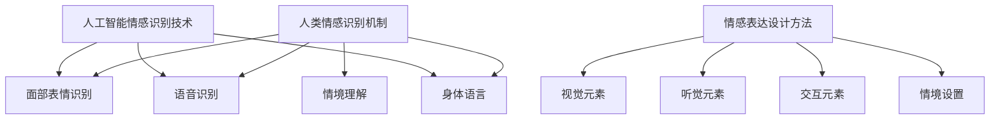
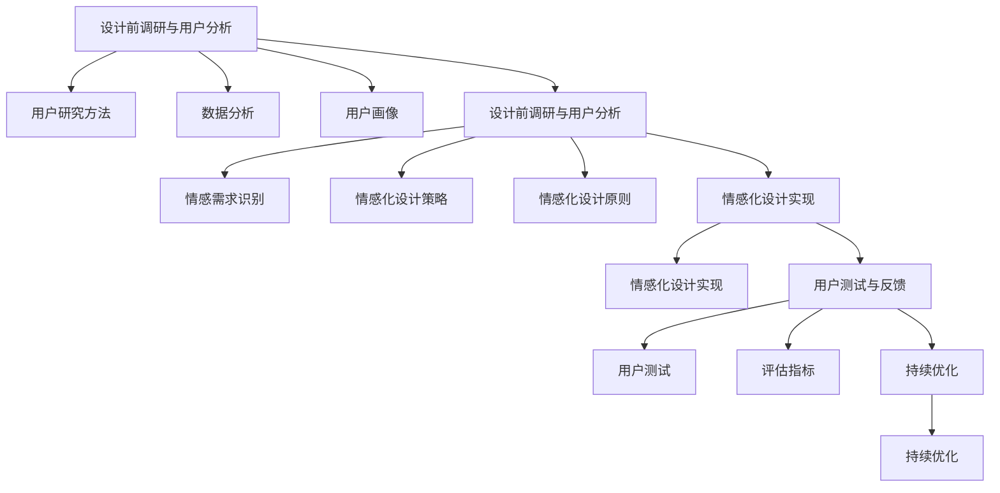
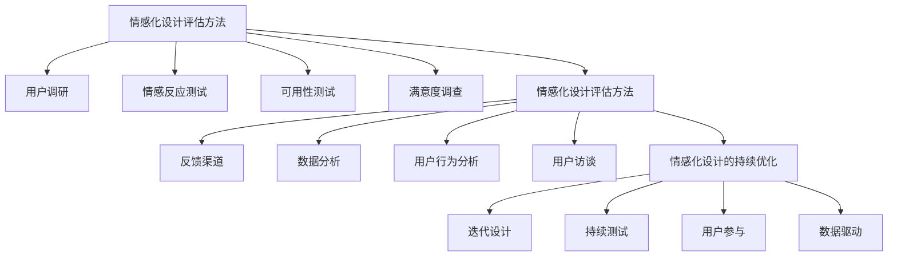

                 

### 情感设计与用户体验概述

#### 1.1 情感设计的起源与发展

情感设计（Affective Design）起源于20世纪末，随着用户体验（UX）设计的重要性逐渐提升，情感设计也开始得到关注。早期的情感设计主要关注于提升产品的情感因素，以增强用户体验。这一概念最初由心理学家唐纳德·诺曼（Donald Norman）提出，他强调设计应该关注用户的情感需求，而不仅仅是功能需求。

进入21世纪，随着技术的发展，特别是人工智能和机器学习技术的进步，情感设计得到了进一步的发展。情感识别与表达技术的引入，使得产品设计更加注重用户的情感体验，能够更加精准地满足用户的情感需求。

#### 1.2 情感设计在用户体验中的角色

情感设计在用户体验中扮演着至关重要的角色。它不仅仅是产品设计的一部分，更是提升用户满意度、忠诚度和口碑的关键因素。以下是情感设计在用户体验中的几个关键作用：

1. **情感连接**：通过情感设计，产品能够与用户建立情感连接，让用户感到产品是他们的“伙伴”或“朋友”。这种情感连接可以增强用户对产品的认同感和忠诚度。

2. **情感共鸣**：情感设计能够引发用户的情感共鸣，让用户在体验产品时产生共鸣，从而提升产品的吸引力。

3. **情感满足**：通过满足用户的情感需求，情感设计可以提高用户的满意度和幸福感。当用户感到愉悦和满足时，他们更有可能持续使用产品，并推荐给他人。

4. **情感引导**：情感设计可以引导用户的情感体验，通过设计细节和互动方式，引导用户产生积极的情感反应。

#### 1.3 情感设计与用户体验的融合

情感设计与用户体验的融合是一个动态的过程，需要设计师深入了解用户的心理和行为，并将情感元素融入产品设计的各个方面。以下是如何将情感设计融入用户体验的几个关键步骤：

1. **用户研究**：通过用户研究和访谈，了解用户的情感需求、期望和行为模式。这些信息是情感设计的基础。

2. **情感识别**：利用情感识别技术，如面部识别、语音识别等，分析用户的情感状态，为情感设计提供数据支持。

3. **情感表达**：通过视觉、听觉、交互等设计元素，表达情感，让用户感受到产品的情感关怀。

4. **情感反馈**：收集用户的情感反馈，评估情感设计的效果，并进行持续优化。

5. **情感引导**：利用情感设计原则，引导用户产生积极的情感反应，提高用户体验质量。

### 总结

情感设计是用户体验设计的重要组成部分，通过关注用户的情感需求，可以提升产品的吸引力、满意度和用户忠诚度。情感设计与用户体验的融合需要设计师深入理解用户心理，运用情感识别和表达技术，通过设计细节和互动方式，实现情感引导和情感满足。在下一章中，我们将进一步探讨情感识别与表达技术，了解如何通过技术手段实现情感设计。

---

### 情感识别与表达技术

#### 2.1 人类情感识别机制

人类的情感识别机制是一个复杂的过程，涉及大脑的多个区域，包括颞叶、扣带回前皮层和前额叶等。这些区域协同工作，帮助我们感知、理解和表达情感。

1. **面部表情识别**：面部表情是人类情感表达的主要方式之一。我们通过观察他人的面部表情，识别出他们的情感状态。例如，微笑通常表示快乐，皱眉表示痛苦。

2. **语音识别**：语音的语调、节奏和音量等特征可以传达情感。例如，柔和的语调可能表示友好，而尖锐的语调可能表示愤怒。

3. **身体语言**：身体语言，如姿势、手势和眼神交流等，也是情感识别的重要线索。例如，交叉双臂可能表示防御或不满，而开放的身体姿态可能表示信任和放松。

4. **情境理解**：情感识别还依赖于情境理解。同样一种表情或行为，在不同的情境下可能表达不同的情感。例如，一个人在派对上微笑可能表示快乐，而在医院里微笑可能表示痛苦。

#### 2.2 人工智能情感识别技术

随着人工智能技术的发展，计算机也开始具备情感识别能力。以下是一些主要的情感识别技术：

1. **面部表情识别**：通过机器学习和计算机视觉技术，计算机可以分析人脸图像，识别出其中的情感状态。常用的算法包括支持向量机（SVM）、卷积神经网络（CNN）等。

2. **语音情感识别**：通过分析语音信号的特征，如频谱、节奏和语调等，计算机可以识别出用户的情感状态。常用的算法包括隐马尔可夫模型（HMM）、深度神经网络（DNN）等。

3. **文本情感分析**：通过自然语言处理技术，计算机可以分析文本内容，识别出其中表达的情感。常用的算法包括情感词典法、文本分类法、情感级联法等。

#### 2.3 情感表达设计方法

情感表达设计是情感设计的关键环节，通过视觉、听觉、交互等设计元素，传达情感信息。以下是一些常见的情感表达设计方法：

1. **视觉元素**：通过颜色、形状、字体等视觉元素，传达情感。例如，温暖的颜色和柔和的形状可以传达舒适和放松的情感。

2. **听觉元素**：通过声音、音乐等听觉元素，传达情感。例如，柔和的音乐可以传达平静和放松的情感。

3. **交互元素**：通过交互设计，如按钮反馈、动画效果等，传达情感。例如，按钮按下时的震动反馈可以传达触感和互动的愉悦感。

4. **情境设置**：通过设置场景和情境，让用户在特定的环境中体验情感。例如，在医疗应用中，使用温暖的色调和柔和的背景音乐，营造舒适和放松的氛围。

### 核心概念与联系

为了更好地理解情感识别与表达技术，我们使用Mermaid流程图展示核心概念之间的联系：

### 总结

情感识别与表达技术是情感设计的核心技术。通过理解人类情感识别机制和人工智能情感识别技术，我们可以设计出能够识别用户情感并表达情感的产品。情感表达设计方法则通过视觉、听觉、交互等手段，传达情感信息，提升用户体验。在下一章中，我们将进一步探讨情感化设计流程，了解如何将情感设计融入产品开发过程。

---

### 情感化设计流程

#### 3.1 设计前调研与用户分析

情感化设计的起点是设计前调研与用户分析。这一阶段的关键任务是通过多种方法了解用户的需求、期望和行为模式，为后续的情感化设计提供基础。

1. **用户研究方法**：常用的用户研究方法包括访谈、观察、问卷调查、焦点小组等。访谈和观察可以帮助设计师深入了解用户的情感需求和痛点，问卷调查和焦点小组则可以收集大量用户的反馈和数据。

2. **数据分析**：收集到的用户数据需要进行整理和分析，提取出有价值的洞察。常用的数据分析方法包括统计分析、文本分析和情感分析等。

3. **用户画像**：基于分析结果，创建用户画像，明确目标用户群体的特征和需求。用户画像可以帮助设计师更好地理解用户，设计出更贴合用户情感需求的产品。

#### 3.2 情感需求挖掘与设计策略

在了解用户需求的基础上，下一步是挖掘用户的情感需求，并制定相应的情感化设计策略。

1. **情感需求识别**：通过分析用户调研数据，识别出用户在产品使用过程中可能产生的情感需求。例如，用户可能希望产品能提供安全感、满足感、乐趣等。

2. **情感化设计策略**：根据识别出的情感需求，制定情感化设计策略。设计策略可以包括情感识别、情感引导、情感满足等方面。例如，通过设计友好的用户界面和互动方式，引导用户产生积极的情感反应。

3. **情感化设计原则**：在制定设计策略时，需要遵循一些情感化设计原则，如一致性、情感共鸣、情感引导等。这些原则可以帮助设计师在设计中更好地传达情感，提升用户体验。

#### 3.3 情感化设计的实现与评估

情感化设计的实现与评估是情感化设计流程的关键环节。

1. **情感化设计实现**：在产品设计过程中，将情感化设计策略和原则融入到具体的交互、视觉和服务设计中。例如，通过设计友好的用户界面、使用温暖的颜色和声音等，传达积极的情感信息。

2. **用户测试与反馈**：在产品开发的不同阶段，进行用户测试，收集用户对情感化设计的反馈。用户测试可以采用可用性测试、用户访谈等方法，评估情感化设计的效果。

3. **评估指标**：制定评估指标，如用户满意度、情感反应、用户参与度等，对情感化设计的效果进行量化评估。评估指标需要与产品目标和用户需求密切相关。

4. **持续优化**：根据用户反馈和评估结果，对情感化设计进行持续优化。这一过程是一个循环迭代的过程，设计师需要不断调整和改进设计，以提升用户的情感体验。

### 核心概念与联系

为了更好地理解情感化设计流程，我们使用Mermaid流程图展示核心概念之间的联系：

### 总结

情感化设计流程是一个系统化的过程，从设计前的调研与分析，到情感需求的挖掘与设计策略的制定，再到情感化设计的实现与评估，每一个环节都至关重要。通过这一流程，设计师可以深入理解用户情感需求，将情感设计原则融入到产品中，提升用户体验。在下一章中，我们将探讨情感化交互设计，了解如何通过交互设计实现情感引导和情感满足。

---

### 情感化交互设计

#### 4.1 交互设计基础

交互设计（Interaction Design）是用户体验设计的重要组成部分，它关注于用户与产品之间的交互过程，旨在提供直观、高效和愉悦的交互体验。以下是交互设计的一些基础概念：

1. **交互元素**：交互设计中的基本元素包括按钮、图标、菜单、输入框等。这些元素通过视觉和交互方式，为用户提供了与产品互动的途径。

2. **交互流程**：交互流程是用户与产品交互的顺序和步骤。一个好的交互流程应该简洁明了，减少用户的认知负担，帮助用户快速完成任务。

3. **用户反馈**：用户反馈是交互设计的重要环节，通过用户的反馈，设计师可以了解用户的使用习惯和需求，从而优化交互设计。

4. **可用性测试**：可用性测试是评估交互设计效果的重要方法，通过观察用户在实际使用产品时的行为，发现交互设计中的问题和不足。

#### 4.2 情感化交互设计原则

情感化交互设计是将情感元素融入到交互设计中，通过设计细节和互动方式，引导用户产生积极的情感反应。以下是情感化交互设计的一些关键原则：

1. **情感共鸣**：通过设计细节，如色彩、形状和动画等，与用户产生情感共鸣。例如，使用柔和的色调和流畅的动画，传达温暖和舒适的情感。

2. **情感引导**：利用交互设计，引导用户产生特定的情感反应。例如，通过动态效果和声音反馈，让用户感到愉悦和满足。

3. **情感满足**：通过设计细节，满足用户的情感需求。例如，在完成任务后给予用户积极的反馈，如成功的动画和鼓励的话语，提升用户的满意度。

4. **情感一致性**：确保设计中的情感元素与产品的整体品牌形象和价值观保持一致。一致性可以增强用户对产品的信任和认同感。

#### 4.3 情感化交互设计案例解析

以下是一个情感化交互设计的案例解析：

**案例**：某健康类手机应用

**背景**：该应用旨在帮助用户进行健康管理和健身指导。

**情感化交互设计实现**：

1. **登陆界面**：使用温暖的色调（如浅绿色和橙色），传达健康和积极的生活态度。同时，采用简洁的图形和动画，引导用户快速完成登录。

2. **首页**：设计一个动态的日历界面，显示用户的健康数据，如步数、睡眠质量等。通过友好的动画效果，让用户感到乐趣和激励。

3. **运动界面**：为每项运动设置独特的颜色和图标，使界面富有活力和节奏感。在用户开始运动时，播放激励性的音乐和语音指导，提升用户的积极性。

4. **反馈界面**：在用户完成运动后，显示一个成功的动画，如一朵花逐渐开放，同时伴有鼓励性的文字，如“你做得很好！”这可以增强用户的成就感和满足感。

**用户测试与反馈**：

1. **可用性测试**：通过观察用户在测试环境中的行为，发现用户在使用应用时的痛点，如界面操作复杂、反馈不及时等。

2. **情感反馈**：收集用户对应用的感受和情感反馈。大部分用户表示，应用的色彩和动画设计让他们感到愉悦和激励，提升了他们的使用体验。

3. **评估指标**：通过用户满意度调查和留存率等指标，评估情感化交互设计的效果。结果显示，用户满意度显著提升，应用的用户留存率也有所增加。

### 总结

情感化交互设计通过将情感元素融入交互设计，引导用户产生积极的情感反应，提升用户体验。关键原则包括情感共鸣、情感引导、情感满足和情感一致性。通过具体案例的解析，我们可以看到如何在实际产品中应用情感化交互设计，提升用户满意度。在下一章中，我们将探讨情感化视觉设计，了解如何通过视觉元素传递情感。

---

### 情感化视觉设计

#### 5.1 视觉设计基础

视觉设计是用户体验设计的重要组成部分，它通过视觉元素和构图来传达信息、情感和品牌价值。以下是视觉设计的一些基础概念：

1. **色彩**：色彩是视觉设计中最具表现力的元素之一。不同的颜色可以传达不同的情感和信息。例如，蓝色通常代表冷静和信任，红色则代表热情和紧急。

2. **图形**：图形包括图标、图像和插图等，它们可以直观地传达信息，增强视觉效果。合适的图形设计可以使信息更加清晰易懂。

3. **排版**：排版包括文字的布局、字体选择和间距等。良好的排版可以提高文本的可读性，使信息层次分明，提升用户体验。

4. **构图**：构图是指如何安排视觉元素在页面或屏幕上，以达到最佳的视觉效果和用户体验。合理的构图可以引导用户的注意力，增强视觉吸引力。

#### 5.2 情感化视觉元素设计

情感化视觉设计是通过视觉元素和构图来传达情感和情绪，从而提升用户的情感体验。以下是情感化视觉元素设计的一些关键点：

1. **情感色彩选择**：根据产品的品牌定位和目标用户群体，选择能够传达特定情感的色彩。例如，针对年轻用户群体，可以选择明亮、鲜艳的颜色，以传达活力和时尚感。

2. **视觉元素的形状和纹理**：形状和纹理可以传达不同的情感信息。例如，圆润的形状和柔和的纹理可以传达温暖和舒适的情感，而锐利的形状和粗糙的纹理则可以传达力量和坚韧。

3. **视觉层次**：通过合理的视觉层次，可以突出重要的情感信息，引导用户的注意力。例如，使用大号字体和明亮的颜色来突出关键信息，使用户更容易理解和感受。

4. **情感符号和图标**：使用具有特定情感含义的符号和图标，可以增强视觉设计的情感表达。例如，笑脸图标可以传达友好和愉悦的情感，而心形图标则可以传达爱和关怀。

#### 5.3 情感化视觉设计案例解析

以下是一个情感化视觉设计的案例解析：

**案例**：某心理健康类手机应用

**背景**：该应用旨在帮助用户管理压力和情绪，提升心理健康。

**情感化视觉设计实现**：

1. **主色调选择**：选择温暖的色调（如浅黄色和淡绿色），传达舒适和放松的情感，符合心理健康应用的品牌定位。

2. **图形和图标**：使用简约的图形和图标，避免过多的装饰，使界面更加清爽。图标设计注重简洁和直观，确保用户可以快速理解其含义。

3. **视觉层次**：通过合理的视觉层次，突出关键功能和信息。例如，使用大号字体和醒目的颜色来突出应用的核心功能，如“放松训练”和“情绪记录”。

4. **情感符号**：在界面中加入一些具有积极情感含义的符号，如叶子、云朵和彩虹等，传达希望和积极向上的情感。

**用户反馈与评估**：

1. **用户反馈**：通过用户访谈和问卷调查，收集用户对应用视觉设计的反馈。大部分用户表示，应用的视觉设计让他们感到舒适和放松，提升了他们的使用体验。

2. **情感反应测试**：使用情感反应测试工具，如面部表情识别和情感分析，评估用户对应用视觉设计的情感反应。结果显示，用户对应用的视觉设计普遍表现出积极的情感反应，如愉悦和放松。

3. **评估指标**：通过用户满意度调查和留存率等指标，评估情感化视觉设计的效果。结果显示，用户满意度显著提升，应用的用户留存率也有所增加。

### 总结

情感化视觉设计通过选择适当的色彩、图形和排版，以及合理的视觉层次和情感符号，传达情感和情绪，提升用户的情感体验。通过具体案例的解析，我们可以看到如何在实际产品中应用情感化视觉设计，提升用户满意度。在下一章中，我们将探讨情感化服务设计，了解如何通过服务设计实现情感化体验。

---

### 情感化服务设计

#### 6.1 服务设计概述

服务设计（Service Design）是一种以用户为中心的设计方法，旨在创造和优化服务体验，提升用户满意度和忠诚度。它关注的是用户与服务互动的全过程，包括接触点、流程和交互方式。以下是服务设计的一些核心概念：

1. **服务蓝图**：服务蓝图是服务设计的核心工具之一，它通过图形化方式展示服务的流程、接触点和用户互动方式。服务蓝图可以帮助设计师识别服务的痛点和高价值环节，从而优化服务体验。

2. **用户旅程**：用户旅程是用户与服务互动的全过程，从接触服务到完成服务的每一个环节。用户旅程分析可以帮助设计师理解用户的情感变化和需求，从而设计出更加符合用户期待的服务。

3. **接触点**：接触点是用户与服务互动的物理或数字界面，如门店、网站、移动应用等。每个接触点都是用户体验的重要组成部分，需要精心设计，以确保用户能够顺利、愉快地完成服务流程。

4. **服务连续性**：服务连续性是指在不同接触点之间保持服务体验的一致性。良好的服务连续性可以增强用户的信任和满意度，提升品牌形象。

#### 6.2 情感化服务设计原则

情感化服务设计是将情感元素融入到服务设计中，通过设计细节和互动方式，提升用户的情感体验。以下是情感化服务设计的一些关键原则：

1. **情感共鸣**：通过设计细节，如温暖的色彩、友好的语言和亲切的互动，与用户产生情感共鸣。情感共鸣可以增强用户对品牌的认同感和忠诚度。

2. **情感引导**：通过服务流程和交互方式，引导用户产生积极的情感反应。例如，在用户遇到困难时，提供及时的帮助和鼓励，引导用户感到被关心和支持。

3. **情感满足**：通过设计细节和互动方式，满足用户的情感需求。例如，在用户完成服务时，提供积极的反馈和奖励，增强用户的成就感和满足感。

4. **情感一致性**：确保服务的情感元素与品牌的价值观和目标保持一致。情感一致性可以增强用户的信任和满意度。

#### 6.3 情感化服务设计实践

以下是一个情感化服务设计的实践案例：

**案例**：某在线教育平台

**背景**：该平台旨在为用户提供高质量的在线教育资源，帮助用户提升技能和知识。

**情感化服务设计实现**：

1. **用户欢迎界面**：设计一个温馨的欢迎界面，使用温暖的色调和亲切的文字，让用户感受到平台的关怀和友好。

2. **个性化推荐**：根据用户的兴趣和学习历史，提供个性化的课程推荐，使用户感到被理解和关注。

3. **学习进度提醒**：通过定时提醒功能，帮助用户保持学习动力，并在学习过程中提供鼓励和支持。

4. **学习成果展示**：在用户完成课程后，展示学习成果和证书，增强用户的成就感和满足感。

**用户反馈与评估**：

1. **用户反馈**：通过用户访谈和问卷调查，收集用户对服务设计的反馈。用户普遍表示，平台的情感化设计让他们感到舒适和受到关注，提升了他们的学习体验。

2. **情感反应测试**：使用情感反应测试工具，如面部表情识别和情感分析，评估用户对服务设计的情感反应。结果显示，用户对平台的情感化设计表现出积极的情感反应，如愉悦和放松。

3. **评估指标**：通过用户满意度调查和学习成果等指标，评估情感化服务设计的效果。结果显示，用户满意度显著提升，平台的学习转化率和用户留存率也有所增加。

### 总结

情感化服务设计通过将情感元素融入到服务设计中，提升用户的情感体验，增强用户满意度和忠诚度。关键原则包括情感共鸣、情感引导、情感满足和情感一致性。通过具体案例的实践，我们可以看到如何在实际服务中应用情感化服务设计，提升用户体验。在下一章中，我们将探讨情感化设计评估与优化，了解如何通过评估和优化提升情感化设计的效果。

---

### 情感化设计评估与优化

#### 7.1 情感化设计评估方法

情感化设计评估是确保设计效果符合预期和用户需求的重要环节。以下是一些常见的评估方法：

1. **用户调研**：通过访谈、问卷调查和焦点小组等方式，收集用户对情感化设计的反馈和意见。用户调研可以帮助设计师了解用户对设计的情感反应和满意度。

2. **情感反应测试**：使用情感反应测试工具，如面部表情识别、心率监测和情绪分析等，量化用户在接触产品时的情感反应。这些工具可以提供客观的数据支持，帮助设计师评估情感化设计的效果。

3. **可用性测试**：通过观察用户在实际使用产品时的行为，评估情感化设计的可用性和用户体验。可用性测试可以帮助设计师发现设计中的问题，并进行优化。

4. **满意度调查**：通过用户满意度调查，收集用户对产品情感化设计的整体评价。满意度调查可以提供量化指标，帮助设计师了解用户对设计的接受程度。

#### 7.2 用户反馈收集与分析

用户反馈是情感化设计评估的重要数据来源。以下是如何收集和分析用户反馈的一些关键步骤：

1. **反馈渠道**：建立多种反馈渠道，如在线问卷、用户论坛和社交媒体等，鼓励用户分享他们的体验和意见。

2. **数据分析**：对收集到的用户反馈进行分类和整理，提取出有价值的信息。可以使用文本分析工具，如情感分析、关键词提取等，对用户反馈进行量化分析。

3. **用户行为分析**：结合用户行为数据，如点击率、使用时长和转化率等，分析用户反馈和行为之间的关系，了解用户实际体验和反馈的一致性。

4. **用户访谈**：对具有代表性的用户进行深入访谈，获取更详细的反馈和观点。访谈可以提供更深入的理解，帮助设计师发现潜在的问题和改进点。

#### 7.3 情感化设计的持续优化

情感化设计是一个持续优化的过程。以下是如何持续优化情感化设计的一些建议：

1. **迭代设计**：采用迭代设计的方法，不断改进和优化情感化设计。每次迭代都可以根据用户反馈和评估结果，进行针对性的改进。

2. **持续测试**：定期进行用户测试和可用性测试，收集用户的反馈和意见，评估设计的有效性。持续测试可以帮助设计师及时发现和解决问题。

3. **用户参与**：鼓励用户参与到设计过程中，通过用户共创和反馈机制，确保设计符合用户的需求和期望。

4. **数据驱动**：基于用户数据和分析结果，制定数据驱动的优化策略。数据可以提供客观的依据，帮助设计师做出更明智的决策。

### 核心概念与联系

为了更好地理解情感化设计评估与优化，我们使用Mermaid流程图展示核心概念之间的联系：

### 总结

情感化设计评估与优化是确保设计效果和用户体验的重要环节。通过用户调研、情感反应测试、可用性测试和满意度调查等方法，设计师可以收集用户的反馈和意见，评估设计的有效性。基于这些数据，设计师可以持续优化情感化设计，提升用户体验。在下一章中，我们将探讨情感化设计在行业中的应用，了解不同领域如何应用情感化设计提升用户体验。

---

### 情感化设计在行业中的应用

#### 8.1 数字健康领域的情感化设计

数字健康领域是一个快速发展的行业，情感化设计在这一领域中的应用尤为重要。以下是数字健康领域中情感化设计的一些典型应用：

1. **健康管理应用**：如MyFitnessPal、Heathify等应用，通过情感化设计，提供个性化的健康建议和互动体验，激励用户坚持健康生活方式。

2. **心理健康应用**：如Headspace、Sanvello等应用，通过情感化设计，提供心理放松、冥想和情绪管理功能，帮助用户改善心理健康。

3. **远程医疗平台**：如Doctor on Demand、Amwell等平台，通过情感化设计，提供便捷的在线问诊和咨询服务，提升患者的就医体验。

#### 8.2 教育科技领域的情感化设计

教育科技（EdTech）领域也在积极应用情感化设计，以提升学生的学习体验和教师的教学效果：

1. **在线学习平台**：如Coursera、Udemy等平台，通过情感化设计，提供互动性强的学习内容和激励机制，增强学生的学习动力。

2. **学习管理工具**：如Google Classroom、Canvas等工具，通过情感化设计，简化教学流程，提供即时反馈和个性化建议，提升教师的教学效率。

3. **学习游戏**：如MindCraft Education、GoNoodle等游戏，通过情感化设计，将学习内容融入到有趣的游戏中，激发学生的学习兴趣。

#### 8.3 金融科技领域的情感化设计

金融科技（FinTech）领域也在逐步引入情感化设计，以提高用户的金融体验和信任感：

1. **个人金融管理应用**：如Mint、Yodlee等应用，通过情感化设计，提供直观的财务报表、个性化的投资建议和提醒功能，帮助用户更好地管理财务。

2. **移动支付平台**：如支付宝、微信支付等平台，通过情感化设计，简化支付流程，提供视觉上友好、操作上便捷的支付体验。

3. **金融咨询服务**：如Betterment、SoFi等平台，通过情感化设计，提供智能的财务规划、个性化的投资组合和贴心的客服服务，增强用户的信任感。

### 总结

情感化设计在数字健康、教育科技和金融科技等领域有着广泛的应用，通过关注用户的情感需求，提升用户体验和满意度。在数字健康领域，情感化设计有助于用户坚持健康生活方式；在教育科技领域，情感化设计激发学生的学习兴趣；在金融科技领域，情感化设计增强用户的信任感和满意度。随着技术的进步，情感化设计在更多行业中的应用前景将更加广阔。

---

### 情感化设计的未来发展趋势

#### 9.1 人工智能与情感设计的融合

人工智能（AI）技术的发展为情感化设计带来了新的机遇和挑战。未来，人工智能与情感设计的融合将成为情感化设计的重要趋势：

1. **个性化情感识别**：通过AI技术，如机器学习和深度学习，可以更精准地识别用户的情感状态。这种个性化识别可以帮助设计师提供更加贴合用户情感需求的设计。

2. **自适应交互设计**：利用AI技术，产品可以根据用户的情感状态和行为模式，自适应地调整交互设计和用户体验。例如，在用户感到焦虑时，系统可以提供安慰性的提示和建议。

3. **情感化AI助手**：随着自然语言处理和语音识别技术的进步，AI助手将能够更好地理解用户的情感需求，提供更加人性化的服务和支持。

#### 9.2 跨界融合与新兴领域的探索

情感化设计不仅在传统领域有广泛应用，未来还将跨界融合，探索新的领域和应用：

1. **智能家居**：智能家居设备将通过情感化设计，与用户建立情感连接，提供更加个性化、智能化的家居体验。

2. **虚拟现实（VR）与增强现实（AR）**：在VR和AR领域，情感化设计将帮助用户在虚拟环境中获得更加真实、丰富的情感体验。

3. **数字艺术与娱乐**：情感化设计将应用于数字艺术和娱乐领域，为用户提供更加沉浸式、情感化的互动体验。

#### 9.3 情感化设计的可持续性思考

随着可持续发展理念在全球范围内的普及，情感化设计也需要考虑可持续性：

1. **环保情感设计**：在设计中融入环保理念，如使用可再生材料、减少能源消耗等，提升用户的环保意识。

2. **情感关怀与心理健康**：在产品设计时，考虑用户的心理健康和情感需求，提供有益于身心健康的互动体验。

3. **社会责任**：情感化设计应该承担社会责任，通过设计引导用户形成积极、健康的价值观和行为习惯。

### 总结

情感化设计的未来将更加智能化、个性化，并与人工智能技术深度结合。跨界融合和新兴领域的探索将拓展情感化设计的应用范围。同时，情感化设计也需要关注可持续性，通过环保和心理健康设计，提升用户体验，促进社会和谐发展。

---

### 附录

#### 附录A：情感化设计资源推荐

**A.1 设计工具与软件推荐**

1. **Adobe Creative Suite**：包括Photoshop、Illustrator等工具，适合视觉设计。
2. **Sketch**：专业的UI/UX设计工具，支持矢量图形设计。
3. **Figma**：基于浏览器的协作设计工具，支持实时协作。

**A.2 情感识别算法与库推荐**

1. **OpenSMILE**：开源情感识别工具，支持音频情感分析。
2. **FAIR**：面部动作编码系统（FACS）的情感识别工具。
3. **EmoVu**：基于面部表情识别的情感分析库。

**A.3 情感化设计相关书籍推荐**

1. **《情感化设计：为什么好设计如此重要》**（Donald A. Norman）
2. **《设计心理学》**（Donald A. Norman）
3. **《情感化产品：打造会呼吸的设计》**（Jon Kolko）

### 作者信息

**作者：AI天才研究院/AI Genius Institute & 禅与计算机程序设计艺术 /Zen And The Art of Computer Programming**

