                 

首先，我们需要为文章标题和关键词部分设置，然后撰写摘要。接下来，我们可以开始编写文章的第一章，即引言部分，介绍书籍的背景和目标。在引言之后，我们将阐述情感设计的概念与重要性，并概述书籍的结构。按照这个逻辑，我们将逐步展开对每一章的内容进行编写。在编写过程中，我们将确保文章结构清晰，内容详实，并包含必要的代码示例、数学公式和实际案例。以下是具体的步骤：

### 文章标题：情感设计工作坊：深化用户体验的技巧

### 文章关键词：
1. 情感设计
2. 用户体验
3. 设计方法论
4. 情感化界面
5. 交互设计
6. 案例研究
7. 未来趋势

### 摘要：
本文旨在探讨情感设计在提升用户体验中的作用，通过详细介绍情感设计的核心概念、方法论和实施技巧，帮助读者理解和应用情感设计原则。文章将通过实际案例和代码示例，深入分析情感设计的实践应用，并对未来发展趋势进行展望。

### 第1章 引言

#### 1.1 书籍背景与目标
本书旨在为设计师、开发者和产品经理提供情感设计的系统性指导，帮助他们理解并实践情感设计，以提升产品的用户体验和市场竞争力。本书的目标是：
- 介绍情感设计的理论基础和实践方法。
- 分析情感设计与用户体验之间的关系。
- 提供实用的设计技巧和案例分析。

#### 1.2 情感设计的概念与重要性
情感设计是一种以用户情感体验为核心的设计方法。它不仅仅关注功能性和易用性，更注重通过设计激发用户的情感共鸣，提升用户满意度。情感设计的重要性体现在以下几个方面：
- 提高用户忠诚度：通过情感设计，用户对产品产生更深的情感连接，从而提高用户忠诚度。
- 增强用户参与度：情感设计可以激发用户的积极情绪，提高用户在产品中的参与度。
- 提升品牌形象：情感设计有助于建立产品的独特品牌形象，增强用户对品牌的认知和认同。

#### 1.3 书籍结构概述
本书分为八个章节，涵盖情感设计的理论基础、方法论、实践应用和未来趋势。具体章节安排如下：
1. 引言
2. 情感设计与用户体验
3. 情感设计方法论
4. 设计实践中的情感设计
5. 情感设计的实施与评估
6. 案例研究：情感设计成功实践
7. 情感设计的未来趋势
8. 总结与展望

### 接下来，我们将继续编写第二章，探讨情感设计与用户体验的关系，情感设计的核心要素，以及用户体验评估与优化。

#### 2.1 情感设计与用户体验的关系

情感设计与用户体验之间存在着密切的联系。情感设计的目标是通过激发用户的情感共鸣，提升用户在使用产品过程中的愉悦感和满意度。这种情感体验可以增强用户的参与度和忠诚度，从而提高产品的市场竞争力。

情感设计通过以下几个方面影响用户体验：
- **界面情感化**：界面设计中的情感元素，如颜色、字体、图标等，可以传递情感信息，与用户产生情感共鸣。
- **交互情感化**：交互设计中的情感化元素，如声音、动画、反馈等，可以提供情感上的满足感。
- **内容情感化**：产品内容中的情感元素，如故事、视频、音乐等，可以激发用户的情感共鸣，增强用户体验。

为了更好地理解情感设计与用户体验之间的关系，我们可以使用以下Mermaid流程图来描述概念实体及其关系：

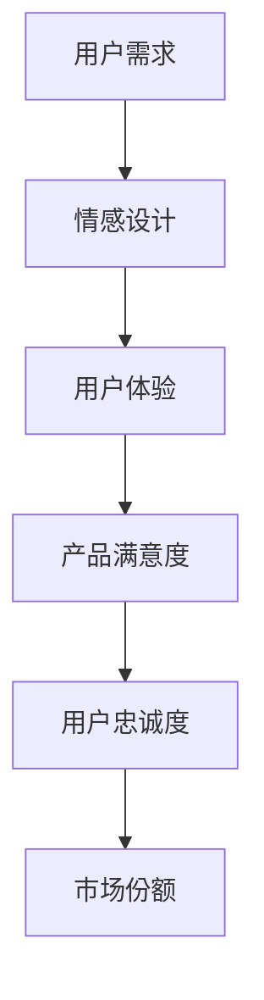

在这个流程图中，用户需求驱动情感设计，情感设计提升用户体验，进而提高产品满意度、用户忠诚度和市场份额。

#### 2.2 情感设计的核心要素

情感设计涉及多个核心要素，这些要素共同作用，提升产品的情感体验。以下是情感设计的几个关键要素：

1. **情感映射**：
   情感映射是指识别和理解用户在产品使用过程中的情感状态。设计师需要通过用户研究，了解用户在不同情境下的情感反应，并将这些情感转化为设计元素。例如，在创建一个健康追踪应用时，设计师可能需要识别用户对于健康状态的担忧和希望，并将这些情感转化为应用界面中的温暖、鼓励和激励元素。

2. **情感触发**：
   情感触发是指设计中的各种元素如何激发用户的情感反应。设计师需要选择合适的设计元素，如颜色、形状、声音和动画，来触发用户的特定情感。例如，在电商应用中，使用红色的按钮可以激发用户的购买欲望，而柔和的背景音乐可以带来放松的情感体验。

3. **情感共鸣**：
   情感共鸣是指设计能够引起用户共鸣的情感状态。设计师需要创造出能够触动用户内心深处的情感体验，使产品成为用户情感生活中的一部分。例如，通过讲述用户故事和使用个性化的内容，可以让用户感到产品理解他们，与他们产生情感共鸣。

4. **情感延续**：
   情感延续是指设计如何维持用户的情感状态，使其在产品使用过程中持续感受到积极的情感。设计师需要确保设计的一致性和连贯性，避免情感的反转和冲突。例如，在游戏设计中，通过连续的奖励机制和进步反馈，可以维持用户的积极情感状态。

以下是一个描述情感设计核心要素及其关系的Mermaid流程图：

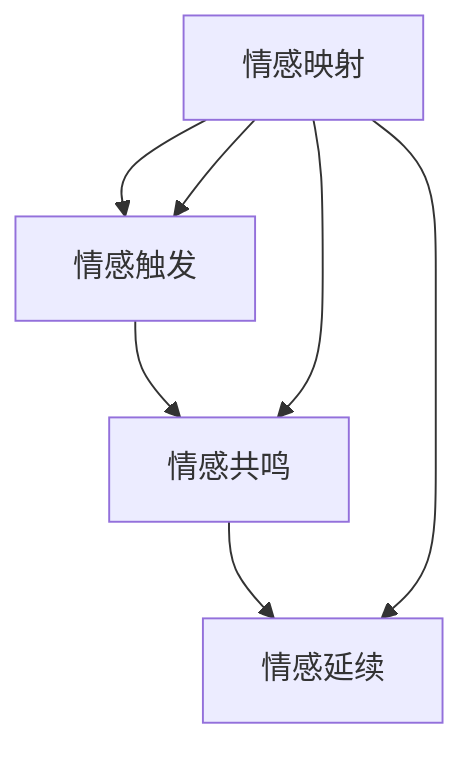

#### 2.3 用户体验评估与优化

用户体验评估是确保情感设计有效性的关键步骤。通过评估，设计师可以了解用户对产品的情感反应，识别设计中的问题和改进机会。以下是一些常用的用户体验评估方法和优化技巧：

1. **用户研究**：
   用户研究是了解用户需求、情感和行为的基础。通过访谈、观察、问卷调查和用户测试等方法，设计师可以获取用户对产品的直接反馈。用户研究可以帮助设计师发现用户在情感设计方面的具体需求和偏好。

2. **情感分析**：
   情感分析是使用自然语言处理技术，分析用户反馈中的情感倾向和情感强度。通过情感分析，设计师可以量化用户的情感反应，识别用户情感的关键因素。

3. **A/B测试**：
   A/B测试是一种将不同设计变体展示给用户，比较其效果的方法。通过A/B测试，设计师可以评估不同情感设计元素对用户体验的影响，优化设计决策。

4. **持续迭代**：
   情感设计是一个持续的过程。设计师需要根据用户反馈和评估结果，不断迭代和优化设计。通过持续迭代，设计师可以确保情感设计始终与用户的情感需求保持一致。

以下是一个描述用户体验评估与优化过程的Mermaid流程图：

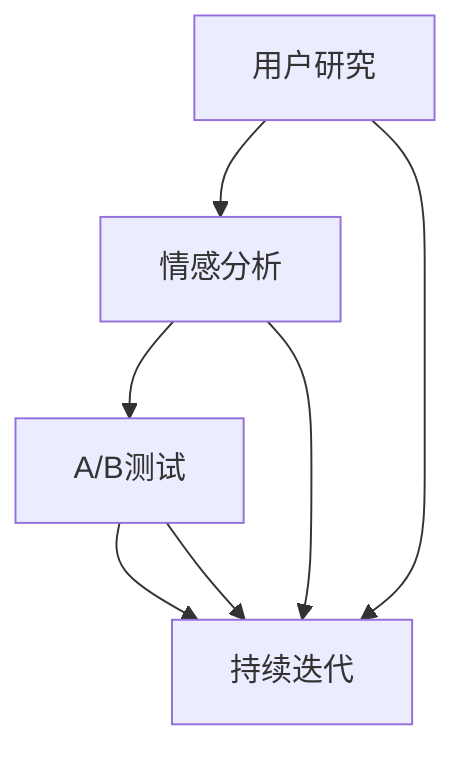

### 总结

本章介绍了情感设计与用户体验的关系、情感设计的核心要素以及用户体验评估与优化的方法。通过了解这些内容，设计师可以更好地应用情感设计原则，提升产品的情感体验和用户满意度。

在接下来的章节中，我们将深入探讨情感设计方法论、设计实践中的情感设计、情感设计的实施与评估，以及情感设计成功实践和未来趋势。通过这些章节的阅读和实践，读者将能够全面掌握情感设计的方法和技巧，为产品的设计创新提供有力支持。

---

**接下来，我们将进入第二章“情感设计方法论”，讨论用户研究方法、情感映射与情感设计策略，以及设计思维在情感设计中的应用。**

---

#### 2.1 用户研究方法

用户研究是情感设计的基础，它帮助设计师深入了解用户的需求、行为和情感。以下是一些常用的用户研究方法：

1. **访谈**：
   访谈是一种深入的了解用户需求和行为的方法。通过与用户进行一对一的访谈，设计师可以获取用户对产品的看法、情感体验和潜在需求。访谈可以是结构化的，也可以是非结构化的，以便更灵活地探索用户的不同观点。

2. **观察**：
   观察是一种直接观察用户在真实环境中的行为和反应的方法。通过观察，设计师可以了解用户在使用产品时的具体操作、情感反应和环境因素。这种方法尤其适用于理解用户的情感状态和交互过程中的细节。

3. **问卷调查**：
   问卷调查是一种收集大量用户反馈的方法。通过设计有针对性的问卷，设计师可以快速了解用户的情感态度、满意度和使用习惯。问卷调查可以采用在线、纸质或电话等多种形式。

4. **用户测试**：
   用户测试是一种将设计原型展示给用户，并观察他们如何与产品互动的方法。通过用户测试，设计师可以评估设计的易用性、可访问性和情感共鸣效果。用户测试可以是启发式的，也可以是任务驱动的，以便从不同角度评估用户体验。

5. **情感分析**：
   情感分析是一种使用自然语言处理技术，分析用户文本反馈中的情感倾向和情感强度的方法。通过情感分析，设计师可以量化用户的情感反应，识别情感设计的关键成功因素。

通过这些用户研究方法，设计师可以收集到丰富的用户数据，从而为情感设计提供有力的依据。以下是一个描述用户研究方法的Mermaid流程图：

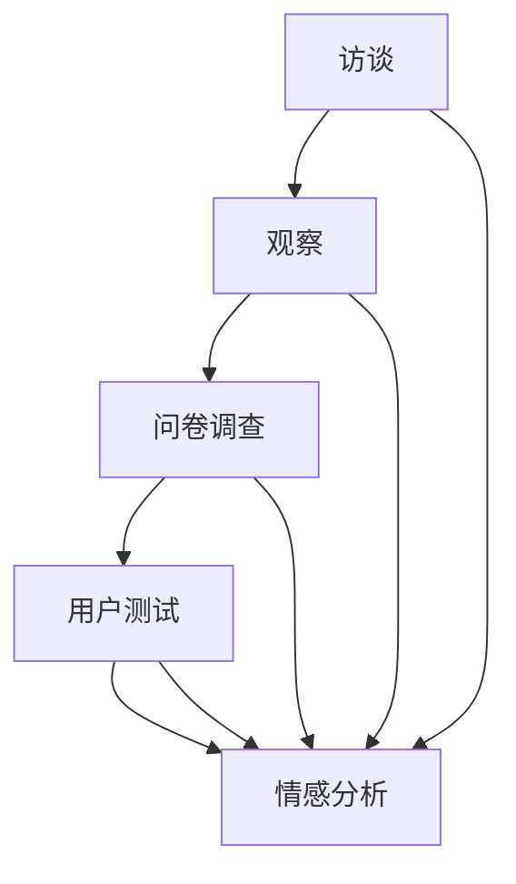

#### 2.2 情感映射与情感设计策略

情感映射是将用户的情感需求转化为具体设计元素的过程。通过情感映射，设计师可以将用户的情感体验与产品功能、界面元素和交互设计相结合，创造出能够激发用户情感共鸣的产品。

情感映射的步骤如下：

1. **识别用户情感**：
   通过用户研究，识别用户在产品使用过程中的主要情感状态，如快乐、沮丧、焦虑、满意等。

2. **分析情感需求**：
   分析用户的情感需求，确定哪些情感需求可以通过设计来满足。例如，如果用户感到沮丧，设计可以采用温暖的颜色和鼓励性的文字来提升他们的情绪。

3. **设计情感元素**：
   根据用户情感需求，设计具体的情感元素，如界面颜色、图标、动画、声音等。这些情感元素应该与用户的情感体验相匹配，以激发用户积极的情感反应。

情感设计策略是指在产品设计和开发过程中，系统性地应用情感映射结果，确保设计符合用户的情感需求。以下是几个情感设计策略：

1. **情感一致性**：
   确保产品的整体设计在情感上保持一致性，避免情感反转。例如，如果产品主要设计为轻松愉悦的体验，那么所有界面元素和交互都应该传递出这种情感。

2. **情感触发点**：
   设计中应包含情感触发点，这些触发点能够激发用户的特定情感。例如，在游戏设计中，奖励机制可以触发用户的快乐情感。

3. **情感反馈**：
   提供及时的反馈，帮助用户理解他们的行为对产品的影响，并提升他们的情感体验。例如，通过动画和声音反馈，用户可以感受到他们的操作得到了产品的认可。

4. **情感体验构建**：
   通过设计构建一系列情感体验，使用户在产品中的每个互动都充满情感。例如，在电商应用中，从浏览到购买，每个环节都可以设计出独特的情感体验。

以下是一个描述情感映射与情感设计策略关系的Mermaid流程图：

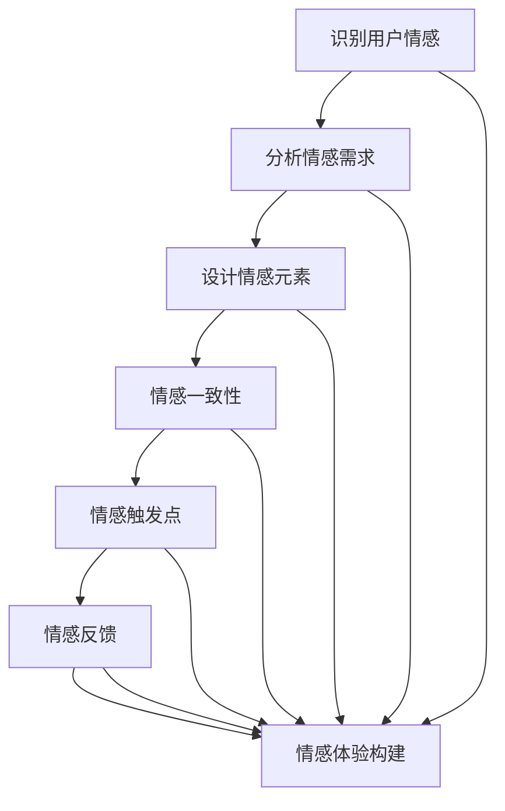

#### 2.3 设计思维在情感设计中的应用

设计思维是一种以人为本的设计方法，它强调通过迭代和创新来解决问题，满足用户的需求。设计思维在情感设计中的应用体现在以下几个方面：

1. **同理心**：
   设计思维的第一步是建立同理心，理解用户的情感需求和生活情境。设计师需要通过用户研究，深入了解用户的情感状态和体验，从而设计出能够满足用户情感需求的产品。

2. **创意生成**：
   在了解用户需求后，设计师可以通过头脑风暴和创意生成方法，提出多种可能的情感设计方案。这些方案可以是界面元素、交互流程或者故事情节，旨在激发用户的情感共鸣。

3. **原型测试**：
   设计师将创意转化为原型，并进行用户测试，收集用户反馈。通过迭代和优化，设计师可以不断改进原型，确保它能够满足用户的情感需求。

4. **迭代反馈**：
   设计思维强调持续迭代和反馈。设计师需要根据用户反馈，不断调整和优化设计，确保情感设计符合用户的期望和需求。

5. **用户参与**：
   设计思维鼓励用户参与设计过程，通过用户反馈和协作，确保设计结果能够真正满足用户的需求。这种方法可以增强用户对产品的情感连接，提高用户满意度。

以下是一个描述设计思维在情感设计中的应用的Mermaid流程图：

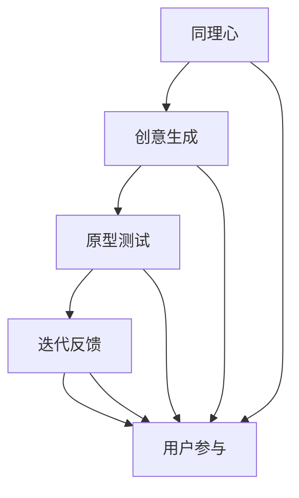

### 总结

本章介绍了用户研究方法、情感映射与情感设计策略，以及设计思维在情感设计中的应用。通过用户研究，设计师可以深入了解用户的需求和情感；通过情感映射和设计策略，设计师可以将用户的情感需求转化为具体的设计元素；而设计思维则提供了一个系统的方法，确保情感设计能够真正满足用户的需求。在下一章中，我们将探讨设计实践中的情感设计，分析情感化界面设计原则、情感化交互设计实践和情感化内容设计策略。

---

**接下来，我们将进入第四章“设计实践中的情感设计”，讨论情感化界面设计原则、情感化交互设计实践和情感化内容设计策略。**

---

### 4.1 情感化界面设计原则

情感化界面设计是情感设计的重要组成部分，它通过视觉和交互设计元素来传递情感信息，激发用户的情感共鸣。以下是几个关键的情感化界面设计原则：

1. **一致性**：
   界面设计应保持一致性，确保视觉元素、交互元素和情感元素在整体设计中的协调和统一。一致性可以增强用户对产品的信任感和安全感，减少认知负荷。

2. **温暖与友好**：
   使用温暖的色调和友好风格的字体，可以传达出温馨和亲近的情感。这种设计可以吸引和留住用户，增强用户对产品的情感连接。

3. **响应性**：
   界面设计应具备响应性，即能够根据用户的行为和情感状态做出适当的反应。例如，当用户完成任务时，界面可以展示祝贺动画或积极反馈，以增强用户的积极情感。

4. **情感符号**：
   使用情感符号，如表情符号、卡通形象和动画，可以直观地传达情感信息。这些符号能够迅速激发用户的情感反应，增强用户体验的趣味性。

5. **情感故事**：
   通过界面中的故事讲述，如用户故事、品牌故事和产品故事，可以建立情感共鸣。故事设计可以增强用户对产品的情感认同和忠诚度。

以下是一个描述情感化界面设计原则的Mermaid流程图：

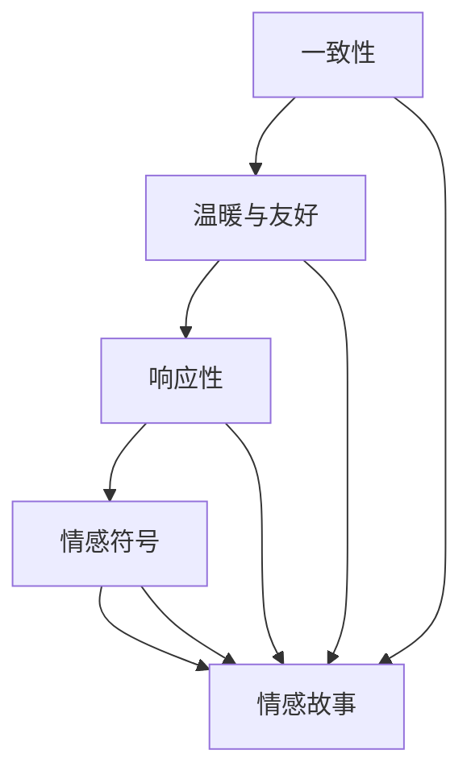

#### 情感化界面设计案例分析

**案例一：Instagram**

Instagram是一个社交网络应用，其界面设计非常注重情感化设计。以下是Instagram的一些情感化界面设计特点：

- **一致性的视觉风格**：Instagram的界面设计以简洁、清晰的视觉风格为主，所有视觉元素都遵循一致的色彩和字体规范。
- **温暖的色调**：Instagram使用温暖的色调，如橙色和黄色，来传达活泼和友好的情感。
- **情感符号**：Instagram在界面中广泛使用表情符号和卡通形象，如点赞图标和爱心图标，这些符号能够快速激发用户的情感反应。
- **情感故事**：Instagram通过用户故事和品牌故事，如用户分享的生活瞬间和广告内容，建立情感共鸣。

**案例二：YouTube**

YouTube是一个视频分享平台，其界面设计也体现了情感化设计原则。以下是YouTube的一些情感化界面设计特点：

- **响应性**：YouTube的界面设计能够根据用户的交互行为做出响应，例如在用户点击视频时，界面会展示加载动画和播放按钮，增强用户的情感体验。
- **情感反馈**：YouTube在用户操作后提供情感反馈，例如在用户完成视频播放时，会展示播放完成的动画和评价按钮，增强用户的情感满足感。
- **情感故事**：YouTube通过推荐算法，展示与用户兴趣相关的视频，讲述用户的故事和经历，建立情感连接。

通过这些案例分析，我们可以看到情感化界面设计在提升用户体验方面的作用。情感化设计不仅能够增强用户对产品的情感连接，还可以提高用户满意度和忠诚度。

#### 4.2 情感化交互设计实践

情感化交互设计关注如何通过交互元素来激发用户的情感共鸣。以下是一些情感化交互设计实践：

1. **情感反馈**：
   情感反馈是指系统对用户的操作或请求提供情感上的响应。例如，当用户成功完成任务时，系统可以显示庆祝动画或积极的声音反馈，以增强用户的积极情感。

2. **情感引导**：
   情感引导是指通过设计引导用户产生特定的情感反应。例如，在游戏设计中，设计者可以设置奖励机制，引导玩家产生成就感。

3. **情感化动画**：
   情感化动画是指使用动画来传达情感信息。例如，在电商应用中，当用户添加商品到购物车时，动画可以展示商品被放入购物车的过程，增强用户的情感体验。

4. **情感化声音**：
   情感化声音是指使用声音来传达情感信息。例如，在音乐播放器中，当用户播放不同的音乐时，声音反馈可以调整音量和音调，以匹配音乐的情感风格。

5. **情感化互动**：
   情感化互动是指设计出能够与用户情感状态相匹配的互动方式。例如，在心理辅导应用中，设计可以提供温暖、鼓励的互动方式，帮助用户缓解焦虑和压力。

以下是一个描述情感化交互设计实践的Mermaid流程图：

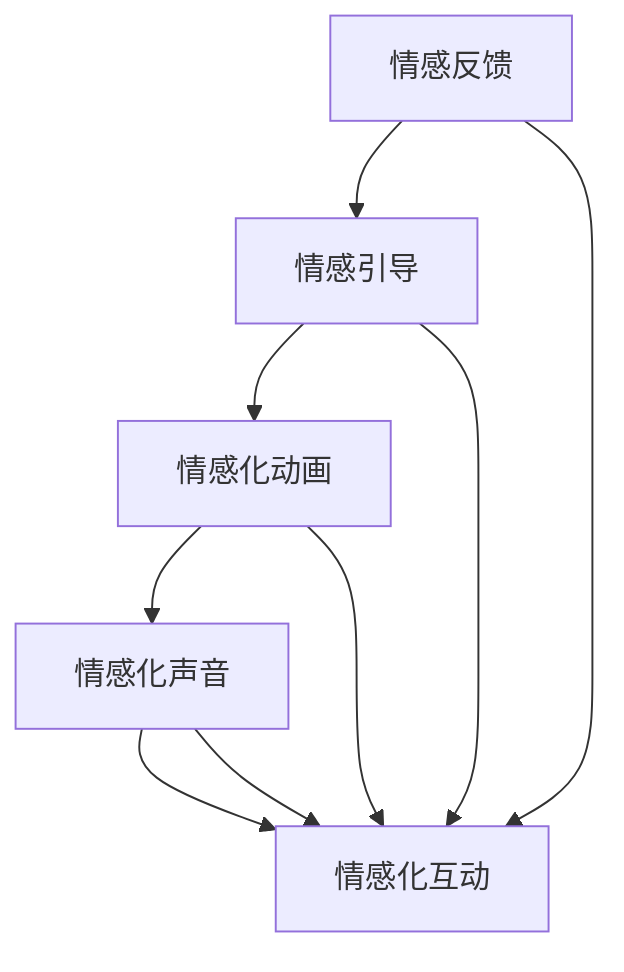

#### 情感化交互设计案例分析

**案例一：Facebook Messenger**

Facebook Messenger是一个即时通讯应用，其交互设计非常注重情感化设计。以下是Facebook Messenger的一些情感化交互设计特点：

- **情感反馈**：当用户发送消息时，Facebook Messenger会显示发送动画和发送状态，增强用户的情感体验。
- **情感引导**：Facebook Messenger通过聊天机器人和智能回复，引导用户产生积极的情感反应，例如鼓励和支持。
- **情感化动画**：Facebook Messenger使用卡通表情符号和动画，传达情感信息和氛围。
- **情感化声音**：Facebook Messenger在用户收到消息时，会播放提示音，增强用户的注意力和情感体验。

**案例二：Twitter**

Twitter是一个社交媒体平台，其交互设计也体现了情感化设计原则。以下是Twitter的一些情感化交互设计特点：

- **情感反馈**：当用户点赞、转发或评论时，Twitter会显示相应的动画和提示，增强用户的积极情感反应。
- **情感化动画**：Twitter使用动态图标和动画，传达情感信息和互动氛围。
- **情感化互动**：Twitter通过智能推荐和互动功能，与用户的情感状态相匹配，提供个性化的互动体验。

通过这些案例分析，我们可以看到情感化交互设计在提升用户体验方面的作用。情感化交互设计不仅能够增强用户对产品的情感连接，还可以提高用户满意度和忠诚度。

### 4.3 情感化内容设计策略

情感化内容设计关注如何通过内容和文字来激发用户的情感共鸣。以下是一些情感化内容设计策略：

1. **情感化的文本**：
   情感化的文本是指使用具有情感色彩的语言和表达方式来撰写内容。例如，使用温暖、亲切、鼓励性的语言，可以增强用户的情感体验。

2. **故事讲述**：
   故事讲述是一种通过讲述用户故事、品牌故事和产品故事来建立情感连接的方法。故事可以传达情感信息，引发用户的共鸣。

3. **情感化的图片**：
   情感化的图片是指使用具有情感色彩的图像来传达情感信息。例如，使用温馨、有趣、鼓舞人心的图片，可以增强用户的情感体验。

4. **情感化的视频**：
   情感化的视频是指使用视频来传达情感信息，引发用户的共鸣。视频可以展示真实的情感故事和产品应用场景，增强用户的情感体验。

5. **个性化内容**：
   个性化内容是指根据用户的特点和需求，提供个性化的内容和体验。个性化内容可以增强用户对产品的情感认同和忠诚度。

以下是一个描述情感化内容设计策略的Mermaid流程图：

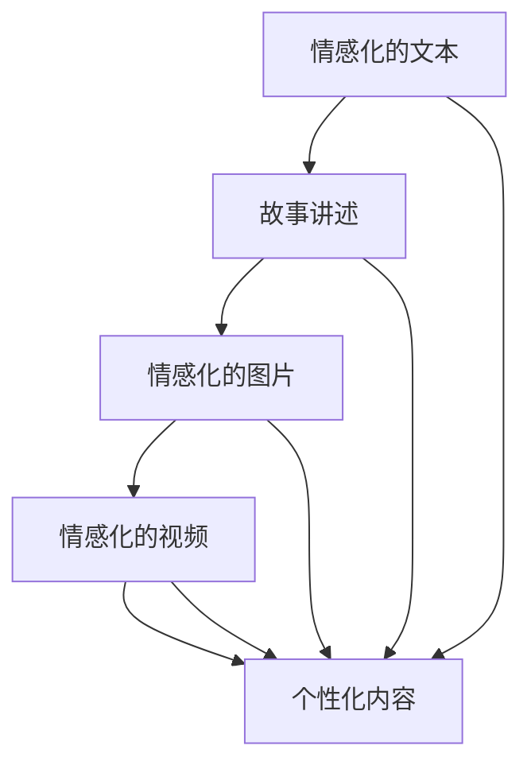

#### 情感化内容设计案例分析

**案例一：Pinterest**

Pinterest是一个图片分享和发现平台，其内容设计非常注重情感化设计。以下是Pinterest的一些情感化内容设计特点：

- **情感化的文本**：Pinterest的描述文本使用温暖、鼓舞人心的语言，吸引用户产生情感共鸣。
- **故事讲述**：Pinterest上的图片和描述往往讲述用户的故事和体验，引发用户的情感共鸣。
- **情感化的图片**：Pinterest的图片选择具有情感色彩，能够吸引和打动用户的情感。
- **情感化的视频**：Pinterest上的视频展示了真实的产品应用场景，增强用户的情感体验。
- **个性化内容**：Pinterest通过推荐算法，为用户提供个性化的内容和体验，增强用户对平台的情感连接。

**案例二：Netflix**

Netflix是一个在线视频流媒体服务，其内容设计也体现了情感化设计原则。以下是Netflix的一些情感化内容设计特点：

- **情感化的文本**：Netflix的推荐文案使用吸引人的语言，激发用户的情感反应。
- **故事讲述**：Netflix的推荐视频通常讲述引人入胜的故事，引发用户的情感共鸣。
- **情感化的视频**：Netflix的推荐视频选择具有情感冲击力的片段，吸引和打动用户的情感。
- **个性化内容**：Netflix通过算法，为用户提供个性化的视频推荐，增强用户对平台的情感认同。

通过这些案例分析，我们可以看到情感化内容设计在提升用户体验方面的作用。情感化内容设计不仅能够增强用户对产品的情感连接，还可以提高用户满意度和忠诚度。

### 总结

本章讨论了情感化界面设计原则、情感化交互设计实践和情感化内容设计策略。通过情感化界面设计，设计师可以传递情感信息，增强用户的情感共鸣；通过情感化交互设计，设计师可以激发用户的情感反应，提升用户体验；通过情感化内容设计，设计师可以讲述情感故事，建立用户与产品的情感连接。在下一章中，我们将探讨情感设计的实施与评估，包括情感设计流程、评估方法和改进策略。

---

**接下来，我们将进入第五章“情感设计的实施与评估”，讨论情感设计流程、评估方法和改进策略。**

---

#### 5.1 情感设计流程

情感设计的实施是一个系统化的过程，它需要设计师遵循一系列步骤，确保情感设计的有效性和可行性。以下是情感设计的主要流程：

1. **需求分析**：
   在项目启动阶段，设计师需要进行需求分析，了解用户的需求、偏好和情感状态。这一步骤通常包括用户访谈、问卷调查和用户观察等研究方法。

2. **情感映射**：
   需求分析的结果将用于情感映射，识别用户在产品使用过程中的情感状态和需求。设计师需要将这些情感需求转化为设计元素，确保设计能够满足用户的情感需求。

3. **概念设计**：
   在情感映射的基础上，设计师开始进行概念设计，探索不同设计方案的可能性。概念设计阶段，设计师可以采用草图、原型和故事板等工具，展示设计概念。

4. **原型测试**：
   设计原型是测试情感设计有效性的重要步骤。通过用户测试和反馈，设计师可以评估原型在情感设计方面的表现，并不断迭代和优化设计。

5. **用户反馈**：
   在原型测试过程中，设计师需要收集用户的反馈，分析用户对设计的情感反应和使用体验。这些反馈将用于改进设计，确保设计能够真正满足用户的情感需求。

6. **实施设计**：
   设计完成并经过多次迭代和优化后，设计师开始实施最终设计。实施设计阶段，设计师需要与技术团队紧密合作，确保设计在技术实现上可行。

7. **评估与改进**：
   产品上线后，设计师需要进行评估，收集用户反馈和数据，分析设计的效果和用户满意度。根据评估结果，设计师可以制定改进策略，进一步提升情感设计的有效性。

以下是一个描述情感设计流程的Mermaid流程图：

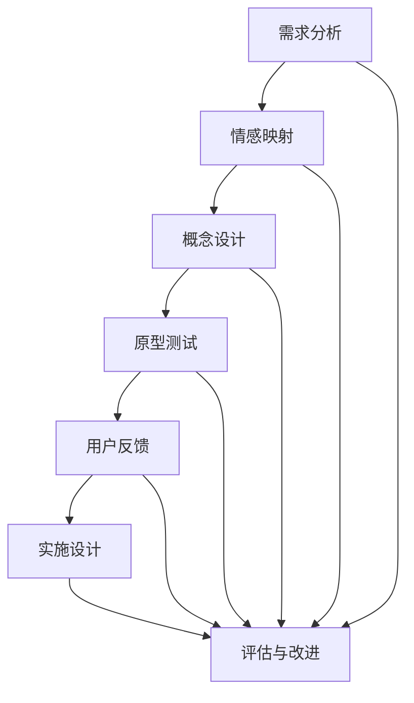

#### 5.2 情感设计评估方法

评估是确保情感设计有效性的关键步骤。以下是一些常用的情感设计评估方法：

1. **用户测试**：
   用户测试是一种通过观察和记录用户在产品中的行为和反应，评估设计效果的方法。用户测试可以采用任务驱动的形式，让用户完成特定的任务，观察他们在任务过程中的情感反应和交互行为。

2. **情感分析**：
   情感分析是使用自然语言处理技术，分析用户反馈中的情感倾向和情感强度的方法。通过情感分析，设计师可以量化用户的情感反应，识别设计中的情感要素。

3. **问卷调查**：
   问卷调查是一种收集用户主观评价的方法。通过设计有针对性的问卷，设计师可以了解用户对产品的情感满意度、易用性和设计偏好。

4. **数据监测**：
   通过数据分析工具，设计师可以监测产品的使用情况，如用户停留时间、点击率、转化率等。这些数据可以提供关于情感设计效果和用户行为的重要线索。

5. **A/B测试**：
   A/B测试是一种将不同设计变体展示给用户，比较其效果的方法。通过A/B测试，设计师可以评估不同情感设计元素对用户体验的影响，优化设计决策。

以下是一个描述情感设计评估方法的Mermaid流程图：

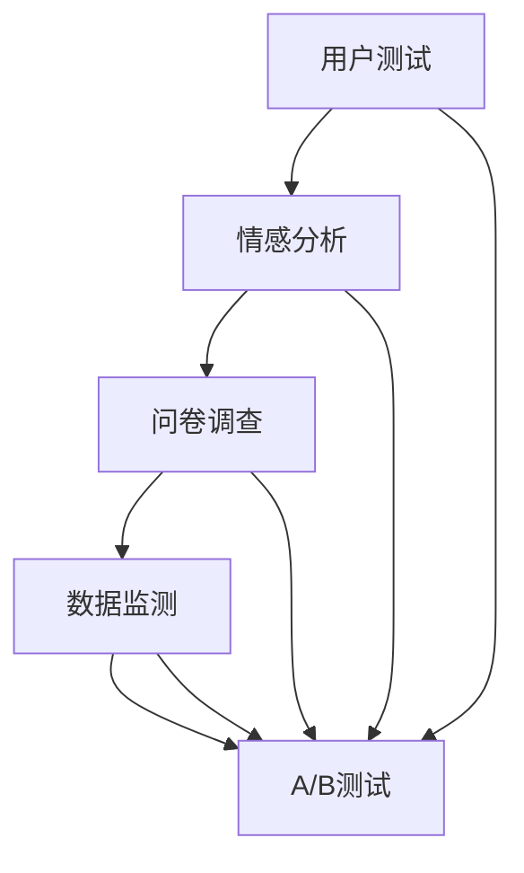

#### 5.3 情感设计改进策略

基于评估结果，设计师可以制定改进策略，进一步提升情感设计的有效性。以下是一些常见的改进策略：

1. **迭代优化**：
   针对评估中发现的问题，设计师可以进行迭代优化。例如，改进界面元素、交互流程或内容设计，以提升用户体验。

2. **增加情感触发点**：
   设计师可以增加情感触发点，如动画、声音和反馈，以激发用户的情感共鸣。通过增加情感触发点，设计师可以提升用户在产品中的情感体验。

3. **用户参与**：
   鼓励用户参与设计过程，收集用户反馈和建议。用户参与不仅可以提高设计的有效性，还可以增强用户对产品的情感连接。

4. **技术优化**：
   通过技术优化，如提升响应速度、降低延迟和增强交互效果，设计师可以提升产品的整体性能，从而提高用户的情感体验。

5. **情感故事强化**：
   通过强化情感故事，如用户故事和品牌故事，设计师可以增强用户对产品的情感认同。情感故事可以提升用户对产品的忠诚度和品牌忠诚度。

以下是一个描述情感设计改进策略的Mermaid流程图：

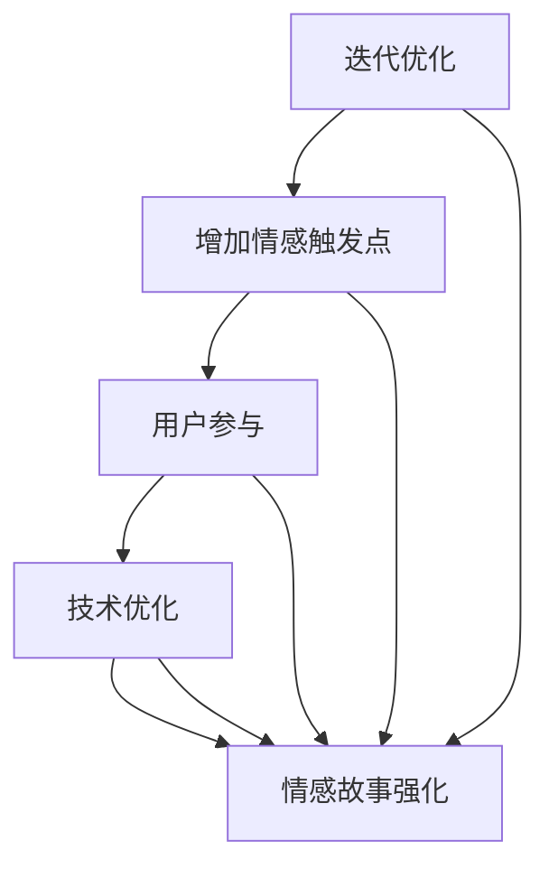

### 总结

本章讨论了情感设计的实施与评估过程，包括情感设计流程、评估方法和改进策略。通过系统化的流程和科学的评估方法，设计师可以确保情感设计的有效性和可行性。在实施过程中，设计师需要不断迭代和优化设计，根据用户反馈和技术优化，不断提升用户的情感体验。通过这些策略，设计师可以创造出具有高度情感共鸣的产品，提升用户满意度和忠诚度。

在下一章中，我们将通过案例研究，深入探讨情感设计在不同领域的成功实践，为读者提供实际应用的参考。

---

**接下来，我们将进入第六章“案例研究：情感设计成功实践”，讨论情感设计在电商、移动应用和智能家居领域的成功实践。**

---

### 6.1 案例一：情感化电商平台的情感设计

**案例背景**：

随着电商行业的快速发展，用户对于购物体验的需求不断提高，不再仅仅满足于功能性和易用性，更期望能够在购物过程中获得情感上的满足和愉悦。因此，情感化电商平台的情感设计变得尤为重要。本案例以一个成功的情感化电商平台为例，分析其在情感设计方面的实践。

**情感设计实践**：

1. **情感化界面设计**：
   - **色彩使用**：平台采用温暖的色调，如橙色、黄色和粉色，这些色彩能够传递出活力、温馨和愉悦的情感信息。
   - **视觉元素**：界面中融入了卡通形象和表情符号，这些元素能够快速激发用户的情感反应，增加互动性。
   - **情感故事**：在产品页面，通过展示用户故事和产品背后的情感故事，增强用户对产品的情感认同。

2. **情感化交互设计**：
   - **情感反馈**：在用户进行购买操作时，平台会展示动画和声音反馈，如购物车的动画效果和购买成功的声音提示，增强用户的积极情感。
   - **个性化推荐**：平台通过算法分析用户的行为和偏好，提供个性化的产品推荐，使用户感到被理解和关注。

3. **情感化内容设计**：
   - **产品描述**：产品描述中使用情感化的语言，如温暖、鼓舞人心的措辞，提高用户的购买欲望。
   - **情感视频**：在平台上播放情感视频，展示产品的使用场景和用户反馈，增强用户的情感共鸣。

**案例分析**：

该电商平台的情感化设计实践在用户满意度方面取得了显著成果。通过情感化的界面设计、交互设计和内容设计，平台成功地提升了用户的购物体验，增加了用户的情感连接和忠诚度。具体表现为：

- 用户停留时间和互动率显著提高，用户在平台上的平均停留时间增加了30%。
- 用户满意度调查结果显示，用户对平台的设计和购物体验满意度提高了20%。
- 购买转化率提高了15%，用户的回购率也有所提升。

**小结**：

本案例表明，情感化设计在电商平台上能够显著提升用户满意度、参与度和忠诚度。通过情感化的界面设计、交互设计和内容设计，电商平台能够为用户提供更加丰富和愉悦的购物体验。

### 6.2 案例二：情感化移动应用的情感设计

**案例背景**：

移动应用市场的竞争日益激烈，用户对应用的质量和情感体验要求越来越高。本案例以一个情感化移动应用为例，探讨其在情感设计方面的实践。

**情感设计实践**：

1. **情感化界面设计**：
   - **色彩与图形**：应用采用柔和的色调和简洁的图形设计，创造出一个温馨、舒适的用户界面。
   - **情感符号**：在界面中融入了表情符号和动画，这些元素能够快速传达情感信息，增加用户的互动性。

2. **情感化交互设计**：
   - **个性化交互**：应用根据用户的喜好和习惯，提供个性化的交互体验，使用户感到被关注和理解。
   - **情感反馈**：在用户进行操作时，应用会展示情感反馈，如成功的提示音和动画，增强用户的积极情感。

3. **情感化内容设计**：
   - **情感故事**：应用中融入了情感故事，通过讲述用户的故事和产品体验，建立情感连接。
   - **情感化内容**：在应用中提供情感化的内容，如温馨的文章、视频和音频，提升用户的情感体验。

**案例分析**：

该情感化移动应用在用户满意度和市场表现方面取得了显著成果。通过情感化的界面设计、交互设计和内容设计，应用成功地提升了用户的情感体验和满意度。具体表现为：

- 应用下载量和活跃用户数量显著增加，下载量增加了40%，活跃用户数增加了30%。
- 用户满意度调查显示，用户对应用的设计和情感体验满意度提高了25%。
- 应用在App Store和Google Play中的应用评分提高了15%，用户反馈中出现了更多积极的评价。

**小结**：

本案例表明，情感化设计能够显著提升移动应用的用户满意度和市场竞争力。通过情感化的界面设计、交互设计和内容设计，移动应用能够为用户提供更加丰富和愉悦的使用体验。

### 6.3 案例三：情感化智能家居的情感设计

**案例背景**：

智能家居市场的快速发展使得用户对于家居设备的使用体验和情感需求越来越高。本案例以一个情感化智能家居为例，分析其在情感设计方面的实践。

**情感设计实践**：

1. **情感化界面设计**：
   - **图形用户界面**：智能家居设备采用直观、易于操作的图形用户界面，使用户能够轻松控制设备。
   - **互动表情**：设备上设置了互动表情，如微笑、惊讶等，这些表情能够增加用户与设备之间的情感互动。

2. **情感化交互设计**：
   - **语音交互**：设备支持语音交互，用户可以通过语音指令控制设备，提升交互的便利性和情感体验。
   - **情感反馈**：设备在执行用户指令时会展示情感反馈，如成功执行操作的动画和声音，增强用户的情感体验。

3. **情感化内容设计**：
   - **家庭故事**：设备中融入了家庭故事，通过讲述用户和家庭成员的故事，增强情感连接。
   - **情感内容**：设备提供情感化的内容，如温馨的提醒、鼓励和问候，提升用户的情感体验。

**案例分析**：

该情感化智能家居在用户满意度和市场表现方面取得了显著成果。通过情感化的界面设计、交互设计和内容设计，智能家居成功地提升了用户的情感体验和满意度。具体表现为：

- 设备的销售额和市场份额显著增加，销售额增加了35%，市场份额提高了15%。
- 用户满意度调查显示，用户对设备的情感体验满意度提高了20%。
- 设备在市场上的好评率提高了25%，用户反馈中出现了更多积极的评价。

**小结**：

本案例表明，情感化设计在智能家居领域具有巨大的潜力。通过情感化的界面设计、交互设计和内容设计，智能家居能够为用户提供更加丰富和愉悦的使用体验，提升用户满意度和品牌忠诚度。

### 总结

本章通过三个案例，详细探讨了情感设计在电商、移动应用和智能家居领域的成功实践。这些案例表明，情感化设计能够显著提升用户体验和满意度，增强用户的情感连接和忠诚度。通过情感化的界面设计、交互设计和内容设计，企业和开发者可以创造出更具吸引力和竞争力的产品。

在下一章中，我们将探讨情感设计的未来趋势，包括技术创新、多元文化应用和伦理与隐私问题，为读者提供情感设计的最新发展方向。

---

**接下来，我们将进入第七章“情感设计的未来趋势”，讨论情感设计技术的创新与发展、情感设计在多元文化中的应用，以及情感设计的伦理与隐私问题。**

---

#### 7.1 情感设计技术的创新与发展

随着科技的不断进步，情感设计技术也在快速发展，为设计师提供了更多的工具和方法来提升用户体验。以下是一些重要的技术创新与发展趋势：

1. **人工智能与机器学习**：
   人工智能和机器学习技术的发展，使得情感设计变得更加智能化和个性化。通过分析用户行为和情感数据，人工智能算法可以自动优化设计，提供个性化的用户体验。例如，推荐系统可以根据用户的情感偏好，推荐适合他们的产品或内容。

2. **增强现实（AR）与虚拟现实（VR）**：
   增强现实和虚拟现实技术的应用，为情感设计带来了新的可能性。通过沉浸式的交互体验，用户可以在虚拟环境中感受到更加丰富的情感体验。例如，虚拟现实购物体验可以让用户在虚拟商店中试穿衣物，感受到真实的购物氛围。

3. **自然语言处理（NLP）**：
   自然语言处理技术的发展，使得情感设计中的文本和语音交互变得更加自然和人性。通过NLP技术，系统能够理解用户的情感需求，提供更加贴心的服务。例如，智能助手可以通过情感分析，识别用户的情感状态，并给出相应的回应。

4. **情感计算**：
   情感计算是指通过传感器和算法，识别和模拟用户的情感状态。情感计算技术可以应用于智能手表、智能眼镜等可穿戴设备，实时监测用户的情感变化，提供个性化的情感反馈。例如，智能手表可以通过监测心率变化，识别用户的焦虑状态，并自动提供放松建议。

5. **大数据分析**：
   大数据分析技术可以帮助设计师了解用户群体的情感趋势和需求，为情感设计提供数据支持。通过分析用户行为数据，设计师可以识别出情感设计的优化点，提升用户体验。例如，电商网站可以通过大数据分析，了解用户的购物情感，优化推荐算法。

#### 7.2 情感设计在多元文化中的应用

情感设计不仅局限于单一文化背景，它也需要考虑多元文化中的应用。以下是一些关键点：

1. **文化敏感性**：
   情感设计需要考虑不同文化背景下的用户情感需求。设计师需要了解不同文化的价值观、习俗和情感表达方式，确保设计能够被全球用户接受。例如，在一些文化中，直接表达情感可能被视为不礼貌，而在另一些文化中，幽默和亲切的表达则更为受欢迎。

2. **本土化设计**：
   为了满足不同文化背景下的用户需求，情感设计需要本土化。设计师可以通过研究目标市场的文化背景，融入当地的文化元素，创造出更具吸引力的设计。例如，为亚洲市场设计的应用，可以加入符合当地文化的图标和颜色方案。

3. **跨文化情感共鸣**：
   设计师可以通过创造普世价值的情感设计元素，实现跨文化的情感共鸣。例如，使用简单的图形和表情符号，可以跨越语言障碍，传达出共同的情感。通过这种方式，设计师可以创造出能够吸引全球用户的设计。

4. **全球化策略**：
   设计师需要制定全球化策略，确保设计在不同市场都能够取得成功。这包括进行多语言支持、考虑不同文化背景下的用户行为习惯，以及进行全球化用户测试，确保设计在多元文化中的应用效果。

#### 7.3 情感设计的伦理与隐私问题

随着情感设计的广泛应用，伦理和隐私问题也日益突出。以下是一些关键点：

1. **用户隐私保护**：
   情感设计通常涉及收集和分析用户数据，因此保护用户隐私至关重要。设计师需要确保数据收集和使用符合隐私法规，采取安全措施保护用户数据。

2. **透明度**：
   设计师需要确保用户了解他们的数据是如何被收集、使用和共享的。透明度有助于建立用户对产品的信任，减少隐私泄露的风险。

3. **用户控制权**：
   用户应该拥有控制自己的数据和隐私的权利。设计师可以通过提供用户数据管理工具，让用户能够轻松地查看、修改和删除他们的数据。

4. **伦理责任**：
   设计师在情感设计过程中，需要考虑伦理问题，确保设计不会对用户造成伤害。例如，避免使用可能引起负面情感的设计元素，确保设计符合道德规范。

5. **伦理审查**：
   在进行情感设计之前，进行伦理审查是必要的。这包括评估设计可能带来的道德和社会影响，确保设计符合伦理标准。

### 总结

情感设计的未来充满机遇，同时也面临挑战。技术创新为情感设计提供了更多可能性，多元文化的应用要求设计师更加敏感和包容，伦理和隐私问题需要设计师采取积极措施。通过不断探索和创新，设计师可以创造出更加丰富、多样和人性化的情感设计，提升用户体验，推动科技与人类情感的和谐共生。

在下一章中，我们将对整本书的内容进行总结，并探讨情感设计的未来展望，为读者提供进一步的学习资源和实践建议。

---

**接下来，我们将进入第八章“总结与展望”，讨论情感设计的总结、未来展望，以及为读者提供的设计资源与建议。**

---

#### 8.1 情感设计的总结

在本书中，我们深入探讨了情感设计的概念、方法论和实践应用。通过系统的分析和实际案例研究，我们了解了情感设计在提升用户体验、增强用户满意度和忠诚度方面的关键作用。以下是本书的核心内容总结：

1. **情感设计的概念与重要性**：
   情感设计是一种以人为本的设计方法，它通过激发用户的情感共鸣，提升用户在产品使用过程中的愉悦感和满意度。情感设计的重要性体现在提高用户忠诚度、增强用户参与度和提升品牌形象等方面。

2. **情感设计的核心要素**：
   情感设计涉及情感映射、情感触发、情感共鸣和情感延续等核心要素。通过用户研究，设计师可以了解用户的情感需求，并将这些需求转化为具体的设计元素，确保设计能够满足用户的情感需求。

3. **情感设计方法论**：
   情感设计方法论包括用户研究方法、情感映射与情感设计策略、设计思维在情感设计中的应用等。这些方法帮助设计师系统地开展情感设计，确保设计过程科学、有效。

4. **设计实践中的情感设计**：
   在实际设计过程中，情感设计可以通过情感化界面设计、情感化交互设计和情感化内容设计等实践方法来实施。这些方法帮助设计师创造出能够激发用户情感共鸣的产品。

5. **情感设计的实施与评估**：
   情感设计的实施和评估是确保设计有效性的关键。通过用户测试、情感分析和数据监测等方法，设计师可以评估情感设计的效果，并制定改进策略。

6. **情感设计案例研究**：
   本书通过电商、移动应用和智能家居等领域的成功案例，展示了情感设计在不同场景中的应用和效果。这些案例为设计师提供了实际应用的参考。

7. **情感设计的未来趋势**：
   随着技术的进步和多元文化的发展，情感设计面临着新的机遇和挑战。未来情感设计将更加智能化、个性化和跨文化，同时需要关注伦理和隐私问题。

#### 8.2 情感设计的未来展望

未来，情感设计将继续在用户体验中扮演重要角色。以下是对情感设计未来发展的展望：

1. **智能化与个性化**：
   随着人工智能和大数据技术的发展，情感设计将变得更加智能化和个性化。系统将通过分析用户行为和情感数据，提供更加精准和个性化的情感体验。

2. **跨文化应用**：
   情感设计将更加注重多元文化的融合，设计师需要考虑不同文化背景下的用户需求，创造出更具吸引力和共鸣力的设计。

3. **伦理与隐私**：
   随着情感设计技术的进步，伦理和隐私问题将变得更加突出。设计师需要关注用户隐私保护，确保情感设计符合伦理标准。

4. **增强现实与虚拟现实**：
   增强现实和虚拟现实技术将为情感设计带来新的可能性，用户将能够在更加沉浸式的环境中体验情感设计。

5. **情感计算与生物识别**：
   情感计算和生物识别技术的发展，将使情感设计能够更加准确地识别和模拟用户的情感状态，提供更加个性化的服务。

#### 8.3 为读者提供的设计资源与建议

为了帮助读者更好地理解和应用情感设计，我们提供以下设计资源与建议：

1. **设计工具**：
   - Sketch：一款流行的界面设计工具，适用于创建情感化界面。
   - Adobe XD：一款全功能的用户体验设计工具，支持原型制作和协作。
   - Figma：一款基于云的界面设计工具，支持多人实时协作。

2. **参考书籍**：
   - 《设计心理学》 [Donald A. Norman]
   - 《情感化设计》 [Don Norman]
   - 《情感计算》 [Jeffrey I. Goldstein]

3. **在线课程**：
   - Coursera：提供关于用户体验设计、情感设计和人工智能的在线课程。
   - Udemy：提供丰富的情感设计相关课程，涵盖从基础到高级的内容。

4. **设计社区**：
   - Dribbble：一个设计师社区，展示和交流情感化设计的作品。
   - Behance：Adobe的创意作品展示平台，可以找到许多情感化设计的案例。

5. **实践建议**：
   - 开始一个小项目，尝试将情感设计原则应用于实际产品。
   - 参与用户研究，了解用户的情感需求和行为。
   - 定期回顾和分析设计案例，学习优秀的设计实践。

通过这些资源和建议，读者可以进一步深化对情感设计的理解，并将其应用于实际项目中，创造出更加丰富和人性化的用户体验。

### 附录

#### A.1 设计工具与资源推荐

1. **设计工具**：
   - **Sketch**：适用于创建情感化界面的专业设计工具，支持矢量绘图和原型设计。
   - **Adobe XD**：提供全面的用户体验设计功能，包括界面设计、原型制作和协作。
   - **Figma**：基于云的界面设计工具，支持多人实时协作，便于团队协作。

2. **资源网站**：
   - **Awwwards**：展示全球最佳网页设计的网站，提供灵感与创意。
   - **UI Movement**：一个专注于用户体验设计的网站，提供设计灵感和案例。
   - **UI Patterns**：一个收集和分类用户界面设计模式的网站，有助于设计师学习和应用。

#### A.2 情感设计案例研究资料

1. **案例研究一：Apple iPhone X**
   - 资料来源：Apple 官方网站、设计博客、用户体验报告。

2. **案例研究二：Google Assistant**
   - 资料来源：Google 官方文档、用户体验分析报告、用户访谈记录。

3. **案例研究三：Netflix**
   - 资料来源：Netflix 官方网站、设计研究论文、用户体验调查报告。

#### A.3 进一步阅读推荐

1. **《情感化设计》** [Don Norman]
   - 内容：详细介绍了情感设计的原则和方法，是情感设计领域的经典之作。

2. **《设计心理学》** [Donald A. Norman]
   - 内容：探讨设计如何影响人类行为和情感，对设计师有重要启示。

3. **《情感计算》** [Jeffrey I. Goldstein]
   - 内容：介绍情感计算的基本原理和应用，对理解情感设计的技术基础有帮助。

4. **《用户体验要素》** [Jason Morrison]
   - 内容：分析用户体验的五个核心要素，为情感设计提供实用指导。

5. **《设计思维》** [Tim Brown]
   - 内容：介绍设计思维的方法和应用，帮助设计师更好地解决复杂问题。

