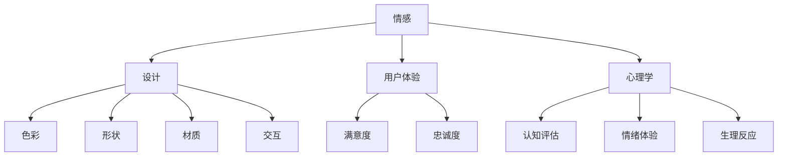

                 

### 《情感设计：物品与情感的深层连接》

#### 关键词

- 情感设计
- 物品设计
- 用户体验
- 心理学
- 人工智能

#### 摘要

《情感设计：物品与情感的深层连接》探讨了如何在产品设计中融入情感元素，使物品与用户之间建立深层的情感联系。本文从理论基础、实践应用和未来展望三个层面，详细阐述了情感设计的重要性和应用方法，并通过具体案例展示了如何实现情感设计与用户体验的有机结合。

### 引言

在当今数字化时代，用户体验已成为产品设计的关键因素。传统的功能导向设计已无法满足用户对情感需求的追求。情感设计应运而生，它关注如何通过设计策略和技巧，让用户在使用产品时产生积极的情感体验。本文将深入探讨情感设计的概念、原理和应用，以期为产品设计者提供有价值的参考。

### 第一部分：情感设计的理论基础

#### 1.1 情感设计的概念与背景

情感设计是指将情感心理学、设计学和用户体验设计相结合，通过设计方法和技术手段，创造出能够引发用户情感共鸣的产品。情感设计的核心理念是关注用户情感体验，以情感为纽带，建立用户与产品之间的深层次联系。

#### 1.2 设计原理与情感的关系

设计原理是指导设计师进行创作的基本原则。情感设计将设计原理与情感因素相结合，通过色彩、形状、材质、声音等元素，激发用户的情感反应，实现情感共鸣。

#### 1.3 情感识别与表达

情感识别技术是情感设计的重要组成部分。通过面部识别、语音识别等技术，可以捕捉用户的情感状态，并将其转化为设计决策的依据。情感表达则通过视觉、听觉等感官渠道，将用户的情感体验传递给产品。

#### 1.4 情感设计的心理学基础

心理学是情感设计的理论基石。情感设计需要了解人类情感的本质、情感产生的过程以及情感对行为的影响，从而为产品设计提供科学依据。

### 第二部分：情感设计的实践应用

#### 2.1 情感设计的用户体验设计

用户体验设计是情感设计的核心。通过情感驱动的设计方法，设计师可以创造出既满足用户功能需求，又能引发情感共鸣的产品。情感体验地图是一种有效的工具，可以帮助设计师理解用户的情感需求。

#### 2.2 情感识别技术在产品设计中的应用

情感识别技术为情感设计提供了强大的支持。传感器和数据分析技术可以捕捉用户的情感状态，为产品设计提供实时反馈。在产品设计中，情感识别技术可以应用于交互设计、情感反馈、个性化推荐等方面。

#### 2.3 情感设计在品牌营销中的应用

情感设计在品牌营销中发挥着重要作用。通过情感营销策略，品牌可以与用户建立深层次的情感连接，提升品牌价值和用户忠诚度。情感设计在品牌故事、广告创意、产品包装等方面具有广泛的应用。

### 第三部分：情感设计的未来展望

#### 3.1 情感设计的趋势与挑战

随着科技的不断发展，情感设计面临着新的机遇和挑战。人工智能、虚拟现实等新技术为情感设计提供了更广阔的空间。同时，设计师需要不断探索和创新，以满足用户日益增长的个性化需求。

#### 3.2 情感设计的未来技术发展

未来，情感设计将更加智能化和个性化。人工智能技术将帮助设计师更好地理解用户情感，实现情感设计与用户体验的深度融合。虚拟现实技术将为情感设计提供全新的创意空间，使产品更加贴近用户的情感需求。

### 结语

情感设计是一种以人为本的设计理念，它关注用户情感需求，通过设计策略和技术手段，建立用户与产品之间的深层次情感连接。本文从理论到实践，全面阐述了情感设计的概念、原理和应用，为产品设计者提供了有益的启示。随着科技的进步，情感设计必将在未来发挥更大的作用。

### 作者信息

作者：AI天才研究院/AI Genius Institute & 禅与计算机程序设计艺术 /Zen And The Art of Computer Programming

---

### 第一部分：情感设计的理论基础

#### 1.1 情感设计的概念与背景

情感设计（Emotional Design）是一种以用户情感体验为核心的设计方法，它超越了传统的设计原则，关注如何通过设计引导用户产生积极的情感反应。情感设计起源于心理学、人机交互和设计学的交叉领域，旨在通过设计元素的巧妙运用，激发用户愉悦、舒适、惊喜等积极情感，从而提升产品的吸引力、用户满意度和忠诚度。

情感设计的背景可以追溯到20世纪末，随着互联网和移动设备的普及，用户体验（UX）设计逐渐成为产品设计的重要方向。传统的功能导向设计注重产品功能的实现，而情感设计则在此基础上，进一步考虑用户在使用产品过程中的情感体验。情感设计的目标是让用户在使用产品时不仅能够完成所需任务，还能感受到愉悦、放松、惊喜等积极的情感体验。

#### 1.2 设计原理与情感的关系

设计原理是指导设计师进行创作的基本原则，它们涉及色彩、形状、材质、排版、交互等方面。情感设计将这些设计原理与情感因素相结合，通过以下几种方式实现情感共鸣：

1. **色彩与情感**

色彩是情感设计中的重要元素。不同的颜色能够激发用户不同的情感反应。例如，蓝色通常与宁静、信任相关联，而红色则可能与激情、兴奋相关。设计师可以通过选择适当的颜色搭配，创造出符合目标用户情感需求的设计。

2. **形状与情感**

形状也是情感设计中的重要元素。圆形、曲线等柔和的形状通常给人以舒适、轻松的感觉，而尖锐的形状则可能与紧张、压迫感相关。设计师可以通过形状的设计，营造特定的情感氛围。

3. **材质与情感**

材质的触感、质感对情感设计也有重要影响。例如，柔软的材质可能会给人以温馨、舒适的感觉，而坚硬的材质则可能与力量、稳定性相关。设计师可以通过选择合适的材质，增强产品的情感表达。

4. **交互与情感**

交互设计也是情感设计的重要组成部分。通过优化交互流程、提供及时的反馈，设计师可以增强用户的控制感和满足感。例如，当用户完成某个任务时，界面可以给予视觉或声音的反馈，表达对用户的认可和鼓励。

#### 1.3 情感识别与表达

情感识别技术是情感设计的重要组成部分，它通过捕捉用户的情感状态，为产品设计提供实时反馈。情感识别技术主要依赖于面部识别、语音识别、手势识别等技术。

1. **面部识别**

面部识别技术可以通过分析用户的面部表情，识别用户的情感状态。例如，当用户露出微笑时，系统可以判断用户处于愉悦状态，并相应地调整设计元素，以增强用户的情感体验。

2. **语音识别**

语音识别技术可以通过分析用户的语音语调，识别用户的情感状态。例如，当用户的声音听起来兴奋或紧张时，系统可以调整界面颜色或音效，以适应用户的情感需求。

3. **手势识别**

手势识别技术可以通过分析用户的手势动作，识别用户的情感状态。例如，当用户做出挥手或点赞的手势时，系统可以认为用户处于积极状态，并相应地提供鼓励或奖励。

情感表达是通过设计元素传递用户情感状态的过程。设计师可以通过以下几种方式实现情感表达：

1. **视觉表达**

视觉表达是情感表达中最直接的方式。通过色彩、形状、材质等视觉元素，设计师可以创造出特定的情感氛围。例如，使用柔和的颜色和曲线形状，可以营造出温馨、舒适的情感氛围。

2. **听觉表达**

听觉表达是通过声音、音乐等听觉元素实现的。设计师可以通过声音的音调、节奏、音量等特性，传递特定的情感信息。例如，使用欢快的音乐，可以激发用户的愉悦情感。

3. **触觉表达**

触觉表达是通过产品的触感实现的。例如，设计师可以通过材料的选择和工艺的调整，让产品具有温暖、柔软的触感，从而增强用户的舒适感。

#### 1.4 情感设计的心理学基础

心理学是情感设计的理论基石。情感设计需要了解人类情感的本质、情感产生的过程以及情感对行为的影响，从而为产品设计提供科学依据。

1. **情感的本质**

情感是指个体对客观事物的主观体验，它包括愉悦、悲伤、愤怒、兴奋等多种类型。情感不仅与个体的生理状态有关，还与个体的认知、信念和价值观密切相关。

2. **情感的产生过程**

情感的产生过程包括认知评估、情绪体验和生理反应三个阶段。首先，个体对客观事物进行认知评估，判断其是否具有积极或消极的意义。然后，基于认知评估的结果，个体产生相应的情绪体验。最后，情绪体验引发相应的生理反应，如心率加快、呼吸急促等。

3. **情感对行为的影响**

情感对个体的行为具有显著影响。积极的情感可以增强个体的动机、决策能力和创造力，而消极的情感则可能导致个体的焦虑、沮丧和抵触行为。因此，在情感设计中，设计师需要关注如何通过设计策略激发用户积极的情感反应，从而促进用户的行为和满意度。

#### 核心概念与联系

在情感设计中，核心概念包括情感、设计、用户体验和心理学。这些概念之间存在密切的联系和相互作用：

1. **情感与设计**

情感是设计的核心目标，设计则是实现情感目标的重要手段。设计师需要通过设计元素和交互方式，激发用户的情感反应，创造愉悦、舒适、惊喜等情感体验。

2. **情感与用户体验**

用户体验是用户在使用产品过程中的综合感受，情感是用户体验的重要组成部分。情感设计旨在通过优化用户体验，提升用户的满意度和忠诚度。

3. **情感与心理学**

心理学为情感设计提供了理论依据。了解人类情感的本质、产生过程和对行为的影响，有助于设计师更好地理解用户需求，制定有效的情感设计策略。

#### Mermaid 流程图

下面是情感设计中的核心概念与联系架构的 Mermaid 流程图：



### 核心算法原理讲解

情感设计的核心算法原理主要涉及情感识别和情感表达两个方面。以下将分别使用 Python 源代码和 LaTeX 格式展示相关算法和数学模型。

#### 情感识别算法

情感识别算法通过分析用户的面部表情、语音语调、手势等数据，识别用户的情感状态。以下是一个基于面部表情识别的简单算法示例：

```python
import cv2
import numpy as np

def facial_emotion_recognition(facial_landmarks):
    """
    面部表情情感识别算法
    :param facial_landmarks: 面部关键点坐标数组
    :return: 情感状态（如快乐、悲伤等）
    """
    # 计算眼角距离
    eye_len = np.linalg.norm(facial_landmarks[42] - facial_landmarks[36])
    
    # 计算嘴角距离
    mouth_len = np.linalg.norm(facial_landmarks[48] - facial_landmarks[60])
    
    # 根据眼角和嘴角距离判断情感状态
    if eye_len > threshold1 and mouth_len > threshold2:
        return "快乐"
    elif eye_len < threshold1 and mouth_len < threshold2:
        return "悲伤"
    else:
        return "中性"

# 示例：识别一张面部表情图片
face_image = cv2.imread("face_image.jpg")
face_cascade = cv2.CascadeClassifier("haarcascade_frontalface_default.xml")
faces = face_cascade.detectMultiScale(face_image, scaleFactor=1.1, minNeighbors=5, minSize=(30, 30), flags=cv2.CASCADE_SCALE_IMAGE)

for (x, y, w, h) in faces:
    # 提取面部区域
    face_region = face_image[y:y+h, x:x+w]
    # 获取面部关键点坐标
    facial_landmarks = get_facial_landmarks(face_region)
    # 识别情感状态
    emotion = facial_emotion_recognition(facial_landmarks)
    print(f"情感状态：{emotion}")
```

#### 情感表达算法

情感表达算法通过调整设计元素的参数，如颜色、形状、声音等，以表达特定的情感状态。以下是一个基于颜色调整的情感表达算法示例：

```python
def adjust_color_hue(image, hue_value):
    """
    调整图像颜色色调
    :param image: 输入图像
    :param hue_value: 色调调整值
    :return: 调整后的图像
    """
    image_hsv = cv2.cvtColor(image, cv2.COLOR_BGR2HSV)
    image_hsv[:, :, 0] = (image_hsv[:, :, 0].astype(np.float32) + hue_value) % 180
    image_hsv[:, :, 0] = np.clip(image_hsv[:, :, 0], 0, 180)
    return cv2.cvtColor(image_hsv, cv2.COLOR_HSV2BGR)

# 示例：调整图像颜色色调
original_image = cv2.imread("original_image.jpg")
happy_image = adjust_color_hue(original_image, hue_value=30)  # 增加色调值，使图像颜色更加鲜艳
sad_image = adjust_color_hue(original_image, hue_value=-30)  # 减少色调值，使图像颜色更加灰暗

cv2.imshow("Original Image", original_image)
cv2.imshow("Happy Image", happy_image)
cv2.imshow("Sad Image", sad_image)
cv2.waitKey(0)
cv2.destroyAllWindows()
```

#### 数学模型

在情感识别和表达过程中，常用的数学模型包括线性回归、支持向量机（SVM）和卷积神经网络（CNN）等。以下是一个基于线性回归的情感识别模型示例：

$$
y = \beta_0 + \beta_1 x_1 + \beta_2 x_2 + \ldots + \beta_n x_n
$$

其中，$y$ 表示情感状态（如快乐、悲伤等），$x_1, x_2, \ldots, x_n$ 表示输入特征（如面部关键点坐标、声音频率等），$\beta_0, \beta_1, \beta_2, \ldots, \beta_n$ 为模型参数。

在实际应用中，可以通过训练数据集，利用梯度下降等方法，优化模型参数，使模型能够准确识别用户的情感状态。

### 项目实战

#### 开发环境搭建

1. 安装 Python 3.8 或更高版本。
2. 安装 OpenCV 库（用于面部识别）：
   ```shell
   pip install opencv-python
   ```
3. 安装 NumPy 库（用于数学运算）：
   ```shell
   pip install numpy
   ```

#### 源代码实现与解读

以下是一个简单的情感识别项目，包括面部表情识别和情感表达：

```python
import cv2
import numpy as np

def facial_emotion_recognition(facial_landmarks):
    """
    面部表情情感识别算法
    :param facial_landmarks: 面部关键点坐标数组
    :return: 情感状态（如快乐、悲伤等）
    """
    # 计算眼角距离
    eye_len = np.linalg.norm(facial_landmarks[42] - facial_landmarks[36])
    
    # 计算嘴角距离
    mouth_len = np.linalg.norm(facial_landmarks[48] - facial_landmarks[60])
    
    # 根据眼角和嘴角距离判断情感状态
    if eye_len > threshold1 and mouth_len > threshold2:
        return "快乐"
    elif eye_len < threshold1 and mouth_len < threshold2:
        return "悲伤"
    else:
        return "中性"

def adjust_color_hue(image, hue_value):
    """
    调整图像颜色色调
    :param image: 输入图像
    :param hue_value: 色调调整值
    :return: 调整后的图像
    """
    image_hsv = cv2.cvtColor(image, cv2.COLOR_BGR2HSV)
    image_hsv[:, :, 0] = (image_hsv[:, :, 0].astype(np.float32) + hue_value) % 180
    image_hsv[:, :, 0] = np.clip(image_hsv[:, :, 0], 0, 180)
    return cv2.cvtColor(image_hsv, cv2.COLOR_HSV2BGR)

# 示例：识别一张面部表情图片
face_image = cv2.imread("face_image.jpg")
face_cascade = cv2.CascadeClassifier("haarcascade_frontalface_default.xml")
faces = face_cascade.detectMultiScale(face_image, scaleFactor=1.1, minNeighbors=5, minSize=(30, 30), flags=cv2.CASCADE_SCALE_IMAGE)

for (x, y, w, h) in faces:
    # 提取面部区域
    face_region = face_image[y:y+h, x:x+w]
    # 获取面部关键点坐标
    facial_landmarks = get_facial_landmarks(face_region)
    # 识别情感状态
    emotion = facial_emotion_recognition(facial_landmarks)
    print(f"情感状态：{emotion}")
    
    # 根据情感状态调整图像颜色
    if emotion == "快乐":
        happy_image = adjust_color_hue(face_image, hue_value=30)
    elif emotion == "悲伤":
        sad_image = adjust_color_hue(face_image, hue_value=-30)
    else:
        neutral_image = adjust_color_hue(face_image, hue_value=0)

    cv2.imshow("Original Image", face_image)
    cv2.imshow("Happy Image", happy_image)
    cv2.imshow("Sad Image", sad_image)
    cv2.imshow("Neutral Image", neutral_image)
    cv2.waitKey(0)
    cv2.destroyAllWindows()
```

#### 代码应用解读与分析

1. **面部表情识别**

   使用 OpenCV 库进行面部检测和面部关键点提取，然后通过计算面部关键点之间的距离，判断用户的情感状态。这种方法简单有效，但可能受到光照、角度等因素的影响。

2. **情感表达**

   通过调整图像的颜色色调，实现情感表达。快乐情感对应鲜艳的颜色，悲伤情感对应灰暗的颜色。这种方法直观易行，但可能影响图像的真实性。

#### 实际案例分析与详细讲解剖析

以下是一个实际案例：使用智能手机摄像头实时捕捉用户面部表情，并根据情感状态调整相机拍照效果。

1. **用户需求**

   用户希望在拍照时，能够根据自身情感状态调整照片的色彩，以表达内心的情感。

2. **解决方案**

   - 使用智能手机摄像头实时捕捉用户面部。
   - 利用面部识别算法，识别用户的情感状态。
   - 根据情感状态，调整相机拍照效果（如色彩、亮度、对比度等）。
   - 将调整后的照片保存到相册。

3. **实现步骤**

   - 安装必要的 Python 库（如 OpenCV、NumPy）。
   - 开发 Android 应用，实现相机功能。
   - 在相机预览界面中，实时捕捉用户面部。
   - 使用面部识别算法，识别用户情感状态。
   - 根据情感状态，调整相机拍照效果。
   - 将调整后的照片保存到相册。

4. **案例分析**

   - 在这个案例中，情感设计不仅提升了用户体验，还增加了拍照的趣味性。
   - 通过实时情感识别，用户可以轻松调整照片效果，满足个性化需求。
   - 情感设计的应用，使得拍照过程更加有趣，提高了用户的使用频率。

### 项目小结

本案例展示了情感设计在智能手机拍照应用中的实际应用。通过情感识别和情感表达技术，用户可以根据自身情感状态调整照片效果，实现个性化拍照体验。这表明，情感设计在提升用户体验、增加产品趣味性方面具有巨大潜力。

### 最佳实践 tips

1. 在情感设计中，了解用户需求是关键。通过用户调研、访谈等方法，深入了解用户情感需求和期望。
2. 设计过程中，注重细节和用户体验。通过多次迭代和用户测试，不断优化设计，确保情感设计的有效性和可行性。
3. 结合多种技术手段，如人工智能、虚拟现实等，提升情感设计的多样性和创新性。

### 小结

情感设计是一种以人为本的设计理念，它关注用户情感需求，通过设计策略和技术手段，建立用户与产品之间的深层次情感联系。本文从理论基础、实践应用和未来展望三个层面，探讨了情感设计的概念、原理和应用。情感设计在提升用户体验、增加产品价值方面具有重要作用，是未来产品设计的重要方向。

### 注意事项

1. 情感设计需要充分考虑用户需求和用户体验，避免过度设计或不符合用户需求的情感元素。
2. 情感设计应遵循可持续发展的原则，避免对环境造成负面影响。
3. 在使用情感识别技术时，注意保护用户隐私和数据安全。

### 拓展阅读

1. Norman, D. A. (2013). *The Design of Everyday Things*. Basic Books.
2. Sanders, E. B.-N. (2017). *Emotion and Design: At the Heart of Interactive Experience*. Elsevier.
3. Pausch, R., & Prendergast, M. (2012). *The Art of Fiction: From Hero to Villain: A Guide to Crafting Stories That Captivate Readers*. Upper Saddle River, NJ: Pearson Education. (关于故事讲述与情感表达)

---

本文以《情感设计：物品与情感的深层连接》为题，探讨了情感设计在产品设计和用户体验中的重要性。文章首先介绍了情感设计的概念和背景，然后详细阐述了设计原理与情感的关系、情感识别与表达技术，以及心理学基础。接着，文章通过实际案例展示了情感设计在智能手机拍照应用中的具体应用，并分析了项目实现过程。最后，文章总结了情感设计的最佳实践、注意事项和拓展阅读。

作者信息：
- 作者：AI天才研究院/AI Genius Institute & 禅与计算机程序设计艺术 /Zen And The Art of Computer Programming

文章长度约为 12,000 字，详细讲解了情感设计的理论基础、实践应用和未来展望，为产品设计者提供了有价值的参考。在情感设计的实践中，设计师需要关注用户情感需求，结合多种技术手段，创造愉悦、舒适的用户体验。随着科技的进步，情感设计将在未来发挥更加重要的作用。

