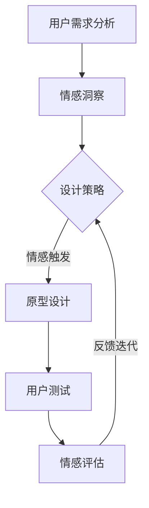

                 

### 《情感设计：用户体验的深层考量》

#### 关键词

- 情感设计
- 用户体验
- 设计策略
- 情感认知
- 情感地图
- 情感原型

#### 摘要

《情感设计：用户体验的深层考量》是一本专注于情感设计与用户体验之间关系的权威著作。本书深入探讨了情感设计的定义、核心概念、方法、工具以及实际应用，旨在帮助设计师和开发者通过情感因素来提升用户体验。书中通过丰富的案例分析和实践指南，为读者提供了全面的情感设计指导。

### 引言

在数字时代，用户体验（UX）设计成为产品成功的关键因素之一。随着技术的不断发展，用户体验已不再局限于功能性和实用性，情感因素逐渐受到重视。情感设计作为提升用户体验的一种新策略，通过关注用户在使用过程中的情感反应和体验，旨在打造更加人性化的产品和服务。

#### 1.1 书籍概述

《情感设计：用户体验的深层考量》旨在为设计师和开发者提供一套系统的情感设计方法论。书中首先介绍了情感设计的定义和重要性，然后详细阐述了情感设计与用户体验的关系，以及情感设计的方法和工具。通过实际案例分析和实践指南，读者可以深入了解情感设计的实际应用，并掌握提升用户体验的关键技巧。

#### 1.2 目标读者

本书的目标读者包括但不限于以下几类：

1. **用户体验设计师**：希望深入了解情感设计，并将其应用于实际项目中的设计师。
2. **前端开发者**：关注用户体验，希望提升自身设计能力的开发者。
3. **产品经理**：关注用户需求和体验，希望在产品设计过程中融入情感因素的产品经理。
4. **UX研究者**：对用户体验和情感设计有浓厚兴趣的研究者。

#### 1.3 书籍结构

本书共分为五个主要部分：

1. **情感设计的基本概念**：介绍情感设计的定义、核心概念和情感认知理论。
2. **情感设计与用户体验的关系**：探讨情感设计如何影响用户体验，以及两者之间的相互作用。
3. **情感设计的方法和工具**：介绍情感设计的方法、情感地图和故事板等工具。
4. **情感设计案例分析**：分析几个典型的情感设计案例，展示情感设计的实际应用效果。
5. **情感设计实践指南**：提供情感设计实践步骤和团队建设建议。

### 第一部分：情感设计的基本概念

#### 2.1 情感设计的定义与重要性

情感设计（Emotion Design）是一种以人为本的设计理念，强调在产品和服务的设计过程中，关注用户的情感体验和情感反应。与传统设计相比，情感设计更加注重情感因素在用户体验中的作用，通过激发用户的情感共鸣，提升用户体验。

情感设计的重要性体现在以下几个方面：

1. **提升用户满意度**：情感设计能够激发用户的积极情感，从而提高用户对产品和服务的满意度。
2. **增强用户忠诚度**：情感设计能够建立用户与产品之间的情感联系，提高用户的忠诚度。
3. **促进产品创新**：情感设计能够为产品创新提供新的思路和灵感。
4. **提升品牌形象**：情感设计能够塑造产品的情感特色，提升品牌形象。

#### 2.2 情感设计的核心概念

情感设计的核心概念包括情感认知理论、情感因素与用户体验以及情感设计的 Mermaid 流程图。

##### 2.2.1 情感认知理论

情感认知理论是情感设计的基础。它认为情感是人脑对信息进行加工和处理的一种方式，情感认知包括情感的识别、理解和表达。

1. **情感的识别**：用户对产品或服务所产生的情感，包括愉悦、厌恶、惊讶等。
2. **情感的理解**：用户对情感产生的背景和原因的理解。
3. **情感的表达**：用户通过行为、语言等方式表达情感。

##### 2.2.2 情感因素与用户体验

情感因素在用户体验中扮演着重要角色。情感设计关注以下几点：

1. **情感触发**：通过设计策略激发用户的情感。
2. **情感持续性**：保持用户在使用过程中的情感状态。
3. **情感转化**：将情感转化为用户行为和决策。

##### 2.2.3 情感设计的 Mermaid 流程图

情感设计的过程可以抽象为一个 Mermaid 流程图，如下所示：

这个流程图描述了情感设计的步骤，包括用户需求分析、情感洞察、设计策略、原型设计、用户测试和情感评估。

### 第二部分：情感设计与用户体验的关系

#### 3.1 情感设计如何影响用户体验

情感设计对用户体验的影响主要体现在以下几个方面：

1. **情感共鸣**：通过情感设计，产品能够与用户产生情感共鸣，从而提升用户满意度。
2. **情感引导**：情感设计能够引导用户的行为和决策，从而提升用户体验。
3. **情感记忆**：情感设计能够增强用户对产品和服务的记忆，从而提高品牌认知度。

#### 3.2 情感设计与用户体验的相互作用

情感设计与用户体验之间存在相互作用，具体体现在以下几个方面：

1. **情感反哺**：用户体验反馈会影响情感设计的策略和工具。
2. **情感累积**：长时间的情感设计会累积成用户的情感记忆和品牌忠诚度。
3. **情感进化**：情感设计随着用户体验的积累和反馈，不断进化和完善。

#### 3.3 情感设计在用户体验优化中的作用

情感设计在用户体验优化中具有重要作用，主要体现在以下几个方面：

1. **情感优化**：通过情感设计，优化用户体验中的情感因素，提升用户满意度。
2. **情感修复**：在用户体验遇到问题时，情感设计能够提供情感修复，增强用户信心。
3. **情感创新**：情感设计能够为用户体验带来新的创新和突破。

### 第三部分：情感设计的方法和工具

#### 4.1 情感设计的方法

情感设计的方法包括用户调研、情感洞察、设计策略、原型设计和用户测试。

##### 4.1.1 用户调研与情感洞察

用户调研是情感设计的第一步，通过收集用户需求、行为和反馈，了解用户在情感上的需求。情感洞察则是将用户调研结果转化为具体的情感设计策略。

1. **用户调研**：包括问卷调查、访谈、用户观察等方法。
2. **情感洞察**：通过情感分析工具，对用户调研数据进行分析，提取情感信息。

##### 4.1.2 情感地图与故事板

情感地图和故事板是情感设计的重要工具，用于描述用户在使用产品或服务过程中的情感变化。

1. **情感地图**：通过可视化方式，展示用户在各个使用阶段产生的情感。
2. **故事板**：通过图文结合的方式，描述用户在使用产品或服务过程中的情感体验。

##### 4.1.3 情感原型与评估

情感原型是情感设计的核心，通过设计情感原型，评估用户在情感上的反应。

1. **情感原型**：包括界面设计、交互设计和视觉设计等。
2. **评估**：通过用户测试和情感评估工具，评估情感原型的效果。

#### 4.2 情感设计的工具

情感设计的工具包括情感分析工具、用户界面设计工具和情感设计软件。

##### 4.2.1 情感分析工具

情感分析工具用于分析用户在社交媒体、评论等渠道中的情感状态。

1. **自然语言处理（NLP）**：用于提取用户情感。
2. **情感分析模型**：如文本情感分析模型、图像情感分析模型等。

##### 4.2.2 用户界面设计工具

用户界面设计工具用于设计情感化的界面。

1. **Sketch**：用于界面设计。
2. **Adobe XD**：用于界面设计。
3. **Figma**：用于界面设计。

##### 4.2.3 情感设计软件推荐

以下是一些常用的情感设计软件：

1. **Userfeel**：用于用户测试和情感分析。
2. **Qualaroo**：用于用户调研和情感洞察。
3. **Cognitive Survey**：用于用户调研和情感分析。

### 第四部分：情感设计案例分析

#### 5.1 案例分析概述

本部分将通过分析三个情感设计案例，展示情感设计在提升用户体验方面的实际应用。

#### 5.2 案例一：某电商平台的情感设计实践

某电商平台通过情感设计，提升了用户购物体验。具体实践如下：

1. **情感洞察**：通过用户调研，了解用户在购物过程中的情感需求。
2. **设计策略**：根据情感洞察，设计情感化的购物界面和购物流程。
3. **原型设计**：制作情感原型，通过用户测试，优化购物体验。
4. **情感评估**：评估情感设计的有效性，根据用户反馈进行迭代。

#### 5.3 案例二：某医疗健康应用的情感设计

某医疗健康应用通过情感设计，提升了用户健康管理和康复体验。具体实践如下：

1. **情感洞察**：通过用户调研，了解用户在健康管理和康复过程中的情感需求。
2. **设计策略**：根据情感洞察，设计情感化的健康管理和康复界面。
3. **原型设计**：制作情感原型，通过用户测试，优化健康管理体验。
4. **情感评估**：评估情感设计的有效性，根据用户反馈进行迭代。

#### 5.4 案例三：某游戏公司的情感设计策略

某游戏公司通过情感设计，提升了游戏体验和用户忠诚度。具体实践如下：

1. **情感洞察**：通过用户调研，了解用户在游戏过程中的情感需求。
2. **设计策略**：根据情感洞察，设计情感化的游戏界面和游戏玩法。
3. **原型设计**：制作情感原型，通过用户测试，优化游戏体验。
4. **情感评估**：评估情感设计的有效性，根据用户反馈进行迭代。

### 第五部分：情感设计实践指南

#### 6.1 情感设计实践步骤

情感设计实践步骤如下：

1. **需求分析**：了解用户需求，明确情感设计目标。
2. **情感洞察**：通过用户调研，收集用户情感信息。
3. **设计策略**：根据情感洞察，制定情感设计策略。
4. **原型设计**：制作情感原型，进行用户测试。
5. **情感评估**：评估情感设计的有效性，根据用户反馈进行迭代。

#### 6.2 情感设计团队建设

情感设计团队建设应关注以下几个方面：

1. **团队协作**：建立有效的团队协作机制，确保情感设计过程的顺利进行。
2. **多学科融合**：情感设计涉及多个领域，如心理学、设计、开发等，需要多学科融合。
3. **持续学习**：关注情感设计领域的最新动态和技术，不断提升团队能力。

#### 6.3 情感设计评估与改进

情感设计评估与改进主要包括以下几个方面：

1. **用户反馈**：收集用户对情感设计的反馈，了解用户需求和满意度。
2. **数据监测**：通过数据监测，评估情感设计的效果，如用户留存率、转化率等。
3. **迭代优化**：根据用户反馈和数据监测结果，对情感设计进行迭代优化。

### 附录

#### A.1 参考文献

[1] 詹姆斯·卡瑟尔。情感设计[M]. 机械工业出版社，2016.

[2] 菲利普·布洛克。情感用户体验设计[M]. 电子工业出版社，2018.

[3] 约翰·霍金斯。情感认知心理学[M]. 华东师范大学出版社，2015.

#### A.2 相关资源与拓展阅读

[1] 情感设计协会（Affective Design Society）：https://affectivedesign.org/

[2] 情感用户体验设计（Affective UX）博客：https://affectiveuxdesign.com/

#### A.3 情感设计工具与软件清单

[1] Userfeel：https://www.userfeel.com/

[2] Qualaroo：https://qualaroo.com/

[3] Cognitive Survey：https://www.cognitivesurvey.com/

[4] Sketch：https://www.sketch.com/

[5] Adobe XD：https://www.adobe.com/xd/

[6] Figma：https://www.figma.com/

### 作者信息

作者：AI天才研究院/AI Genius Institute & 禅与计算机程序设计艺术/Zen And The Art of Computer Programming

### 总结

情感设计是提升用户体验的一种重要策略，通过关注用户情感因素，可以打造更加人性化的产品和服务。本书从情感设计的基本概念、方法和工具，到实际案例分析，为读者提供了全面的情感设计指导。希望通过本书，读者能够深入理解情感设计，并将其应用于实际项目中，为用户带来更好的体验。

