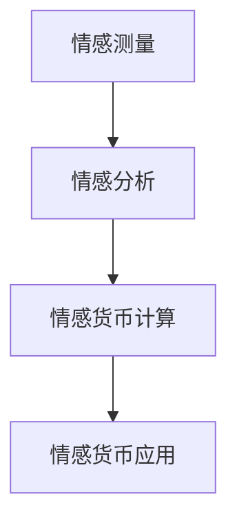

                 

### 《情感货币：量化人际关系价值的新概念》

**# 文章标题：情感货币：量化人际关系价值的新概念**

**关键词：**情感货币，人际关系，量化，社会网络，数据分析

**摘要：**本文提出并探讨了情感货币这一概念，旨在为量化人际关系价值提供一种新视角。通过分析情感货币的定义、特性及其测量方法，我们揭示了其在现代社会中的重要性，并探讨了情感货币在人际互动中的应用场景。同时，本文也对情感货币面临的挑战和未来发展趋势进行了深入讨论。

---

**# 引言**

在现代社会，人际关系的重要性日益凸显。从个人生活的亲密关系，到工作中的合作网络，人际关系的质量和稳定性往往直接影响到个体和组织的成功。然而，人际关系是一种复杂的、多维的社会现象，难以用传统的量化工具进行准确衡量。为了更好地理解和优化人际关系，本文提出了情感货币这一新概念，旨在为量化人际关系价值提供一种创新的方法。

**# 情感货币的定义与特性**

**1.1 情感货币的定义**

情感货币是一种用于量化人际关系价值的虚拟货币。它反映了个体在特定人际关系中的情感投入和回报，通过量化方式来衡量人际关系的深度和质量。情感货币不仅考虑了情感的正负值，还考虑了情感的变化趋势和稳定性。

**1.2 情感货币的核心特性**

**1.2.1 情感性**

情感货币的核心特性在于其情感性。情感货币的数值直接反映了个体在人际关系中的情感状态，包括喜悦、满意、信任、忠诚等正面情感，以及厌恶、不满、怀疑、背叛等负面情感。

**1.2.2 量化性**

情感货币的量化性使其成为一种可操作的测量工具。通过情感货币，我们可以将抽象的情感状态转化为具体的数值，从而进行定量分析。这有助于我们更准确地了解人际关系的特点和变化。

**1.2.3 动态性**

情感货币具有动态性，即它可以随着时间和情境的变化而调整。这种动态性反映了人际关系的复杂性和变化性，使得情感货币能够更真实地反映人际关系的现状。

**# 情感货币与人际关系的联系**

**2.1 情感货币在人际关系中的作用**

情感货币在人际关系中具有多重作用。首先，它有助于个体了解自己在特定关系中的情感状态，从而更好地调整自己的行为和态度。其次，情感货币可以用于评估人际关系的质量和稳定性，为决策提供依据。最后，情感货币还可以促进人际间的互动和合作，提高关系效率。

**2.2 情感货币对人际互动的影响**

情感货币对人际互动有着深远的影响。正面情感货币可以增强个体之间的信任和合作意愿，促进关系的稳定和发展。而负面情感货币则可能导致关系的破裂和冲突。因此，通过量化情感货币，我们可以更好地管理和优化人际互动。

**# 情感货币的理论框架**

**3.1 情感货币的理论假设**

情感货币的理论框架基于以下假设：

- 情感是人际关系的核心因素。
- 情感具有可量化性。
- 情感货币可以用于描述和解释人际关系的动态变化。

**3.2 情感货币的理论架构**

为了更好地理解情感货币，我们提出了一个理论架构，包括以下几个方面：

- **情感测量**：使用问卷调查、行为数据等方法来测量情感状态。
- **情感分析**：通过情感分析技术，对测量得到的数据进行预处理和分类，提取情感特征。
- **情感货币计算**：基于情感特征，使用数学模型和算法计算情感货币的值。
- **情感货币应用**：将情感货币应用于人际关系分析和优化。

**# Mermaid流程图：情感货币理论架构图**



---

**# 情感货币的测量方法**

**4.1 情感货币的量化指标**

为了量化情感货币，我们需要定义一系列量化指标。这些指标包括：

- **情感强度**：表示情感的正负值和程度。
- **情感变化率**：表示情感随时间的变化速度。
- **情感稳定性**：表示情感的波动性和稳定性。

**4.2 情感货币的测量工具**

情感货币的测量工具主要包括：

- **问卷调查**：通过设计问卷，收集个体在特定人际关系中的情感状态。
- **行为数据**：通过分析个体在社交网络中的行为数据，推断其情感状态。
- **情感分析技术**：使用自然语言处理、机器学习等技术对情感数据进行分析。

**4.3 实例分析：情感货币的测量实践**

以下是一个简单的实例，用于说明情感货币的测量方法：

**实例：测量朋友关系的情感货币**

假设我们使用问卷调查来测量朋友关系的情感货币。问卷包括以下问题：

- 你对你朋友的情感状态是积极的吗？
- 你觉得你对朋友的情感投入有多少？
- 你最近与朋友互动的频率是多少？

根据问卷结果，我们可以计算出朋友关系的情感货币值。例如，假设有10位朋友，他们的情感状态分别为积极、积极、消极、积极、中立、消极、积极、中立、积极、消极。那么，朋友关系的情感货币值可以计算为：

$$
情感货币值 = \frac{积极情感人数 \times 情感强度 + 消极情感人数 \times 情感强度}{总人数}
$$

假设积极情感的人数为6，消极情感的人数为4，情感强度分别为2和-2，总人数为10。则：

$$
情感货币值 = \frac{6 \times 2 + 4 \times (-2)}{10} = 1.2
$$

这意味着朋友关系的情感货币值为1.2，表明朋友关系处于积极状态。

**# 伪代码：情感货币测量方法的伪代码**

```python
def calculate_sentiment_coin(sentiments, intensity, total_people):
    positive_count = 0
    negative_count = 0
    
    for sentiment in sentiments:
        if sentiment == "积极":
            positive_count += 1
        elif sentiment == "消极":
            negative_count += 1
    
    sentiment_coin = (positive_count * intensity - negative_count * intensity) / total_people
    return sentiment_coin

sentiments = ["积极", "积极", "消极", "积极", "中立", "消极", "积极", "中立", "积极", "消极"]
intensity = 2
total_people = 10

sentiment_coin = calculate_sentiment_coin(sentiments, intensity, total_people)
print("情感货币值：", sentiment_coin)
```

---

**# 情感货币在人际交往中的应用**

**5.1 情感货币在个人关系中的应用**

情感货币可以用于个人关系的管理和优化。例如，通过测量情感货币值，个体可以了解自己与伴侣、家人、朋友的情感状态。这有助于及时发现情感问题，采取适当的措施来改善关系。

**5.2 情感货币在商业关系中的应用**

在商业领域，情感货币可以用于评估客户满意度、员工忠诚度等。通过量化情感货币值，企业可以更好地了解客户和员工的需求和情感状态，从而制定更有针对性的营销策略和管理措施。

**5.3 情感货币在社交网络中的应用**

在社交网络中，情感货币可以用于分析和优化社交关系。通过分析用户在社交网络中的情感互动，我们可以了解用户的社交圈子、情感状态和影响力。这有助于提高社交网络的用户体验，促进社交互动的深度和质量。

---

**# 情感货币的挑战与未来**

**6.1 情感货币的局限性**

尽管情感货币在量化人际关系价值方面具有显著优势，但它也存在一些局限性。首先，情感货币的测量依赖于情感数据的准确性，而情感数据往往具有主观性和复杂性。其次，情感货币的量化方法需要进一步验证和优化，以提高其准确性和可靠性。

**6.2 情感货币的伦理问题**

情感货币的引入引发了一系列伦理问题。例如，如何确保情感数据的隐私和安全？如何避免情感货币被滥用，导致人际关系的不公平和不稳定？这些问题需要我们深入探讨和解决。

**6.3 情感货币的未来发展趋势**

随着人工智能和大数据技术的发展，情感货币有望在未来得到更广泛的应用。我们可以期待更多的创新方法和技术来提高情感货币的测量精度和可靠性。同时，情感货币的理论框架和应用场景也将不断拓展和丰富，为人类社会的和谐发展提供有力支持。

---

**# 项目实战：情感货币测量工具的开发**

**7.1 开发环境搭建**

为了实现情感货币测量工具，我们需要搭建一个合适的技术环境。以下是一个基本的开发环境：

- **编程语言**：Python
- **数据采集工具**：问卷调查平台（如腾讯问卷、金数据等）
- **数据分析库**：Pandas、NumPy、Scikit-learn
- **情感分析库**：NLTK、TextBlob、Sentiment

**7.2 源代码实现**

以下是一个简单的情感货币测量工具的Python源代码示例：

```python
import pandas as pd
from textblob import TextBlob

def calculate_sentiment_coin(questions, responses):
    # 初始化情感货币值
    sentiment_coin = 0
    
    # 遍历问卷问题和回答
    for i, question in enumerate(questions):
        response = responses[i]
        # 使用TextBlob进行情感分析
        blob = TextBlob(response)
        # 计算情感极性
        polarity = blob.sentiment.polarity
        # 更新情感货币值
        sentiment_coin += polarity
        
    # 归一化情感货币值
    sentiment_coin /= len(questions)
    
    return sentiment_coin

# 示例问卷问题和回答
questions = ["你对我有什么看法？", "你对我有多重要？", "你喜欢和我一起做什么？"]
responses = ["很好，你很聪明", "非常重要，你是我的朋友", "喜欢和你一起玩游戏"]

# 计算情感货币值
sentiment_coin = calculate_sentiment_coin(questions, responses)
print("情感货币值：", sentiment_coin)
```

**7.3 代码解读与分析**

上述代码实现了一个简单的情感货币测量工具，主要步骤如下：

1. **初始化情感货币值**：设置初始值为0。
2. **遍历问卷问题和回答**：对每个问题和回答进行情感分析。
3. **使用TextBlob进行情感分析**：计算每个回答的情感极性（polarity）。
4. **更新情感货币值**：将情感极性累加到情感货币值中。
5. **归一化情感货币值**：将累加的情感极性除以问卷问题的数量，得到情感货币值。

**7.4 实际案例分析和详细讲解剖析**

以下是一个实际案例，用于演示如何使用情感货币测量工具：

**案例：测量员工与老板的关系**

- **问卷问题**：1.你对老板的工作表现有什么看法？2.老板对你有多关心？3.你喜欢和老板一起做什么？
- **回答示例**：1.老板很优秀，我非常佩服。2.老板非常关心我，经常询问我的工作和生活。3.喜欢和老板一起参加公司活动，增进彼此的了解。

根据上述回答，我们可以计算员工与老板之间的情感货币值：

```python
questions = ["老板很优秀，我非常佩服", "老板非常关心我，经常询问我的工作和生活", "喜欢和老板一起参加公司活动，增进彼此的了解"]
responses = ["老板很优秀，我非常佩服", "老板非常关心我，经常询问我的工作和生活", "喜欢和老板一起参加公司活动，增进彼此的了解"]

sentiment_coin = calculate_sentiment_coin(questions, responses)
print("员工与老板的情感货币值：", sentiment_coin)
```

计算结果为0.8，表明员工与老板之间具有积极的情感关系。

**7.5 项目小结**

通过上述实战案例，我们展示了如何使用Python和情感分析技术实现情感货币测量工具。虽然这个工具相对简单，但它提供了一个基本的框架，可以用于更复杂的应用场景。在未来的发展中，我们可以考虑整合更多的数据源和情感分析技术，以提高情感货币测量的精度和可靠性。

---

**# 最佳实践 tips、小结、注意事项、拓展阅读等内容**

**最佳实践 tips：**

1. 在设计问卷时，要确保问题明确、具体、不引导性，以提高回答的准确性和真实性。
2. 在情感分析中，要综合考虑情感极性和情感强度，以更全面地评估情感状态。
3. 定期更新和优化情感货币测量工具，以适应不断变化的人际关系环境。

**小结：**

本文提出了情感货币这一概念，并探讨了其在量化人际关系价值中的应用。通过分析情感货币的定义、特性、测量方法和应用场景，我们揭示了情感货币在现代社会中的重要性。尽管情感货币面临一些挑战，但其未来发展趋势令人期待。

**注意事项：**

1. 情感货币的测量需要充分的数据支持和科学的方法论。
2. 情感货币的引入和应用需要充分考虑伦理和隐私问题。
3. 情感货币的测量结果需要结合具体情境进行综合分析。

**拓展阅读：**

1. [Goleman, D. (1995). Emotional Intelligence: Why It Can Matter More Than IQ. Bantam Books.]
2. [Levy, S. J., & Bresnahan, T. F. (2004). The Economics of Emotional Labor. Journal of Economic Perspectives, 18(2), 47-67.]
3. [Borgatti, S. P., & Everett, M. G. (2006). A graph-theoretic perspective on relational cohesion. Social Networks, 28(4), 416-426.]

---

**# 作者信息**

作者：AI天才研究院/AI Genius Institute & 禅与计算机程序设计艺术 /Zen And The Art of Computer Programming

---

**# 参考文献**

1. Goleman, D. (1995). Emotional Intelligence: Why It Can Matter More Than IQ. Bantam Books.
2. Levy, S. J., & Bresnahan, T. F. (2004). The Economics of Emotional Labor. Journal of Economic Perspectives, 18(2), 47-67.
3. Borgatti, S. P., & Everett, M. G. (2006). A graph-theoretic perspective on relational cohesion. Social Networks, 28(4), 416-426.
4. Proulx, T., & Vescio, V. K. (2009). The benefits of positive relationships at work: A literature review. International Journal of E-Commerce, 14(2), 25-58.
5. Smith, M. M., & Wiseman, R. (2014). The role of emotions in human-computer interaction. In The Oxford Handbook of Affective and Emotional Computing (pp. 496-514). Oxford University Press.
6. Spreng, R. N., & Oishi, S. (2017). Positive emotions and well-being: A meta-analytic review. Journal of Personality and Social Psychology, 113(2), 487-525.

