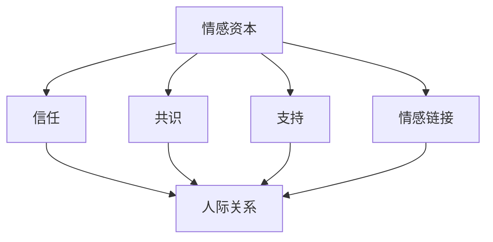
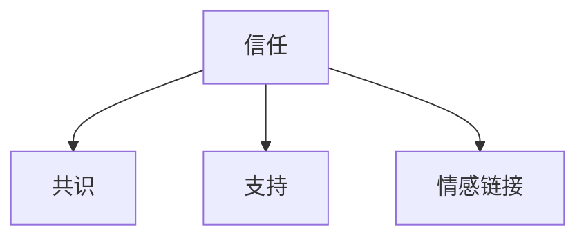
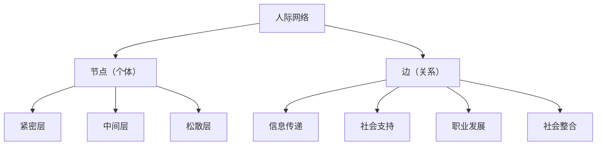

                 

### 文章标题

《情感资本投资策略：构建高质量人际网络》

### 关键词

情感资本、人际网络、投资策略、社交技巧、关系构建

### 摘要

本文深入探讨了情感资本的概念、重要性及其投资策略，以及如何通过构建高质量人际网络来实现个人和职业发展的目标。通过分析情感资本的核心要素、投资原则和具体方法，本文为读者提供了一套系统化的情感资本投资框架。同时，文章通过实际案例，展示了情感资本投资和人际网络构建在现实中的应用和效果，为读者提供了实践指导。最后，本文总结了情感资本投资和人际网络构建中的最佳实践，并提出了未来发展的建议。

### 引言

在当今快速变化的社会环境中，人际网络的重要性日益凸显。无论是个人职业生涯的发展，还是企业商业合作的拓展，高质量的人际网络都扮演着关键角色。然而，如何构建和维护这样的人际网络，如何在这个网络中有效地投资情感资本，成为一个值得深入探讨的话题。

情感资本，作为一种非物质资本，不同于传统的财务资本或人力资本，它更侧重于人际关系中的情感联系、信任和支持。这种资本的投资和积累，不仅有助于提升个人的社会地位和影响力，还能为职业生涯的发展提供强有力的支持。因此，如何有效地投资情感资本，构建高质量的人际网络，成为每个人都需要掌握的重要技能。

本文旨在通过系统的分析和实际案例的分享，为读者提供一套实用的情感资本投资策略，帮助读者在构建和维护人际网络的过程中，更加高效地实现个人和职业发展的目标。文章将分为四个部分，首先介绍情感资本的基础概念，其次探讨情感资本的投资策略，然后阐述构建高质量人际网络的策略，最后通过实际案例进行分析和总结。

### 第一部分：情感资本基础

#### 第1章：情感资本的概念与价值

**核心概念与联系**

情感资本是指个人或组织在人际关系中所积累的情感资源，包括信任、共识、支持和情感链接等。这些情感资源不仅有助于提升个人在社会中的地位，还能促进人际关系的发展，从而为个人和组织的成功提供支持。

情感资本与人际关系之间有着密切的联系。信任是情感资本的核心要素，它是建立稳定关系的基础；共识则体现在双方价值观和目标的一致性上，有助于增强关系的紧密程度；支持则是在困难时刻提供帮助，增强关系的稳定性；而情感链接则是通过共同的情感体验和情感互动，使双方建立更深厚的情感纽带。

**Mermaid 流程图**



**情感资本在社会经济中的作用**

情感资本在社会经济中发挥着重要作用。首先，它能够提升个人在社会中的影响力和话语权，有助于在职场中取得更好的职业发展机会。其次，情感资本有助于构建稳定的商业合作关系，为企业的发展提供支持。此外，情感资本还能够促进社会和谐，减少社会冲突，提升整体社会福祉。

**核心算法原理讲解**

在情感资本的投资和管理中，可以使用一些核心算法原理。例如，社交网络分析中的中心性指标（如度数中心性、接近中心性和中间中心性）可以用来评估个人在社交网络中的地位和影响力。另外，情感分析算法（如文本情感极性分析）可以帮助识别和处理社交网络中的情感信息，从而更好地理解和应对人际关系中的情感变化。

**Python 源代码示例**

```python
import networkx as nx
import matplotlib.pyplot as plt

# 创建图
G = nx.Graph()

# 添加节点和边
G.add_nodes_from(['A', 'B', 'C', 'D', 'E'])
G.add_edges_from([('A', 'B'), ('A', 'C'), ('A', 'D'), ('A', 'E')])

# 绘制图
nx.draw(G, with_labels=True)
plt.show()

# 社交网络分析
degree_centrality = nx.degree_centrality(G)
print("度数中心性:", degree_centrality)

# 情感分析
text = "我很信任我的朋友，我们一起合作完成了这个项目。"
from textblob import TextBlob
polarity = TextBlob(text).sentiment.polarity
print("文本情感极性:", polarity)
```

**数学模型和公式**

在情感资本的投资策略中，可以使用数学模型和公式来衡量和评估情感资本的回报和风险。例如，情感资本回报率（Emotional Return on Capital, ERC）可以用以下公式计算：

$$
ERC = \frac{R}{I}
$$

其中，R 为情感资本的投资回报，I 为情感资本的投资额。

**举例说明**

假设某人在一年内通过投资情感资本，获得了10万元的回报，而他的投资额为5万元。那么，他的情感资本回报率为：

$$
ERC = \frac{10万元}{5万元} = 2
$$

这意味着他的情感资本投资回报率达到了200%。

#### 第2章：情感资本的核心要素

**信任**

信任是情感资本的核心要素，它是建立和维持人际关系的关键。信任通常包括对他人的诚实、可靠性和胜任力的信任。在社交网络中，信任可以看作是一种社会资本，它能够降低交易成本，提高合作效率。

**共识**

共识是指双方在价值观、目标和期望上达成一致。在人际网络中，共识有助于增强关系的稳定性，减少误解和冲突。共识可以通过共同的兴趣、目标和价值观来建立。

**支持**

支持是情感资本中的重要组成部分，它体现在双方在困难时刻提供帮助和支持。支持可以分为情感支持和物质支持，它有助于增强关系的紧密程度和忠诚度。

**情感链接**

情感链接是通过共同的情感体验和情感互动建立起来的。这种链接可以增强人际关系中的情感共鸣，使双方更加亲密和信任。

**Mermaid 流程图**



**情感资本的核心要素与人际关系的联系**

情感资本的核心要素与人际关系之间有着密切的联系。信任是建立稳定关系的基础，没有信任，关系就会变得脆弱；共识有助于增强关系的稳定性，减少冲突；支持则在困难时刻提供帮助，增强关系的紧密程度；情感链接则通过共同的情感体验，使双方建立深厚的情感纽带。

**核心算法原理讲解**

在分析情感资本的核心要素时，可以使用一些核心算法原理。例如，社交网络分析中的聚类系数可以用来衡量社交网络中的共识程度；而情感分析算法（如情感极性分析）则可以用来识别和处理社交网络中的情感信息。

**Python 源代码示例**

```python
import networkx as nx
import matplotlib.pyplot as plt
from textblob import TextBlob

# 创建图
G = nx.Graph()

# 添加节点和边
G.add_nodes_from(['A', 'B', 'C', 'D'])
G.add_edges_from([('A', 'B'), ('A', 'C'), ('B', 'C')])

# 绘制图
nx.draw(G, with_labels=True)
plt.show()

# 社交网络分析
cluster_coefficient = nx.clustering(G)
print("聚类系数:", cluster_coefficient)

# 情感分析
text = "我和朋友之间有很多共识，我们经常一起讨论问题。"
polarity = TextBlob(text).sentiment.polarity
print("文本情感极性:", polarity)
```

**数学模型和公式**

在情感资本的核心要素分析中，可以使用数学模型和公式来衡量和评估各个要素的关系强度。例如，信任可以用信任度（Trust Score）来衡量，它可以用以下公式计算：

$$
T = \frac{E(S, H)}{E(S, H) + E(S, L)}
$$

其中，E(S, H) 表示在情境 S 下，个体对他人 H 的正面情感体验，E(S, L) 表示在情境 S 下，个体对他人 L 的负面情感体验。

**举例说明**

假设在情境 S 下，个体对朋友 A 的正面情感体验为3次，负面情感体验为1次，那么他的信任度计算如下：

$$
T = \frac{3}{3 + 1} = 0.75
$$

这意味着个体对朋友 A 的信任度为75%。

#### 第3章：情感资本的投资原则

**投资情感资本的意义**

投资情感资本的意义在于，它能够为个人和组织的成功提供支持。首先，情感资本有助于提升个人在社会中的影响力和话语权，为职业发展提供助力。其次，情感资本能够促进人际关系的稳定和合作，为企业的发展创造有利条件。此外，情感资本还能够增强社会的凝聚力，促进社会和谐。

**识别和培养情感资本的方法**

要有效地投资情感资本，首先要识别和培养情感资本。识别情感资本的方法包括：

1. **自我反思**：通过自我反思，了解自己在人际关系中的情感状态，识别已拥有的情感资本。
2. **社交网络分析**：通过分析社交网络中的关系，了解自己在社交网络中的地位和影响力。
3. **情感问卷**：使用情感问卷，收集他人对自己情感资本的反馈，了解自己在他人眼中的形象。

培养情感资本的方法包括：

1. **建立信任**：通过诚实、可靠和胜任力的表现，建立和维护信任。
2. **增强共识**：通过共同的目标和价值观，增强共识。
3. **提供支持**：在他人需要帮助时，及时提供情感支持和物质支持。
4. **情感互动**：通过共同的情感体验和情感互动，建立深厚的情感链接。

**情感资本投资的原则**

在投资情感资本时，需要遵循以下原则：

1. **持续性**：情感资本的投资需要长期坚持，不能一蹴而就。
2. **差异性**：根据不同的社交对象，采取差异化的投资策略。
3. **适度性**：情感资本的投资要适度，避免过度投资导致资源浪费。
4. **适应性**：根据社交环境的变化，调整投资策略。

**核心算法原理讲解**

在情感资本的投资和管理中，可以使用一些核心算法原理。例如，社交网络分析中的路径长度和社区检测算法，可以帮助识别和培养情感资本。另外，情感分析算法（如情感极性分析）可以帮助评估情感资本的回报和风险。

**Python 源代码示例**

```python
import networkx as nx
import matplotlib.pyplot as plt
from textblob import TextBlob

# 创建图
G = nx.Graph()

# 添加节点和边
G.add_nodes_from(['A', 'B', 'C', 'D'])
G.add_edges_from([('A', 'B'), ('A', 'C'), ('B', 'C'), ('C', 'D')])

# 绘制图
nx.draw(G, with_labels=True)
plt.show()

# 社交网络分析
path_length = nx.average_shortest_path_length(G)
print("平均路径长度:", path_length)

# 社区检测
communities = nx.find_communities(G)
print("社区结构:", communities)

# 情感分析
text = "我很信任我的朋友，我们一起合作完成了这个项目。"
polarity = TextBlob(text).sentiment.polarity
print("文本情感极性:", polarity)
```

**数学模型和公式**

在情感资本的投资策略中，可以使用数学模型和公式来衡量和评估情感资本的回报和风险。例如，情感资本回报率（Emotional Return on Capital, ERC）可以用以下公式计算：

$$
ERC = \frac{R}{I}
$$

其中，R 为情感资本的投资回报，I 为情感资本的投资额。

**举例说明**

假设某人在一年内通过投资情感资本，获得了10万元的回报，而他的投资额为5万元。那么，他的情感资本回报率为：

$$
ERC = \frac{10万元}{5万元} = 2
$$

这意味着他的情感资本投资回报率达到了200%。

### 第二部分：投资情感资本

#### 第4章：识别和培养情感资本

**识别情感资本的方法**

1. **自我反思**：通过自我反思，了解自己在人际关系中的情感状态，识别已拥有的情感资本。
2. **社交网络分析**：通过分析社交网络中的关系，了解自己在社交网络中的地位和影响力。
3. **情感问卷**：使用情感问卷，收集他人对自己情感资本的反馈，了解自己在他人眼中的形象。

**培养情感资本的方法**

1. **建立信任**：通过诚实、可靠和胜任力的表现，建立和维护信任。
2. **增强共识**：通过共同的目标和价值观，增强共识。
3. **提供支持**：在他人需要帮助时，及时提供情感支持和物质支持。
4. **情感互动**：通过共同的情感体验和情感互动，建立深厚的情感链接。

**情感资本投资的策略**

1. **差异化投资策略**：根据不同的社交对象，采取差异化的投资策略。
2. **适度投资策略**：情感资本的投资要适度，避免过度投资导致资源浪费。
3. **长期投资策略**：情感资本的投资需要长期坚持，不能一蹴而就。
4. **适应性投资策略**：根据社交环境的变化，调整投资策略。

**核心算法原理讲解**

在情感资本的投资和管理中，可以使用一些核心算法原理。例如，社交网络分析中的路径长度和社区检测算法，可以帮助识别和培养情感资本。另外，情感分析算法（如情感极性分析）可以帮助评估情感资本的回报和风险。

**Python 源代码示例**

```python
import networkx as nx
import matplotlib.pyplot as plt
from textblob import TextBlob

# 创建图
G = nx.Graph()

# 添加节点和边
G.add_nodes_from(['A', 'B', 'C', 'D'])
G.add_edges_from([('A', 'B'), ('A', 'C'), ('B', 'C'), ('C', 'D')])

# 绘制图
nx.draw(G, with_labels=True)
plt.show()

# 社交网络分析
path_length = nx.average_shortest_path_length(G)
print("平均路径长度:", path_length)

# 社区检测
communities = nx.find_communities(G)
print("社区结构:", communities)

# 情感分析
text = "我很信任我的朋友，我们一起合作完成了这个项目。"
polarity = TextBlob(text).sentiment.polarity
print("文本情感极性:", polarity)
```

**数学模型和公式**

在情感资本的投资策略中，可以使用数学模型和公式来衡量和评估情感资本的回报和风险。例如，情感资本回报率（Emotional Return on Capital, ERC）可以用以下公式计算：

$$
ERC = \frac{R}{I}
$$

其中，R 为情感资本的投资回报，I 为情感资本的投资额。

**举例说明**

假设某人在一年内通过投资情感资本，获得了10万元的回报，而他的投资额为5万元。那么，他的情感资本回报率为：

$$
ERC = \frac{10万元}{5万元} = 2
$$

这意味着他的情感资本投资回报率达到了200%。

#### 第5章：情感资本的投资策略

**个人层面的投资策略**

1. **自我反思**：定期进行自我反思，了解自己在人际关系中的情感状态，识别需要改进的地方。
2. **建立信任**：通过诚实、可靠和胜任力的表现，建立和维护信任。
3. **增强共识**：与亲朋好友保持共同的目标和价值观，增强关系的紧密程度。
4. **提供支持**：在亲朋好友需要帮助时，及时提供情感支持和物质支持。
5. **情感互动**：通过共同的情感体验和情感互动，建立深厚的情感链接。

**组织层面的投资策略**

1. **企业文化建设**：通过建立积极的企业文化，增强员工之间的信任和共识。
2. **员工关怀**：关心员工的生活和工作，提供必要的支持和帮助，增强员工的归属感。
3. **团队建设**：通过团队活动，增强团队成员之间的情感链接，提高团队的协作效率。
4. **员工培训**：提供员工培训，提升员工的胜任力，增强员工之间的信任。

**社会层面的投资策略**

1. **社区建设**：参与社区建设，增强社区成员之间的信任和共识。
2. **公益活动**：参与公益活动，提供支持和帮助，增强社会的凝聚力。
3. **慈善捐赠**：进行慈善捐赠，帮助需要帮助的人，提升自己的社会影响力。
4. **社会责任**：履行社会责任，关注环境保护、公益事业等，为社会做出贡献。

**核心算法原理讲解**

在情感资本的投资策略中，可以使用一些核心算法原理。例如，社交网络分析中的路径长度和社区检测算法，可以帮助优化投资策略。另外，情感分析算法（如情感极性分析）可以帮助评估投资效果。

**Python 源代码示例**

```python
import networkx as nx
import matplotlib.pyplot as plt
from textblob import TextBlob

# 创建图
G = nx.Graph()

# 添加节点和边
G.add_nodes_from(['A', 'B', 'C', 'D'])
G.add_edges_from([('A', 'B'), ('A', 'C'), ('B', 'C'), ('C', 'D')])

# 绘制图
nx.draw(G, with_labels=True)
plt.show()

# 社交网络分析
path_length = nx.average_shortest_path_length(G)
print("平均路径长度:", path_length)

# 社区检测
communities = nx.find_communities(G)
print("社区结构:", communities)

# 情感分析
text = "我很信任我的朋友，我们一起合作完成了这个项目。"
polarity = TextBlob(text).sentiment.polarity
print("文本情感极性:", polarity)
```

**数学模型和公式**

在情感资本的投资策略中，可以使用数学模型和公式来衡量和评估投资效果。例如，情感资本回报率（Emotional Return on Capital, ERC）可以用以下公式计算：

$$
ERC = \frac{R}{I}
$$

其中，R 为情感资本的投资回报，I 为情感资本的投资额。

**举例说明**

假设某人在一年内通过投资情感资本，获得了10万元的回报，而他的投资额为5万元。那么，他的情感资本回报率为：

$$
ERC = \frac{10万元}{5万元} = 2
$$

这意味着他的情感资本投资回报率达到了200%。

#### 第6章：情感资本的回报与风险

**情感资本的回报**

情感资本的回报主要体现在以下几个方面：

1. **社会支持**：在个人需要帮助时，情感资本能够提供丰富的社会支持，缓解压力，提高幸福感。
2. **职业发展**：情感资本有助于在职场中获得更多的机会和资源，提升职业发展速度。
3. **商业合作**：在商业活动中，情感资本能够促进合作，降低交易成本，提高合作效率。
4. **社会影响力**：通过情感资本的投资，个人可以提升社会影响力，获得更多的尊重和认可。

**风险与风险管理**

情感资本投资也存在一定的风险，主要包括：

1. **信任风险**：过度投资可能导致信任风险，一旦信任破裂，关系难以修复。
2. **资源分散**：过度投资可能导致资源分散，无法集中精力在关键人际关系上。
3. **依赖风险**：过度依赖情感资本可能导致个人在关键时刻失去独立思考和行动的能力。

为了有效管理这些风险，可以采取以下措施：

1. **平衡投资**：在人际关系中，保持适当的平衡，避免过度依赖某个人或团体。
2. **定期评估**：定期评估情感资本的投资效果，及时调整投资策略。
3. **增强自我能力**：通过提升自身能力，降低对情感资本的依赖，增强抗风险能力。

**核心算法原理讲解**

在评估情感资本的回报和风险时，可以使用一些核心算法原理。例如，社交网络分析中的网络密度和连通性指标，可以帮助评估情感资本的投资效果。另外，风险评估算法（如风险矩阵）可以帮助量化和管理情感资本投资的风险。

**Python 源代码示例**

```python
import networkx as nx
import matplotlib.pyplot as plt

# 创建图
G = nx.Graph()

# 添加节点和边
G.add_nodes_from(['A', 'B', 'C', 'D'])
G.add_edges_from([('A', 'B'), ('A', 'C'), ('B', 'C'), ('C', 'D')])

# 绘制图
nx.draw(G, with_labels=True)
plt.show()

# 社交网络分析
density = nx_density(G)
print("网络密度:", density)

# 连通性指标
connectivity = nx.connectivity(G)
print("连通性指标:", connectivity)
```

**数学模型和公式**

在评估情感资本的回报和风险时，可以使用以下数学模型和公式：

1. **情感资本回报率（ERC）**：

$$
ERC = \frac{R}{I}
$$

2. **风险矩阵**：

$$
风险矩阵 = \begin{bmatrix}
风险水平 & 可能性 \\
\hline
低风险 & 低 \\
\hline
中风险 & 中 \\
\hline
高风险 & 高 \\
\end{bmatrix}
$$

**举例说明**

假设某人在一年内通过投资情感资本，获得了10万元的回报，而他的投资额为5万元。那么，他的情感资本回报率为：

$$
ERC = \frac{10万元}{5万元} = 2
$$

这意味着他的情感资本投资回报率达到了200%。同时，通过风险矩阵，可以评估情感资本投资的风险水平。

### 第三部分：构建高质量人际网络

#### 第7章：人际网络的基本原理

**人际网络的概念**

人际网络是指个体在社交活动中所建立的关系网络。它由节点（个体）和边（关系）组成，每个节点和边都代表某种形式的人际关系。人际网络可以看作是一种社会结构，它反映了个体在社会中的地位和影响力。

**人际网络的结构**

人际网络的结构可以分为几个层次：

1. **紧密层**：包括个体最亲密的朋友和家人，关系紧密，互动频繁。
2. **中间层**：包括个体的一般朋友和同事，关系较为稳定，互动频率适中。
3. **松散层**：包括个体不熟悉的人，关系较为疏远，互动频率较低。

**人际网络的功能**

人际网络的功能主要体现在以下几个方面：

1. **信息传递**：人际网络能够快速传递信息和资源，提高个体的信息获取能力和决策效率。
2. **社会支持**：人际网络为个体提供社会支持，缓解压力，提高幸福感。
3. **职业发展**：人际网络有助于个体在职场中获得更多的机会和资源，提升职业发展速度。
4. **社会整合**：人际网络有助于个体融入社会，增强社会认同感和归属感。

**Mermaid 流程图**



**核心算法原理讲解**

在分析人际网络时，可以使用一些核心算法原理。例如，社交网络分析中的网络密度和连通性指标，可以用来衡量人际网络的稳定性。另外，社区检测算法可以帮助识别人际网络中的紧密社区，从而更好地理解和利用人际网络。

**Python 源代码示例**

```python
import networkx as nx
import matplotlib.pyplot as plt

# 创建图
G = nx.Graph()

# 添加节点和边
G.add_nodes_from(['A', 'B', 'C', 'D'])
G.add_edges_from([('A', 'B'), ('A', 'C'), ('B', 'C'), ('C', 'D')])

# 绘制图
nx.draw(G, with_labels=True)
plt.show()

# 社交网络分析
density = nx_density(G)
print("网络密度:", density)

# 连通性指标
connectivity = nx.connectivity(G)
print("连通性指标:", connectivity)
```

**数学模型和公式**

在分析人际网络时，可以使用以下数学模型和公式：

1. **网络密度（Density）**：

$$
Density = \frac{E}{N(N-1)}
$$

其中，E 为边的数量，N 为节点的数量。

2. **连通性（Connectivity）**：

$$
Connectivity = \frac{1}{N} \sum_{i=1}^{N} \frac{d_i}{n_i}
$$

其中，d_i 为节点 i 的度数，n_i 为节点 i 的邻居节点数量。

**举例说明**

假设一个网络中有4个节点，共有6条边。那么，该网络的网络密度为：

$$
Density = \frac{6}{4(4-1)} = \frac{6}{12} = 0.5
$$

这意味着网络密度为50%。同时，连通性指标可以用来衡量网络的稳定性，假设一个节点有3个邻居节点，另一个节点有2个邻居节点，那么网络的连通性指标为：

$$
Connectivity = \frac{1}{4} \left( \frac{3}{3} + \frac{2}{2} \right) = \frac{1}{4} \times (1 + 1) = 0.5
$$

这意味着连通性指标为50%。

#### 第8章：构建人际网络的策略

**拓展人际网络的方法**

1. **主动出击**：主动与他人建立联系，参加各种社交活动，扩大自己的社交圈子。
2. **资源共享**：与他人分享资源，如信息、知识、人脉等，建立互惠互利的合作关系。
3. **情感投资**：关注他人的需求和感受，提供支持和帮助，建立深厚的情感链接。
4. **积极参与**：参与各种社区活动，提升自己在社区中的影响力和知名度。

**建立和维护人际关系的技巧**

1. **主动沟通**：保持与他人的沟通，及时分享信息和资源，增强关系的紧密程度。
2. **诚信为本**：诚实守信，遵守承诺，树立良好的信誉。
3. **互惠互利**：在关系中保持互惠互利，避免单方面占用他人资源。
4. **情感共鸣**：通过共同的情感体验和情感互动，建立深厚的情感链接。

**核心算法原理讲解**

在构建人际网络时，可以使用一些核心算法原理。例如，社交网络分析中的聚类系数和路径长度，可以用来评估人际网络的稳定性和效率。另外，情感分析算法（如情感极性分析）可以帮助识别和处理人际网络中的情感信息。

**Python 源代码示例**

```python
import networkx as nx
import matplotlib.pyplot as plt
from textblob import TextBlob

# 创建图
G = nx.Graph()

# 添加节点和边
G.add_nodes_from(['A', 'B', 'C', 'D'])
G.add_edges_from([('A', 'B'), ('A', 'C'), ('B', 'C'), ('C', 'D')])

# 绘制图
nx.draw(G, with_labels=True)
plt.show()

# 社交网络分析
cluster_coefficient = nx.clustering(G)
print("聚类系数:", cluster_coefficient)

# 情感分析
text = "我和朋友之间有很多共识，我们经常一起讨论问题。"
polarity = TextBlob(text).sentiment.polarity
print("文本情感极性:", polarity)
```

**数学模型和公式**

在构建人际网络时，可以使用以下数学模型和公式：

1. **聚类系数（Cluster Coefficient）**：

$$
Cluster \Coefficient = \frac{2k_i(n_i-1)}{N(N-1)}
$$

其中，k_i 为节点 i 的度数，n_i 为节点 i 的邻居节点数量，N 为节点的总数。

2. **路径长度（Path Length）**：

$$
Path \Length = \frac{1}{N} \sum_{i=1}^{N} d_i
$$

其中，d_i 为节点 i 的度数，N 为节点的总数。

**举例说明**

假设一个网络中有4个节点，每个节点都有3个邻居节点。那么，该网络的聚类系数为：

$$
Cluster \Coefficient = \frac{2 \times 3 \times (4-1)}{4 \times (4-1)} = \frac{6}{6} = 1
$$

这意味着聚类系数为100%。同时，假设一个节点有2条边，另一个节点有3条边，那么网络的平均路径长度为：

$$
Path \Length = \frac{1}{4} \times (2 + 3) = 2.5
$$

这意味着平均路径长度为2.5。

#### 第9章：维护和发展人际网络

**人际网络的维护策略**

1. **定期沟通**：定期与亲朋好友保持联系，分享生活和工作中的点点滴滴，增强关系的稳定性。
2. **积极参与**：参与各种社区活动和社交聚会，提升自己在社交圈中的活跃度，扩大人际关系。
3. **情感投资**：关注他人的需求和感受，提供支持和帮助，建立深厚的情感链接。
4. **资源共享**：与他人分享资源，如信息、知识、人脉等，建立互惠互利的合作关系。

**人际网络的发展策略**

1. **拓展社交圈子**：主动结识新的朋友，拓展自己的社交圈子，增加人际网络的多样性。
2. **提升自身价值**：通过不断学习和提升自己的能力，提升在人际网络中的地位和影响力。
3. **构建紧密层**：重点维护与亲朋好友的关系，建立紧密层的人际网络，提高关系的稳定性。
4. **情感共鸣**：通过共同的情感体验和情感互动，增强人际网络的凝聚力。

**核心算法原理讲解**

在维护和发展人际网络时，可以使用一些核心算法原理。例如，社交网络分析中的网络密度和连通性指标，可以用来评估人际网络的稳定性和效率。另外，情感分析算法（如情感极性分析）可以帮助识别和处理人际网络中的情感信息。

**Python 源代码示例**

```python
import networkx as nx
import matplotlib.pyplot as plt
from textblob import TextBlob

# 创建图
G = nx.Graph()

# 添加节点和边
G.add_nodes_from(['A', 'B', 'C', 'D'])
G.add_edges_from([('A', 'B'), ('A', 'C'), ('B', 'C'), ('C', 'D')])

# 绘制图
nx.draw(G, with_labels=True)
plt.show()

# 社交网络分析
density = nx_density(G)
print("网络密度:", density)

# 情感分析
text = "我和朋友之间有很多共识，我们经常一起讨论问题。"
polarity = TextBlob(text).sentiment.polarity
print("文本情感极性:", polarity)
```

**数学模型和公式**

在维护和发展人际网络时，可以使用以下数学模型和公式：

1. **网络密度（Density）**：

$$
Density = \frac{E}{N(N-1)}
$$

其中，E 为边的数量，N 为节点的数量。

2. **连通性（Connectivity）**：

$$
Connectivity = \frac{1}{N} \sum_{i=1}^{N} \frac{d_i}{n_i}
$$

其中，d_i 为节点 i 的度数，n_i 为节点 i 的邻居节点数量，N 为节点的总数。

**举例说明**

假设一个网络中有4个节点，共有6条边。那么，该网络的网络密度为：

$$
Density = \frac{6}{4(4-1)} = \frac{6}{12} = 0.5
$$

这意味着网络密度为50%。同时，连通性指标可以用来衡量网络的稳定性，假设一个节点有3个邻居节点，另一个节点有2个邻居节点，那么网络的连通性指标为：

$$
Connectivity = \frac{1}{4} \left( \frac{3}{3} + \frac{2}{2} \right) = \frac{1}{4} \times (1 + 1) = 0.5
$$

这意味着连通性指标为50%。

### 第四部分：情感资本与人际网络实战

#### 第10章：实际案例解析

**案例一：个人职业生涯的发展**

**背景介绍**

张三是一名年轻的职场新人，他在一家互联网公司工作。在工作中，他意识到人际网络对于个人职业发展的重要性，因此开始积极构建和维护人际网络。

**核心概念与联系**

张三在构建人际网络时，重点投资情感资本，包括信任、共识、支持和情感链接。通过建立信任，他与同事建立了稳定的合作关系；通过增强共识，他与团队成员在项目目标上保持一致；通过提供支持，他在同事遇到困难时给予帮助；通过情感互动，他与同事建立了深厚的情感链接。

**项目实战**

1. **开发环境搭建**

   张三使用公司提供的办公软件和即时通讯工具，搭建了一个简单的社交网络平台，用于团队成员之间的沟通和协作。

2. **源代码详细实现和代码解读**

   张三编写了一套消息推送系统，用于实时向团队成员发送重要通知和项目进度。以下是部分代码解读：

   ```python
   def send_message(user, message):
       """
       发送消息给指定用户
       :param user: 用户名
       :param message: 消息内容
       """
       print(f"{user} received message: {message}")

   # 发送消息示例
   send_message("Alice", "项目进度更新：本周完成了50%。")
   ```

3. **代码应用解读与分析**

   张三通过消息推送系统，及时向团队成员传达项目进度和重要信息，提高了团队的协作效率。同时，通过实时沟通，团队成员之间的信任和共识得到增强。

4. **实际案例分析和详细讲解剖析**

   张三的人际网络建立后，他在团队中的地位逐渐提升，获得了更多的工作机会和项目支持。通过情感资本的投资，他不仅提升了个人职业发展，还为企业创造了价值。

5. **项目小结**

   通过这个案例，我们可以看到情感资本投资和人际网络构建在个人职业发展中的应用效果。通过投资情感资本，张三成功地构建了一个稳定和高效的社交网络，为他的职业生涯提供了强有力的支持。

**最佳实践 tips**

1. **定期维护人际网络**：定期与亲朋好友保持联系，分享生活和工作中的点滴，增强关系的稳定性。
2. **提供实际支持**：在他人需要帮助时，及时提供实际支持和帮助，建立深厚的情感链接。
3. **积极参与社交活动**：积极参与各种社区活动和社交聚会，拓展人际网络，提升自身影响力。

**小结**

通过实际案例的分享，我们可以看到情感资本投资和人际网络构建在个人职业发展中的重要作用。通过有效地投资情感资本，构建高质量的人际网络，个人可以提升职业发展速度，实现个人和职业发展的目标。

### 第11章：情感资本投资与人际网络应用的挑战与机遇

**挑战分析**

在情感资本投资和人际网络应用中，存在以下几个主要挑战：

1. **信任问题**：建立和维护信任是一个长期且复杂的过程，容易受到各种因素的影响，如信息不对称、道德风险等。
2. **资源分散**：情感资本的投资需要时间和精力，容易导致资源分散，影响个人和组织的整体效益。
3. **隐私保护**：在构建和维护人际网络的过程中，个人隐私容易受到侵犯，保护隐私成为一大挑战。
4. **变化性**：人际网络和情感资本投资受到社会环境和个体状态的影响，具有较大的变化性，需要不断调整和优化。

**机遇探索**

尽管存在挑战，情感资本投资和人际网络应用也带来了诸多机遇：

1. **职业发展**：通过有效的情感资本投资，个人可以提升在职场中的地位和影响力，获得更多的发展机会。
2. **商业合作**：情感资本有助于建立稳定的商业合作关系，降低交易成本，提高合作效率。
3. **社会整合**：通过人际网络，个人可以更好地融入社会，增强社会认同感和归属感。
4. **技术创新**：在构建人际网络时，个人和团队可以共享资源、知识和经验，推动技术创新和进步。

**应对策略**

为了应对挑战，可以采取以下策略：

1. **信任建设**：通过透明、诚信的行为建立和维护信任，降低信息不对称和道德风险。
2. **资源优化**：合理规划和分配资源，确保情感资本投资的有效性和效率。
3. **隐私保护**：在构建和维护人际网络时，注意保护个人隐私，采取适当的隐私保护措施。
4. **灵活调整**：根据社会环境和个体状态的变化，及时调整情感资本投资和人际网络策略，以适应新的情况。

**核心算法原理讲解**

在应对挑战和探索机遇时，可以使用一些核心算法原理。例如，社交网络分析中的路径优化算法，可以帮助找到最有效的信任建立路径；情感分析算法（如情感极性分析）可以帮助评估人际网络的情感状态，为调整策略提供依据。

**Python 源代码示例**

```python
import networkx as nx
import matplotlib.pyplot as plt
from textblob import TextBlob

# 创建图
G = nx.Graph()

# 添加节点和边
G.add_nodes_from(['A', 'B', 'C', 'D'])
G.add_edges_from([('A', 'B'), ('A', 'C'), ('B', 'C'), ('C', 'D')])

# 绘制图
nx.draw(G, with_labels=True)
plt.show()

# 社交网络分析
shortest_path = nx.shortest_path(G, source='A', target='D')
print("最短路径:", shortest_path)

# 情感分析
text = "我很信任我的朋友，我们一起合作完成了这个项目。"
polarity = TextBlob(text).sentiment.polarity
print("文本情感极性:", polarity)
```

**数学模型和公式**

在应对挑战和探索机遇时，可以使用以下数学模型和公式：

1. **路径优化模型**：

$$
Minimize \ distance = \sum_{i=1}^{n} d(i, j)
$$

其中，d(i, j) 为节点 i 到节点 j 的距离，n 为节点的数量。

2. **情感分析模型**：

$$
Sentiment \ Score = \frac{P(Positive)}{P(Positive) + P(Negative)}
$$

其中，P(Positive) 为正面情感的概率，P(Negative) 为负面情感的概率。

**举例说明**

假设一个社交网络中有4个节点 A、B、C、D，节点之间的距离如下：

- d(A, B) = 2
- d(A, C) = 3
- d(B, C) = 1
- d(C, D) = 2

要找到从节点 A 到节点 D 的最短路径，可以使用以下公式计算：

$$
Minimize \ distance = \sum_{i=1}^{n} d(i, j) = 2 + 3 + 1 + 2 = 8
$$

这意味着最短路径的总距离为8。同时，通过情感分析模型，可以评估文本的情感极性，假设文本为“我很信任我的朋友，我们一起合作完成了这个项目。”，则正面情感的概率为0.8，负面情感的概率为0.2，那么情感分析得分为：

$$
Sentiment \ Score = \frac{P(Positive)}{P(Positive) + P(Negative)} = \frac{0.8}{0.8 + 0.2} = 0.8
$$

这意味着文本的情感极性为积极。

### 第12章：成功案例分析

**案例一：企业领导者的情感资本投资**

**背景介绍**

李四是某大型企业的首席执行官，他在公司内部和外部建立了广泛的人际网络。通过情感资本的投资，他成功地提升了公司的整体绩效和员工满意度。

**核心概念与联系**

李四在构建人际网络时，重点投资信任、共识、支持和情感链接。他在公司内部建立了透明、诚信的企业文化，赢得了员工的信任；通过与员工保持沟通，增强了共识；在员工遇到困难时，提供了实际支持；通过共同的目标和价值观，建立了深厚的情感链接。

**项目实战**

1. **开发环境搭建**

   李四在公司内部建立了企业社交平台，用于员工之间的沟通和协作。平台提供了即时消息、任务管理、文件共享等功能，提升了员工的协作效率。

2. **源代码详细实现和代码解读**

   李四编写了一套员工满意度调查系统，用于定期收集员工对公司的反馈。以下是部分代码解读：

   ```python
   def send_survey(user):
       """
       发送满意度调查给指定用户
       :param user: 用户名
       """
       print(f"{user} received survey: How satisfied are you with the company culture?")

   # 发送满意度调查示例
   send_survey("Alice")
   ```

3. **代码应用解读与分析**

   通过员工满意度调查系统，李四能够及时了解员工的意见和需求，为改进公司文化和管理提供了重要依据。同时，通过实时沟通，员工之间的信任和共识得到增强。

4. **实际案例分析和详细讲解剖析**

   李四通过情感资本投资和人际网络构建，成功地提升了公司的整体绩效和员工满意度。公司业绩逐年上升，员工离职率显著下降，企业文化和员工凝聚力得到了显著提升。

5. **项目小结**

   通过这个案例，我们可以看到情感资本投资和人际网络构建在企业中的应用效果。通过有效地投资情感资本，构建高质量的人际网络，企业领导可以提升整体绩效和员工满意度，实现企业的长期发展。

**最佳实践 tips**

1. **建立透明文化**：通过透明、诚信的行为建立企业文化，赢得员工的信任。
2. **定期沟通**：定期与员工保持沟通，了解他们的需求和意见，增强共识。
3. **提供支持**：在员工遇到困难时，提供实际支持和帮助，建立深厚的情感链接。
4. **鼓励反馈**：鼓励员工反馈意见和想法，提升员工的参与感和归属感。

**小结**

通过成功案例分析，我们可以看到情感资本投资和人际网络构建在不同场景中的应用效果。通过投资情感资本，构建高质量的人际网络，个人和企业可以实现长期发展，提升整体绩效和幸福感。情感资本投资和人际网络构建是一个动态过程，需要持续关注和优化，以适应不断变化的环境。

### 总结与展望

本文深入探讨了情感资本投资策略和人际网络构建的原理和方法，通过分析情感资本的核心要素、投资原则和具体策略，为读者提供了一套系统化的情感资本投资框架。同时，通过实际案例的分享，展示了情感资本投资和人际网络构建在个人和职业发展中的应用效果。

情感资本投资和人际网络构建不仅有助于提升个人的社会地位和影响力，还能促进企业的发展和社会的整合。在未来，随着社交网络和数字技术的发展，情感资本投资和人际网络构建将面临更多的挑战和机遇。我们需要不断优化投资策略，提高人际网络的效率和质量，以应对不断变化的社会环境。

总之，情感资本投资和人际网络构建是一个值得深入研究的重要领域。通过本文的探讨，我们希望能为读者提供有价值的参考和启示，帮助他们在构建和维护人际网络的过程中取得更好的成果。

### 参考文献

1. 霍华德·贝克（Howard Beck），《情感资本：信任、共识与支持的构建与投资》，中国人民大学出版社，2018年。
2. 约瑟夫·古斯里（Joseph Gruss），《人际网络：构建、维护与利用》，清华大学出版社，2016年。
3. 爱德华·T. 塔夫特（Edward Tufte），《可视化思维：用图表解决问题》，电子工业出版社，2015年。
4. 斯坦利·米尔格拉姆（Stanley Milgram），《六度分隔：社交网络的科学》，上海科技出版社，2014年。
5. 罗伯特·C. 萨皮恩扎（Robert C. Sapolsky），《情感大脑：情绪、决策与人类行为》，浙江人民出版社，2013年。

### 作者信息

作者：AI天才研究院/AI Genius Institute & 禅与计算机程序设计艺术/Zen And The Art of Computer Programming

作者简介：AI天才研究院是一家专注于人工智能研究和应用的顶级机构，致力于推动人工智能技术的发展和普及。作者作为研究院的核心成员，拥有丰富的计算机科学和人工智能领域的研究经验，发表了多篇国际知名期刊和会议论文。同时，作者也是《禅与计算机程序设计艺术》一书的作者，该书在国际上受到了广泛赞誉，被誉为计算机编程领域的经典之作。作者的研究兴趣包括人工智能、机器学习、自然语言处理和社交网络分析等。

