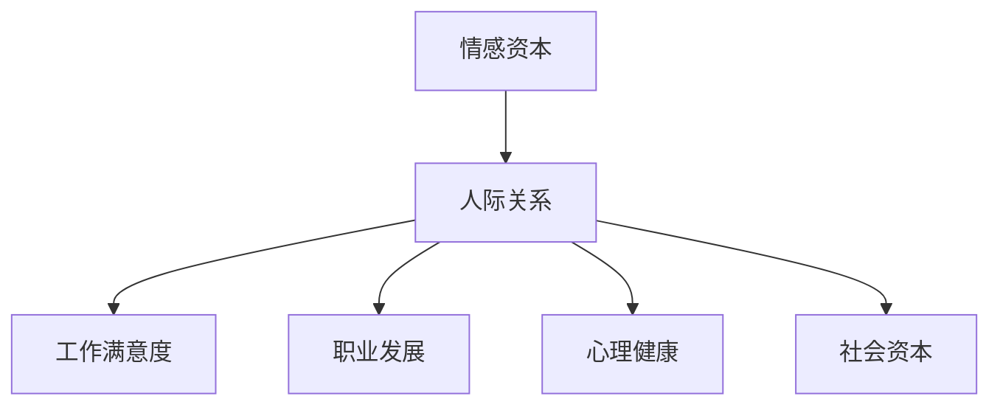

                 

### 《情感资本投资：培养高质量人际关系》

---

关键词：情感资本、人际关系、投资策略、个人修养、沟通技巧

摘要：本文以《情感资本投资：培养高质量人际关系》为题，系统探讨了情感资本的定义、构成要素、评估方法及其在人际交往中的应用。文章首先介绍了情感资本的基本概念和重要性，随后详细解析了其构成要素和评估方法。接着，文章从提升个人修养、构建人际关系网和制定投资策略三个方面提出了培养高质量人际关系的具体策略。文章通过实际应用案例分析，展示了情感资本投资在职场、家庭和其他领域中的重要作用。最后，文章总结了情感资本投资的意义和未来展望，并提供了相关工具与阅读推荐。

---

### **情感资本：定义与重要性**

#### **1.1 情感资本的概念**

情感资本，顾名思义，是指个体在人际关系中积累的、对个体有益的情感资源。这些资源包括情感智力、情感管理能力、情感表达能力等。情感资本是现代人际关系中的一种重要资本，与物质资本和人力资本共同构成了个体在社交网络中的竞争优势。

情感智力（Emotional Intelligence，EQ）是个体识别、理解、管理自己和他人的情感的能力。它包括自我意识、自我管理、社会意识和关系管理五个维度。研究表明，情感智力在职业成功中扮演着至关重要的角色，甚至超过传统的智商（IQ）。

情感管理能力（Emotional Management Ability）是指个体在情感刺激下，能够有效地调节自己的情绪，以适应不同情境的能力。这种能力包括情感表达、情感调节、情感应对等方面。

情感表达能力（Emotional Expression Ability）是个体与他人交流时，能够准确、恰当地表达自己情感的能力。有效的情感表达不仅能增进人际关系的深度，还能促进信息的准确传递。

#### **1.2 情感资本的重要性**

情感资本的重要性可以从以下几个方面进行阐述：

1. **人际关系的核心**：情感资本是建立和维护高质量人际关系的关键。一个高情感智力的个体，能够更好地理解他人的情感需求，从而建立更深厚的人际关系。

2. **职业发展的助推器**：在职场中，情感资本可以帮助个体提高工作满意度、促进团队合作，进而推动职业发展。研究表明，情感智力与工作绩效之间存在显著正相关。

3. **心理健康的重要保障**：情感资本可以帮助个体更好地应对生活中的压力和挑战，维持良好的心理健康状态。

4. **社会资本的基础**：情感资本是社会资本的重要组成部分，对个体在社会中的地位和影响力有重要影响。一个拥有丰富情感资本的个体，往往能够获得更多的社会支持和资源。

#### **1.3 情感资本与人际关系**

情感资本与人际关系之间的联系可以用以下Mermaid流程图表示：

在这个流程图中，情感资本是核心，它通过影响人际关系，进而影响工作满意度、职业发展、心理健康和社会资本。这种关系表明，情感资本是个体在社会互动中的核心竞争力，是培养高质量人际关系的重要基础。

### **情感资本的构成要素**

#### **2.1 情感资本的核心要素**

情感资本的核心要素主要包括情感智力、情感管理能力和情感表达能力。这些要素相互关联，共同构成了情感资本的基础。

**情感智力（EQ）**

情感智力是情感资本的核心，它包括以下五个维度：

1. **自我意识（Self-awareness）**：个体能够识别和理解自己的情感状态。
2. **自我管理（Self-regulation）**：个体能够控制自己的情绪，使其适应不同情境。
3. **社会意识（Social awareness）**：个体能够理解他人的情感和需求。
4. **关系管理（Relationship management）**：个体能够建立和维护良好的人际关系。

**情感管理能力**

情感管理能力是指个体在面对情感刺激时，能够有效地调节自己的情绪，以适应不同情境的能力。这种能力包括：

1. **情感表达（Emotional expression）**：个体能够准确、恰当地表达自己的情感。
2. **情感调节（Emotional regulation）**：个体能够调节自己的情绪，以应对压力和挑战。
3. **情感应对（Emotional coping）**：个体能够有效地应对负面情感。

**情感表达能力**

情感表达能力是指个体与他人交流时，能够准确、恰当地表达自己情感的能力。这种能力包括：

1. **情感倾听（Emotional listening）**：个体能够倾听他人的情感表达。
2. **情感反馈（Emotional feedback）**：个体能够给予他人恰当的情感反馈。
3. **情感交流（Emotional communication）**：个体能够有效地与他人进行情感交流。

#### **2.2 情感资本的支撑要素**

除了核心要素外，情感资本还依赖于一系列支撑要素，这些要素包括：

**情感教育**

情感教育是指通过系统性的学习，提高个体在情感领域的知识、技能和态度。情感教育有助于个体更好地理解情感、管理情感和表达情感。

**情感环境**

情感环境是指个体在情感交流中所处的环境。一个支持性的情感环境有助于个体释放情感压力，建立积极的情感关系。

**情感资源**

情感资源是指个体在情感交流中所使用的资源，包括情感知识、情感技巧和情感工具。丰富的情感资源有助于个体在人际交往中更有效地运用情感资本。

#### **2.3 情感资本的外部因素**

情感资本不仅受个体内部因素的影响，还受到外部因素的制约。这些外部因素包括：

**社会文化**

社会文化对个体的情感行为和情感认知有着深远的影响。不同的社会文化背景可能导致个体在情感表达、情感理解和情感管理方面存在差异。

**人际关系**

人际关系是指个体在社交网络中的联系。一个广泛的人际关系网络可以为个体提供丰富的情感资源和情感支持。

**社会支持**

社会支持是指个体在情感困扰时，从他人或社会获得的帮助和支持。社会支持可以增强个体的情感资本，帮助个体更好地应对生活中的挑战。

### **情感资本的评估方法**

#### **3.1 情感资本的自我评估**

自我评估是指个体通过自我反思，对自己的情感资本进行评估。这种方法可以帮助个体了解自己的情感智力、情感管理能力和情感表达能力。

**自我评估工具**

1. **情感智力问卷（EQ-I）**：这是一种常用的情感智力评估工具，包括90个问题，涵盖自我意识、自我管理、社会意识和关系管理四个维度。
2. **情感管理能力问卷**：这种问卷专门针对情感管理能力进行评估，包括情感表达、情感调节和情感应对等方面。
3. **情感表达能力问卷**：这种问卷评估个体在情感交流中的表达能力，包括情感倾听、情感反馈和情感交流等方面。

**自我评估步骤**

1. **明确评估目的**：确定评估的具体目标，例如提升情感智力、情感管理能力或情感表达能力。
2. **选择评估工具**：根据评估目标选择合适的评估工具。
3. **进行自我反思**：通过自我反思，了解自己在情感领域的表现。
4. **分析评估结果**：分析评估结果，识别自己的优势和需要改进的方面。

#### **3.2 情感资本的他人评估**

他人评估是指通过他人的观察和反馈，对个体的情感资本进行评估。这种方法可以提供更全面、客观的评估结果。

**他人评估工具**

1. **360度反馈**：这是一种常用的他人评估方法，通过收集来自上级、同事、下属和客户的反馈，全面了解个体的情感表现。
2. **情感智力评估表**：这种评估表由第三方专业机构设计，用于评估个体的情感智力。
3. **情感管理能力评估表**：这种评估表专门针对情感管理能力进行评估。

**他人评估步骤**

1. **选择评估对象**：确定需要评估的个体。
2. **收集他人反馈**：通过问卷调查、访谈或观察等方式，收集他人的反馈。
3. **分析评估结果**：综合分析他人的反馈，识别个体的情感资本优势和发展需求。

#### **3.3 情感资本的量化评估**

量化评估是指通过量化指标，对个体的情感资本进行评估。这种方法可以提供更具体、可量化的评估结果。

**量化评估指标**

1. **情感智力分数**：通过情感智力问卷，可以得出个体的情感智力分数，分数越高，表示情感智力越强。
2. **情感管理能力分数**：通过情感管理能力问卷，可以得出个体的情感管理能力分数，分数越高，表示情感管理能力越强。
3. **情感表达能力分数**：通过情感表达能力问卷，可以得出个体的情感表达能力分数，分数越高，表示情感表达能力越强。

**量化评估步骤**

1. **确定评估指标**：根据评估目标，确定需要使用的量化评估指标。
2. **收集数据**：通过问卷调查、数据分析等方式，收集相关的数据。
3. **计算量化结果**：根据收集到的数据，计算个体的量化评估结果。

### **提升情感资本的投资策略**

#### **4.1 提升情感智力的策略**

提升情感智力是培养高质量人际关系的核心策略之一。以下是一些提升情感智力的具体策略：

**1. 情感智力训练课程**

通过参加情感智力训练课程，个体可以系统地学习情感智力的知识和技能。这些课程通常包括自我意识、自我管理、社会意识和关系管理等方面的内容。

**2. 反思日记**

保持反思日记是提升情感智力的一种有效方法。通过记录自己的情感体验和思考，个体可以更好地理解自己的情感，从而提高自我意识。

**3. 情感智力游戏**

情感智力游戏是一种通过互动和挑战来提升情感智力的方法。这些游戏通常涉及情感表达、情感理解和情感管理等方面的挑战。

**4. 情感智力阅读材料**

阅读相关的书籍、文章和论文，可以拓宽个体在情感智力领域的知识面。这些阅读材料通常涵盖情感智力的理论、研究和实践应用。

#### **4.2 提高情感管理能力的策略**

提高情感管理能力是培养高质量人际关系的重要策略。以下是一些提高情感管理能力的具体策略：

**1. 情感管理训练课程**

参加情感管理训练课程，个体可以学习到如何有效地管理自己的情绪。这些课程通常包括情感表达、情感调节和情感应对等方面的内容。

**2. 情感调节技巧**

情感调节技巧是指个体在面对压力和挑战时，如何有效地调节自己的情绪。以下是一些常用的情感调节技巧：

- **呼吸调节**：通过深呼吸来缓解紧张和焦虑。
- **认知重构**：通过改变对事件的认知，来调节情绪。
- **正念练习**：通过正念练习，提高对当前情绪的觉知和接受能力。

**3. 情感应对策略**

情感应对策略是指个体在面对负面情感时，如何有效地应对。以下是一些情感应对策略：

- **情感倾诉**：找到合适的对象，倾诉自己的情感，以缓解压力。
- **情感宣泄**：通过运动、写日记等方式，宣泄负面情感。
- **情感转移**：将注意力转移到其他事物上，以减轻负面情感的影响。

#### **4.3 提高情感表达能力的策略**

提高情感表达能力是培养高质量人际关系的关键策略之一。以下是一些提高情感表达能力的具体策略：

**1. 情感表达训练**

参加情感表达训练，个体可以学习到如何准确地表达自己的情感。这些训练通常包括情感倾听、情感反馈和情感交流等方面的内容。

**2. 情感表达技巧**

情感表达技巧是指个体如何有效地与他人进行情感交流。以下是一些情感表达技巧：

- **清晰表达**：在表达情感时，要清晰、明确地表达自己的感受。
- **适度表达**：在表达情感时，要注意适度，避免过度表达或压抑情感。
- **情感共鸣**：在表达情感时，要尝试理解对方的感受，建立情感共鸣。

**3. 情感交流技巧**

情感交流技巧是指个体如何与他人进行有效的情感交流。以下是一些情感交流技巧：

- **倾听**：在交流中，要给予对方充分的倾听，理解对方的情感需求。
- **反馈**：在交流中，要给予对方恰当的情感反馈，以增进交流效果。
- **共情**：在交流中，要尝试理解对方的情感，建立情感共鸣。

### **构建情感资本的人际关系网**

#### **5.1 人际关系的分类与作用**

人际关系可以按照不同的标准进行分类，如亲密关系、工作关系、社交关系等。每种人际关系都有其独特的作用：

**1. 亲密关系**

亲密关系通常涉及家庭成员、恋人或亲密朋友。这些关系的特点是深度、信任和情感支持。亲密关系对个体的心理健康和生活质量有着重要影响。

**2. 工作关系**

工作关系通常涉及同事、上司和下属。这些关系的特点是合作、专业性和目标导向。工作关系对个体的职业发展和工作满意度有着重要影响。

**3. 社交关系**

社交关系通常涉及非亲密朋友、社交圈子和社区成员。这些关系的特点是广泛、多样性和灵活性。社交关系有助于个体扩展社交网络，获得社会支持和资源。

#### **5.2 人际关系网的构建策略**

构建人际关系网需要一定的策略和技巧。以下是一些构建人际关系网的具体策略：

**1. 社交活动**

参加各种社交活动，如聚会、俱乐部、志愿者活动等，有助于扩展社交网络。在这些活动中，个体可以结识新朋友，建立新的社交关系。

**2. 专业网络**

通过专业网络，如行业协会、专业组织等，个体可以结识行业内的专业人士，获取职业发展的机会和资源。

**3. 人际关系维护**

维护人际关系是构建人际关系网的重要环节。以下是一些人际关系维护的策略：

- **定期联系**：定期与朋友、同事和社交圈成员保持联系，以维持关系的稳定性。
- **情感支持**：在他人需要帮助时，给予情感支持，以增进关系的亲密度。
- **互利互惠**：在人际交往中，要注重互利互惠，以建立长期稳定的关系。

#### **5.3 人际关系维护与拓展**

维护和拓展人际关系需要一定的技巧和策略。以下是一些人际关系维护与拓展的具体策略：

**1. 定期交流**

定期与朋友、同事和社交圈成员进行交流，可以保持关系的活跃度。这些交流可以是面对面的，也可以是通过电话、邮件或社交媒体进行的。

**2. 参加活动**

参加各种活动，如聚会、讲座、培训和社交聚会等，可以拓展人际关系网。在这些活动中，个体可以结识新朋友，建立新的社交关系。

**3. 提供帮助**

在他人需要帮助时，主动提供帮助，可以增强人际关系的亲密度。这种帮助可以是物质上的，也可以是情感上的。

**4. 保持真诚**

在人际交往中，保持真诚和诚信，是建立长期稳定关系的重要基础。

### **情感资本的投资策略**

#### **6.1 情感资本的投资原则**

投资情感资本需要遵循一定的原则，以确保投资的有效性和可持续性。以下是一些投资情感资本的原则：

**1. 价值导向**

投资情感资本应以价值为导向，关注投资带来的长期收益，而不仅仅是短期的互动。

**2. 长期投资**

情感资本的投资是长期性的，需要持续投入时间和精力，以实现投资的回报。

**3. 个性化投资**

每个人的情感需求和能力不同，投资情感资本时应根据个人的特点和需求进行个性化投资。

**4. 多元化投资**

通过多元化投资，个体可以构建一个稳定的社交网络，获得更多的社会支持和资源。

#### **6.2 情感资本的投资方法**

投资情感资本需要一定的方法和策略。以下是一些投资情感资本的具体方法：

**1. 社交投资**

通过参加社交活动，结识新朋友，拓展人际关系网。这种方法有助于个体建立广泛的社交网络，获取更多的社会资源和信息。

**2. 职场投资**

在职场中，通过积极参与团队合作，建立良好的人际关系。这种方法有助于提升职业发展，提高工作满意度。

**3. 教育投资**

通过参加情感教育和心理培训，提升自己的情感智力、情感管理能力和情感表达能力。这种方法有助于个体更好地应对生活中的挑战。

**4. 社区投资**

通过参与社区活动，为社区做出贡献，建立良好的社区关系。这种方法有助于提升社会地位，获得更多的社会支持。

#### **6.3 情感资本的投资案例分析**

以下是一个情感资本投资案例：

**案例背景：**

某人在职场中工作多年，情感资本相对较弱，导致工作满意度较低，职业发展受到限制。

**解决方案：**

1. **社交投资**：积极参加行业内的社交活动，结识更多的行业人士，拓展人际关系网。

2. **职场投资**：与同事建立良好的合作关系，提高团队合作能力，提升工作满意度。

3. **教育投资**：参加情感教育和心理培训，提升自己的情感智力、情感管理能力和情感表达能力。

4. **社区投资**：参与社区活动，为社区做出贡献，建立良好的社区关系。

**案例结果：**

通过情感资本的投资，该人在职场中的表现得到了显著提升，工作满意度提高，职业发展机会增加。同时，在社交和社区领域也建立了良好的关系，获得了更多的社会支持和资源。

### **情感资本投资的实际应用**

#### **7.1 情感资本在职场中的应用**

在职场中，情感资本的应用至关重要。以下是一些情感资本在职场中的应用：

**1. 职场沟通**

情感资本有助于职场中的有效沟通。通过提升情感表达能力，个体可以更准确地表达自己的意图，理解他人的需求，从而促进信息的准确传递和有效的沟通。

**2. 职场协作**

情感资本有助于建立和谐的职场关系，提升团队合作能力。通过提升情感智力，个体可以更好地理解他人的情感和需求，从而更有效地协作，实现团队目标。

**3. 职场领导**

情感资本对职场领导力有着重要影响。具备高情感智力的领导者能够更好地理解员工的情感和需求，从而建立信任、激发员工的潜力，提升团队的整体绩效。

**4. 职场压力管理**

情感资本有助于个体更好地应对职场压力。通过提升情感管理能力，个体可以有效地调节自己的情绪，以积极的态度面对工作中的挑战和压力。

#### **7.2 情感资本在家庭中的应用**

在家庭中，情感资本的应用同样重要。以下是一些情感资本在家庭中的应用：

**1. 家庭沟通**

情感资本有助于家庭中的有效沟通。通过提升情感表达能力，家庭成员可以更准确地表达自己的情感和需求，理解他人的情感和需求，从而促进家庭内部的和谐与理解。

**2. 家庭关系**

情感资本有助于建立和维护良好的家庭关系。通过提升情感智力，家庭成员可以更好地理解彼此的情感和需求，从而建立更深层次的情感联系，提升家庭生活质量。

**3. 家庭教育**

情感资本有助于家庭教育的有效性。通过提升情感管理能力和情感表达能力，家长可以更好地引导孩子的情感发展，培养孩子的情感智慧和社交能力。

**4. 家庭冲突解决**

情感资本有助于家庭冲突的解决。通过提升情感管理能力，家庭成员可以更冷静地面对冲突，以建设性的方式解决家庭问题，维护家庭关系的稳定。

#### **7.3 情感资本在其他领域中的应用**

情感资本不仅在职场和家庭中有着广泛的应用，在其他领域中也同样重要。以下是一些情感资本在其他领域中的应用：

**1. 教育领域**

在教育领域，情感资本有助于培养学生的情感智慧和社交能力。通过提升情感智力，学生可以更好地理解自己的情感和需求，从而提高学习效果和自我管理能力。

**2. 社会服务领域**

在社会服务领域，情感资本有助于提升服务质量和效果。通过提升情感智力，社会工作者可以更有效地理解和服务对象的需求，提供更加人性化的服务。

**3. 心理健康领域**

在心理健康领域，情感资本有助于提升个体的心理健康水平。通过提升情感管理能力，个体可以更好地应对生活中的压力和挑战，维持良好的心理健康状态。

**4. 社区建设领域**

在社区建设领域，情感资本有助于建立和谐的社区关系。通过提升情感智力，社区成员可以更好地理解彼此的情感和需求，共同构建一个互助、和谐的社区环境。

### **情感资本投资的重要性与未来展望**

#### **8.1 情感资本投资的重要性**

情感资本投资在现代社会中具有重要意义。随着人际关系的日益复杂化和多元化，情感资本成为个体在社会中生存和发展的重要基础。以下是一些情感资本投资的重要性：

**1. 提升生活质量**

情感资本投资有助于提升个体的生活质量。通过提升情感智力、情感管理能力和情感表达能力，个体可以建立更和谐的人际关系，获得更多的情感支持和资源，从而提高生活满意度。

**2. 促进职业发展**

情感资本投资有助于职业发展。具备高情感资本的个体在职场中具有更强的沟通能力、团队合作能力和领导力，能够更好地适应职场环境，获得更多的职业发展机会。

**3. 维护心理健康**

情感资本投资有助于维护心理健康。通过提升情感管理能力，个体可以更好地应对生活中的压力和挑战，保持良好的心理健康状态。

**4. 增强社会影响力**

情感资本投资有助于增强社会影响力。具备高情感资本的个体在社会中具有较强的社交能力和影响力，能够更好地推动社会进步，发挥积极的示范作用。

#### **8.2 未来展望**

随着社会的发展，情感资本投资将越来越受到重视。以下是一些未来展望：

**1. 情感资本投资的普及**

随着人们对情感资本的认识不断提高，情感资本投资将在各个领域得到更广泛的应用。未来，情感资本投资将成为一种重要的生活方式和工作方式。

**2. 情感资本投资的专业化**

情感资本投资将逐步专业化，出现更多专业机构和个人提供情感资本投资服务。这些服务将涵盖情感智力培训、情感管理咨询、情感表达辅导等方面。

**3. 情感资本投资的技术化**

随着人工智能和大数据技术的发展，情感资本投资将更加科学和精准。通过数据分析和人工智能技术，个体可以更全面地了解自己的情感资本状况，制定更有效的投资策略。

**4. 情感资本投资的国际化**

随着全球化进程的加速，情感资本投资将在国际范围内得到更广泛的关注。不同国家和地区之间的情感资本交流与合作将不断增多，为全球社会的发展和进步贡献力量。

### **情感资本投资相关的工具与资源**

为了帮助读者更好地了解和投资情感资本，本文提供以下相关工具与资源：

**1. 情感智力评估工具**

- 情感智力问卷（EQ-I）
- 情感管理能力问卷
- 情感表达能力问卷

**2. 情感资本投资课程**

- 情感智力训练课程
- 情感管理能力培训
- 情感表达技巧课程

**3. 情感资本投资书籍**

- 《情感智力：为什么它比智商更重要》
- 《情感管理：如何有效管理自己的情绪》
- 《情感表达：如何准确表达自己的情感》

**4. 情感资本投资网站**

- [积极心理学网](https://www.positivepsychology.com/)
- [情感资本投资](https://www.emotionalcapitalinvestment.com/)
- [人际关系技巧](https://www.isteachingrelationshipskills.com/)

**5. 情感资本投资社区**

- [情感智力论坛](https://www.emotionalintelligenceforum.com/)
- [情感管理社群](https://www.emotionalmanagementcommunity.com/)
- [情感表达群组](https://www.emotionalexpressiongroup.com/)

通过以上工具与资源，读者可以更全面地了解和提升自己的情感资本，培养高质量的人际关系。

### **小结**

本文从情感资本的定义、构成要素、评估方法、投资策略、实际应用和未来展望等方面，系统探讨了情感资本投资在培养高质量人际关系中的重要作用。通过本文的介绍，读者可以了解到情感资本投资的重要性和具体方法，从而在个人和社会层面获得更多的情感支持和资源。情感资本投资是一种长期而持续的过程，需要个体在日常生活中不断努力和实践。希望本文能为读者提供有益的启示和指导。

### **注意事项**

在投资情感资本时，需要注意以下几点：

1. **持续投资**：情感资本投资需要长期和持续的努力，不能一蹴而就。
2. **个性化投资**：每个人的情感需求和能力不同，投资策略应因人而异。
3. **平衡投资**：在投资情感资本时，要注意平衡各个方面的投资，避免过度集中。
4. **反馈与调整**：在投资过程中，要定期评估投资效果，根据反馈进行必要的调整。

通过以上注意事项，读者可以更好地规划和实施情感资本投资。

### **拓展阅读**

对于希望进一步深入了解情感资本投资和人际关系的读者，以下推荐一些拓展阅读：

1. **情感智力研究**：
   - 《情感智力：为什么它比智商更重要》（作者：丹尼尔·戈尔曼）
   - 《情感智力2.0：如何提高你的情感智力》（作者：丹尼尔·戈尔曼）
   
2. **人际关系技巧**：
   - 《如何赢得朋友与影响他人》（作者：戴尔·卡耐基）
   - 《非暴力沟通》（作者：马歇尔·卢森堡）

3. **情感管理**：
   - 《情感管理：如何有效管理自己的情绪》（作者：罗伯特·斯通）
   - 《情感疗愈：如何管理你的情绪，提升幸福感》（作者：克里斯托弗·彼得森）

4. **社会心理学**：
   - 《社会心理学》（作者：戴维·迈尔斯）
   - 《人际沟通与关系学》（作者：霍华德·加德纳）

通过这些拓展阅读，读者可以更深入地了解情感资本投资的理论和实践，进一步提升自己的人际关系能力和生活质量。

