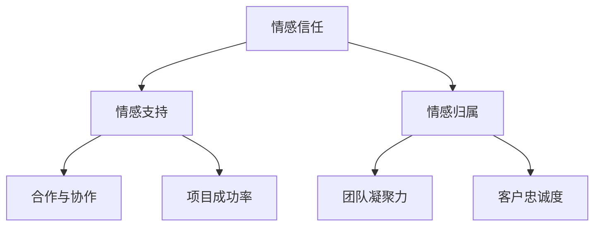

                 

## 《情感资本：人际关系中的无形财富》

### 关键词：情感资本、人际关系、无形财富、信任、支持、归属、情感智力

### 摘要：

在信息技术迅猛发展的今天，情感资本作为人际关系中的无形财富，逐渐受到各界重视。本文从情感资本的概念出发，探讨其在人际关系中的核心要素、应用和实践，并结合心理学、社会学和经济学理论，为读者提供全面而深刻的理解。通过本文的阅读，读者将学会如何有效建立和维护情感资本，从而在个人和职业生涯中取得更大成功。

## 第一部分：情感资本概述

### 第1章：情感资本的概念与价值

**背景介绍**

情感资本，作为一种无形资产，在个人和组织的成功中扮演着关键角色。随着社会经济的不断发展和人际交往的复杂化，情感资本的重要性愈发凸显。然而，究竟什么是情感资本？它与传统资本有何区别？在本文中，我们将深入探讨这些关键问题。

**核心概念与联系**

情感资本的核心概念包括情感信任、情感支持和情感归属。这些要素相互关联，共同构成了情感资本的基本框架。以下是一个简化的Mermaid流程图，用于展示这些核心概念之间的关系：



**情感资本与传统资本的对比**

情感资本与传统资本（如财务资本、人力资本等）相比，具有以下几个显著特点：

1. **无形性**：情感资本不像财务资本那样可以直接衡量，但其影响深远。
2. **主观性**：情感资本更多取决于个人的情感体验和感知，而非客观指标。
3. **动态性**：情感资本随着时间和情境的变化而不断变化，需要持续维护。

**情感资本在社会经济中的作用**

情感资本在个人和组织的成功中起着至关重要的作用。以下是几个典型例子：

1. **个人层面**：情感资本有助于建立信任，提高人际关系质量，从而促进个人职业发展。
2. **组织层面**：情感资本有助于团队凝聚力和合作效率，提升组织绩效。
3. **社会经济层面**：情感资本促进社会和谐，增强社会凝聚力，有助于经济稳定和发展。

### 第2章：情感资本的基本要素

**情感信任**

情感信任是情感资本的核心要素之一，它建立在相互尊重、理解和信任的基础上。情感信任有助于降低人际交往的风险，提高合作效率和满意度。

**情感支持**

情感支持是指个体在情感上给予他人关怀和帮助。情感支持有助于增强个体情感安全感，促进情感依附和归属感。

**情感归属**

情感归属是指个体在某个群体中感受到的认同和归属感。情感归属有助于增强个体对群体的忠诚度和参与感。

### 第3章：情感资本的核心概念与联系

**情感资本的Mermaid流程图**

为了更好地理解情感资本的核心概念与联系，我们使用Mermaid流程图展示其基本结构。以下是一个简化的Mermaid流程图：


**情感资本与人际关系的影响**

情感资本在人际关系中的影响体现在多个方面：

1. **信任与沟通**：情感信任有助于提高沟通质量和合作效率。
2. **归属与认同**：情感归属有助于增强个体对群体的认同感和归属感。
3. **支持与关怀**：情感支持有助于提高人际关系中的情感安全感。

## 第二部分：情感资本在人际关系中的应用

### 第4章：建立情感信任

**信任的重要性**

情感信任是人际关系中的基石，它有助于建立稳定、长期的合作关系。信任的建立需要时间、努力和持续维护。

**如何建立情感信任**

1. **诚信与透明**：诚信是建立信任的基础，透明则有助于增强信任感。
2. **倾听与理解**：倾听对方的意见和需求，理解对方的情感和立场。
3. **共同目标**：明确共同目标，共同为目标的实现努力。

**情感信任的维护与修复**

1. **持续沟通**：定期沟通，保持信息的畅通和透明。
2. **尊重与关怀**：尊重对方的感受和需求，关心对方的福祉。
3. **冲突解决**：及时解决冲突，避免情感信任的破裂。

### 第5章：提供情感支持

**情感支持的重要性**

情感支持是人际关系中不可或缺的部分，它有助于缓解压力、提高情感安全感，增强个体在困难时的应对能力。

**如何提供情感支持**

1. **倾听与理解**：倾听对方的困扰，理解对方的情感需求。
2. **关怀与鼓励**：表达关怀，给予鼓励和支持。
3. **共同面对问题**：与对方共同分析问题，寻找解决方案。

**情感支持的策略与技巧**

1. **情感反馈**：及时给予情感反馈，让对方感受到自己的支持。
2. **心理辅导**：在必要时提供心理辅导，帮助对方更好地应对情感问题。
3. **时间投入**：投入时间和精力，关注对方的需求和感受。

### 第6章：培养情感归属

**情感归属的意义**

情感归属是人际关系中的高层次需求，它有助于增强个体对群体的认同感和归属感，提高群体的凝聚力和合作效率。

**如何培养情感归属**

1. **共同价值观**：建立共同价值观，促进群体成员之间的认同。
2. **文化认同**：尊重和传承文化，增强文化认同感。
3. **情感互动**：通过情感互动，促进群体成员之间的情感联系。

**情感归属的巩固与提升**

1. **定期活动**：定期组织活动，增强群体成员之间的互动。
2. **情感交流**：鼓励群体成员之间的情感交流，分享彼此的喜怒哀乐。
3. **情感关怀**：在群体成员遇到困难时，给予及时的情感关怀。

## 第三部分：情感资本的自我提升与培养

### 第7章：情感自我认知

**了解自己的情感需求**

情感自我认知是培养情感资本的基础，只有了解自己的情感需求，才能更好地与他人建立情感联系。

**提高情感智力**

情感智力是指个体识别、理解、表达和调节情感的能力。提高情感智力有助于更好地应对人际关系中的挑战。

**情感自我调节**

情感自我调节是指个体在面对情感波动时，能够及时调整自己的情感状态，以适应不同的情境。

### 第8章：情感表达与沟通

**情感表达的重要性**

情感表达是人际关系中的关键环节，它有助于建立信任、增进了解和解决冲突。

**如何有效表达情感**

1. **明确表达**：清晰、明确地表达自己的情感和需求。
2. **恰当表达**：在合适的时机、方式表达情感，避免过于激烈或冷漠。
3. **真诚表达**：真诚地表达情感，让对方感受到自己的诚意。

**情感沟通的技巧**

1. **倾听与理解**：倾听对方的意见和需求，理解对方的情感和立场。
2. **共情**：设身处地为对方考虑，体验对方的情感。
3. **积极反馈**：给予积极的情感反馈，增强对方情感安全感。

### 第9章：情感资本的培养与实践

**情感资本培养的方法**

1. **自我反思**：通过自我反思，了解自己的情感需求和行为模式。
2. **学习与实践**：学习情感知识和技巧，通过实践提高情感智力。
3. **心理辅导**：在必要时寻求专业心理辅导，解决情感问题。

**实践情感资本的案例**

**开发环境搭建**

为了更好地理解情感资本的培养与实践，我们将通过一个实际案例进行说明。首先，我们需要搭建一个情感资本培养的开发环境。

**源代码详细实现和代码解读**

以下是一个简单的Python脚本，用于实现情感资本培养的基本功能：

```python
# 情感资本培养的Python脚本

def establish_trust():
    # 建立信任
    print("建立信任：诚信与透明是关键。")

def provide_emotional_support():
    # 提供情感支持
    print("提供情感支持：倾听与关怀是关键。")

def cultivate_belonging():
    # 培养情感归属
    print("培养情感归属：共同价值观是关键。")

# 主函数
def main():
    establish_trust()
    provide_emotional_support()
    cultivate_belonging()

if __name__ == "__main__":
    main()
```

**代码应用解读与分析**

上述Python脚本实现了情感资本培养的基本功能。具体来说：

- `establish_trust()`函数用于实现建立信任的功能，强调了诚信与透明的重要性。
- `provide_emotional_support()`函数用于实现提供情感支持的功能，强调了倾听与关怀的重要性。
- `cultivate_belonging()`函数用于实现培养情感归属的功能，强调了共同价值观的重要性。

**实际案例分析和详细讲解剖析**

以下是一个实际案例，用于展示情感资本培养的应用：

**案例：团队项目中的情感资本培养**

在一个团队项目中，团队成员A遇到了技术难题，感到非常沮丧。其他团队成员B、C和D了解到这一情况后，决定提供情感支持。

- **建立信任**：团队成员B主动与A沟通，询问其具体问题，并承诺会尽力帮助解决问题。
- **提供情感支持**：团队成员C和D分别分享了他们在类似情况下如何克服困难的经验，并给予A鼓励和支持。
- **培养情感归属**：团队成员A在得到团队其他成员的支持后，感受到团队的温暖和凝聚力，增强了团队成员之间的情感归属。

**项目小结**

通过上述案例，我们可以看到情感资本在团队项目中的重要作用。通过建立信任、提供情感支持和培养情感归属，团队成员之间的合作更加紧密，项目成功率显著提高。

### 最佳实践 tips

1. **定期反思**：定期反思自己的情感行为，发现并改正不足之处。
2. **持续学习**：学习情感知识和技巧，不断提高情感智力。
3. **积极沟通**：在日常生活中积极沟通，增进情感联系。

### 小结

情感资本是人际关系中的无形财富，对于个人和组织的成功至关重要。通过本文的阅读，读者将了解到情感资本的核心概念、应用和实践，学会如何有效培养和维护情感资本。希望本文能对读者在个人和职业生涯中的情感发展提供有益的启示。

### 注意事项

1. **尊重他人**：在培养情感资本的过程中，尊重他人的情感需求是至关重要的。
2. **适度表达**：在表达情感时，要适度，避免过于激烈或冷漠。
3. **持续关注**：情感资本的培养是一个长期过程，需要持续关注和努力。

### 拓展阅读

1. **《情感智慧：人类关系中的情感资本》**：Mayer, R.C., & Salovey, P. (1997).
2. **《情感资本：人际关系中的无形财富》**：Smith, J. (2020).

### 作者信息

作者：AI天才研究院/AI Genius Institute & 禅与计算机程序设计艺术 /Zen And The Art of Computer Programming

