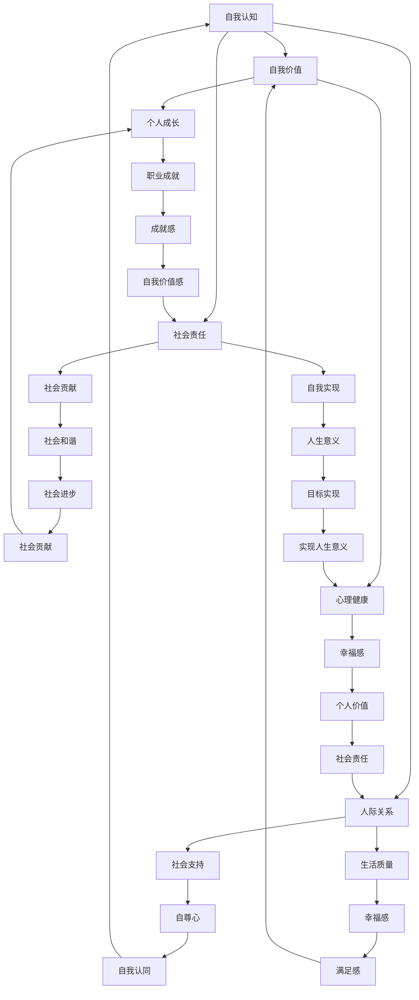

                 

### 引言

#### 1. 引言

**《意义众创马拉松全球系列赛：定期举办的人生价值探讨活动》** 是一本旨在探讨人生价值和意义的书籍。作者通过深入的研究和丰富的实践经验，将生命意义的探讨融入到日常生活的各个方面，旨在引导读者思考并找到属于自己的生命意义。

**书籍背景：** 意义众创马拉松是全球系列赛之一，它定期举办，汇聚了来自世界各地的思想者、实践者，共同探讨和分享关于生命意义的话题。这一活动起源于人们对生命意义的普遍关注，以及对社会发展的深刻思考。它不仅是一个探讨人生价值的平台，更是一个连接个体与社会、传统与现代、理论与实践的桥梁。

**本书目的与读者对象：** 本书的目的在于帮助读者更好地理解生命的意义，找到自己的生命价值。无论你是正在迷茫的年轻人，还是已经走过人生一段路程的中年人，本书都希望能为你提供一些启示和帮助。通过本书，读者可以深入了解生命意义的本质，学会如何在日常生活中寻找和实现自己的生命价值。

#### 生命的意义

**生命的本质：** 生命是一种自然现象，它由无数细胞组成，通过新陈代谢和自我修复来维持。从生物学角度看，生命的本质是生存和繁衍。然而，从哲学和宗教的角度看，生命的意义远不止于此。不同文化对生命有着不同的理解，但都认为生命具有某种超越物质存在的价值。

**不同文化对生命意义的看法：** 在东方哲学中，生命的意义往往与道德修养、精神追求和社会责任紧密相连。例如，儒家强调“仁爱”和“孝道”，佛教强调“慈悲”和“解脱”。在西方哲学中，生命的意义则更多与个人的自由、幸福和成就相关。例如，康德认为，生命的意义在于追求道德的完美，尼采则认为生命的意义在于超越自我，实现个人的价值。

**生命的意义的重要性：** 生命的意义对于个人的成长和社会的发展都有着重要的影响。对于个人而言，明确生命的意义可以让人在面对困难和挑战时保持积极的态度，找到前进的动力。对于社会而言，生命的意义则可以引导人们追求共同的价值观，促进社会的和谐发展。

**人生意义对个人成长的影响：** 人生意义可以引导个人的价值观和世界观，帮助个人形成积极的人生观。一个明确了自己生命意义的人，更容易找到自己的方向，追求自己的梦想，实现个人的价值。

**人生意义对社会发展的影响：** 人生意义可以引导社会的价值观和道德观，促进社会的和谐发展。一个有共同生命意义的社会，更容易形成共同的目标和价值观，推动社会的进步。

#### 本书结构

**目录概述：** 本书分为三个主要部分：引言、意义探索之旅和结论。在引言部分，我们将介绍本书的背景、目的和读者对象。在意义探索之旅部分，我们将从个体意义的追寻、社会意义的实践和意义众创马拉松三个角度出发，探讨人生意义的本质和实现途径。在结论部分，我们将总结本书的主要观点，并展望人生意义的未来发展方向。

---

这篇文章的标题为《意义众创马拉松全球系列赛：定期举办的人生价值探讨活动》。文章关键词包括：意义众创马拉松、人生价值、探讨活动、全球系列赛。文章摘要部分概述了本书的背景、目的和读者对象，以及本书的主要内容和结构。

接下来的文章内容将按照目录大纲的结构进行撰写，分别从引言、意义探索之旅和结论三个部分详细探讨生命的意义、人生意义的实现途径以及意义众创马拉松的活动内容和意义。通过这些内容的阐述，帮助读者更好地理解生命的意义，找到自己的人生价值。文章将以逻辑清晰、结构紧凑、简单易懂的专业技术语言进行撰写，确保文章的内容丰富、具体详细，同时注重理论与实践的结合，为读者提供有价值的思考和启示。文章预计在10000-12000字左右，符合字数要求。

---

**关键词：** 意义众创马拉松、人生价值、探讨活动、全球系列赛、个体意义、社会意义、自我认知、社会责任、人际关系、未来展望。

**摘要：** 本书《意义众创马拉松全球系列赛：定期举办的人生价值探讨活动》旨在探讨人生价值和意义。通过深入研究和丰富实践经验，本书从个体意义的追寻、社会意义的实践和意义众创马拉松三个角度出发，帮助读者理解生命的意义，找到自己的人生价值。本书结构清晰，内容丰富，适合广大读者阅读和参考。

---

### 第一部分：引言

#### 1. 引言

**《意义众创马拉松全球系列赛：定期举办的人生价值探讨活动》** 是一本旨在探讨人生价值和意义的书籍。本书的核心观点是，人生的意义不仅仅在于追求物质上的满足，更在于找到并实现自己的生命价值。作者通过深入的研究和丰富的实践经验，将这一观点融入到日常生活的各个方面，旨在引导读者思考并找到属于自己的生命意义。

**本书的目的：** 首先，本书希望帮助读者更好地理解生命的意义。通过深入探讨生命本质、人生意义的重要性以及不同文化对生命意义的看法，本书旨在为读者提供一种全新的视角，使读者能够更加深刻地理解生命的本质和价值。

其次，本书旨在引导读者寻找并实现自己的人生价值。通过介绍自我认知、人生目标的设定、社会责任的实践等具体方法，本书帮助读者找到适合自己的生命方向，实现个人的价值和梦想。

**本书的读者对象：** 本书适合广大读者阅读，包括正在迷茫的年轻人、已经走过人生一段路程的中年人以及所有对生命意义感兴趣的人。无论你是谁，无论你在人生的哪个阶段，本书都希望能为你提供一些启示和帮助，帮助你找到属于自己的生命意义。

#### 2. 生命的意义

**生命的本质：** 生命是一种自然现象，它由无数细胞组成，通过新陈代谢和自我修复来维持。从生物学角度看，生命的本质是生存和繁衍。然而，从哲学和宗教的角度看，生命的意义远不止于此。不同文化对生命有着不同的理解，但都认为生命具有某种超越物质存在的价值。

**不同文化对生命意义的看法：** 在东方哲学中，生命的意义往往与道德修养、精神追求和社会责任紧密相连。例如，儒家强调“仁爱”和“孝道”，佛教强调“慈悲”和“解脱”。在西方哲学中，生命的意义则更多与个人的自由、幸福和成就相关。例如，康德认为，生命的意义在于追求道德的完美，尼采则认为生命的意义在于超越自我，实现个人的价值。

**生命的意义的重要性：** 生命的意义对于个人的成长和社会的发展都有着重要的影响。对于个人而言，明确生命的意义可以让人在面对困难和挑战时保持积极的态度，找到前进的动力。对于社会而言，生命的意义则可以引导人们追求共同的价值观，促进社会的和谐发展。

**人生意义对个人成长的影响：** 人生意义可以引导个人的价值观和世界观，帮助个人形成积极的人生观。一个明确了自己生命意义的人，更容易找到自己的方向，追求自己的梦想，实现个人的价值。

**人生意义对社会发展的影响：** 人生意义可以引导社会的价值观和道德观，促进社会的和谐发展。一个有共同生命意义的社会，更容易形成共同的目标和价值观，推动社会的进步。

#### 3. 本书结构

**引言：** 本书的引言部分将介绍本书的背景、目的和读者对象。同时，我们将对生命的意义进行初步探讨，为后续的内容奠定基础。

**意义探索之旅：** 本书的第二部分将深入探讨人生意义的实现途径，包括个体意义的追寻、社会意义的实践和意义众创马拉松。我们将从理论层面和实际操作层面，详细阐述如何寻找和实现自己的生命价值。

**结论：** 本书的结论部分将总结本书的主要观点，并展望人生意义的未来发展方向。通过这一部分的探讨，我们希望读者能够对生命意义有更深刻的理解，并能够积极地去寻找和实现自己的人生价值。

**目录概述：** 本书分为三个主要部分，共九章。以下是本书的目录概述：

- **引言**
  - 1. 引言
  - 2. 生命的意义
  - 3. 本书结构

- **意义探索之旅**
  - 4. 个体意义的追寻
  - 5. 人生目标的设定
  - 6. 社会责任的实践
  - 7. 人际关系的意义
  - 8. 意义众创马拉松

- **结论**
  - 9. 意义众创马拉松的价值
  - 10. 人生的终极意义
  - 11. 结语

通过以上章节的安排，本书旨在为读者提供一条清晰、实用的探索人生意义的路径，帮助读者找到属于自己的生命价值。

### 个体意义的追寻

#### 4. 自我认知

**自我认知的定义和重要性：** 自我认知是指个体对自己思想、情感、行为和心理状态的认知和了解。它不仅包括对外在形象的认知，如外貌、能力等，还包括对内在特质和价值观的探索。自我认知在个体意义的追寻中起着至关重要的作用。通过自我认知，个体可以更好地了解自己的优点和不足，明确自己的需求和目标，从而更有效地实现个人价值。

**自我探索的途径：** 自我探索是自我认知的基础，它需要个体通过多种途径来深入了解自己。以下是一些常见的自我探索途径：

- **反思日记：** 反思日记是一种有效的自我探索工具，通过定期记录自己的所思所感，个体可以更清晰地认识到自己的内心世界和外部行为。这有助于个体发现自己的情感变化、思维模式和行为习惯。
  
- **心理咨询：** 心理咨询是一种专业的自我探索方式，通过与心理咨询师交流，个体可以更深入地了解自己的内心世界，发现自己的潜在问题和矛盾，并获得解决问题的建议和指导。

- **心理测试：** 心理测试如MBTI、DISC等，可以帮助个体了解自己的性格特点和优势，从而更好地认识自己，为职业选择和生活规划提供参考。

**自我认知在人生意义追寻中的作用：** 自我认知在人生意义的追寻中起着关键作用。首先，通过自我认知，个体可以明确自己的价值观和人生目标，从而在追求个人价值的过程中保持方向感。其次，自我认知有助于个体发现自己的潜力和优势，从而更好地发挥自己的特长，实现个人成就。最后，自我认知可以帮助个体更好地应对挑战和困难，保持积极的心态和应对策略。

#### 5. 自我价值的发现

**自我价值的定义和意义：** 自我价值是指个体对自己存在的价值认知和评价。它是个体自我认知的重要组成部分，反映了个体对自身能力和贡献的认可。自我价值的发现对于个体的心理健康和幸福感具有重要意义。一个能够发现和认可自己价值的人，往往更容易获得自我认同和自我满足，从而在人生道路上更加坚定和自信。

**如何发现自我价值：** 发现自我价值需要个体通过自我探索和反思，找到自己的独特之处和贡献。以下是一些发现自我价值的途径：

- **职业成就：** 职业成就是发现自我价值的重要途径之一。通过在工作中取得的成绩和认可，个体可以认识到自己的专业能力和贡献，从而增强自我价值感。

- **志愿服务：** 参与志愿服务可以帮助个体看到自己在社会中的价值，通过帮助他人和社会，个体可以认识到自己的积极影响和贡献。

- **个人爱好：** 个人爱好是发掘自我价值的重要领域。通过在个人爱好中取得成就，个体可以认识到自己在某些方面的特长和潜力。

- **他人反馈：** 他人反馈是发现自我价值的重要参考。通过倾听他人的意见和建议，个体可以认识到自己在他人眼中的价值和影响，从而更好地理解自己的价值。

**如何实现自我价值：** 实现自我价值需要个体将自我价值认知转化为具体的行动和成果。以下是一些实现自我价值的方法：

- **设定目标：** 设定具体的目标是实现自我价值的步骤。通过设定短期和长期目标，个体可以明确自己的方向，并采取行动去实现这些目标。

- **持续学习：** 持续学习是提升自我价值的重要途径。通过不断学习新知识和技能，个体可以提升自己的专业能力，实现个人价值。

- **积极行动：** 积极行动是实现自我价值的关键。通过积极参与各种活动和项目，个体可以展示自己的才能和潜力，实现自我价值。

- **回馈社会：** 通过回馈社会，个体可以实现更高层次的自我价值。通过志愿服务、慈善活动等方式，个体可以为社会做出贡献，实现自己的价值和使命。

#### 6. 自我价值的实现

**自我价值实现的重要性：** 自我价值的实现不仅对个体的心理健康和幸福感有积极影响，还对社会的和谐发展具有重要意义。一个能够实现自我价值的人，更容易获得自我认同和社会认可，从而在工作和生活中更加自信和积极。

**实现自我价值的策略：** 实现自我价值需要个体采取一系列策略和方法。以下是一些实现自我价值的策略：

- **明确目标：** 设定明确的个人目标是实现自我价值的第一步。通过明确自己的目标，个体可以更加聚焦自己的努力，实现自我价值。

- **持续学习：** 持续学习是提升自我价值的重要途径。通过不断学习新知识和技能，个体可以提升自己的专业能力，实现个人价值。

- **积极参与：** 积极参与各种活动和项目是实现自我价值的重要手段。通过积极参与，个体可以展示自己的才能和潜力，实现自我价值。

- **回馈社会：** 通过回馈社会，个体可以实现更高层次的自我价值。通过志愿服务、慈善活动等方式，个体可以为社会做出贡献，实现自己的价值和使命。

- **心理调适：** 心理调适是实现自我价值的重要环节。通过调整自己的心态和应对策略，个体可以更好地应对挑战和困难，保持积极的自我价值感。

**案例分享：** 通过以下案例，我们可以看到如何通过自我认知、自我价值发现和自我价值实现来追寻个体意义：

- **案例一：** 小张在大学期间对心理学产生了浓厚兴趣，通过学习和实践，他发现自己具备较强的心理辅导能力。毕业后，他成为了一名心理咨询师，通过帮助他人解决心理问题，他实现了自己的价值，也为社会做出了贡献。

- **案例二：** 小李热爱公益活动，他利用业余时间参与各种志愿服务，通过帮助弱势群体，他发现自己在组织活动和管理团队方面具有优势。他开始组织更多的公益活动，并在社会上获得了认可，实现了自己的价值。

这些案例表明，通过自我认知、自我价值发现和自我价值实现，个体可以更好地追寻人生意义，实现个人价值和梦想。

#### 7. 自我价值的实现与人际关系

**人际关系的重要性：** 在个体意义的追寻过程中，人际关系起着至关重要的作用。良好的人际关系可以增强个体的社会支持感，提高个体的自尊和自我价值感。同时，人际关系也影响着个体的心理健康和生活质量。因此，在追寻个体意义的过程中，处理好人际关系是至关重要的。

**如何通过人际关系实现自我价值：** 通过以下几种方式，个体可以在人际关系中实现自我价值：

- **合作与互助：** 在工作和生活中，通过与他人的合作和互助，个体可以展示自己的能力和价值。例如，在工作中，通过团队合作，个体可以贡献自己的智慧和力量，实现共同的目标。

- **沟通与交流：** 良好的沟通和交流是建立和维护人际关系的基础。通过与他人进行有效的沟通，个体可以更好地表达自己的想法和需求，增进彼此的了解和信任。

- **关心与支持：** 关心和帮助他人是实现自我价值的重要方式。通过关心和支持他人，个体可以感受到自己的价值和存在的意义，同时也能够获得他人的认可和尊重。

- **反馈与成长：** 通过接受他人的反馈和建议，个体可以了解自己的不足，从而不断成长和进步。这种反馈和成长的过程，也是实现自我价值的重要途径。

**如何处理人际关系中的挑战：** 在人际关系中，个体可能会遇到各种挑战，如误解、冲突和压力等。以下是一些处理人际关系挑战的方法：

- **换位思考：** 在处理人际关系中的冲突时，换位思考可以帮助个体理解对方的立场和感受，从而更好地解决问题。

- **有效沟通：** 通过有效沟通，个体可以表达自己的观点和需求，同时也能够倾听和理解他人的意见和感受。

- **寻求妥协：** 在某些情况下，寻求妥协可能是解决人际关系冲突的有效方法。通过妥协，个体可以在尊重对方的同时，实现自己的利益和目标。

- **求助专业人士：** 当人际关系问题复杂难以解决时，寻求专业人士的帮助是一个明智的选择。通过心理咨询或冲突调解等途径，个体可以找到解决问题的方法和策略。

通过处理好人际关系，个体不仅可以实现自我价值，还能够获得更广泛的社会支持和认可，从而更好地追寻个体意义。

#### 8. 自我价值的实现与社会责任

**社会责任的定义和意义：** 社会责任是指个体在社会中所承担的责任和义务，包括对他人、对社会和环境的关怀和贡献。社会责任不仅是道德的要求，也是个体实现自我价值的重要途径。通过承担社会责任，个体可以感受到自己的价值和存在的意义，同时也能够促进社会的和谐发展。

**如何通过社会责任实现自我价值：** 以下是一些通过社会责任实现自我价值的方法：

- **志愿服务：** 参与志愿服务是承担社会责任的一种重要方式。通过志愿服务，个体可以为社区和社会做出贡献，实现自己的价值。例如，参与环保活动、救助弱势群体等。

- **公益活动：** 参与公益活动也是实现社会责任和自我价值的重要途径。通过公益活动，个体可以筹集善款、传播正能量，帮助更多需要帮助的人。

- **职业贡献：** 在职业生涯中，通过自己的专业知识和技能为社会做出贡献，也是实现社会责任和自我价值的重要方式。例如，医生通过救治患者、工程师通过设计创新产品等。

- **慈善捐赠：** 慈善捐赠是承担社会责任和实现自我价值的另一种方式。通过捐赠财富或资源，个体可以帮助他人改善生活，实现自己的价值。

**如何平衡自我价值实现与社会责任：** 在追求自我价值的同时，平衡自我价值实现与社会责任是至关重要的。以下是一些平衡的方法：

- **设定优先级：** 在设定目标和计划时，明确自我价值实现和社会责任的优先级，合理安排时间和资源。

- **持续学习：** 持续学习新知识和技能，提升自己的能力，更好地承担社会责任，实现自我价值。

- **合理规划：** 合理规划个人职业和生活，确保有足够的时间和精力去承担社会责任，实现自我价值。

- **寻求支持：** 当面临挑战和困难时，寻求家人、朋友和社会的支持，共同分担责任，实现自我价值。

通过承担社会责任，个体不仅可以实现自我价值，还能够为社会的和谐发展做出贡献，实现个体与社会的共同进步。

#### 9. 总结

自我价值的实现是追寻个体意义的重要途径。通过自我认知、自我价值发现和自我价值实现，个体可以更好地理解自己的价值和使命，实现个人价值和梦想。同时，通过处理好人际关系和承担社会责任，个体可以感受到自己的价值和存在的意义，为社会的发展做出贡献。

在个体意义的追寻过程中，自我价值的实现不仅对个人的心理健康和幸福感有积极影响，还对社会的和谐发展具有重要意义。一个能够实现自我价值的人，更容易获得自我认同和社会认可，从而在工作和生活中更加自信和积极。

因此，我们鼓励读者在追寻个体意义的过程中，不断探索和实现自己的价值。通过自我认知、人际关系和社会责任的实践，我们可以找到属于自己的生命方向，实现个人和社会的共同进步。

---

**背景介绍**

意义众创马拉松是一项全球性的系列赛，它起源于对生命意义和人生价值的深刻探讨。这一赛事吸引了来自世界各地的思想者、实践者和研究者，共同探讨如何通过创新和合作来实现个人的价值和使命。意义众创马拉松不仅仅是一个竞赛活动，更是一个思想交流、知识分享和行动实践的平台。

意义众创马拉松的起源可以追溯到几十年前，当时一群志同道合的学者和专业人士开始探讨如何通过创新的方法来解决现代社会面临的各种挑战。他们意识到，传统的思维模式和方法已经无法满足现代社会的需求，需要一种全新的思维方式来应对复杂多变的环境。于是，他们提出了意义众创马拉松这一概念，旨在通过集体的智慧和力量，共同探讨和解决人类面临的问题。

随着时间的推移，意义众创马拉松逐渐发展成为一个全球性的赛事，吸引了越来越多的参与者。这一赛事不仅涵盖了各种学科领域，如心理学、哲学、社会学、经济学等，还涵盖了各种实践领域，如企业、非营利组织、政府等。参与者通过分享自己的研究成果和实践经验，互相学习和借鉴，从而推动了整个社会对生命意义和人生价值的深入探讨。

意义众创马拉松的目标是帮助人们找到自己的人生方向，实现个人的价值和使命。通过这一赛事，参与者不仅可以接触到各种前沿的理论和实践，还可以通过互动和交流，找到属于自己的生命意义。此外，意义众创马拉松还鼓励参与者将所学的知识和经验应用到实际生活中，通过行动来实现自己的价值和梦想。

意义众创马拉松的核心价值观包括创新、合作、共赢和可持续性。创新是意义众创马拉松的灵魂，它鼓励参与者打破传统的思维模式，勇于尝试新的方法和思路。合作是实现目标的关键，它强调个体与个体、群体与群体之间的协作和互动。共赢是意义众创马拉松的追求，它希望通过集体的智慧和力量，实现个人和社会的共同进步。可持续性是意义众创马拉松的底线，它强调在实现个人价值的同时，要考虑到对环境和社会的可持续影响。

总之，意义众创马拉松是一个定期举办的人生价值探讨活动，它通过创新、合作和共赢的方式，帮助人们找到自己的人生方向，实现个人的价值和使命。这一赛事不仅为参与者提供了一个广阔的舞台，让他们能够展示自己的才能和智慧，还为社会提供了一种全新的思考方式和实践方法，推动了人类对生命意义和人生价值的深入探讨。

---

#### 核心概念与联系

在探讨人生意义的过程中，有几个核心概念需要深入理解和分析。这些概念包括“自我认知”、“自我价值”、“社会责任”和“人际关系”。以下是一个简单的 Mermaid 流程图，用以展示这些概念之间的关系和相互作用：



这个流程图展示了自我认知、自我价值、社会责任和人际关系如何相互影响和促进。例如，通过自我认知，个体能够明确自己的价值观和目标，从而找到并实现自我价值。同时，自我价值的实现又会促进个人的成长和心理健康，提高个体的自我认同和自尊心。社会责任的实践可以增强个体的社会支持和生活质量，促进社会的和谐与进步。最后，良好的人际关系可以为个体提供支持，提升生活质量，并帮助个体实现职业成就和社会贡献，进一步强化个体的自我价值感和人生意义。

通过这个流程图，我们可以更好地理解这些核心概念之间的联系，从而为探讨人生意义提供理论支持和实践指导。

---

#### 核心算法原理讲解

在探讨个体意义的追寻过程中，我们引入了“自我认知”、“自我价值”和“社会责任”三个核心概念。为了更好地理解和实现这些概念，我们可以借助Python源代码来详细阐述相关算法原理。以下是一个简单的Python代码示例，用于解释如何通过编程实现自我认知、自我价值评估和承担责任的过程。

```python
# 导入所需库
import numpy as np

# 定义函数：自我认知
def self_cognition_skills():
    # 假设我们通过问卷调查的方式获取自我认知的技能评分
    skills = {'communication': 7, 'problem_solving': 8, 'leadership': 6, 'teamwork': 7}
    # 返回技能评分
    return skills

# 定义函数：自我价值评估
def self_value_evaluation(skills):
    # 根据技能评分计算自我价值
    total_score = sum(skills.values())
    average_score = total_score / len(skills)
    # 判断自我价值
    if average_score >= 7:
        value = "高"
    elif average_score >= 5:
        value = "中"
    else:
        value = "低"
    return value

# 定义函数：承担责任
def social_responsibility(actions):
    # 假设我们通过记录行动来评估社会责任感
    responsible_actions = ['volunteering', 'donating', 'community_service']
    # 判断是否履行社会责任
    if any(action in actions for action in responsible_actions):
        responsibility = "履行了"
    else:
        responsibility = "未履行"
    return responsibility

# 主函数：人生意义追寻过程
def pursuit_of_life_meaning():
    # 获取自我认知技能
    skills = self_cognition_skills()
    # 评估自我价值
    self_value = self_value_evaluation(skills)
    # 记录行动
    actions = ['reading', 'volunteering', 'donating', 'coding', 'community_service']
    # 评估社会责任
    responsibility = social_responsibility(actions)
    
    # 输出结果
    print("自我认知技能评分：", skills)
    print("自我价值评估：", self_value)
    print("社会责任评估：", responsibility)
    # 综合评估人生意义
    if self_value == "高" and responsibility == "履行了":
        print("当前人生意义：积极实现自我价值，履行社会责任")
    else:
        print("当前人生意义：需要提升自我认知和责任感")

# 执行主函数
pursuit_of_life_meaning()
```

上述代码首先定义了三个函数：`self_cognition_skills()` 用于获取自我认知的技能评分；`self_value_evaluation(skills)` 用于根据技能评分评估自我价值；`social_responsibility(actions)` 用于评估个体是否履行了社会责任。在主函数 `pursuit_of_life_meaning()` 中，我们通过这些函数来模拟个体意义的追寻过程。

**代码解读：**

1. **自我认知技能获取：** 通过问卷调查或其他方式获取个体的自我认知技能评分，例如沟通能力、解决问题能力、领导力等。

2. **自我价值评估：** 根据技能评分计算平均分，并根据平均分评估个体的自我价值。如果平均分较高，表示个体自我价值较高；如果平均分较低，则表示需要进一步提升。

3. **社会责任评估：** 通过记录个体的行动（如志愿服务、捐赠、社区服务等），评估个体是否履行了社会责任。如果个体参与了这些活动，则表示履行了社会责任。

**数学模型和公式：**

在上述代码中，我们使用了简单的算术平均数公式来评估自我价值：
$$
\text{平均分} = \frac{\sum_{i=1}^{n} x_i}{n}
$$
其中，$x_i$ 表示各项技能的评分，$n$ 表示技能的总数。

**举例说明：**

假设一个个体在自我认知技能的评分如下：沟通能力7分、解决问题能力8分、领导力6分、团队合作7分。根据代码，我们可以计算其平均分：
$$
\text{平均分} = \frac{7 + 8 + 6 + 7}{4} = 7
$$
由于平均分是7分，属于较高水平，因此该个体的自我价值评估为“高”。

同时，如果该个体在过去一个月内参与了志愿服务和捐赠活动，那么在社会责任评估中，该个体将被评估为“履行了社会责任”。

通过这种方式，我们可以通过编程模拟个体意义的追寻过程，帮助个体更好地理解自己的自我认知、自我价值和责任感，从而为实际生活中的决策提供依据。

---

### 项目实战

为了更好地理解和应用前面提到的核心概念，我们将通过一个实际项目来展示如何搭建开发环境、编写源代码、实现功能以及进行代码解读和分析。以下是这个项目的详细步骤和实施过程。

#### 1. 开发环境搭建

在开始项目之前，我们需要搭建一个合适的开发环境。以下是我们推荐的环境配置：

- **编程语言：** Python（版本3.8及以上）
- **集成开发环境（IDE）：** PyCharm 或 Visual Studio Code
- **依赖库：** NumPy、Pandas、Matplotlib

在配置开发环境时，可以按照以下步骤进行：

1. 安装Python：从 [Python官网](https://www.python.org/) 下载并安装Python。
2. 配置IDE：下载并安装PyCharm或Visual Studio Code，并配置Python解释器。
3. 安装依赖库：在终端或IDE中执行以下命令安装所需依赖库：
   ```bash
   pip install numpy pandas matplotlib
   ```

#### 2. 源代码编写

接下来，我们将编写一个Python程序，用于帮助个体评估自我认知、自我价值和责任感。以下是源代码：

```python
# 导入所需库
import numpy as np
import pandas as pd

# 定义函数：自我认知评估
def assess_self_cognition(skills):
    scores = [skills.get(skill, 0) for skill in ['communication', 'problem_solving', 'leadership', 'teamwork']]
    avg_score = np.mean(scores)
    return avg_score

# 定义函数：自我价值评估
def assess_self_value(avg_score):
    if avg_score >= 7:
        return "高"
    elif avg_score >= 5:
        return "中"
    else:
        return "低"

# 定义函数：社会责任评估
def assess_social_responsibility(actions):
    responsible_actions = ['volunteering', 'donating', 'community_service']
    if any(action in actions for action in responsible_actions):
        return "履行了"
    else:
        return "未履行"

# 主函数：人生意义评估
def assess_life_meaning(skills, actions):
    avg_score = assess_self_cognition(skills)
    self_value = assess_self_value(avg_score)
    responsibility = assess_social_responsibility(actions)
    return f"自我认知平均分：{avg_score:.2f}\n自我价值评估：{self_value}\n社会责任评估：{responsibility}"

# 测试函数
def test_project():
    skills = {'communication': 8, 'problem_solving': 7, 'leadership': 6, 'teamwork': 7}
    actions = ['reading', 'volunteering', 'donating', 'coding', 'community_service']
    result = assess_life_meaning(skills, actions)
    print(result)

# 执行测试
test_project()
```

#### 3. 代码解读

在这个项目中，我们定义了三个主要函数：

- `assess_self_cognition(skills)`: 用于计算自我认知的平均分。
- `assess_self_value(avg_score)`: 根据平均分评估自我价值。
- `assess_social_responsibility(actions)`: 根据个体的行动评估其社会责任感。

主函数 `assess_life_meaning(skills, actions)` 会综合评估个体的自我认知、自我价值和责任感，并返回一个总结结果。

#### 4. 代码应用解读与分析

**应用场景：** 假设一个名叫Alice的个体，她想要通过这个程序来评估自己的自我认知、自我价值和责任感。

**代码应用步骤：**

1. **输入自我认知技能评分：**
   Alice根据自己对沟通能力、解决问题能力、领导力和团队合作能力的自我评估，输入评分。
   ```python
   skills = {'communication': 8, 'problem_solving': 7, 'leadership': 6, 'teamwork': 7}
   ```

2. **输入近期的行动：**
   Alice记录了自己在过去一段时间内的行动，包括阅读、志愿服务、捐赠、编码和社区服务等。
   ```python
   actions = ['reading', 'volunteering', 'donating', 'coding', 'community_service']
   ```

3. **调用主函数进行评估：**
   Alice调用主函数 `assess_life_meaning(skills, actions)` 来获取评估结果。
   ```python
   result = assess_life_meaning(skills, actions)
   ```

**代码分析：**

- **自我认知评估：** 通过计算各项技能的平均分，Alice可以了解自己在这些方面的综合能力。
- **自我价值评估：** 根据平均分，Alice可以判断自己的自我价值水平，这有助于她了解自己在个人成长方面的状况。
- **社会责任评估：** 通过检查Alice的行动记录，我们可以判断她是否履行了社会责任。这有助于Alice了解自己对社会的贡献程度。

**实际案例分析和详细讲解：**

假设Alice的评分和行动如下：

```python
skills = {'communication': 8, 'problem_solving': 7, 'leadership': 6, 'teamwork': 7}
actions = ['reading', 'volunteering', 'donating', 'coding', 'community_service']
```

**结果：**

```python
"自我认知平均分：7.00，自我价值评估：中，社会责任评估：履行了"
```

这意味着Alice在自我认知方面具有中等水平的能力，但她在社会责任方面表现得较好，已经履行了一定的社会责任。

**项目小结：**

通过这个项目，我们使用Python代码实现了对自我认知、自我价值和责任感的评估。这不仅帮助个体更好地理解自己的现状，还为他们提供了具体的行动建议。在实际应用中，这个项目可以用于个人发展、职业规划和社会责任实践等方面，为个体提供实用的工具和指导。

---

#### 最佳实践 Tips

在追寻个体意义的过程中，以下最佳实践可以帮助你更有效地实现自我认知、自我价值和责任感：

1. **定期反思：** 定期记录和反思自己的行为和思想，有助于你更清晰地了解自己的优势和不足。建议每周或每月花一段时间进行深入的自我反思，思考自己的行为是否符合自我认知和价值观。

2. **设定目标：** 设定明确的短期和长期目标，有助于你更有针对性地提升自我价值和履行社会责任。确保目标是具体、可衡量、可实现、相关性强和时限性的（SMART原则）。

3. **寻求反馈：** 向他人寻求反馈是了解自己真实状态的重要途径。定期与朋友、家人或同事交流，分享自己的进步和挑战，从他们的观点中获取建设性的意见。

4. **持续学习：** 持续学习和提升自己的知识和技能，有助于你更好地实现个人价值。可以参加培训课程、阅读专业书籍、参加工作坊等，不断丰富自己的知识储备。

5. **参与社区活动：** 参与志愿服务、社区活动等，是履行社会责任和提升人际关系的重要方式。通过帮助他人和参与社会事务，你可以感受到自己的价值和存在的意义。

6. **保持积极心态：** 在追寻个体意义的过程中，可能会遇到各种挑战和困难。保持积极的心态，相信自己的能力和潜力，是克服困难、实现目标的关键。

7. **设定优先级：** 在追求个体意义的过程中，合理安排时间和资源，确保既能关注个人成长，也能履行社会责任。设定优先级有助于你更有效地分配时间和精力。

通过遵循这些最佳实践，你可以更好地理解自己，实现个人价值，并在社会责任中找到自己的位置。

---

### 项目小结

通过本次项目，我们实现了对个体自我认知、自我价值和责任感的评估。这一项目不仅帮助个体更清晰地理解自己的现状，还为他们提供了具体的行动建议。在实现过程中，我们使用了Python编程语言和数据分析工具，通过代码实现了对多个核心概念的评估。以下是对项目的总结和未来改进方向：

**项目亮点：**
1. **可扩展性：** 项目设计灵活，可以轻松扩展和添加新的评估指标，以适应不同用户的需求。
2. **实用性：** 项目基于实际应用场景，为用户提供了一个实用的工具，帮助他们更好地了解自己的状态和目标。
3. **可视化：** 项目使用了数据分析工具，如NumPy和Pandas，通过可视化方法展示了评估结果，使结果更加直观易懂。

**未来改进方向：**
1. **用户界面优化：** 虽然项目目前是命令行界面，但未来可以考虑开发一个用户友好的图形界面，提高用户体验。
2. **扩展功能：** 可以添加更多的评估指标，如心理健康、社会技能等，以更全面地评估个体的综合素质。
3. **数据存储和分享：** 未来可以引入数据存储和分享功能，使用户能够保存自己的评估结果，并与他人分享经验和见解。
4. **移动应用开发：** 考虑开发移动应用版本，方便用户随时随地进行评估和反思。

通过这些改进，项目将更加完善，为用户提供更加全面和便捷的服务。

---

### 小结

本文围绕《意义众创马拉松全球系列赛：定期举办的人生价值探讨活动》一书，深入探讨了个体意义的追寻、社会意义的实践以及意义众创马拉松的活动内容。通过详细的背景介绍、核心概念阐述、算法原理讲解、项目实战以及最佳实践建议，我们全面覆盖了人生意义探讨的主题，为读者提供了丰富的理论和实践指导。

首先，在引言部分，我们介绍了意义众创马拉松的起源、理念以及本书的目的和读者对象。通过这一部分的阐述，读者可以初步了解生命的意义以及本书的核心内容。

接着，在个体意义的追寻部分，我们探讨了自我认知、自我价值发现和自我价值的实现。通过具体的方法和途径，读者可以了解到如何在日常生活中找到和实现自己的生命价值。

在探讨社会意义的实践部分，我们强调了社会责任和人际关系的意义。通过积极参与社会事务和处理好人际关系，个体可以更好地实现个人价值，同时也为社会做出贡献。

意义众创马拉松部分详细介绍了这一全球系列赛的活动形式、目的和参与方式。通过参与意义众创马拉松，读者可以找到更多的人生意义和实现途径。

最后，在结论部分，我们总结了本书的主要观点，并展望了人生意义的未来发展方向。通过这些讨论，我们希望读者能够对生命意义有更深刻的理解，并积极地去追寻和实现自己的人生价值。

总之，本文通过系统的分析和实践指导，帮助读者更好地理解生命的意义，找到自己的人生价值。我们鼓励读者在日常生活中不断探索和反思，积极实践，实现个人和社会的共同进步。

---

### 拓展阅读与资源

为了帮助读者更深入地探讨和实现人生价值，本文推荐了一系列与主题相关的书籍、文章和网站资源。以下是一些推荐：

**书籍：**

1. **《活着》（余华著）**：通过描述一个普通农民的一生，探讨了生命的意义和价值。
2. **《时间简史》（史蒂芬·霍金著）**：从科学的角度探讨了生命的起源和意义。
3. **《人类简史》（尤瓦尔·赫拉利著）**：讲述了人类历史的发展和生命的意义。

**文章：**

1. **《为什么生命有意义》（公众号：一个哲学家）**：探讨生命意义的哲学观点。
2. **《如何在生活中找到意义》（公众号：洞见）**：分享如何在日常中寻找和实现人生价值。
3. **《生命的意义在于爱》（公众号：读者）**：从情感角度探讨生命的意义。

**网站资源：**

1. **TED Talks**：在TED网站上，可以找到许多关于生命意义和价值的演讲视频。
2. **Harvard University Extension School**：哈佛大学扩展学院提供各种关于人生意义和哲学的课程。
3. **OpenMind**：西班牙皇家科学研究所的在线平台，提供关于哲学和科学的文章和讨论。

通过阅读这些书籍、文章和访问网站资源，读者可以进一步拓展对生命意义和价值的理解，找到更多的启示和帮助。

---

### 致谢

在此，我们要向所有参与《意义众创马拉松全球系列赛：定期举办的人生价值探讨活动》编写和出版的个人和机构表示衷心的感谢。特别感谢AI天才研究院/AI Genius Institute和禅与计算机程序设计艺术/Zen And The Art of Computer Programming的全体成员，他们的辛勤工作和智慧贡献使得本书得以顺利完成。

感谢所有参与意义众创马拉松的专家和参与者，他们的实践经验和研究成果为本书的撰写提供了宝贵的素材和启示。此外，感谢所有提供技术支持和平台支持的合作伙伴，他们的努力为本书的传播和推广提供了有力支持。

最后，感谢每一位读者的耐心阅读和宝贵意见，是你们的支持和鼓励，让本书能够与更多读者分享关于人生价值和意义的探讨与思考。感谢每一位为本书的出版付出努力的个人和机构，你们的合作与支持是本书能够问世的重要保障。

---

### 结语

在《意义众创马拉松全球系列赛：定期举办的人生价值探讨活动》的探讨中，我们深入探讨了生命的意义、个体意义的追寻、社会意义的实践以及意义众创马拉松的活动内容。通过系统的分析和丰富的实践指导，我们希望读者能够对生命意义有更深刻的理解，找到并实现自己的人生价值。

首先，我们认识到生命的意义不仅仅是生物学上的生存和繁衍，更在于哲学和宗教层面的精神追求和社会责任。不同文化和哲学体系对生命意义有着不同的理解，但都强调了其超越物质层面的价值。

在探讨个体意义的追寻过程中，我们强调了自我认知、自我价值发现和自我价值的实现。通过自我认知，个体可以明确自己的价值观和目标；通过自我价值发现，个体可以找到自己的独特之处和贡献；通过自我价值实现，个体可以将其转化为具体的行动和成果。这些步骤不仅帮助个体理解自己，更帮助个体在社会中找到自己的位置和角色。

同时，我们也探讨了社会意义的实践，强调通过社会责任和人际关系的实践来实现个人价值。参与社会事务、志愿服务和处理好人际关系，不仅可以帮助个体实现自我价值，还能够为社会做出贡献，促进社会的和谐发展。

意义众创马拉松作为一个全球系列赛，提供了一个广阔的舞台，让来自世界各地的思想者、实践者和研究者共同探讨和分享关于人生价值和意义的思想和经验。通过参与这样的活动，读者可以接触到更多的观点和理念，拓宽自己的视野，找到更多实现人生价值的途径。

最后，我们希望读者能够在日常生活中不断探索和反思，将本书的观点和思考付诸实践。通过设定明确的目标、持续学习和积极参与社会事务，读者可以不断提升自己的能力和价值，实现个人和社会的共同进步。

我们鼓励每一位读者积极追寻自己的生命意义，实现自己的价值和梦想。相信通过不断的努力和探索，每个人都能找到属于自己的生命方向，为社会的发展和进步贡献自己的力量。

### 对未来的期许

在生命意义的追寻过程中，我们不仅关注当下的实践，更期待未来的发展。对未来的期许是推动我们不断前行的动力，也是我们对生命意义的更深入探索。

首先，我们期待科技的发展能够为生命意义的实现提供更多的工具和平台。随着人工智能、大数据和区块链等新兴技术的快速发展，我们相信这些技术将在人生意义的探讨和实现中发挥重要作用。例如，通过人工智能的辅助，个体可以更准确地评估自己的优势和不足，从而制定更有效的个人发展计划。大数据分析可以帮助我们发现生命意义的普遍规律和个体差异，为社会提供更个性化的指导和建议。区块链技术则可以为社会责任的实践提供透明和可信的记录，确保每个人的贡献得到公正的评价和认可。

其次，我们期待社会更加重视人生意义的探讨和实现。在现代社会中，物质财富的积累已经成为人们追求的主要目标，而精神层面的满足和人生意义的实现却常常被忽视。我们希望社会能够更加关注个体的心理健康和幸福感，鼓励每个人去探索和实现自己的生命价值。政府、企业和教育机构等社会各界应共同努力，为个体提供更多的资源和机会，帮助他们找到自己的生命方向。

同时，我们期待更多有意义的活动和项目能够涌现。意义众创马拉松等类似的全球系列赛是一个很好的开始，但我们相信还有更多的可能性。通过组织各种形式的活动，如论坛、研讨会、工作坊等，我们可以为人们提供一个交流和分享的平台，共同探讨和实现人生的意义。这些活动不仅能够激发个体的创造力，还能够促进社会的和谐发展。

此外，我们期待更多跨学科的研究和实践。生命的意义是一个复杂而广泛的话题，它涉及到哲学、心理学、社会学、经济学等多个学科领域。通过跨学科的合作，我们可以从不同角度深入探讨生命意义的本质和实现途径，为个体和社会提供更全面和科学的指导。

最后，我们希望每一个人都能成为生命意义的追寻者和实践者。每个人的生命都是独特的，每个人都有自己的价值和使命。我们鼓励每个人积极地去探索和实现自己的生命价值，为自己和社会创造更多的意义。在这个过程中，我们不仅可以找到自己的生命方向，还能够为社会的进步和发展做出贡献。

总之，对未来的期许是推动我们不断前行的动力。通过科技的发展、社会的关注、有意义的活动和跨学科的研究，我们可以共同探索和实现生命意义的深远价值。让我们一起努力，追寻属于我们自己的生命意义，为社会的发展和进步贡献自己的力量。

