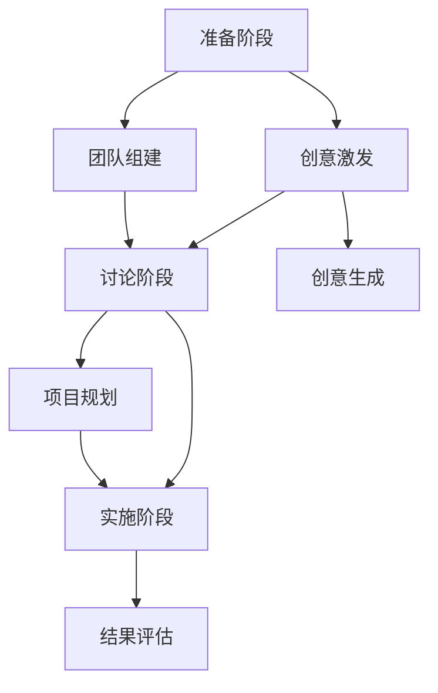

                 

### 1.1 什么是意义众创马拉松

意义众创马拉松，顾名思义，是一种以集体探讨人生价值为核心目标的创新性活动。它借鉴了传统的编程马拉松（Hackathon）模式，但在内容上更加注重参与者对个人及社会意义的深入思考。这类活动通常持续48小时，期间参与者将在严格的时限内进行意义探索、项目规划和执行。

#### 活动形式与特点

意义众创马拉松的活动形式灵活多样，主要包括以下几个环节：

1. **前期准备**：参与者通过自我介绍、角色分配和团队组建，明确各自的使命和目标。
2. **创意激发**：通过讨论、头脑风暴和思维导图等工具，激发参与者的创意思维。
3. **讨论阶段**：围绕特定的主题或问题，进行深入的探讨和交流，收集信息并进行分析。
4. **创意生成**：基于前期的讨论，生成具体的项目构想和方案。
5. **项目规划**：确定项目的目标、时间线、资源和预算，进行详细的规划。
6. **实施阶段**：根据规划，实施项目，包括资源整合、项目执行和问题解决。
7. **结果评估**：对项目结果进行评估和反馈，总结经验教训。

意义众创马拉松的特点包括：

- **高强度、高效率**：活动时间紧凑，要求参与者高效完成多个环节。
- **跨学科、跨领域**：参与者通常来自不同背景，可以带来多元的思维和视角。
- **注重实战、注重反思**：不仅关注项目的实际成果，还重视参与者的个人成长和反思。

#### 活动意义

意义众创马拉松的核心在于引导参与者深入思考人生价值和意义，这不仅是个人成长的重要途径，也是推动社会进步的重要手段。通过这种活动，参与者可以：

- **增强自我认知**：通过反思和讨论，更清晰地了解自己的价值观和人生目标。
- **提升协作能力**：在团队中合作，学会沟通、协调和解决冲突。
- **激发创新思维**：通过头脑风暴和创意生成，培养创新意识和创造力。
- **践行社会责任**：通过项目和成果，为社会做出实际贡献。

总之，意义众创马拉松不仅是一种创新性的活动形式，更是一种推动个人成长和社会进步的有效途径。

### Mermaid 流程图

为了更直观地展示意义众创马拉松的核心概念和流程，以下是一个Mermaid流程图：



在这个流程图中，每个节点代表一个阶段，箭头表示流程的顺序和关系。通过这个图，我们可以清晰地看到意义众创马拉松的各个阶段及其相互之间的联系。

### 1.2 众创马拉松的起源与发展

意义众创马拉松这种形式的创新活动并非凭空出现，而是有着深厚的起源和发展背景。它的诞生和发展可以追溯到编程马拉松（Hackathon）和其他类似的创新竞赛。

#### 编程马拉松的起源

编程马拉松最早起源于计算机编程领域，最早的形式可以追溯到1977年的第一届国际计算机编程竞赛。当时，程序员们为了庆祝计算机科学的进步，自发组织了编程竞赛，要求参赛者在规定的时间内完成特定的编程任务。这种竞赛形式逐渐流行，并演变成了今天的编程马拉松。

编程马拉松的核心在于激发程序员的创新能力和团队合作精神。随着时间的推移，编程马拉松的影响力不断扩大，不仅限于计算机科学领域，还渗透到了其他技术领域，如数据科学、人工智能等。

#### 意义众创马拉松的发展

意义众创马拉松在编程马拉松的基础上进行了创新和拓展。它不仅关注技术实现，更强调人生价值和意义的探讨。这种活动的形式在近年来逐渐发展起来，特别是在关注个体心理和社会责任感的群体中受到了广泛欢迎。

意义众创马拉松的发展离不开以下几个关键因素：

1. **社会需求**：随着社会的发展，人们越来越意识到个人成长和社会进步的重要性。意义众创马拉松正好满足了这一需求，为个人提供了一个反思和探索人生价值的平台。
2. **技术进步**：互联网和社交媒体的普及，为意义众创马拉松的推广提供了便利。参与者可以通过线上平台进行交流和协作，不受地域限制。
3. **教育改革**：现代教育越来越重视创新思维和实践能力的培养。意义众创马拉松作为一种创新性的活动形式，与教育改革的目标高度契合。

#### 国际发展情况

意义众创马拉松在国际上也得到了广泛的关注和推广。许多国家和地区都举办了大型的意义众创马拉松活动，如美国的“Lifehackathon”、欧洲的“Meaning Hack”等。这些活动吸引了来自世界各地的参与者，共同探讨人生价值和意义。

在国际范围内，意义众创马拉松的发展趋势呈现出以下几个特点：

- **多样化**：不同国家和地区根据自己的文化背景和社会需求，设计了多样化的活动形式，如主题式、项目式等。
- **国际化**：许多活动采用了国际化的方式，吸引了来自不同国家和地区的参与者，促进了文化交流和合作。
- **商业化**：一些意义众创马拉松活动也开始走向商业化，通过商业合作和赞助，确保活动的持续发展。

总之，意义众创马拉松作为一种新兴的创新活动形式，正在全球范围内蓬勃发展。它不仅为个人提供了反思和探索人生价值的平台，也为社会进步和创新思维的发展做出了积极贡献。

### 1.3 参与者的角色与期望

在意义众创马拉松中，参与者扮演着多种角色，各自发挥着独特的作用。这些角色包括领导者、创意贡献者和执行者等。不同的角色有着不同的职责和期望，共同推动活动的顺利进行。

#### 领导者的角色与期望

领导者是意义众创马拉松中的核心角色，负责整体活动的规划、协调和推进。领导者的主要职责包括：

1. **活动规划**：领导者需要在活动开始前制定详细的活动计划，包括时间安排、任务分配和资源调配等。
2. **团队协调**：领导者需要确保团队成员之间的沟通畅通，协调不同角色的工作，解决团队内部的问题和冲突。
3. **激励与引导**：领导者需要激发团队成员的积极性和创造力，引导他们朝着共同的目标努力。

对于领导者，活动组织者通常有以下期望：

- **领导能力**：领导者需要具备较强的领导能力，能够带领团队克服困难，完成任务。
- **沟通能力**：领导者需要具备良好的沟通能力，能够有效地与团队成员和其他参与者沟通。
- **创新思维**：领导者需要具备创新思维，能够在活动中提出新的观点和想法，推动活动的深入进行。

#### 创意贡献者的角色与期望

创意贡献者是意义众创马拉松中的核心力量，他们负责提供创新的想法和解决方案。创意贡献者的主要职责包括：

1. **创意生成**：创意贡献者需要通过头脑风暴、思维导图等方式，生成具体的创意和方案。
2. **讨论与分享**：创意贡献者需要积极参与讨论，分享自己的观点和想法，与其他参与者进行互动。
3. **信息收集**：创意贡献者需要收集相关的信息，为创意生成提供支持。

对于创意贡献者，活动组织者通常有以下期望：

- **创造力**：创意贡献者需要具备较强的创造力，能够在短时间内产生大量的创意和解决方案。
- **沟通能力**：创意贡献者需要具备良好的沟通能力，能够清晰地表达自己的观点，并与他人进行有效的交流。
- **团队合作精神**：创意贡献者需要具备团队合作精神，能够与其他团队成员紧密合作，共同推进项目的进展。

#### 执行者的角色与期望

执行者是意义众创马拉松中的实施者，负责将创意和方案转化为实际的行动和成果。执行者的主要职责包括：

1. **项目执行**：执行者需要根据项目规划，负责具体任务的执行，确保项目按时完成。
2. **问题解决**：执行者需要及时解决项目中出现的问题和困难，确保项目的顺利进行。
3. **反馈与调整**：执行者需要及时反馈项目进展和问题，根据反馈进行调整和优化。

对于执行者，活动组织者通常有以下期望：

- **执行力**：执行者需要具备较强的执行力，能够严格按照项目规划执行任务，确保项目按时、高质量完成。
- **适应能力**：执行者需要具备较强的适应能力，能够快速应对项目中的变化和挑战。
- **团队合作精神**：执行者需要具备团队合作精神，能够与其他团队成员密切合作，共同完成项目。

总之，意义众创马拉松中的每个角色都有其独特的职责和期望。只有各个角色相互配合，才能确保活动的顺利进行，实现共同的目标。

### 1.4 活动流程概述

意义众创马拉松的活动流程分为四个主要阶段：准备阶段、讨论阶段、实施阶段和总结阶段。每个阶段都有其具体的任务和目标，以下是对各个阶段的具体描述。

#### 准备阶段

准备阶段是意义众创马拉松的起点，主要任务是为后续的活动打下坚实的基础。这一阶段的任务包括：

1. **团队组建**：根据参与者的兴趣和特长，组建合适的团队。每个团队通常由5-10人组成，包括领导者、创意贡献者和执行者等角色。
2. **角色分配**：明确每个团队成员的角色和职责，确保每个成员都了解自己的任务和期望。
3. **活动计划**：制定详细的活动计划，包括时间安排、任务分配和资源调配等。确保每个团队成员都清楚了解活动的流程和时间节点。

#### 讨论阶段

讨论阶段是意义众创马拉松的核心，主要任务是通过讨论和交流，激发创意和灵感，为项目生成初步的构想和方案。这一阶段的任务包括：

1. **主题确定**：选择一个具有挑战性和意义的讨论主题，确保所有团队成员都对主题有共同的理解和兴趣。
2. **头脑风暴**：通过头脑风暴的方式，收集团队成员的创新想法和解决方案。鼓励开放思维，不限制想法的质量和可行性。
3. **信息收集**：根据讨论的主题，收集相关的信息和资料，为创意生成提供支持。

#### 实施阶段

实施阶段是意义众创马拉松的具体执行阶段，主要任务是将讨论阶段生成的创意和方案转化为实际的项目。这一阶段的任务包括：

1. **项目规划**：根据讨论的结果，制定详细的项目规划，包括项目的目标、时间线、资源和预算等。
2. **资源整合**：整合团队内外部的资源，确保项目有足够的支持和保障。
3. **项目执行**：按照项目规划，具体执行项目的任务，包括任务的分配、执行和监控。
4. **问题解决**：及时解决项目执行过程中出现的问题和困难，确保项目能够顺利进行。

#### 总结阶段

总结阶段是意义众创马拉松的终点，主要任务是对项目的成果进行评估和总结，为下一次活动提供经验和教训。这一阶段的任务包括：

1. **成果展示**：展示项目的最终成果，包括项目的创新点、执行情况和实际效果等。
2. **反馈与评价**：收集参与者对项目的反馈和评价，包括对项目成果的认可程度、对团队合作的满意度等。
3. **经验总结**：总结活动中的经验和教训，包括成功的经验和失败的教训，为下一次活动提供参考。

总之，意义众创马拉松的活动流程是一个系统化的过程，从准备阶段到总结阶段，每个阶段都有其具体的任务和目标，共同推动活动的顺利进行，实现参与者的个人成长和社会价值的提升。

### 个人使命宣言的撰写

个人使命宣言是意义众创马拉松中一个重要的准备工作，它不仅帮助参与者明确自己的目标和方向，还为团队协作提供了共同的基础。以下是撰写个人使命宣言的详细步骤：

#### 1. 自我分析

在开始撰写个人使命宣言之前，首先进行自我分析是非常必要的。自我分析可以帮助参与者了解自己的兴趣、价值观和优势，从而为使命宣言的撰写提供基础。以下是一些自我分析的步骤：

- **兴趣和爱好**：思考自己在哪些领域最感兴趣，哪些活动最能激发自己的热情。
- **价值观**：思考自己最看重的是什么，如自由、成就、家庭、社会责任等。
- **优势与劣势**：分析自己的优点和不足，了解自己擅长什么，需要改进什么。

#### 2. 设定目标

在自我分析的基础上，设定具体、可衡量的目标。这些目标应该与个人的兴趣、价值观和优势相结合，具有实际可行性。以下是设定目标的一些步骤：

- **具体性**：明确自己想要实现的具体目标，而不是模糊的愿望。例如，“我想成为一名优秀的程序员”比“我想有所成就”更加具体。
- **衡量标准**：为每个目标设定衡量标准，以便在将来能够评估目标的完成情况。
- **短期与长期**：设定短期和长期目标，确保既有长远规划，也有短期行动。

#### 3. 撰写宣言

在明确目标和自我分析后，可以开始撰写个人使命宣言。以下是一些撰写宣言的步骤：

- **主题句**：首先写下一个简短的、能够概括自己目标和价值观的主题句。例如，“我的使命是利用技术推动社会进步，帮助他人实现梦想。”
- **具体内容**：在主题句的基础上，详细阐述自己的目标、动机和计划。可以包括以下几个方面：
  - **核心目标**：明确自己的核心目标，以及为什么这个目标对自己和他人都具有重要意义。
  - **实现路径**：描述自己为实现目标将采取的具体行动和策略。
  - **价值观**：阐述自己的价值观，以及这些价值观如何影响自己的目标和行动。
- **反思与修正**：初稿完成后，进行反复修改和反思。可以请教他人意见，确保宣言内容真实、明确、具有指导意义。

#### 4. 示例

以下是一个个人使命宣言的示例：

```
我的使命是成为一名技术领导者，利用我对人工智能的深入理解，推动医疗领域的技术创新，帮助更多的患者获得更好的医疗服务。我相信，通过技术的力量，我们可以改善人们的生活质量，实现社会进步。

具体目标：
- 在未来五年内，成为人工智能领域的专家，掌握深度学习和自然语言处理的核心技术。
- 建立一个跨学科团队，结合医疗专家、工程师和设计师的智慧，开发出创新性的医疗应用。
- 通过与医疗机构的合作，验证并推广这些应用，帮助医生提高诊断准确率，患者获得更好的治疗体验。

价值观：
- 创新至上：我相信创新是推动社会进步的关键，持续学习和探索新技术是必不可少的。
- 用户导向：始终以用户的需求和体验为核心，确保技术应用真正解决用户的问题。
- 团队合作：重视团队合作，相信集体的智慧和力量可以克服任何挑战。
```

通过以上步骤，参与者可以撰写出具有个人特色和明确目标的使命宣言，为意义众创马拉松的成功奠定基础。

### 团队成员的角色与职责

在意义众创马拉松中，团队成员的角色和职责至关重要，它们共同协作，确保活动的顺利进行和目标的实现。以下是各个团队成员的角色及其具体职责：

#### 领导者

领导者是团队的核心人物，负责整体活动的规划、协调和推动。领导者的主要职责包括：

- **活动规划**：在活动开始前，领导者需要制定详细的活动计划，包括时间安排、任务分配和资源调配等，确保每个团队成员都清楚了解活动的流程和目标。
- **团队协调**：在活动过程中，领导者需要确保团队成员之间的沟通畅通，协调不同角色的工作，解决团队内部的问题和冲突，保持团队的凝聚力。
- **激励与引导**：领导者需要激发团队成员的积极性和创造力，引导他们朝着共同的目标努力，确保团队成员始终保持高昂的士气和专注度。

#### 创意贡献者

创意贡献者是团队中的创新力量，负责提供创新的想法和解决方案。创意贡献者的主要职责包括：

- **创意生成**：在讨论阶段，创意贡献者需要通过头脑风暴、思维导图等方式，生成具体的创意和方案。他们需要发挥自己的创造力，提出具有独特性和可行性的想法。
- **讨论与分享**：创意贡献者需要积极参与讨论，分享自己的观点和想法，与其他参与者进行互动。他们需要具备良好的沟通能力，能够清晰地表达自己的创意，并接受他人的反馈和建议。
- **信息收集**：创意贡献者需要收集相关的信息和资料，为创意生成提供支持。他们需要具备信息搜索和分析的能力，确保创意的生成有足够的数据和知识支持。

#### 执行者

执行者是团队中的实施者，负责将创意和方案转化为实际的行动和成果。执行者的主要职责包括：

- **项目执行**：根据项目规划，执行者需要负责具体任务的执行，确保项目按时完成。他们需要具备较强的执行力和时间管理能力，能够严格按照计划完成任务。
- **问题解决**：在项目执行过程中，执行者需要及时解决出现的问题和困难，确保项目的顺利进行。他们需要具备解决问题的能力，能够快速找到解决方案，并采取有效的措施。
- **反馈与调整**：执行者需要及时反馈项目进展和问题，根据反馈进行调整和优化。他们需要具备良好的沟通能力，能够与团队成员和其他相关方保持紧密的联系，确保信息的畅通和及时反馈。

#### 联系与合作

团队成员之间的联系与合作是意义众创马拉松成功的关键。领导者、创意贡献者和执行者之间需要保持密切的沟通和协作，确保每个角色都能够充分发挥其作用。

- **定期会议**：团队应定期举行会议，讨论项目的进展、问题和解决方案。这些会议可以帮助团队成员保持对项目的了解，及时调整计划和策略。
- **信息共享**：团队应建立信息共享平台，如文档共享、即时通讯工具等，确保团队成员能够随时获取项目相关的信息和资料。
- **互相支持**：团队成员应相互支持，共同面对挑战和困难。在遇到问题时，应积极寻求帮助，共同解决问题。

通过明确团队成员的角色和职责，以及建立有效的联系和合作机制，意义众创马拉松可以更加高效地推进，实现预期的目标。

### 团队合作技巧

在意义众创马拉松中，团队合作是确保活动顺利进行和目标实现的关键。有效的团队合作不仅能够提高工作效率，还能够增强团队的凝聚力和创造力。以下是一些团队合作技巧，帮助团队成员更好地协作：

#### 1. 沟通技巧

沟通是团队合作的基础，有效的沟通能够减少误解，提高工作效率。以下是一些沟通技巧：

- **明确表达**：在沟通时，尽量使用清晰、简洁的语言，避免使用模糊的表述，确保信息的准确性。
- **主动倾听**：倾听是沟通的重要部分。在他人讲话时，保持专注，避免打断，确保理解对方的观点和需求。
- **及时反馈**：在沟通后，及时给予反馈，确认对方是否理解了自己的意图。这有助于及时发现和纠正误解。
- **使用工具**：利用在线会议、即时通讯、项目管理工具等，提高沟通效率。这些工具可以帮助团队成员实时沟通，分享信息和资源。

#### 2. 冲突解决方法

在团队合作过程中，冲突是不可避免的。有效的冲突解决方法可以帮助团队保持和谐，提高工作效率。以下是一些解决冲突的方法：

- **理性分析**：在解决冲突时，避免情绪化的反应，尽量以理性的态度分析问题，找到冲突的根本原因。
- **积极对话**：通过积极的对话，表达自己的观点和感受，同时倾听对方的意见。这有助于建立相互理解和信任。
- **寻求共识**：在冲突中，寻求双方都能接受的解决方案，确保双方的利益都得到考虑。
- **专业调解**：如果冲突无法自行解决，可以寻求专业的调解人员，帮助团队找到平衡点。

#### 3. 团队协作工具使用

现代科技提供了多种团队协作工具，这些工具可以帮助团队成员更好地协作。以下是一些常用的团队协作工具：

- **项目管理工具**：如Trello、Asana、Jira等，可以帮助团队规划和跟踪项目进展，分配任务，管理时间线。
- **文档共享平台**：如Google Docs、Microsoft Teams、Notion等，可以帮助团队成员共享文档，实时编辑和协作。
- **即时通讯工具**：如Slack、Microsoft Teams、WhatsApp等，可以帮助团队成员实时沟通，解决问题。
- **视频会议工具**：如Zoom、Microsoft Teams、Google Meet等，可以帮助团队成员进行远程会议，保持密切联系。

通过掌握这些团队合作技巧和工具，团队成员可以更加高效地协作，共同实现意义众创马拉松的目标。

### 讨论阶段的详细过程

讨论阶段是意义众创马拉松的核心环节，它旨在通过深入的探讨和交流，激发创意和灵感，为项目生成初步的构想和方案。以下是对讨论阶段详细过程的阐述：

#### 1. 确定讨论主题

讨论阶段的首要任务是确定一个具有挑战性和意义的讨论主题。这一过程通常由领导者和创意贡献者共同完成。以下是确定讨论主题的一些步骤：

- **征集建议**：领导者可以征求团队成员的建议，了解他们对讨论主题的兴趣和期望。
- **筛选主题**：根据建议，筛选出具有实际意义和可行性的主题。这些主题应该能够激发团队的讨论热情，并且能够产生具体的创意和方案。
- **主题确认**：在筛选出的主题中，由团队共同决定最终的讨论主题。确保所有成员都对主题有共同的理解和兴趣。

#### 2. 收集信息

在确定讨论主题后，团队成员需要收集相关的信息，为讨论提供基础。以下是一些收集信息的步骤：

- **资料检索**：利用互联网和其他资源，检索与讨论主题相关的资料和文献。这些资料可以包括学术论文、行业报告、案例研究等。
- **专家咨询**：如果有必要，可以邀请相关领域的专家进行咨询，获取专业的意见和建议。
- **内部分享**：团队成员之间可以互相分享自己的知识和经验，为讨论提供更多的视角和思路。

#### 3. 分析与讨论

在收集到足够的信息后，团队成员开始进行深入的分析和讨论。以下是一些具体的讨论步骤：

- **头脑风暴**：通过头脑风暴的方式，团队成员可以自由地提出各种想法和观点。这个阶段鼓励开放思维，不限制想法的质量和可行性。
- **分类整理**：将头脑风暴中的想法进行分类整理，将相似或相关的想法归为一类。这有助于发现潜在的创意和方案。
- **讨论与辩论**：针对每个分类，团队成员进行深入的讨论和辩论。通过讨论，可以进一步深化创意，并发现其中的问题和不足。
- **修正与优化**：根据讨论的结果，对创意和方案进行修正和优化，确保其具有实际可行性。

#### 4. 生成初步方案

在讨论和分析的基础上，团队成员开始生成初步的项目方案。以下是一些生成初步方案的步骤：

- **明确目标**：根据讨论的结果，明确项目的目标和预期成果。这些目标应该具体、可衡量，并且与讨论主题紧密相关。
- **方案设计**：设计具体的实施方案，包括项目的实施步骤、所需资源和时间安排等。
- **评估可行性**：对初步方案进行评估，确保其具有可行性，并且能够在规定的时间内完成。

通过以上步骤，讨论阶段的目标是生成一个初步的项目方案，为后续的实施阶段奠定基础。这一阶段的关键在于激发团队成员的创造力和协作精神，确保项目能够顺利启动。

### 个人分享与互动

在讨论阶段，个人分享与互动是激发创意和灵感的重要环节。通过个人分享，参与者可以表达自己的想法和观点，从他人那里获得反馈和建议，从而促进整体创意的生成。以下是如何进行个人分享与互动的详细步骤：

#### 1. 分享的机会

为了确保每个人都有分享的机会，可以采取以下措施：

- **轮流发言**：在讨论会中，可以采用轮流发言的方式，确保每个成员都有机会表达自己的观点。这种方式有助于确保讨论的公平性和全面性。
- **时间限制**：为了提高讨论的效率，可以为每个分享者设定一个时间限制，如每人5-10分钟。这可以确保讨论在规定的时间内完成，并且每个人都能参与进来。
- **开放式提问**：在分享者发言结束后，可以开放提问环节，允许其他成员就分享内容提出问题或提供反馈。这有助于深入讨论和更全面地理解分享的内容。

#### 2. 互动交流的方式

互动交流是个人分享的有效补充，以下是一些互动交流的方式：

- **小组讨论**：将大组划分为若干小组，每个小组围绕一个特定的主题进行讨论。这种方式可以鼓励成员之间的深入交流，促进思想的碰撞。
- **角色扮演**：通过角色扮演，成员可以模拟不同的情景，从不同的角度思考问题，提出创新的解决方案。
- **头脑风暴**：利用头脑风暴技术，成员可以自由地提出各种想法，无论这些想法多么荒诞或不可行。这种方法可以激发创造性思维，为后续的讨论提供丰富的素材。

#### 3. 案例分享

为了更好地理解个人分享与互动的过程，以下是一个案例：

**案例背景**：在一次意义众创马拉松活动中，团队讨论的主题是“如何通过科技改善老年人生活质量”。团队成员小李是一名关注老年人问题的社会工作者。

**个人分享**：小李首先分享了他在工作中遇到的一个案例，讲述了一位老年人因家庭照顾不周而感到孤独和失落。他提到，这位老人希望通过科技产品，如智能家居和社交应用，来改善自己的生活。

**互动交流**：

- **提问环节**：团队成员小王提问：“你有什么具体的建议，让老年人能够更容易地使用这些科技产品？”
- **小组讨论**：小李和小王被分到同一小组，他们进一步讨论了如何设计易于老年人操作的用户界面，以及如何通过社区服务提供技术支持。
- **头脑风暴**：小组的其他成员也加入了讨论，提出了多个创意，如开发一个语音控制的智能家居系统，为老年人提供更便捷的生活体验。

通过这个案例，我们可以看到个人分享如何激发互动交流，进而促进创意的生成。这种互动不仅丰富了讨论的内容，也为项目的实施提供了更多的视角和思路。

### 创意的定义与类型

在意义众创马拉松中，创意是推动项目进展和创新的核心要素。理解创意的定义和类型对于激发和利用创意至关重要。以下是对创意的详细定义及其主要类型的探讨：

#### 1. 创意的定义

创意，是指通过独特的思考、创新的方法或解决方案，创造出新思想、新观点或新方法的过程。它是一种能够引起变化、解决问题的创造性思维活动。创意的定义可以从以下几个方面进行理解：

- **创造性**：创意需要具备创造性，即能够在现有的知识和经验之外，提出新颖的观点或方法。
- **实用性**：创意不仅要具有新颖性，还需要具有实用性，即能够解决实际问题，带来实际的效益或改善。
- **开放性**：创意的产生过程中，需要保持开放性思维，不受传统观念和方法的限制，勇于尝试不同寻常的想法。

#### 2. 创意的类型

创意可以按照不同的标准进行分类，以下是一些常见的创意类型：

- **概念创意**：这是指基于某个概念或理论，提出的创新性想法。例如，在环保领域，一个概念创意可能是“利用废弃物制作环保材料”。
- **功能创意**：这是指针对特定功能或需求，提出的创新性解决方案。例如，在医疗领域，一个功能创意可能是“开发一种无需注射的疫苗注射器”。
- **设计创意**：这是指在产品设计或服务设计方面，提出的创新性构思。例如，在智能家居领域，一个设计创意可能是“一种用户友好的智能音响设备”。
- **营销创意**：这是指在市场营销策略和活动中的创新性想法，旨在吸引客户、提升品牌知名度。例如，一个营销创意可能是“通过社交媒体互动，提升品牌影响力”。
- **技术创意**：这是指在技术领域，提出的创新性技术方案或技术突破。例如，在人工智能领域，一个技术创意可能是“开发一种能够实现高效图像识别的算法”。

#### 3. 创意的分类与意义

将创意进行分类有助于更好地理解和利用创意。以下是对创意分类及其意义的探讨：

- **概念创意**：有助于探索新的领域和方向，推动理论和思想的进步。
- **功能创意**：直接解决实际问题，提升产品的实用性和市场竞争力。
- **设计创意**：提升用户体验，优化产品和服务的设计，增强用户满意度。
- **营销创意**：提高品牌知名度，吸引客户，促进销售增长。
- **技术创意**：推动技术进步，促进产业升级，提升国家的科技实力。

总之，创意是意义众创马拉松中不可或缺的要素，通过理解创意的定义和类型，可以更有效地激发和利用创意，推动项目的进展和实现个人及社会的价值。

### 创意思维工具与方法

在意义众创马拉松中，创意思维工具和方法是激发创意、提升团队创造力的关键。以下介绍几种常用的创意思维工具和方法，帮助团队生成更多有价值的创意。

#### 1. 脑storming

脑storming，又称头脑风暴，是一种通过集体讨论快速产生大量创意的方法。以下是进行脑storming的步骤：

- **设定目标**：明确讨论的目标，确保所有参与者都对讨论主题有共同的理解。
- **准备材料**：准备笔记本、白板或投影仪等工具，用于记录创意。
- **自由发言**：在讨论过程中，鼓励每个人自由发言，无论创意多么荒诞或不切实际，都应被记录下来。
- **数量优先**：在脑storming过程中，数量优于质量，鼓励参与者尽可能多地提出创意。
- **分类整理**：讨论结束后，将创意进行分类整理，筛选出具有实际可行性的创意。

#### 2. 设计思考

设计思考（Design Thinking）是一种以用户为中心的创意方法，通过迭代的过程，不断优化和改进创意。以下是设计思考的步骤：

- **理解问题**：深入了解用户的需求和痛点，明确要解决的问题。
- **创意生成**：通过脑storming、用户访谈等方法，生成大量创意。
- **原型制作**：将创意转化为简单的原型，进行测试和验证。
- **用户反馈**：收集用户的反馈，了解他们对原型的看法和改进建议。
- **迭代改进**：根据用户反馈，对原型进行修改和优化，直到达到用户满意。

#### 3. 价值树

价值树（Value Tree）是一种通过结构化方式分析创意和项目价值的工具。以下是价值树的构建步骤：

- **确定核心价值**：明确项目或创意的核心价值，如用户满意度、成本效益等。
- **绘制树状结构**：将核心价值分解为次级价值，形成树状结构。
- **评估价值**：对每个价值进行评估，确定其重要性和实现难度。
- **优化方案**：根据评估结果，优化项目的方案，确保核心价值得到最大化。

#### 应用实例

假设一个团队正在探讨如何通过科技改善老年人生活质量。以下是使用这些工具的实例：

- **脑storming**：团队成员在短时间内提出了多种创意，如智能健康监测设备、语音控制家庭设备、社交平台等。
- **设计思考**：团队将这些创意转化为原型，测试老年人用户的使用体验，并不断优化产品功能。
- **价值树**：团队构建了价值树，将核心价值如用户满意度、成本效益等分解为具体的价值点，如设备的易用性、性价比等，并评估每个价值的实现难度。

通过这些创意思维工具和方法，团队可以更加系统地生成和优化创意，为项目的成功奠定基础。

### 项目规划的重要性

在意义众创马拉松中，项目规划是确保项目成功实施的关键步骤。它不仅为项目提供了清晰的路线图，还帮助团队在活动期间保持高效和有序。以下是项目规划的重要性以及具体的规划步骤。

#### 1. 项目规划的重要性

项目规划的重要性体现在以下几个方面：

- **明确目标**：通过规划，团队可以明确项目的具体目标和预期成果，确保所有成员对项目的方向和目标有共同的理解。
- **优化资源**：项目规划有助于合理分配资源，包括时间、人力和资金等，避免资源浪费和过度消耗。
- **控制风险**：通过详细的项目规划，团队可以预见潜在的风险和挑战，并提前制定应对措施，降低项目失败的概率。
- **提高效率**：项目规划有助于团队明确每个阶段的任务和时间节点，提高工作效率，确保项目按时完成。

#### 2. 项目规划的具体步骤

项目规划的具体步骤如下：

- **确定目标**：首先，团队需要明确项目的具体目标。这些目标应该是具体、可衡量、可实现、相关性强和时限性的（SMART）。例如，“在48小时内，设计并实现一款基于人工智能的智能健康监测设备”。
- **分解任务**：将项目目标分解为具体的任务，每个任务应明确任务内容、责任人、完成时间和资源需求。例如，将“设计智能健康监测设备”分解为“确定设备功能”、“设计用户界面”、“编写代码”等子任务。
- **时间规划**：为每个任务分配具体的时间节点，制定详细的时间表。例如，将“编写代码”任务安排在活动的第二天下午完成，确保任务按时完成。
- **资源分配**：根据任务需求，合理分配资源。包括人力、资金、设备等，确保每个任务都有足够的资源支持。例如，分配一名经验丰富的程序员负责编写代码，并提供必要的工具和设备。
- **风险评估**：识别项目中可能遇到的风险和挑战，并制定相应的应对措施。例如，如果某个任务可能遇到技术难题，可以提前准备备选方案或寻求外部帮助。
- **沟通与反馈**：确保团队成员之间保持良好的沟通，定期进行项目进展的反馈和调整。例如，每天进行一次简短的会议，总结当天的进展，讨论遇到的问题，并调整后续的计划。

通过以上步骤，团队可以制定出详细、全面的项目规划，确保项目在意义众创马拉松期间顺利进行。

### 项目规划中的时间管理

在意义众创马拉松中，时间管理是确保项目按时完成的关键因素。高效的时间管理不仅能够提高工作效率，还能够确保项目在紧张的时限内取得成果。以下是一些时间管理的技巧和步骤：

#### 1. 制定详细的时间表

详细的时间表是项目规划的重要组成部分。在制定时间表时，团队需要将整个项目分解为若干个小任务，并为每个任务分配具体的时间节点。以下是制定时间表的步骤：

- **分解任务**：将项目目标分解为具体的任务，确保每个任务都明确、可执行。例如，如果项目目标是开发一款应用程序，可以分解为“需求分析”、“设计”、“编码”、“测试”等子任务。
- **设定时间节点**：为每个任务设定具体的时间节点，确保每个任务都有明确的时间限制。例如，将“需求分析”安排在活动开始的第一天完成，将“测试”安排在活动的第二天下午完成。
- **预留缓冲时间**：在分配时间时，预留一定的缓冲时间，以应对可能出现的延误和意外情况。缓冲时间可以用来处理紧急事务或进行任务的重新安排。

#### 2. 使用时间管理工具

现代科技提供了多种时间管理工具，可以帮助团队更高效地规划和管理时间。以下是一些常用的工具：

- **日历应用程序**：如Google Calendar、Microsoft Outlook等，可以用于设置任务和时间节点，提醒团队成员重要的截止日期。
- **项目管理工具**：如Trello、Asana、Jira等，可以用于任务分配、进度跟踪和资源管理，确保项目按时完成。
- **时间跟踪工具**：如Toggl、Harvest等，可以用于记录团队成员的工作时间，帮助团队了解项目的时间消耗，并进行优化。

#### 3. 克服拖延的技巧

在项目实施过程中，拖延是常见的问题。以下是一些克服拖延的技巧：

- **设定明确的目标**：确保每个任务都有明确的目标和时间节点，避免任务模糊或无期限，导致拖延。
- **分解任务**：将大任务分解为小任务，逐步完成，避免因任务过大而感到压力和恐惧。
- **制定计划**：在开始任务前，制定详细的计划，明确每个步骤和时间安排，有助于提高任务的完成效率。
- **保持专注**：在工作时保持专注，避免分心和打断，确保任务能够高效完成。
- **激励自己**：设定奖励机制，完成任务后给予自己一定的奖励，如休息一会儿、享受美食等，提高完成任务的积极性。

通过以上时间管理技巧和步骤，团队可以更好地规划和管理时间，确保项目在意义众创马拉松期间高效、有序地推进。

### 资源整合

在意义众创马拉松中，资源整合是确保项目成功实施的关键环节。资源整合包括人力资源、财务资源和物料资源等方面的整合，旨在确保项目有足够的支持，顺利推进。以下是对各种资源类型的详细描述和资源分配策略。

#### 1. 人力资源

人力资源是项目实施的核心，包括团队成员、外部专家和顾问等。以下是人力资源整合的要点：

- **团队组建**：根据项目需求和成员特长，组建合适的团队。确保团队成员之间有明确的角色和职责，避免资源浪费和职责重叠。
- **技能匹配**：确保每个团队成员具备完成任务的所需技能，如编程、设计、数据分析等。如有必要，可以通过培训或外部聘请，补充团队成员的技能。
- **沟通协调**：建立有效的沟通机制，确保团队成员之间能够及时交流信息，共享资源和经验，避免资源浪费和重复劳动。
- **激励与支持**：为团队成员提供必要的激励和支持，如奖励、培训机会和反馈机制等，提高团队成员的积极性和工作效率。

#### 2. 财务资源

财务资源是项目实施的保障，包括资金、预算和财务计划等。以下是财务资源整合的要点：

- **预算制定**：根据项目需求和资源情况，制定详细的财务预算，包括项目成本、资金来源和资金用途等。确保预算合理，避免超支。
- **资金分配**：根据项目规划和任务需求，合理分配资金。优先保障关键任务和重要环节的资金需求，确保项目顺利推进。
- **财务管理**：建立严格的财务管理机制，确保资金使用的透明和合规，避免财务风险。
- **资金筹集**：如有必要，可以通过多种途径筹集资金，如企业赞助、众筹、政府资助等，确保项目有足够的资金支持。

#### 3. 物料资源

物料资源是项目实施所需的物质和材料，包括硬件设备、软件工具和物料用品等。以下是物料资源整合的要点：

- **资源清单**：根据项目需求和计划，列出详细的项目物料清单，包括所需设备的型号、数量、供应商和采购时间等。
- **采购管理**：建立有效的采购管理机制，确保物料资源及时供应，避免因物料短缺导致项目延误。
- **质量控制**：对采购的物料进行质量控制，确保物料符合项目需求和质量标准，避免因质量问题影响项目进度。
- **库存管理**：建立完善的库存管理机制，对物料进行科学管理和合理存储，避免物料浪费和损坏。

#### 4. 资源分配策略

在资源整合过程中，合理的资源分配策略至关重要。以下是几种常见的资源分配策略：

- **优先级分配**：根据项目目标和任务的重要性，优先分配资源。将有限的资源投入到关键任务和重要环节，确保项目重点突出。
- **动态调整**：在项目实施过程中，根据实际情况动态调整资源分配。根据任务进展和资源需求的变化，及时调整资源分配策略，确保项目顺利进行。
- **协同合作**：鼓励团队成员之间的协同合作，共享资源和经验。通过团队协作，提高资源利用效率，实现资源的最优配置。

通过以上资源整合和分配策略，团队可以确保项目在意义众创马拉松期间有足够的支持，顺利推进项目实施。

### 项目执行

项目执行是意义众创马拉松中的关键环节，它将前期讨论和规划转化为实际的行动和成果。以下是对项目执行流程和步骤的详细描述，以及解决项目执行过程中可能遇到的问题的方法。

#### 1. 项目执行流程和步骤

项目执行的流程和步骤主要包括以下内容：

- **项目启动**：在项目执行开始前，进行项目启动会议，明确项目的目标和任务，确保所有团队成员对项目有共同的理解和认知。
- **任务分配**：根据项目计划和团队成员的角色，将任务分配给每个成员。确保每个任务都有明确的负责人和完成时间，避免任务重叠和资源浪费。
- **资源整合**：整合项目所需的各种资源，包括人力资源、财务资源和物料资源等，确保项目有足够的支持。
- **任务执行**：团队成员按照任务要求，开始执行具体的任务。在执行过程中，保持良好的沟通和协作，确保任务能够按时、高质量完成。
- **问题解决**：在任务执行过程中，可能会遇到各种问题和困难。团队需要及时识别和解决问题，确保项目能够顺利进行。
- **监控与反馈**：对项目执行过程进行监控，及时了解项目进展和问题。通过反馈机制，收集团队成员的意见和建议，对项目进行调整和优化。
- **项目验收**：在项目完成后，进行项目验收，确保项目达到预期目标和质量要求。通过验收，确认项目顺利完工。

#### 2. 解决项目执行过程中可能遇到的问题的方法

在项目执行过程中，可能会遇到各种问题和困难。以下是一些常见问题及其解决方法：

- **沟通障碍**：沟通障碍是项目执行中最常见的问题。解决方法包括：
  - **明确沟通渠道**：建立明确的沟通渠道和机制，确保信息能够及时传达和反馈。
  - **定期会议**：定期召开会议，确保团队成员之间的沟通畅通，及时解决沟通中的问题。
  - **透明化信息**：保持信息透明化，确保团队成员了解项目的进展和问题。

- **资源短缺**：资源短缺可能会导致项目延误和任务无法按时完成。解决方法包括：
  - **优先级分配**：根据任务的重要性和紧急性，合理分配资源，确保关键任务和重要环节得到足够的支持。
  - **资源调整**：在项目执行过程中，根据实际情况动态调整资源分配，确保资源能够合理利用。

- **技术难题**：技术难题是项目执行中不可避免的挑战。解决方法包括：
  - **专家支持**：寻求外部专家或顾问的支持，解决技术难题。
  - **迭代开发**：采用迭代开发的方法，逐步解决问题，确保项目能够按时完成。

- **项目延误**：项目延误可能会影响项目进度和目标实现。解决方法包括：
  - **时间管理**：采用严格的时间管理策略，确保任务按时完成。
  - **风险管理**：提前识别和评估项目中的风险，制定应对措施，减少项目延误的可能性。

通过以上方法，团队可以有效地解决项目执行过程中可能遇到的问题，确保项目能够顺利推进，实现预期目标。

### 项目监控与调整

在项目执行过程中，项目监控与调整是确保项目按计划推进和实现预期目标的关键环节。通过实时监控项目进展和及时调整策略，团队能够及时识别和解决问题，确保项目顺利进行。以下是项目监控与调整的详细步骤：

#### 1. 监控项目进展

- **定期检查**：定期检查项目的进度和完成情况，确保任务按时、高质量完成。可以每周或每两天召开一次进度会议，总结项目进展，讨论遇到的问题。
- **数据收集**：收集项目相关的数据，如任务完成情况、资源使用情况、项目成本等。这些数据可以帮助团队了解项目的整体状况，及时发现潜在的问题。
- **进度报告**：定期生成进度报告，向团队成员和利益相关者汇报项目进展。报告应包含项目的关键指标、进度条和问题概述，确保所有人都能清晰地了解项目的状态。

#### 2. 识别和解决问题

- **问题识别**：在监控过程中，及时识别项目中出现的问题，包括任务延误、资源短缺、技术难题等。可以通过每日站会、项目进度会议等方式，确保问题得到及时识别。
- **原因分析**：对识别出的问题进行原因分析，找到问题的根本原因，而不是仅仅关注表面现象。原因分析可以通过鱼骨图、SWOT分析等方法进行。
- **解决方案**：针对问题的根本原因，制定相应的解决方案。解决方案可以是短期措施，如调整任务优先级、增加资源投入等，也可以是长期措施，如改进流程、培训员工等。

#### 3. 调整项目计划

- **计划调整**：根据监控结果和问题解决方案，及时调整项目计划。调整计划应包括任务时间、资源分配、预算等方面，确保项目能够继续按计划推进。
- **风险管理**：在项目调整过程中，重视风险管理，识别和评估项目中的新风险，并制定相应的应对措施。
- **持续监控**：调整计划后，继续监控项目的进展和问题，确保调整措施的有效性。通过持续的监控和反馈，可以进一步优化项目计划，提高项目成功率。

通过以上步骤，团队可以有效地监控项目进展，识别和解决问题，调整项目计划，确保项目在意义众创马拉松期间能够顺利进行，实现预期目标。

### 项目执行中的问题解决方法

在意义众创马拉松的项目执行过程中，遇到问题是不可避免的。有效的问题解决方法能够帮助团队迅速应对挑战，确保项目顺利进行。以下是一些常见的问题及其解决方法：

#### 1. 技术难题

**问题描述**：在项目执行过程中，可能会遇到技术难题，如算法错误、系统崩溃等。

**解决方法**：

- **团队协作**：组建一个由技术专家组成的团队，共同分析和解决问题。
- **专家咨询**：如果内部无法解决，可以寻求外部专家的建议和帮助。
- **分阶段开发**：将复杂的技术任务分解为多个小任务，逐步解决，降低整体难度。

#### 2. 时间压力

**问题描述**：项目在短时间内需要完成多个任务，导致时间压力。

**解决方法**：

- **优先级排序**：根据任务的重要性和紧急性，调整任务优先级，确保关键任务优先完成。
- **时间管理**：使用时间管理工具，如Trello、Asana等，合理安排任务和时间，确保每个任务都有足够的时间完成。
- **分工合作**：合理分配任务，确保每个团队成员都有明确的职责和目标。

#### 3. 沟通障碍

**问题描述**：团队成员之间的沟通不畅，导致信息传递不准确或延误。

**解决方法**：

- **定期会议**：定期召开团队会议，确保团队成员之间保持沟通畅通。
- **明确沟通渠道**：建立明确的沟通渠道和机制，如使用Slack、Microsoft Teams等即时通讯工具，确保信息能够及时传达。
- **反馈机制**：建立反馈机制，鼓励团队成员提出问题和建议，及时解决沟通中的问题。

#### 4. 资源短缺

**问题描述**：项目执行过程中，可能因资源短缺导致任务无法按时完成。

**解决方法**：

- **资源调整**：根据实际情况，调整资源分配，确保关键任务和重要环节有足够的资源支持。
- **外部支援**：如有必要，可以通过外部采购、外包等方式，获得所需的资源。
- **时间优化**：通过优化时间管理，提高资源利用效率，确保项目在现有资源下能够顺利完成。

#### 5. 人员变动

**问题描述**：团队成员因个人原因或其他因素变动，导致项目进度受到影响。

**解决方法**：

- **应急预案**：提前制定应急预案，确保在人员变动时，项目能够继续推进。
- **快速培训**：对于新加入的团队成员，进行快速培训，确保他们能够迅速适应项目。
- **任务调整**：根据实际情况，重新分配任务，确保项目进度不受影响。

通过以上方法，团队可以有效地解决项目执行过程中遇到的问题，确保项目能够按计划顺利进行。

### 项目评估

项目评估是意义众创马拉松的最后一步，它通过对项目结果的评估，总结经验教训，为未来的活动提供参考。以下是对项目评估的详细描述，包括评估标准、反馈机制和后续改进的建议。

#### 1. 评估标准

项目评估的标准应包括以下几个方面：

- **目标达成度**：评估项目是否达到了预定的目标。这可以通过对比项目实际成果与预期目标，衡量项目的成功程度。
- **质量标准**：评估项目成果的质量，包括功能完整性、用户体验和代码质量等。可以设立具体的质量指标，如功能覆盖率、用户满意度等。
- **时间效率**：评估项目是否在规定的时间内完成，以及任务执行的效率。这可以通过分析任务完成时间和资源利用率来衡量。
- **团队协作**：评估团队在项目执行过程中的协作效果，包括沟通效率、任务分配和协调等。可以通过团队成员的自我评价和同事评价来评估。
- **创新性**：评估项目在创意和技术上的创新程度。这可以通过评估项目的新颖性、实用性和技术难度来衡量。

#### 2. 反馈机制

有效的反馈机制是项目评估的重要组成部分，以下是一些反馈机制的实践方法：

- **即时反馈**：在项目执行过程中，定期收集团队成员的反馈，及时解决问题。这可以通过每日站会、周报等方式实现。
- **项目回顾**：在项目完成后，组织一次项目回顾会议，总结项目的成功经验和失败教训。可以邀请团队成员和外部专家参与，确保反馈的全面性和客观性。
- **用户反馈**：收集项目成果的用户反馈，了解用户对项目的实际使用体验和意见。这可以通过问卷调查、用户访谈等方式进行。
- **评估报告**：生成详细的评估报告，总结项目的各项评估指标和反馈结果。报告应包含问题的原因分析和改进措施。

#### 3. 后续改进

基于评估结果和反馈，团队应制定后续改进计划，以下是一些改进建议：

- **经验总结**：总结项目中的成功经验和失败教训，制定标准操作流程，为未来项目提供参考。
- **流程优化**：根据评估结果，优化项目流程，提高项目的执行效率和质量。可以采用精益管理、敏捷开发等方法，提升项目管理的效率。
- **培训与提升**：针对项目中出现的问题，开展培训活动，提高团队成员的技能和知识水平，增强团队的整体实力。
- **持续改进**：建立持续改进的机制，定期对项目进行评估和优化，确保项目始终处于最佳状态。

通过以上项目评估和改进措施，团队可以不断提高项目管理水平，确保项目在意义众创马拉松中取得更好的成果。

### 经验分享：成功经验与失败教训

在意义众创马拉松中，参与者通过团队合作和共同努力，积累了丰富的经验。以下是对成功经验和失败教训的分享，以及从中得到的启示和改进措施。

#### 1. 成功经验

**经验亮点**

- **明确的团队目标**：在项目初期，团队通过明确的目标设定，确保所有成员对项目方向和目标有共同的理解。这有助于提高团队凝聚力，确保项目顺利进行。
- **高效的沟通机制**：团队建立了定期的沟通机制，包括每日站会和项目进度会议，确保信息畅通和问题及时解决。这有助于团队成员之间的协作，避免信息传递错误。
- **合理的任务分配**：根据团队成员的特长和任务需求，合理分配任务。确保每个成员都能够发挥自己的优势，提高任务完成效率。
- **创新思维**：在讨论阶段，团队通过头脑风暴和设计思考等方法，激发了大量的创新想法。这些想法为项目提供了丰富的创意和解决方案。
- **用户反馈**：在项目实施过程中，团队积极收集用户反馈，并根据反馈进行调整。这确保了项目成果能够满足用户需求，提高了项目的实用性和用户满意度。

**贡献因素**

- **领导者的有效引导**：领导者在项目过程中发挥了关键作用，通过有效的引导和激励，确保团队始终保持积极性和创造力。
- **团队成员的协作精神**：团队成员之间的协作精神是项目成功的重要因素。团队成员相互支持，共同面对挑战，确保项目目标的实现。
- **持续的时间管理**：团队在项目执行过程中，通过严格的时间管理，确保任务按时完成。这需要团队成员具备良好的时间规划和执行力。

#### 2. 失败教训

**问题原因**

- **计划不够细致**：在某些项目中，由于计划不够细致，导致任务分配和时间安排不合理，影响了项目的进度和效率。
- **沟通不畅**：在项目执行过程中，沟通不畅导致信息传递不及时，问题无法得到及时解决，影响了项目的进展。
- **资源不足**：部分项目中，由于资源不足，如人力资源和物料资源，导致任务无法按时完成，影响了项目的整体进度。
- **应急措施不足**：在遇到突发问题时，部分团队缺乏有效的应急措施，导致问题无法迅速解决，影响了项目的顺利进行。

**改进措施**

- **详细的计划制定**：在项目开始前，制定详细的计划，包括任务分配、时间安排和资源需求等，确保项目有明确的执行路线。
- **增强沟通机制**：建立有效的沟通机制，确保信息能够及时传达和反馈。可以通过定期的会议、即时通讯工具等方式，提高沟通效率。
- **资源储备**：提前准备充足的资源，包括人力资源和物料资源，确保项目在执行过程中有足够的支持。
- **应急预案**：制定应急预案，确保在遇到突发问题时，能够迅速应对，减少项目延误和损失。

通过总结成功经验和失败教训，团队可以不断提高项目管理水平，确保项目在未来的意义众创马拉松中取得更好的成果。

### 个人成长与能力提升

在参与意义众创马拉松的过程中，个人不仅能够完成具体的项目任务，更能够在能力提升和心态调整方面获得显著的成长。以下是对个人成长与能力提升的详细探讨，以及如何在面对压力和持续动力方面进行调整。

#### 1. 能力提升

**技能培养**

在意义众创马拉松中，个人能力提升主要体现在以下方面：

- **技术能力**：通过参与实际项目的开发和实施，个人能够学习并掌握更多的技术知识和技能。例如，编程、数据分析、用户界面设计等。
- **项目管理能力**：参与项目规划、执行和监控，个人能够学习如何高效地管理项目，包括时间规划、资源分配和任务协调等。
- **沟通能力**：通过与团队成员和其他参与者的互动，个人能够提升沟通技巧，包括如何清晰表达自己的观点、有效倾听他人意见和解决沟通中的障碍。
- **创新能力**：在讨论和创意生成阶段，个人能够通过头脑风暴、设计思考等方法，激发创新思维，提出新的观点和解决方案。

**知识积累**

- **专业知识**：通过参与项目，个人能够深入了解特定领域的专业知识，如人工智能、大数据分析等，为未来的学习和工作打下坚实的基础。
- **跨学科知识**：意义众创马拉松通常涉及多个学科和领域的知识，个人能够在跨学科的合作中，积累跨领域的知识，提升综合能力。

#### 2. 心态调整

**应对压力**

在面对意义众创马拉松带来的压力时，个人可以采取以下方法：

- **时间管理**：通过合理规划时间，确保每项任务都有足够的时间完成，避免过度劳累和焦虑。
- **心理调适**：通过冥想、运动等方式，进行心理调适，保持良好的心态。认识到压力是正常现象，学会合理面对和处理。
- **团队支持**：在团队中建立良好的支持系统，与团队成员保持良好的沟通，共同面对挑战，减轻个人的压力负担。

**持续动力**

为了保持持续的动力，个人可以采取以下策略：

- **目标明确**：设定具体、可衡量的目标，确保每个阶段都有明确的方向和成果，增强动力的持续性。
- **奖励机制**：为自己设定奖励机制，完成任务后给予自己一定的奖励，如休息时间、美食享受等，提高完成任务的积极性。
- **学习与成长**：将参与意义众创马拉松视为学习和成长的机会，认识到每一次挑战都是个人能力提升的契机。

通过以上方法，个人可以在参与意义众创马拉松的过程中，不断提升自己的能力和心态，实现全面的成长。

### 未来展望

意义众创马拉松作为一种新兴的创新活动形式，其未来发展方向和应用前景非常广阔。以下是对其未来发展方向、潜在影响和长期影响的展望。

#### 1. 未来发展方向

- **国际化扩展**：随着意义众创马拉松在全球范围内的推广，未来可以期待更多国家和地区的参与。国际化的扩展将促进不同文化背景下的人们交流和学习，推动全球范围内的创新合作。
- **多元化主题**：未来意义众创马拉松可以涵盖更多领域和主题，如医疗健康、环境保护、教育改革等。通过多元化的主题，能够吸引更多领域的专家和参与者，推动各领域的创新发展。
- **技术融合**：随着技术的不断发展，未来意义众创马拉松可以融合更多先进技术，如人工智能、大数据、区块链等。这些技术将提供更多的工具和平台，支持更高效的意义探讨和项目实施。
- **在线与线下结合**：未来意义众创马拉松可以更好地结合在线和线下活动，利用虚拟现实、增强现实等技术，为参与者提供更加丰富和互动的体验。

#### 2. 潜在影响

意义众创马拉松对社会和个人具有深远的影响：

- **社会进步**：通过集体探讨和合作，意义众创马拉松能够推动社会问题的解决，促进社会进步。例如，通过创新项目改善医疗、教育、环境保护等领域的现状。
- **创新能力提升**：意义众创马拉松提供了一个激发创新思维和实践的平台，能够提升参与者的创新能力，培养未来的创新领导者。
- **人才发展**：意义众创马拉松为参与者提供了宝贵的学习和成长机会，促进了人才的培养和发展。通过参与项目，个人能够积累实践经验，提升专业技能。
- **企业合作**：意义众创马拉松吸引了众多企业的参与，为企业和创业者提供了一个交流和合作的平台。这有助于企业发现新的商业机会，促进创新和创业。

#### 3. 长期影响

意义众创马拉松的长期影响将体现在以下几个方面：

- **文化影响**：意义众创马拉松倡导反思人生价值和意义的理念，将对社会文化产生深远的影响。这有助于提高人们对自己和社会的认识，推动价值观念的更新。
- **教育改革**：意义众创马拉松作为一种教育实践，可以促使教育系统更加注重创新思维和实践能力的培养。这有助于培养适应未来社会需求的多元化人才。
- **经济发展**：通过推动创新和创业，意义众创马拉松有助于推动经济发展。创新项目和企业将带来新的经济增长点，促进产业升级和转型。
- **全球合作**：意义众创马拉松促进了不同国家和地区之间的交流与合作，有助于构建全球创新网络，推动全球共同发展。

总之，意义众创马拉松作为一种创新的集体活动形式，其未来发展前景广阔，将对社会和个人产生深远的影响。通过不断探索和创新，意义众创马拉松将不断推动社会进步，实现个人和社会的双重价值。

### 常见问题解答

在参与意义众创马拉松的过程中，参与者可能会遇到一些常见问题。以下是对这些问题的解答，帮助大家更好地理解和参与活动。

#### 1. 什么是意义众创马拉松？

意义众创马拉松是一种集体探讨人生价值和创新的项目活动，参与者通过48小时的密集讨论和合作，共同探讨和实现有意义的项目。与传统的编程马拉松不同，它更注重人生意义的探索和项目的社会影响。

#### 2. 参与意义众创马拉松需要具备哪些技能和背景？

参与意义众创马拉松不需要特定的技能或背景，任何对人生价值和意义有兴趣的人都可以参与。不过，具备以下技能将有助于参与活动：

- **沟通能力**：良好的沟通技巧对于团队协作和项目进展至关重要。
- **创新思维**：能够提出新的观点和想法，推动项目的创新性。
- **项目管理**：了解基本的任务规划和时间管理方法，有助于项目的顺利进行。

#### 3. 意义众创马拉松的活动流程是怎样的？

意义众创马拉松的活动流程包括以下阶段：

- **准备阶段**：团队组建、角色分配和活动规划。
- **讨论阶段**：主题确定、信息收集、头脑风暴和创意生成。
- **实施阶段**：项目规划、资源整合、项目执行和问题解决。
- **总结阶段**：成果展示、反馈与评价、经验总结。

#### 4. 我可以在意义众创马拉松中实现什么？

通过参与意义众创马拉松，你可以：

- **提升自我认知**：通过深入的讨论和反思，更好地了解自己的价值观和人生目标。
- **锻炼团队合作能力**：在团队中协作，学会沟通和解决冲突。
- **激发创新思维**：通过头脑风暴和创意生成，培养创新意识和创造力。
- **为社会做出贡献**：通过实际的项目，为社会问题和挑战提出创新的解决方案。

#### 5. 如何加入意义众创马拉松？

加入意义众创马拉松可以通过以下途径：

- **官方网站**：访问活动官方网站，了解活动信息并报名参与。
- **社交媒体**：关注活动的社交媒体账号，获取最新的活动信息和报名链接。
- **合作伙伴**：通过活动的合作伙伴平台，如教育机构、企业等，了解活动详情并报名。

通过以上解答，希望能够帮助大家更好地了解和参与意义众创马拉松，共同探讨人生价值和实现创新。

### 资源链接

为了帮助读者更好地了解意义众创马拉松的相关资源和信息，以下是一些推荐的网站和书籍：

#### 1. 网站链接

- **意义众创马拉松官方网站**：[https://meaninghackathon.org/](https://meaninghackathon.org/)
- **Hackathon指南**：[https://hackathon.guide/](https://hackathon.guide/)
- **TED演讲**：[https://www.ted.com/talks](https://www.ted.com/talks)
- **创新思维资源**：[https://www.innosight.org/](https://www.innosight.org/)

#### 2. 书籍推荐

- **《意义与目标：如何在生活中找到方向和动力》**，作者：威尔·鲍温（Will Bowen）
- **《创新的启示：设计思维如何改变世界》**，作者：蒂芙尼·肖尔（Tim Brown）
- **《众创时代：如何通过协作实现创新》**，作者：查尔斯·德雷珀（Charles M. Duhigg）
- **《人生策略：如何找到生命中的意义》**，作者：詹姆斯·克利尔（James Clear）

通过这些资源，读者可以进一步了解意义众创马拉松的理念和实践，提升自己在创新和人生价值探索方面的知识和技能。

### 意义众创马拉松案例

为了更好地展示意义众创马拉松的实际应用和成效，以下是一个具体的案例：

**案例名称**：环保科技创新马拉松

**背景**：一场名为“环保科技创新马拉松”的活动在全球范围内展开。活动旨在通过48小时的密集讨论和合作，探讨和实现解决环境问题的创新科技方案。

**过程**：

1. **准备阶段**：
   - **团队组建**：活动吸引了来自不同领域的专业人士和学生，包括环保专家、工程师、设计师和程序员等。每个团队由5-10人组成。
   - **角色分配**：根据团队成员的专业背景和兴趣，明确每个成员的角色，如项目领导者、技术专家、市场分析师等。
   - **活动计划**：领导者制定详细的活动计划，包括讨论主题、时间安排和任务分配等。

2. **讨论阶段**：
   - **主题确定**：活动主题为“利用人工智能和大数据改善垃圾分类和回收”。
   - **信息收集**：团队成员通过文献调研、专家访谈和实地考察等方式，收集相关数据和信息。
   - **头脑风暴**：在讨论会上，团队成员提出多个创新方案，如智能垃圾分类机器人、基于大数据的回收系统等。

3. **创意生成**：
   - **设计方案**：团队针对每个创意进行了详细的设计和讨论，制定了具体的实施方案。
   - **原型制作**：技术专家团队利用现有技术和工具，快速制作了多个原型，并进行测试和验证。

4. **实施阶段**：
   - **项目规划**：团队制定了详细的项目规划，包括项目的目标、时间线、资源和预算等。
   - **资源整合**：团队利用外部资源，如企业赞助和社区支持，确保项目有足够的资金和物料。
   - **项目执行**：团队成员分工合作，按照项目规划实施项目任务，确保项目按时完成。

5. **结果评估**：
   - **成果展示**：项目完成后，团队向评委和观众展示了项目的创新点和实际效果。
   - **反馈与评价**：评委和观众对项目进行了评价，并提出了改进建议。

**成果**：

- **技术成果**：团队成功开发了一款基于人工智能的垃圾分类机器人，并通过大数据分析，实现了高效的垃圾分类和回收。
- **社会影响**：该项目获得了社区和政府的高度评价，并得到了推广应用，为改善环境问题做出了实际贡献。
- **个人成长**：团队成员在活动过程中提升了专业技能和团队合作能力，获得了宝贵的经验和成就感。

通过这个案例，我们可以看到意义众创马拉松如何通过集体合作和创意探索，实现实际的社会价值和个人成长。

### 最佳实践 Tips

在参与意义众创马拉松的过程中，以下是一些最佳实践技巧，可以帮助您更好地应对挑战，提高项目的成功率：

#### 1. 提前准备

- **团队组建**：在活动开始前，提前组建团队，确保每个成员都有明确的角色和职责。团队成员之间提前沟通，建立良好的合作关系。
- **知识储备**：提前了解活动的主题和背景，掌握相关领域的知识和技能，为项目的顺利推进做好准备。

#### 2. 时间管理

- **详细计划**：制定详细的时间表，为每个任务分配具体的时间节点。确保任务安排合理，预留足够的缓冲时间，以应对可能的延误和意外情况。
- **优先级排序**：根据任务的重要性和紧急性，合理分配时间，确保关键任务和重要环节得到优先处理。

#### 3. 沟通协作

- **定期会议**：定期召开团队会议，总结项目进展，讨论遇到的问题，并制定解决方案。
- **明确沟通渠道**：建立明确的沟通渠道和机制，确保信息能够及时传达和反馈。使用在线会议、即时通讯工具等，提高沟通效率。

#### 4. 创意激发

- **头脑风暴**：鼓励团队成员自由发言，提出各种创新想法，无论其是否可行。通过头脑风暴，激发团队的创意思维。
- **设计思考**：采用设计思考方法，通过原型制作和用户反馈，不断优化创意，确保项目具有实际可行性。

#### 5. 资源整合

- **资源分配**：根据任务需求和资源情况，合理分配人力资源、财务资源和物料资源，确保项目有足够的支持。
- **外部合作**：积极寻求外部资源和支持，如企业赞助、合作伙伴等，为项目提供更多资源保障。

#### 6. 问题解决

- **问题识别**：在项目执行过程中，及时识别和解决问题，避免问题积累和扩大。
- **应急措施**：提前制定应急预案，确保在遇到突发问题时，能够迅速应对，减少项目延误和损失。

#### 7. 项目评估

- **实时监控**：实时监控项目进展，确保项目按照计划进行。定期进行项目评估，及时调整计划和策略，确保项目目标实现。

通过以上最佳实践技巧，您可以在意义众创马拉松中更有效地应对挑战，提高项目的成功率，实现个人和团队的目标。

### 小结

在本篇技术博客中，我们详细探讨了意义众创马拉松的各个方面，从其定义、起源和发展，到参与者的角色和职责，再到活动流程和关键技巧，以及项目评估和经验总结。我们通过具体的案例展示了意义众创马拉松的实际应用和成效，并提供了一系列最佳实践技巧。

意义众创马拉松不仅是一种创新的活动形式，更是一种推动个人成长和社会进步的有效途径。通过这种活动，参与者能够深入探讨人生价值和意义，提升团队合作和创新思维能力，同时为社会问题和挑战提出创新的解决方案。

然而，意义众创马拉松也面临一些挑战，如时间管理、资源整合和沟通协作等方面的问题。通过本文的探讨和最佳实践技巧，我们相信这些挑战可以被有效应对，使意义众创马拉松发挥更大的作用。

最后，我们鼓励读者积极参与意义众创马拉松，通过实际行动探索人生价值，推动社会进步。我们相信，在众人的共同努力下，意义众创马拉松将会持续发展，为个人和社会带来更多的积极影响。

### 注意事项

在参与意义众创马拉松时，以下注意事项有助于确保活动的顺利进行和参与者的积极体验：

1. **尊重他人意见**：在团队讨论中，尊重每个成员的观点和贡献，避免争执和冲突，保持良好的沟通氛围。
2. **合理安排时间**：合理规划个人时间，确保在活动中能够充分参与和贡献。避免过度疲劳，保持良好的工作状态。
3. **遵守活动规则**：了解并遵守活动的规则和纪律，确保活动秩序和效率。遵守时间安排，按时完成各项任务。
4. **保护隐私和安全**：在分享信息和讨论过程中，注意保护个人隐私和数据安全，避免泄露敏感信息。
5. **积极参与反馈**：在活动结束后，积极参与项目评估和反馈，分享您的经验和建议，为活动的改进提供参考。

通过遵守以上注意事项，参与者可以更好地融入意义众创马拉松的团队，共同实现项目目标，提升个人和团队的整体表现。

### 拓展阅读

如果您对意义众创马拉松及其相关主题感兴趣，以下是一些拓展阅读的资源，可以帮助您深入了解这一领域：

- **《意义的革命：如何在现代生活中找到目的和意义》**，作者：史蒂芬·科特勒（Steven Kotler）
- **《创新的源泉：设计思维与创业者的成功之道》**，作者：蒂芙尼·肖尔（Tim Brown）
- **《如何改变世界：社会创业家的创新之路》**，作者：戴夫·布斯（Dave Buss）
- **《协作的力量：团队合作的奥秘》**，作者：凯文·凯利（Kevin Kelly）
- **《人类简史：从动物到上帝》**，作者：尤瓦尔·赫拉利（Yuval Noah Harari）

此外，您还可以关注以下网站和博客：

- **意义众创马拉松官方网站**：[https://meaninghackathon.org/](https://meaninghackathon.org/)
- **Hackathon指南**：[https://hackathon.guide/](https://hackathon.guide/)
- **TED演讲**：[https://www.ted.com/talks](https://www.ted.com/talks)
- **创新思维资源**：[https://www.innosight.org/](https://www.innosight.org/)

通过这些资源，您可以进一步拓展对意义众创马拉松及其相关领域的知识，提升自己的创新思维和团队协作能力。

