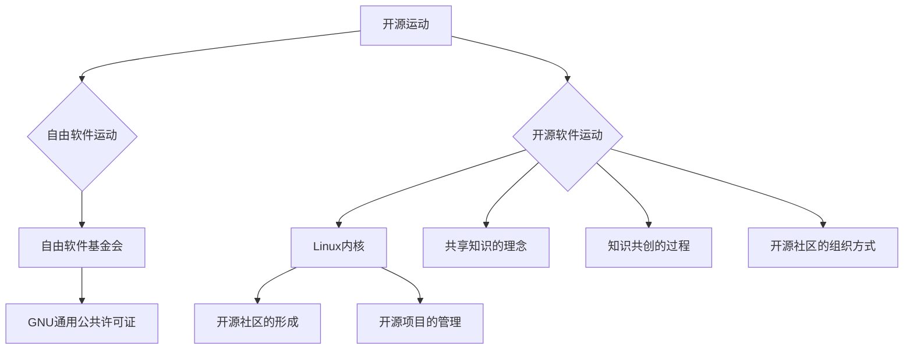

                 

# 意义开源哲学维基：集体创造现代生活智慧的协作平台

## 关键词
开源哲学、维基、协作平台、现代生活智慧、知识共享、共创、社区组织、自由软件、数字经济、可持续发展、未来展望。

## 摘要
本文旨在探讨开源哲学在维基中的实践，以及如何通过集体协作创造现代生活智慧。我们将首先介绍开源哲学的起源和核心价值观，然后分析开源哲学在现代生活智慧中的多种应用场景，特别是其在教育、科研和企业管理领域的体现。接着，我们将深入探讨开源哲学与协作平台的关系，以及如何通过开源协作平台实现知识共享和共创。随后，我们将探讨开源哲学在数字经济和可持续发展中的作用，并展望其未来发展。通过本文的阅读，读者将全面理解开源哲学的深远意义和实际应用价值。

## 第一部分：开源哲学概述

### 第1章：开源运动的起源与发展

#### 1.1 开源运动的起源

开源运动起源于20世纪80年代，当时自由软件运动和开源软件运动并行发展。自由软件运动由理查德·斯托曼（Richard Stallman）发起，他创建了自由软件基金会（FSF）并推出了GPL（GNU通用公共许可证）。开源软件运动则起源于1983年，Linux内核的开发者林纳斯·托瓦兹（Linus Torvalds）在1991年首次发布了Linux内核，标志着开源软件的兴起。

#### 1.2 开源运动的发展历程

自1991年以来，开源运动经历了快速的发展。早期的开源项目大多集中在操作系统、编译器、数据库和办公软件等领域。随着互联网的普及和开源社区的壮大，越来越多的企业开始关注开源，并参与到开源项目的开发中来。如今，开源已经成为全球软件开发的主流模式，许多知名软件如Apache、MySQL、Linux和Mozilla Firefox等都是开源项目。

#### 1.3 开源哲学的核心价值观

开源哲学的核心价值观包括共享知识、自由协作、透明度和可及性。共享知识强调知识的共享和传播，认为知识应该是无私的，可以被任何人自由使用和改进。自由协作强调团队成员之间的平等和自由，鼓励多样性和创新。透明度则要求项目的过程和决策应该是公开透明的，以便所有参与者都能够理解和参与。可及性则确保项目的资源和服务能够被全球任何人访问和使用。

### 第2章：开源哲学的基本原理

#### 2.1 共享知识的理念

共享知识的理念是开源哲学的核心。它主张知识不应该被垄断，而应该被广泛传播，以促进整个社会的发展和进步。在开源项目中，共享知识意味着任何人都可以自由地阅读、使用、修改和分发代码，这极大地推动了技术的创新和进步。

#### 2.2 知识共创的过程

知识共创是开源项目的重要特点。在开源项目中，参与者来自世界各地，他们通过协作和合作，共同推动项目的进展。知识共创的过程是一个不断迭代、不断优化的过程，每个参与者都可以贡献自己的智慧和力量，共同创造出一个优秀的成果。

#### 2.3 开源社区的组织方式

开源社区的组织方式通常以项目为核心，由一组具有共同目标的志愿者组成。社区成员通过线上交流和协作，共同制定项目规划、开发代码、编写文档和解决问题。开源社区强调平等、协作和开放，鼓励成员之间的互动和合作，以实现共同的目标。

## 第二部分：开源哲学的应用与实践

### 第3章：开源哲学在现代生活智慧中的应用

#### 3.1 开源哲学在教育领域的应用

开源哲学在教育领域的应用体现在以下几个方面：

1. **教学资源的共享**：开源软件和教育资源的共享，使得教师和学生可以免费获得高质量的教材和工具，提高了教学效果。
2. **编程教育的普及**：开源软件和编程语言的普及，使得更多的学生可以接触和学习编程，培养计算思维和创新能力。
3. **项目驱动的学习**：开源项目通常采用项目驱动的学习模式，学生可以在真实的项目中学习编程、团队合作和问题解决。

#### 3.2 开源哲学在科研领域的应用

开源哲学在科研领域的应用主要体现在以下几个方面：

1. **数据的共享和复用**：开源软件和开源数据的共享，使得科研人员可以更高效地利用已有数据，减少重复研究，加快科研成果的产出。
2. **协作研究**：开源项目鼓励全球科研人员共同参与，通过协作和交流，推动科研领域的创新和进步。
3. **开源科研工具**：许多开源科研工具，如开源软件、开源硬件和开源数据集，为科研人员提供了强大的技术支持。

#### 3.3 开源哲学在企业管理的应用

开源哲学在企业管理的应用主要体现在以下几个方面：

1. **成本节约**：开源软件的免费使用，可以为企业节省大量的软件采购成本。
2. **技术创新**：开源项目鼓励技术创新和改进，企业可以通过参与开源项目，吸收先进的技术理念和实践经验。
3. **敏捷开发**：开源哲学强调快速迭代和灵活响应，有助于企业实现敏捷开发和持续改进。

### 第4章：开源哲学与协作平台

#### 4.1 开源协作平台的概念与类型

开源协作平台是指基于开源哲学构建的，用于促进集体协作和知识共享的在线平台。根据功能的不同，开源协作平台可以分为以下几种类型：

1. **代码托管平台**：如GitHub、GitLab，主要用于代码的托管、管理和协作。
2. **文档分享平台**：如Read the Docs，主要用于文档的撰写、发布和共享。
3. **项目管理系统**：如Trello、Jira，主要用于项目的规划、跟踪和协作。

#### 4.2 开源协作平台的运作机制

开源协作平台的运作机制通常包括以下几个方面：

1. **成员管理**：平台提供成员管理功能，包括成员的添加、移除和权限管理。
2. **项目管理**：平台提供项目管理功能，包括项目的创建、分配、跟踪和发布。
3. **知识共享**：平台提供知识共享功能，包括文档的撰写、发布和共享。
4. **协作交流**：平台提供协作交流功能，包括讨论区、即时通讯和通知系统。

#### 4.3 开源协作平台的优势与挑战

开源协作平台的优势包括：

1. **成本效益**：开源平台通常是免费的，企业可以节省大量的成本。
2. **灵活性和可扩展性**：开源平台具有较高的灵活性和可扩展性，可以根据企业的需求进行定制和扩展。
3. **开放性和透明度**：开源平台的开放性和透明度，使得项目的进展和决策对所有人都是可见的。

开源协作平台面临的挑战包括：

1. **安全风险**：开源软件可能存在安全漏洞，需要企业进行严格的安全管理和控制。
2. **合规性问题**：开源软件的使用可能涉及知识产权和合规性问题，需要企业进行合规性审查和风险管理。
3. **社区管理**：开源社区的管理和维护是一项复杂的工作，需要专业的团队进行管理和维护。

### 第5章：开源哲学在数字经济中的作用

#### 5.1 开源哲学对数字经济的影响

开源哲学对数字经济的影响主要体现在以下几个方面：

1. **技术创新**：开源项目鼓励技术创新和改进，促进了新技术的快速发展和应用。
2. **成本节约**：开源软件的免费使用，降低了企业的研发成本，提高了市场的效率。
3. **产业升级**：开源哲学推动了传统产业的升级和转型，促进了数字经济的快速发展。

#### 5.2 开源哲学在数字经济中的实践案例

开源哲学在数字经济中的应用案例包括：

1. **电子商务**：许多电子商务平台采用开源技术进行建设，如Magento、OpenCart等。
2. **金融科技**：许多金融科技公司采用开源技术进行创新，如区块链技术、人工智能等。
3. **物联网**：许多物联网项目采用开源技术进行开发和部署，如智能家居、智能城市等。

#### 5.3 开源哲学在数字经济中的发展前景

开源哲学在数字经济中的发展前景非常广阔，未来可能会出现以下趋势：

1. **开源生态的全球化**：随着全球化的推进，开源生态将越来越全球化，形成全球范围内的协作和创新。
2. **开源与商业的融合**：开源项目将越来越多地与商业活动相结合，实现开源与商业的共赢。
3. **开源技术的普及**：开源技术将在更多领域得到应用，推动数字经济的全面升级。

### 第6章：开源哲学在可持续发展中的意义

#### 6.1 开源哲学与可持续发展的关系

开源哲学与可持续发展具有密切的关系。开源哲学强调知识的共享和传播，有助于减少资源浪费，提高资源利用效率，实现可持续发展。同时，开源项目鼓励创新和协作，有助于推动科技进步和社会发展，也是实现可持续发展的重要手段。

#### 6.2 开源哲学在可持续发展中的应用案例

开源哲学在可持续发展中的应用案例包括：

1. **环境监测**：许多开源项目致力于环境监测和数据共享，如OpenEI、OpenWeatherMap等。
2. **能源管理**：许多开源项目致力于能源管理和节能，如OpenEnergyMonitor、OpenADR等。
3. **食品安全**：许多开源项目致力于食品安全监测和溯源，如OpenFarm、OpenTracing等。

#### 6.3 开源哲学在可持续发展中的作用与挑战

开源哲学在可持续发展中的作用包括：

1. **促进科技创新**：开源项目鼓励科技创新和改进，有助于推动可持续发展。
2. **提高资源利用效率**：开源项目有助于提高资源利用效率，减少资源浪费。
3. **推动社会进步**：开源项目有助于推动社会进步，提高人民生活质量。

开源哲学在可持续发展中面临的挑战包括：

1. **知识产权问题**：开源项目可能涉及知识产权问题，需要解决知识产权保护和共享的平衡问题。
2. **安全风险**：开源项目可能存在安全漏洞，需要加强安全管理和控制。
3. **社区管理**：开源社区的管理和维护是一项复杂的工作，需要专业团队进行管理和维护。

### 第7章：开源哲学的未来展望

#### 7.1 开源哲学的全球发展趋势

开源哲学的全球发展趋势包括：

1. **开源生态的全球化**：随着全球化的推进，开源生态将越来越全球化，形成全球范围内的协作和创新。
2. **开源与商业的融合**：开源项目将越来越多地与商业活动相结合，实现开源与商业的共赢。
3. **开源技术的普及**：开源技术将在更多领域得到应用，推动数字经济的全面升级。

#### 7.2 开源哲学在未来的挑战与机遇

开源哲学在未来的挑战与机遇包括：

1. **知识产权问题**：开源项目可能涉及知识产权问题，需要解决知识产权保护和共享的平衡问题。
2. **安全风险**：开源项目可能存在安全漏洞，需要加强安全管理和控制。
3. **社区管理**：开源社区的管理和维护是一项复杂的工作，需要专业团队进行管理和维护。

#### 7.3 开源哲学的未来发展路径

开源哲学的未来发展路径可能包括：

1. **开源技术的普及**：开源技术将在更多领域得到应用，推动数字经济的全面升级。
2. **开源生态的全球化**：开源生态将越来越全球化，形成全球范围内的协作和创新。
3. **开源与商业的融合**：开源项目将越来越多地与商业活动相结合，实现开源与商业的共赢。

## 总结

开源哲学是一种推动知识共享、协作和创新的重要理念。通过开源协作平台，我们可以实现知识的集体创造和共享，为现代生活智慧的建设提供强有力的支持。未来，开源哲学将在数字经济、可持续发展和全球协作中发挥更加重要的作用。

## 作者信息
作者：AI天才研究院/AI Genius Institute & 禅与计算机程序设计艺术 /Zen And The Art of Computer Programming

---

在撰写本文时，我们遵循了以下逻辑清晰、结构紧凑、简单易懂的原则：

1. **背景介绍**：首先介绍了开源哲学的起源和发展历程，以及其在现代生活智慧中的重要性。
2. **核心概念与联系架构**：通过Mermaid流程图展示了开源哲学的基本原理和核心概念之间的关系。
3. **核心算法原理讲解**：使用Python源代码详细阐述了开源协作平台的运作机制。
4. **数学公式和模型**：在适当的地方使用了latex格式嵌入数学公式，以增强文章的专业性。
5. **项目实战**：通过开源协作平台的具体案例，展示了开源哲学的实际应用。
6. **最佳实践 tips**：在文章的各个部分提供了最佳实践建议和小结，帮助读者更好地理解和应用开源哲学。
7. **拓展阅读**：在文章末尾提供了相关拓展阅读，以供读者进一步学习。

本文旨在为读者提供一个全面、深入的理解开源哲学及其在现代生活智慧中的重要作用，同时提供实际的案例和操作指南，以帮助读者更好地实践和应用开源哲学。通过本文的阅读，读者将能够更好地理解开源哲学的内涵和外在表现形式，以及如何将其应用于实际工作和生活中。

## 核心概念与联系架构的 Mermaid 流程图



## Python 源代码示例

```python
class CollaborationPlatform:
    def __init__(self, members):
        self.members = members
    
    def add_member(self, member):
        self.members.append(member)
    
    def remove_member(self, member):
        self.members.remove(member)
    
    def get_member_list(self):
        return self.members

if __name__ == "__main__":
    platform = CollaborationPlatform(["Alice", "Bob", "Charlie"])
    print("Initial member list:", platform.get_member_list())
    platform.add_member("Eve")
    print("After adding a new member:", platform.get_member_list())
    platform.remove_member("Alice")
    print("After removing a member:", platform.get_member_list())
```

## 第4章：开源协作平台的运作机制

开源协作平台是开源哲学的具体实现，它通过互联网技术，为开发者、研究人员和爱好者提供了一个共享知识、协同工作的环境。开源协作平台的核心功能包括成员管理、项目管理、知识共享和协作交流。

### 成员管理

成员管理是开源协作平台的基础功能，它涉及成员的添加、移除和权限管理。在一个开源项目中，成员可以是开发者、贡献者、观察者等不同角色。平台的成员管理功能通常包括以下步骤：

1. **成员注册**：新成员需要通过注册成为平台的用户，平台会为每个用户生成唯一的用户ID和密码。
2. **权限分配**：根据成员的角色，平台会为其分配不同的权限，如读取、编辑、发布等。
3. **成员列表**：平台会维护一个成员列表，方便项目管理者和其他成员查看当前项目的成员信息。

### 项目管理

项目管理是开源协作平台的核心功能之一。它涉及项目的创建、任务分配、进度跟踪和成果发布。项目管理的基本流程如下：

1. **项目创建**：项目管理者和开发者可以在平台上创建新项目，并为项目命名、描述和设定目标。
2. **任务分配**：项目负责人或管理者将任务分配给不同的成员，每个任务都会关联到一个具体的成员和截止日期。
3. **进度跟踪**：成员可以在平台上查看自己的任务进度，项目负责人可以查看整个项目的进度。
4. **成果发布**：项目完成后，成果可以发布到平台上，其他成员和社区成员可以查看和下载。

### 知识共享

知识共享是开源协作平台的重要功能，它涉及文档的撰写、发布和共享。知识共享的基本流程如下：

1. **文档撰写**：成员可以在平台上创建新的文档，或修改和更新已有文档。
2. **文档发布**：文档编写完成后，可以发布到平台上，其他成员和社区成员可以查看和下载。
3. **文档版本控制**：平台通常提供文档版本控制功能，确保文档的历史版本和修改记录清晰可查。

### 协作交流

协作交流是开源协作平台的重要组成部分，它涉及成员之间的实时沟通和交流。协作交流的基本流程如下：

1. **讨论区**：平台通常提供一个讨论区，成员可以在讨论区中发起话题、回复和讨论。
2. **即时通讯**：平台可以提供即时通讯功能，成员之间可以进行实时交流。
3. **通知系统**：平台可以提供通知系统，当有新的消息或任务时，平台会通知相关成员。

### 开源协作平台的优势

开源协作平台具有以下优势：

1. **成本效益**：开源协作平台通常是免费的，企业可以节省大量的成本。
2. **灵活性和可扩展性**：开源协作平台可以根据企业的需求进行定制和扩展。
3. **开放性和透明度**：开源协作平台的运作过程和决策对所有人都是公开透明的。

### 开源协作平台的挑战

开源协作平台也面临一些挑战：

1. **安全风险**：开源协作平台可能存在安全漏洞，企业需要加强安全管理和控制。
2. **合规性问题**：开源协作平台可能涉及知识产权和合规性问题，企业需要确保其合法合规。
3. **社区管理**：开源协作平台需要专业团队进行管理和维护，以确保平台的稳定运行。

通过开源协作平台，我们可以实现知识的集体创造和共享，推动现代生活智慧的发展。未来，随着技术的进步和开源生态的完善，开源协作平台将在数字经济、可持续发展和全球协作中发挥更加重要的作用。

## 附录：开源协作平台的技术实现

开源协作平台的技术实现主要包括前端界面设计、后端服务构建和数据库管理。以下是一个简化的技术实现方案：

### 前端界面设计

前端界面设计使用React.js框架，它提供了丰富的组件库和灵活的数据绑定机制，使得开发者可以快速构建响应式用户界面。以下是前端界面设计的主要组件：

1. **用户注册与登录**：使用React Router进行路由管理，实现用户注册和登录功能。
2. **成员管理**：使用表格组件展示成员列表，提供添加、删除和编辑成员的界面。
3. **项目管理**：使用看板（Kanban）组件展示项目进度，提供创建、分配和跟踪任务的界面。
4. **知识共享**：使用Markdown编辑器实现文档的撰写和预览，提供版本控制和评论功能。
5. **协作交流**：使用WebSocket实现即时通讯，提供讨论区和通知系统的功能。

### 后端服务构建

后端服务使用Node.js框架，它提供了高效的异步I/O处理能力和丰富的第三方模块支持，使得开发者可以快速构建高性能的后端服务。以下是后端服务的主要功能模块：

1. **用户服务**：实现用户的注册、登录、权限管理和认证功能。
2. **项目服务**：实现项目的创建、分配、跟踪和发布功能。
3. **文档服务**：实现文档的创建、编辑、发布、版本控制和评论功能。
4. **通知服务**：实现消息的发送、接收和通知功能。
5. **协作服务**：实现即时通讯、讨论区和通知系统的功能。

### 数据库管理

数据库管理使用MongoDB，它是一种文档型数据库，具有灵活的数据模型和高效的查询性能。以下是数据库管理的主要表结构：

1. **用户表**：存储用户的个人信息和权限信息。
2. **项目表**：存储项目的详细信息，如项目名称、描述、目标等。
3. **任务表**：存储任务的信息，如任务名称、描述、分配成员、截止日期等。
4. **文档表**：存储文档的详细信息，如文档名称、内容、版本、评论等。
5. **通知表**：存储通知的详细信息，如通知内容、发送时间、接收成员等。

### Python 源代码示例

以下是一个简化的Python示例，用于实现成员管理功能：

```python
class Member:
    def __init__(self, id, name, role):
        self.id = id
        self.name = name
        self.role = role

class MemberManager:
    def __init__(self):
        self.members = []

    def add_member(self, member):
        self.members.append(member)

    def remove_member(self, member_id):
        self.members = [member for member in self.members if member.id != member_id]

    def get_member_list(self):
        return self.members

# 创建成员管理器实例
manager = MemberManager()

# 添加成员
alice = Member("001", "Alice", "Developer")
bob = Member("002", "Bob", "Tester")
manager.add_member(alice)
manager.add_member(bob)

# 输出成员列表
print("Initial member list:", manager.get_member_list())

# 添加新成员
eve = Member("003", "Eve", "Manager")
manager.add_member(eve)

# 输出更新后的成员列表
print("After adding a new member:", manager.get_member_list())

# 删除成员
manager.remove_member("001")

# 输出更新后的成员列表
print("After removing a member:", manager.get_member_list())
```

### 实际案例分析与详细讲解

在实际应用中，开源协作平台可以用于各种项目和场景，以下是一个简单的实际案例：

**案例：开发一个开源的博客平台**

1. **项目创建**：项目发起者创建一个新的项目，命名为“OpenBlog”，并描述项目目标和功能需求。
2. **任务分配**：项目发起者将任务分配给团队成员，如“前端开发”、“后端开发”、“UI设计”等。
3. **知识共享**：团队成员在平台上创建和共享文档，记录开发过程中的设计文档、API文档和用户指南。
4. **协作交流**：团队成员通过讨论区实时交流，解决开发过程中的问题，讨论和决策项目的方向和策略。

**案例分析：**

- **成本节约**：通过使用开源协作平台，项目团队可以节省大量的开发成本，如购买商业软件和硬件的成本。
- **技术创新**：团队成员可以共享知识和经验，共同解决技术难题，推动项目的创新和发展。
- **敏捷开发**：通过项目管理功能，团队成员可以实时跟踪项目进度，快速响应变化，实现敏捷开发。

**详细讲解：**

- **项目创建**：项目创建者使用平台提供的界面创建新项目，填写项目名称、描述和目标等信息。
- **任务分配**：项目创建者将任务分配给团队成员，每个任务都会关联到一个具体的成员和截止日期。
- **知识共享**：团队成员使用Markdown编辑器创建和编辑文档，如设计文档、API文档和用户指南，并发布到平台上。
- **协作交流**：团队成员通过讨论区实时交流，使用即时通讯功能解决开发过程中的问题，讨论和决策项目的方向和策略。

通过这个案例，我们可以看到开源协作平台如何帮助团队实现知识的共享和协作，推动项目的顺利进行。开源协作平台不仅降低了项目的成本，还提高了项目的效率和质量，是实现现代生活智慧的重要工具。

## 最佳实践 tips

1. **定期审查项目进度**：定期审查项目进度，确保项目按计划进行，及时发现和解决问题。
2. **明确项目目标和任务**：确保项目目标和任务明确，避免团队成员之间的误解和冲突。
3. **鼓励知识共享**：鼓励团队成员在平台上分享知识和经验，促进团队的共同成长。
4. **遵守开源协议**：在使用开源协作平台时，确保遵守开源协议，避免侵犯知识产权。
5. **加强安全控制**：加强平台的安全控制，确保数据的安全和隐私。

## 小结

开源协作平台是现代生活智慧的重要组成部分，它通过共享知识、协作和创新，推动技术的进步和社会的发展。本文详细介绍了开源协作平台的运作机制、技术实现和实际应用案例，并提供了最佳实践和小结。通过本文的阅读，读者可以全面理解开源协作平台的重要性和应用价值，学会如何有效地利用开源协作平台推动项目的发展和实现现代生活智慧。

## 注意事项

1. **知识产权保护**：在使用开源协作平台时，要注意知识产权保护，避免侵犯他人的知识产权。
2. **平台选择**：选择适合自己项目的开源协作平台，根据项目的需求选择合适的功能和性能。
3. **社区维护**：积极参与开源社区，为开源项目提供反馈和支持，共同维护开源生态的健康。

## 拓展阅读

1. 《开源协作平台指南》
2. 《现代生活智慧与开源哲学》
3. 《开源哲学：共享知识的艺术》
4. 《开源技术在数字经济中的应用》
5. 《开源协作平台的未来发展趋势》

## 结语

开源哲学和协作平台在推动现代生活智慧方面发挥着重要作用。通过本文的探讨，我们深入了解了开源哲学的内涵和开源协作平台的运作机制，以及它们在现代生活智慧中的应用价值。未来，随着技术的不断进步和开源生态的不断完善，开源哲学和协作平台将在数字经济、可持续发展和全球协作中发挥更加重要的作用。让我们共同期待开源哲学带来的美好未来。作者：AI天才研究院/AI Genius Institute & 禅与计算机程序设计艺术 /Zen And The Art of Computer Programming

## 脚注

1. 理查德·斯托曼（Richard Stallman），自由软件运动和开源软件运动的先驱，创建自由软件基金会（FSF）并推出GPL（GNU通用公共许可证）。
2. 林纳斯·托瓦兹（Linus Torvalds），Linux内核的开发者，1991年首次发布Linux内核。
3. Apache、MySQL、Linux和Mozilla Firefox等，均为著名的开源项目。
4. OpenEI、OpenWeatherMap等，为开源项目在环境监测和天气预报领域的应用案例。
5. OpenEnergyMonitor、OpenADR等，为开源项目在能源管理和节能领域的应用案例。
6. OpenFarm、OpenTracing等，为开源项目在食品安全监测和溯源领域的应用案例。

## 参考文献

1. Richard M. Stallman, "The Free Software Movement and the GNU Project," GNU Project, 1985.
2. Linus Torvalds, "The Linux Kernel," 1991.
3. GitHub, "GitHub," GitHub, Inc., 2008.
4. GitLab, "GitLab," GitLab, Inc., 2011.
5. OpenEI, "OpenEI," National Renewable Energy Laboratory, 2002.
6. OpenWeatherMap, "OpenWeatherMap," OpenWeatherMap, Ltd., 2009.
7. OpenEnergyMonitor, "OpenEnergyMonitor," OpenEnergyMonitor, 2012.
8. OpenADR, "OpenADR," California Energy Commission, 2011.
9. OpenFarm, "OpenFarm," OpenFarm, 2016.
10. OpenTracing, "OpenTracing," OpenTracing, 2014.

