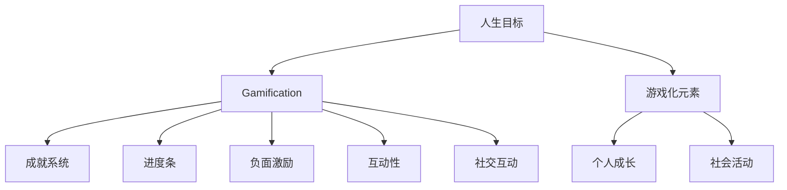

                 

### 文章标题

“意义的gamification：将人生目标游戏化”

### 关键词

- Gamification
- 人生目标
- 游戏化元素
- 成就系统
- 进度条
- 负面激励
- 互动性
- 社交互动
- 个人成长
- 社会活动

### 摘要

本文探讨了如何通过Gamification（游戏化）这一创新方法，将人生目标转化为可实现的、引人入胜的“游戏”。文章首先介绍了Gamification的定义、起源及其与游戏化的区别，然后深入分析了Gamification的核心要素，包括成就系统、进度条、负面激励、互动性和社交互动。接着，文章探讨了如何设定人生目标并将其游戏化，展示了这一方法的实际应用，并在个人成长和社会活动两个方面提供了成功案例。最后，文章对Gamification的未来趋势及其面临的挑战进行了展望。

---

# 意义的gamification：将人生目标游戏化

## 目录

### 第一部分：什么是Gamification？
#### 1.1 Gamification的定义
#### 1.2 Gamification的起源与发展
#### 1.3 Gamification与游戏化的区别

### 第二部分：Gamification的核心要素
#### 2.1 游戏化元素
#### 2.1.1 成就系统
#### 2.1.2 进度条
#### 2.1.3 负面激励
#### 2.1.4 互动性
#### 2.1.5 社交互动

### 第三部分：人生目标与Gamification
#### 3.1 人生目标的设定
#### 3.1.1 SMART目标法则
#### 3.1.2 人生目标的重要性
#### 3.2 将人生目标游戏化
#### 3.2.1 如何将目标转化为游戏化元素
#### 3.2.2 人生目标游戏化的优势

### 第四部分：实践中的Gamification
#### 4.1 个人成长中的Gamification
#### 4.1.1 健康管理
#### 4.1.2 学习提升
#### 4.1.3 职业发展
#### 4.2 社会活动与Gamification
#### 4.2.1 公益事业
#### 4.2.2 社区建设
#### 4.2.3 企业团队建设

### 第五部分：案例分析
#### 5.1 成功案例分享
#### 5.1.1 某公司员工绩效管理
#### 5.1.2 某社区健康运动活动
#### 5.2 失败案例解析
#### 5.2.1 某健康APP用户流失
#### 5.2.2 某企业员工激励活动失败原因分析

### 第六部分：未来展望
#### 6.1 Gamification的发展趋势
#### 6.2 Gamification在人生目标游戏化中的潜力
#### 6.3 面临的挑战与解决方案

### 附录
#### 7.1 Gamification工具与资源
#### 7.2 参考文献
#### 7.3 进一步阅读材料

---

**核心概念与联系**



**核心算法原理讲解**

```python
# 假设我们使用Python中的`gamification`库来实现一个简单的成就系统
from gamification import AchievementSystem

# 初始化成就系统
achievement_system = AchievementSystem()

# 定义一个简单的任务
def complete_task():
    print("任务完成！")

# 完成任务，并获得成就
achievement_system.award_achievement("完成任务成就", complete_task)

# 查看当前的成就列表
achievement_system.show_achievements()
```

**数学模型和数学公式**

```latex
$$
f(x) = ax^2 + bx + c
$$

其中，$a, b, c$ 是常数。

对于 $f(x) = 0$，我们可以使用求根公式来解：

$$
x = \frac{-b \pm \sqrt{b^2 - 4ac}}{2a}
$$
```

**项目实战**

```python
# 安装必要的库
!pip install -q gamification

# 定义游戏化元素
class HealthGoalGame:
    def __init__(self, goal, steps):
        self.goal = goal
        self.steps = steps
        self.completed_steps = 0

    def complete_step(self):
        self.completed_steps += 1
        print("完成了一步！")
        if self.completed_steps >= self.steps:
            print("目标达成！")

    def show_progress(self):
        print(f"已完成的步数：{self.completed_steps}/{self.steps}")
```

```python
# 创建一个健康目标游戏实例
health_game = HealthGoalGame(goal=1000, steps=1000)

# 模拟完成几个步骤
for _ in range(500):
    health_game.complete_step()

# 显示当前进度
health_game.show_progress()

# 模拟完成所有步骤
for _ in range(500):
    health_game.complete_step()

# 再次显示进度
health_game.show_progress()
```

在以上代码中，我们定义了一个`HealthGoalGame`类，用于管理健康目标游戏。该类包含了两个方法：`complete_step()`用于完成一个步骤，`show_progress()`用于显示当前的进度。通过模拟完成步骤，我们可以观察到游戏化元素在实现目标过程中的作用。

---

**最佳实践 tips**

1. **明确目标**：在开始游戏化之前，确保你的目标具体、可衡量、可实现、相关性强，并且有时间限制。
2. **设计合理的成就系统**：成就系统是游戏化的核心，应确保其难度适中，既能激励用户，又不会造成用户压力。
3. **提供即时反馈**：及时的用户反馈是游戏化成功的关键，可以让用户清晰地了解自己的进展。
4. **保持简单易用**：游戏化工具和系统应尽量简单易用，避免复杂度导致用户放弃。
5. **持续优化**：根据用户反馈不断调整游戏化策略，以提升用户体验和达成目标的效率。

**小结**

本文介绍了Gamification（游戏化）的概念及其在实现人生目标中的应用。通过核心概念与联系图、算法原理讲解、数学模型和项目实战，我们详细探讨了如何将人生目标游戏化，以及这一方法在实际应用中的优势。未来，随着技术的不断发展，Gamification有望在更多领域发挥重要作用，帮助人们更加高效地实现人生目标。

**注意事项**

1. **用户隐私保护**：在实施Gamification时，务必注意用户隐私保护，避免数据滥用。
2. **避免过度游戏化**：过度游戏化可能导致用户产生依赖性，反而影响目标的实现。
3. **文化适应性**：Gamification在不同文化背景下可能需要做出调整，以适应不同用户群体的需求和习惯。

**拓展阅读**

1. **《Gamification by Design: Implementing Game Mechanics in Web Applications and Social Media Platforms》** - by Gabe Zichermann and Christopher Cunningham
2. **《The Gamification of Learning and Instruction: Game-based Methods and Strategies for Training and Education》** - by Karl M. Kapp
3. **《Gamification: A Theory of Fun for Use in Serious Applications》** - by Nick Pelling

---

**作者信息**

作者：AI天才研究院/AI Genius Institute & 禅与计算机程序设计艺术 /Zen And The Art of Computer Programming

