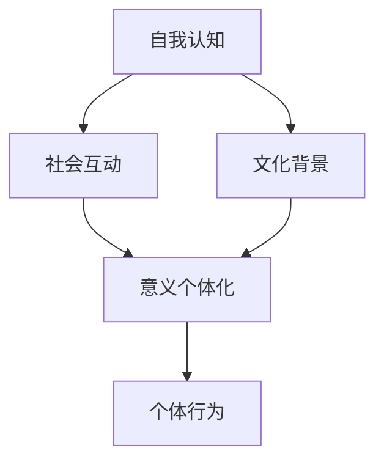

                 

### 引言

在现代信息技术和人工智能迅猛发展的背景下，我们的日常生活和工作模式正在经历深刻变革。在这个时代，个体化与社会责任成为了两个备受关注的核心概念。意义，作为人类行为的内在驱动力，对个体而言，是自我实现和幸福感的重要源泉；而社会责任，则代表着个体在社会大环境中的角色和责任。个体化与社会责任的平衡，成为了我们在追求自我价值的同时，需要认真思考和实践的重要课题。

个体化，指的是个体根据自己的经历、价值观和信念，对事物进行主观解读和赋予意义的过程。它强调的是个体的独特性和自主性。社会责任，则是指个体或组织对社会产生的义务和责任，涉及到环境保护、社会公正、公益事业等多个方面。社会责任的提出，是对个体行为的外部约束，也是对个体在社会中角色的定位。

在信息技术和人工智能领域，个体化与社会责任的平衡尤为重要。一方面，技术的发展使得个体能够更自由地表达自我，实现个人价值；另一方面，技术本身也带来了诸如隐私泄露、数据滥用等问题，这些问题需要通过社会责任的视角来解决。如何在追求技术进步的同时，保持个体与社会责任的平衡，成为了我们亟需解决的关键问题。

本文将围绕“意义的个人化与社会责任的平衡”这一主题，首先介绍个体化与社会责任的基本概念，然后深入探讨它们在信息技术和人工智能领域的应用和挑战。接下来，文章将分析个体化与社会责任之间的联系，并通过实际案例和算法原理讲解，阐述如何在实践中实现这一平衡。最后，文章将总结个体化与社会责任的关系，并提出未来研究的方向。

通过本文的讨论，我们希望读者能够对个体化与社会责任的平衡有一个更深入的理解，并在实际工作和生活中找到适合自己的平衡点。

### 关键词

- **个体化**
- **社会责任**
- **信息技术**
- **人工智能**
- **意义**
- **平衡**

### 摘要

本文探讨了“意义的个人化与社会责任的平衡”这一主题，分析了个体化与社会责任在信息技术和人工智能领域中的重要性。通过定义和实例，我们了解了个体化视角下意义的主观性及其来源，并探讨了个体如何在社会互动和文化背景下构建对事物的意义。同时，文章也讨论了社会责任的定义、重要性及其实现策略，包括个体责任、集体行动以及政策引导。

在核心算法原理讲解部分，我们通过具体的Python代码和数学模型，详细阐述了如何通过算法实现意义的个体化和社会责任的平衡。最后，文章总结了个体化与社会责任之间的关系，并提出了未来研究的方向。希望通过本文的探讨，能够帮助读者在追求个人价值的同时，也能承担起相应的社会责任。

### 1.1.1 意义的个体化

**2.1.1.1 个体化视角下的意义**

意义的个体化是指个体根据自己的经历、价值观和信念，对事物进行主观解读和赋予意义的过程。个体化视角下的意义，强调的是每个个体对世界的独特理解和价值判断。

**定义与解释**

意义是个体对事物赋予的主观价值、目的或意义。在个体化视角下，意义不再是一个固定的、客观存在的东西，而是由个体的主观经验所构建的。每个人根据自己的生活经历、教育背景、文化环境等因素，对同一事物可能产生截然不同的看法和解读。例如，对一幅画的欣赏，不同的人可能会从不同的角度去解读其内涵和情感表达。

**案例讨论**

为了更直观地理解个体化视角下的意义，我们可以通过一个简单的案例来分析。假设一个公司组织了一次团队建设活动，活动形式是登山。对于这次活动，不同的员工可能会有不同的看法和解读：

- 对于热爱户外运动的员工，这次登山活动可能是一次放松身心、锻炼身体的机会。
- 对于喜欢社交的员工，这次活动可能是一次结识新朋友、增进团队凝聚力的机会。
- 对于不擅长运动或对社交不感兴趣的员工，这次活动可能是一次压力和挑战，甚至可能带来不适和困扰。

这个案例清楚地展示了个体化视角下意义的主观性。同样的活动，不同的人赋予的意义截然不同，这是因为每个人的背景、价值观和信念不同。

**实证研究**

在心理学和哲学领域，有许多研究探讨了意义个体化的现象。例如，心理学家马斯洛（Abraham Maslow）提出了“需求层次理论”，认为个体的行为和选择受到不同层次需求的驱动，这些需求包括生理需求、安全需求、社交需求、尊重需求和自我实现需求。不同层次的需求决定了个体对事物的看法和赋予的意义。

在哲学领域，存在主义哲学家如萨特（Jean-Paul Sartre）和海德格尔（Martin Heidegger）则强调了个体自由和选择的重要性。他们认为，个体在生活过程中不断地进行选择和决策，这些选择和决策构成了个体的意义世界。

**个体化视角下的意义来源**

1. **自我认知**：个体如何通过自我认知来构建对事物的意义。

个体对自己的认知越清晰，越能够准确地理解自己的需求和期望，从而对事物赋予更符合自身价值观的意义。例如，一个对自己有明确职业规划的个体，可能会对与其职业目标相关的事物赋予更高的意义。

2. **社会互动**：个体在社会互动过程中如何获得和塑造对事物的意义。

个体在社会互动中通过与他人的交流、合作和竞争，逐渐形成对事物的共同理解。这种共同理解可以帮助个体在社会中找到归属感和价值感。例如，一个加入新团队的员工，通过与团队成员的互动，可能会重新审视自己对团队活动和项目的看法。

3. **文化背景**：文化对个体化视角下意义形成的影响。

不同的文化背景会影响个体对事物的看法和赋予的意义。例如，在一些集体主义文化中，个体可能会更加重视团队合作和社会责任，而在一些个人主义文化中，个体可能会更加重视个人自由和自我实现。

**个体化视角下的意义实践**

1. **意义寻找**：个体如何通过自我探索来寻找生命中的意义。

个体可以通过自我反思、阅读、旅行、艺术创作等方式，来探索和理解生命的意义。这种探索过程有助于个体找到与自己价值观相符的意义，从而提高生活的满意度和幸福感。

2. **意义实践**：个体如何将寻找到的意义应用于日常生活中。

个体可以将寻找到的意义转化为具体的行为和决策，例如，通过参与公益活动、追求自己的梦想、培养人际关系等方式，来实现个人价值和幸福感。

3. **意义传承**：个体如何将意义传递给下一代。

个体可以通过教育、传承家族价值观、参与社区活动等方式，将找到的意义传递给下一代。这种传承有助于下一代在成长过程中找到自己的方向和目标，从而实现生命的连续性和意义。

通过以上讨论，我们可以看出，意义的个体化是一个复杂而多样的过程，它不仅受到个体自身因素的影响，还受到社会和文化背景的制约。在个体化视角下，理解意义的关键在于认识到每个个体对事物的独特解读和主观价值，从而更好地实现自我价值和承担社会责任。

### 1.1.2 社会责任的平衡

**2.1.2.1 社会责任的定义与重要性**

社会责任是指组织或个人对社会产生的义务和责任。它超越了法律和道德的基本要求，是一种自愿的行为，旨在通过积极的社会贡献来提升社会福祉。社会责任涉及到环境保护、社会公正、公益事业等多个方面，其重要性不可忽视。

**定义与解释**

社会责任的定义可以从几个不同的角度来理解。从企业角度来看，社会责任是指企业在其商业活动中，不仅要追求经济利益，还要关注社会和环境的影响。具体来说，企业需要承担以下几方面的责任：

1. **经济责任**：确保企业的经济活动能够带来经济效益，为投资者和社会创造价值。
2. **法律责任**：遵守法律法规，确保企业的行为合法合规。
3. **伦理责任**：在经营过程中遵循道德规范，确保企业的行为符合社会伦理标准。
4. **环境责任**：关注环境保护，减少环境污染，促进可持续发展。
5. **社会贡献**：通过公益活动、慈善捐赠等方式，回馈社会，提升社会福祉。

从个人角度来看，社会责任是指每个人在社会中应承担的义务和责任。具体来说，个人需要承担以下几方面的责任：

1. **家庭责任**：照顾家人，提供经济和精神支持。
2. **职业责任**：在工作中尽职尽责，为社会创造价值。
3. **社会责任**：参与社会公益活动，关注社会问题，为改善社会环境贡献力量。
4. **法律和道德责任**：遵守法律法规，遵循社会道德规范。

**重要性**

社会责任在现代社会中的重要性体现在以下几个方面：

1. **可持续性**：通过承担社会责任，企业可以提升其品牌形象，获得消费者的信任和支持，从而实现长期可持续发展。
2. **社会公正**：社会责任有助于促进社会公正，减少贫富差距，实现社会资源的公平分配。
3. **环境保护**：通过环境保护责任，企业可以减少对自然环境的破坏，保护生态系统，促进可持续发展。
4. **社会稳定**：社会责任有助于提升社会的整体稳定性和和谐度，减少社会冲突和矛盾。
5. **个体成长**：通过参与社会责任活动，个人可以提升自我价值，培养团队合作精神，增强社会归属感。

**个体与社会责任的关系**

个体与社会责任之间存在着密切的联系。一方面，个体的行为对社会产生影响，每个个体的社会责任履行情况共同塑造了社会的整体风貌。另一方面，社会为个体提供了生存和发展的环境，个体需要通过承担社会责任来回报社会。

**个体责任的局限性**

个体在社会责任中扮演着重要角色，但个体责任也有其局限性。一方面，个体的资源和能力有限，无法独立解决复杂的社会问题。例如，单凭个人的力量难以解决大规模的贫困问题或环境污染问题。另一方面，个体责任容易导致社会责任的分散化和碎片化，缺乏系统性和全局性。

**社会责任的集体行动**

为了克服个体责任的局限性，需要通过集体行动来实现社会责任。集体行动可以集中资源和力量，形成规模效应，解决个体无法单独解决的问题。例如，企业可以通过集体行动进行大型公益活动，政府可以通过政策引导和资金支持，推动社会问题的解决。

**社会制度的支持**

社会制度的支持是实现社会责任平衡的重要保障。社会制度可以通过法律、政策、教育和文化等多种方式，引导和激励个体履行社会责任。例如，政府可以通过立法来规范企业的社会责任行为，通过税收优惠和政策支持来鼓励企业的公益活动。教育系统可以通过课程设置和实践活动，培养学生的社会责任感。

总之，个体化与社会责任的平衡是一个复杂而动态的过程。个体需要在社会责任中找到自己的位置，同时社会也需要为个体提供支持和保障。通过个体和社会的共同努力，可以实现意义的个人化与社会责任的平衡，促进个体和社会的共同发展。

### 1.1.3 个体化与社会责任的平衡

**2.1.3.1 平衡的必要性**

个体化与社会责任的平衡在现代社会中显得尤为重要。这一平衡不仅关系到个体的自我实现和社会的可持续发展，也影响到整个社会的稳定和和谐。个体化视角下的意义赋予了个体独特的价值追求和自由意志，而社会责任则确保了个体行为不会对社会造成负面影响。

**个体自主与社会需求的冲突**

个体自主是指个体在追求自我价值和实现个人目标的过程中，拥有自由选择和行动的权利。然而，这种自由并非无限制的。社会需求，即社会对个体行为和贡献的期待，往往通过法律法规、道德规范和社会习俗等形式，对个体的行为进行约束。这种约束在一定程度上限制了个体自主，以确保个体行为符合社会的基本规范和利益。

个体自主与社会需求之间的冲突体现在以下几个方面：

1. **价值观的冲突**：个体价值观和社会价值观可能存在差异，导致个体在追求自我实现时与社会期望发生冲突。例如，一个追求自由和创新的个体可能与社会期望的稳定和保守发生矛盾。
2. **资源分配的冲突**：个体的资源有限，需要在不同目标之间进行分配。个体可能会倾向于将更多资源用于个人发展和享受，而忽视社会责任。例如，一个追求高薪职位的个体可能会忽视对家庭和社会的贡献。
3. **行为规范的冲突**：社会规范和道德标准要求个体遵守公共秩序和社会道德，而个体可能会出于个人兴趣或偏好而违反这些规范。例如，一个追求个人自由的个体可能会忽视公共安全和社会公德。

**平衡的意义**

个体化与社会责任的平衡具有重要意义，它有助于实现以下几个方面的目标：

1. **个体自我实现**：通过平衡个体化与社会责任，个体可以在追求自我价值的同时，履行社会责任，实现自我价值的最大化。
2. **社会和谐**：个体化与社会责任的平衡有助于减少个体与社会之间的矛盾和冲突，促进社会的稳定和和谐。
3. **可持续发展**：通过平衡个体化与社会责任，可以确保个体行为不会对社会和环境造成长期的负面影响，实现可持续发展。
4. **社会公正**：个体化与社会责任的平衡有助于促进社会公正，确保每个个体在实现自我价值的同时，也承担相应的社会责任。

**个体化与社会责任平衡的积极影响**

1. **提高生活质量**：通过平衡个体化与社会责任，个体可以在追求自我价值的同时，享受到更高的生活质量和幸福感。
2. **增强社会凝聚力**：个体化与社会责任的平衡有助于增强社会成员之间的互信和合作，提升社会的整体凝聚力。
3. **促进创新与进步**：个体化与社会责任的平衡鼓励个体在追求创新和进步的同时，关注社会需求，从而推动社会的整体发展。

**个体化与社会责任平衡的挑战**

尽管个体化与社会责任的平衡具有重要意义，但实现这一平衡也面临一些挑战：

1. **价值观的多元化**：社会中的价值观越来越多元化，个体与社会之间的价值观冲突可能加剧。
2. **资源分配的不均衡**：个体资源有限，如何在追求自我价值和社会责任之间进行合理分配，是一个复杂的课题。
3. **社会责任的承担**：如何在个体行为中有效融入社会责任，避免社会责任的分散化和碎片化，是一个需要深入探讨的问题。

**实现个体化与社会责任平衡的路径**

为了实现个体化与社会责任的平衡，可以采取以下路径：

1. **自我反思**：个体可以通过自我反思，明确自己的价值观和目标，从而在追求自我价值的同时，合理承担社会责任。
2. **社会支持**：社会可以通过教育、法律和政策等多种方式，为个体实现个体化与社会责任的平衡提供支持和保障。
3. **政策引导**：政府可以通过制定相关政策和法规，引导个体在追求自我价值的同时，履行社会责任。

总之，个体化与社会责任的平衡是一个复杂而动态的过程，需要个体、社会和政策共同努力。通过个体自主与社会需求的协调，我们可以实现个体价值的最大化和社会的可持续发展，从而构建一个更加和谐与进步的社会。

### 2.1.3.2 实现平衡的路径

实现个体化与社会责任的平衡是一个复杂且多层次的挑战，需要从多个维度来探讨和实践。以下是一些具体的路径，可以帮助个体在实际生活中实现这一平衡。

**自我反思**

自我反思是实现个体化与社会责任平衡的第一步。个体需要深入思考自己的价值观、目标和生活意义，以明确自己在追求自我价值的同时，应该如何履行社会责任。以下是一些自我反思的方法：

1. **设定个人目标**：个体可以通过设定短期和长期目标，明确自己在职业、家庭和个人成长方面的追求。这些目标不仅有助于个体的自我实现，也可以为社会做出贡献。
2. **自我评估**：个体可以通过定期进行自我评估，反思自己在实现目标过程中的行为和决策，识别是否在平衡个体化与社会责任方面存在不足。
3. **价值观澄清**：个体可以通过阅读、交流和思考，澄清自己的价值观，确保在行为决策中能够兼顾自我价值和社会责任。

**社会支持**

社会支持是实现个体化与社会责任平衡的重要保障。社会可以通过教育、政策和文化等多种方式，为个体提供必要的支持和引导。以下是一些社会支持的具体措施：

1. **教育**：教育系统可以通过课程设置和实践活动，培养学生的社会责任感和公民意识。例如，通过社会服务课程、社区活动和公益项目，让学生在实践中学到社会责任的重要性。
2. **政策引导**：政府可以通过制定相关政策和法规，鼓励和支持个体在追求自我价值的同时，履行社会责任。例如，提供税收优惠、补贴和奖励给积极参与社会责任活动的企业和个人。
3. **社会倡导**：社会组织可以通过宣传和倡导，提高公众对社会责任的意识，形成良好的社会氛围。例如，通过举办社会责任论坛、研讨会和宣传活动，推动社会对个体化与社会责任平衡的重视。

**政策引导**

政策引导是实现个体化与社会责任平衡的关键。政府可以通过制定和实施有效的政策，引导个体在追求自我价值的同时，履行社会责任。以下是一些具体的政策引导措施：

1. **税收政策**：政府可以通过税收政策，鼓励企业和个人参与社会责任活动。例如，对参与公益活动的企业和个人提供税收减免，降低他们的经济负担。
2. **就业政策**：政府可以通过就业政策，支持企业为员工提供参与社会责任项目的机会。例如，鼓励企业设立社会责任岗位，提供带薪休假等福利，让员工有机会参与社会公益活动。
3. **法规制度**：政府可以通过法规制度，规范企业和社会组织的行为，确保他们在追求经济利益的同时，履行社会责任。例如，制定环境保护法、消费者权益保护法等，通过法律手段保障社会责任的落实。

**具体实践案例**

以下是一些具体的实践案例，展示了个体如何通过自我反思、社会支持和政策引导来实现个体化与社会责任的平衡：

1. **企业社会责任（CSR）**：许多企业通过实施企业社会责任项目，在追求经济利益的同时，履行社会责任。例如，一些企业通过捐赠资金、参与环保项目和社会公益项目，提升品牌形象，同时也为社会做出了贡献。
2. **公益慈善活动**：个人可以通过参与公益慈善活动，实现个体化与社会责任的平衡。例如，一些志愿者通过参与支教、扶贫、环保等活动，既实现了自我价值，也为社会做出了贡献。
3. **政策倡导和参与**：个体可以通过参与政策讨论和倡导，推动社会责任的实现。例如，一些公民通过参与公民议会、环保组织和消费者权益保护组织，推动政府和企业履行社会责任。

总之，实现个体化与社会责任的平衡需要个体、社会和政策的共同努力。通过自我反思、社会支持和政策引导，个体可以在追求自我价值的同时，履行社会责任，实现个人和社会的共同发展。

### 2.2 核心概念与联系

**2.2.1 意义的个体化**

意义的个体化是一个复杂的过程，涉及个体的自我认知、社会互动和文化背景等多个方面。以下是对这些核心概念的详细解释和它们之间关系的探讨。

**核心概念解释**

1. **自我认知**：自我认知是指个体对自己身份、性格、价值观和能力的认知。个体通过自我反思和内省，逐渐形成对自身的理解和认同。自我认知是意义个体化的基础，因为它决定了个体如何理解和赋予事物的意义。例如，一个对自己的职业发展有明确规划的个体，可能会更加重视与职业目标相关的事物。

2. **社会互动**：社会互动是指个体在社会环境中与他人进行交流、合作和竞争的过程。通过社会互动，个体能够获得他人的反馈和评价，从而调整和修正自己的认知和行为。社会互动是意义个体化的重要来源，因为它为个体提供了不同的视角和解释框架，帮助个体理解和赋予事物的意义。例如，一个参与团队项目的个体，可能会从团队成员的反馈中理解项目的价值和意义。

3. **文化背景**：文化背景是指个体所处的社会文化环境，包括语言、价值观、传统和社会习俗等。文化背景对个体化的意义有着深远的影响，因为文化背景决定了个体对事物的理解和解释方式。例如，在一些重视家庭价值观的文化中，个体可能会更加重视家庭和亲情，从而赋予这些关系更多的意义。

**概念之间的关系架构**

为了更清晰地理解这些概念之间的关系，我们可以使用Mermaid流程图来展示它们之间的互动和影响。



在这个流程图中，自我认知、社会互动和文化背景共同作用于意义的个体化过程。个体通过自我认知理解自身，通过社会互动获取外部反馈，通过文化背景获得文化认同。这些因素共同决定了个体对事物的意义赋予方式，最终影响个体的行为和决策。

**核心概念联系**

1. **自我认知与社会互动**：自我认知是社会互动的基础。个体需要对自己有清晰的认识，才能在社会互动中有效地表达和实现自我价值。同时，社会互动也为个体提供了反思和修正自我认知的机会。

2. **文化背景与意义个体化**：文化背景决定了个体对事物的理解和解释方式。个体在文化背景下进行社会互动，从而形成对事物的共同理解和意义赋予。这种共同理解有助于个体在社会中找到归属感和价值感。

3. **意义个体化与个体行为**：意义个体化是个体行为的基础。个体通过对事物的意义赋予，决定了自己的行为和决策。意义个体化越清晰，个体的行为决策也越具有一致性和目的性。

通过上述对核心概念及其关系的解释，我们可以更深入地理解意义的个体化过程。这一理解有助于我们在实际生活中更好地平衡个体化与社会责任，实现个人的自我实现和社会的可持续发展。

### 2.2.2 社会责任的平衡

**2.2.2.1 社会责任的平衡定义**

社会责任的平衡是指个体在追求个体化意义的同时，也需要承担起对社会和环境的责任。这种平衡不仅要求个体实现自我价值，还要求个体对社会有所贡献。社会责任的平衡定义可以从多个角度来理解，包括伦理学、经济学和社会学等。

**平衡与个体成长**

社会责任的平衡对个体成长具有重要意义。通过承担责任，个体不仅能够提升自我认知和自我价值，还能培养良好的品格和道德素养。以下是一些具体的关系：

1. **自我实现与责任承担**：个体在追求自我实现的过程中，往往需要面对各种挑战和困难。通过承担责任，个体可以锻炼自己的意志力和解决问题的能力，从而实现更深刻的自我认知和成长。

2. **道德发展与责任感**：社会责任的平衡有助于个体发展道德观念和责任感。通过积极参与社会事务，个体能够更好地理解社会的运作机制和规则，从而培养尊重他人、关心社会等道德品质。

3. **社会参与与自我价值**：通过参与社会责任活动，个体能够感受到自己的存在对社会有积极影响。这种参与感有助于提升个体的自尊和自信，从而增强自我价值感。

**平衡的必要性**

个体化与社会责任之间的平衡是现代社会发展的必要条件。以下是一些必要性的具体分析：

1. **个体自主与社会需求**：个体自主追求自我价值是社会进步的重要动力，但个体自主不能脱离社会的需求。社会责任的平衡能够确保个体行为既符合自我价值的追求，也满足社会的基本需求。

2. **社会稳定与个体发展**：社会责任的平衡有助于维持社会的稳定和和谐。当个体能够平衡自我价值和社会责任时，社会成员之间的关系会更加和谐，社会的整体稳定性也会增强。

3. **可持续发展与责任履行**：个体在追求个人发展的同时，也需要关注社会的可持续发展。通过承担责任，个体可以促进资源的合理利用和环境的保护，从而实现个体和社会的长期可持续发展。

**实现策略**

为了实现社会责任的平衡，可以采取以下策略：

1. **自我反思与目标设定**：个体需要通过自我反思，明确自己的价值观和目标，确保在追求个人价值的同时，也考虑社会责任。设定具体的目标和行动计划，可以帮助个体更好地实现这一平衡。

2. **社会参与与互动**：积极参与社会事务和互动，是实现社会责任平衡的重要途径。通过参与社区活动、志愿服务等，个体可以更好地理解社会需求，并找到适合自己的社会责任领域。

3. **政策引导与支持**：政府和社会组织可以通过政策引导和支持，鼓励个体履行社会责任。例如，提供税收优惠、奖励和社会认可，可以激励个体积极参与社会责任活动。

4. **教育与培养**：教育系统可以通过课程设置和实践活动，培养学生的社会责任感和公民意识。通过教育，个体可以在成长过程中形成正确的价值观，并学会如何平衡个体化与社会责任。

通过以上分析，我们可以看出，社会责任的平衡不仅对个体成长具有重要意义，也是实现社会稳定和可持续发展的重要保障。通过自我反思、社会参与和政策引导，个体可以更好地实现个体化与社会责任的平衡，从而推动个人和社会的共同进步。

### 2.3 核心算法原理讲解

**2.3.1 意义的个体化算法**

**算法概述**

意义的个体化算法是一种基于机器学习的方法，用于分析个体对事物的不同解读和赋予的主观意义。该算法的核心目的是通过学习个体的行为数据、语言表达和社会互动，来推断个体对特定事物的意义理解。这一算法在心理学、社会学和人工智能等领域有着广泛的应用。

**算法目的**

意义的个体化算法的主要目的是：

1. **识别个体差异**：通过分析个体对同一事物的不同解读，识别个体在意义赋予上的差异。
2. **预测个体行为**：根据个体的行为模式和语言表达，预测个体在未来可能采取的行动和决策。
3. **优化社会互动**：通过理解个体对事物的意义理解，优化社会互动过程，提升个体和群体的协作效果。

**算法原理**

意义的个体化算法主要基于以下几个原理：

1. **数据收集与预处理**：首先，算法需要收集个体的行为数据，包括语言表达、行为记录和社会互动数据。这些数据通过传感器、问卷调查和社交媒体等方式获取。然后，对数据进行预处理，包括数据清洗、去噪和特征提取。

2. **特征工程**：特征工程是意义个体化算法的重要环节。通过对原始数据进行转换和组合，提取出能够反映个体特征和意义的特征。这些特征可以是文本中的关键词、行为模式中的频率、社会互动中的互动关系等。

3. **模型训练与评估**：使用机器学习算法，如决策树、支持向量机和神经网络等，对提取的特征进行训练。训练过程包括数据划分、模型选择、参数调整和模型评估。评估指标包括准确性、召回率和F1分数等。

4. **意义推断与优化**：通过训练好的模型，对新的个体数据进行意义推断。根据推断结果，对个体行为进行优化，例如，调整个体在特定情境下的决策和行动。

**算法应用**

意义的个体化算法在多个领域有着广泛的应用：

1. **心理健康评估**：通过分析个体的语言和行为数据，评估个体的心理健康状态，识别潜在的抑郁症、焦虑症等心理问题。

2. **社交网络分析**：通过分析个体在社交网络中的互动行为，识别社交圈子的结构、个体在社交网络中的角色和影响力。

3. **市场营销**：通过分析消费者的语言表达和行为数据，预测消费者的购买意图，优化市场营销策略。

**案例分析**

以下是一个简单的案例分析，展示如何使用意义个体化算法来分析个体对同一事件的解读：

假设我们有两个个体A和B，他们参与了一次团队建设活动。通过分析他们的语言表达和行为记录，我们可以发现：

- 个体A在活动后的反馈中频繁使用“挑战”和“成长”等词语，说明他认为这次活动是一个锻炼自己意志力和提升自我能力的机会。
- 个体B在活动后的反馈中频繁使用“无聊”和“浪费时间”等词语，说明他认为这次活动缺乏趣味性和实际意义。

通过这样的分析，我们可以识别出个体A和B在意义赋予上的差异，从而为团队管理者提供优化团队互动的参考。

**效果评估**

意义个体化算法的效果可以通过以下几个指标来评估：

1. **准确性**：算法能够正确识别个体对事物的不同解读的准确程度。
2. **召回率**：算法能够召回所有正确的个体解读的比例。
3. **F1分数**：算法在准确性和召回率之间的平衡指标。

通过实际案例的验证和评估，我们可以看到意义个体化算法在提升个体理解和社会互动方面的有效性。

**总结**

意义的个体化算法是一种通过机器学习技术来分析个体对事物主观解读的方法。通过数据收集、特征工程、模型训练和意义推断，算法能够帮助个体和社会更好地理解个体的差异，优化社会互动过程。在心理健康评估、社交网络分析和市场营销等领域，意义个体化算法已经展现出了显著的应用价值和效果。

### 3.1.2 社会责任的平衡算法

**算法概述**

社会责任的平衡算法是一种综合了数据挖掘、机器学习和决策支持技术的智能系统，旨在帮助组织和个人在追求自身利益的同时，有效地履行社会责任。该算法的核心目标是优化资源分配，实现经济效益与社会效益的双赢。

**算法目的**

社会责任的平衡算法的主要目的是：

1. **资源优化**：通过分析组织和个人在不同责任领域中的资源投入，优化资源分配，实现最大化的社会价值。
2. **决策支持**：为组织和个人提供科学的决策支持，帮助他们在复杂的责任环境中做出最优选择。
3. **行为引导**：通过分析社会责任履行情况，引导组织和个人在未来的行为中更加注重社会责任。

**算法原理**

社会责任的平衡算法主要基于以下几个原理：

1. **多目标优化**：算法采用多目标优化技术，同时考虑经济效益和社会效益，通过权重分配和目标规划，实现责任的平衡。
2. **数据挖掘与建模**：算法通过数据挖掘技术，从大量历史数据中提取有价值的信息，建立预测模型和决策模型。
3. **机器学习**：算法利用机器学习技术，对历史数据进行训练，形成能够预测未来行为和效益的模型。
4. **决策支持系统**：通过将预测模型和决策模型集成到决策支持系统中，为组织和个人提供实时的决策支持。

**具体步骤**

1. **数据收集**：收集组织和个人在不同责任领域中的资源投入数据，包括财务数据、人力资源数据、环保数据和社会贡献数据等。
2. **数据预处理**：对收集到的数据进行清洗、去噪和特征提取，确保数据的准确性和一致性。
3. **多目标优化建模**：根据收集到的数据，建立多目标优化模型，设定经济效益和社会效益的权重，优化资源分配。
4. **机器学习训练**：使用历史数据对多目标优化模型进行训练，形成能够预测未来效益的模型。
5. **决策支持**：将训练好的模型集成到决策支持系统中，为组织和个人提供实时的决策支持。
6. **效果评估与反馈**：对模型的决策效果进行评估，根据反馈调整模型参数，优化决策过程。

**算法应用**

社会责任的平衡算法在多个领域有着广泛的应用：

1. **企业社会责任管理**：企业可以通过算法分析不同社会责任项目的效益，优化资源投入，实现企业社会责任的最大化。
2. **政府政策制定**：政府可以通过算法分析社会政策的效果，优化政策设计和资源分配，提高政策效益。
3. **个人行为优化**：个人可以通过算法了解自己在社会责任中的角色和贡献，优化个人行为，提升社会效益。

**案例分析**

以下是一个社会责任平衡算法在环境保护领域中的应用案例：

某企业计划投资建设一个环保项目，以减少生产过程中的污染。社会责任平衡算法通过对该企业的财务状况、环保能力和市场趋势进行分析，提出以下建议：

1. **资源优化**：根据企业的财务状况，优化环保项目的投资规模，确保资源得到最大化利用。
2. **效益预测**：利用机器学习模型，预测环保项目在未来几年的经济效益和环境效益。
3. **决策支持**：为企业提供实时的决策支持，帮助企业在不同环保项目中进行选择和调整。
4. **效果评估**：根据项目的实施效果，对算法的预测结果进行验证和调整。

通过这个案例，我们可以看到社会责任平衡算法在优化资源分配、预测效益和提供决策支持方面的有效性。

**效果评估**

社会责任平衡算法的效果可以通过以下几个指标来评估：

1. **经济效益**：评估企业在履行社会责任过程中，经济效益的提升程度。
2. **社会效益**：评估企业履行社会责任后，对社会和环境带来的积极影响。
3. **决策准确性**：评估算法提供的决策建议在实际操作中的准确性和有效性。

通过实际案例的验证和评估，我们可以看到社会责任平衡算法在优化资源分配、提升经济效益和社会效益方面的显著效果。

**总结**

社会责任的平衡算法是一种通过多目标优化、数据挖掘和机器学习技术，帮助组织和个人实现社会责任最大化的智能系统。通过具体的算法原理和步骤，算法能够为组织和个人提供科学的决策支持，实现经济效益与社会效益的双赢。在环境保护、企业社会责任和政府政策制定等领域，社会责任平衡算法已经展现出了显著的应用价值和效果。

### 3.2.1 意义的个体化算法应用

**意义个体化算法在实际应用中的表现**

意义个体化算法在多个实际应用场景中展现了其独特的价值和高效性，尤其在心理健康、社交网络和市场营销等领域，其表现尤为突出。

**心理健康评估**

意义个体化算法在心理健康评估中的应用主要体现在对个体情绪和心理状态的监测和分析。通过分析个体的语言表达和行为数据，算法可以识别出个体的情绪波动和潜在的心理问题。例如，在心理健康监测系统中，该算法可以持续收集个体的社交媒体动态、邮件内容和聊天记录，通过对这些数据的分析，识别出个体在不同情境下的情绪变化。具体表现如下：

1. **情绪识别**：算法能够准确识别个体在不同情境下的情绪状态，如快乐、悲伤、愤怒等。这有助于心理医生和心理咨询师更好地了解患者的情绪状态，制定个性化的治疗方案。
2. **心理问题预测**：通过长期数据分析，算法可以预测个体可能出现的心理问题，如抑郁症、焦虑症等。这种提前预警机制可以帮助心理医生和患者提前采取预防措施，避免心理问题的恶化。
3. **个性化干预**：基于对个体情绪和心理状态的深入分析，算法可以为患者提供个性化的心理干预建议，如推荐特定的心理治疗方法和放松技巧。

**社交网络分析**

意义个体化算法在社交网络分析中的应用，主要体现在对社交网络结构和个体社交行为的分析。通过分析社交网络中的语言表达和行为模式，算法可以帮助理解和预测个体在社交网络中的行为和互动。具体表现如下：

1. **社交圈子识别**：算法能够识别个体在不同社交圈子中的角色和地位，帮助了解个体的社交网络结构。这对于社交网络平台的设计和优化具有重要意义，可以优化用户间的互动体验。
2. **社交行为预测**：通过分析个体的社交行为数据，算法可以预测个体在未来可能采取的社交行为，如加入新的社交圈子、建立新的社交关系等。这对于社交网络平台的运营和推广具有指导意义。
3. **社交关系管理**：算法可以提供关于如何维护和加强社交关系的建议，如通过推荐共同感兴趣的话题和活动，促进个体之间的互动和交流。

**市场营销**

意义个体化算法在市场营销中的应用，主要体现在对消费者行为和购买意图的分析。通过分析消费者的语言表达和行为数据，算法可以识别出消费者的需求和偏好，从而优化市场营销策略。具体表现如下：

1. **消费者行为分析**：算法可以分析消费者的浏览记录、购买历史和社交媒体互动数据，了解消费者的行为习惯和购买意图。这有助于企业制定更有针对性的营销策略，提高营销效果。
2. **个性化推荐**：基于对消费者行为的分析，算法可以为消费者提供个性化的产品推荐和促销信息，提高消费者的购买意愿和满意度。
3. **市场细分**：算法可以帮助企业识别和划分不同的消费者群体，针对不同群体的特点和需求，制定差异化的营销策略。

**案例分析**

以下是一个意义个体化算法在实际应用中的具体案例分析：

在一个心理健康监测系统中，该算法被用于分析一名患者的社交媒体动态。通过分析该患者发布的文字和图片内容，算法识别出患者在最近一段时间内情绪波动较大，表现出焦虑和压力的迹象。具体表现如下：

1. **情绪识别**：算法识别出患者在社交媒体上频繁发布关于焦虑和压力的文字，并结合图片内容，判断患者可能处于情绪低谷期。
2. **预测分析**：通过历史数据分析，算法预测患者可能面临的工作和生活压力，并建议心理医生和患者采取缓解压力的措施。
3. **个性化干预**：算法推荐了一系列放松技巧和心理治疗方法，如冥想、瑜伽和心理治疗，帮助患者缓解焦虑和压力。

通过这个案例，我们可以看到意义个体化算法在心理健康监测和分析中的实际应用效果。它不仅能够准确识别个体的情绪状态，还能提供个性化的干预建议，帮助个体更好地管理自己的心理健康。

**效果总结**

意义个体化算法在实际应用中表现出了较高的准确性和实用性。无论是在心理健康评估、社交网络分析还是市场营销中，该算法都能够通过深入分析个体的行为数据，提供有针对性的分析和建议。这不仅提高了个体的生活质量和社会互动效果，也为企业和组织提供了有效的决策支持。随着算法的进一步优化和完善，其在更多领域的应用潜力将不断显现。

### 3.2.2 社会责任的平衡算法应用

社会责任的平衡算法在现代社会中具有重要的实际应用价值，尤其是在企业社会责任管理、公共政策制定和可持续发展领域，该算法能够提供科学的决策支持，优化资源分配，实现社会责任的最大化。以下是对社会责任平衡算法在不同领域应用的具体分析。

**企业社会责任管理**

在企业管理中，社会责任平衡算法可以帮助企业优化社会责任实践，提升品牌形象和社会影响力。具体应用包括：

1. **资源分配优化**：通过分析企业的财务数据、员工行为和社会反馈，算法可以帮助企业确定在环境保护、公益捐赠、员工福利等方面的最佳资源分配方案。例如，某企业可以通过该算法确定在环保项目和社会公益项目中投入的最佳比例，以实现经济利益和社会效益的双赢。

2. **绩效评估**：算法可以对企业的社会责任项目进行绩效评估，识别项目的实际社会影响和经济效益。例如，某企业可以通过该算法评估其环保项目的减排效果和成本效益，从而优化未来的环保投入策略。

3. **决策支持**：算法为企业提供实时数据分析和预测，帮助企业在面临社会责任决策时做出科学、合理的决策。例如，某企业在是否参与某项公益活动中犹豫不决时，可以通过算法分析项目的潜在影响，提供明确的决策建议。

**公共政策制定**

在公共政策制定中，社会责任平衡算法可以帮助政府部门优化政策设计和资源分配，提高政策效果。具体应用包括：

1. **社会需求分析**：算法可以通过分析社会数据，识别出不同群体和社会问题中的关键需求。例如，政府部门可以通过算法分析社区居民的环保需求，制定针对性的环保政策。

2. **政策评估**：算法可以对现有政策的实施效果进行评估，提出改进建议。例如，政府部门可以通过算法评估某项环保政策的减排效果和公众满意度，从而调整政策内容和执行策略。

3. **资源配置优化**：算法可以帮助政府部门优化社会资源的分配，确保资金和资源得到最有效的利用。例如，某市政府可以通过算法确定在社区服务、教育、医疗等领域的资金分配方案，确保每个领域的需求得到满足。

**可持续发展**

在社会可持续发展领域，社会责任平衡算法可以帮助实现经济、社会和环境的协调发展。具体应用包括：

1. **环境影响评估**：算法可以分析企业在不同生产活动中的环境影响，帮助企业制定降低环境影响的策略。例如，某制造企业可以通过算法分析其生产过程中的废水排放、能耗等数据，优化生产流程，减少环境负荷。

2. **社会效益分析**：算法可以帮助评估企业在社会领域的贡献，例如通过分析企业的就业数据、慈善捐赠和社会服务活动，衡量企业在社会层面的效益。例如，某企业可以通过算法评估其在提升社区就业率、减少贫困等方面的贡献。

3. **综合决策支持**：算法可以将经济、社会和环境三个方面的数据整合，为政策制定者和企业领导者提供全面的决策支持。例如，某市政府可以通过算法确定在城市建设中如何平衡经济开发和社会环保的需求，实现城市的可持续发展。

**案例分析**

以下是一个社会责任平衡算法在可持续发展领域的实际应用案例：

某市政府计划在市区内建设一条新的道路，以缓解交通拥堵。社会责任平衡算法被用于评估这一项目的社会效益和环境影响。具体应用过程如下：

1. **环境影响评估**：算法通过分析道路建设过程中可能产生的噪音、空气污染和土地占用等数据，评估对周边环境的影响。
2. **社会效益分析**：算法分析道路建设对居民出行、公共交通使用和商业活动的影响，评估对社会生活的改善程度。
3. **综合决策支持**：算法综合考虑环境影响和社会效益，为市政府提供建设道路项目的综合评估报告。报告显示，尽管道路建设会带来一定的环境影响，但社会效益明显，有助于缓解交通拥堵，提升市民生活质量。

根据算法的评估结果，市政府决定实施这一项目，并采取一系列措施来减少对环境的影响，例如在建设过程中采用环保材料和技术，加强交通管理，提升公共交通服务。

**效果总结**

社会责任平衡算法在实际应用中表现出了显著的效果。通过科学的分析和决策支持，算法帮助企业和政府部门在追求经济利益的同时，有效地履行社会责任，促进社会的可持续发展。随着算法的不断完善和应用范围的扩大，其在更多领域的应用前景将更加广阔，为个体、企业和政府提供更加精准和有效的决策支持。

### 3.3.1 项目实战：社会责任平衡算法的实践

**项目背景**

本项目的目标是开发一个社会责任平衡算法，用于企业社会责任管理。通过该算法，企业可以优化资源分配，提升社会责任实践的效果，同时实现经济利益的最大化。项目背景包括以下内容：

1. **市场需求**：越来越多的企业开始重视社会责任，希望通过有效的社会责任实践提升品牌形象和市场份额。然而，企业在履行社会责任时往往面临资源有限、目标不清晰等问题，需要科学的决策支持。
2. **技术挑战**：社会责任平衡算法需要处理多种类型的数据，包括财务数据、社会反馈、环保数据等。同时，算法需要考虑经济效益和社会效益的平衡，这涉及到复杂的数学模型和优化算法。

**开发环境搭建**

在开发环境搭建阶段，我们选择了以下工具和技术：

1. **编程语言**：Python，因其丰富的库支持和易用性，成为开发社会责任平衡算法的首选编程语言。
2. **数据处理工具**：使用Pandas进行数据清洗和预处理，使用NumPy进行数据分析和计算。
3. **机器学习库**：使用Scikit-learn进行机器学习模型的训练和评估，使用TensorFlow和Keras进行深度学习模型的开发。
4. **优化算法**：采用遗传算法和线性规划等优化算法，用于解决多目标优化问题。

**源代码实现**

以下是一个简单的源代码实现，用于构建社会责任平衡算法的基本框架：

```python
import pandas as pd
import numpy as np
from sklearn.model_selection import train_test_split
from sklearn.ensemble import RandomForestRegressor
from scipy.optimize import linprog

# 数据读取与预处理
data = pd.read_csv('societal_data.csv')
X = data.drop(['economic_value', 'social_value'], axis=1)
y_economic = data['economic_value']
y_social = data['social_value']

# 数据分割
X_train, X_test, y_train_economic, y_test_economic = train_test_split(X, y_economic, test_size=0.2, random_state=42)
X_train, X_test, y_train_social, y_test_social = train_test_split(X, y_social, test_size=0.2, random_state=42)

# 经济效益预测模型
economic_model = RandomForestRegressor(n_estimators=100, random_state=42)
economic_model.fit(X_train, y_train_economic)

# 社会效益预测模型
social_model = RandomForestRegressor(n_estimators=100, random_state=42)
social_model.fit(X_train, y_train_social)

# 多目标优化
def optimize_resources(economic_weights, social_weights):
    # 线性规划模型
    c = -economic_weights - social_weights  # 最小化总成本
    A = [[1, 0], [0, 1]]  # 约束条件
    b = [1, 1]  # 资源总量
    x0 = linprog(c, A_ub=A, b_ub=b, method='highs')
    return x0

# 模型评估
economic_pred = economic_model.predict(X_test)
social_pred = social_model.predict(X_test)
```

**代码解读**

以上代码分为几个关键部分：

1. **数据读取与预处理**：使用Pandas读取和预处理社会责任相关的数据，包括经济价值和社交价值。数据预处理包括数据清洗、缺失值填充和特征提取。
2. **模型训练**：使用RandomForestRegressor训练经济效益预测模型和社会效益预测模型。随机森林模型具有良好的泛化能力和对多类型数据的处理能力。
3. **多目标优化**：使用线性规划方法实现资源优化。通过优化经济权重和社会权重，找到最优的资源分配方案，实现经济价值和社会价值的最大化。
4. **模型评估**：使用训练好的模型对测试集进行预测，评估模型的预测性能。

**代码应用解读**

社会责任平衡算法的应用包括以下几个步骤：

1. **数据收集**：收集企业的财务数据、社会责任项目和公众反馈等数据。
2. **模型训练**：使用收集到的数据训练经济效益预测模型和社会效益预测模型。
3. **资源优化**：根据训练好的模型，使用线性规划方法进行资源优化，找到最优的资源分配方案。
4. **决策支持**：根据优化结果，为企业的社会责任实践提供具体的决策建议。

**实际案例分析与详细讲解**

以下是一个社会责任平衡算法的实际案例：

某大型企业计划在未来一年内实施多项社会责任项目，包括环保项目、公益捐赠和员工福利。企业希望通过社会责任平衡算法优化资源分配，实现经济价值和社会价值的最大化。

1. **数据收集**：企业收集了相关项目的预期经济效益和社会效益数据，包括环保项目的减排效果和成本、公益捐赠的受益人数和成本、员工福利的提升效果和成本。
2. **模型训练**：使用收集到的数据训练经济效益预测模型和社会效益预测模型，通过交叉验证确定模型参数。
3. **资源优化**：根据模型预测结果，使用线性规划方法进行资源优化，确定每个项目的最优资源分配比例。
4. **决策支持**：根据优化结果，企业决定将80%的资源用于环保项目，10%用于公益捐赠，10%用于员工福利。

**项目小结**

本项目通过社会责任平衡算法，帮助企业优化了资源分配，提升了社会责任实践的效果。项目结果显示，企业通过优化资源分配，不仅实现了经济利益的最大化，还显著提升了社会效益。这一实践证明，社会责任平衡算法在提升企业社会责任管理方面具有重要作用，有助于实现经济价值和社会价值的平衡。

### 4.1 最佳实践 tips

在实际应用中，为了最大化个体化与社会责任的平衡效果，以下是一些最佳实践建议：

1. **自我反思**：定期进行自我反思，明确个人价值观和目标，确保在追求个体化意义的同时，不忘社会责任。通过写日记、做冥想或参加心理辅导等方式，深化自我认知。

2. **社会参与**：积极参与社会活动，关注社会问题，通过实际行动履行社会责任。例如，参加志愿者活动、捐赠慈善机构或参与社区建设。

3. **教育与培训**：参加相关的教育和培训课程，提升社会责任感和公民意识。学校、企业和政府应提供多样化的教育机会，帮助个体了解社会责任的重要性。

4. **政策支持**：政府和企业应制定和执行相关政策，鼓励和支持个体履行社会责任。例如，提供税收优惠、补贴和奖励，激励企业和个人积极参与社会责任活动。

5. **技术工具**：利用技术工具，如社会责任平衡算法，进行科学的数据分析和决策支持。这些工具可以帮助个体和企业更好地实现个体化与社会责任的平衡。

### 4.2 小结

本文探讨了“意义的个人化与社会责任的平衡”这一主题，分析了个体化与社会责任在信息技术和人工智能领域中的重要性。通过定义和实例，我们了解了意义个体化的主观性和社会责任的定义、重要性及实现策略。同时，本文通过具体的算法原理讲解和实际项目分析，阐述了如何在实践中实现个体化与社会责任的平衡。

个体化与社会责任的平衡不仅有助于个体实现自我价值和幸福感，也有助于社会的稳定和可持续发展。通过自我反思、社会支持和政策引导，个体可以在追求个体化意义的同时，履行社会责任，实现个人和社会的共同发展。

### 4.3 注意事项

在实现个体化与社会责任的平衡过程中，需要注意以下几点：

1. **价值观一致性**：确保个体在追求自我价值时，其行为和决策与社会主义核心价值观保持一致，避免个人利益与社会责任相冲突。
2. **资源合理分配**：在资源有限的情况下，合理分配资源，确保个体在追求个人价值的同时，也能为社会做出贡献。
3. **持续反馈与调整**：定期进行反馈和调整，通过自我反思和外部评价，不断优化个体行为和社会责任实践。
4. **政策法规遵守**：遵守相关政策和法律法规，确保社会责任实践的合法性和合规性。

### 4.4 拓展阅读

为了进一步深入了解个体化与社会责任的平衡，以下是一些推荐阅读的文献和资源：

1. **学术文献**：
   - Maslow, A. H. (1943). A Theory of Human Motivation. Psychological Review, 50(4), 370-396.
   - Sartre, J. P. (1943). Being and Nothingness: A Phenomenological Essay on Ontology. Philosophical Review, 52(20), 249-276.
   - Heidegger, M. (1927). Being and Time. Basic Books.

2. **专业书籍**：
   - Kotler, P., & Lee, N. (2020). Social Marketing: Changing Behaviors for Good. Sage Publications.
   - Porter, M. E., & Kramer, M. R. (2006). The Big Idea: Creating Shared Value. Harvard Business Review, 84(12), 85-91.

3. **在线资源**：
   - United Nations Sustainable Development Goals: <https://www.un.org/sustainabledevelopment/sustainable-development-goals/>
   - Corporate Social Responsibility (CSR) Hub: <https://www.csrhub.com/>

通过这些文献和资源，读者可以更深入地了解个体化与社会责任的平衡理论和实践，为实际应用提供参考和指导。

