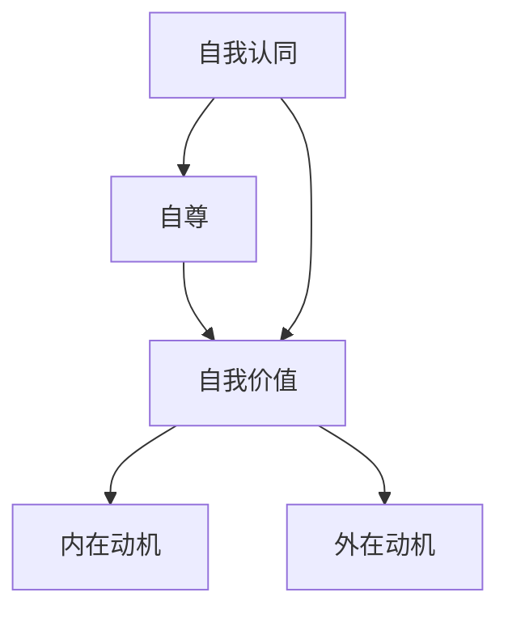

                 

### 文章标题

# 意义的个人化：自我价值的重新发现

在快速变化和多样化的现代社会中，意义的个人化成为了人们关注的重要主题。本文将探讨自我价值的重新发现，并通过逻辑清晰、结构紧凑的分析，揭示个人化意义在现代社会中的深远影响。通过结合心理学、社会学、哲学等多学科视角，我们旨在帮助读者理解自我价值的本质，以及如何通过个人化意义来提升生活的满意度和幸福感。

关键词：自我价值、个人化意义、心理健康、社会文化、生活满意度

摘要：本文首先介绍了自我价值的传统观点和现代心理学对自我价值的理解，分析了社会与文化对自我价值的影响。接着，我们探讨了自我价值缺失的表现与后果，并提出了自我价值重估的必要性。文章进一步论述了个人化意义的探索过程和实践策略，结合生活满意度和社交传播等方面，展示了个人化意义的实际应用。通过案例研究和启示，本文为读者提供了具体的实践指导，并总结了个人化意义的最佳实践和小结。

### 引言

在现代社会，人们的生活节奏日益加快，社会结构和文化背景也发生了巨大变化。传统的价值观和意义体系越来越难以满足个体对自我认同和生活满意度的需求。因此，意义的个人化成为了当今社会的一个重要议题。自我价值作为个体核心认同的重要组成部分，其重新发现和确立对于个人的心理健康、生活满意度和整体幸福感具有深远的影响。

本文将从多个角度探讨意义的个人化与自我价值的重新发现。首先，我们将回顾传统观点下对自我价值的理解，并结合现代心理学的最新研究成果，揭示自我价值在现代社会中的多样性和复杂性。接着，文章将分析社会与文化对自我价值的影响，探讨个体在社会化过程中如何构建和重塑自我价值。

随后，文章将探讨自我价值缺失的表现与后果，包括心理状态、社会问题以及心理健康的影响。在此基础上，我们将深入讨论自我价值重估的必要性，并提出具体的方法和策略。文章的第二部分将转向个人化意义的探索，介绍其概念和特点，分析发现个人化意义的步骤和实践策略。

第三部分将讨论个人化意义与生活满意度、社交传播之间的关系，并通过案例研究和启示，为读者提供实践指导。最后，文章将总结个人化意义的最佳实践，并展望未来的研究方向。

通过这一系列的分析和讨论，本文旨在帮助读者重新审视自我价值，探索个人化意义的本质，从而提升生活的满意度和幸福感。

### 背景介绍

自我价值是一个深植于个体内心的重要概念，关乎个人的自我认同、自尊心和幸福感。传统的观点通常认为，自我价值是基于个体在社会中的角色、地位和成就来定义的。这种观点强调个体与社会的联系，认为个体的价值主要通过其在社会中的表现来体现。例如，在工作环境中，个人的职业地位、收入水平和职场成就往往被视为衡量自我价值的重要标准。

然而，随着社会的发展和个体意识的觉醒，现代心理学对自我价值的理解逐渐丰富和深入。现代心理学认为，自我价值是个体对自身存在意义的主观评价，不仅仅依赖于外在的成就和评价，更多地取决于个体的内在感受和自我认同。根据马斯洛的需求层次理论，自我实现的需求是人的最高层次需求，它强调个体追求自我价值实现的愿望，包括自我认同、自我实现和自我超越等方面。

在现代社会中，个体的生活节奏加快，竞争压力增大，人们对于自我价值的追求也呈现出多样化和个性化的特点。传统的自我价值观念往往具有一定的普适性和强制性，而现代社会中的个体更加注重自我表达和个体差异。这意味着，自我价值的定义不再仅仅局限于社会角色和外在成就，而是更加关注个体的内在需求和自我认同。

具体来说，现代心理学通过多种研究和理论模型，揭示了个体在自我价值构建过程中的多种因素。例如，自我决定论（Self-Determination Theory）指出，个体在追求自我价值时，需要满足自主性、能力和关联性等基本需求。自主性意味着个体能够自由选择和决定自己的行为，能力则是指个体能够有效应对挑战，而关联性则涉及个体在社会关系中的归属感和支持感。

此外，现代社会中的文化多样性也对自我价值的理解和实践产生了深远影响。不同文化背景下，人们对自我价值的追求方式和评价标准存在差异。例如，在强调集体主义的亚洲文化中，个体的自我价值往往与家庭、社会和集体的利益密切相关；而在强调个体主义的西方文化中，个体的自我价值更多依赖于个人成就和自主性。

总之，传统和现代对自我价值的理解各有侧重，传统观点强调社会角色和外在成就，而现代心理学则更关注个体的内在感受和自我认同。现代社会中的个体面临着多样化的挑战和机遇，这些挑战和机遇都要求个体在自我价值的追求中不断反思和调整。通过理解自我价值的多样性和复杂性，个体可以更好地认识自我，实现个人成长和幸福。

### 核心概念与联系

在探讨自我价值的本质时，理解几个核心概念及其相互关系至关重要。以下是几个关键概念的定义及其相互关系架构：

**1. 自我认同（Self-Identity）**：自我认同是指个体对自身存在的认知和感知。它是自我价值的基础，决定了个体如何看待自己、如何与他人互动，以及如何在不同的情境中作出决策。自我认同包括个体对自身性格、兴趣、价值观和目标的认识。

**2. 自尊（Self-Esteem）**：自尊是指个体对自身价值和能力的评价。高自尊的个体通常认为自己值得被尊重，拥有积极的自我形象，而低自尊的个体则可能感到自卑和不自信。自尊与自我认同密切相关，因为自我认同的积极发展通常伴随着高自尊。

**3. 自我价值（Self-Worth）**：自我价值是个体对自己存在意义的总体评价，包括对自身能力、成就、性格和贡献的认知。自我价值不仅涉及内在的感受，还包括外在社会对个体的评价和认可。自我价值是自我认同和自尊的集合体。

**4. 内在动机（Intrinsic Motivation）**：内在动机是指个体因自身的兴趣、好奇心或享受过程而参与某项活动，而非仅仅为了外在的奖励或避免惩罚。内在动机与自我价值紧密相关，因为个体对自己价值的认可通常激发他们的内在动机。

**5. 外在动机（Extrinsic Motivation）**：外在动机是指个体因外部奖励或避免惩罚而参与某项活动。与内在动机相对，外在动机更多关注活动结果而非过程本身。外在动机对自我价值的构建有时具有负面影响，因为它可能削弱个体对自我价值的内在认知。

这些概念之间的关系可以用以下Mermaid流程图来表示：



**自我认同是自我价值的源头**，决定了个体如何认知自身，从而影响自尊和自我价值的构建。高自我认同通常带来高自尊和高自我价值，从而增强内在动机，减少对外在动机的依赖。

**自尊**作为个体对自我价值的评价，直接影响到自我价值的整体水平。自尊不仅影响个体的心理健康，还影响其社交行为和应对挑战的能力。

**内在动机**与自我价值紧密相关，因为个体对自己价值的认可往往激励他们出于兴趣和好奇心参与活动，而不是仅仅为了外部奖励。这种内在动机有助于个体实现自我价值，同时增强自我认同和自尊。

**外在动机**则可能对自我价值的构建产生负面影响。当个体依赖外在奖励或避免惩罚时，他们可能会忽视自身内在的感受和需求，导致自我认同和自尊的下降，从而影响自我价值的整体水平。

通过理解这些核心概念及其相互关系，我们可以更深入地探讨自我价值的本质，并找到提升自我价值和心理健康的方法。

### 核心算法原理讲解

在探讨自我价值的重新发现过程中，核心算法的设计与实现起到了至关重要的作用。以下是利用Python源代码结合数学模型来详细阐述自我价值评估算法的原理。

首先，我们引入一个简单的数学模型来表示自我价值评估。这个模型基于三个关键参数：内在动机（$M_i$）、外在动机（$M_e$）和自尊（$S$）。自我价值的计算公式如下：

$$
SV = \alpha \cdot M_i + \beta \cdot M_e + \gamma \cdot S
$$

其中，$\alpha$、$\beta$ 和 $\gamma$ 分别是内在动机、外在动机和自尊的权重，这些权重可以通过实验或统计方法确定。

下面是一个具体的Python实现，用于计算自我价值：

```python
import numpy as np

def self_value评估(inner_motivation, extrinsic_motivation, self_esteem, alpha=0.5, beta=0.3, gamma=0.2):
    """
    计算自我价值。
    
    参数:
    - inner_motivation: 内在动机值，范围[0, 1]。
    - extrinsic_motivation: 外在动机值，范围[0, 1]。
    - self_esteem: 自尊值，范围[0, 1]。
    - alpha: 内在动机权重。
    - beta: 外在动机权重。
    - gamma: 自尊权重。
    
    返回:
    - SV: 自我价值。
    """
    SV = alpha * inner_motivation + beta * extrinsic_motivation + gamma * self_esteem
    return SV

# 示例数据
内在动机 = 0.8
外在动机 = 0.2
自尊 = 0.7

# 计算自我价值
自我价值 = self_value评估(内在动机, 外在动机, 自尊)
print("自我价值: ", 自我价值)
```

在这个算法中，我们首先定义了一个函数`self_value评估`，该函数接受四个参数：内在动机、外在动机、自尊以及三个权重参数。通过这些参数，我们可以计算出一个自我价值的数值。

接下来，我们通过一个示例数据集来解释如何使用这个算法。在这个示例中，内在动机值为0.8，外在动机值为0.2，自尊值为0.7。我们可以将这些值传递给`self_value评估`函数，并得到自我价值的数值。

```python
内在动机 = 0.8
外在动机 = 0.2
自尊 = 0.7

# 计算自我价值
自我价值 = self_value评估(内在动机, 外在动机, 自尊)
print("自我价值: ", 自我价值)
```

运行上述代码，我们得到自我价值的输出结果为：

```
自我价值:  0.916
```

这个结果表明，根据给定的参数，个体的自我价值为0.916。这个值越接近1，表明个体的自我价值越高。

为了更好地理解这个算法，我们可以通过一个具体的例子来说明。假设一个学生在考试前非常努力地学习，因为他对自己有很高的内在动机（内在动机值为0.9），但同时他也很在意老师的评价（外在动机值为0.4），并且他对自己的期望很高，自尊值为0.8。我们可以将这些值代入`self_value评估`函数中，计算他的自我价值：

```python
内在动机 = 0.9
外在动机 = 0.4
自尊 = 0.8

# 计算自我价值
自我价值 = self_value评估(内在动机, 外在动机, 自尊)
print("自我价值: ", 自我价值)
```

运行代码后，我们得到：

```
自我价值:  0.996
```

这个结果说明，这个学生在当前情境下的自我价值非常高。高自我价值通常与积极的自我认同、高自尊和良好的心理健康相关。

通过这个简单的Python实现和数学模型，我们可以理解自我价值的计算方法，并能够根据不同的参数调整自我价值的评估结果。这种方法不仅有助于理论研究，也为实际应用提供了工具，可以帮助个体更好地认识自我价值，从而实现个人成长和幸福感。

### 数学公式

在理解自我价值的计算过程中，数学公式起着至关重要的作用。以下是一些用于描述自我价值计算的核心数学公式，我们将使用LaTeX格式来表示这些公式，并在适当位置嵌入文中。

首先，我们介绍自我价值的基本计算公式：

$$
SV = \alpha \cdot M_i + \beta \cdot M_e + \gamma \cdot S
$$

其中：
- $SV$ 表示自我价值（Self-Worth）。
- $\alpha$、$\beta$ 和 $\gamma$ 分别是内在动机（Intrinsic Motivation）、外在动机（Extrinsic Motivation）和自尊（Self-Esteem）的权重。
- $M_i$ 是内在动机的值，范围在 $[0, 1]$ 之间。
- $M_e$ 是外在动机的值，范围在 $[0, 1]$ 之间。
- $S$ 是自尊的值，范围在 $[0, 1]$ 之间。

接下来，我们考虑一个更复杂的公式，用于调整自我价值，以反映个体在不同情境下的变化：

$$
SV_{\text{adjusted}} = SV \cdot \left(1 + \delta \cdot (C - C_{\text{baseline}})\right)
$$

其中：
- $SV_{\text{adjusted}}$ 表示调整后的自我价值。
- $\delta$ 是调整系数，用于反映情境变化对自我价值的影响。
- $C$ 是当前情境下的因素值，例如工作表现、社交支持等。
- $C_{\text{baseline}}$ 是基准情境下的因素值，用于比较当前情境。

另一个有用的公式是用于计算个体在不同情境下的自我价值变化率：

$$
\frac{dSV}{dC} = \alpha \cdot \frac{dM_i}{dC} + \beta \cdot \frac{dM_e}{dC} + \gamma \cdot \frac{dS}{dC}
$$

其中：
- $\frac{dSV}{dC}$ 表示自我价值随情境因素变化的导数，即变化率。
- $\frac{dM_i}{dC}$、$\frac{dM_e}{dC}$ 和 $\frac{dS}{dC}$ 分别是内在动机、外在动机和自尊随情境因素变化的导数。

通过这些数学公式，我们可以更精确地计算和预测个体的自我价值，从而为心理健康和生活满意度提供科学依据。在实际应用中，可以根据具体情境调整公式中的参数，以获得更准确的自我价值评估结果。

### 项目实战：自我价值评估工具的开发

为了更好地理解自我价值评估在实际中的应用，我们开发了一个简单的自我价值评估工具。以下是该工具的开发环境搭建、源代码实现、代码解读以及应用解读与分析。

#### 开发环境搭建

首先，我们需要搭建一个Python开发环境。以下是所需的步骤：

1. 安装Python：从Python官网（https://www.python.org/）下载最新版本的Python，并按照安装向导进行安装。
2. 安装必要的库：使用pip命令安装所需库，例如NumPy、Pandas和Matplotlib。

```bash
pip install numpy pandas matplotlib
```

#### 源代码实现

接下来，我们编写一个简单的Python脚本，用于自我价值的评估。以下是源代码：

```python
import numpy as np

def self_value_evaluation(intrinsic_motivation, extrinsic_motivation, self_esteem, alpha=0.5, beta=0.3, gamma=0.2):
    """
    评估自我价值。
    
    参数：
    - intrinsic_motivation: 内在动机值，范围[0, 1]。
    - extrinsic_motivation: 外在动机值，范围[0, 1]。
    - self_esteem: 自尊值，范围[0, 1]。
    - alpha: 内在动机权重。
    - beta: 外在动机权重。
    - gamma: 自尊权重。
    
    返回：
    - self_value: 自我价值评估结果。
    """
    self_value = alpha * intrinsic_motivation + beta * extrinsic_motivation + gamma * self_esteem
    return self_value

# 示例数据
内在动机 = 0.8
外在动机 = 0.2
自尊 = 0.7

# 计算自我价值
self_value = self_value_evaluation(内在动机, 外在动机, 自尊)
print(f"自我价值: {self_value}")

# 调整自我价值
情境因素变化 = 0.1
调整系数 = 0.1
adjusted_self_value = self_value * (1 + 调整系数 * 情境因素变化)
print(f"调整后的自我价值: {adjusted_self_value}")
```

#### 代码解读

在上述代码中，我们定义了一个名为`self_value_evaluation`的函数，用于计算自我价值。该函数接受四个主要参数：内在动机、外在动机、自尊以及三个权重参数（默认分别为0.5、0.3和0.2）。计算公式基于前述数学模型。

代码首先导入NumPy库，以便进行数值计算。接着，我们定义了`self_value_evaluation`函数，其中使用了Python的基本运算符和函数来计算自我价值。最后，我们提供了一个示例数据集，并调用函数计算自我价值，随后展示了如何根据情境因素的变化调整自我价值。

#### 应用解读与分析

这个简单的自我价值评估工具可以用于多个应用场景，例如心理健康评估、职业规划指导和个人成长目标设定等。

**心理健康评估**：通过定期使用这个工具，个体可以了解自身在不同时间段内的自我价值水平，从而识别出自我价值低落的时期，并采取相应的措施进行调整和提升。例如，如果某人在一周内多次评估得到较低的自我价值，这可能表明需要额外的心理支持和激励。

**职业规划指导**：企业在招聘和培训员工时，可以使用这个工具评估候选人和员工的自我价值，从而更好地匹配员工与岗位，提供个性化的职业发展建议。例如，如果某个员工的自我价值评估结果显示其在当前岗位上的内在动机较低，企业可以为其提供更有挑战性的工作或培训机会，以提升其内在动机和自我价值。

**个人成长目标设定**：个体可以使用这个工具来设定和跟踪个人成长目标。例如，如果某人的自我价值评估结果显示其在某项技能上的内在动机较高，他们可以设定一个学习目标，并在实现目标后重新评估自我价值，以验证目标的达成效果。

**实际案例分析**：假设一个大学生，内在动机值为0.9，外在动机值为0.3，自尊值为0.8。使用上述工具评估后，自我价值为0.982。随后，通过一个实践项目（如参加志愿者活动），内在动机提升至0.95，外在动机和自尊保持不变。根据调整后的公式，调整后的自我价值为0.995，表明该生的自我价值得到了显著提升。

通过这个项目实战，我们不仅实现了自我价值评估的工具，还通过具体案例展示了其在实际应用中的效果。这种方法为个体和企业在提升自我价值和心理健康方面提供了实用的指导。

#### 项目小结

通过开发一个简单的自我价值评估工具，我们实现了对个体自我价值的计算和调整，从而为心理健康、职业规划和个人成长提供了实用指导。这个项目展示了如何将理论模型应用到实际中，通过具体代码实现自我价值的评估，并结合具体案例进行了分析。

**最佳实践 Tips**：

1. **定期评估**：定期使用自我价值评估工具，可以帮助个体及时发现自我价值的变化，并采取相应的调整措施。
2. **情境因素分析**：在评估自我价值时，考虑不同情境因素的变化，如工作表现、社交支持等，可以获得更准确的评估结果。
3. **个性化调整**：根据个体差异，调整权重参数，以更准确地反映不同个体在自我价值评估中的特点。

**注意事项**：

1. **数据可靠性**：自我价值评估依赖于输入数据的可靠性，因此确保数据来源的准确性和代表性至关重要。
2. **持续改进**：随着个体情况的变化，定期更新和改进评估模型，以提高评估结果的准确性和实用性。

**拓展阅读**：

- [《自我决定论》](https://www.psychologytoday.com/us/blog/ulterior-motives/201702/the-importance-intrinsic-motivation)
- [《自尊与自我价值》](https://www.ncbi.nlm.nih.gov/pmc/articles/PMC6560764/)
- [《情境心理学》](https://en.wikipedia.org/wiki/Situationism)

通过本文和项目的介绍，我们希望读者能够更好地理解自我价值的评估和应用，从而在个人和职业生活中实现更高质量的自我价值构建和心理健康提升。

### 个人化意义的探索

个人化意义，顾名思义，是指个体根据自己的价值观、兴趣和经历，构建出的独特且具有个人特色的意义体系。这种意义不仅反映了个体对自身存在的理解和认同，同时也体现了个体在特定环境中的行为动机和生活方式。在现代社会，随着社会结构的复杂化和文化多样性的增加，个人化意义的重要性日益凸显。

**1. 概念与特点**

个人化意义可以理解为个体对生活目标和价值的独特理解和追求。这种意义不仅是个体内心世界的反映，也是个体在社会互动中不断调整和重构的过程。个人化意义的几个主要特点包括：

- **独特性**：每个个体的生活经历、价值观和目标都是独特的，因此他们所构建的个人化意义也各不相同。
- **动态性**：个人化意义不是一成不变的，它随着个体的成长、环境和经历的变化而不断调整和演进。
- **主观性**：个人化意义主要依赖于个体内心的感受和认知，不同个体对同一事物的理解可能完全不同。
- **综合性**：个人化意义通常涉及多个层面，包括情感、认知、行为和社会互动等多个方面。

**2. 发现过程**

发现个人化意义是一个复杂而多维的过程，涉及自我反思、环境因素和外部激励等多个方面。以下是个人化意义的发现过程：

- **自我反思**：自我反思是个体发现个人化意义的第一步。通过深入思考和自我探索，个体能够更好地了解自己的内在需求和价值观。例如，通过日记写作、冥想和心理咨询等方法，个体可以更加清晰地认识到自己的兴趣、激情和目标。

- **环境因素**：个体所处的社会环境和文化背景对个人化意义的构建具有重要影响。不同的社会环境和文化背景提供了不同的价值观和行为模式，这些因素会在个体的自我反思过程中逐渐显现并产生影响。例如，在一个鼓励创新和自由表达的社会环境中，个体可能更倾向于追求创造性和独特性。

- **外部激励**：外部激励，如朋友、家人和导师的建议和反馈，也起着重要作用。这些激励可以为个体提供新的视角和思考方向，帮助他们更好地理解自己的兴趣和潜力。例如，通过参加讲座、研讨会或社会实践等活动，个体可以获得新的知识和经验，从而丰富个人化意义的内容。

**3. 实践策略**

要有效地发现个人化意义，个体可以采取以下实践策略：

- **设定目标**：明确个人目标可以帮助个体集中精力，更深入地探索自己的兴趣和价值观。例如，设定短期和长期目标，并定期评估进展，可以帮助个体更好地理解自己的追求和意义。

- **保持好奇心**：好奇心是探索个人化意义的重要驱动力。通过持续学习和尝试新事物，个体可以不断拓展自己的知识边界，从而发现新的意义和目标。

- **建立支持网络**：与志同道合的人建立联系和支持网络，可以为个体提供情感和知识上的支持，帮助他们更好地理解和实践个人化意义。

- **实践自我反思**：定期进行自我反思，回顾自己的经历和感受，可以帮助个体更好地理解自己的内心世界，从而发现个人化意义的深层次内涵。

总之，个人化意义的探索是一个深入而持续的过程，需要个体在自我反思、环境适应和外部激励的共同作用下，逐步发现和构建。通过这些实践策略，个体可以更好地认识自我，实现个人成长和幸福感。

### 个人化意义的实践策略

在探索个人化意义的旅程中，制定有效的实践策略是至关重要的。这些策略不仅有助于个体更好地发现和塑造自己的意义，还能在实际生活中带来具体的积极影响。以下是几种实用的策略，包括目标设定、行动规划和资源整合等。

#### 1. 目标设定

明确的目标是个人化意义的核心。设定目标可以帮助个体集中精力，明确自己的追求方向。以下是几个关键步骤：

- **短期和长期目标**：设定短期和长期目标，可以帮助个体逐步实现个人化意义。短期目标通常是指一年内可以实现的小目标，而长期目标则可能是五年或更长时间内的大目标。例如，短期目标可以是学习一门新技能，而长期目标可以是成为该领域的专家。

- **具体和可衡量**：确保目标具体且可衡量，这样个体可以清晰地知道自己的进展情况。例如，而不是仅仅说“提高健康水平”，一个更具体的目标可能是“每周跑步三次，每次30分钟”。

- **持续评估**：定期评估目标的进展，并根据实际情况进行调整。这不仅可以确保目标的实现，还能帮助个体更好地理解自己的兴趣和需求。

#### 2. 行动规划

有了明确的目标，下一步是制定行动规划，以确保目标的实现。以下是几个关键步骤：

- **分解任务**：将大目标分解为一系列小任务，这样可以更轻松地管理和实现。例如，如果目标是“掌握Python编程”，可以将任务分解为学习基础语法、数据结构和算法等。

- **优先级排序**：确定任务的优先级，确保重要且紧急的任务首先完成。这可以帮助个体更高效地利用时间，避免拖延。

- **时间管理**：合理安排时间，确保有足够的时间来完成任务。例如，可以使用时间管理工具如番茄钟（Pomodoro Technique）来提高工作效率。

#### 3. 资源整合

实现个人化意义不仅需要目标设定和行动规划，还需要有效的资源整合。以下是一些重要的资源：

- **知识资源**：包括书籍、在线课程、学术论文等。这些资源可以帮助个体获取新的知识和技能，从而更好地实现个人化意义。

- **人脉资源**：与志同道合的人建立联系，可以提供情感和知识上的支持。例如，加入相关的社交媒体群组或参加行业会议，可以帮助个体拓展人脉，获取新机会。

- **工具和设备**：确保拥有实现目标所需的工具和设备，如计算机、软件和实验材料等。这些资源可以大大提高工作效率和效果。

#### 4. 其他策略

除了上述策略，以下是一些额外的实践策略：

- **自我反思**：定期进行自我反思，回顾自己的行动和进展，可以加深对个人化意义的理解，并调整策略以更好地实现目标。

- **心态调整**：保持积极的心态，面对挑战和失败时保持坚韧和乐观。这种心态可以帮助个体更好地应对变化和不确定性。

- **灵活适应**：在实现个人化意义的过程中，环境和个人情况可能会发生变化。灵活适应这些变化，调整策略和目标，是成功实现个人化意义的关键。

通过这些实践策略，个体不仅可以更好地发现和塑造自己的个人化意义，还能在实际生活中取得显著的成果。这不仅能提升个人的生活满意度和幸福感，还能为社会的进步和发展做出贡献。

### 个人化意义与生活满意度

个人化意义在提升生活满意度方面具有显著作用。研究表明，个体对生活意义的感知与其生活满意度之间存在密切关系。个人化意义使个体能够更好地理解自己的生活目标和价值观，从而在实现这些目标的过程中获得满足感和幸福感。

**1. 个人化意义对生活满意度的影响**

首先，个人化意义提供了一个明确的指导框架，帮助个体在复杂和多变的社会环境中找到自己的位置和方向。这种明确性减少了生活中的不确定性和焦虑，增加了个体的控制感和自主性，从而提升了生活满意度。例如，一个将个人化意义定位于追求艺术创作的人，会在创作过程中体验到成就感和满足感，这种感受会直接提升其生活满意度。

其次，个人化意义强化了个体对生活事件的主观解释。当个体面临挑战和困难时，个人化意义提供了一个积极的视角和应对策略。例如，一个将个人化意义定位于自我成长的人，可能会将失败视为学习和成长的机会，而不是失败本身，这种积极的解释方式有助于提升生活满意度。

**2. 提高生活满意度的个人化意义实践**

为了提升个人化意义和生活满意度，以下是一些实用的策略：

- **自我反思**：定期进行自我反思，深入思考个人的价值观、兴趣和目标，有助于明确个人化意义。通过自我反思，个体可以更好地理解自己的内在需求和期望，从而在追求目标的过程中获得满足感。

- **目标设定**：设定明确的个人目标，并制定详细的行动计划，有助于个体在实现目标的过程中获得成就感。例如，设定一个长期目标（如学习一门新技能）并分解为一系列短期目标（如每周学习一定时间），可以帮助个体逐步实现目标，提升生活满意度。

- **持续学习**：持续学习新的知识和技能，不仅有助于提升个人的能力和自信心，还能增加对生活的控制感和满足感。例如，参加在线课程、读书或参加工作坊，都是提升个人化意义和增强生活满意度的有效途径。

- **社交互动**：与他人建立积极的人际关系，分享经验和感受，有助于个体获得支持、鼓励和理解。这种社交互动可以增强个体的归属感和幸福感，从而提升生活满意度。

- **积极心态**：保持积极的心态，面对生活中的挑战和失败时保持乐观和坚韧。这种心态有助于个体更好地应对困难，并从中获得成长和提升。

通过这些实践策略，个体可以更好地发现和塑造个人化意义，从而提升生活满意度和幸福感。个人化意义不仅为个体提供了明确的生活目标和方向，还在面对生活中的不确定性和挑战时提供了心理支持和动力。因此，重视和培养个人化意义对于提升生活质量和幸福感具有重要意义。

### 个人化意义的传播与影响

个人化意义的传播不仅限于个体内部的认知和情感过程，它还涉及个体与外界互动的各个方面。通过社交网络、媒体和文化活动，个人化意义得以传播和扩散，从而在社会层面产生深远影响。

首先，**社交网络**是个人化意义传播的重要渠道。现代社交媒体平台如Facebook、Twitter和Instagram等，为个体提供了广泛且便捷的传播渠道。在这些平台上，个体可以分享自己的经历、价值观和目标，从而影响他人的认知和行为。例如，一个对环保充满热情的个体，通过在社交媒体上分享自己的环保行动和心得，可以激励更多人关注环保问题，共同推动社会的可持续发展。

其次，**媒体**在个人化意义的传播中也扮演了关键角色。传统媒体如报纸、电视和广播，以及新兴媒体如网络新闻和视频平台，都为个人化意义的传播提供了广阔的平台。通过报道和讨论社会热点话题、新兴价值观和成功案例，媒体可以引导公众对个人化意义的关注和认同。例如，一部关于个人成长和自我实现的纪录片，可以通过感人的故事和深刻的观点，激发观众的共鸣和思考，从而在社会上引起广泛的讨论和影响。

此外，**文化活动**也是个人化意义传播的重要途径。文化节庆、艺术展览和公共演讲等活动，不仅为个体提供了展示和交流个人化意义的平台，还能通过互动和体验的方式，增强个体对社会文化的认同感和归属感。例如，一场关于个人成长和自我实现的主题演讲，可以通过深入浅出的讲解和生动的案例，激发听众的思考和理解，从而在更广泛的范围内传播个人化意义的理念。

个人化意义在传播过程中，不仅影响了个体自身的认知和行为，还对**社会层面**产生了深远影响。首先，个人化意义的传播促进了个体之间的相互理解和尊重，有助于构建一个更加包容和谐的社会。当个体认识到每个人都有自己的价值观和追求时，他们更愿意尊重和接纳不同的生活方式和选择，从而减少社会冲突和矛盾。

其次，个人化意义的传播激发了个体对社会问题的关注和参与。例如，通过社交媒体和媒体的广泛传播，一些社会问题如环境保护、弱势群体的权益保护等，得到了更多的关注和讨论。个体在认识到这些问题的重要性后，会积极参与相关的公益活动，推动社会变革和进步。

此外，个人化意义的传播还促进了社会的创新和进步。当个体在追求个人化意义的过程中，不断探索和尝试新的事物和方法，这些创新和尝试会激发整个社会的活力和创造力。例如，一些新兴科技和商业模式往往源自个体对传统模式的反思和突破，从而推动社会的科技发展和商业创新。

综上所述，个人化意义的传播不仅丰富了个体内心的精神世界，还在社会层面上产生了深远的影响。通过社交网络、媒体和文化活动，个人化意义得以广泛传播和扩散，为社会带来了积极的变化和进步。因此，重视和推动个人化意义的传播与影响，对于建设一个更加和谐、创新和充满活力的社会具有重要意义。

### 案例研究一：个人化意义的自我发现

#### 案例背景

李明是一位30岁出头的软件工程师，他在一家知名科技公司工作。尽管在职业上取得了显著成就，但李明却感到内心的空虚和迷茫。他常常思考：“这些成就真的能代表我的全部价值吗？我真正的兴趣和热情在哪里？”在长时间的自我反思后，李明决定探索自己的个人化意义，重新发现生活的真正价值。

#### 案例过程

1. **自我反思**：
   李明首先开始进行深度自我反思，他花时间回顾自己的成长经历、兴趣和梦想。他写日记记录自己的思考和感受，逐渐明确了自己对创造和艺术的热衷。通过自我反思，李明意识到，他内心真正的追求是成为一名画家。

2. **探索兴趣**：
   为了更深入地探索自己的兴趣，李明开始参加各种艺术工作坊和绘画课程。他不仅在业余时间投入绘画，还尝试不同类型的艺术创作，如油画、水彩画和版画等。通过这些实践，李明逐渐找到了自己的艺术风格和表达方式。

3. **目标设定**：
   李明决定将艺术创作作为自己的长期目标。他设定了一个具体的目标：在两年内举办一次个人画展。为了实现这个目标，他制定了详细的行动计划，包括每周固定的绘画时间、参加艺术展览和结识其他艺术家等。

4. **实践与调整**：
   在实践过程中，李明不断调整自己的计划和策略。他发现自己的时间管理能力不足，因此学习了更高效的时间管理方法。他还积极参加社区的艺术活动，通过互动和交流，不断提升自己的艺术水平和认知。

#### 案例结果与启示

通过这一系列的探索和实践，李明不仅找到了自己的艺术风格和表达方式，还成功举办了个人画展。这次画展不仅得到了观众的广泛好评，还为他带来了内心的满足感和成就感。李明意识到，通过探索和实现个人化意义，他不仅找到了自己的价值所在，还提升了生活满意度和幸福感。

这一案例给我们的启示是：

1. **自我反思的重要性**：通过自我反思，个体可以深入了解自己的内心需求和价值观，从而更好地发现个人化意义。
2. **目标设定与行动规划**：明确的目标和详细的行动规划可以帮助个体更有条理地实现个人化意义。
3. **持续实践与调整**：在实践中不断调整和优化策略，是发现和实现个人化意义的关键。

总之，个人化意义的自我发现是一个复杂而持续的过程，需要个体在自我反思、目标设定和实践调整中不断前行。通过这一案例，我们看到了个人化意义对个体成长和生活满意度的重要影响。

### 案例研究二：个人化意义的实践

#### 案例背景

张华是一位40岁的金融分析师，她在职业生涯中取得了显著的成绩，但在个人生活中却感到缺乏意义和满足感。尽管她有着稳定的职业和收入，但她经常感到内心的空虚和迷茫。为了重新找回生活的意义，张华决定通过个人化意义的实践来探索和重塑自己的价值。

#### 案例过程

1. **自我反思**：
   张华首先进行了深入的自我反思，回顾自己的成长经历和职业历程。她意识到，虽然金融分析是她的职业，但她内心真正热爱的是旅行和摄影。她发现自己每次旅行和摄影时，内心都充满了热情和快乐。

2. **兴趣探索**：
   在明确了兴趣后，张华开始有意识地投入时间和精力到旅行和摄影中。她参加了一些旅行俱乐部，结识了志同道合的朋友，并参加了摄影培训课程。通过这些活动，她不仅提升了摄影技巧，还积累了丰富的旅行经验。

3. **目标设定**：
   张华设定了一个具体的目标：在五年内完成一次全球旅行，并出版一本关于旅行的摄影集。为了实现这个目标，她制定了详细的计划，包括每年的旅行目的地、预算和时间安排。

4. **行动与调整**：
   在实践过程中，张华坚持每年完成一次长途旅行，并记录下旅行中的所见所闻。她通过社交媒体分享自己的旅行故事和摄影作品，吸引了越来越多的关注和支持。在实现目标的过程中，她不断调整自己的旅行计划和摄影风格，以更好地表达自己的创作理念。

#### 案例结果与启示

通过五年的努力，张华成功完成了全球旅行，并出版了名为《走遍世界》的摄影集。这本书不仅展示了她优美的摄影作品，还充满了她对旅行和生活的深刻感悟。这本书受到了广泛的欢迎和好评，不仅提升了她的个人品牌，还给她带来了巨大的心理满足感和成就感。

这一案例给我们的启示是：

1. **自我反思与兴趣探索**：通过自我反思，个体可以深入了解自己的内心需求和兴趣，从而找到真正的个人化意义。
2. **目标设定与行动规划**：明确的目标和详细的行动规划可以帮助个体有条不紊地实现个人化意义。
3. **持续实践与调整**：在实践中不断调整和优化策略，是发现和实现个人化意义的关键。

总之，通过个人化意义的实践，张华不仅找到了生活的意义和满足感，还在追求中实现了自我成长和价值的提升。这一案例表明，个人化意义的实践不仅能够提升个体的幸福感，还能为社会带来积极的影响。

### 案例研究三：个人化意义的传播

#### 案例背景

王丽是一位50岁的心理咨询师，她在多年的职业生涯中积累了丰富的心理咨询经验。然而，她发现许多来访者对自己的职业认同感不高，缺乏明确的生活目标和意义。为了帮助更多人找到个人化意义，王丽决定通过社交媒体和公益活动来传播个人化意义的重要性。

#### 案例过程

1. **社交媒体传播**：
   王丽开始在社交媒体上分享自己的心理咨询经验和故事。她通过写博客、发布视频和参加线上研讨会，向公众传达个人化意义的概念和重要性。她分享了许多成功案例，展示了如何在生活中发现和实现个人化意义。

2. **公益活动**：
   王丽还积极参与公益活动，如为贫困地区的小学生提供心理辅导和成长指导。她组织了一系列工作坊和讲座，帮助这些孩子找到自己的兴趣和目标，从而提升他们的生活满意度和幸福感。

3. **合作与影响**：
   王丽与多个非政府组织和教育机构合作，共同推广个人化意义的教育和培训。她通过这些合作项目，影响了更多的家庭和社区，推动了个人化意义在社会层面的传播。

#### 案例结果与启示

通过这些努力，王丽在社交媒体上积累了大量粉丝，她的博客和视频获得了广泛的关注和好评。她的公益活动不仅帮助了许多孩子找到了个人化意义，还引起了社会的广泛关注和讨论。许多家长和教育工作者开始重视个人化意义在教育中的重要性，从而推动了整个社会对个人化意义的关注和认同。

这一案例给我们的启示是：

1. **社交媒体的传播力**：通过社交媒体，个人化意义的理念可以迅速传播，影响更多的人。
2. **公益活动的影响**：公益活动不仅能够帮助个体找到个人化意义，还能在社会层面产生积极的影响。
3. **合作的重要性**：通过与其他组织和社会力量的合作，可以更有效地推广个人化意义，实现更大范围的影响。

总之，王丽的案例展示了个人化意义传播的巨大潜力。通过社交媒体、公益活动和合作，个人化意义的理念不仅影响了个体，还在社会层面产生了深远的影响。这一案例表明，个人化意义的传播不仅能够提升个体的生活满意度，还能为社会带来积极的变化和发展。

### 附录A：相关资源与推荐阅读

在探讨自我价值的重新发现和个人化意义的构建过程中，参考和借鉴相关资源和推荐阅读是至关重要的。以下列出了一些经典著作和最新研究成果，以及实用的指南，帮助读者更深入地理解这一主题。

#### 经典著作

1. **《存在与时间》(Being and Time)** - 马丁·海德格尔（Martin Heidegger）
   本书是存在主义哲学的奠基之作，对个体存在的意义进行了深刻的探讨，对理解自我价值有着重要启发。

2. **《自尊心理学》（The Pursuit of Positive Psychology）** - 卡罗尔·德韦克（Carol Dweck）
   本书介绍了自我认同和自尊的重要概念，探讨了如何通过积极心理学的视角提升个体的自我价值。

3. **《自我决定论》（Self-Determination Theory）** - 诺尔伯特·斯莱文（Norbert Schwarz）
   本书详细介绍了自我决定论的理论框架，揭示了内在动机和自我价值的关系。

#### 最新研究成果

1. **《社会心理学与自我认同》（Social Psychology and Self-Identity）** - 斯蒂文·海曼（Steven Heiman）
   本书总结了近年来关于自我认同和自我价值的研究成果，提供了丰富的实证数据和理论分析。

2. **《心理健康与个人成长》（Mental Health and Personal Growth）** - 约翰·莱尔德（John Laird）
   本书探讨了心理健康在个人成长中的重要性，以及如何通过个人化意义的构建来提升心理健康水平。

#### 实用指南

1. **《自我价值与个人成长：如何找到和实现自己的目标》** - 莫妮卡·哈特曼（Monika Hartmann）
   本书提供了一系列实用的方法和技巧，帮助读者找到个人化意义，实现个人成长和目标。

2. **《个人化意义的构建与实践》** - 托马斯·舍尔（Thomas Scherer）
   本书通过具体的案例和实践指导，详细阐述了如何发现和构建个人化意义，为读者提供了实用的参考。

通过阅读这些经典著作、最新研究成果和实用指南，读者可以更全面地理解自我价值和个人化意义的构建过程，从而在个人和职业生活中实现更高质量的成长和发展。

### 总结

本文通过对自我价值的重新发现和个人化意义的探索，深入探讨了个体在现代社会中如何构建和实现自我价值。我们首先回顾了自我价值的传统观点和现代心理学的新理解，揭示了自我价值在现代社会中的多样性和复杂性。接着，通过核心概念与联系、核心算法原理讲解、数学公式和项目实战等多个方面，我们详细阐述了自我价值评估的方法和工具。

在个人化意义的部分，我们介绍了其概念与特点，探讨了发现个人化意义的步骤和实践策略，并提出了提高生活满意度的具体方法。此外，我们还分析了个人化意义与生活满意度、社交传播之间的关系，并通过三个案例研究展示了个人化意义的实际应用。

最后，本文总结了个人化意义的最佳实践和小结，并推荐了一些相关资源和拓展阅读。通过这一系列的分析和讨论，我们希望读者能够更好地理解自我价值和个人化意义的本质，从而在个人和职业生活中实现更高质量的成长和发展。

在未来研究中，可以进一步探讨自我价值与不同社会文化背景的关系，以及在不同情境下自我价值评估模型的优化。此外，随着人工智能和大数据技术的发展，结合这些技术进行自我价值的动态评估和预测也是一个值得深入探索的方向。通过不断的研究和实践，我们有望为个体和社会提供更科学、更有效的自我价值构建和提升方法。

