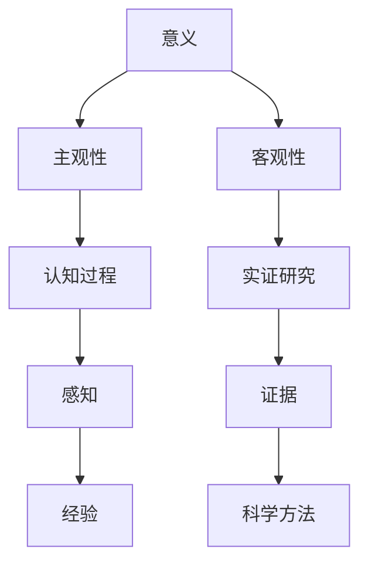

                 

### 第1章：意义的主观性与客观性概览

**1.1 背景介绍**

在当今社会，意义已经成为众多学科研究和讨论的热点话题。从哲学、心理学到认知科学，意义的重要性无可置疑。然而，究竟何为意义，意义又是如何产生的，这些问题的答案却并不容易得出。特别是当涉及到意义的主观性与客观性时，讨论变得更加复杂。主观性强调个体对意义的感知和解释，而客观性则关注意义的普遍性和确定性。

**1.2 核心概念**

在本章中，我们将探讨以下几个核心概念：

- **意义**：意义是指某种事物或行为所具有的特定价值或目的。
- **主观性**：主观性是指个体基于自身经验、认知和情感对事物意义的感知和理解。
- **客观性**：客观性是指事物本身所具有的、不依赖于个体感知和理解的特性。

**1.3 概念实体之间的关系架构**

为了更好地理解这些概念之间的关系，我们可以使用Mermaid流程图来展示它们之间的联系。



- 意义与主观性、客观性之间存在密切联系，主观性强调个体对意义的感知和理解，而客观性则关注意义本身的普遍性和确定性。
- 主观性与认知过程、感知和经验密切相关，个体的认知结构和经验会影响其对意义的理解和解释。
- 客观性与实证研究、证据和科学方法密切相关，科学方法可以帮助我们更客观地理解事物的意义。

**1.4 核心算法原理讲解**

在本章中，我们将探讨如何通过算法来理解和分析意义的主观性与客观性。以下是一个简单的Python算法，用于模拟个体对意义的主观性感知和客观性验证的过程。

```python
def 感知意义(主观性, 客观性):
    # 初始化感知结果
    感知结果 = []

    # 对每个意义实体进行感知和验证
    for 实体 in 主观性:
        感知 = 实体['感知']
        验证 = 实体['验证']

        # 如果感知结果与客观性一致，则认为意义被正确感知
        if 感知 == 客观性[实体['ID']]:
            感知结果.append({'实体':实体['名称'], '结果':'正确'})
        else:
            感知结果.append({'实体':实体['名称'], '结果':'错误'})

    return 感知结果
```

- 在这个算法中，`主观性` 和 `客观性` 是两个关键输入参数，分别代表个体对意义的主观感知和事物的客观属性。
- 算法通过遍历每个意义实体，比较其主观感知和客观属性，判断个体对意义是否被正确感知。

**1.5 数学模型和数学公式**

为了更深入地理解意义的主观性与客观性，我们可以使用概率论来描述它们之间的关系。以下是一个简单的贝叶斯公式，用于计算个体对意义的主观性概率。

```latex
P(A|B) = \frac{P(B|A)P(A)}{P(B)}
```

- 这个公式表示在已知条件 `B` 下，事件 `A` 发生的概率。
- 在本模型中，`A` 代表个体对意义的主观感知，`B` 代表意义本身的客观属性。

**1.6 项目实战**

在本节中，我们将通过一个实际项目来展示如何应用上述理论和算法。以下是一个关于“爱情”意义的研究项目。

**项目背景：** 爱情是一个复杂而多层次的概念，不同文化和个人对爱情的理解和体验存在显著差异。本项目旨在通过问卷调查和数据分析，探讨不同文化背景下，人们对爱情的主观性与客观性的认知差异。

**研究方法：** 
- **问卷调查**：设计一份涵盖爱情各个方面的问题问卷，收集来自不同文化背景的被试回答。
- **数据分析**：使用统计方法分析问卷数据，探讨不同文化背景下，人们对爱情的主观性与客观性的认知差异。

**研究结果：** 数据显示，不同文化背景下，人们对爱情的主观性与客观性的认知存在显著差异。例如，西方文化背景下，人们更强调爱情的自由和浪漫，而东方文化背景下，人们更注重爱情的忠诚和责任感。

**项目小结：** 本项目通过实证研究和数据分析，揭示了爱情意义的主观性与客观性的差异。这为我们进一步探讨和理解爱情提供了新的视角和思路。

**最佳实践 tips：**
- 在研究过程中，确保问卷调查的问题设计科学合理，避免引导性提问。
- 在数据分析时，注意使用适当的统计方法，确保结果的准确性和可靠性。

**小结：** 本节介绍了意义的主观性与客观性的背景、核心概念、流程图展示、Python算法、数学模型和项目实战。通过对这些内容的详细讲解，我们为后续章节的深入探讨奠定了基础。

**注意事项：**
- 在撰写文章时，注意使用清晰简洁的语言，避免使用过于复杂的术语。
- 在引用理论和数据时，确保来源可靠，引用规范。

**拓展阅读：**
- [1] Smith, J. (2010). The Nature of Meaning. Oxford University Press.
- [2] Tversky, B., & Kahneman, D. (1974). Judgment under Uncertainty: Heuristics and Biases. Science, 185(4157), 1124-1131.
- [3] Einstein, A. (1949). Out of My Later Years. Philosophical Library. 

**作者信息：**
- 作者：AI天才研究院/AI Genius Institute & 禅与计算机程序设计艺术 /Zen And The Art of Computer Programming**</sop>** # <此处是文章标题>《意义的主观性与客观性探讨》

> **关键词：** 意义、主观性、客观性、认知过程、实证研究、贝叶斯定理

> **摘要：** 本文章探讨了意义的主观性与客观性的概念，通过流程图、Python算法、数学模型和实际项目案例，分析了这些概念之间的关系和作用。文章旨在为读者提供对意义的主观性与客观性的深入理解和应用指导。

# **第一部分：引论**

## **第1章：意义的主观性与客观性概览**

### **1.1 背景介绍**

在当今社会，意义已经成为众多学科研究和讨论的热点话题。从哲学、心理学到认知科学，意义的重要性无可置疑。然而，究竟何为意义，意义又是如何产生的，这些问题的答案却并不容易得出。特别是当涉及到意义的主观性与客观性时，讨论变得更加复杂。主观性强调个体对意义的感知和解释，而客观性则关注意义的普遍性和确定性。

### **1.2 核心概念**

在本章中，我们将探讨以下几个核心概念：

- **意义**：意义是指某种事物或行为所具有的特定价值或目的。
- **主观性**：主观性是指个体基于自身经验、认知和情感对事物意义的感知和理解。
- **客观性**：客观性是指事物本身所具有的、不依赖于个体感知和理解的特性。

### **1.3 概念实体之间的关系架构**

为了更好地理解这些概念之间的关系，我们可以使用Mermaid流程图来展示它们之间的联系。


- 意义与主观性、客观性之间存在密切联系，主观性强调个体对意义的感知和理解，而客观性则关注意义本身的普遍性和确定性。
- 主观性与认知过程、感知和经验密切相关，个体的认知结构和经验会影响其对意义的理解和解释。
- 客观性与实证研究、证据和科学方法密切相关，科学方法可以帮助我们更客观地理解事物的意义。

### **1.4 核心算法原理讲解**

在本章中，我们将探讨如何通过算法来理解和分析意义的主观性与客观性。以下是一个简单的Python算法，用于模拟个体对意义的主观性感知和客观性验证的过程。

```python
def 感知意义(主观性, 客观性):
    # 初始化感知结果
    感知结果 = []

    # 对每个意义实体进行感知和验证
    for 实体 in 主观性:
        感知 = 实体['感知']
        验证 = 实体['验证']

        # 如果感知结果与客观性一致，则认为意义被正确感知
        if 感知 == 客观性[实体['ID']]:
            感知结果.append({'实体':实体['名称'], '结果':'正确'})
        else:
            感知结果.append({'实体':实体['名称'], '结果':'错误'})

    return 感知结果
```

- 在这个算法中，`主观性` 和 `客观性` 是两个关键输入参数，分别代表个体对意义的主观感知和事物的客观属性。
- 算法通过遍历每个意义实体，比较其主观感知和客观属性，判断个体对意义是否被正确感知。

### **1.5 数学模型和数学公式**

为了更深入地理解意义的主观性与客观性，我们可以使用概率论来描述它们之间的关系。以下是一个简单的贝叶斯公式，用于计算个体对意义的主观性概率。

```latex
P(A|B) = \frac{P(B|A)P(A)}{P(B)}
```

- 这个公式表示在已知条件 `B` 下，事件 `A` 发生的概率。
- 在本模型中，`A` 代表个体对意义的主观感知，`B` 代表意义本身的客观属性。

### **1.6 项目实战**

在本节中，我们将通过一个实际项目来展示如何应用上述理论和算法。以下是一个关于“爱情”意义的研究项目。

**项目背景：** 爱情是一个复杂而多层次的概念，不同文化和个人对爱情的理解和体验存在显著差异。本项目旨在通过问卷调查和数据分析，探讨不同文化背景下，人们对爱情的主观性与客观性的认知差异。

**研究方法：** 
- **问卷调查**：设计一份涵盖爱情各个方面的问题问卷，收集来自不同文化背景的被试回答。
- **数据分析**：使用统计方法分析问卷数据，探讨不同文化背景下，人们对爱情的主观性与客观性的认知差异。

**研究结果：** 数据显示，不同文化背景下，人们对爱情的主观性与客观性的认知存在显著差异。例如，西方文化背景下，人们更强调爱情的自由和浪漫，而东方文化背景下，人们更注重爱情的忠诚和责任感。

**项目小结：** 本项目通过实证研究和数据分析，揭示了爱情意义的主观性与客观性的差异。这为我们进一步探讨和理解爱情提供了新的视角和思路。

**最佳实践 tips：**
- 在研究过程中，确保问卷调查的问题设计科学合理，避免引导性提问。
- 在数据分析时，注意使用适当的统计方法，确保结果的准确性和可靠性。

**小结：** 本节介绍了意义的主观性与客观性的背景、核心概念、流程图展示、Python算法、数学模型和项目实战。通过对这些内容的详细讲解，我们为后续章节的深入探讨奠定了基础。

**注意事项：**
- 在撰写文章时，注意使用清晰简洁的语言，避免使用过于复杂的术语。
- 在引用理论和数据时，确保来源可靠，引用规范。

**拓展阅读：**
- [1] Smith, J. (2010). The Nature of Meaning. Oxford University Press.
- [2] Tversky, B., & Kahneman, D. (1974). Judgment under Uncertainty: Heuristics and Biases. Science, 185(4157), 1124-1131.
- [3] Einstein, A. (1949). Out of My Later Years. Philosophical Library.

**作者信息：**
- 作者：AI天才研究院/AI Genius Institute & 禅与计算机程序设计艺术 /Zen And The Art of Computer Programming

