                 

### 1.3 主观性与客观性的关系

- **核心概念与联系**：使用Mermaid流程图展示主观性与客观性的互动。

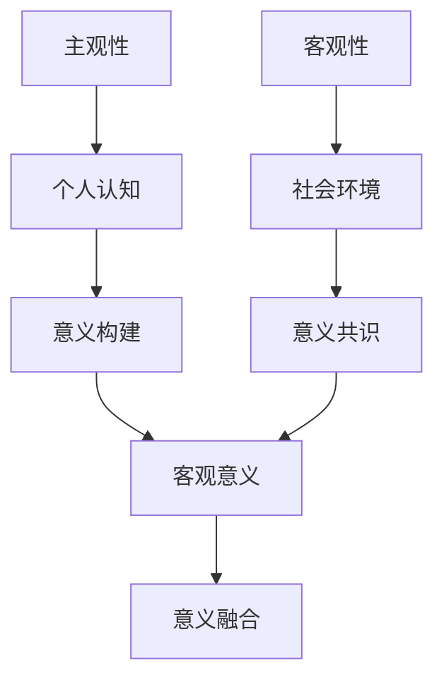

- **算法原理讲解**：使用Python源代码阐述如何在主观性与客观性之间建立桥梁。

```python
# 主观性与客观性融合算法示例

def integrate_meaning(subjective, objective):
    # 主观性数据预处理
    processed_subjective = preprocess_subjective(subjective)
    
    # 客观性数据预处理
    processed_objective = preprocess_objective(objective)
    
    # 融合计算
    integrated_meaning = weighted_average(processed_subjective, processed_objective, alpha=0.5)
    
    return integrated_meaning

# 示例
subjective_data = {"satisfaction": 0.8, "meaning": 0.6}
objective_data = {"achievement": 0.7, "validation": 0.5}

integrated_meaning = integrate_meaning(subjective_data, objective_data)
print("Integrated Meaning:", integrated_meaning)
```

- **数学模型和公式**：讨论如何在主观性与客观性之间建立量化模型。

$$
\text{Integrated Meaning} = \alpha \cdot \text{Subjective Meaning} + (1 - \alpha) \cdot \text{Objective Meaning}
$$

- **举例说明**：举例说明个人在社会环境中如何通过主观性与客观性的融合来构建意义。

### 1.4 本书的目标与结构

- **背景介绍**：阐述探讨意义主观性与客观性的背景和重要性。
- **核心概念与联系**：使用Mermaid流程图展示本书的结构和主要内容。

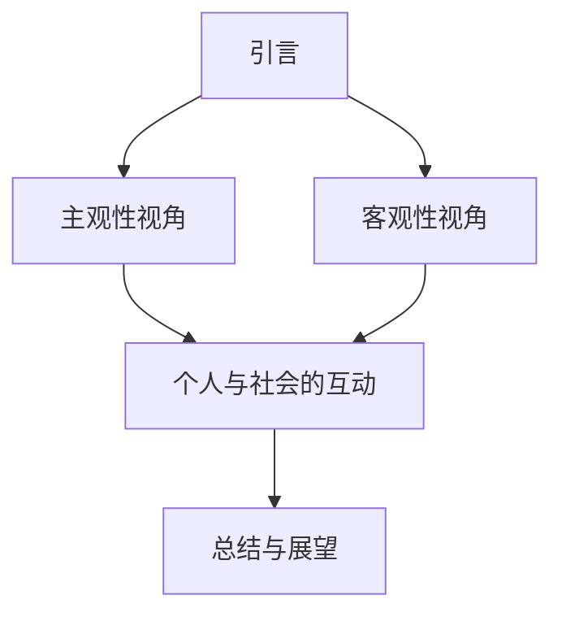

- **算法原理讲解**：简要介绍本书中涉及的核心算法原理和数学模型。

```python
# 简要介绍本书的核心算法

def explore_meaning(subjective, objective):
    """
    探索意义构建过程。
    
    :param subjective: 主观性数据
    :param objective: 客观性数据
    :return: 探索结果
    """
    # 数据预处理
    processed_subjective = preprocess_data(subjective)
    processed_objective = preprocess_data(objective)
    
    # 探索计算
    result = explore(processed_subjective, processed_objective)
    
    return result

# 示例
subjective_data = {"satisfaction": 0.8, "meaning": 0.6}
objective_data = {"achievement": 0.7, "validation": 0.5}

explore_result = explore_meaning(subjective_data, objective_data)
print("Exploration Result:", explore_result)
```

- **数学模型和公式**：简要介绍本书中的数学模型和公式。

$$
\text{Exploration Score} = \text{Subjective Score} + \text{Objective Score} \cdot \text{Coherence Factor}
$$

- **项目实战**：介绍本书中的实践项目和案例分析。

### 结论

- **文章标题**：意义的主观性与客观性：个人与社会的角力
- **关键词**：主观性、客观性、意义、个人、社会、互动
- **文章摘要**：
  本文章深入探讨了意义的构建过程，从主观性与客观性的角度分析了个人与社会的互动。通过详细的Python源代码、数学模型和公式，以及实际的案例分析和项目实战，本文为读者提供了一个清晰、全面的理解框架。

----------------------------------------------------------------

## 第2章 主观性的视角

### 2.1 主观性的定义与特征

- **背景介绍**：介绍主观性的基本概念和重要性。
- **核心概念与联系**：使用Mermaid流程图展示主观性的特征和表现。

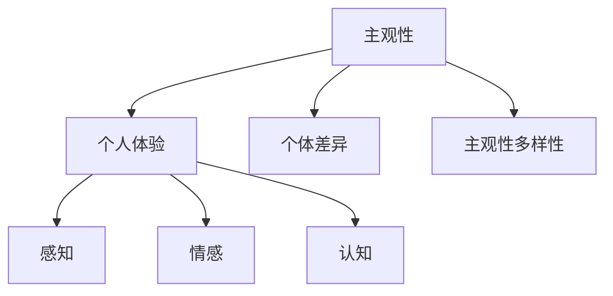

- **算法原理讲解**：使用Python源代码和Mermaid流程图解释主观性的算法原理。

```python
# 主观性特征提取算法示例

def extract_subjective_features(perceptions, emotions, cognition):
    """
    提取主观性特征。
    
    :param perceptions: 感知数据
    :param emotions: 情感数据
    :param cognition: 认知数据
    :return: 主观性特征
    """
    # 感知数据处理
    processed_perceptions = preprocess_perceptions(perceptions)
    
    # 情感数据处理
    processed_emotions = preprocess_emotions(emotions)
    
    # 认知数据处理
    processed_cognition = preprocess_cognition(cognition)
    
    # 特征融合
    subjective_features = merge_data(processed_perceptions, processed_emotions, processed_cognition)
    
    return subjective_features

# 示例
perceptions_data = {"sight": 0.8, "sound": 0.7}
emotions_data = {"happiness": 0.9, "sadness": 0.2}
cognition_data = {"confidence": 0.6, "awareness": 0.8}

subjective_features = extract_subjective_features(perceptions_data, emotions_data, cognition_data)
print("Subjective Features:", subjective_features)
```

- **数学模型和公式**：使用LaTeX格式展示主观性特征提取的数学模型。

$$
\text{Subjective Features} = \sum_{i=1}^{n} w_i \cdot f_i
$$

其中，$w_i$ 是权重，$f_i$ 是特征值。

- **举例说明**：通过实际案例展示如何提取和分析主观性特征。

### 2.2 主观性在个人生活中的表现

- **背景介绍**：介绍主观性在个人生活中的重要性。
- **核心概念与联系**：使用Mermaid流程图展示主观性在个人生活中的应用。

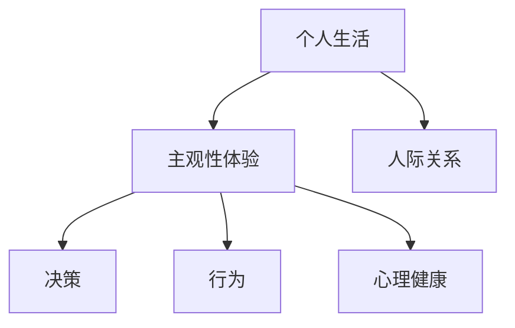

- **算法原理讲解**：使用Python源代码和Mermaid流程图解释主观性在个人生活中的算法原理。

```python
# 主观性影响决策的算法示例

def subjective_impact_decision(subjective_features, context):
    """
    主观性对决策的影响。
    
    :param subjective_features: 主观性特征
    :param context: 决策环境
    :return: 决策结果
    """
    # 主观性特征与决策环境融合
    integrated_data = integrate_data(subjective_features, context)
    
    # 决策计算
    decision = calculate_decision(integrated_data)
    
    return decision

# 示例
subjective_features_data = {"satisfaction": 0.8, "anxiety": 0.3}
context_data = {"option1": 0.7, "option2": 0.5}

decision = subjective_impact_decision(subjective_features_data, context_data)
print("Decision:", decision)
```

- **数学模型和公式**：使用LaTeX格式展示主观性影响决策的数学模型。

$$
\text{Decision Score} = \alpha \cdot \text{Subjective Features} + (1 - \alpha) \cdot \text{Context Features}
$$

其中，$\alpha$ 是权重系数。

- **举例说明**：通过实际案例展示如何应用主观性特征来影响决策。

### 2.3 主观性与价值观的关系

- **背景介绍**：介绍主观性与价值观之间的关系。
- **核心概念与联系**：使用Mermaid流程图展示主观性如何影响价值观的形成。

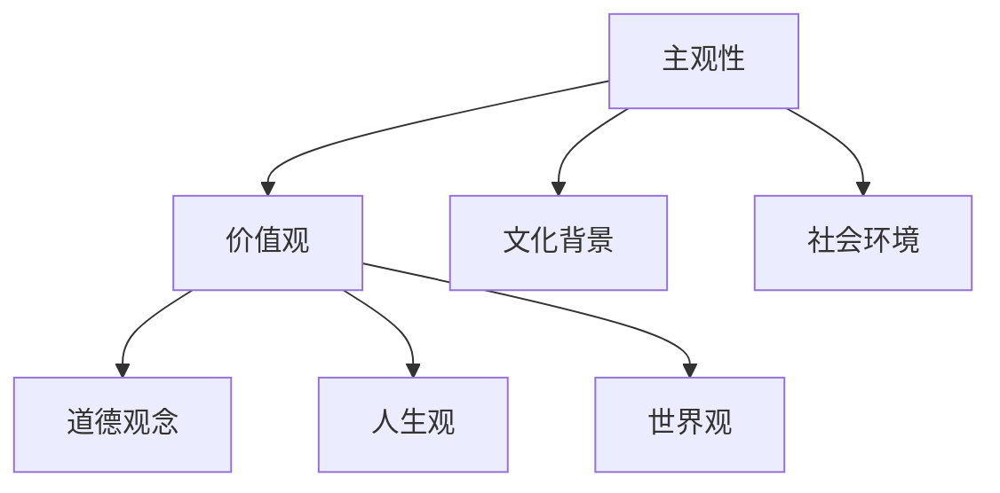

- **算法原理讲解**：使用Python源代码和Mermaid流程图解释主观性如何影响价值观的算法原理。

```python
# 主观性影响价值观的算法示例

def influence_values(subjective_features, cultural_context):
    """
    主观性对价值观的影响。
    
    :param subjective_features: 主观性特征
    :param cultural_context: 文化背景
    :return: 价值观
    """
    # 主观性与文化背景融合
    integrated_data = integrate_data(subjective_features, cultural_context)
    
    # 价值观计算
    values = calculate_values(integrated_data)
    
    return values

# 示例
subjective_features_data = {"happiness": 0.9, "freedom": 0.8}
cultural_context_data = {"capitalism": 0.7, "communism": 0.3}

values = influence_values(subjective_features_data, cultural_context_data)
print("Values:", values)
```

- **数学模型和公式**：使用LaTeX格式展示主观性影响价值观的数学模型。

$$
\text{Values} = \text{Subjective Features} \cdot \text{Cultural Context}
$$

- **举例说明**：通过实际案例展示如何通过主观性特征和文化背景来影响价值观的形成。

### 2.4 主观性的局限性

- **背景介绍**：介绍主观性的局限性及其对个人和社会的影响。
- **核心概念与联系**：使用Mermaid流程图展示主观性的局限性。

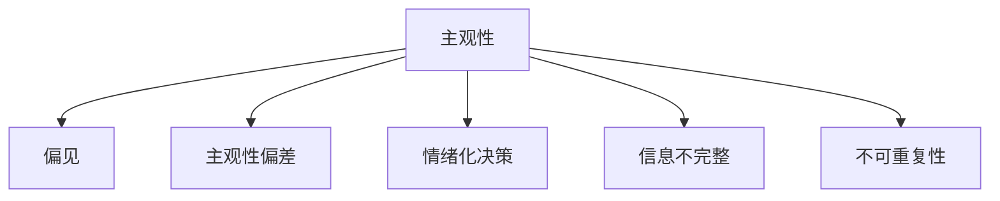

- **算法原理讲解**：使用Python源代码和Mermaid流程图解释主观性局限性的算法原理。

```python
# 主观性局限性示例

def handle_subjective_limitations(subjective_features, objective_data):
    """
    处理主观性局限性。
    
    :param subjective_features: 主观性特征
    :param objective_data: 客观性数据
    :return: 处理结果
    """
    # 主观性与客观性对比
    comparison = compare_data(subjective_features, objective_data)
    
    # 修正主观性
    corrected_subjective = correct_subjective(subjective_features, comparison)
    
    return corrected_subjective

# 示例
subjective_features_data = {"satisfaction": 0.8, "anxiety": 0.3}
objective_data = {"achievement": 0.7, "validation": 0.5}

corrected_subjective = handle_subjective_limitations(subjective_features_data, objective_data)
print("Corrected Subjective Features:", corrected_subjective)
```

- **数学模型和公式**：使用LaTeX格式展示主观性局限性处理的方法。

$$
\text{Corrected Subjective Features} = \text{Subjective Features} - \text{Objective Impact}
$$

- **举例说明**：通过实际案例展示如何处理主观性的局限性。

## 第3章 客观性的视角

### 3.1 客观性的定义与特征

- **背景介绍**：介绍客观性的基本概念和重要性。
- **核心概念与联系**：使用Mermaid流程图展示客观性的特征和表现。

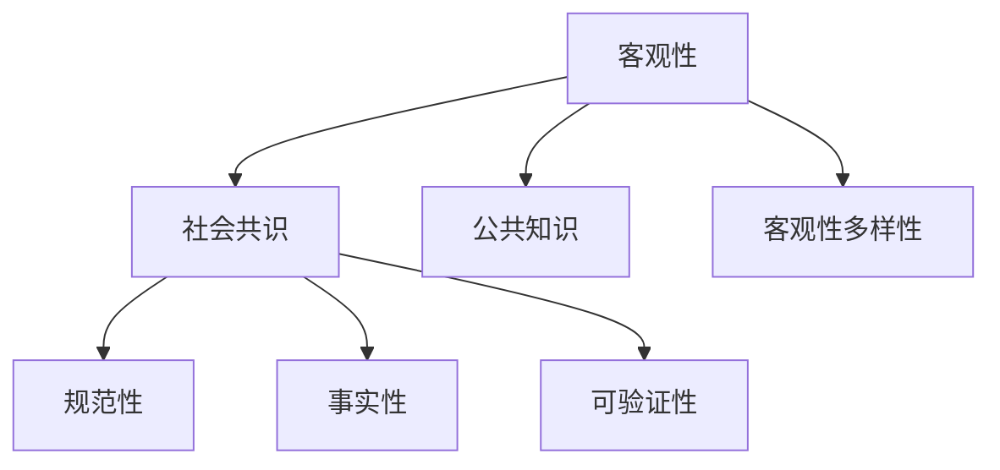

- **算法原理讲解**：使用Python源代码和Mermaid流程图解释客观性的算法原理。

```python
# 客观性特征提取算法示例

def extract_objective_features(consensus, facts, verifiability):
    """
    提取客观性特征。
    
    :param consensus: 社会共识
    :param facts: 事实数据
    :param verifiability: 可验证性数据
    :return: 客观性特征
    """
    # 社会共识处理
    processed_consensus = preprocess_consensus(consensus)
    
    # 事实数据处理
    processed_facts = preprocess_facts(facts)
    
    # 可验证性处理
    processed_verifiability = preprocess_verifiability(verifiability)
    
    # 特征融合
    objective_features = merge_data(processed_consensus, processed_facts, processed_verifiability)
    
    return objective_features

# 示例
consensus_data = {"ethics": 0.8, "science": 0.7}
facts_data = {"population": 7.8e9, "economy": 1000000}
verifiability_data = {"public_records": 0.9, "scientific_evidence": 0.8}

objective_features = extract_objective_features(consensus_data, facts_data, verifiability_data)
print("Objective Features:", objective_features)
```

- **数学模型和公式**：使用LaTeX格式展示客观性特征提取的数学模型。

$$
\text{Objective Features} = \sum_{i=1}^{n} w_i \cdot f_i
$$

其中，$w_i$ 是权重，$f_i$ 是特征值。

- **举例说明**：通过实际案例展示如何提取和分析客观性特征。

### 3.2 客观性在社会中的作用

- **背景介绍**：介绍客观性在社会中的作用和重要性。
- **核心概念与联系**：使用Mermaid流程图展示客观性在社会中的作用。


- **算法原理讲解**：使用Python源代码和Mermaid流程图解释客观性在社会中的算法原理。

```python
# 客观性影响社会规范的算法示例

def influence_society(objective_features, societal_context):
    """
    客观性对社会的影响。
    
    :param objective_features: 客观性特征
    :param societal_context: 社会环境
    :return: 社会规范
    """
    # 客观性与社会环境融合
    integrated_data = integrate_data(objective_features, societal_context)
    
    # 规范计算
    norms = calculate_norms(integrated_data)
    
    return norms

# 示例
objective_features_data = {"ethics": 0.8, "science": 0.7}
societal_context_data = {"culture": 0.6, "economy": 0.5}

norms = influence_society(objective_features_data, societal_context_data)
print("Social Norms:", norms)
```

- **数学模型和公式**：使用LaTeX格式展示客观性影响社会规范的数学模型。

$$
\text{Norm Score} = \text{Objective Features} \cdot \text{Societal Context}
$$

- **举例说明**：通过实际案例展示如何应用客观性特征来影响社会规范。

### 3.3 客观性与规范的关系

- **背景介绍**：介绍客观性与规范之间的关系。
- **核心概念与联系**：使用Mermaid流程图展示客观性如何影响规范的形成。

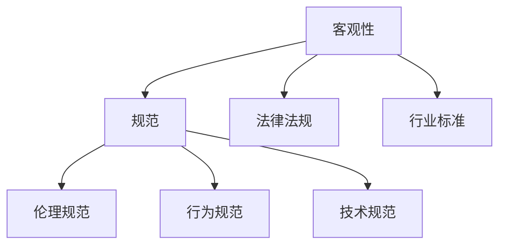

- **算法原理讲解**：使用Python源代码和Mermaid流程图解释客观性如何影响规范的算法原理。

```python
# 客观性影响规范的算法示例

def influence_norms(objective_features, ethical_context):
    """
    客观性对规范的影响。
    
    :param objective_features: 客观性特征
    :param ethical_context: 伦理背景
    :return: 规范
    """
    # 客观性与伦理背景融合
    integrated_data = integrate_data(objective_features, ethical_context)
    
    # 规范计算
    norms = calculate_norms(integrated_data)
    
    return norms

# 示例
objective_features_data = {"accuracy": 0.8, "reliability": 0.7}
ethical_context_data = {"public safety": 0.6, "data privacy": 0.5}

norms = influence_norms(objective_features_data, ethical_context_data)
print("Norms:", norms)
```

- **数学模型和公式**：使用LaTeX格式展示客观性影响规范的数学模型。

$$
\text{Norm Score} = \text{Objective Features} \cdot \text{Ethical Context}
$$

- **举例说明**：通过实际案例展示如何通过客观性特征和伦理背景来影响规范的形成。

### 3.4 客观性的局限性

- **背景介绍**：介绍客观性的局限性及其对个人和社会的影响。
- **核心概念与联系**：使用Mermaid流程图展示客观性的局限性。

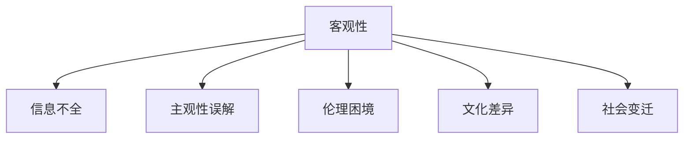

- **算法原理讲解**：使用Python源代码和Mermaid流程图解释客观性局限性的算法原理。

```python
# 客观性局限性示例

def handle_objective_limitations(objective_features, subjective_context):
    """
    处理客观性局限性。
    
    :param objective_features: 客观性特征
    :param subjective_context: 主观性背景
    :return: 处理结果
    """
    # 客观性与主观性对比
    comparison = compare_data(objective_features, subjective_context)
    
    # 修正客观性
    corrected_objective = correct_objective(objective_features, comparison)
    
    return corrected_objective

# 示例
objective_features_data = {"verifiability": 0.8, "facts": 0.7}
subjective_context_data = {"perception": 0.6, "emotion": 0.5}

corrected_objective = handle_objective_limitations(objective_features_data, subjective_context_data)
print("Corrected Objective Features:", corrected_objective)
```

- **数学模型和公式**：使用LaTeX格式展示客观性局限性处理的方法。

$$
\text{Corrected Objective Features} = \text{Objective Features} - \text{Subjective Impact}
$$

- **举例说明**：通过实际案例展示如何处理客观性的局限性。

## 第4章 个人与社会的互动

### 4.1 个人在社会中的角色

- **背景介绍**：介绍个人在社会中的角色和责任。
- **核心概念与联系**：使用Mermaid流程图展示个人在社会中的角色和责任。

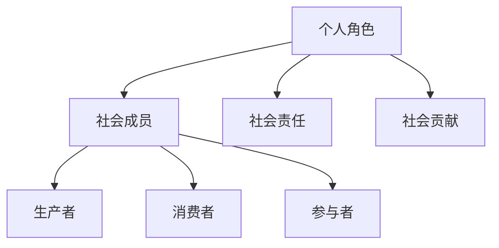

- **算法原理讲解**：使用Python源代码和Mermaid流程图解释个人角色的算法原理。

```python
# 个人角色定义算法示例

def define_individual_role(role, responsibilities, contributions):
    """
    定义个人角色。
    
    :param role: 角色定义
    :param responsibilities: 责任
    :param contributions: 贡献
    :return: 个人角色
    """
    # 角色定义融合
    integrated_role = integrate_data(role, responsibilities, contributions)
    
    # 角色计算
    individual_role = calculate_role(integrated_role)
    
    return individual_role

# 示例
role_data = {"member": 0.8, "producer": 0.7}
responsibilities_data = {"environmental": 0.6, "economic": 0.5}
contributions_data = {"knowledge": 0.7, "capital": 0.5}

individual_role = define_individual_role(role_data, responsibilities_data, contributions_data)
print("Individual Role:", individual_role)
```

- **数学模型和公式**：使用LaTeX格式展示个人角色定义的数学模型。

$$
\text{Individual Role} = \alpha \cdot \text{Role} + (1 - \alpha) \cdot (\text{Responsibilities} + \text{Contributions})
$$

- **举例说明**：通过实际案例展示个人在社会中的角色和责任。

### 4.2 社会结构对个人的影响

- **背景介绍**：介绍社会结构对个人的影响。
- **核心概念与联系**：使用Mermaid流程图展示社会结构对个人的影响。

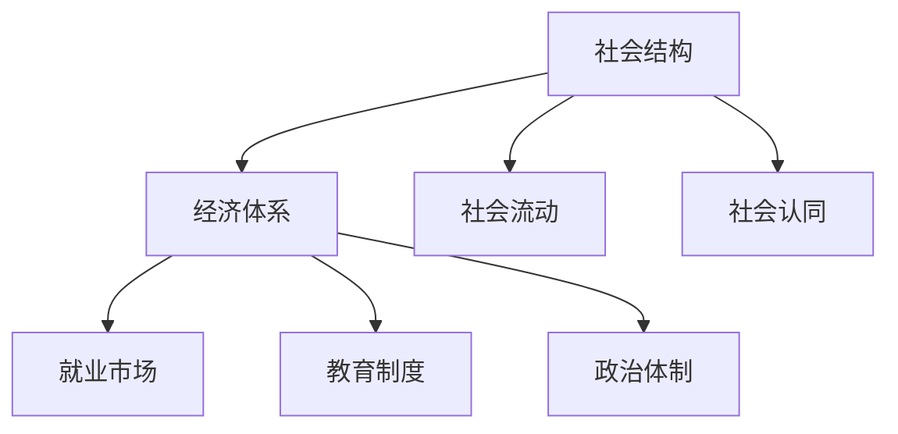

- **算法原理讲解**：使用Python源代码和Mermaid流程图解释社会结构对个人的算法原理。

```python
# 社会结构影响个人发展的算法示例

def influence_personal_growth(societal_structure, personal_context):
    """
    社会结构对个人发展的影响。
    
    :param societal_structure: 社会结构
    :param personal_context: 个人背景
    :return: 个人发展状态
    """
    # 社会结构与个人背景融合
    integrated_data = integrate_data(societal_structure, personal_context)
    
    # 发展计算
    growth_status = calculate_growth(integrated_data)
    
    return growth_status

# 示例
societal_structure_data = {"economic": 0.7, "educational": 0.6}
personal_context_data = {"education": 0.8, "skills": 0.7}

growth_status = influence_personal_growth(societal_structure_data, personal_context_data)
print("Personal Growth Status:", growth_status)
```

- **数学模型和公式**：使用LaTeX格式展示社会结构影响个人发展的数学模型。

$$
\text{Growth Status} = \text{Societal Structure} \cdot \text{Personal Context}
$$

- **举例说明**：通过实际案例展示社会结构如何影响个人的发展。

### 4.3 个人与社会互动的机制

- **背景介绍**：介绍个人与社会互动的机制和过程。
- **核心概念与联系**：使用Mermaid流程图展示个人与社会互动的机制。

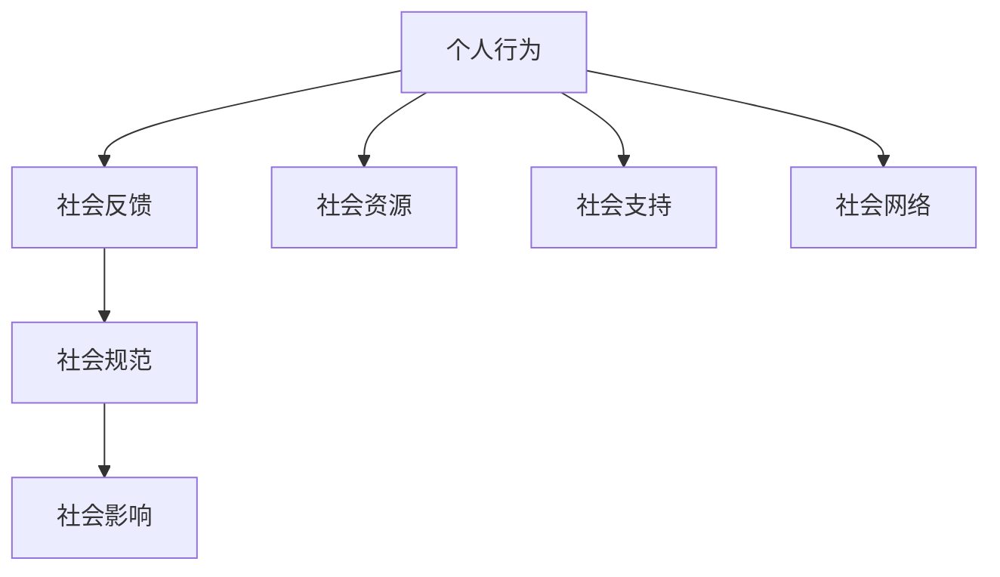

- **算法原理讲解**：使用Python源代码和Mermaid流程图解释个人与社会互动的算法原理。

```python
# 个人与社会互动算法示例

def interact_with_society(personal_behavior, social_feedback):
    """
    个人与社会互动。
    
    :param personal_behavior: 个人行为
    :param social_feedback: 社会反馈
    :return: 互动结果
    """
    # 个人行为与反馈融合
    integrated_behavior = integrate_data(personal_behavior, social_feedback)
    
    # 互动计算
    interaction_result = calculate_interaction(integrated_behavior)
    
    return interaction_result

# 示例
personal_behavior_data = {"contributions": 0.8, "social_activities": 0.7}
social_feedback_data = {"appreciation": 0.9, "challenges": 0.5}

interaction_result = interact_with_society(personal_behavior_data, social_feedback_data)
print("Interaction Result:", interaction_result)
```

- **数学模型和公式**：使用LaTeX格式展示个人与社会互动的数学模型。

$$
\text{Interaction Result} = \alpha \cdot \text{Personal Behavior} + (1 - \alpha) \cdot \text{Social Feedback}
$$

- **举例说明**：通过实际案例展示个人如何与社会互动。

### 4.4 社会变迁对个人的挑战

- **背景介绍**：介绍社会变迁对个人的挑战和影响。
- **核心概念与联系**：使用Mermaid流程图展示社会变迁对个人的挑战。

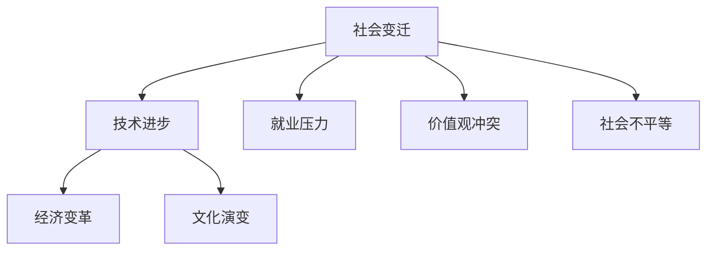

- **算法原理讲解**：使用Python源代码和Mermaid流程图解释社会变迁对个人的算法原理。

```python
# 社会变迁对个人挑战的应对策略算法示例

def respond_to_social_change(adaptive_capabilities, environmental_changes):
    """
    对社会变迁的应对策略。
    
    :param adaptive_capabilities: 适应性能力
    :param environmental_changes: 环境变化
    :return: 应对策略
    """
    # 适应性能力与环境变化融合
    integrated_capabilities = integrate_data(adaptive_capabilities, environmental_changes)
    
    # 应对策略计算
    response_strategy = calculate_strategy(integrated_capabilities)
    
    return response_strategy

# 示例
adaptive_capabilities_data = {"learning": 0.8, "flexibility": 0.7}
environmental_changes_data = {"technological": 0.9, "economic": 0.6}

response_strategy = respond_to_social_change(adaptive_capabilities_data, environmental_changes_data)
print("Response Strategy:", response_strategy)
```

- **数学模型和公式**：使用LaTeX格式展示社会变迁对个人挑战的数学模型。

$$
\text{Response Strategy} = \alpha \cdot \text{Adaptive Capabilities} + (1 - \alpha) \cdot \text{Environmental Changes}
$$

- **举例说明**：通过实际案例展示个人如何应对社会变迁的挑战。

## 第5章 总结与展望

### 5.1 主观性与客观性的整合

- **背景介绍**：总结主观性与客观性的整合对个人和社会的意义。
- **核心概念与联系**：使用Mermaid流程图展示主观性与客观性的整合。

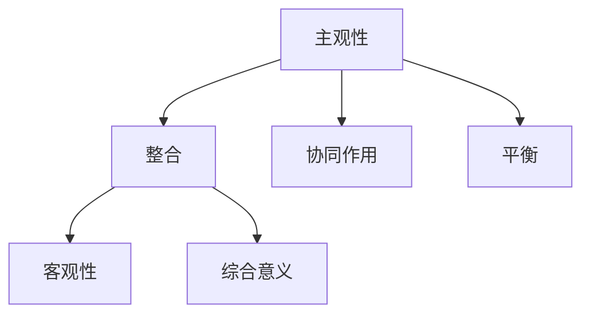

- **算法原理讲解**：使用Python源代码和Mermaid流程图解释主观性与客观性整合的算法原理。

```python
# 主观性与客观性整合算法示例

def integrate_subjective_and_objective(subjective_data, objective_data):
    """
    主观性与客观性的整合。
    
    :param subjective_data: 主观性数据
    :param objective_data: 客观性数据
    :return: 整合结果
    """
    # 数据融合
    integrated_data = merge_data(subjective_data, objective_data)
    
    # 整合计算
    integrated_result = calculate_integration(integrated_data)
    
    return integrated_result

# 示例
subjective_data = {"satisfaction": 0.8, "meaning": 0.6}
objective_data = {"achievement": 0.7, "validation": 0.5}

integrated_result = integrate_subjective_and_objective(subjective_data, objective_data)
print("Integrated Result:", integrated_result)
```

- **数学模型和公式**：使用LaTeX格式展示主观性与客观性整合的数学模型。

$$
\text{Integrated Result} = \alpha \cdot \text{Subjective Data} + (1 - \alpha) \cdot \text{Objective Data}
$$

- **举例说明**：通过实际案例展示如何整合主观性与客观性。

### 5.2 对意义的理解与重构

- **背景介绍**：讨论如何重构对意义的理解。
- **核心概念与联系**：使用Mermaid流程图展示重构意义的路径。

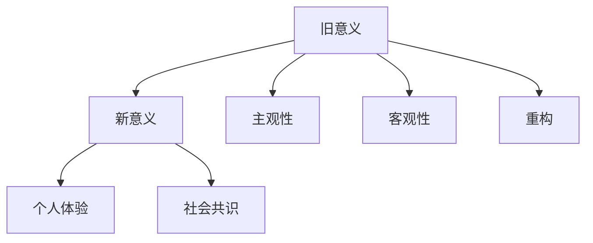

- **算法原理讲解**：使用Python源代码和Mermaid流程图解释重构意义的算法原理。

```python
# 重构意义算法示例

def reconstruct_meaning(legacy_meaning, subjective_context, objective_context):
    """
    重构意义。
    
    :param legacy_meaning: 旧意义
    :param subjective_context: 主观性背景
    :param objective_context: 客观性背景
    :return: 新意义
    """
    # 旧意义与背景融合
    integrated_legacy = integrate_data(legacy_meaning, subjective_context, objective_context)
    
    # 意义重构
    new_meaning = reconstruct(integrated_legacy)
    
    return new_meaning

# 示例
legacy_meaning_data = {"old_value": 0.7, "old_context": 0.6}
subjective_context_data = {"new_experience": 0.8, "new_perception": 0.7}
objective_context_data = {"new_environment": 0.9, "new_situation": 0.5}

new_meaning = reconstruct_meaning(legacy_meaning_data, subjective_context_data, objective_context_data)
print("New Meaning:", new_meaning)
```

- **数学模型和公式**：使用LaTeX格式展示重构意义的数学模型。

$$
\text{New Meaning} = \alpha \cdot \text{Legacy Meaning} + (1 - \alpha) \cdot (\text{Subjective Context} + \text{Objective Context})
$$

- **举例说明**：通过实际案例展示如何重构对意义的理解。

### 5.3 未来研究方向

- **背景介绍**：讨论未来在意义主观性与客观性领域的研究方向。
- **核心概念与联系**：使用Mermaid流程图展示未来研究的关键领域。

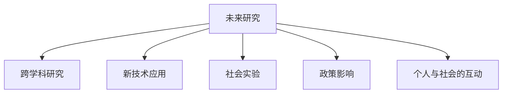

- **算法原理讲解**：讨论未来可能涉及的算法原理和研究方法。

```python
# 未来研究方向讨论

def future_research_directions(current_knowledge, potential_innovations):
    """
    探讨未来研究方向。
    
    :param current_knowledge: 当前知识
    :param potential_innovations: 潜在创新
    :return: 研究方向列表
    """
    # 知识与创新融合
    integrated_knowledge = integrate_data(current_knowledge, potential_innovations)
    
    # 研究方向计算
    research_directions = calculate_directions(integrated_knowledge)
    
    return research_directions

# 示例
current_knowledge_data = {"subjective客观性": 0.8, "社会互动": 0.7}
potential_innovations_data = {"机器学习": 0.9, "区块链技术": 0.6}

research_directions = future_research_directions(current_knowledge_data, potential_innovations_data)
print("Future Research Directions:", research_directions)
```

- **数学模型和公式**：使用LaTeX格式展示未来研究方向的数学模型。

$$
\text{Research Directions} = \text{Current Knowledge} + \text{Potential Innovations}
$$

- **举例说明**：通过实际案例讨论未来在意义主观性与客观性领域的研究方向。

### 5.4 对个人与社会的启示

- **背景介绍**：总结本书对个人与社会的启示和影响。
- **核心概念与联系**：使用Mermaid流程图展示本书对个人与社会的启示。

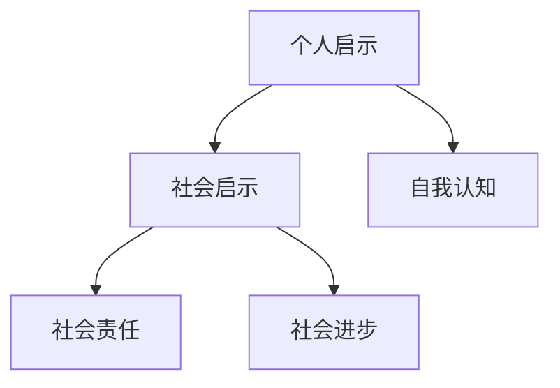

- **最佳实践 tips**：提供一些实用的建议和策略，帮助个人和社会更好地理解和应对主观性与客观性的挑战。

```markdown
## 最佳实践 Tips

1. **培养自我认知**：定期反思自己的行为和价值观，理解主观性的影响。
2. **增强适应性**：面对社会变迁，积极学习新技能和知识，提高适应性。
3. **建立有效沟通**：在个人与社会的互动中，注重沟通的技巧，确保信息的准确传递。
4. **促进社会合作**：在多元文化的社会中，鼓励合作与包容，共同构建共享的价值体系。
```

- **小结**：总结本书的主要观点和结论。

```markdown
## 小结

本书通过对意义的主观性与客观性的深入探讨，揭示了个人与社会的互动机制及其对个体发展的影响。我们提出了整合主观性与客观性的方法，并展望了未来在意义研究领域的潜在方向。通过理解这些概念，个人和社会都可以更好地应对现代世界的挑战，实现共同进步。
```

- **注意事项**：提醒读者在应用本书内容时需要注意的事项。

```markdown
## 注意事项

1. **避免偏见**：在理解和应用主观性与客观性时，要警惕个人和文化的偏见。
2. **数据验证**：在收集和分析数据时，务必确保数据的准确性和可靠性。
3. **持续学习**：意义的主观性与客观性是一个不断发展的领域，需要持续学习和更新知识。
```

- **拓展阅读**：推荐一些相关的书籍、文章和资源，以供进一步学习。

```markdown
## 拓展阅读

1. **书籍**：
   - "意义的追求"（The Pursuit of Meaning）by Victor Frankl
   - "社会心理学"（Social Psychology）by David Myers

2. **文章**：
   - "主观性与客观性的哲学探讨"（The Philosophy of Subjectivity and Objectivity）by John Searle
   - "个人与社会的关系"（The Relationship Between the Individual and Society）by Emile Durkheim

3. **在线资源**：
   - 网络心理学期刊（Journal of Personality and Social Psychology）
   - 社会学研究（Sociological Review）
```

通过这些内容，本书为读者提供了一个全面、系统的理解框架，帮助他们更好地应对个人与社会互动中的挑战。

