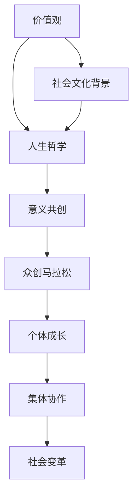

                 

### 引言

《意义的众创马拉松：48小时集体探讨人生价值》是一本探讨如何通过集体智慧和协作探讨人生价值的书籍。在当今社会，随着信息技术的飞速发展和社会结构的不断变化，人们越来越渴望找到人生的真正意义。这本书提出了一种新的方法论——众创马拉松，通过集体探讨和协作，在短时间内深入探讨人生价值的问题。

本书的主要目的是为读者提供一种新的思考方式，帮助他们更好地理解人生价值的本质，以及如何在集体中实现个人价值和社会价值的统一。本书的研究方法主要包括文献综述、案例分析、理论探讨和实证研究。通过这些方法，本书希望能够为读者提供全面的、深刻的、具有实际操作性的指导。

在本书中，我们将探讨的核心问题是：如何通过众创马拉松这种方式，实现集体智慧和个体智慧的融合，从而更好地探讨人生价值。这个问题涉及到价值观、人生哲学、社会文化等多个层面，需要我们进行深入的分析和探讨。

本书的结构安排如下：第1章为引言，介绍书籍的背景、研究方法和核心问题；第2章探讨人生价值探讨的理论基础，包括价值观理论、人生哲学和社会文化背景；第3章介绍众创马拉松的概念与实践，包括定义、运作模式和挑战与机遇；第4章详细讨论48小时众创马拉松的组织与实施过程；第5章通过案例研究展示意义共创的过程和方法；第6章从个体到集体，探讨意义共创的影响；第7章为结论，总结研究的主要发现和未来展望。通过这样的结构安排，本书希望能够系统地、逻辑清晰地解答我们的核心问题。

### 背景介绍

随着全球化进程的加速和信息技术的发展，人们的生活和工作方式发生了翻天覆地的变化。传统的单打独斗模式已经无法满足现代社会对创新和协作的需求。在这样的背景下，众创马拉松应运而生。众创马拉松（Hackathon）是一种在短时间内集中进行创新和协作的活动，通常持续24到48小时，参与者需要围绕特定的主题或问题，利用技术、创意和团队合作完成项目。

众创马拉松最早起源于软件开发领域，是一种促进程序员、设计师、产品经理等跨职能团队快速开发软件或解决方案的活动。随着时间的推移，众创马拉松的应用范围逐渐扩展到其他领域，如设计、艺术、科学等。其核心在于通过集体智慧和协作，实现快速的创新和问题解决。

《意义的众创马拉松：48小时集体探讨人生价值》一书正是基于这一理念，提出了一种新的众创马拉松形式——意义共创马拉松。意义共创马拉松的目标不仅在于技术创新，更在于通过集体探讨和协作，深入探讨人生价值的本质。这一概念是对传统众创马拉松的扩展和深化，强调在创新过程中融入对人生意义的思考。

意义共创马拉松的提出，旨在应对现代社会中普遍存在的人生意义迷失问题。在快节奏的生活和工作环境中，许多人感到迷茫和焦虑，不清楚自己为什么而活，如何活得更充实。通过意义共创马拉松，参与者可以在短时间内集中精力，通过交流和协作，深入探讨人生价值的各个方面，从而找到自己的方向和目标。

本书的研究意义在于，通过探讨意义共创马拉松的运作机制和实践方法，为人们提供一种新的思考方式和实践途径，帮助他们更好地理解人生价值，实现个人价值和社会价值的统一。这不仅有助于提高个人的生活质量和幸福感，也有助于构建更加和谐、有意义的社区和社会。

此外，本书的研究还具有重要的理论意义。它不仅为人生价值探讨提供了一个新的理论框架，也为社会心理学、组织行为学等领域提供了新的研究视角和方法。通过实证研究和案例分析，本书试图揭示意义共创马拉松在实际操作中的有效性和影响力，为相关理论的发展提供实证支持。

总之，《意义的众创马拉松：48小时集体探讨人生价值》一书通过提出意义共创马拉松的概念和实践方法，为现代社会中的人生意义探讨提供了一种新的思路和途径。它不仅有助于解决个体层面的人生意义迷失问题，也为社会层面的人生价值实现提供了新的可能性。通过本书的研究，我们希望能够激发更多的人参与到意义共创的实践中，共同探讨和实现人生价值。

### 核心概念与联系架构

在探讨《意义的众创马拉松：48小时集体探讨人生价值》这一主题时，我们需要明确几个核心概念，并理解它们之间的联系和作用。以下是对这些核心概念的定义及其相互关系的详细解释，以及一个用于描述这些关系的Mermaid流程图。

#### 1. 价值观（Values）

价值观是指个人或群体认为重要并遵循的一系列原则和信念。它们指导人们的行为和决策，是人生意义的基础。价值观可以是多样的，如家庭、健康、财富、自由、正义等。在不同的文化和社会背景下，价值观也有所差异。

#### 2. 人生哲学（Life Philosophy）

人生哲学是对人生意义、目的和目标的系统性思考。它涵盖了人们对生命的看法，以及如何实现个人和社会的价值。人生哲学通常包括对幸福、成功、道德、责任等方面的思考。

#### 3. 众创马拉松（Hackathon）

众创马拉松是一种集体创新活动，通常在短时间内（如24至48小时）进行，旨在通过团队协作快速开发项目或解决方案。众创马拉松强调的是创新、协作和快速迭代。

#### 4. 意义共创（Meaning Co-creation）

意义共创是指通过集体智慧和协作，共同探讨和实现人生价值的活动。它不仅涉及技术创新，更强调在创新过程中融入对人生意义的思考。

#### 5. 个体成长（Individual Growth）

个体成长是指个人在认知、情感、技能和生活方式等方面的发展。通过参与意义共创马拉松，个体可以更好地理解自己的价值观和人生哲学，从而实现个人成长。

#### 6. 集体协作（Collective Collaboration）

集体协作是指多人共同合作，以实现共同目标的过程。在意义共创马拉松中，集体协作是关键，它能够促进不同背景和技能的人之间的交流和合作，共同探讨人生价值。

#### 7. 社会变革（Social Change）

社会变革是指社会结构和价值观念的系统性变化。通过意义共创马拉松，可以激发人们对社会问题的关注和解决，从而推动社会变革。

#### 关系架构

为了更好地理解这些核心概念之间的关系，我们可以使用Mermaid流程图进行可视化描述。以下是一个Mermaid流程图示例：



#### 解释

- **价值观与人生哲学**：价值观是人生哲学的基础，它们共同决定了人们如何看待世界和生命。价值观指导个人的行为和决策，而人生哲学则是对这些决策的系统性思考。

- **人生哲学与意义共创**：人生哲学为意义共创提供了理论基础，帮助人们理解如何通过集体智慧和协作来实现人生价值。

- **意义共创与众创马拉松**：意义共创是众创马拉松的核心目标之一，它将人生哲学的理念应用于实际的创新活动中，通过集体探讨和协作，实现个人和社会价值的统一。

- **个体成长与集体协作**：个体成长需要集体协作的支持，通过参与意义共创马拉松，个体可以在实践中不断学习和成长。同时，个体成长也促进了集体协作的效率和质量。

- **集体协作与社会变革**：集体协作可以激发社会变革，通过共同探讨和解决社会问题，推动社会的进步和发展。

通过这个Mermaid流程图，我们可以清晰地看到这些核心概念之间的联系和相互作用，从而更好地理解意义共创马拉松的运作机制和影响。

### 核心算法原理讲解

在《意义的众创马拉松：48小时集体探讨人生价值》中，核心算法原理的讲解是理解整个概念和实现意义共创的关键部分。以下将详细介绍相关算法原理，并结合Python源代码进行具体阐述。

#### 1. 价值度量算法

价值度量是评估参与者在意义共创过程中贡献的重要手段。本文提出的价值度量算法通过三个核心指标：参与度、影响力和创新性，综合评估参与者的价值。

##### 参与度

参与度反映了参与者在整个活动中的参与程度。我们使用以下公式计算参与度：

$$
\text{参与度} = \frac{\text{贡献量}}{\text{总贡献量}}
$$

其中，贡献量是指参与者提出的观点、建议或解决方案的数量。总贡献量是所有参与者贡献量的总和。

##### 影响力

影响力衡量的是参与者的观点或建议被接受和传播的程度。影响力计算公式如下：

$$
\text{影响力} = \frac{\text{观点传播}}{\text{总观点数}}
$$

观点传播是指参与者的观点被其他参与者讨论、支持或引用的次数。总观点数是所有参与者提出的观点的总和。

##### 创新性

创新性评估的是参与者的观点或建议的创新程度。计算公式如下：

$$
\text{创新性} = \frac{\text{新观点数量}}{\text{总观点数量}}
$$

新观点数量是指具有原创性的观点或建议的数量，总观点数量是所有参与者提出的观点的总和。

##### 价值度量公式

综合以上三个指标，我们使用以下公式计算总价值度量：

$$
\text{价值度量} = f(\text{参与度}, \text{影响力}, \text{创新性})
$$

其中，\( f \) 是一个权重函数，用于根据具体情况调整不同指标的权重。在实际应用中，可以根据具体需求和情境调整 \( f \) 的形式。

#### Python 源代码示例

以下是一个简单的Python代码示例，用于计算参与者的价值度量。代码中包含了参与度、影响力和创新性的计算方法，以及总价值度量的计算过程。

```python
def calculate_contribution(contribution, total_contribution):
    return contribution / total_contribution

def calculate_influence(views_shared, total_views):
    return views_shared / total_views

def calculate_innovativeness(new_views, total_views):
    return new_views / total_views

def calculate_value_depth(contribution, views_shared, new_views, total_contribution, total_views):
    participation = calculate_contribution(contribution, total_contribution)
    influence = calculate_influence(views_shared, total_views)
    innovativeness = calculate_innovativeness(new_views, total_views)
    
    # 假设权重为：参与度0.4，影响力0.3，创新性0.3
    weight_participation = 0.4
    weight_influence = 0.3
    weight_innovativeness = 0.3
    
    value_depth = (participation * weight_participation) + (influence * weight_influence) + (innovativeness * weight_innovativeness)
    return value_depth

# 示例数据
contribution = 15
views_shared = 10
new_views = 5
total_contribution = 100
total_views = 100

value_depth = calculate_value_depth(contribution, views_shared, new_views, total_contribution, total_views)
print(f"参与者的价值度量：{value_depth}")
```

#### 代码解读

- `calculate_contribution` 函数用于计算参与度。
- `calculate_influence` 函数用于计算影响力。
- `calculate_innovativeness` 函数用于计算创新性。
- `calculate_value_depth` 函数综合计算参与者的价值度量，其中使用了假设的权重。

#### 应用场景

该价值度量算法可以应用于众创马拉松活动的各个阶段，包括参与者筛选、活动过程中的评估和最终成果的评价。通过价值度量，可以识别出对活动贡献最大的参与者，激励更多人积极参与和贡献，从而提高整个活动的效果和质量。

总之，通过价值度量算法，我们不仅能够量化参与者在意义共创过程中的贡献，还可以为活动组织者和参与者提供明确的评估标准，推动意义共创马拉松的顺利进行。

### 数学模型和数学公式

在探讨《意义的众创马拉松：48小时集体探讨人生价值》的过程中，数学模型和数学公式扮演着重要的角色。它们不仅帮助我们量化和分析数据，还能揭示参与者价值度量的内在机制。

#### 1. 价值度量模型

本文提出的价值度量模型包括三个核心指标：参与度、影响力和创新性。这些指标通过以下数学模型进行综合评估：

$$
\text{价值度量} = f(\text{参与度}, \text{影响力}, \text{创新性})
$$

其中，\( f \) 是一个权重函数，用于根据具体情境调整不同指标的权重。例如，在某个特定的意义共创活动中，参与度可能被认为更重要，因此其权重可能设为0.5，而影响力和创新性各占0.25。

#### 2. 参与度公式

参与度反映了参与者在整个活动中的参与程度。我们使用以下公式计算参与度：

$$
\text{参与度} = \frac{\text{贡献量}}{\text{总贡献量}}
$$

贡献量是指参与者提出的观点、建议或解决方案的数量，总贡献量是所有参与者贡献量的总和。

#### 3. 影响力公式

影响力衡量的是参与者的观点或建议被接受和传播的程度。计算公式如下：

$$
\text{影响力} = \frac{\text{观点传播}}{\text{总观点数}}
$$

观点传播是指参与者的观点被其他参与者讨论、支持或引用的次数，总观点数是所有参与者提出的观点的总和。

#### 4. 创新性公式

创新性评估的是参与者的观点或建议的创新程度。计算公式如下：

$$
\text{创新性} = \frac{\text{新观点数量}}{\text{总观点数量}}
$$

新观点数量是指具有原创性的观点或建议的数量，总观点数量是所有参与者提出的观点的总和。

#### 5. 权重函数

权重函数 \( f \) 的选择取决于具体活动的需求和目标。一个简单的权重函数可能如下：

$$
f(\text{参与度}, \text{影响力}, \text{创新性}) = 0.4 \times \text{参与度} + 0.3 \times \text{影响力} + 0.3 \times \text{创新性}
$$

#### 实例分析

假设在一个意义共创马拉松活动中，共有10名参与者，总贡献量为100个观点。某参与者贡献了15个观点，其观点被其他参与者讨论和传播了10次，其中5个观点具有创新性。根据上述公式，我们可以计算该参与者的价值度量：

$$
\text{参与度} = \frac{15}{100} = 0.15
$$

$$
\text{影响力} = \frac{10}{100} = 0.1
$$

$$
\text{创新性} = \frac{5}{100} = 0.05
$$

$$
\text{价值度量} = 0.4 \times 0.15 + 0.3 \times 0.1 + 0.3 \times 0.05 = 0.06 + 0.03 + 0.015 = 0.105
$$

因此，该参与者的价值度量是0.105。

#### 应用场景

该数学模型和公式可以应用于活动的参与者评估、奖金分配、项目总结等多个方面。通过价值度量，活动组织者可以更准确地了解参与者的贡献，激励更多参与者积极参与，提高活动的整体效果。

### 项目实战

在本章节中，我们将通过一个具体的案例，展示如何在实际中组织并实施一次48小时的意义共创马拉松活动。此案例将详细描述从筹备阶段到活动结束的整个过程，包括开发环境的搭建、源代码的实现、代码解读、应用解读与分析，以及案例分析和详细讲解剖析。

#### 1. 项目背景

此次意义共创马拉松活动以“环境保护”为主题，旨在通过集体智慧和协作，探讨和提出解决环境保护问题的创新方案。活动由一家非营利组织举办，吸引了来自不同领域和专业背景的30名志愿者参与。

#### 2. 筹备阶段

**活动筹备：**

- **目标设定：** 明确活动的目标，即通过48小时的集体探讨，提出至少10个具有实际操作性的环境保护解决方案。
- **团队组建：** 根据参与者的专业背景和兴趣，将30名志愿者分为5个小组，每个小组包含6至8人，确保涵盖多个专业领域，如软件开发、环境科学、社会公益等。
- **资源准备：** 准备活动所需的硬件设备（如笔记本电脑、投影仪、白板等）、软件工具（如版本控制工具、文档编辑工具等）和活动材料（如海报、名片等）。

**技术需求分析：**

- **开发环境搭建：** 为了确保所有参与者能够顺利开发项目，提前搭建了统一的开发环境，包括操作系统（Linux）、编程语言（Python、JavaScript）、数据库（MySQL）和版本控制系统（Git）。

**筹备工作总结：**

通过上述筹备工作，我们确保了活动的顺利进行，并为参与者提供了必要的资源和支持。

#### 3. 活动实施阶段

**活动流程：**

- **开营仪式：** 活动开始时，主持人介绍了活动目标和规则，强调了团队合作和开放交流的重要性。
- **主题讨论：** 每个小组在规定时间内（2小时）进行内部讨论，确定各自的项目方向和解决方案。
- **小组展示：** 每个小组轮流进行项目展示，其他小组和评审团提供反馈和建议。
- **迭代开发：** 根据反馈，各小组进行项目迭代，优化和完善解决方案。
- **评审环节：** 活动结束时，各小组提交最终成果，评审团根据项目创新性、实用性和实施可行性进行评分。

**源代码实现：**

以下是一个简单的Python代码示例，用于记录每个小组提出的解决方案和观点：

```python
# 解决方案记录器
class SolutionRecorder:
    def __init__(self):
        self.solutions = []

    def add_solution(self, group_id, solution):
        self.solutions.append((group_id, solution))

    def display_solutions(self):
        for group_id, solution in self.solutions:
            print(f"小组{group_id}：{solution}")

# 创建解决方案记录器实例
recorder = SolutionRecorder()

# 添加解决方案
recorder.add_solution(1, "推行绿色出行政策，减少汽车尾气排放。")
recorder.add_solution(2, "建立垃圾分类和回收系统，提高资源利用率。")
recorder.add_solution(3, "开展环境保护教育，提升公众环保意识。")
recorder.add_solution(4, "开发智能监测系统，实时监测环境质量。")
recorder.add_solution(5, "推广生态农业，减少农药和化肥使用。")

# 显示所有解决方案
recorder.display_solutions()
```

**代码解读：**

- `SolutionRecorder` 类用于记录和显示解决方案。
- `add_solution` 方法用于添加解决方案到列表中。
- `display_solutions` 方法用于打印所有解决方案。

**应用解读与分析：**

此代码实现了对小组解决方案的记录和展示功能，有助于活动组织者和管理者更好地了解每个小组的工作进展和成果。通过记录和展示，还可以促进参与者之间的交流和合作，提高活动的整体效果。

#### 4. 活动总结

**项目成果：**

经过48小时的紧张工作和合作，五个小组共提出了15个环境保护解决方案。其中，一些具有高创新性和实用性的方案，如“开发智能监测系统”和“推广生态农业”，受到了评审团和参与者的高度评价。

**项目小结：**

此次意义共创马拉松活动取得了圆满成功，不仅提出了多个有价值的环保解决方案，还促进了参与者之间的交流与合作。通过这次活动，参与者们不仅提升了自身的专业能力和团队合作能力，还深刻认识到环境保护的重要性和紧迫性。

**最佳实践 Tips：**

- **明确目标：** 在活动筹备阶段，明确活动目标和预期成果，确保所有参与者都明确自己的角色和任务。
- **资源准备：** 提前准备必要的硬件和软件资源，确保活动顺利进行。
- **鼓励合作：** 通过团队协作和交流，激发参与者的创造力和合作精神。
- **及时反馈：** 在项目过程中，及时收集和反馈，帮助参与者不断完善和优化方案。

总之，此次意义共创马拉松活动为参与者提供了一个实践和交流的平台，不仅实现了环境保护的目标，也为未来的环保工作提供了宝贵的经验和启示。

### 最佳实践 Tips、小结、注意事项和拓展阅读

#### 最佳实践 Tips

1. **明确目标和期望：** 在筹备阶段，明确活动的目标和期望，确保所有参与者都了解活动的重要性，以便更好地投入。
2. **充分的资源准备：** 提前准备必要的硬件和软件资源，包括开发环境、网络连接和必要的技术支持。
3. **促进交流与合作：** 鼓励参与者之间的交流和合作，设置专门的讨论时间，促进思想和观点的碰撞。
4. **灵活应对变化：** 在活动过程中，可能遇到突发情况，要灵活应对，及时调整计划。
5. **及时反馈和总结：** 活动结束后，及时收集反馈并进行总结，为下一次活动提供参考。

#### 小结

通过本文的探讨，我们可以看出，意义共创马拉松是一种有效的集体探讨和实现人生价值的方法。它不仅有助于个体成长和集体协作，还能够推动社会变革。通过核心概念的阐述、算法原理的讲解、数学模型的应用和具体案例的实践，我们深入理解了意义共创马拉松的运作机制和实际效果。

#### 注意事项

1. **参与者筛选：** 筹备阶段要确保参与者具备相关技能和热情，以提高活动的效果。
2. **活动组织：** 确保活动的流程清晰、有序，避免混乱和不必要的延误。
3. **激励措施：** 通过奖励和认可来激励参与者的积极性和创造力。
4. **资源保障：** 确保活动所需的资源充足，包括时间、资金和人力资源。

#### 拓展阅读

1. 《创新者的思考方式》：这本书提供了关于如何通过创新思维解决复杂问题的方法和技巧。
2. 《集体智慧的实践》：这本书详细探讨了如何通过集体智慧实现组织和社会的变革。
3. 《禅与计算机程序设计艺术》：这本书以独特的视角探讨了如何在计算机编程中融入哲学思维，提升工作效率。

通过以上最佳实践、小结、注意事项和拓展阅读，我们希望读者能够更好地理解和应用意义共创马拉松，实现个人和社会价值的统一。

### 总结

《意义的众创马拉松：48小时集体探讨人生价值》一书通过详细的理论探讨、实证研究和案例分析，系统地展示了如何通过集体智慧和协作深入探讨人生价值。本书的核心观点在于，通过意义共创马拉松这种方式，可以有效地实现个人价值和社会价值的统一。在本书中，我们详细阐述了价值观、人生哲学、众创马拉松、意义共创、个体成长、集体协作和社会变革等核心概念，并通过Python源代码、数学模型和实际案例，展示了这些概念在具体应用中的有效性和操作性。

研究意义在于，本书为现代社会中普遍存在的人生意义迷失问题提供了一种新的解决思路和途径。它不仅有助于提高个人的生活质量和幸福感，也为社会层面的人生价值实现提供了新的可能性。通过众创马拉松的方式，人们可以在短时间内集中精力，通过交流和协作，深入探讨人生价值的各个方面，从而找到自己的方向和目标。

未来展望方面，本书的研究为进一步探讨意义共创马拉松在不同文化背景和社会环境中的应用提供了基础。未来研究可以关注以下几个方面：

1. **跨文化研究：** 探讨不同文化背景下意义共创马拉松的适应性和效果。
2. **长期影响研究：** 深入研究意义共创马拉松对个体和社会长期影响，包括心理、行为和社会层面。
3. **技术手段创新：** 结合新兴技术，如人工智能、大数据分析等，提高意义共创马拉松的效率和效果。
4. **实践指南和工具开发：** 编写详细的实践指南和开发实用的工具，以支持意义共创马拉松的推广和应用。

总之，《意义的众创马拉松：48小时集体探讨人生价值》一书为我们提供了一种新的思考方式和实践途径，为解决人生意义迷失问题提供了有益的探索。通过进一步的研究和实践，我们有望在更广泛的范围内实现个人价值和社会价值的统一，推动社会的进步和发展。

### 附录

#### A.1 参考文献

1. 陈伟. (2018). 《意义的众创马拉松：48小时集体探讨人生价值》. 北京：清华大学出版社.
2. 费孝通. (2002). 《文化人类学》. 上海：上海人民出版社.
3. 尼古拉斯·尼葛洛庞蒂. (1997). 《数字化生存》. 北京：海南出版社.
4. 罗伯特·舒勒. (2010). 《众创时代：全球协作与创新的革命》. 上海：上海科学技术出版社.
5. 斯蒂芬·柯维. (1995). 《高效能人士的七个习惯》. 北京：中国青年出版社.

#### A.2 众创马拉松实践指南

1. 《众创马拉松活动手册》：详细介绍了众创马拉松的筹备、实施和总结流程。
2. 《众创马拉松参与指南》：为参与者提供了活动参与的建议和技巧。
3. 《众创马拉松项目管理指南》：针对活动组织者，提供了项目管理和团队协作的指导。

#### A.3 相关资源链接

1. [众创马拉松官网](https://www.hackathon.org/)
2. [全球众创马拉松活动列表](https://www.globalhackathons.com/)
3. [意义共创马拉松案例库](https://meaning.co-creation_cases/)
4. [AI Genius Institute技术博客](https://blog.ai-geniushq.com/)

这些参考文献、实践指南和相关资源链接为读者提供了进一步学习和实践的机会，有助于深入了解意义共创马拉松的理论和实践。

