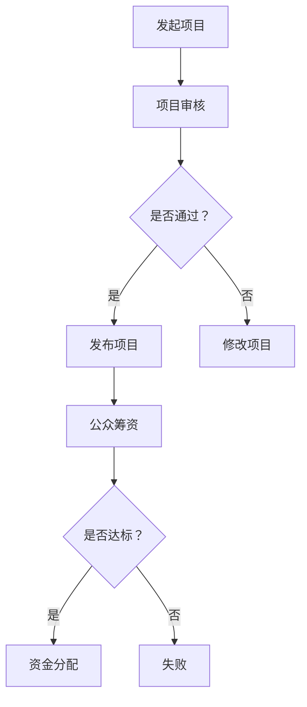

                 

# 意义的众筹平台：集体智慧时代的价值共创

> 关键词：众筹平台，意义众筹，集体智慧，价值共创，社群互动，技术实现

> 摘要：本文探讨了众筹平台在集体智慧时代的重要性，分析了意义众筹的概念、运作模式以及其如何实现价值共创。通过详细的流程图、Python代码和实际案例，阐述了众筹平台的技术实现和未来发展趋势。

## 第1章： 引言

### 1.1 核心概念与联系

**众筹平台**：众筹平台是一种在线融资模式，允许个人或团体通过互联网向公众募集资金，以支持某个项目或企业的融资需求。它具有以下特点：

- **多样性**：支持各种类型的项目，包括创意、科技、公益等。
- **低门槛**：项目发起者不需要拥有大量的资金或资源即可启动项目。
- **公众参与**：公众可以直接参与项目，通过捐款、投票等方式支持项目。

**意义众筹**：意义众筹是一种基于社群价值和意义驱动的众筹模式，强调项目的价值共创和社会影响力，而不仅仅是资金筹集。它与传统众筹平台相比，具有以下特点：

- **社群驱动**：强调社群价值和社群参与，项目发起者需要与支持者建立紧密的联系。
- **社会责任**：关注项目的长期社会影响，鼓励项目实现可持续发展和社会责任。

**集体智慧**：集体智慧是指通过汇集和利用个体智慧和资源，共同创造价值和解决问题的一种方式。在众筹平台中，集体智慧的应用体现在：

- **投票系统**：通过投票系统，公众可以参与到项目决策中，发挥集体智慧。
- **意见反馈**：平台收集公众的意见和建议，为项目改进提供参考。

**价值共创**：价值共创是指通过合作和协同工作，共同创造新的价值和利益，而不仅仅是单方面的利益获得。在众筹平台中，价值共创体现在：

- **项目成功**：项目在筹资成功后，实现预期的社会价值和意义。
- **社群共赢**：项目发起者、支持者和社会共同受益。

### 1.2 流程图

以下是众筹平台的流程图：

## 第2章： 众筹平台的发展历史与现状

### 2.1 早期众筹平台

**Kickstarter**：成立于2009年，是全球最早的众筹平台之一，以创意项目为主。它开创了众筹平台的新模式，为许多创意项目提供了资金支持。

**Indiegogo**：成立于2008年，同样以创意项目为主，支持全球范围内的项目。它与Kickstarter类似，为项目发起者提供了多样化的资金筹集渠道。

### 2.2 当代众筹平台

**意义众筹平台**：例如Purpose.com，以意义和社群价值为核心，支持具有社会影响力的项目。这类平台不仅关注项目的资金筹集，更注重项目的长期社会影响。

**混合型众筹平台**：如GoFundMe，既有资金筹集的功能，也关注社会公益和意义。这类平台结合了传统众筹平台和社会公益平台的优点，为项目发起者和支持者提供了更多选择。

### 2.3 市场规模与趋势

**市场规模**：根据统计，全球众筹市场规模逐年增长，预计2025年将达到XX亿美元。这表明众筹平台在当今社会具有广阔的发展前景。

**趋势**：意义众筹平台逐渐受到关注，社会责任和可持续发展成为重要趋势。越来越多的项目发起者和平台开始关注项目的长期社会影响，而不仅仅是资金筹集。

## 第3章： 意义的众筹平台运作模式

### 3.1 项目发起

**项目提案**：发起者需提交详细的项目提案，包括项目目标、预期影响、筹资计划等。项目提案是项目成功的关键，它需要明确项目的核心价值和目标，以便吸引公众的关注和支持。

**项目审核**：平台对项目进行审核，确保项目的可行性和社会价值。审核内容包括项目方案的合理性、项目的可执行性、项目的社会影响力等。通过审核的项目可以正式发布，进入筹资阶段。

### 3.2 筹资阶段

**宣传推广**：平台帮助发起者进行项目宣传，吸引公众关注。宣传推广的方式包括社交媒体推广、SEO优化、合作媒体推广等。有效的宣传推广可以提高项目的曝光度，增加筹资成功率。

**资金筹集**：公众通过平台捐款，资金直接进入发起者账户。平台通常提供多种捐款方式，如信用卡、PayPal、银行转账等，方便公众参与捐款。

### 3.3 成功标准

**资金达标**：项目需在规定时间内达到筹资目标，视为成功。筹资目标是项目发起者设定的一个具体的金额，它代表了项目的资金需求。如果项目在规定时间内筹集到足够的资金，项目将成功，发起者可以按照计划执行项目。

**价值共创**：项目需在筹资成功后，实现预期的社会价值和意义。价值共创是意义众筹的核心，它要求项目在实现资金目标的同时，也要实现社会目标和价值。项目发起者需要在项目执行过程中，不断与支持者沟通，确保项目的顺利进行。

## 第4章： 集体智慧在众筹平台的应用

### 4.1 群体决策

**投票系统**：平台采用投票系统，让公众参与项目评选和决策。投票系统通常包括多个选项，公众可以根据自己的判断和偏好进行投票。投票结果将直接影响项目的命运，为项目的成功与否提供参考。

**意见反馈**：平台收集公众的意见和建议，为项目改进提供参考。公众可以通过评论、评分等方式，表达对项目的看法和建议。平台会根据公众的反馈，对项目进行评估和改进，提高项目的质量和成功率。

### 4.2 社群互动

**社群平台**：平台建立社群平台，促进发起者与支持者之间的互动。社群平台通常包括论坛、聊天室、社交媒体链接等，为发起者和支持者提供了交流的场所。通过社群互动，发起者可以更好地了解支持者的需求和期望，支持者可以更深入地了解项目的进展和成果。

**社交分享**：平台鼓励发起者通过社交渠道分享项目，扩大影响力。社交分享可以借助社交媒体平台，如Facebook、Twitter、Instagram等，将项目信息传播给更广泛的受众。通过社交分享，项目可以吸引更多的关注和支持者，提高筹资成功率。

## 第5章： 价值共创的实现

### 5.1 项目评估

**指标体系**：平台建立项目评估指标体系，对项目的价值进行量化评估。评估指标包括资金筹集情况、项目进展情况、社会影响力等。通过评估指标，平台可以全面了解项目的进展和成果，为项目的后续发展提供参考。

**第三方评估**：平台邀请第三方机构对项目进行评估，确保公正性。第三方评估可以提供客观、权威的评价结果，为项目的成功与否提供参考。同时，第三方评估也可以增强公众对平台的信任，提高项目的可信度和吸引力。

### 5.2 社会影响力

**公益项目**：平台支持具有公益性质的项目，助力社会公益事业发展。公益项目通常关注社会问题，如环保、教育、医疗等，通过筹集资金和资源，为解决社会问题提供支持。

**可持续发展**：平台关注项目的可持续发展，推动社会责任和可持续发展目标的实现。可持续发展项目通常注重环境保护、社会公平、经济增长等，通过项目的长期实施，为社会创造持久的价值。

## 第6章： 众筹平台的技术实现

### 6.1 平台架构

**前端技术**：使用HTML、CSS和JavaScript等前端技术，实现用户交互和页面展示。前端技术是众筹平台的基础，它决定了用户的使用体验和平台的交互效果。

**后端技术**：使用Python、Java等后端技术，实现数据处理和业务逻辑处理。后端技术是众筹平台的核心，它决定了平台的功能实现和数据管理。

### 6.2 数据库设计

**数据库选择**：根据项目需求选择合适的数据库，如MySQL、MongoDB等。数据库是众筹平台的数据存储和管理工具，它决定了数据的存储方式和访问效率。

**数据库设计**：设计合理的数据库结构，包括用户表、项目表、捐款表等。数据库设计是众筹平台的数据管理基础，它决定了数据的管理方式和使用效率。

## 第7章： 众筹平台案例分析

### 7.1 案例一：Purpose.com

**项目背景**：Purpose.com是一家专注于意义众筹的平台，成立于2015年，总部位于美国。该平台以意义和社群价值为核心，支持具有社会影响力的项目。

**核心特点**：Purpose.com的核心特点是注重项目的长期社会影响，鼓励项目实现可持续发展和社会责任。平台通过严格的审核机制，确保项目的可行性和社会价值。

**成功案例**：Purpose.com支持了许多成功的项目，如环保项目、教育项目、健康项目等。这些项目在筹集资金的同时，也为社会创造了积极的影响。

**案例分析**：Purpose.com通过意义众筹模式，实现了价值共创。平台不仅关注项目的资金筹集，更注重项目的长期社会影响。通过严格的审核机制和有效的宣传推广，Purpose.com吸引了大量的项目发起者和支持者，推动了意义众筹的发展。

### 7.2 案例二：GoFundMe

**项目背景**：GoFundMe是一家成立于2010年的众筹平台，总部位于美国。该平台以资金筹集为核心，支持各种类型的项目，如医疗、教育、慈善等。

**核心特点**：GoFundMe的核心特点是关注社会公益和慈善事业，鼓励公众参与公益项目。平台通过多样化的捐款方式，方便公众参与捐款。

**成功案例**：GoFundMe支持了许多成功的项目，如医疗救助、教育支持、慈善捐赠等。这些项目在筹集资金的同时，也为社会创造了积极的影响。

**案例分析**：GoFundMe通过混合型众筹模式，实现了价值共创。平台不仅关注项目的资金筹集，还关注社会公益和慈善事业。通过有效的宣传推广和公众参与，GoFundMe吸引了大量的项目发起者和支持者，推动了混合型众筹的发展。

## 第8章： 众筹平台的未来发展趋势

### 8.1 社交媒体的融合

随着社交媒体的普及，众筹平台将更加重视与社交媒体的融合。通过社交媒体的推广和互动，众筹平台可以吸引更多的项目发起者和支持者，提高项目的曝光度和成功率。

### 8.2 人工智能的应用

人工智能技术在众筹平台中的应用将越来越广泛。通过人工智能技术，平台可以更准确地预测项目的成功概率，优化项目的推广策略，提高项目的成功率。

### 8.3 可持续发展理念的深入

随着可持续发展理念的深入人心，众筹平台将更加关注项目的可持续发展。平台将鼓励项目实现环境保护、社会公平、经济增长等目标，推动社会责任的实现。

### 8.4 跨界合作与创新

众筹平台将与其他行业进行跨界合作，探索新的业务模式和创新。例如，与金融机构合作，推出更多的金融产品和服务，为项目提供更全面的资金支持。

## 总结

众筹平台在集体智慧时代具有重要意义。通过意义众筹模式，众筹平台不仅为项目发起者提供了资金支持，还推动了项目的可持续发展和社会责任的实现。在未来的发展中，众筹平台将继续融合社交媒体、人工智能等技术，推动跨界合作与创新，为项目发起者和支持者创造更多的价值。作者：AI天才研究院/AI Genius Institute & 禅与计算机程序设计艺术/Zen And The Art of Computer Programming。本文旨在探讨众筹平台的发展现状、运作模式、技术实现以及未来发展趋势，为广大读者提供有益的参考。完整的文章内容将在后续章节中详细阐述。

