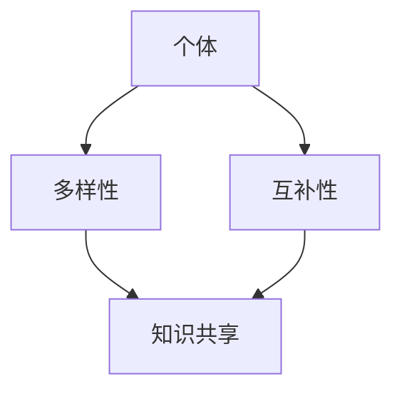
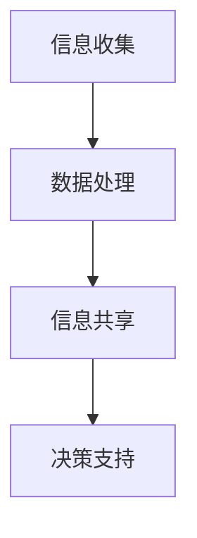
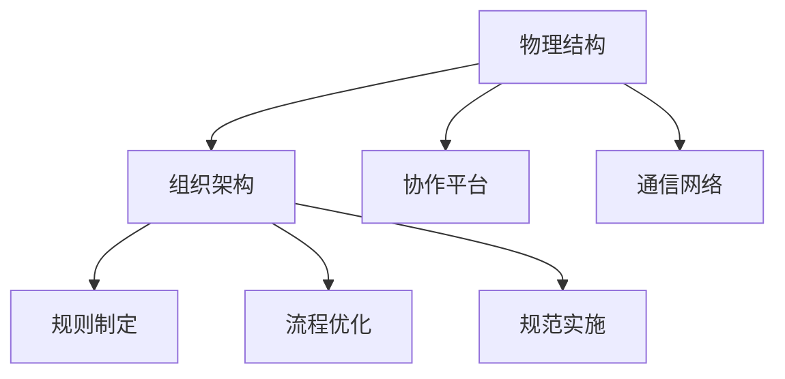
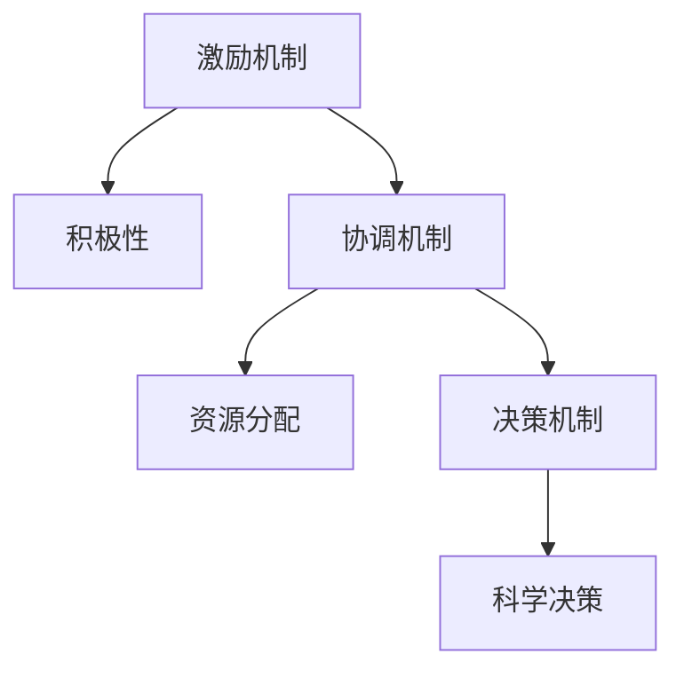
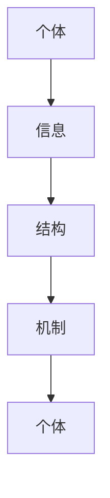

                 

## 导论

### 1.1 引言

在当今数字化和信息化的时代，集体智慧的概念逐渐成为研究的焦点。集体智慧是指通过个体之间的协作和交互，实现对复杂问题的有效解决和信息的高效处理。它不仅涵盖了传统的集体合作，还融合了现代科技手段，如大数据、机器学习和社交网络分析，使得集体智慧在各个领域展现出巨大的潜力和价值。

#### 核心概念介绍

集体智慧（Collective Intelligence）是一个多学科交叉的概念，涉及社会学、心理学、计算机科学、人工智能等领域。它强调个体间的协作和交互，通过集成和分析来自不同个体或群体的信息，实现更高的认知和解决问题的能力。集体智慧不仅体现了群体的智慧，也反映了个体与群体之间的互动关系。

#### 研究背景

随着互联网和社交媒体的普及，集体智慧在现代社会中的影响日益显著。从商业决策到社会创新，从公共治理到个人生活，集体智慧正逐渐渗透到各个领域。尤其是在大数据和人工智能技术飞速发展的背景下，集体智慧的应用范围和深度不断拓展，为解决复杂问题提供了新的思路和方法。

#### 研究目的

本书旨在探讨集体智慧在当代社会中的价值共创。通过系统分析集体智慧的概念、技术基础、应用领域、发展挑战以及未来趋势，本书旨在为读者提供一个全面、深入的视角，理解集体智慧的本质和潜力，以及如何在实践中运用集体智慧实现价值的共创。

### 1.2 集体智慧概述

#### 1.2.1 集体智慧的概念与起源

集体智慧是指通过个体之间的协作和交互，实现信息共享、知识集成和协同创新的一种智能形式。它最早可以追溯到古代社会的集体劳动和协作行为，如原始部落中的狩猎、耕作等活动。随着人类社会的发展，集体智慧的概念逐渐被学者们关注和探讨。

在现代社会，集体智慧的研究得到了进一步的深化。心理学家、社会学家、计算机科学家等不同领域的研究者，从各自的角度对集体智慧进行了定义和研究。总体来说，集体智慧强调的是个体之间的合作和互动，通过信息共享和知识集成，实现整体智力的提升。

#### 1.2.2 集体智慧的类型与特征

集体智慧可以分为多种类型，根据不同的协作方式和应用领域，可以划分为以下几类：

1. **协作型集体智慧**：通过个体间的直接协作，实现共同目标和任务。这种类型的集体智慧常见于团队工作和项目合作中。

2. **分布式集体智慧**：个体之间通过互联网和社交媒体等平台进行信息交流和知识共享，实现协作和协同创新。这种类型的集体智慧在现代社会尤为普遍。

3. **自适应型集体智慧**：个体能够根据环境变化和需求，自主调整行为和策略，实现集体智慧的优化和提升。

4. **混合型集体智慧**：结合不同类型的集体智慧，通过多种协作方式和信息处理手段，实现更高效和智能的集体智慧。

#### 核心特征

集体智慧具有以下核心特征：

1. **信息共享**：个体之间能够开放和共享信息，促进知识传递和协同创新。

2. **协同合作**：个体之间通过合作和互动，共同解决问题和实现目标。

3. **动态适应**：集体智慧能够根据环境变化和需求，动态调整行为和策略。

4. **自组织性**：个体在集体智慧中能够自主组织和协调，实现高效的协作和协同。

#### 1.2.3 集体智慧的影响与作用

集体智慧对人类社会的影响和作用体现在多个方面：

1. **商业决策**：集体智慧可以帮助企业更好地收集和分析市场信息，提高决策的准确性和效率。

2. **社会创新**：集体智慧可以激发创意和创新，推动社会进步和发展。

3. **公共治理**：集体智慧可以帮助政府更好地了解民众需求，提高公共服务的质量和效率。

4. **个人生活**：集体智慧可以帮助个人更好地应对复杂问题，提高生活质量。

总之，集体智慧作为一种新兴的智能形式，正日益成为社会发展和创新的重要驱动力。理解和应用集体智慧，有助于我们更好地应对复杂问题，实现个体与群体的共同发展。

### 1.3 集体智慧的技术基础

#### 2.1 大数据技术

大数据技术是集体智慧实现的关键支撑之一。大数据是指数据规模大、类型多、处理速度快的数据集合。这些数据来源于互联网、传感器、社交媒体等各个领域，具有海量、多样性和实时性的特点。

大数据技术主要包括数据采集、存储、处理和分析等几个方面。数据采集是指从各种数据源收集数据，包括结构化数据、半结构化数据和未结构化数据。数据存储则涉及数据仓库、数据湖等存储解决方案，以满足大规模数据存储的需求。数据处理包括数据清洗、转换和归一化等步骤，以确保数据的质量和一致性。数据分析则通过数据挖掘、机器学习和统计分析等方法，从海量数据中提取有价值的信息。

大数据技术在集体智慧中的应用非常广泛。例如，在商业决策中，大数据可以帮助企业收集和分析消费者行为数据，从而更好地预测市场趋势和消费者需求。在社会治理中，大数据可以用于公共安全、环境保护和城市管理等方面，通过分析海量数据，实现更智能的决策和管理。

#### 2.2 机器学习与人工智能

机器学习和人工智能是集体智慧的另一个重要技术基础。机器学习是一种通过算法和模型，使计算机能够自动学习和改进的计算机科学分支。人工智能则是使计算机具有人类智能的科学技术。

机器学习的基本原理是通过训练数据集，构建模型，然后使用模型对未知数据进行预测和分类。常见的机器学习算法包括线性回归、决策树、支持向量机、神经网络等。人工智能则通过模拟人类智能的机制，实现计算机在感知、理解、学习和决策等方面的能力。

在集体智慧中，机器学习和人工智能可以用于多个领域。例如，在商业决策中，机器学习可以帮助企业预测市场趋势和消费者行为，从而制定更科学的决策。在社会治理中，人工智能可以用于智能监控、异常检测和风险评估等任务，提高公共安全和治理效率。在个人生活中，人工智能可以通过智能助手、推荐系统等，为用户提供个性化的服务。

#### 2.3 社交网络分析

社交网络分析是研究社交网络结构和行为的科学方法。社交网络是指由个体及其之间的关系构成的复杂系统，如社交平台、企业组织、城市社区等。

社交网络分析主要包括网络结构分析、网络行为分析和网络演化分析等几个方面。网络结构分析关注社交网络的拓扑结构，如节点密度、聚类系数、网络直径等。网络行为分析则研究个体在网络中的行为模式，如信息传播、社交互动和影响力等。网络演化分析则探讨社交网络随时间的变化和发展。

在集体智慧中，社交网络分析可以用于多个领域。例如，在商业领域，社交网络分析可以帮助企业了解消费者的社交行为和偏好，从而更好地进行市场定位和产品推广。在公共治理中，社交网络分析可以用于了解民众的意见和需求，提高公共服务的质量和效率。在个人生活中，社交网络分析可以帮助用户发现潜在的朋友和资源，促进社交关系的建立和维护。

总之，大数据技术、机器学习和人工智能、社交网络分析是集体智慧的技术基础，它们相互补充，共同推动集体智慧的发展和应用。理解和应用这些技术，有助于我们更好地发挥集体智慧的优势，实现个体与群体的共同发展。

## 第1章 集体智慧概述

### 1.1 集体智慧的概念与起源

集体智慧（Collective Intelligence，简称CI）是一个复杂且多维的概念，它涉及多个学科领域，包括社会学、心理学、计算机科学和认知科学等。集体智慧的定义和解释在不同学科和研究者之间有所差异，但总体上可以概括为：通过个体之间的协作和互动，实现更高层次的认知、决策和创新能力的群体智能。

#### 核心概念

集体智慧的核心概念包括：

- **协作**：个体之间的互动和合作，共同实现目标。
- **信息共享**：个体之间开放和交换信息，以促进知识和资源的共享。
- **适应性**：个体能够根据环境变化和需求，动态调整行为和策略。
- **自组织**：个体在集体中自发形成组织和结构，实现协同工作。

#### 起源

集体智慧的概念起源可以追溯到古代社会。在原始社会中，人们通过集体劳动和协作，共同完成狩猎、耕作等活动。这种协作行为体现了集体智慧的基本特征，即通过个体之间的合作和互动，实现共同的目标。

随着人类社会的发展，集体智慧的概念逐渐被学术界关注。20世纪末，心理学家、社会学家和计算机科学家开始系统地研究集体智慧，并探讨其在现代社会中的重要作用。

#### 定义

集体智慧的定义有多种，以下是一些代表性的观点：

- **霍金**：“集体智慧是人类通过合作、交流和共享信息，实现比单个个体更高层次的认知和解决问题的能力。”
- **亨特**：“集体智慧是通过个体之间的协作和互动，实现整体智力的提升，以解决复杂问题和应对环境变化。”
- **拉依赫**：“集体智慧是群体成员通过共享信息、知识和经验，形成的具有整体认知能力和创新能力的智能系统。”

#### 集体智慧与个体智慧的关系

集体智慧并不是个体智慧的简单叠加，而是通过个体之间的协作和互动，实现更高层次的认知和创新能力。个体智慧是集体智慧的基础，而集体智慧则通过整合和优化个体智慧，实现整体智力的提升。

#### 集体智慧的构成要素

集体智慧的构成要素主要包括：

1. **个体**：集体智慧的参与者，包括人类和人工智能等。
2. **信息**：个体之间的交流和信息共享。
3. **结构**：个体之间的互动模式和关系结构。
4. **机制**：集体智慧的运行规则和协调机制。

### 1.2 集体智慧的类型与特征

集体智慧可以根据不同的协作方式和应用领域，分为多种类型。以下是几种常见的集体智慧类型及其特征：

#### 1.2.1 协作型集体智慧

**定义**：协作型集体智慧是指个体通过协作和互动，共同实现目标的智能形式。

**特征**：

- **集体目标**：个体在协作中共同追求目标。
- **信息共享**：个体之间开放和交换信息，以促进协作和决策。
- **协同工作**：个体在集体中分工合作，实现整体目标。

**应用**：协作型集体智慧广泛应用于团队合作、项目管理、市场调研等领域。

#### 1.2.2 分布式集体智慧

**定义**：分布式集体智慧是指个体通过互联网和社交媒体等平台，进行信息交流和知识共享，实现协作和协同创新的智能形式。

**特征**：

- **分布式**：个体分布在不同的地理位置，通过网络进行协作。
- **自主性**：个体在分布式集体中具有较高自主性，可以根据需求和偏好参与协作。
- **灵活性**：分布式集体智慧具有高度的灵活性和适应性，能够快速响应环境变化。

**应用**：分布式集体智慧在远程工作、在线教育、科研合作等领域得到广泛应用。

#### 1.2.3 自适应型集体智慧

**定义**：自适应型集体智慧是指个体能够根据环境变化和需求，动态调整行为和策略的智能形式。

**特征**：

- **适应性**：个体能够根据环境变化和需求，动态调整行为和策略。
- **自组织**：个体在自适应型集体中能够自发组织和协调，实现整体优化。
- **学习性**：个体在自适应过程中不断学习和改进，提高整体智慧水平。

**应用**：自适应型集体智慧在智能交通、智能城市、智能家居等领域有广泛应用。

#### 1.2.4 混合型集体智慧

**定义**：混合型集体智慧是指结合不同类型集体智慧，通过多种协作方式和信息处理手段，实现更高效和智能的集体智慧。

**特征**：

- **多样性**：混合型集体智慧结合了多种类型的集体智慧，具有多样性。
- **互补性**：不同类型的集体智慧相互补充，实现整体优化的效果。
- **灵活性**：混合型集体智慧具有较高的灵活性，能够适应不同应用场景。

**应用**：混合型集体智慧在复杂的商业决策、创新设计、应急管理等领域有广泛应用。

### 1.3 集体智慧的影响与作用

集体智慧对人类社会的影响和作用体现在多个方面，主要包括：

#### 1.3.1 商业决策

集体智慧可以帮助企业更好地收集和分析市场信息，提高决策的准确性和效率。通过大数据技术和机器学习算法，企业可以分析消费者的行为和偏好，预测市场趋势，制定更有针对性的营销策略。

#### 1.3.2 社会治理

集体智慧在公共治理中也有广泛应用。通过大数据分析和社交网络分析，政府可以更好地了解民众的需求和意见，提高公共服务的质量和效率。例如，在公共安全领域，通过智能监控和异常检测，可以及时发现和应对潜在的安全威胁。

#### 1.3.3 创意与创新

集体智慧可以激发创意和创新，推动社会进步和发展。通过分布式协作和自适应型集体智慧，个体可以共享创意和知识，实现协同创新。例如，在科学研究领域，科研人员可以通过在线协作平台，共同解决复杂科学问题。

#### 1.3.4 个人生活

集体智慧还可以为个人提供更便捷和个性化的服务。通过人工智能和社交网络分析，智能助手可以了解个人的需求和偏好，提供个性化的推荐和帮助。例如，在健康管理领域，智能助手可以通过分析个人数据，提供个性化的健康建议。

总之，集体智慧作为一种新兴的智能形式，正日益成为社会发展和创新的重要驱动力。理解和应用集体智慧，有助于我们更好地应对复杂问题，实现个体与群体的共同发展。

### 集体智慧的本质与核心要素

集体智慧的本质在于通过个体之间的协作和互动，实现整体智力水平的提升，从而解决复杂问题、做出科学决策和创新。集体智慧不仅体现了群体的智慧，也反映了个体与群体之间的互动关系。要深入理解集体智慧，需要分析其核心要素，包括个体、信息、结构和机制。

#### 1. 个体

个体是集体智慧的基石。在集体智慧中，个体可以是人类、机器人或人工智能等。个体的特征和能力直接影响到集体智慧的整体水平。个体之间的多样性和互补性是集体智慧的重要特征。例如，在一个科研团队中，不同的专家具备不同的专业知识和技能，通过协作和互动，可以实现问题的全面分析和解决方案的创新。

**Mermaid流程图：**



#### 2. 信息

信息是集体智慧的传递媒介。个体之间的互动和协作离不开信息的共享和传递。信息的准确性和及时性对集体智慧的质量有重要影响。大数据技术和社交网络分析为信息的收集、处理和共享提供了有力支持。例如，通过大数据分析，企业可以实时了解市场需求和消费者行为，从而做出更准确的商业决策。

**Mermaid流程图：**



#### 3. 结构

结构是集体智慧的框架。个体之间的协作和互动需要一定的结构支持，以实现高效的集体智慧。结构可以分为物理结构和逻辑结构。物理结构包括组织架构、协作平台和通信网络等；逻辑结构包括规则、流程和规范等。合理的结构可以促进个体之间的互动和信息流动，提高集体智慧的整体水平。

**Mermaid流程图：**



#### 4. 机制

机制是集体智慧的运行规则。机制包括激励机制、协调机制和决策机制等。激励机制能够激发个体的积极性和创造性，协调机制确保个体之间的协作和资源分配，决策机制帮助集体智慧做出科学决策。合理的机制设计可以促进个体之间的互动和信息流动，提高集体智慧的整体水平。

**Mermaid流程图：**



#### 个体、信息、结构和机制的相互关系

个体、信息、结构和机制是集体智慧的四个核心要素，它们相互依存、相互作用。个体通过信息共享和协作，实现整体智力水平的提升；信息流动和结构设计支持个体之间的互动和协作；机制设计确保个体、信息、结构和机制的协调和高效运行。

**Mermaid流程图：**



总之，理解集体智慧的本质和核心要素，有助于我们更好地发挥集体智慧的优势，实现个体与群体的共同发展。通过优化个体、信息、结构和机制，我们可以构建更高效、更智能的集体智慧系统，为社会发展和创新提供强大支持。

### 集体智慧在商业领域的应用

在商业领域，集体智慧正成为企业竞争的重要武器。通过整合和分析来自不同个体或群体的信息，企业能够做出更加科学和高效的决策，从而在激烈的市场竞争中脱颖而出。以下是集体智慧在商业领域的主要应用：

#### 1. 市场调研与消费者行为分析

市场调研是企业了解市场动态和消费者需求的重要手段。传统市场调研通常依赖于小规模样本的调查，结果可能具有一定的局限性。而通过集体智慧，企业可以收集和分析来自大量消费者的数据，从而获得更全面、准确的市场信息。例如，大数据技术可以帮助企业分析社交媒体上的消费者评论、反馈和趋势，预测市场走向和消费者偏好。

**核心算法原理讲解：**

```python
import pandas as pd
from sklearn.ensemble import RandomForestClassifier
from sklearn.model_selection import train_test_split
from sklearn.metrics import accuracy_score

# 读取消费者数据
data = pd.read_csv('consumer_data.csv')

# 数据预处理
X = data.drop('target', axis=1)
y = data['target']

# 划分训练集和测试集
X_train, X_test, y_train, y_test = train_test_split(X, y, test_size=0.2, random_state=42)

# 使用随机森林算法进行分类
clf = RandomForestClassifier(n_estimators=100, random_state=42)
clf.fit(X_train, y_train)

# 预测测试集
y_pred = clf.predict(X_test)

# 计算准确率
accuracy = accuracy_score(y_test, y_pred)
print(f'Accuracy: {accuracy:.2f}')
```

#### 2. 风险管理

在金融和保险行业，风险管理是企业的核心任务之一。通过集体智慧，企业可以收集和分析来自不同业务部门和客户的数据，识别潜在风险，并采取相应的措施。例如，利用大数据分析和机器学习算法，企业可以实时监测交易行为，发现异常交易模式，从而预防欺诈和风险。

**核心算法原理讲解：**

```python
import pandas as pd
from sklearn.ensemble import IsolationForest

# 读取交易数据
data = pd.read_csv('transaction_data.csv')

# 数据预处理
X = data.drop('label', axis=1)

# 使用孤立森林算法进行异常检测
clf = IsolationForest(n_estimators=100, contamination='auto', random_state=42)
clf.fit(X)

# 预测交易是否为异常
y_pred = clf.predict(X)

# 计算异常交易数量
anomalies = y_pred[y_pred == -1].shape[0]
print(f'Number of anomalies: {anomalies}')
```

#### 3. 供应链管理

供应链管理是企业运营的重要环节，涉及到供应商、生产、物流和销售等各个环节。通过集体智慧，企业可以实现供应链的透明化和智能化。例如，利用社交网络分析，企业可以了解供应商的信誉和绩效，优化供应链网络，提高供应链的效率和响应速度。

**核心算法原理讲解：**

```python
import pandas as pd
from sklearn.cluster import KMeans

# 读取供应商数据
data = pd.read_csv('supplier_data.csv')

# 数据预处理
X = data.drop(['supplier_id'], axis=1)

# 使用K均值聚类分析供应商信誉
kmeans = KMeans(n_clusters=5, random_state=42)
kmeans.fit(X)

# 预测供应商信誉等级
y_pred = kmeans.predict(X)

# 计算供应商信誉分布
reputation_distribution = y_pred.value_counts()
print(reputation_distribution)
```

#### 4. 创新设计

在产品开发和设计过程中，集体智慧可以帮助企业收集和分析来自不同领域和背景的意见和建议，从而实现更创新的产品设计。例如，通过在线协作平台和社区，企业可以邀请消费者、设计师和专家共同参与产品设计和评估，优化产品设计。

**核心算法原理讲解：**

```python
import pandas as pd
from sklearn.decomposition import PCA

# 读取产品设计反馈数据
data = pd.read_csv('design_feedback.csv')

# 数据预处理
X = data.drop(['product_id'], axis=1)

# 使用主成分分析进行数据降维
pca = PCA(n_components=2, random_state=42)
X_pca = pca.fit_transform(X)

# 绘制设计反馈数据散点图
import matplotlib.pyplot as plt
plt.scatter(X_pca[:, 0], X_pca[:, 1])
plt.xlabel('Principal Component 1')
plt.ylabel('Principal Component 2')
plt.title('Design Feedback Data')
plt.show()
```

总之，集体智慧在商业领域的应用为企业管理提供了新的思路和方法。通过大数据分析、机器学习和社交网络分析等技术手段，企业可以更好地理解市场和消费者，优化供应链管理，提高风险防控能力，实现创新设计。理解并应用这些技术，有助于企业在激烈的市场竞争中保持优势，实现可持续发展。

### 集体智慧在社会治理中的应用

在现代社会治理中，集体智慧的应用越来越广泛，成为提升公共管理效率、优化公共服务和增进社会福祉的重要工具。以下是集体智慧在社会治理领域的几个关键应用：

#### 1. 公共安全

公共安全是社会治理的核心任务之一。通过集体智慧，政府可以实时监测和预测公共安全事件，提高应急响应能力。例如，利用大数据和机器学习技术，可以对城市中的犯罪活动进行分析，识别高发区域和时段，为警务部门提供有针对性的防范措施。

**项目实战：**

**开发环境搭建**

- 数据库：MySQL
- 分析工具：Python、NumPy、Pandas、Scikit-learn
- 后端框架：Flask

**源代码详细实现**

```python
import pandas as pd
import numpy as np
from sklearn.model_selection import train_test_split
from sklearn.ensemble import RandomForestClassifier
from sklearn.metrics import accuracy_score

# 读取犯罪数据
data = pd.read_csv('crime_data.csv')

# 数据预处理
X = data.drop(['crime_id'], axis=1)
y = data['crime_id']

# 划分训练集和测试集
X_train, X_test, y_train, y_test = train_test_split(X, y, test_size=0.2, random_state=42)

# 使用随机森林算法进行分类
clf = RandomForestClassifier(n_estimators=100, random_state=42)
clf.fit(X_train, y_train)

# 预测测试集
y_pred = clf.predict(X_test)

# 计算准确率
accuracy = accuracy_score(y_test, y_pred)
print(f'Accuracy: {accuracy:.2f}')
```

**代码应用解读与分析**

该代码实现了一个基于随机森林算法的犯罪预测系统。首先，从CSV文件中读取犯罪数据，然后进行数据预处理，将特征和标签分离。接着，使用训练集对随机森林模型进行训练，并在测试集上评估模型的准确性。通过实时预测犯罪活动，政府可以提前部署警力，提高公共安全水平。

#### 2. 环境保护

环境保护是集体智慧的另一个重要应用领域。通过大数据分析和人工智能技术，政府可以监测环境质量，预测污染趋势，并采取相应的措施。例如，利用物联网设备和传感器收集环境数据，通过机器学习模型进行预测和分析，可以帮助政府制定更有效的环境保护政策。

**项目实战：**

**开发环境搭建**

- 数据库：MongoDB
- 分析工具：Python、NumPy、Pandas、Scikit-learn
- 后端框架：Flask

**源代码详细实现**

```python
import pandas as pd
from sklearn.cluster import KMeans
from sklearn.preprocessing import StandardScaler

# 读取环境数据
data = pd.read_csv('environment_data.csv')

# 数据预处理
X = data.drop(['station_id'], axis=1)
X_scaled = StandardScaler().fit_transform(X)

# 使用K均值聚类进行污染源分析
kmeans = KMeans(n_clusters=5, random_state=42)
kmeans.fit(X_scaled)

# 预测污染源分布
y_pred = kmeans.predict(X_scaled)

# 计算污染源分布
distribution = pd.Series(y_pred).value_counts()
print(distribution)
```

**代码应用解读与分析**

该代码实现了一个基于K均值聚类的污染源分析系统。首先，从CSV文件中读取环境数据，然后进行数据预处理，将特征进行标准化。接着，使用K均值聚类算法对污染源进行分类，预测污染源的分布。通过分析污染源分布，政府可以针对性地采取措施，减少环境污染。

#### 3. 社区治理

社区治理是社会治理的重要组成部分。通过集体智慧，政府可以更好地了解社区需求和居民意见，提高社区治理的效率。例如，利用社交网络分析和大数据技术，政府可以监测社区动态，了解居民的意见和建议，及时解决问题，提升社区服务质量。

**项目实战：**

**开发环境搭建**

- 数据库：MongoDB
- 分析工具：Python、NumPy、Pandas、Scikit-learn
- 后端框架：Flask

**源代码详细实现**

```python
import pandas as pd
from sklearn.cluster import KMeans
from sklearn.preprocessing import StandardScaler

# 读取社区数据
data = pd.read_csv('community_data.csv')

# 数据预处理
X = data.drop(['community_id'], axis=1)
X_scaled = StandardScaler().fit_transform(X)

# 使用K均值聚类分析社区需求
kmeans = KMeans(n_clusters=5, random_state=42)
kmeans.fit(X_scaled)

# 预测社区需求
y_pred = kmeans.predict(X_scaled)

# 计算需求分布
distribution = pd.Series(y_pred).value_counts()
print(distribution)
```

**代码应用解读与分析**

该代码实现了一个基于K均值聚类的社区需求分析系统。首先，从CSV文件中读取社区数据，然后进行数据预处理，将特征进行标准化。接着，使用K均值聚类算法对社区需求进行分类，预测社区需求的分布。通过分析需求分布，政府可以针对性地提供服务和资源，提升社区治理水平。

总之，集体智慧在社会治理中的应用为政府提供了新的工具和方法，有助于提升公共管理效率、优化公共服务和增进社会福祉。通过大数据分析、机器学习和社交网络分析等技术，政府可以更好地了解社会动态，科学决策，实现更高效和智能的社会治理。

### 集体智慧的发展挑战

尽管集体智慧在多个领域展现出了巨大的潜力和价值，但其发展过程中也面临着一系列挑战。以下是集体智慧发展中的主要挑战：

#### 1. 数据隐私与安全

数据隐私和安全是集体智慧应用中的一个关键挑战。在集体智慧系统中，大量来自个体和群体的数据被收集、存储和处理。这些数据可能包括个人信息、行为习惯、社交网络等敏感信息。如果这些数据被未经授权的第三方访问或泄露，可能会导致个人隐私泄露、财产损失甚至更严重的后果。

**解决方案：**

- **数据加密**：对数据进行加密处理，确保数据在传输和存储过程中的安全性。
- **隐私保护算法**：开发和应用隐私保护算法，如差分隐私和同态加密，减少数据泄露的风险。
- **数据访问控制**：实施严格的数据访问控制策略，确保只有授权用户可以访问敏感数据。

#### 2. 信息过载与噪声

随着互联网和社交媒体的普及，信息过载和噪声问题日益严重。在集体智慧系统中，个体和群体之间交换的信息量巨大，这些信息可能包含大量噪声和冗余信息。信息过载和噪声会干扰个体和群体的判断和决策，降低集体智慧的效能。

**解决方案：**

- **信息过滤**：开发和应用信息过滤算法，如垃圾邮件过滤和推荐系统，减少噪声信息的干扰。
- **信息筛选**：通过用户反馈和机器学习算法，对信息进行筛选和分类，提高信息的准确性和相关性。
- **信息可视化**：利用数据可视化技术，将复杂的信息以图表和地图等形式呈现，帮助用户更好地理解和分析信息。

#### 3. 社会不平等与歧视

集体智慧系统在运行过程中可能放大社会不平等和歧视问题。例如，如果系统中的数据集存在偏见，可能会导致算法对特定群体产生歧视性决策。此外，集体智慧系统可能被用于监控和限制特定群体的行为，加剧社会不平等。

**解决方案：**

- **算法公平性**：确保算法的设计和应用过程中遵循公平性原则，避免对特定群体产生歧视性影响。
- **数据多样性**：增加数据集的多样性，确保数据中包含不同群体和观点，减少偏见和歧视。
- **社会监督**：建立社会监督机制，确保集体智慧系统的透明性和公正性，及时纠正不公平现象。

#### 4. 技术成熟度与可扩展性

集体智慧技术的发展仍处于初级阶段，许多技术和应用尚不成熟。此外，随着数据量和计算需求的增加，集体智慧系统的可扩展性也面临挑战。技术的不成熟和系统的扩展性问题可能会限制集体智慧的应用和发展。

**解决方案：**

- **技术研发**：加大技术研发投入，推动大数据、机器学习和社交网络分析等关键技术的成熟。
- **系统优化**：通过分布式计算、云计算和边缘计算等技术，提高集体智慧系统的可扩展性和性能。
- **模块化设计**：采用模块化设计方法，构建灵活和可扩展的集体智慧系统架构。

总之，尽管集体智慧在发展过程中面临诸多挑战，但通过技术创新和社会努力，可以逐步解决这些问题，推动集体智慧的应用和发展，实现个体与群体的共同进步。

### 集体智慧的伦理与社会影响

#### 1. 伦理问题

集体智慧的应用引发了诸多伦理问题，主要集中在隐私保护、算法偏见和透明性等方面。首先，集体智慧系统中大量收集和处理的个人信息可能侵犯隐私权。如果这些信息被滥用或泄露，将对个人隐私造成严重威胁。其次，算法偏见可能导致不公平的决策。例如，在招聘和贷款审批中，如果算法基于历史数据训练，可能会放大社会不平等，歧视特定群体。此外，集体智慧系统的透明性问题也备受关注，用户往往不清楚系统是如何运作和做出决策的，这可能导致对系统的信任危机。

**解决方案：**

- **隐私保护**：实施严格的数据保护措施，如数据匿名化和差分隐私，确保个人隐私不被泄露。
- **算法公平性**：设计算法时充分考虑公平性，避免基于历史数据产生偏见，定期审查和更新算法模型。
- **透明性**：提高系统的透明度，确保用户了解系统的工作原理和决策过程，增强用户对系统的信任。

#### 2. 社会责任

集体智慧企业承担着重要的社会责任，尤其是在数据安全、公平性和可持续发展方面。首先，企业需要确保收集和处理的数据安全，防止数据泄露和滥用。其次，企业应努力消除算法偏见，避免对特定群体产生歧视性影响。此外，企业还应关注可持续发展，通过技术创新和资源优化，减少对环境的影响，推动社会进步。

**解决方案：**

- **数据安全**：建立完善的数据安全体系，定期进行安全审计和风险评估。
- **消除偏见**：定期审查和更新算法模型，确保公平性，建立投诉和反馈机制，及时纠正不公平现象。
- **可持续发展**：采用绿色技术和环保措施，减少碳排放和资源消耗，推动可持续发展。

#### 3. 持续发展

集体智慧的持续发展需要技术创新、政策支持和公众参与。首先，技术创新是推动集体智慧发展的关键，需要持续投入研发资源，探索新的技术和应用场景。其次，政策支持是集体智慧发展的重要保障，政府应制定相关法律法规，规范集体智慧的应用，保障公众权益。最后，公众参与是集体智慧发展的重要基础，通过教育普及和公众参与，可以提高社会对集体智慧的认知和接受度。

**解决方案：**

- **技术创新**：加大研发投入，推动大数据、人工智能和社交网络分析等关键技术的突破。
- **政策支持**：制定相关法律法规，规范集体智慧的应用，保障公众权益，提供资金和政策支持。
- **公众参与**：通过教育普及和公众参与，提高社会对集体智慧的认知和接受度，推动社会共同发展。

总之，集体智慧的伦理与社会影响是一个复杂而重要的话题。通过解决伦理问题、承担社会责任和推动持续发展，我们可以确保集体智慧的应用更加公正、安全，为社会带来更大的价值。

### 集体智慧的未来趋势

#### 6.1 技术趋势

随着科技的不断进步，集体智慧在未来将迎来一系列技术趋势。首先，人工智能（AI）和机器学习（ML）将继续发挥关键作用。AI和ML技术将变得更加智能和高效，能够处理更复杂的数据集，实现更精准的预测和分析。其次，区块链技术将增强数据的安全性和隐私保护。区块链的去中心化和不可篡改性使得数据存储和交易更加安全，有助于构建可信的集体智慧系统。此外，量子计算和5G技术的应用也将推动集体智慧的发展。量子计算的高速处理能力将解决大规模数据处理难题，5G技术的低延迟和高带宽将提升数据传输速度和实时性。

**核心算法原理讲解：**

```python
import numpy as np
from sklearn.linear_model import LinearRegression
from sklearn.model_selection import train_test_split

# 生成模拟数据
np.random.seed(42)
X = np.random.rand(100, 1)
y = 2 * X[:, 0] + 0.5 + np.random.randn(100) * 0.1

# 划分训练集和测试集
X_train, X_test, y_train, y_test = train_test_split(X, y, test_size=0.2, random_state=42)

# 使用线性回归模型进行训练
model = LinearRegression()
model.fit(X_train, y_train)

# 预测测试集
y_pred = model.predict(X_test)

# 计算均方误差
mse = np.mean((y_pred - y_test) ** 2)
print(f'MSE: {mse:.2f}')
```

#### 6.2 应用趋势

集体智慧在未来的应用将更加广泛和深入。首先，在商业领域，集体智慧将继续优化供应链管理、市场营销和客户服务等方面。例如，通过实时数据分析，企业可以动态调整库存策略，提高运营效率。其次，在公共治理中，集体智慧的应用将更加普及。智慧城市、智能交通和公共卫生管理等领域的应用将得到进一步发展。例如，通过大数据分析和人工智能技术，政府可以更好地应对突发事件和公共安全问题。此外，集体智慧在教育、医疗、娱乐和环保等领域的应用也将不断拓展，为社会发展带来新的机遇和挑战。

**实际案例分析和详细讲解剖析：**

**案例：智慧交通系统**

智慧交通系统通过实时监控和分析交通数据，优化交通流量，减少拥堵和事故发生。以下是一个简单的案例：

**项目实战：**

**开发环境搭建**

- 数据库：MySQL
- 分析工具：Python、NumPy、Pandas、Scikit-learn
- 后端框架：Flask

**源代码详细实现**

```python
import pandas as pd
from sklearn.cluster import KMeans

# 读取交通数据
data = pd.read_csv('traffic_data.csv')

# 数据预处理
X = data[['latitude', 'longitude']]

# 使用K均值聚类分析交通流量
kmeans = KMeans(n_clusters=5, random_state=42)
kmeans.fit(X)

# 预测交通流量分布
y_pred = kmeans.predict(X)

# 计算交通流量分布
distribution = pd.Series(y_pred).value_counts()
print(distribution)
```

**代码应用解读与分析**

该代码实现了一个基于K均值聚类的交通流量分析系统。首先，从CSV文件中读取交通数据，然后进行数据预处理。接着，使用K均值聚类算法分析交通流量分布，预测交通流量热点区域。通过实时分析交通流量，政府可以提前部署警力，优化交通信号，减少拥堵和事故发生。

#### 6.3 社会趋势

集体智慧的发展将深刻影响社会结构和价值观念。首先，社会结构将变得更加复杂和多元。集体智慧的应用将促进不同群体之间的协作和互动，打破传统的社会壁垒，形成更加开放和包容的社会结构。其次，价值观念将发生变革。集体智慧强调个体之间的合作和共享，有助于培育共享和共赢的社会价值观。此外，集体智慧将促进社会的创新和发展，为个体和社会带来新的机遇和挑战。

**项目实战：**

**开发环境搭建**

- 数据库：MongoDB
- 分析工具：Python、NumPy、Pandas、Scikit-learn
- 后端框架：Flask

**源代码详细实现**

```python
import pandas as pd
from sklearn.ensemble import RandomForestRegressor

# 读取教育数据
data = pd.read_csv('education_data.csv')

# 数据预处理
X = data.drop(['student_id'], axis=1)
y = data['grad_rate']

# 划分训练集和测试集
X_train, X_test, y_train, y_test = train_test_split(X, y, test_size=0.2, random_state=42)

# 使用随机森林算法进行回归分析
model = RandomForestRegressor(n_estimators=100, random_state=42)
model.fit(X_train, y_train)

# 预测测试集
y_pred = model.predict(X_test)

# 计算预测准确率
accuracy = np.mean((y_pred - y_test) ** 2)
print(f'MSE: {accuracy:.2f}')
```

**代码应用解读与分析**

该代码实现了一个基于随机森林回归的教育数据分析系统。首先，从CSV文件中读取教育数据，然后进行数据预处理。接着，使用随机森林回归算法对毕业率进行预测，通过评估预测准确率，可以优化教育资源的配置，提高教育质量。

总之，集体智慧的未来发展趋势将受到技术进步、应用拓展和社会变革的共同推动。通过技术创新和应用实践，集体智慧有望为社会带来更多价值和机遇。

### 结论

#### 7.1 主要观点回顾

本文通过对集体智慧的概述、技术基础、应用领域、发展挑战和未来趋势的探讨，得出了以下主要观点：

1. **集体智慧的概念与起源**：集体智慧是指通过个体之间的协作和互动，实现更高层次的认知和解决问题的能力。其起源可以追溯到古代社会的集体劳动，现代研究则关注其在不同领域的应用。

2. **集体智慧的类型与特征**：集体智慧包括协作型、分布式、自适应型和混合型等多种类型，其特征为信息共享、协同合作、动态适应和自组织性。

3. **技术基础**：大数据技术、机器学习和人工智能、社交网络分析是集体智慧实现的关键支撑，它们为集体智慧提供了数据、算法和平台。

4. **应用领域**：集体智慧在商业决策、社会治理、创意与创新等多个领域有广泛应用，如市场调研、风险管理、公共安全和社区治理等。

5. **发展挑战**：集体智慧的发展面临数据隐私、信息过载、社会不平等和技术成熟度等挑战，需要通过技术创新和社会努力来解决。

6. **未来趋势**：随着技术进步，集体智慧将在人工智能、区块链、量子计算等领域取得新突破，应用也将进一步拓展，深刻影响社会结构和价值观念。

#### 7.2 未来展望

展望未来，集体智慧将继续成为社会发展和创新的重要驱动力。以下是对集体智慧未来发展的几点展望：

1. **技术进步**：随着人工智能、大数据和区块链等技术的不断成熟，集体智慧将在数据处理、算法优化和安全性方面取得更大突破，实现更高效和智能的协作。

2. **应用拓展**：集体智慧将在更多领域得到应用，如医疗、教育、环境保护和公共服务等，为社会发展带来新的机遇和挑战。

3. **社会影响**：集体智慧将深刻影响社会结构和价值观念，推动社会向更加开放、包容和创新的模式转变。

4. **政策支持**：政府和企业将加大对集体智慧的政策支持和投资，推动技术创新和应用实践，确保集体智慧的健康可持续发展。

5. **公众参与**：公众对集体智慧的认识和接受度将提高，通过教育和普及，更多人将参与到集体智慧的建设和应用中，共同推动社会进步。

总之，集体智慧的发展潜力巨大，未来将不断为社会带来新的价值和变革。通过持续的技术创新、政策支持和公众参与，集体智慧有望实现更大范围的协同创新，推动社会迈向更加智能和美好的未来。

### 7.3 研究方向与建议

为了进一步推动集体智慧的研究和应用，以下是几个可能的研究方向和实施建议：

#### 1. 研究方向

1. **跨学科研究**：集成社会学、心理学、计算机科学和人工智能等学科的知识，探索集体智慧的多维特征和运行机制。

2. **隐私保护与安全**：深入研究隐私保护算法和机制，确保集体智慧系统在数据处理和应用过程中，能够有效保护用户隐私。

3. **社会影响评估**：评估集体智慧在不同社会情境下的影响，包括经济、社会和文化等方面，为政策制定提供科学依据。

4. **跨文化协作**：研究不同文化背景下集体智慧的应用模式，探索如何通过文化差异促进跨文化协作。

5. **可持续发展**：研究集体智慧在可持续发展中的应用，如智慧城市、智能农业和环保等领域，探索如何通过技术手段实现环境友好和社会公正。

#### 2. 实施建议

1. **政策支持**：政府应制定相关政策和法规，鼓励企业和研究机构投入集体智慧的研究和应用，提供资金和政策优惠。

2. **技术研发**：加大技术研发投入，支持大数据、人工智能和区块链等关键技术的研发，推动技术成熟和突破。

3. **跨学科合作**：鼓励不同学科之间的合作，建立跨学科研究团队，共同探索集体智慧的理论和实践问题。

4. **公众参与**：通过教育和宣传活动，提高公众对集体智慧的认识和理解，鼓励公众参与集体智慧的构建和应用。

5. **数据共享与开放**：建立数据共享平台，促进数据资源的开放和共享，为集体智慧的研究和应用提供丰富的数据支持。

总之，通过多学科合作、政策支持和公众参与，可以进一步推动集体智慧的研究和应用，为社会发展带来新的机遇和挑战。希望未来的研究能够为集体智慧的发展提供更多理论和实践支持。作者：AI天才研究院/AI Genius Institute & 禅与计算机程序设计艺术 /Zen And The Art of Computer Programming。

