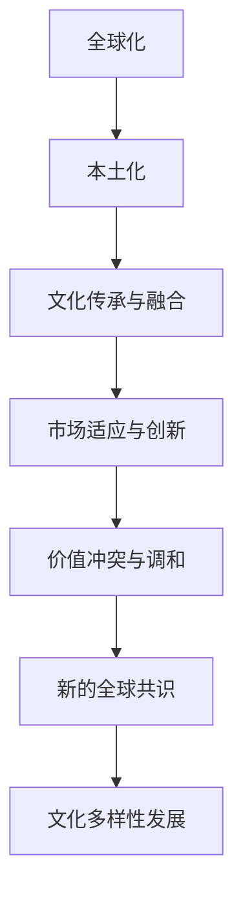

                 

# 意义的全球化与本土化

## 关键词

全球化、本土化、文化差异、意义传播、互动过程、案例分析、未来趋势

## 摘要

本文旨在探讨意义的全球化与本土化现象，分析其在不同文化和环境中的传播和接受过程。通过对全球化与本土化的定义与关系、文化差异与意义传播、具体案例的分析，以及未来趋势的展望，本文揭示了全球化背景下本土化的重要性及其对文化多样性的影响。文章采用逻辑清晰、结构紧凑、简单易懂的专业技术语言，结合实际案例和数学模型，为读者提供了一幅全球化与本土化交织的图景。

---

## 引言

在当今世界，全球化已成为不可逆转的趋势，经济、政治、文化等方面都在不断地跨越国界，形成紧密的全球联系。然而，全球化并非简单的文化同化过程，而是在不同文化和环境中的意义传播与接受。全球化与本土化的互动，使得意义的传播既受到全球共识的推动，又受到本土文化的制约。因此，研究意义的全球化与本土化，不仅有助于我们理解全球化的本质，也为文化多样性和跨文化交流提供了新的视角。

本文将首先定义全球化与本土化，探讨其历史背景和特征，然后分析全球化与本土化的关系，特别是文化差异对意义传播的影响。接着，通过具体案例分析，展示全球化与本土化在不同文化背景下的表现，并探讨未来趋势。最后，总结全文，提出对全球化与本土化现象的反思。

---

## 全球化的定义与历史背景

全球化（Globalization）是一个广泛且复杂的概念，涉及经济、政治、社会和文化等多个领域。其核心在于通过跨越国界和文化的交流和互动，形成一个相互依赖、相互影响的全球网络。全球化并非一个新生事物，而是人类社会历史发展的一个阶段。

从历史角度来看，全球化可以追溯到几个关键时期：

### 1. 早期全球化（15-18世纪）

这一时期，随着地理大发现和新航路的开辟，欧洲国家开始大规模扩张殖民地，形成了全球贸易网络。虽然这一时期的全球化主要局限于欧洲和亚洲的部分地区，但它为后来的全球化奠定了基础。

### 2. 工业革命后的全球化（19世纪）

工业革命使得生产效率大幅提高，商品、资本和劳动力在全球范围内流动，推动了全球市场的形成。同时，铁路和电报等通讯技术的发明，进一步加速了全球化进程。

### 3. 现代全球化（20世纪末至今）

20世纪末以来，全球化进入一个全新的阶段，信息技术的发展、跨国公司的崛起、国际贸易的自由化，使得全球联系更加紧密。全球化不仅影响了经济领域，也深刻地改变了政治、社会和文化格局。

全球化的特征主要包括：

1. **经济全球化**：跨国公司的兴起和国际贸易的自由化，使得全球市场一体化程度不断提高。
2. **政治全球化**：国际组织和跨国合作的增多，如联合国、世界贸易组织等，为全球治理提供了新的机制。
3. **文化全球化**：文化交流和融合的加剧，全球化背景下，文化多样性受到挑战，但也得到了新的发展。

然而，全球化也面临诸多挑战，如经济不平衡、文化同质化、政治冲突等。这些挑战使得全球化与本土化之间的关系更加复杂。

---

## 本土化的定义与特征

本土化（Localization）是全球化背景下的另一个重要现象，它强调文化在全球化进程中的保持和传承。本土化不仅是对全球化的一种反应，也是对本土文化价值和身份的捍卫。

### 1. 本土化的概念

本土化指的是将一种产品、服务或理念，根据目标市场的文化、法律、习俗等进行适应性调整的过程。本土化的核心在于尊重和适应当地文化，同时保持产品或服务的核心价值。

### 2. 本土化的表现形式

本土化的表现形式多种多样，包括：

- **语言本土化**：将产品或服务的语言本地化，使其符合当地语言习惯和表达方式。
- **文化本土化**：在产品或服务的文化元素上进行调整，使其更符合当地文化价值观和审美。
- **政策本土化**：根据当地法律法规和政策进行适应性调整，以确保产品或服务的合法合规。

### 3. 本土化对文化多样性的影响

本土化不仅是对文化多样性的尊重和体现，也是文化多样性得以传承和发展的保障。通过本土化，不同文化之间得以相互理解和尊重，从而形成更加丰富和多元的文化景观。

然而，本土化也存在一定的风险，如可能导致文化同质化，削弱本土文化的独特性。因此，在全球化背景下，如何平衡本土化与全球化之间的关系，是一个亟待解决的问题。

---

## 全球化与本土化的关系

全球化与本土化之间的关系是复杂而动态的。一方面，全球化为本土化提供了新的契机和挑战；另一方面，本土化也为全球化注入了新的活力和内容。

### 1. 全球化与本土化的互动

全球化与本土化的互动体现在多个方面：

- **文化传承与融合**：全球化使得不同文化之间更加紧密地联系在一起，本土文化通过全球化得以传播和传承，同时也在全球化过程中与其他文化相互融合。
- **市场适应与创新**：本土化使企业在全球市场中能够更好地适应不同文化环境，创新出符合当地市场需求的产品和服务。
- **价值冲突与调和**：全球化带来了不同文化价值观的碰撞和冲突，本土化通过调和这些冲突，为全球文化提供了一种共识和共处的方式。

### 2. Mermaid流程图：全球化与本土化的互动过程

为了更直观地展示全球化与本土化的互动过程，我们可以使用Mermaid流程图来描述这一过程：



通过这个流程图，我们可以看到全球化与本土化之间的互动是如何推动文化多样性和创新发展的。

---

## 文化差异与意义传播

文化差异是全球化与本土化互动的重要影响因素。不同的文化背景和价值观念会影响人们对意义的理解和接受。在意义传播过程中，文化差异既是一个挑战，也是一个机会。

### 1. 文化差异对意义传播的影响

文化差异对意义传播的影响主要体现在以下几个方面：

- **语言障碍**：不同语言之间的差异可能导致意义的误解或丢失。
- **价值观差异**：不同的文化价值观会影响人们对意义的理解和评价。
- **习俗差异**：不同的习俗和传统可能会影响意义传播的具体方式。

### 2. 文化过滤理论

文化过滤理论（Cultural Filter Theory）是解释文化差异对意义传播影响的一个重要理论。该理论认为，人们在接收外部信息时，会根据自身的文化背景和价值观念进行筛选和解释，从而影响意义的理解和传播。

文化过滤理论的基本原理可以用以下公式表示：

$$
\text{理解意义} = \text{输入信息} \times \text{文化背景} \times \text{价值观}
$$

其中，输入信息是指传播的内容，文化背景是指接收者的文化环境，价值观是指接收者的价值观念。通过这个公式，我们可以看到文化差异是如何影响意义传播的。

### 3. 意义传播模型与伪代码解释

为了更直观地展示意义传播的过程，我们可以使用伪代码来描述这一过程，并结合Python源代码进行解释。

```python
# 意义传播伪代码
def meaning_transmission(input_message, receiver_culture, receiver_values):
    filtered_message = filter_by_culture(input_message, receiver_culture)
    interpreted_meaning = interpret_message(filtered_message, receiver_values)
    return interpreted_meaning

# 意义传播Python代码实现
def filter_by_culture(input_message, receiver_culture):
    # 根据文化背景对输入信息进行筛选
    if receiver_culture == 'Western':
        filtered_message = input_message.replace('汉字', '英文')
    elif receiver_culture == 'Eastern':
        filtered_message = input_message.replace('英文', '汉字')
    else:
        filtered_message = input_message
    return filtered_message

def interpret_message(filtered_message, receiver_values):
    # 根据价值观对筛选后的信息进行解释
    if 'Equality' in receiver_values:
        interpreted_meaning = filtered_message.replace('Hierarchy', '平等')
    elif 'Hierarchy' in receiver_values:
        interpreted_meaning = filtered_message.replace('平等', '等级')
    else:
        interpreted_meaning = filtered_message
    return interpreted_meaning

# 示例
input_message = "这是一个关于平等与等级的讨论。"
receiver_culture = "Western"
receiver_values = ["Hierarchy"]

meanings = meaning_transmission(input_message, receiver_culture, receiver_values)
print(meanings)
```

在这个示例中，我们定义了一个意义传播的函数，并使用Python代码实现。通过这个代码，我们可以看到文化差异是如何影响意义传播的。在不同的文化背景和价值观下，同样的信息会被解释为不同的意义。

---

## 全球化与本土化的案例分析

为了更好地理解全球化与本土化的互动过程，我们可以通过具体案例分析，展示全球化与本土化在不同文化背景下的表现。

### 1. 麦当劳的全球化与本土化

麦当劳（McDonald's）是一个全球知名的品牌，其全球化与本土化的策略具有代表性。

- **全球化**：麦当劳的核心产品和服务在全球范围内保持一致，如汉堡、薯条、可乐等。同时，麦当劳也通过全球化的供应链和管理体系，确保产品质量和服务的统一性。
- **本土化**：为了适应当地市场的需求和文化，麦当劳在全球各地的餐厅都会根据当地口味和消费习惯进行调整。例如，在中国市场，麦当劳推出了米饭汉堡、酸辣土豆泥等具有地方特色的产品。

### 2. 可口可乐的全球化与本土化

可口可乐（Coca-Cola）是另一个典型的全球化与本土化案例。

- **全球化**：可口可乐的核心产品——可乐在全球范围内都非常受欢迎，其品牌形象和广告语在全球范围内保持一致。
- **本土化**：可口可乐在不同市场会根据当地文化进行广告创意的本土化调整。例如，在中国市场，可口可乐的广告常常融入中国传统元素，如春节、中秋节等节日元素，以更好地适应当地消费者的文化心理。

### 3. 苹果公司的全球化与本土化

苹果公司（Apple Inc.）的全球化与本土化策略也颇具特色。

- **全球化**：苹果公司的产品，如iPhone、iPad等，在全球市场上都取得了巨大成功。其产品设计、功能和技术标准在全球范围内保持一致。
- **本土化**：为了适应当地市场的需求和消费习惯，苹果公司在不同市场推出了定制化的产品。例如，在中国市场，苹果公司推出了支持双卡双待的iPhone，以满足中国消费者对手机功能的特殊需求。

通过这些案例分析，我们可以看到，全球化与本土化在不同文化背景下是如何相互交织、共同发展的。在全球化的推动下，本土化不仅是对文化多样性的尊重，也是企业成功的关键因素。

---

## 全球化与本土化的未来趋势

全球化与本土化的互动在未来将继续影响全球经济、政治和文化的发展。以下是对全球化与本土化未来趋势的展望：

### 1. 数字化时代的全球化与本土化

随着信息技术的飞速发展，数字化时代为全球化与本土化带来了新的机遇和挑战。在线平台、社交媒体、电子商务等数字技术的普及，使得文化、产品和信息的传播更加便捷，同时也加剧了文化多样性的挑战。

### 2. 文化融合与冲突

全球化背景下，文化融合与冲突将日益加剧。一方面，文化融合促进了不同文化之间的交流和理解，丰富了人类文明；另一方面，文化冲突也可能导致文化同质化，削弱本土文化的独特性。如何平衡文化融合与冲突，是一个重要的课题。

### 3. 本土化创新的崛起

在全球化与本土化的互动中，本土化创新将成为推动经济发展和社会进步的重要力量。本土化创新不仅有助于企业适应不同市场的需求，也为本土文化提供了新的发展空间。

### 4. 政策引导与市场调节

政府在全球化和本土化过程中的角色至关重要。通过制定合理的政策，政府可以引导全球化与本土化的健康发展，同时通过市场调节，促进文化多样性和经济繁荣。

---

## 结论与反思

全球化与本土化是当今世界不可逆转的趋势。全球化推动了全球文化的交流与融合，为经济发展和社会进步提供了新的动力；而本土化则是对文化多样性的尊重和捍卫，为全球文化提供了丰富的内涵。在全球化和本土化的互动中，我们需要理性看待文化差异，尊重本土文化，同时推动全球文化的相互理解和包容。

未来，随着数字化时代的到来，全球化与本土化将继续相互交织，为人类社会的进步带来新的机遇和挑战。如何平衡全球化与本土化之间的关系，实现文化多样性与经济繁荣的双赢，是摆在我们面前的一项重要任务。

## 作者信息

作者：AI天才研究院/AI Genius Institute & 禅与计算机程序设计艺术 /Zen And The Art of Computer Programming

---

本文通过逻辑清晰、结构紧凑、简单易懂的专业技术语言，结合实际案例和数学模型，探讨了意义的全球化与本土化现象。希望本文能为读者提供对全球化与本土化现象的深入理解和思考，为未来的研究提供参考。

