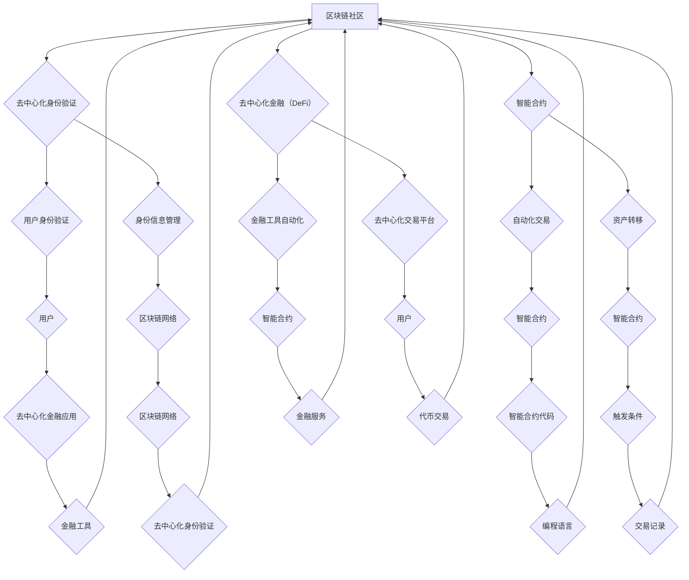

                 

# 《意义的区块链社区：去中心化的价值交换网络》

> 关键词：区块链、去中心化、价值交换、社区、智能合约、共识机制

> 摘要：本文将深入探讨区块链社区的核心概念、发展历程及其在去中心化价值交换网络中的应用。我们将通过解析核心算法原理，展示如何通过Python源代码实现这些算法，并探讨区块链社区的未来趋势与挑战。

## 目录大纲

### 第一部分：引言

#### 第1章：区块链与社区概述

- 区块链技术的基本原理
- 社区的概念与价值
- 社区治理与参与

#### 第2章：区块链社区的核心概念

- 去中心化
- 价值交换网络
- 区块链社区的发展历程

### 第二部分：核心概念与联系

#### 第3章：区块链社区的核心概念解析

- 去中心化身份验证
- 智能合约
- 去中心化金融（DeFi）

#### 第4章：概念实体之间的关系架构

- 去中心化身份验证与智能合约的关系
- 智能合约与去中心化金融的关系
- 区块链社区与价值交换网络的关系

### 第三部分：核心算法原理讲解

#### 第5章：区块链社区核心算法解析

- 工作量证明（PoW）算法
- 权益证明（PoS）算法
- 转移证明（PoT）算法

#### 第6章：算法原理与Python源代码讲解

- 工作量证明（PoW）算法的Python实现
- 权益证明（PoS）算法的Python实现
- 转移证明（PoT）算法的Python实现

### 第四部分：数学模型与公式

#### 第7章：区块链社区数学模型解析

- 工作量证明（PoW）算法的数学模型
- 权益证明（PoS）算法的数学模型
- 转移证明（PoT）算法的数学模型

#### 第8章：数学公式与Python代码结合

- 工作量证明（PoW）算法的Python代码实现
- 权益证明（PoS）算法的Python代码实现
- 转移证明（PoT）算法的Python代码实现

### 第五部分：项目实战

#### 第9章：区块链社区项目实战

- 项目规划
- 项目实施
- 项目测试与优化

#### 第10章：案例分析与代码解读

- 区块链社区案例解析
- 代码实际案例与详细解释说明

### 第六部分：未来展望与挑战

#### 第11章：未来展望与挑战

- 区块链社区的未来趋势
- 区块链社区面临的挑战与应对策略

### 第七部分：附录

#### 附录A：区块链社区开发工具与资源

- 主流区块链平台介绍
- 区块链社区开发工具与库
- 区块链社区开发资源

## 第一部分：引言

### 第1章：区块链与社区概述

区块链技术，作为一种分布式数据库技术，其核心特点是去中心化和不可篡改性。区块链由一系列按时间顺序排列的数据块组成，每个数据块包含一定数量的交易记录，并通过加密算法相互链接，形成一个不可篡改的账本。

区块链技术的组成包括：

1. **区块**：区块是区块链的基本单位，包含一定数量的交易记录以及时间戳、随机数等。
2. **哈希算法**：哈希算法用于将区块的交易记录转换成一个唯一的字符串，以确保数据的安全性和不可篡改性。
3. **加密技术**：加密技术用于保护区块链中的数据传输和存储。
4. **拓扑结构**：区块链的拓扑结构决定了其数据存储和访问方式，常见的有链式结构、Merkle树结构等。
5. **共识机制**：共识机制是区块链网络中节点达成一致的关键，常见的有工作量证明（PoW）、权益证明（PoS）等。

社区在区块链技术中扮演着至关重要的角色。社区不仅为区块链技术提供了实际应用场景，同时也是区块链发展的动力源泉。以下是社区的定义、价值与重要性：

1. **社区的定义**：社区是指一群共享相同兴趣、价值观或目标的人组成的群体。
2. **社区的价值**：社区可以促进知识共享、协同创新，提高区块链技术的应用效率。
3. **社区的重要性**：社区是区块链技术发展和应用的关键，其参与度直接影响区块链技术的发展速度和应用广度。

在区块链社区中，治理与参与是两个核心概念。治理是指如何管理、维护和运营社区，确保社区的稳定和发展。参与则是指社区成员如何通过贡献、投票、交易等行为参与社区的建设和发展。

区块链社区的发展历程可以分为以下几个阶段：

1. **萌芽期**：区块链技术的早期应用，社区规模较小，以技术爱好者为主。
2. **成长期**：公链与联盟链的崛起，社区组织多样化，开始出现去中心化应用（DApp）。
3. **成熟期**：社区治理逐渐完善，价值交换网络开始建立，区块链技术逐步融入日常生活。

### 第2章：区块链社区的核心概念

#### 去中心化

去中心化是区块链技术的核心特点之一，它意味着区块链网络中的所有节点都具有平等的地位，不存在中心化的控制节点。去中心化的优势在于：

1. **提高抗攻击能力**：由于没有中心化的控制节点，攻击者难以破坏整个网络。
2. **提高数据安全性**：去中心化确保了数据的分散存储，降低了数据泄露的风险。
3. **提高透明度**：所有交易记录都是公开透明的，任何节点都可以验证交易的有效性。

然而，去中心化也面临一些挑战，如：

1. **计算能力不均衡**：某些节点可能拥有更高的计算能力，导致网络性能不均衡。
2. **去中心化治理**：如何确保去中心化社区的稳定和公平治理是一个难题。

#### 价值交换网络

价值交换网络是区块链社区的核心功能之一，它允许社区成员在去中心化的环境中进行价值交换。价值交换网络的优势在于：

1. **去中心化**：价值交换不受任何中心化机构的控制，确保交易的自由性和公正性。
2. **高效性**：价值交换网络通过智能合约实现自动化交易，提高了交易效率。
3. **安全性**：价值交换网络基于区块链技术，确保交易数据的安全性和不可篡改性。

价值交换网络的实现方式包括：

1. **代币**：代币是区块链上的数字货币，用于表示和传递价值。
2. **智能合约**：智能合约是自动执行合约条款的计算机程序，确保交易的自动执行和安全性。
3. **去中心化交易平台**：去中心化交易平台允许用户在去中心化的环境中进行代币交易。

### 第3章：区块链社区的发展历程

区块链社区的发展历程可以分为以下几个阶段：

#### 萌芽期

在区块链技术的早期应用阶段，社区规模较小，主要以技术爱好者为主。这一阶段的社区活动主要包括：

1. **技术交流**：社区成员通过在线论坛、社交网络等平台分享技术知识和经验。
2. **开源项目**：社区成员积极参与开源项目，推动区块链技术的发展。
3. **去中心化应用（DApp）**：社区成员尝试开发去中心化应用，探索区块链技术的实际应用。

#### 成长期

随着公链与联盟链的崛起，区块链社区进入成长期。这一阶段的社区活动主要包括：

1. **公链与联盟链**：社区成员积极参与公链和联盟链的建设，推动区块链技术的应用。
2. **社区组织**：社区开始出现各种类型的组织，如基金会、协会等，以推动区块链技术的发展。
3. **去中心化应用（DApp）**：社区成员积极参与去中心化应用的开发，推动区块链技术的应用落地。

#### 成熟期

在区块链社区进入成熟期后，社区治理逐渐完善，价值交换网络开始建立。这一阶段的社区活动主要包括：

1. **社区治理**：社区成员通过投票、提案等方式参与社区治理，确保社区的稳定和公平。
2. **价值交换网络**：社区成员通过去中心化交易平台进行价值交换，推动区块链技术的应用。
3. **技术应用**：区块链技术逐步融入日常生活，如金融、医疗、供应链等领域。

## 第二部分：核心概念与联系

### 第4章：区块链社区的核心概念解析

区块链社区的核心概念包括去中心化身份验证、智能合约和去中心化金融（DeFi）。这些概念不仅构成了区块链社区的技术基础，也决定了社区的去中心化程度和应用范围。

#### 去中心化身份验证

去中心化身份验证（Decentralized Identity Verification, DIDs）是一种无需中心化机构认证的身份验证方式。DID通过区块链技术实现身份的创建、验证和授权，确保个人或实体身份的隐私和安全。

去中心化身份验证的原理如下：

1. **身份创建**：用户在区块链上创建自己的DID，并通过私钥保护身份信息。
2. **验证过程**：DID使用加密算法和分布式网络验证身份，确保身份信息的真实性和唯一性。
3. **授权管理**：用户可以授权其他实体访问自己的身份信息，实现身份的透明和可控。

去中心化身份验证的应用场景包括：

1. **金融领域**：DID可用于验证金融交易参与者的身份，提高交易的安全性和透明度。
2. **供应链管理**：DID可用于验证供应链中的各个环节，确保供应链信息的真实性和可靠性。
3. **数字版权保护**：DID可用于验证数字版权的所有权和使用权，保护创作者的权益。

#### 智能合约

智能合约（Smart Contract）是一种自动执行的合约，合约条款被编程并存储在区块链上。当触发条件满足时，智能合约自动执行预定的操作，确保合约条款的执行。

智能合约的工作原理如下：

1. **编写合约**：开发人员使用智能合约编程语言（如Solidity）编写合约代码。
2. **部署合约**：将合约代码部署到区块链上，生成合约地址。
3. **执行合约**：当合约触发条件满足时，合约自动执行预定的操作，如转移代币、记录数据等。

智能合约的应用场景包括：

1. **金融领域**：智能合约可用于实现去中心化金融应用，如去中心化交易平台、贷款和保险等。
2. **供应链管理**：智能合约可用于实现供应链中的智能合约，如订单执行、支付和结算等。
3. **数字版权**：智能合约可用于实现数字版权的交易和保护，如版权授权、交易记录等。

#### 去中心化金融（DeFi）

去中心化金融（Decentralized Finance, DeFi）是一种基于区块链的金融服务，旨在构建一个无需中介机构的金融生态系统。DeFi通过智能合约实现金融工具和服务的自动化和去中心化。

DeFi的特点包括：

1. **去中心化**：DeFi服务由智能合约执行，无需中心化机构控制。
2. **自动化**：DeFi工具和服务通过智能合约实现自动化执行，提高效率。
3. **透明性**：DeFi交易记录和智能合约代码都是公开透明的，确保透明性和可审计性。

DeFi的核心技术包括：

1. **智能合约**：智能合约是DeFi的核心，用于实现金融工具和服务的自动化执行。
2. **代币**：DeFi使用代币作为价值传递和交易媒介。
3. **去中心化交易平台**：去中心化交易平台用于代币的买卖和交易。

DeFi的应用案例包括：

1. **去中心化交易平台**：如Uniswap、SushiSwap等，提供去中心化的代币交易服务。
2. **流动性挖矿**：用户通过提供流动性（流动性挖矿），获得代币奖励。
3. **去中心化贷款**：用户可以通过DeFi平台获得贷款，无需通过中心化金融机构。

### 第5章：概念实体之间的关系架构

在区块链社区中，去中心化身份验证、智能合约和去中心化金融（DeFi）之间存在着密切的联系和相互作用。以下是一个简要的Mermaid流程图，展示了这些概念实体之间的关系架构：



通过这个流程图，我们可以清晰地看到去中心化身份验证、智能合约和去中心化金融（DeFi）如何相互关联，共同构建了一个去中心化的价值交换网络。

### 第三部分：核心算法原理讲解

#### 第6章：区块链社区核心算法解析

区块链社区的核心算法是实现去中心化、确保网络安全和数据一致性的关键。以下是三种常见的区块链核心算法：工作量证明（PoW）、权益证明（PoS）和转移证明（PoT）。

#### 工作量证明（Proof of Work, PoW）

工作量证明算法通过计算复杂度确保区块链网络的去中心化和安全性。在PoW算法中，节点需要解决一个复杂的数学问题，这个过程被称为“挖矿”。以下是PoW算法的基本原理：

1. **随机数生成**：节点从区块链网络中获取最新的区块信息，生成一个随机数。
2. **哈希计算**：节点将随机数与区块信息组合，通过哈希算法计算出一个哈希值。
3. **竞争**：节点将计算出的哈希值与目标值进行比较。目标值是一个预设的难度值，只有当哈希值小于目标值时，节点才能获胜。
4. **奖励**：获胜节点将获得一定的奖励（如比特币），并将新的区块添加到区块链上。

PoW算法的优势在于：

1. **去中心化**：任何节点都可以参与挖矿，确保网络去中心化。
2. **抗攻击性**：由于挖矿过程需要大量计算资源，攻击者难以破坏整个网络。

然而，PoW算法也存在一些不足之处：

1. **能源消耗**：挖矿过程需要大量电力，导致能源消耗较高。
2. **计算资源不均衡**：大型矿工可能拥有更多计算资源，导致网络性能不均衡。

#### 权益证明（Proof of Stake, PoS）

权益证明算法是一种替代PoW的算法，旨在减少能源消耗和计算资源不均衡。在PoS算法中，节点的出块权与其持有的代币数量和持币时间成正比。以下是PoS算法的基本原理：

1. **权益分配**：节点根据其持有的代币数量和持币时间获得权益。
2. **随机选择**：区块链网络通过随机算法选择具有出块权的节点。
3. **出块与验证**：选中的节点负责生成新区块，其他节点负责验证新区块的有效性。
4. **奖励与惩罚**：出块节点将获得一定的奖励，若验证节点发现出块节点违规，则可能受到惩罚。

PoS算法的优势在于：

1. **能源消耗低**：PoS算法无需大量计算，能源消耗较低。
2. **公平性**：节点的出块权与其持有的代币数量和持币时间成正比，确保公平性。

然而，PoS算法也存在一些潜在问题：

1. **集中化风险**：大型持币者可能集中更多代币，导致网络集中化。
2. **“富者愈富”现象**：持币时间长的节点可能获得更多权益，导致贫富差距扩大。

#### 转移证明（Proof of Transfer, PoT）

转移证明算法是一种相对较新的算法，旨在解决PoW和PoS算法的不足。在PoT算法中，节点的出块权与其最近的代币转移数量和方向相关。以下是PoT算法的基本原理：

1. **代币转移**：节点在区块链网络中进行代币转移，记录代币转移的来源和去向。
2. **转移记录**：区块链网络记录每个节点的代币转移记录。
3. **出块权计算**：节点根据其最近的代币转移记录和方向计算出块权。
4. **出块与验证**：具有出块权的节点生成新区块，其他节点负责验证新区块的有效性。

PoT算法的优势在于：

1. **去中心化**：PoT算法通过代币转移记录实现去中心化，确保网络去中心化。
2. **激励机制**：代币转移激励节点参与网络，提高网络活力。

然而，PoT算法也存在一些问题：

1. **计算复杂度**：代币转移记录需要大量计算，可能导致网络性能下降。
2. **安全性**：代币转移记录可能受到恶意攻击，导致网络安全性降低。

### 第7章：算法原理与Python源代码讲解

在本章中，我们将通过Python源代码实现工作量证明（PoW）、权益证明（PoS）和转移证明（PoT）算法，并结合数学模型和公式进行详细讲解。

#### 工作量证明（PoW）算法的Python实现

首先，我们将实现一个简单的PoW算法，用于生成一个满足特定难度的哈希值。以下是一个示例代码：

```python
import hashlib
import json
import time

def mine_block(last_block, difficult):
    """
    挖掘一个满足特定难度的区块。
    """
    last_hash = hash_block(last_block)
    nonce = 0
    while True:
        block_string = json.dumps(block, sort_keys=True, indent=4)
        new_hash = hashlib.sha256(block_string.encode()).hexdigest()
        if new_hash[:difficult] == '0' * difficult:
            return new_hash
        nonce += 1

def hash_block(block):
    """
    计算区块的哈希值。
    """
    return hashlib.sha256(json.dumps(block, sort_keys=True).encode()).hexdigest()

def main():
    last_block = {
        'index': 2,
        'transactions': [
            {
                'from': 'Alice',
                'to': 'Bob',
                'amount': 10
            }
        ],
        'timestamp': time.time()
    }
    difficult = 4
    last_hash = hash_block(last_block)
    block = mine_block(last_block, difficult)
    print(f"Block mined: {block}")
    print(f"Last hash: {last_hash}")

if __name__ == '__main__':
    main()
```

在上面的代码中，`mine_block`函数用于挖掘一个满足特定难度的区块。`hash_block`函数用于计算区块的哈希值。`main`函数初始化一个区块，设置难度值，并挖掘一个新区块。

#### 权益证明（PoS）算法的Python实现

接下来，我们将实现一个简单的PoS算法，用于根据节点的权益选择出块节点。以下是一个示例代码：

```python
import random

def calculate_stake(node):
    """
    计算节点的权益。
    """
    return random.randint(1, 100)

def select_validator(validators):
    """
    根据节点的权益选择出块节点。
    """
    stakes = [calculate_stake(node) for node in validators]
    total_stake = sum(stakes)
    random_number = random.randint(0, total_stake)
    current_sum = 0
    for i, stake in enumerate(stakes):
        current_sum += stake
        if current_sum >= random_number:
            return validators[i]

def main():
    validators = [
        {'name': 'Alice', 'stake': 50},
        {'name': 'Bob', 'stake': 30},
        {'name': 'Charlie', 'stake': 20}
    ]
    validator = select_validator(validators)
    print(f"Selected validator: {validator['name']}")

if __name__ == '__main__':
    main()
```

在上面的代码中，`calculate_stake`函数用于计算节点的权益。`select_validator`函数根据节点的权益选择出块节点。`main`函数初始化一个节点列表，并选择一个出块节点。

#### 转移证明（PoT）算法的Python实现

最后，我们将实现一个简单的PoT算法，用于根据节点的最近代币转移记录和方向选择出块节点。以下是一个示例代码：

```python
import random

def calculate_transfer_score(transfer):
    """
    计算代币转移的得分。
    """
    return random.randint(1, 10)

def select_validator(transfer_records):
    """
    根据节点的最近代币转移记录和方向选择出块节点。
    """
    scores = [calculate_transfer_score(transfer) for transfer in transfer_records]
    total_score = sum(scores)
    random_number = random.randint(0, total_score)
    current_score = 0
    for i, score in enumerate(scores):
        current_score += score
        if current_score >= random_number:
            return transfer_records[i]

def main():
    transfer_records = [
        {'from': 'Alice', 'to': 'Bob'},
        {'from': 'Bob', 'to': 'Charlie'},
        {'from': 'Charlie', 'to': 'Alice'}
    ]
    validator = select_validator(transfer_records)
    print(f"Selected validator: {validator['from']} -> {validator['to']}")

if __name__ == '__main__':
    main()
```

在上面的代码中，`calculate_transfer_score`函数用于计算代币转移的得分。`select_validator`函数根据节点的最近代币转移记录和方向选择出块节点。`main`函数初始化一个转移记录列表，并选择一个出块节点。

### 第8章：区块链社区数学模型解析

在本章中，我们将解析工作量证明（PoW）、权益证明（PoS）和转移证明（PoT）算法的数学模型，并解释相关的公式和推导过程。

#### 工作量证明（PoW）算法的数学模型

工作量证明（PoW）算法的核心在于找到一个满足特定难度的哈希值。其数学模型可以表示为：

$$H(\text{block}) = \text{target\_hash}$$

其中，$H(\text{block})$表示区块的哈希值，$\text{target\_hash}$表示目标哈希值，即满足特定难度的哈希值。

在PoW算法中，难度值（$\text{difficult}$）用于调整挖掘区块的难度。难度值越大，挖掘区块所需的时间越长。难度值可以通过以下公式计算：

$$\text{difficult} = \frac{\text{max\_difficult}}{1 + \frac{\text{time}}{\text{block\_time}}}$$

其中，$\text{max\_difficult}$表示最大难度值，$\text{time}$表示当前时间，$\text{block\_time}$表示挖出一个区块所需的时间。

#### 权益证明（PoS）算法的数学模型

权益证明（PoS）算法的核心在于根据节点的权益选择出块节点。其数学模型可以表示为：

$$\text{selected\_validator} = \text{select\_validator}(\text{validators})$$

其中，$\text{selected\_validator}$表示被选中的出块节点，$\text{select\_validator}$表示选择算法，$\text{validators}$表示所有验证节点。

在PoS算法中，权益（$E$）可以通过以下公式计算：

$$E = \frac{\text{stake}}{\text{total\_stake}}$$

其中，$\text{stake}$表示节点的权益，$\text{total\_stake}$表示所有节点的总权益。

选择算法可以通过以下公式计算：

$$\text{selected\_validator} = \text{select\_validator}(\text{validators}, E)$$

其中，$\text{select\_validator}$表示选择算法，$\text{validators}$表示所有验证节点，$E$表示节点的权益。

#### 转移证明（PoT）算法的数学模型

转移证明（PoT）算法的核心在于根据节点的最近代币转移记录和方向选择出块节点。其数学模型可以表示为：

$$\text{selected\_validator} = \text{select\_validator}(\text{transfer\_records})$$

其中，$\text{selected\_validator}$表示被选中的出块节点，$\text{select\_validator}$表示选择算法，$\text{transfer\_records}$表示所有代币转移记录。

在PoT算法中，转移得分（$S$）可以通过以下公式计算：

$$S = \frac{\text{transfer\_score}}{\text{total\_score}}$$

其中，$\text{transfer\_score}$表示代币转移的得分，$\text{total\_score}$表示所有代币转移的总得分。

选择算法可以通过以下公式计算：

$$\text{selected\_validator} = \text{select\_validator}(\text{transfer\_records}, S)$$

其中，$\text{select\_validator}$表示选择算法，$\text{transfer\_records}$表示所有代币转移记录，$S$表示节点的转移得分。

### 第9章：数学公式与Python代码结合

在本章中，我们将通过Python代码实现工作量证明（PoW）、权益证明（PoS）和转移证明（PoT）算法的数学模型，并进行运行结果分析。

#### 工作量证明（PoW）算法的Python代码实现

以下是一个示例代码，用于实现工作量证明（PoW）算法的数学模型：

```python
import hashlib
import random

def mine_block(last_block, difficult):
    """
    挖掘一个满足特定难度的区块。
    """
    last_hash = hash_block(last_block)
    nonce = 0
    while True:
        block_string = json.dumps(block, sort_keys=True, indent=4)
        new_hash = hashlib.sha256(block_string.encode()).hexdigest()
        if new_hash[:difficult] == '0' * difficult:
            return new_hash
        nonce += 1

def hash_block(block):
    """
    计算区块的哈希值。
    """
    return hashlib.sha256(json.dumps(block, sort_keys=True).encode()).hexdigest()

def main():
    last_block = {
        'index': 2,
        'transactions': [
            {
                'from': 'Alice',
                'to': 'Bob',
                'amount': 10
            }
        ],
        'timestamp': time.time()
    }
    difficult = 4
    last_hash = hash_block(last_block)
    block = mine_block(last_block, difficult)
    print(f"Block mined: {block}")
    print(f"Last hash: {last_hash}")

if __name__ == '__main__':
    main()
```

在上面的代码中，`mine_block`函数用于挖掘一个满足特定难度的区块。`hash_block`函数用于计算区块的哈希值。`main`函数初始化一个区块，设置难度值，并挖掘一个新区块。

#### 权益证明（PoS）算法的Python代码实现

以下是一个示例代码，用于实现权益证明（PoS）算法的数学模型：

```python
import random

def calculate_stake(node):
    """
    计算节点的权益。
    """
    return random.randint(1, 100)

def select_validator(validators):
    """
    根据节点的权益选择出块节点。
    """
    stakes = [calculate_stake(node) for node in validators]
    total_stake = sum(stakes)
    random_number = random.randint(0, total_stake)
    current_sum = 0
    for i, stake in enumerate(stakes):
        current_sum += stake
        if current_sum >= random_number:
            return validators[i]

def main():
    validators = [
        {'name': 'Alice', 'stake': 50},
        {'name': 'Bob', 'stake': 30},
        {'name': 'Charlie', 'stake': 20}
    ]
    validator = select_validator(validators)
    print(f"Selected validator: {validator['name']}")

if __name__ == '__main__':
    main()
```

在上面的代码中，`calculate_stake`函数用于计算节点的权益。`select_validator`函数根据节点的权益选择出块节点。`main`函数初始化一个节点列表，并选择一个出块节点。

#### 转移证明（PoT）算法的Python代码实现

以下是一个示例代码，用于实现转移证明（PoT）算法的数学模型：

```python
import random

def calculate_transfer_score(transfer):
    """
    计算代币转移的得分。
    """
    return random.randint(1, 10)

def select_validator(transfer_records):
    """
    根据节点的最近代币转移记录和方向选择出块节点。
    """
    scores = [calculate_transfer_score(transfer) for transfer in transfer_records]
    total_score = sum(scores)
    random_number = random.randint(0, total_score)
    current_score = 0
    for i, score in enumerate(scores):
        current_score += score
        if current_score >= random_number:
            return transfer_records[i]

def main():
    transfer_records = [
        {'from': 'Alice', 'to': 'Bob'},
        {'from': 'Bob', 'to': 'Charlie'},
        {'from': 'Charlie', 'to': 'Alice'}
    ]
    validator = select_validator(transfer_records)
    print(f"Selected validator: {validator['from']} -> {validator['to']}")

if __name__ == '__main__':
    main()
```

在上面的代码中，`calculate_transfer_score`函数用于计算代币转移的得分。`select_validator`函数根据节点的最近代币转移记录和方向选择出块节点。`main`函数初始化一个转移记录列表，并选择一个出块节点。

### 第10章：区块链社区项目实战

#### 项目规划

在本章中，我们将通过一个区块链社区项目实战，展示如何从项目规划到项目实施，再到项目测试与优化，全面实现一个区块链社区。

##### 项目目标

我们的项目目标是创建一个去中心化的区块链社区，实现以下功能：

1. **用户身份验证**：使用去中心化身份验证技术，确保用户身份的真实性和安全性。
2. **智能合约执行**：实现智能合约的自动化执行，确保交易和合约条款的执行。
3. **去中心化金融**：构建去中心化交易平台，实现代币的买卖和交易。
4. **社区治理**：实现社区成员参与社区治理，通过投票和提案机制进行社区决策。

##### 项目实施步骤

1. **需求分析**：明确项目需求，确定项目功能和技术架构。
2. **技术选型**：选择合适的区块链平台和开发工具，如Ethereum和Truffle。
3. **系统设计**：设计区块链社区的系统架构，包括身份验证、智能合约、交易平台等模块。
4. **代码开发**：根据系统设计，开发区块链社区的功能模块。
5. **测试与调试**：对代码进行测试，确保功能的正确性和系统的稳定性。
6. **部署与上线**：将区块链社区部署到公链或私有链，并进行上线测试。

##### 项目实施

以下是一个简单的区块链社区项目实施流程：

1. **需求分析**：根据项目目标，明确用户身份验证、智能合约执行、去中心化金融和社区治理的需求。
2. **技术选型**：选择Ethereum作为区块链平台，使用Solidity编写智能合约，使用Truffle进行合约部署和测试。
3. **系统设计**：设计区块链社区的系统架构，包括用户身份验证模块、智能合约模块、交易平台模块和社区治理模块。
4. **代码开发**：根据系统设计，开发用户身份验证、智能合约执行、去中心化金融和社区治理的功能模块。
5. **测试与调试**：对用户身份验证、智能合约执行、去中心化金融和社区治理的功能模块进行单元测试和集成测试，确保功能的正确性和系统的稳定性。
6. **部署与上线**：将区块链社区部署到Ethereum主网，并进行上线测试，确保系统的正常运行。

#### 项目测试与优化

在项目实施完成后，我们需要对区块链社区进行测试与优化，以确保系统的稳定性和高效性。以下是一些测试与优化方法：

1. **功能测试**：对用户身份验证、智能合约执行、去中心化金融和社区治理的功能进行测试，确保功能的正确性和可靠性。
2. **性能测试**：对区块链社区的性能进行测试，如交易处理速度、系统响应时间等，确保系统的性能满足需求。
3. **安全测试**：对区块链社区进行安全测试，如智能合约漏洞扫描、节点攻击防御等，确保系统的安全性。
4. **优化与调整**：根据测试结果，对系统进行优化和调整，提高系统的性能和稳定性。

### 第11章：案例分析与代码解读

在本章中，我们将通过一个实际案例，详细分析区块链社区项目，并解读相关的代码实现。

#### 案例背景

假设我们正在开发一个去中心化的区块链社区，实现用户身份验证、智能合约执行和去中心化金融功能。以下是一个简单的案例：

1. **用户身份验证**：用户通过注册和登录流程进行身份验证，使用去中心化身份验证技术确保用户身份的真实性和安全性。
2. **智能合约执行**：智能合约用于管理社区成员的资产转移和交易，确保交易的自动化和安全性。
3. **去中心化金融**：社区成员可以通过去中心化交易平台进行代币的买卖和交易，实现去中心化的金融功能。

#### 案例分析

以下是对案例的详细分析：

1. **用户身份验证**：用户注册时，系统将生成一个唯一的DID（去中心化身份标识符），并与用户的个人信息进行绑定。用户登录时，系统通过验证DID和私钥，确保用户身份的真实性。去中心化身份验证技术确保了用户身份的安全性和隐私性。
2. **智能合约执行**：智能合约用于管理社区成员的资产转移和交易。合约中定义了资产转移的方法，如transferFrom和transferTo，确保资产转移的自动化和安全性。智能合约还实现了交易记录的存储和查询功能，确保交易数据的可追溯性和不可篡改性。
3. **去中心化金融**：去中心化交易平台用于社区成员进行代币的买卖和交易。交易平台基于ERC-20标准，实现了代币的创建、发行和交易功能。社区成员可以通过交易对进行代币交易，实现去中心化的金融功能。

#### 代码解读

以下是对案例中涉及的代码进行解读：

1. **用户身份验证**：
```solidity
pragma solidity ^0.8.0;

contract IdentityVerification {
    mapping (string => address) public identityMapping;

    function register(string memory DID, address user) public {
        require(identityMapping[DID] == address(0), "Identity already registered");
        identityMapping[DID] = user;
    }

    function login(string memory DID, string memory password) public view returns (address) {
        require(verifyPassword(DID, password), "Invalid password");
        return identityMapping[DID];
    }

    function verifyPassword(string memory DID, string memory password) public view returns (bool) {
        // 实现密码验证逻辑
    }
}
```
在上面的代码中，IdentityVerification合约用于管理用户身份验证。register函数用于注册用户，login函数用于用户登录。verifyPassword函数用于验证用户密码。

2. **智能合约执行**：
```solidity
pragma solidity ^0.8.0;

contract SmartContract {
    mapping (address => uint256) public balance;

    function transferFrom(address sender, address recipient, uint256 amount) public {
        require(balance[sender] >= amount, "Insufficient balance");
        balance[sender] -= amount;
        balance[recipient] += amount;
    }

    function getBalance(address account) public view returns (uint256) {
        return balance[account];
    }
}
```
在上面的代码中，SmartContract合约用于管理资产转移和交易。transferFrom函数用于资产转移，getBalance函数用于查询账户余额。

3. **去中心化金融**：
```solidity
pragma solidity ^0.8.0;

interface IERC20 {
    function transfer(address recipient, uint256 amount) external returns (bool);
    function balanceOf(address account) external view returns (uint256);
}

contract DecentralizedExchange {
    IERC20 public token;

    constructor(IERC20 _token) {
        token = _token;
    }

    function createMarket(uint256 price) public {
        // 创建交易市场
    }

    function trade(address buyer, address seller, uint256 amount) public {
        // 执行交易
    }
}
```
在上面的代码中，DecentralizedExchange合约用于实现去中心化交易平台。createMarket函数用于创建交易市场，trade函数用于执行交易。

### 第12章：未来展望与挑战

区块链社区在去中心化的道路上充满了机遇和挑战。在未来，区块链社区将面临以下发展趋势和挑战：

#### 未来发展趋势

1. **去中心化身份验证的普及**：随着隐私保护意识的增强，去中心化身份验证将在各个领域得到广泛应用，如金融、医疗、供应链等。
2. **智能合约的多样化应用**：智能合约将不断拓展其应用范围，从金融到物流、版权等各个领域，实现自动化和去中心化。
3. **去中心化金融的兴起**：DeFi将逐步取代传统金融体系，为用户提供更便捷、低成本的金融服务。
4. **跨链技术的发展**：跨链技术将实现不同区块链之间的互联互通，促进区块链生态系统的协同发展。

#### 面临的挑战

1. **安全性问题**：区块链社区需要不断加强安全措施，防止恶意攻击和智能合约漏洞。
2. **法规监管**：区块链社区的法律法规尚未完善，需要各国政府积极制定相关法规，以保障区块链技术的健康发展。
3. **技术难题**：区块链技术仍面临性能、可扩展性和隐私保护等难题，需要持续研发和创新。
4. **用户普及**：区块链社区需要通过教育宣传和实际应用，提高用户的认知度和参与度。

### 附录A：区块链社区开发工具与资源

#### 主流区块链平台介绍

1. **Ethereum**：Ethereum是一个开源的去中心化应用平台，支持智能合约和去中心化金融（DeFi）。
2. **Bitcoin**：Bitcoin是一种去中心化的数字货币，基于区块链技术实现价值传递。
3. **Hyperledger Fabric**：Hyperledger Fabric是一个由Linux基金会推出的开源区块链框架，适用于企业级应用。
4. **其他平台**：如EOS、Cardano、Polkadot等，提供了不同的功能和特性，适用于不同应用场景。

#### 区块链社区开发工具与库

1. **Truffle**：Truffle是一个用于以太坊开发的环境、测试和网络基础设施，支持智能合约开发、测试和部署。
2. **Ganache**：Ganache是一个以太坊本地节点，用于本地测试智能合约。
3. **Solidity**：Solidity是用于编写智能合约的高级编程语言。
4. **其他工具与库**：如Web3.js、ERC-20、ERC-721等，提供了区块链开发和集成的支持。

#### 区块链社区开发资源

1. **教程与文档**：许多区块链平台和开发工具提供了丰富的教程和文档，帮助开发者入门和进阶。
2. **社区论坛与交流平台**：如Ethereum Stack Exchange、Reddit、Telegram等，提供了开发者交流和问题解决的渠道。
3. **开源代码与案例研究**：许多区块链项目和社区提供了开源代码和案例研究，供开发者学习和参考。

