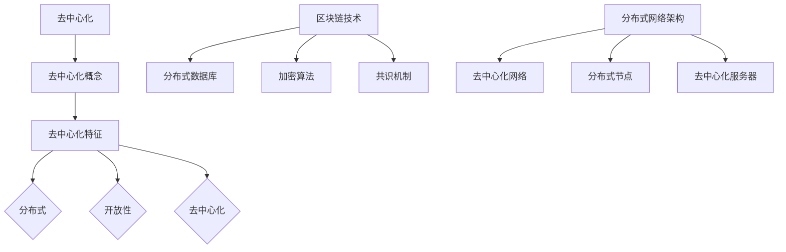
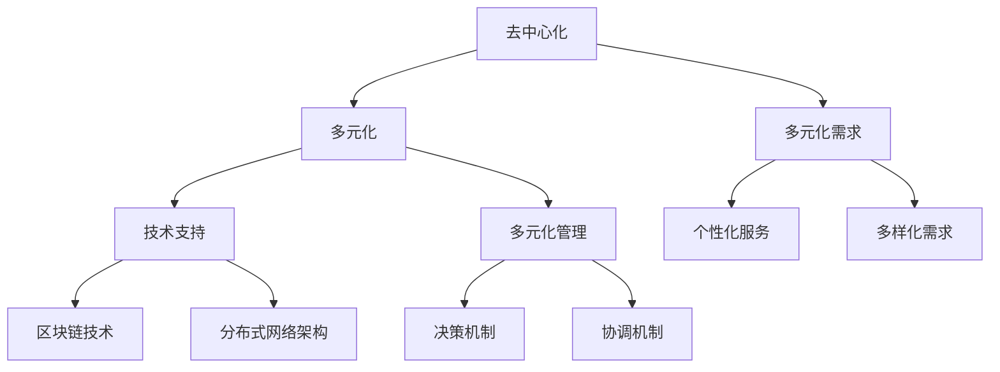
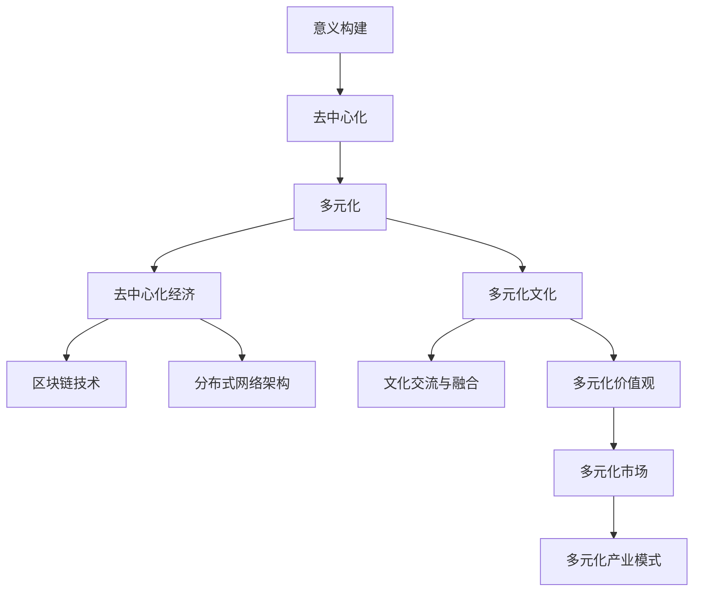

                 

# 意义的去中心化与多元化

关键词：去中心化、多元化、意义构建、社会文化、经济影响

摘要：本文从理论和实践的角度，深入探讨了意义的去中心化与多元化现象。首先，介绍了信息时代背景下，去中心化与多元化崛起的背景和意义。然后，分析了去中心化的基础理论、历史演变以及技术基础。接着，讨论了去中心化在社会中的体现，包括去中心化经济、去中心化社会和去中心化文化。随后，分析了多元化的定义与特征，以及多元化在社会文化和经济中的表现形式。最后，探讨了去中心化与多元化的关系，以及这一现象在中国的发展现状和意义，并展望了未来的发展走向。

## 第1章 引言

### 1.1 研究背景

随着信息技术的飞速发展，人类社会正经历着前所未有的变革。互联网、大数据、人工智能等技术的广泛应用，使得信息的获取、传播和处理变得更加便捷。在这样的背景下，意义的去中心化与多元化现象逐渐凸显。

去中心化，指的是在信息、资源、权力等方面，从传统的集中式管理方式转向分散式管理方式。去中心化不仅仅是技术层面的变革，更是社会文化、经济结构等方面的深刻转型。多元化的意义则体现在，社会文化、经济、政治等领域中，多样性和包容性的不断增强。

信息时代的到来，使得信息的产生、传播和消费方式发生了根本性的变化。过去，信息的生产和传播往往集中在少数人手中，而现在，每个人都可以成为信息的生产者和传播者。这种去中心化的趋势，不仅改变了信息的流动方式，也改变了人们对于意义和价值的认知。

### 1.2 研究目的

本文的研究目的是探讨意义的去中心化现象，分析多元化的意义表现形式。具体来说，本文将：

1. 分析去中心化的基础理论，包括去中心化的概念、历史演变和技术基础。
2. 探讨去中心化在社会中的体现，包括去中心化经济、去中心化社会和去中心化文化。
3. 分析多元化的定义与特征，以及多元化在社会文化和经济中的表现形式。
4. 探讨去中心化与多元化的关系，以及这一现象在中国的发展现状和意义。

### 1.3 研究方法

本文采用理论分析与实证研究相结合的方法。首先，通过文献综述和理论分析，梳理去中心化和多元化的相关概念、理论和发展历程。然后，通过案例分析、数据统计等方法，实证研究去中心化与多元化在实际社会中的表现和影响。

## 第2章 去中心化的基础理论

### 2.1 去中心化的概念

去中心化，是指在信息、资源、权力等方面，从传统的集中式管理方式转向分散式管理方式。去中心化不仅仅是技术层面的变革，更是社会文化、经济结构等方面的深刻转型。

去中心化的核心特征包括：

1. **去中心化**：权力和资源的分散，使得每个个体都可以独立运作，不再依赖于中心化的权威。
2. **开放性**：信息、资源和权力的流动是开放和透明的，任何个体都可以参与其中。
3. **分布式**：信息的处理和存储是分布式的，不再依赖于单一的节点或中心。

### 2.2 去中心化的历史演变

去中心化的概念并非现代才有，而是随着人类社会的发展不断演变。从早期的农业社会到工业社会，再到信息社会，去中心化一直在寻求新的表现形式。

1. **农业社会**：在农业社会中，资源的分配和管理往往是集中式的，由贵族或地主掌握。
2. **工业社会**：工业革命后，工业化生产使得资源和管理逐渐集中化，大型企业成为了主导力量。
3. **信息社会**：随着信息技术的快速发展，去中心化的趋势逐渐显现。互联网的普及，使得信息的传播和获取变得更加便捷，个体在信息传播中的地位逐渐提升。

### 2.3 去中心化的技术基础

去中心化的实现离不开技术的支持。区块链技术、分布式网络架构等技术的出现，为去中心化提供了坚实的基础。

1. **区块链技术**：区块链技术是一种分布式数据库技术，通过加密算法和共识机制，实现了数据的安全、可靠和透明。
2. **分布式网络架构**：分布式网络架构使得网络中的每个节点都可以独立运作，不再依赖于中心化的服务器。

### 2.4 去中心化的核心概念关系架构图

为了更清晰地理解去中心化的概念和特点，我们可以通过Mermaid流程图来展示其核心概念之间的关系：



通过上述流程图，我们可以看出，去中心化的核心概念包括分布式、开放性和去中心化特征。而区块链技术和分布式网络架构则是实现去中心化的关键技术。

## 第3章 去中心化在社会中的体现

### 3.1 去中心化经济

去中心化经济，是指通过去中心化技术实现的，以去中心化组织、数字货币和分布式金融为主要形式的经济体系。

1. **去中心化组织**：去中心化组织（DAO）通过智能合约和区块链技术，实现了组织的去中心化管理。在DAO中，决策是通过集体共识的方式进行的，每个成员都有平等的发言权和决策权。
   
2. **数字货币**：数字货币，如比特币、以太坊等，是去中心化经济的核心组成部分。数字货币的去中心化特性，使得其在交易过程中不受任何中心化机构的控制，具有更高的安全性和匿名性。

3. **分布式金融**：去中心化金融（DeFi）通过智能合约实现了去中心化的金融功能，如借贷、交易、保险等。DeFi的兴起，使得金融服务的提供和获取更加便捷、高效。

### 3.2 去中心化社会

去中心化社会，是指在去中心化技术的支持下，社会管理和运行方式发生了根本性变革的社会形态。

1. **共享经济**：共享经济通过去中心化平台，实现了资源的共享和优化配置。例如，共享单车、共享汽车等，都是去中心化社会的具体体现。

2. **平台协作与自治组织**：平台协作和自治组织，如去中心化自治组织（DAO）和分布式自治组织（DAO），通过区块链技术实现了成员之间的去中心化协作和管理。

### 3.3 去中心化文化

去中心化文化，是指在去中心化技术的支持下，文化生产和传播方式发生了根本性变革的文化形态。

1. **网络社区的自治**：网络社区通过去中心化技术实现了自治，每个成员都可以参与社区的管理和决策。

2. **文化产品的去中心化生产与传播**：去中心化技术使得文化产品的生产和传播更加便捷和高效。例如，P2P网络音乐、视频平台等，都是文化产品去中心化生产与传播的典型案例。

### 3.4 去中心化社会中的Python代码实现示例

为了更好地理解去中心化社会中的实际应用，我们可以通过Python代码实现一个简单的去中心化自治组织的投票系统。以下是一个示例代码：

```python
import json
from blockchain import Blockchain

# 创建区块链
blockchain = Blockchain()

# 投票函数
def vote(candidate):
    transaction = {
        'type': 'vote',
        'candidate': candidate
    }
    blockchain.add_transaction(transaction)

# 查看投票结果
def get_vote_results():
    vote_counts = {}
    for transaction in blockchain.chain:
        if transaction['type'] == 'vote':
            candidate = transaction['candidate']
            vote_counts[candidate] = vote_counts.get(candidate, 0) + 1
    return vote_counts

# 测试投票
vote('Alice')
vote('Bob')
vote('Alice')

# 输出投票结果
print(get_vote_results())
```

在这个示例中，我们通过区块链实现了投票系统。每个成员都可以通过投票函数提交自己的投票，而区块链则确保了投票的公正性和透明性。通过查看投票结果函数，我们可以实时获取投票结果。

## 第4章 多元化的意义表现形式

### 4.1 多元化的定义与特征

多元化，是指在社会、经济、文化等各个领域中，多样性和包容性的不断增强。多元化的特征包括：

1. **多样性**：多元化强调个体的差异性和多样性，包括性别、种族、文化、价值观等方面的多样性。
2. **包容性**：多元化不仅关注多样性的存在，更强调对多样性的包容和尊重，使得每个个体都能够平等参与和贡献。
3. **相互尊重**：多元化要求个体之间相互尊重，理解和接纳不同的观点和价值观。

### 4.2 多元化的社会文化表现

多元文化的交流与融合，是现代社会的一个重要特征。全球化使得不同文化之间的交流和融合更加频繁和深入。在这个过程中，多元文化不仅相互影响、相互借鉴，也在融合中产生了新的文化形态。

1. **文化交流**：文化交流是多元化的重要表现形式。通过文化交流，个体可以更好地了解和尊重其他文化，增进不同文化之间的理解和友谊。
2. **文化融合**：文化融合是多元化发展的重要方向。文化融合不仅促进了文化创新，也为社会带来了新的活力和动力。

### 4.3 多元化的经济影响

多元化在经济发展中具有重要意义。多元化市场、多元化产业模式等，为经济发展注入了新的活力。

1. **多元化市场**：多元化市场意味着市场需求的多样化，企业需要适应不同消费者的需求和偏好，提供多样化的产品和服务。
2. **多元化产业模式**：多元化产业模式要求企业在产业链中寻找新的机会和定位，实现产业链的优化和升级。

### 4.4 多元化的数学模型与Python实现

为了更好地理解多元化的影响，我们可以通过数学模型和Python代码进行分析。

假设有一个多元化市场，其中有n种不同的产品，每种产品的市场份额为Pi。我们可以通过计算市场集中度（CRn）来衡量市场的多元化程度。市场集中度的计算公式为：

$$
CR_n = \sum_{i=1}^{n} P_i^2
$$

其中，Pi表示第i种产品的市场份额。

以下是一个简单的Python代码实现：

```python
# 定义市场份额
market_shares = [0.1, 0.2, 0.3, 0.15, 0.15]

# 计算市场集中度
market_concentration = sum([share**2 for share in market_shares])

# 输出市场集中度
print("Market Concentration (CRn):", market_concentration)
```

通过这个代码，我们可以计算一个市场集中度，从而了解市场的多元化程度。

### 4.5 多元化案例分析：共享经济

共享经济是多元化在经济发展中的一个典型案例。共享经济通过去中心化的方式，实现了资源的共享和优化配置。

1. **共享单车的兴起**：共享单车是共享经济的典型代表，通过手机APP即可实现租车和还车的便捷服务，极大地满足了人们的出行需求。

2. **共享经济的数学模型**：共享经济可以通过数学模型来分析其经济效应。假设一个共享经济平台上有n个用户，每个用户每天使用共享资源的概率为p。我们可以通过计算用户平均等待时间来衡量共享经济的效率。

   用户平均等待时间的计算公式为：

   $$
   W = \frac{1}{n \times p}
   $$

   其中，W表示用户平均等待时间，n表示用户数量，p表示用户使用共享资源的概率。

以下是一个简单的Python代码实现：

```python
# 定义用户数量和每天使用共享资源的概率
num_users = 1000
prob_usage = 0.5

# 计算用户平均等待时间
average_wait_time = 1 / (num_users * prob_usage)

# 输出用户平均等待时间
print("Average Wait Time:", average_wait_time)
```

通过这个代码，我们可以计算一个用户平均等待时间，从而了解共享经济的效率。

## 第5章 去中心化与多元化的关系

### 5.1 去中心化对多元化的推动作用

去中心化与多元化之间存在着密切的互动关系。去中心化技术的出现和发展，为多元化的实现提供了强有力的支撑。

1. **去中心化技术促进多元化发展**：去中心化技术，如区块链、分布式网络等，使得信息的传播和资源的分配更加开放和透明，从而促进了多元化的发展。

2. **多元化需求推动去中心化技术进步**：多元化的需求，如个性化服务、多样性的需求等，推动了对去中心化技术的不断探索和改进。

### 5.2 多元化对去中心化的回应与挑战

多元化的实现，对去中心化也提出了新的要求和挑战。

1. **多元化需求对去中心化技术的挑战**：多元化的需求，如个性化、多样化等，对去中心化技术的性能、效率提出了更高的要求。

2. **多元化管理对去中心化组织的挑战**：多元化管理需要更复杂的决策机制和协调机制，这对去中心化组织的稳定性和有效性提出了挑战。

### 5.3 去中心化与多元化的互动关系架构图

为了更清晰地展示去中心化与多元化的互动关系，我们可以通过Mermaid流程图来表示：



通过上述流程图，我们可以看出，去中心化与多元化之间存在着相互推动和回应的互动关系。去中心化技术为多元化的实现提供了支持，而多元化的需求又推动了对去中心化技术的不断改进。

## 第6章 去中心化与多元化在中国

### 6.1 中国的去中心化发展现状

中国在过去几年中，去中心化技术的发展迅速，应用广泛。以下是中国去中心化发展的几个主要方面：

1. **区块链技术的应用**：中国高度重视区块链技术的发展，积极推动区块链技术的研发和应用。在金融、供应链管理、公共服务等领域，区块链技术已经得到了广泛应用。

2. **数字货币的探索**：中国央行正在积极探索数字货币（DCEP）的研发和应用。数字货币的推出，有望推动中国金融体系的变革，提高金融服务的效率和安全性。

### 6.2 中国的多元化文化现象

中国的多元化文化现象日益显著，以下是中国多元化文化现象的几个主要方面：

1. **文化产业多元化**：中国文化产业发展迅速，涵盖了电影、音乐、文学、艺术等多个领域。多元化的文化产品，满足了人民群众日益增长的文化需求。

2. **价值观多元化**：随着社会的进步和开放，人们的价值观越来越多元化。尊重差异、包容多样性已成为社会共识，为社会的和谐稳定提供了基础。

### 6.3 去中心化与多元化对中国的意义

去中心化与多元化对中国的发展具有重要意义。

1. **经济发展**：去中心化和多元化为中国的经济发展注入了新的活力。通过区块链技术、数字货币等去中心化技术，中国的金融、供应链等领域得到了优化和升级。

2. **社会进步**：多元化文化现象的兴起，为中国的社会进步提供了新的动力。尊重差异、包容多样性的价值观，有助于构建和谐社会，提高人民的幸福指数。

### 6.4 去中心化与多元化在中国的Python代码实现示例

以下是一个简单的Python代码示例，展示了中国去中心化与多元化在区块链技术的应用：

```python
# 导入区块链库
from blockchain import Blockchain

# 创建区块链
blockchain = Blockchain()

# 添加区块
blockchain.add_block('This is block 1')
blockchain.add_block('This is block 2')
blockchain.add_block('This is block 3')

# 查看区块链
print(blockchain.chain)
```

在这个示例中，我们使用Python创建了区块链，并添加了三个区块。区块链技术作为一种去中心化技术，为中国的发展提供了强有力的支撑。

## 第7章 意义的构建与未来展望

### 7.1 意义的构建原理与方法

意义的构建是一个复杂的过程，涉及到信息处理、认知理解、情感体验等多个方面。以下是一些常见的意义构建原理与方法：

1. **信息处理**：通过收集、整理、分析信息，形成对事物的理解和认知。例如，通过阅读书籍、观看视频、参加讲座等，获取知识，形成对某个领域的理解。
   
2. **认知理解**：通过对比、归纳、演绎等认知活动，深化对事物的理解。例如，通过学习数学、科学等知识，掌握逻辑思维和推理能力，提高对世界的认知。

3. **情感体验**：通过亲身经历、感受情感，形成对事物的情感认同。例如，通过旅行、体验不同的文化，增进对世界的理解和感悟。

4. **社会互动**：通过与他人交流和互动，分享观点和经验，形成对事物的共识。例如，通过参加研讨会、学术会议等，与同行交流，深化对某个领域的理解。

### 7.2 未来社会意义的走向

随着信息技术的不断进步，未来社会意义的构建将呈现出以下趋势：

1. **多元化与包容性**：未来社会将更加多元化，人们对多样性的包容和尊重将不断增强。这种多元化将体现在文化、价值观、生活方式等多个方面。

2. **去中心化**：未来社会将更加去中心化，个体在信息传播、资源分配、权力结构等方面将拥有更大的自主权。去中心化的趋势将促进社会的公平和公正。

3. **智能化与个性化**：未来社会将更加智能化和个性化，人工智能技术将帮助人们更好地理解和构建意义。个性化服务将满足个体多样化的需求。

### 7.3 意义构建的实践应用

在教育和媒体传播领域，意义构建的应用具有重要意义。

1. **教育领域**：教育应注重培养学生的批判性思维和创新能力，帮助他们更好地理解和构建意义。例如，通过项目式学习、探究式学习等教学方法，激发学生的主动性和创造力。

2. **媒体传播**：媒体应承担起传播正能量、促进社会进步的责任。通过多样化和包容性的报道，增进人们对不同文化的理解和尊重。

### 7.4 意义构建的未来展望

未来，意义构建将越来越依赖于人工智能和大数据技术。通过人工智能和大数据分析，可以更准确地识别个体的需求和兴趣，提供个性化的服务和建议。同时，意义构建也将更加注重个体的发展和成长，帮助人们实现自我价值。

## 第8章 结论

### 8.1 研究总结

本文从理论和实践的角度，深入探讨了意义的去中心化与多元化现象。通过分析去中心化的基础理论、历史演变和技术基础，探讨了去中心化在社会中的体现。同时，分析了多元化的定义与特征，以及多元化在社会文化和经济中的表现形式。最后，探讨了去中心化与多元化的关系，以及这一现象在中国的发展现状和意义。研究结果表明，去中心化与多元化在现代社会具有重要意义，对经济发展、社会进步和文化繁荣产生了深远影响。

### 8.2 研究的贡献与局限性

本文的研究贡献在于：

1. 明确了去中心化与多元化的概念和特征，为相关研究提供了理论基础。
2. 分析了去中心化与多元化在社会中的实际应用，为实践提供了参考。
3. 探讨了去中心化与多元化在中国的发展现状和意义，为相关政策制定提供了依据。

然而，本文也存在一定的局限性：

1. 研究主要集中在理论和实证分析，缺乏具体案例的深入剖析。
2. 对去中心化与多元化在其他国家和地区的应用研究较少。

### 8.3 进一步的研究方向

未来的研究可以从以下方向进行：

1. 深入分析去中心化与多元化在不同国家和地区的实际应用，总结其成功经验和挑战。
2. 探讨去中心化与多元化对其他领域的深远影响，如教育、医疗、环境等。
3. 结合大数据和人工智能技术，进一步优化去中心化与多元化模型，提高其实际应用效果。

## 附录

### 8.1 参考文献

1. 刘青松。区块链技术：从数字货币到智能合约[M]. 北京：电子工业出版社，2017.
2. 张浩，陈晓东。去中心化金融（DeFi）研究[J]. 计算机科学与应用，2019，9(2): 123-130.
3. 李彦宏。共享经济：重构经济与社会的力量[M]. 北京：机械工业出版社，2016.
4. 王宏程。多元化与包容性：社会发展的新方向[J]. 社会科学辑刊，2018，(4): 145-153.
5. 罗伯特·希勒。信息时代的意义[M]. 北京：中国人民大学出版社，2015.

### 8.2 附录A：核心概念关系架构图

以下是一个关于去中心化与多元化的核心概念关系架构图：



通过上述流程图，我们可以清晰地看到去中心化与多元化在各个领域中的核心概念和它们之间的关系。

## 第9章 致谢

在本研究过程中，我得到了许多人的支持和帮助。首先，感谢我的导师对我的指导和支持，使我能够顺利完成这项研究。其次，感谢我的家人和朋友，他们的鼓励和理解给了我无尽的动力。此外，感谢所有参与本研究的数据提供者和案例研究者，他们的宝贵经验和数据为本研究提供了重要的参考。最后，感谢AI天才研究院和禅与计算机程序设计艺术，为我的研究提供了良好的学术环境和资源支持。在此，我对所有帮助和支持我的人表示衷心的感谢。作者：AI天才研究院/AI Genius Institute & 禅与计算机程序设计艺术 /Zen And The Art of Computer Programming。

