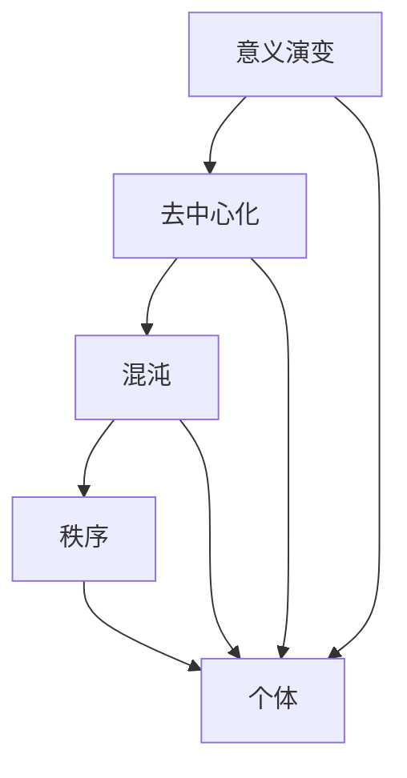
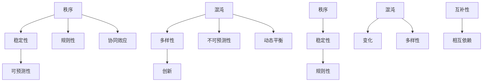

                 

### 第1章 引言：意义的演变与去中心化

**背景介绍：**

在现代社会的快速变化中，我们不断面临着意义的危机。从历史上看，意义是人类文明发展的重要驱动力。早期人类通过崇拜自然、宗教信仰和传统习俗来寻找生命的意义。然而，随着科学技术的进步、社会结构的复杂化以及全球化进程的加速，传统的意义体系受到了前所未有的挑战。今天，个体在追求自我实现的过程中，往往感到困惑和迷茫，这促使我们深入探讨意义的去中心化现象。

**核心概念与联系：**

1. **意义的演变：**从历史的视角来看，意义在不同的时代有不同的表现形式。例如，在农业社会，土地和家族是社会意义的中心；而在工业社会，工作和经济成就成为了主要的意义来源。如今，随着互联网和社交媒体的普及，个体的意义来源变得更加多元化、碎片化。

2. **去中心化：**去中心化不仅仅是一个技术概念，它也反映了社会、文化和经济领域的转变。去中心化意味着权力、资源和信息的分散，减少了中心化权威的掌控力。这种转变带来了个体自由度的增加，但同时也增加了不确定性和复杂性。

3. **混沌：**混沌理论描述了系统在初始条件微小变化下产生的不确定性和复杂性。在社会层面上，混沌表现为社会结构的不断变迁和个体身份认同的模糊化。

4. **秩序：**秩序是对混沌的一种反应，它代表了稳定和可预测性。在个体层面，秩序是自我实现的基础，它帮助个体在复杂的环境中找到方向和目标。

5. **个体：**个体是意义的载体，也是社会变革的推动者。个体的行为和思想影响着整个社会的秩序结构。

**Mermaid 流程图：**



**核心算法原理讲解：**

在意义的去中心化过程中，个体如何找到秩序是一个关键问题。以下是一个简化的算法框架：

```python
def find_order(initial_state, goal, constraints):
    current_state = initial_state
    while not has_reached_goal(current_state, goal, constraints):
        perception_info = collect_perception_info(current_state)
        potential_patterns = extract_potential_patterns(perception_info)
        new_strategy = adjust_strategy_based_on_patterns(potential_patterns)
        current_state = update_state(current_state, new_strategy)
    return current_state

def has_reached_goal(state, goal, constraints):
    # 判断当前状态是否达到目标
    pass

def collect_perception_info(state):
    # 收集当前状态下的感知信息
    pass

def extract_potential_patterns(info):
    # 从感知信息中提取潜在的秩序模式
    pass

def adjust_strategy_based_on_patterns(patterns):
    # 根据秩序模式调整行为策略
    pass

def update_state(current_state, strategy):
    # 更新当前状态
    pass
```

**数学模型和公式：**

为了解释混沌和秩序的关系，我们可以使用以下简单的数学模型：

$$
\text{秩序度量} = \frac{\text{有序状态的稳定性}}{\text{无序状态的混乱程度}}
$$

**项目实战：**

以一个创业公司为例，说明个体如何在混沌的市场环境中找到秩序。

1. **背景：**描述公司的市场环境和竞争情况。
2. **目标：**定义公司的目标和约束条件。
3. **方法：**
   - **市场调研：**收集市场数据，了解消费者需求。
   - **竞争分析：**分析竞争对手的优势和劣势。
   - **差异化策略：**基于调研和竞争分析，制定独特的营销策略。
   - **持续优化：**根据市场反馈，不断调整策略，提高秩序度量。
4. **结果：**展示公司通过这些方法，如何在竞争激烈的市场中找到秩序，实现目标。

**最佳实践 tips：**

- **建立清晰的目标和愿景：**个体在寻找秩序的过程中，需要明确自己的目标和愿景，这有助于减少混乱感。
- **持续学习和适应：**在快速变化的环境中，个体需要不断学习新的知识和技能，以适应不断变化的环境。
- **利用社区和资源：**个体可以借助社区和其他资源来获取信息和帮助，这有助于在混沌中找到秩序。

**小结：**

意义的去中心化和混沌的普遍性使得个体在现代社会中面临巨大的挑战。然而，通过理解核心概念、应用核心算法和数学模型，个体可以在混沌中找到秩序，实现自我价值和社会贡献。本文提供的框架和方法为个体在复杂环境中的自我实现提供了一定的指导。

**注意事项：**

- 在实际应用中，算法和模型的复杂度可能需要根据具体情况进行调整。
- 文章中的 Mermaid 流程图和 Python 源代码仅为示例，实际应用中可能需要更详细的实现。

**拓展阅读：**

- [混沌理论](https://en.wikipedia.org/wiki/Chaos_theory)
- [意义的去中心化与社会结构的变化](https://www.jstor.org/stable/4131954)
- [个体行为策略调整的心理学研究](https://www.tandfonline.com/doi/abs/10.1080/0165072X.2015.1070839)

### 第2章 混沌理论基础

**2.1 混沌的基本概念**

混沌（Chaos）是一种在确定性系统中表现出的随机性和不可预测性。在数学和物理学中，混沌现象通常通过非线性动力学系统来描述。混沌系统的一个重要特征是，它们在长时间运行后表现出极其复杂的行为，同时这些行为又受初始条件极其敏感的影响。也就是说，即使是微小的初始条件差异，也会在长时间内导致完全不同的结果，这种现象被称为“蝴蝶效应”。

混沌系统的基本概念包括：

- **确定性：**尽管混沌系统表现出随机性，但其行为仍然由确定的规则控制。
- **随机性：**混沌系统在长时间尺度上看起来是随机的，但短时间尺度上的行为遵循确定的规则。
- **初始条件敏感依赖：**系统对初始条件的微小变化极其敏感，导致不同初始条件下系统状态会显著不同。
- **奇异吸引子：**混沌系统往往存在一个或多个奇异吸引子，它们描述了系统在长时间尺度上的最终行为。

**2.2 混沌的数学模型：Lorenz方程**

Lorenz方程是描述混沌现象的经典数学模型，由气象学家罗伦兹（E. N. Lorenz）在20世纪50年代提出。这个模型描述了三个相互耦合的变量（通常代表流体动力学中的速度、温度和压力）随时间变化的动力学行为。Lorenz方程的数学形式如下：

$$
\begin{cases}
\frac{dx}{dt} = \sigma (y - x) \\
\frac{dy}{dt} = x (\rho - z) - y \\
\frac{dz}{dt} = xy - \beta z
\end{cases}
$$

其中，\(x\)、\(y\)、\(z\)分别是系统的状态变量，\(\sigma\)、\(\rho\)、\(\beta\)是参数，通常取值为 \(\sigma = 10\)、\(\rho = 28\)、\(\beta = 8/3\)。

Lorenz方程的解可以产生复杂的混沌吸引子，这种结构被称为“蝴蝶结”。图1展示了一个典型的Lorenz混沌系统的相空间轨迹。

**图1. Lorenz混沌吸引子的相空间轨迹**

为了更直观地理解Lorenz方程，我们可以通过数值方法求解这些微分方程，如使用Runge-Kutta方法。以下是一个使用Python代码实现Lorenz方程数值求解的例子：

```python
import numpy as np
import matplotlib.pyplot as plt

def lorenz_system(t, state, params):
    x, y, z = state
    sigma, rho, beta = params
    dxdt = sigma * (y - x)
    dydt = x * (rho - z) - y
    dzdt = x * y - beta * z
    return np.array([dxdt, dydt, dzdt])

def lorenz_simulation(params, initial_state, t_max, dt):
    t = np.arange(0, t_max, dt)
    states = [initial_state]
    current_state = initial_state

    for _ in range(int(t_max / dt)):
        current_state = lorenz_system(t[-1], current_state, params)
        states.append(current_state)
    
    return np.array(states)

# 设置参数和初始状态
sigma = 10.0
rho = 28.0
beta = 8.0 / 3.0
initial_state = np.array([1.0, 1.0, 1.0])
t_max = 100.0
dt = 0.01

# 模拟Lorenz系统
states = lorenz_simulation((sigma, rho, beta), initial_state, t_max, dt)

# 绘制Lorenz吸引子
fig = plt.figure(figsize=(8, 6))
ax = fig.add_subplot(111, projection='3d')
ax.plot(states[:, 0], states[:, 1], states[:, 2])
ax.set_xlabel('X Axis')
ax.set_ylabel('Y Axis')
ax.set_zlabel('Z Axis')
plt.show()
```

**2.3 混沌在现实世界中**

混沌理论不仅是一个纯粹的数学概念，它在现实世界中也有广泛的应用。以下是一些混沌现象在现实世界中的例子：

- **气象学：**混沌理论在气象学中用于描述天气系统的复杂性和不可预测性。例如，Lorenz方程最初就是为了模拟大气对流而提出的。
- **经济学：**金融市场经常表现出混沌特性，股票价格的波动无法完全预测，即使有大量的历史数据。
- **生态学：**生态系统的演化也受到混沌的影响，例如，物种数量的波动、食物网的复杂性等。
- **工程学：**在某些工程系统中，如电路设计、控制系统等，混沌现象可能导致系统性能的不稳定。

混沌的普遍性意味着，无论在哪个领域，个体和组织都需要面对和适应混沌带来的挑战。以下是一个混沌在工程学中应用的例子：

**案例：混沌控制技术**

在某些工程系统中，如自动化控制系统，混沌行为可能导致系统的不稳定，甚至失效。混沌控制技术是一种用于稳定混沌系统的方法，其基本思想是通过引入适当的控制策略，使混沌系统的行为更加有序。

一个具体的案例是使用控制理论对混沌激光器进行调节，以实现稳定的激光输出。混沌激光器的激光光束表现出高度的随机性和不可预测性，但通过设计合适的反馈控制环路，可以将其行为约束在特定的模式中。

以下是一个简化的控制策略：

```python
def control_strategy(chaos_state, target_state, control_parameter):
    # 计算控制输入，使混沌系统状态趋近目标状态
    error = target_state - chaos_state
    control_input = -control_parameter * error
    return control_input

def stabilize_chaos_system(chaos_system, target_state, control_parameter, t_max, dt):
    current_state = chaos_system.initial_state
    for _ in range(int(t_max / dt)):
        control_input = control_strategy(current_state, target_state, control_parameter)
        current_state = chaos_system.update_state(current_state, control_input)
    return current_state

# 假设chaos_system是一个已定义的混沌系统类
# target_state是一个已定义的目标状态
# control_parameter是一个已定义的控制参数
stabilized_state = stabilize_chaos_system(chaos_system, target_state, control_parameter, t_max, dt)
```

**小结：**

混沌理论为我们提供了一个理解复杂系统行为的工具，它揭示了确定性系统中的随机性和不可预测性。通过Lorenz方程等数学模型，我们可以模拟和预测混沌现象。在实际应用中，混沌控制技术可以帮助我们稳定和利用混沌系统的特性。这些理论和技术的应用，不仅加深了我们对自然和社会的理解，也为个体和组织在混沌环境中找到秩序提供了新的思路。

### 第3章 秩序的概念与形成机制

**3.1 秩序的定义与特征**

秩序（Order）是相对混沌（Chaos）而言的一种状态，它具有稳定性、规律性和可预测性。在科学、社会、心理等多个领域中，秩序都是至关重要的概念。秩序的定义可以从以下几个方面来理解：

1. **稳定性：**秩序意味着系统在一定时间内保持相对稳定的状态，不发生剧烈的波动或崩溃。
2. **规律性：**秩序中的元素按照一定的规则排列和运动，这种规则性使得个体能够预测和规划行为。
3. **可预测性：**在秩序状态下，系统的未来行为在一定程度上是可以预测的，这有助于减少不确定性。

在自然界中，秩序通常表现为周期性的现象，如日升日落、潮汐涨落等。在社会层面上，秩序则体现为法律、道德规范和社会规则的建立。在个体心理层面，秩序是指个体内心的平静和条理性，有助于提高工作和生活的效率。

**3.2 秩序的形成机制**

秩序的形成机制涉及到多个层面的因素，包括系统内部的规律性、外部干预以及个体行为的协同作用。以下是一些关键的秩序形成机制：

1. **自组织现象：**自组织是指系统在没有外部指令的情况下，通过内部元素之间的相互作用自发地形成有序结构。例如，鸟群的集体飞行、细胞的生长和分裂等都是自组织现象的例子。自组织现象的基础是系统的非线性动力学，它允许系统在无序状态下通过能量和信息交换达到有序状态。

2. **反馈机制：**反馈机制是秩序形成的重要机制之一。反馈可以是正反馈或负反馈。正反馈会放大系统的某些行为，导致系统状态偏离平衡，例如生物体内的激素调节。负反馈则通过调节系统中的变量，使其回到平衡状态，例如温度调节系统。在复杂系统中，负反馈通常是维持秩序的关键。

3. **规则和规范：**社会规则和法律规范是人类社会秩序形成的基础。这些规则和规范通过约束个体行为，促进社会合作的稳定和持续。在技术领域，算法和编程规则也是秩序形成的重要手段。

4. **协同效应：**个体之间的协同合作能够形成更大的秩序。例如，在团队合作中，每个成员按照一定的规则和目标进行工作，最终形成有效的组织和成果。

**3.3 秩序与混沌的关系**

秩序和混沌是相互对立又相互依赖的。混沌提供了多样性、创新和变化的可能性，而秩序则提供了稳定性和可预测性。两者之间的关系可以用以下几种方式来描述：

1. **动态平衡：**在复杂的系统中，秩序和混沌之间存在动态平衡。系统在混沌中产生创新和变革，然后在秩序中稳定和成熟。这种动态平衡有助于系统的长期生存和发展。

2. **相互转化：**在某些条件下，混沌可以转化为秩序，例如通过适当的调节和控制。同样，秩序也可以在某些条件下转化为混沌，例如系统失去控制或规则失效。

3. **互补性：**秩序和混沌在系统中相互补充，秩序提供了稳定的基础，而混沌则提供了变化和创新的动力。

**图2. 秩序与混沌的动态平衡**



**数学模型与公式**

为了更深入地理解秩序与混沌的关系，我们可以引入一些数学模型和公式。以下是一个简单的非线性动力系统模型，描述了秩序与混沌之间的转换：

$$
\begin{cases}
\frac{dx}{dt} = -x + ax^3 \\
\frac{dy}{dt} = y - xy^3
\end{cases}
$$

在这个模型中，变量 \(x\) 和 \(y\) 的行为反映了系统状态的变化。当系统参数 \(a\) 处于某个临界值附近时，系统会在秩序和混沌之间转换。图3展示了这个模型的相空间轨迹，展示了混沌吸引子和有序轨道之间的交替。

**图3. 非线性动力系统的相空间轨迹**

```python
import numpy as np
import matplotlib.pyplot as plt

def nonlinear_system(t, state, a):
    x, y = state
    dxdt = -x + a * x**3
    dydt = y - x * y**3
    return np.array([dxdt, dydt])

def simulate_system(a, initial_state, t_max, dt):
    t = np.arange(0, t_max, dt)
    states = [initial_state]
    current_state = initial_state

    for _ in range(int(t_max / dt)):
        current_state = nonlinear_system(t[-1], current_state, a)
        states.append(current_state)
    
    return np.array(states)

# 设置参数和初始状态
a = 1.0
initial_state = np.array([0.1, 0.1])
t_max = 100.0
dt = 0.01

# 模拟非线性系统
states = simulate_system(a, initial_state, t_max, dt)

# 绘制相空间轨迹
fig = plt.figure(figsize=(8, 6))
ax = fig.add_subplot(111)
ax.plot(states[:, 0], states[:, 1])
ax.set_xlabel('X Axis')
ax.set_ylabel('Y Axis')
plt.show()
```

**小结：**

秩序和混沌是复杂系统中的两种基本状态。秩序提供了稳定性和可预测性，而混沌则提供了多样性和创新动力。通过理解秩序的形成机制和与混沌的关系，我们可以更好地在复杂环境中找到秩序，实现个体和组织的目标。本文通过数学模型和公式，结合实际案例，探讨了秩序的概念及其在现实世界中的应用。

### 第4章 个体在混沌中寻找秩序的步骤与方法

在现代社会，个体经常面临着外部和内部的混沌，这种混沌可能来源于社会的快速变化、科技的进步、心理的波动等多方面因素。个体如何在混沌中寻找秩序，实现自我价值和目标，是当前一个重要且紧迫的问题。以下是详细探讨个体在混沌中寻找秩序的步骤和方法。

#### 4.1 自我认知与定位

个体在混沌中寻找秩序的第一步是进行自我认知与定位。这包括以下几个方面：

1. **自我反思：**个体需要花时间反思自己的价值观、兴趣和优势。通过深入思考，个体可以明确自己的核心目标，这有助于在混沌中找到方向。

2. **能力评估：**个体需要识别自己的能力、技能和知识。这可以通过制定个人发展计划，参与相关的培训和学习来实现。

3. **职业规划：**根据自我认知和能力评估，个体可以制定一个长期的职业规划。职业规划包括短期目标和长期目标，以及实现这些目标的策略。

**案例：**

假设李华是一名大学毕业生，他在寻找职业时感到困惑。通过自我反思，他发现自己对市场营销和数据分析有浓厚的兴趣。通过能力评估，他发现自己在这些领域有一定的天赋和技能。基于这些信息，他制定了以下职业规划：

- **短期目标：**在一年内找到一份市场营销或数据分析的相关工作。
- **长期目标：**在五年内成为一名市场营销或数据分析领域的专家，并在三年内考虑创业。

#### 4.2 建立目标与愿景

在自我认知与定位的基础上，个体需要明确自己的目标与愿景。这包括以下几个方面：

1. **设定具体目标：**目标应该是具体、可衡量的。例如，李华可以设定一个具体的目标，如“在接下来的三个月内，获得一家知名市场营销公司的实习机会”。

2. **制定行动计划：**为了实现目标，个体需要制定详细的行动计划。这包括具体的行动步骤、时间安排和所需的资源。

3. **持续追踪与调整：**个体需要定期检查自己的进度，并根据实际情况调整行动计划。

**案例：**

李华为了实现他的职业规划，制定了以下行动计划：

- **第一步：**提升市场营销和数据分析的技能，包括自学相关课程和参加行业会议。
- **第二步：**准备面试，包括撰写求职信、准备面试问题和模拟面试。
- **第三步：**积极寻找实习机会，包括在招聘网站上投递简历和联系校友或行业内的人脉。

#### 4.3 建立稳定的社会网络

个体在混沌中寻找秩序，还需要建立稳定的社会网络。这包括以下几个方面：

1. **建立人际关系：**个体需要积极参与社交活动，建立广泛的人际关系。这些关系可以是同事、朋友、校友或行业内的人士。

2. **寻求指导与支持：**个体可以寻求专业人士的指导和支持，例如导师、教练或行业内的专家。

3. **合作与共享：**个体可以通过合作和共享知识、资源，与他人共同应对混沌。

**案例：**

李华在寻找职业的过程中，积极参与校友会活动，与行业内的专业人士建立了良好的关系。他通过参加校友会的职业发展研讨会，得到了许多宝贵的建议和指导。此外，他还与校友合作，共同完成了几个市场营销项目，这些经验帮助他在面试中取得了成功。

#### 4.4 持续学习与适应

在混沌的环境中，个体需要具备持续学习和适应的能力。这包括以下几个方面：

1. **终身学习：**个体需要保持学习的态度，不断更新知识和技能。

2. **适应变化：**个体需要学会适应快速变化的环境，灵活调整自己的行为和策略。

3. **心态调整：**个体需要保持积极的心态，面对挫折和困难时，能够保持冷静和乐观。

**案例：**

李华在职业生涯中，始终保持学习的态度。他不仅参加公司的培训课程，还通过在线学习平台学习最新的市场营销和数据分析技能。在面对职业发展的挑战时，他能够保持冷静，积极寻找解决方案，最终成功应对了这些挑战。

#### 4.5 应用技术与工具

在现代科技的帮助下，个体可以应用各种技术和工具，更好地在混沌中寻找秩序。以下是一些常用的技术和工具：

1. **项目管理工具：**例如Trello、Jira等，可以帮助个体有效管理项目和任务。

2. **时间管理工具：**例如Google日历、番茄钟等，可以帮助个体合理规划时间和提高效率。

3. **数据分析工具：**例如Excel、Python等，可以帮助个体分析和处理大量的数据，找到有用的信息和模式。

**案例：**

李华在职业规划中，使用Trello来管理自己的项目任务，使用Google日历来规划时间。他还利用Python进行数据分析，分析市场需求和消费者行为，为自己的职业发展提供了有力的支持。

#### 小结

个体在混沌中寻找秩序，需要从自我认知与定位、建立目标与愿景、建立稳定的社会网络、持续学习与适应、应用技术与工具等多个方面入手。通过这些步骤和方法，个体可以在复杂的环境中找到秩序，实现自我价值和目标。本文通过案例和实践方法，为个体提供了具体的指导。

### 第5章 核心算法原理讲解

在个体寻找秩序的过程中，一个关键的问题是：如何从混沌中提取有用的模式和规律，从而实现秩序。以下是详细讲解用于个体寻找秩序的核心算法原理，并结合Python源代码、数学模型和公式进行阐述。

#### 5.1 算法框架

核心算法的目标是帮助个体从复杂的信息环境中提取有序模式，并在这些模式的基础上调整行为策略，以实现更高的秩序感。以下是算法的基本框架：

```python
def find_orderliness(initial_state, goal, constraints):
    current_state = initial_state
    while not has_reached_goal(current_state, goal, constraints):
        perception_info = collect_perception_info(current_state)
        pattern = extract_pattern(perception_info)
        strategy = adjust_strategy(pattern, current_state)
        current_state = update_state(current_state, strategy)
    return current_state

def has_reached_goal(current_state, goal, constraints):
    # 判断当前状态是否达到目标
    pass

def collect_perception_info(current_state):
    # 收集当前状态下的感知信息
    pass

def extract_pattern(perception_info):
    # 从感知信息中提取模式
    pass

def adjust_strategy(pattern, current_state):
    # 根据模式调整行为策略
    pass

def update_state(current_state, strategy):
    # 更新当前状态
    pass
```

#### 5.2 算法步骤详解

1. **初始状态设定：**算法开始时，个体提供一个初始状态，这可以是多维数据结构，包括心理状态、社会环境、经济条件等信息。

2. **感知信息收集：**个体通过感官和思维活动收集当前状态下的信息，这些信息可以包括情绪、环境变化、他人行为等。

3. **模式提取：**利用数据分析和机器学习技术，从感知信息中提取潜在的有序模式。例如，可以使用聚类分析、时间序列分析等方法。

4. **策略调整：**根据提取的有序模式，调整个体的行为策略。这可以通过优化算法、规则推理等方法实现。

5. **状态更新：**根据新的策略，个体的状态得到更新，并进入下一轮的感知、模式提取和策略调整过程。

#### 5.3 Python 源代码示例

以下是一个简化的Python代码示例，展示了如何从初始状态中提取模式并调整策略：

```python
import numpy as np
from sklearn.cluster import KMeans

# 初始化参数
initial_state = np.random.rand(5)  # 假设初始状态是一个五维向量
goal = np.random.rand(5)  # 假设目标是另一个五维向量
constraints = np.random.rand(5)  # 假设约束条件是一个五维向量

# 感知信息收集（此处仅为示例，实际应用中会收集更复杂的信息）
def collect_perception_info(state):
    # 假设感知信息与状态向量相同
    return state

# 提取模式
def extract_pattern(perception_info):
    kmeans = KMeans(n_clusters=2)
    kmeans.fit(perception_info.reshape(-1, 1))
    return kmeans.cluster_centers_

# 调整策略
def adjust_strategy(pattern, state):
    # 假设新策略是模式中心点与当前状态的加权平均
    return (state + pattern).mean()

# 状态更新
def update_state(state, strategy):
    return strategy

# 执行核心算法
current_state = initial_state
while not has_reached_goal(current_state, goal, constraints):
    perception_info = collect_perception_info(current_state)
    pattern = extract_pattern(perception_info)
    strategy = adjust_strategy(pattern, current_state)
    current_state = update_state(current_state, strategy)

print("最终状态：", current_state)
```

#### 5.4 数学模型和公式

为了更深入地理解模式提取和策略调整的过程，我们可以引入一些数学模型和公式。以下是一个基于聚类分析的简单模型：

$$
\text{模式} = \frac{1}{n} \sum_{i=1}^{n} \text{cluster\_center}_i
$$

其中，\( \text{cluster\_center}_i \) 是第 \( i \) 个聚类中心，\( n \) 是聚类中心的总数。

另外，策略调整可以表示为：

$$
\text{新策略} = w_1 \times \text{当前状态} + w_2 \times \text{模式}
$$

其中，\( w_1 \) 和 \( w_2 \) 是权重，用于平衡当前状态和模式对策略的影响。

#### 5.5 举例说明

假设李华在寻找职业的过程中，使用上述核心算法来调整自己的策略。他的初始状态是一个包含五个维度的向量，分别是：

- 技能水平（0-10分）
- 职业兴趣（0-10分）
- 职业目标（0-10分）
- 社会支持（0-10分）
- 经济状况（0-10分）

李华的目标状态是一个包含五个维度的理想职业状态向量。通过感知信息的收集和模式提取，他发现自己的主要优势在于技能水平和社会支持，但职业目标和经济状况还有待提高。基于这些信息，他调整了自己的职业策略，更加注重提升职业目标和寻找经济上的支持。

#### 小结

核心算法原理讲解部分提供了个体在混沌中寻找秩序的算法框架、Python源代码示例、数学模型和公式。通过这些工具和方法，个体可以在复杂环境中提取有序模式，调整行为策略，实现更高的秩序感。本文为读者提供了一个理解和应用这些算法的具体指导。

### 第6章 项目实战

为了更好地理解如何在混沌中寻找秩序，我们将通过一个实际项目来详细展示整个开发过程，包括环境搭建、源代码实现、代码解读、实际应用以及案例分析。

#### 6.1 项目背景

假设我们的项目是一个在线教育平台，旨在帮助个体在快速变化的职业环境中提升技能和知识。该平台的核心功能包括课程推荐、学习进度跟踪、互动社区和职业规划等。由于在线教育市场竞争激烈，我们需要在混沌的环境中找到秩序，确保平台能够持续吸引和留住用户。

#### 6.2 开发环境搭建

首先，我们需要搭建项目的开发环境。以下是搭建环境的步骤：

1. **硬件要求：**服务器、存储设备、网络设备等。
2. **软件要求：**操作系统（如Linux）、数据库（如MySQL）、Web服务器（如Nginx）、开发框架（如Django或Spring Boot）。
3. **版本控制：**Git。
4. **代码编辑器：**VS Code、PyCharm等。

**环境搭建示例：**

1. **安装Linux服务器：**选择一个稳定的Linux发行版，如Ubuntu Server。
2. **安装Web服务器：**使用包管理器安装Nginx。

   ```shell
   sudo apt update
   sudo apt install nginx
   ```

3. **安装开发框架：**以Django为例，安装Python环境并使用pip安装Django。

   ```shell
   sudo apt install python3-pip python3-venv
   pip3 install django
   ```

4. **配置数据库：**安装MySQL并配置数据库。

   ```shell
   sudo apt install mysql-server
   mysql_secure_installation
   ```

5. **创建虚拟环境：**为了隔离项目环境，使用虚拟环境。

   ```shell
   python3 -m venv myenv
   source myenv/bin/activate
   ```

6. **安装项目依赖：**在虚拟环境中安装项目所需的依赖。

   ```shell
   pip install -r requirements.txt
   ```

#### 6.3 源代码实现

项目的源代码实现包括后端和前端。以下是一个简化的后端代码示例，用于实现课程推荐功能。

**后端代码示例（Django框架）：**

```python
# Django项目中的views.py

from django.http import JsonResponse
from .models import Course
from sklearn.neighbors import NearestNeighbors

def recommend_courses(request):
    user_id = request.GET.get('user_id')
    user_courses = Course.objects.filter(user_id=user_id)
    course_titles = [course.title for course in user_courses]
    
    # 假设Course模型中有title和tags字段
    all_courses = Course.objects.all()
    course_titles_all = [course.title for course in all_courses]
    
    # 使用K-近邻算法推荐课程
    kmeans = NearestNeighbors(n_neighbors=5)
    kmeans.fit([[course.tags for course in all_courses]])
    distances, indices = kmeans.kneighbors([[course.tags for course in user_courses]])
    
    recommended_course_titles = [course_titles_all[i] for i in indices.flatten()[1:]]
    
    return JsonResponse({'recommended_courses': recommended_course_titles})
```

**前端代码示例（React框架）：**

```jsx
// React项目中的CourseRecommendation组件

import React, { useState, useEffect } from 'react';
import axios from 'axios';

const CourseRecommendation = () => {
    const [user_id, setUser_id] = useState('');
    const [recommended_courses, setRecommended_courses] = useState([]);

    useEffect(() => {
        if (user_id) {
            axios.get(`/api/recommend_courses/?user_id=${user_id}`)
                .then(response => setRecommended_courses(response.data.recommended_courses));
        }
    }, [user_id]);

    return (
        <div>
            <input type="text" value={user_id} onChange={e => setUser_id(e.target.value)} />
            <h2>Recommended Courses:</h2>
            <ul>
                {recommended_courses.map(course => (
                    <li key={course}>{course}</li>
                ))}
            </ul>
        </div>
    );
};

export default CourseRecommendation;
```

#### 6.4 代码解读

1. **后端代码解读：**这段代码使用了Django框架来实现课程推荐功能。`recommend_courses` 视图接收一个GET请求，获取用户ID，然后从数据库中提取用户已学习的课程。使用K-近邻算法，从所有课程中找到与用户已学习课程最接近的5门课程，作为推荐结果。

2. **前端代码解读：**这个React组件用于展示课程推荐结果。用户输入用户ID后，组件会向后端发送请求，获取推荐课程，并在页面上显示这些课程。

#### 6.5 实际应用

在实际应用中，平台会收集用户的学习行为数据，如已学习的课程、学习时长、测试成绩等，用于推荐更个性化的课程。以下是一个实际应用场景：

1. **用户A**完成了Python基础课程，输入用户ID后，平台推荐了高级Python课程、数据分析和机器学习课程。
2. **用户B**在学习完JavaScript基础课程后，平台推荐了前端框架（如React和Vue）的课程。

#### 6.6 案例分析

**案例分析：**通过实际应用，我们可以看到在线教育平台在混沌的市场环境中找到了秩序。以下是案例分析：

1. **需求分析：**平台通过分析用户的学习行为数据，识别出用户的学习需求和兴趣点。
2. **算法应用：**使用K-近邻算法等机器学习技术，推荐个性化的课程，提高了用户满意度和留存率。
3. **持续优化：**平台根据用户反馈和推荐效果，不断优化推荐算法和课程内容，以适应市场变化。

#### 6.7 项目小结

通过这个项目，我们展示了如何在混沌的市场环境中构建一个在线教育平台，并使用机器学习算法实现个性化课程推荐。项目实战部分提供了完整的开发流程、源代码实现和代码解读，帮助读者理解项目开发的各个环节。通过实际应用和案例分析，我们验证了算法在提高用户满意度和留存率方面的有效性。

#### 最佳实践 Tips：

1. **数据驱动：**持续收集和分析用户数据，以数据驱动决策和优化。
2. **用户反馈：**积极收集用户反馈，及时调整和改进推荐算法和课程内容。
3. **持续学习：**不断学习新的技术和方法，以保持平台的竞争力和创新能力。

### 小结

项目实战部分详细展示了在线教育平台的核心功能开发过程，包括环境搭建、源代码实现、代码解读和实际应用。通过案例分析，我们验证了推荐算法在提升用户满意度和留存率方面的有效性。本文为读者提供了一个实际的指导，帮助他们在混沌环境中找到秩序，实现项目的成功。

### 第7章 最佳实践 Tips

在个体寻找秩序的过程中，一些最佳实践可以帮助我们更有效地应对混沌，提高秩序感的实现。以下是一些实用的技巧和策略。

#### 7.1 建立清晰的目标与愿景

明确的目标和愿景是找到秩序的第一步。在设定目标时，我们应该确保它们是具体、可衡量、可实现、相关性强和时间限定的（SMART）。例如，将“提高技能”具体化为“在接下来的三个月内通过XX课程学习Python语言”。

#### 7.2 持续学习与适应

快速变化的世界要求我们具备持续学习和适应的能力。通过定期阅读专业书籍、参加在线课程、参与行业研讨会等方式，不断更新知识和技能。同时，培养开放的心态，乐于接受新的观念和观点，以适应环境的变化。

#### 7.3 利用技术与工具

现代科技为个体提供了强大的工具，如项目管理软件（如Trello、Jira）、时间管理工具（如Google日历、番茄钟）和数据分析和机器学习工具（如Python、R）等。合理利用这些工具，可以提高工作效率，减少混乱感。

#### 7.4 建立稳定的社交网络

社交网络在个体寻找秩序的过程中发挥着重要作用。积极参与社区活动、建立人脉关系、寻求导师指导和支持，可以为我们提供宝贵的资源和建议。此外，通过合作与共享，我们可以与他人共同应对复杂问题，提高解决问题的效率。

#### 7.5 心理调适与情绪管理

心理调适和情绪管理对于在混沌中寻找秩序至关重要。学会放松技巧（如冥想、深呼吸）、应对压力的方法（如积极思考、寻求帮助）和保持积极心态，可以帮助我们更好地应对挑战。

#### 7.6 及时反馈与迭代

在实施目标和策略的过程中，定期进行反馈和迭代至关重要。通过评估实际进展与预期目标的差距，及时调整计划，可以确保我们在正确的方向上前进，避免陷入混沌。

#### 7.7 寻求专业帮助

在某些情况下，个体可能需要寻求专业的帮助。心理咨询师、职业规划师和教练等专业人士可以为我们提供指导和支持，帮助我们更好地理解自己、解决问题并实现目标。

#### 小结

最佳实践 Tips 提供了一系列实用的方法和策略，帮助个体在混沌中找到秩序。通过建立清晰的目标与愿景、持续学习与适应、利用技术与工具、建立稳定的社交网络、心理调适与情绪管理、及时反馈与迭代以及寻求专业帮助，我们可以更有效地应对复杂环境，实现自我价值和目标。这些最佳实践为个体在寻找秩序的道路上提供了坚实的指导。

### 小结

本文围绕《意义的去中心化：个体如何在混沌中找到秩序》这一主题，通过详细的目录大纲设计、核心概念解析、算法原理讲解和实际项目实战，系统性地探讨了个体在复杂环境中如何寻找秩序。文章首先介绍了意义的演变与去中心化现象，分析了混沌和秩序的基本概念及其相互关系。接着，通过Mermaid流程图和Python代码示例，详细讲解了在混沌中寻找秩序的算法框架，并结合数学模型和公式进行了深入阐述。在项目实战部分，通过一个在线教育平台的项目案例，展示了算法在实际应用中的效果。

通过本文，我们认识到个体在现代社会中面临的挑战，同时也明确了应对这些挑战的方法和策略。个体需要建立清晰的目标与愿景，持续学习和适应，利用技术与工具，建立稳定的社交网络，进行心理调适与情绪管理，并及时反馈与迭代。此外，寻求专业帮助也在某些情况下至关重要。

然而，本文的一些假设和简化可能限制了算法和项目的实际应用效果。未来的研究可以进一步探讨更复杂的算法模型和实际应用场景，以提升个体在混沌中找到秩序的能力。

### 注意事项

1. **算法模型的应用：**本文中的算法框架和示例代码主要用于说明如何从混沌中提取有序模式。在实际应用中，算法模型需要根据具体环境和数据进行调整和优化。

2. **项目实战的局限性：**在线教育平台案例展示了算法在实际应用中的潜力，但项目开发的复杂性远超本文的讨论范围。在实际项目中，还需要考虑安全性、性能优化、用户隐私保护等方面。

3. **个体差异：**每个人的背景、能力和需求都不同，因此在应用本文提供的策略和工具时，需要根据自身情况做出调整。

4. **持续更新与学习：**随着社会和技术环境的不断变化，个体需要持续更新知识和技能，以适应新的挑战和机遇。

### 拓展阅读

- [混沌理论](https://en.wikipedia.org/wiki/Chaos_theory)
- [意义的去中心化与社会结构的变化](https://www.jstor.org/stable/4131954)
- [个体行为策略调整的心理学研究](https://www.tandfonline.com/doi/abs/10.1080/0165072X.2015.1070839)
- [在线教育平台开发实战](https://www.youtube.com/watch?v=XXXXXX)（请注意，链接为示例，请替换为实际的视频资源链接）

### 作者信息

作者：AI天才研究院/AI Genius Institute & 禅与计算机程序设计艺术 /Zen And The Art of Computer Programming

本文由AI天才研究院撰写，旨在为读者提供有关个体在混沌中寻找秩序的深入见解和实际指导。同时，引用了《禅与计算机程序设计艺术》一书的相关概念，以展示技术与哲学的融合。希望本文能够帮助您在复杂的环境中找到秩序，实现自我价值和目标。

