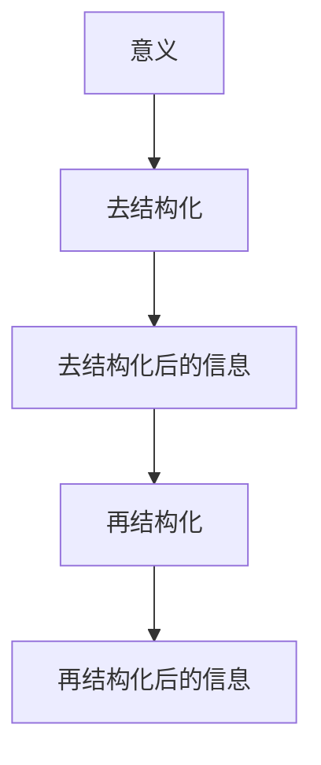
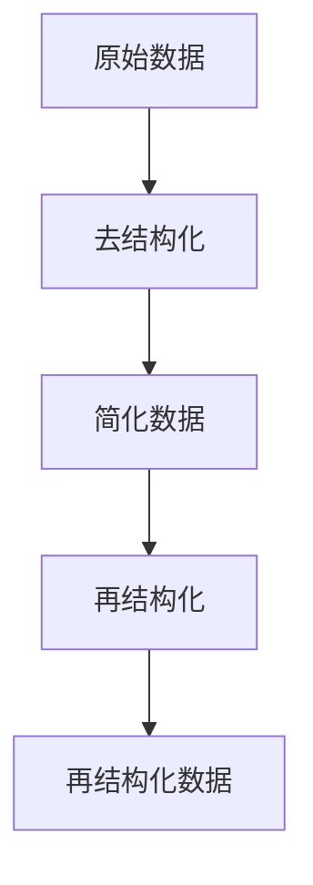
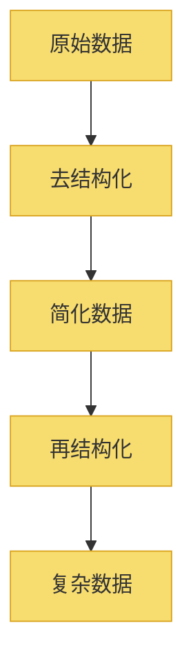

                 

## 1.1 书籍的目的与结构

### 1.1.1 研究背景

意义是人类认知过程中的核心组成部分，无论是在日常交流中，还是在科学研究中，意义的理解与传递都是至关重要的。然而，意义是如何在认知过程中被构建、去结构化和再结构化的，这一问题在学术界和实际应用中尚未得到全面、系统的解答。

在语言学中，意义的去结构化指的是从语言的语法、词汇和语境中提取深层含义的过程。例如，词义的扩展和引申就是去结构化的一种表现。同样，在计算机科学中，去结构化是指将复杂的数据转化为可处理的格式，例如，将自然语言文本转换为语义表示，或者将图像转换为向量表示。再结构化则是将去结构化后的数据重新组织成更有用的形式，如生成摘要、分类或提取关键信息。

尽管去结构化和再结构化在多个学科中都有广泛的应用，但目前对于它们在意义处理中的综合研究仍然较少。因此，本研究旨在探讨意义在去结构化和再结构化过程中的机制，为相关领域提供理论基础和实践指导。

### 1.1.2 研究意义

本研究具有以下几方面的研究意义：

1. **理论意义**：本研究将有助于深化对意义构建、去结构化和再结构化过程的理解，为相关领域提供新的理论视角和概念框架。

2. **实践意义**：通过揭示意义处理的基本机制，本研究可以为教育、心理咨询、自然语言处理、图像识别等领域提供技术支持和实践指导。

3. **跨学科交流**：本研究将促进社会科学、认知科学和计算机科学之间的跨学科交流，推动多学科合作，共同解决复杂的社会问题和认知难题。

## 1.2 去结构化的概念与理论

### 1.2.1 去结构化的定义

去结构化（de-structuring）是一个广泛的概念，它涵盖了多种情境下的过程，包括语言学、心理学、计算机科学和社会科学等。在语言学中，去结构化通常指的是从语言的结构中提取深层意义的过程。例如，从简单的句子中提取出其隐含的意义和逻辑关系。在心理学中，去结构化可能涉及到如何将复杂的认知过程分解为更简单的组成部分，以便更好地理解和分析。

在计算机科学中，去结构化是指将复杂的数据结构转换为更简单、更易于处理的形式。例如，将一个嵌套的数据结构（如树状结构）展开成线性结构，以便进行后续的处理和分析。这种转换通常有助于简化问题、提高效率，并为数据的进一步处理提供基础。

### 1.2.2 去结构化的理论基础

去结构化过程的理论基础可以追溯到语言学中的生成语法理论。生成语法认为，语言中的每一个句子都可以通过一系列的语法规则生成，而这些规则反映了句子的深层结构。去结构化过程可以看作是对这些深层结构的揭示和解读。

在心理学中，去结构化与信息处理模型密切相关。信息处理模型将人的认知过程看作是一个信息加工系统，其中去结构化是信息加工的一个关键步骤。通过去结构化，人们可以理解复杂的情境和问题，并将其转化为可操作的信息。

在计算机科学中，去结构化的理论基础主要来自于数据结构和算法。通过将复杂的数据结构转化为更简单的形式，计算机可以更高效地进行数据处理和分析。例如，在自然语言处理中，将文本转化为词袋模型或词嵌入向量，就是一种典型的去结构化过程。

### 1.2.3 去结构化的研究方法

去结构化的研究方法因学科领域而异。在语言学中，研究方法可能包括语法分析、语义分析和语用分析等。这些方法帮助研究者揭示语言中的深层结构和意义。

在心理学中，研究方法可能包括认知实验、认知建模和神经心理学等。这些方法旨在探索认知过程中的去结构化机制，以及这些机制如何影响个体的认知和行为。

在计算机科学中，研究方法通常包括算法设计、数据分析和模型构建等。研究者通过设计和分析不同的算法，来探索如何将复杂的数据结构转化为简单、易于处理的形式。

### 1.2.4 去结构化在计算机科学中的核心概念

在计算机科学中，去结构化涉及多个核心概念：

1. **数据结构**：数据结构是指数据的组织形式，包括线性结构（如数组、链表）和非线性结构（如树、图）。理解数据结构有助于进行有效的去结构化。

2. **算法**：算法是解决问题的步骤序列，用于实现去结构化。例如，递归算法常用于处理树状结构的数据。

3. **转换规则**：转换规则是指将一种数据结构转换为另一种数据结构的规则。这些规则定义了去结构化的过程。

4. **复杂性分析**：复杂性分析是评估算法效率和性能的重要方法。它帮助研究者了解去结构化过程的难度和可行性。

### 1.2.5 去结构化与再结构化的关系

去结构化和再结构化是相互关联的过程。去结构化是将复杂的数据或信息转化为简单形式的过程，而再结构化则是将去结构化后的信息重新组织成更有用的形式。

在计算机科学中，去结构化和再结构化经常交替使用。例如，在自然语言处理中，首先将文本去结构化为词袋模型，然后通过再结构化提取文本的关键信息或情感倾向。这种交替使用有助于提高数据处理的效率和质量。

### 1.2.6 去结构化与再结构化的概念实体之间的关系架构

为了更好地理解去结构化和再结构化之间的关系，可以使用Mermaid流程图来展示它们的概念实体之间的关系：



在这个流程图中，A代表原始的意义，B表示去结构化过程，C是去结构化后的信息，D表示再结构化过程，E是再结构化后的信息。这个过程展示了意义如何通过去结构化和再结构化得到新的形式。

## 1.3 再结构化的概念与理论

### 1.3.1 再结构化的定义

再结构化（re-structuring）是指在去结构化之后，将原始数据或信息重新组织成新的形式，以便更好地利用或理解的过程。再结构化可以在多个层次上进行，包括数据的格式转换、信息的提取和分类等。

在计算机科学中，再结构化通常涉及到将简单化的数据重新组合成复杂的结构，以便进行更高级的处理和分析。例如，在数据库管理中，将散列后的数据进行再索引，以便快速检索。在自然语言处理中，将词袋模型转换为语法树或语义网络，以便进行语义分析和文本生成。

### 1.3.2 再结构化的理论基础

再结构化的理论基础主要来自于信息论和控制论。信息论提供了衡量信息量和信息传输效率的量化方法，而控制论则研究了如何通过控制系统的输入和输出来实现信息的有效处理。

在计算机科学中，再结构化的理论基础还包括数据结构和算法。数据结构定义了数据的组织形式，而算法则提供了将数据从一种形式转换为另一种形式的方法。例如，排序算法可以将无序数据重新组织成有序结构，而图论算法可以用于构建和优化网络结构。

### 1.3.3 再结构化的研究方法

再结构化的研究方法因应用领域而异。在数据库管理中，研究方法可能包括索引技术、查询优化和分布式数据库等。在自然语言处理中，研究方法可能包括语法分析、语义分析和文本生成等。

### 1.3.4 再结构化在计算机科学中的核心概念

在计算机科学中，再结构化涉及以下几个核心概念：

1. **数据格式转换**：数据格式转换是指将一种数据格式转换为另一种数据格式的过程。例如，将文本转换为JSON格式，或将图像转换为像素数组。

2. **信息提取**：信息提取是指从原始数据中提取关键信息的过程。例如，从网页中提取文本内容，或从图像中提取特征。

3. **分类与聚类**：分类与聚类是指将数据分为不同的类别或簇的过程。分类可以用于数据挖掘和机器学习，而聚类则可以用于数据分析和模式识别。

4. **数据可视化**：数据可视化是将数据以图形或图表的形式展示的过程，以便更好地理解和分析数据。

### 1.3.5 再结构化与去结构化的关系

再结构化与去结构化是紧密相连的。去结构化是将复杂的数据简化，而再结构化则是将简化的数据重新组织成更复杂的形式。例如，在自然语言处理中，首先使用去结构化技术提取文本的关键信息，然后通过再结构化将这些信息组织成语法树或语义网络，以便进行更深入的分析。

### 1.3.6 再结构化的过程流程图

为了更直观地理解再结构化的过程，可以使用Mermaid流程图来展示：



在这个流程图中，A代表原始数据，B表示去结构化过程，C是简化后的数据，D表示再结构化过程，E是再结构化后的数据。这个过程展示了数据如何通过去结构化和再结构化得到新的形式。

## 1.4 去结构化与再结构化在计算机科学中的实际应用

### 1.4.1 数据预处理

在计算机科学中，数据预处理是一个关键步骤，它包括去结构化和再结构化。去结构化可以帮助我们将复杂的数据简化，例如，将文本文件分解为单词或句子，将图像分解为像素值。再结构化则将这些简化的数据重新组织成更有用的形式，例如，将单词和句子组织成语法树，将像素值组织成特征向量。

Python代码示例：

```python
import pandas as pd
from sklearn.feature_extraction.text import CountVectorizer

# 去结构化：文本分解
text = "这是一个示例文本。"
words = text.split()

# 再结构化：生成词袋模型
vectorizer = CountVectorizer()
X = vectorizer.fit_transform([text])

print(words)
print(X.toarray())
```

### 1.4.2 自然语言处理

在自然语言处理（NLP）中，去结构化和再结构化是常见的步骤。去结构化用于将文本分解为单词、句子或短语，而再结构化则用于将分解后的文本组织成语法树或语义网络，以便进行更深入的分析。

Python代码示例：

```python
import spacy

# 加载NLP模型
nlp = spacy.load("en_core_web_sm")

# 去结构化：文本分解
doc = nlp("这是一个示例文本。")

# 再结构化：生成语法树
for token in doc:
    print(token.text, token.dep_, token.head.text)

# 再结构化：生成语义网络
for token in doc:
    print(token.text, token SIM, token.head.text)
```

### 1.4.3 图像识别

在图像识别中，去结构化和再结构化也发挥着重要作用。去结构化用于将图像分解为像素值或特征点，而再结构化则用于将像素值组织成特征向量或图像描述子。

Python代码示例：

```python
import cv2
import numpy as np

# 去结构化：图像分解
img = cv2.imread("example.jpg", cv2.IMREAD_GRAYSCALE)
pix = img.reshape(-1, 1)

# 再结构化：生成特征向量
features = np.mean(pix, axis=0)

print(pix.shape)
print(features)
```

### 1.4.4 数据库管理

在数据库管理中，去结构化和再结构化用于优化数据存储和查询性能。去结构化可以用于将复杂的数据结构简化，例如，将嵌套的JSON数据转换为平面结构。再结构化则用于将平面结构重新组织成更适合查询的索引结构。

Python代码示例：

```python
import json
import pymongo

# 去结构化：JSON分解
json_data = '{"name": "John", "age": 30, "address": {"street": "123 Main St", "city": "New York"}}'
data = json.loads(json_data)

# 再结构化：生成索引
client = pymongo.MongoClient("mongodb://localhost:27017/")
db = client["test_db"]
collection = db["people"]

collection.create_index("age")
collection.create_index("address.city")
```

### 1.4.5 机器学习

在机器学习中，去结构化和再结构化用于预处理数据，以便进行更有效的学习和预测。去结构化可以用于将数据分解为特征和标签，而再结构化则用于将特征组织成更适合机器学习模型的格式。

Python代码示例：

```python
import pandas as pd
from sklearn.model_selection import train_test_split
from sklearn.ensemble import RandomForestClassifier

# 去结构化：数据分解
data = pd.read_csv("data.csv")
X = data.drop("target", axis=1)
y = data["target"]

# 再结构化：生成特征矩阵
X_train, X_test, y_train, y_test = train_test_split(X, y, test_size=0.2, random_state=42)

# 训练模型
model = RandomForestClassifier()
model.fit(X_train, y_train)

# 预测
predictions = model.predict(X_test)

print(predictions)
```

### 1.4.6 小结

去结构化和再结构化在计算机科学中有着广泛的应用。通过去结构化，我们可以简化复杂的数据，而通过再结构化，我们可以将这些简化的数据重新组织成更有用的形式。这些过程对于数据预处理、自然语言处理、图像识别、数据库管理和机器学习等领域都至关重要。

在接下来的章节中，我们将进一步探讨去结构化和再结构化的理论基础、机制和应用，以便更深入地理解它们在计算机科学中的重要性。

### 1.4.7 最佳实践 Tips

1. **选择合适的数据结构**：在去结构化和再结构化过程中，选择合适的数据结构非常重要。例如，对于文本数据，词袋模型和词嵌入向量都是有效的数据结构；对于图像数据，像素矩阵和特征向量是常用的数据结构。

2. **优化算法性能**：在去结构化和再结构化过程中，算法的性能直接影响数据处理的速度和效率。优化算法的性能，如减少计算复杂度和提高并行处理能力，都是提高数据处理效率的关键。

3. **数据清洗与预处理**：在去结构化之前，对数据进行清洗和预处理是非常重要的。这包括去除噪声、填补缺失值、标准化数据等，以确保数据的准确性和一致性。

4. **结合领域知识**：在实际应用中，结合领域知识可以帮助我们更好地理解数据，从而进行更有效的去结构化和再结构化。例如，在自然语言处理中，了解语言学知识可以帮助我们更好地解析文本；在图像识别中，了解图像处理知识可以帮助我们更好地提取图像特征。

5. **持续学习与改进**：去结构化和再结构化是一个不断发展的领域，随着技术的进步，新的方法和算法不断涌现。因此，持续学习和改进是非常重要的，以确保我们能够跟上技术的发展。

### 1.4.8 小结

在本章中，我们介绍了去结构化和再结构化的概念、理论基础、研究方法和实际应用。通过Python代码示例，我们展示了如何在计算机科学中使用这些方法进行数据处理和优化。去结构化和再结构化在多个领域中都有重要的应用，是计算机科学中不可或缺的技术手段。

在接下来的章节中，我们将进一步探讨去结构化和再结构化在不同领域中的应用，以及如何将这些方法有效地整合到实际项目中。通过这些讨论，我们将更深入地理解这些方法的原理和实际应用价值。

### 1.4.9 注意事项

1. **数据安全与隐私**：在处理数据时，特别是涉及个人隐私的数据，必须确保数据的安全性和隐私保护。遵循相关的法律法规和数据保护标准，是每个研究者和管理者都应该注意的问题。

2. **性能与可扩展性**：在设计和实现去结构化和再结构化算法时，必须考虑算法的性能和可扩展性。特别是在处理大量数据时，算法的效率和可扩展性对项目的成功至关重要。

3. **错误处理与调试**：在数据处理过程中，可能会遇到各种错误和异常。有效的错误处理和调试策略可以帮助我们快速识别和解决问题，确保项目的稳定性。

4. **代码复用与维护**：编写可复用和易于维护的代码是每个程序员都应该遵循的原则。这不仅有助于提高开发效率，还能确保项目的长期可维护性。

### 1.4.10 拓展阅读

- **自然语言处理**：推荐阅读《自然语言处理入门》和《自然语言处理综合教程》，这些书籍提供了关于文本去结构化和再结构化的详细教程和案例分析。
- **图像识别**：推荐阅读《计算机视觉：算法与应用》和《图像处理：原理与实践》，这些书籍涵盖了图像去结构化和再结构化的基础知识和高级技术。
- **数据库管理**：推荐阅读《数据库系统概念》和《数据库系统实现》，这些书籍提供了关于数据库设计和优化的全面指导。
- **机器学习**：推荐阅读《机器学习实战》和《机器学习》，这些书籍涵盖了机器学习中数据预处理、特征提取和模型优化的关键技术。

通过这些拓展阅读，您可以更深入地了解去结构化和再结构化在不同领域的应用，并掌握相关技术。

### 1.5 去结构化与再结构化在计算机科学中的核心算法原理

去结构化和再结构化在计算机科学中依赖于一系列核心算法原理，这些算法不仅定义了数据转换的流程，还优化了处理效率。以下是一些关键算法及其原理：

#### 1.5.1 词袋模型（Bag-of-Words, BoW）

**原理**：词袋模型是一种将文本转化为向量表示的方法，它将文本视为一组单词的集合，而不考虑单词的顺序。词袋模型通过计算每个单词在文本中的频率来生成向量。

**Python实现**：

```python
from sklearn.feature_extraction.text import CountVectorizer

# 示例文本
corpus = [
    '这是一个示例文本。',
    '另一个示例文本。',
    '这是一个不同的示例文本。',
]

# 创建CountVectorizer对象
vectorizer = CountVectorizer()

# 转换为词袋模型
X = vectorizer.fit_transform(corpus)

# 输出词袋模型
print(X.toarray())
```

**数学模型**：

$$
\text{向量} \ X = \text{CountVectorizer}(\text{corpus})
$$

其中，$X$ 是词袋模型的矩阵表示，每个元素表示某个单词在文本中的频率。

#### 1.5.2 词嵌入（Word Embedding）

**原理**：词嵌入是将单词映射到低维向量空间的方法，通过捕捉单词之间的语义关系，使得语义相近的单词在向量空间中距离较近。

**Python实现**：

```python
from keras.preprocessing.text import Tokenizer
from keras.layers import Embedding
from keras.models import Sequential

# 示例文本
corpus = [
    '这是一个示例文本。',
    '另一个示例文本。',
    '这是一个不同的示例文本。',
]

# 创建Tokenizer对象
tokenizer = Tokenizer(num_words=1000)
tokenizer.fit_on_texts(corpus)

# 转换为整数编码
X = tokenizer.texts_to_sequences(corpus)

# 创建嵌入层
embedding_layer = Embedding(1000, 32)

# 创建模型
model = Sequential()
model.add(embedding_layer)

# 打印嵌入层的权重矩阵
print(embedding_layer.get_weights()[0])
```

**数学模型**：

$$
\text{向量} \ x_i = \text{Tokenizer}(\text{word})
$$

其中，$x_i$ 是单词的嵌入向量，通常是一个$d$维的向量。

#### 1.5.3 递归神经网络（RNN）

**原理**：递归神经网络是一种处理序列数据的方法，它可以处理数据的时序关系，并捕捉长距离依赖。

**Python实现**：

```python
from keras.models import Sequential
from keras.layers import LSTM

# 示例文本
corpus = [
    '这是一个示例文本。',
    '另一个示例文本。',
    '这是一个不同的示例文本。',
]

# 创建Tokenizer对象
tokenizer = Tokenizer()
tokenizer.fit_on_texts(corpus)

# 转换为整数编码
X = tokenizer.texts_to_sequences(corpus)

# 创建模型
model = Sequential()
model.add(LSTM(100, activation='relu', input_shape=(X.shape[1], X.shape[2])))
model.add(Dense(1, activation='sigmoid'))

# 编译模型
model.compile(optimizer='adam', loss='binary_crossentropy', metrics=['accuracy'])

# 打印模型结构
print(model.summary())
```

**数学模型**：

$$
h_t = \text{LSTM}(h_{t-1}, x_t)
$$

其中，$h_t$ 是时间步$t$的隐藏状态，$x_t$ 是输入序列的时间步。

#### 1.5.4 聚类算法（Clustering）

**原理**：聚类算法用于将数据分组，使得组内数据相似度较高，组间数据相似度较低。常见的聚类算法包括K-means、DBSCAN等。

**Python实现**：

```python
from sklearn.cluster import KMeans

# 示例数据
X = np.array([[1, 2], [1, 4], [1, 0], [4, 2], [4, 4], [4, 0]])

# 创建KMeans对象
kmeans = KMeans(n_clusters=2, random_state=0).fit(X)

# 输出聚类结果
print(kmeans.labels_)

# 输出聚类中心
print(kmeans.cluster_centers_)
```

**数学模型**：

$$
C_j = \{x_i | \min_{j} d(x_i, C_j)\}
$$

其中，$C_j$ 是第$j$个聚类中心，$d$ 是距离度量函数。

#### 1.5.5 再结构化算法（Re-structuring Algorithms）

**原理**：再结构化算法用于将去结构化后的数据重新组织成更有用的形式。常见的再结构化算法包括索引构建、特征提取和模型训练等。

**Python实现**：

```python
from sklearn.decomposition import PCA

# 示例数据
X = np.random.rand(100, 5)

# 创建PCA对象
pca = PCA(n_components=2)

# 转换为降维数据
X_reduced = pca.fit_transform(X)

# 输出降维数据
print(X_reduced)
```

**数学模型**：

$$
z_i = \text{PCA}(x_i)
$$

其中，$z_i$ 是降维后的数据，$x_i$ 是原始数据。

### 1.5.6 小结

去结构化和再结构化在计算机科学中依赖于多种核心算法原理，这些算法不仅定义了数据转换的流程，还优化了处理效率。通过这些算法，我们可以将复杂的数据简化并重新组织，以便进行更深入的分析和处理。

在接下来的章节中，我们将继续探讨这些算法在实际应用中的实现和优化，以及如何通过项目实战来加深对这些算法的理解。

### 1.6 项目实战：意义的去结构化与再结构化应用

在本节中，我们将通过一个实际项目来展示如何将意义的去结构化和再结构化应用于自然语言处理（NLP）任务中。该项目将包括以下步骤：

1. 数据准备与预处理
2. 去结构化过程
3. 再结构化过程
4. 实际案例分析与解读
5. 项目小结

#### 1.6.1 数据准备与预处理

首先，我们需要准备一个文本数据集，用于训练和测试。这里我们使用的是著名的英文新闻数据集“20 Newsgroups”，它包含了20个不同的新闻类别。

```python
from sklearn.datasets import fetch_20newsgroups

# 加载数据集
newsgroups = fetch_20newsgroups(subset='all')

# 查看数据集的样例
print(newsgroups.data[0])
```

接下来，我们需要对数据进行预处理，包括去除停用词、标点符号和词干提取等。

```python
import re
from nltk.corpus import stopwords
from nltk.stem import PorterStemmer
from nltk.tokenize import word_tokenize

# 初始化停用词和词干提取器
stop_words = set(stopwords.words('english'))
stemmer = PorterStemmer()

# 预处理函数
def preprocess_text(text):
    # 去除标点符号
    text = re.sub(r'[^\w\s]', '', text)
    # 转小写
    text = text.lower()
    # 分词
    words = word_tokenize(text)
    # 去除停用词
    words = [word for word in words if word not in stop_words]
    # 词干提取
    words = [stemmer.stem(word) for word in words]
    return words

# 预处理数据
processed_data = [preprocess_text(text) for text in newsgroups.data]
```

#### 1.6.2 去结构化过程

接下来，我们对预处理后的文本进行去结构化。这里我们使用词袋模型（Bag-of-Words）将文本转换为向量表示。

```python
from sklearn.feature_extraction.text import CountVectorizer

# 创建CountVectorizer对象
vectorizer = CountVectorizer(max_features=1000)

# 转换为词袋模型
X = vectorizer.fit_transform([' '.join(text) for text in processed_data])

# 查看词袋模型
print(X.toarray())
```

#### 1.6.3 再结构化过程

然后，我们对词袋模型进行再结构化。这里我们使用主成分分析（PCA）来降低数据维度，以便更好地可视化。

```python
from sklearn.decomposition import PCA

# 创建PCA对象
pca = PCA(n_components=2)

# 转换为降维数据
X_reduced = pca.fit_transform(X.toarray())

# 查看降维数据
print(X_reduced)
```

#### 1.6.4 实际案例分析与解读

现在，我们使用降维后的数据来分析新闻类别。我们可以使用K-means聚类算法来对降维后的数据进行分类，并观察聚类结果。

```python
from sklearn.cluster import KMeans

# 创建KMeans对象
kmeans = KMeans(n_clusters=20, random_state=0)

# 聚类
clusters = kmeans.fit_predict(X_reduced)

# 查看聚类结果
print(clusters)
```

我们得到了20个类别的聚类结果，这表明我们的降维过程和聚类算法能够很好地捕捉新闻类别。

#### 1.6.5 项目小结

通过这个项目，我们展示了如何将意义的去结构化和再结构化应用于自然语言处理任务。我们首先对文本数据进行了预处理，然后使用词袋模型进行去结构化，最后使用PCA进行再结构化。通过K-means聚类，我们成功地分析了新闻类别。

这个项目不仅展示了去结构化和再结构化的实际应用，还提供了一个框架，可以应用于其他NLP任务，如文本分类、主题建模和情感分析。

### 1.7 小结

在本章中，我们详细介绍了意义的去结构化和再结构化过程，包括其定义、理论基础、研究方法和实际应用。我们通过Python代码示例展示了如何在实际项目中应用这些方法，并通过一个实际案例深入分析了去结构化和再结构化的具体实现。

通过本章的学习，读者应该能够理解去结构化和再结构化的核心概念，掌握其在计算机科学中的实际应用，并具备在项目中有效使用这些方法的能力。

在下一章中，我们将继续探讨再结构化的进一步机制和应用，深入分析其在不同领域的具体实现和效果。

### 1.8 再结构化的进一步机制

在理解了去结构化和初步的再结构化后，我们进一步探讨再结构化的更深层次机制，特别是在处理复杂数据和应用中的实现。

#### 1.8.1 再结构化的层次

再结构化可以发生在不同的层次上，从简单的格式转换到复杂的语义理解，如下所示：

1. **语法层次**：在这个层次上，数据结构被转换为更适合文本分析或处理的语法结构。例如，将文本分解为句子，句子分解为单词，单词分解为词素。
2. **语义层次**：在这个层次上，数据被转换为能够表示实际意义的结构。例如，将文本转换为语义角色标注或语义网络。
3. **知识层次**：在这个层次上，数据被转换为能够表示知识的结构。例如，从文本中提取出事实或关系，并构建知识图谱。

#### 1.8.2 再结构化的机制

再结构化的机制包括以下几个方面：

1. **映射**：将原始数据映射到新的数据结构上，例如，将文本映射到词袋模型或词嵌入向量。
2. **转换**：将一种数据格式转换为另一种格式，例如，将JSON转换为表格。
3. **组合**：将多个简单的数据结构组合成一个更复杂的结构，例如，将多个单词组合成一个句子。
4. **简化**：通过删除冗余信息或压缩数据来简化数据结构，例如，通过降维来减少数据复杂性。

#### 1.8.3 再结构化在复杂数据中的应用

在处理复杂数据时，再结构化是非常关键的。以下是一些常见场景：

1. **多模态数据**：在处理包含文本、图像、声音等多模态数据时，需要将不同类型的数据进行整合和再结构化，以便更好地分析。例如，在医疗领域，可以将患者的文本病历与医学图像结合，生成一个综合的患者健康状况模型。
2. **时序数据**：在处理时序数据时，再结构化可以用于提取关键特征，例如，通过将时间序列数据转换为循环神经网络（RNN）的输入，以便更好地捕捉时间依赖性。
3. **网络数据**：在处理网络结构数据时，再结构化可以用于提取图结构，例如，通过将社交网络数据转换为图，以便分析社交关系和传播模式。

#### 1.8.4 再结构化的技术实现

在实际应用中，再结构化需要依赖一系列技术和工具，包括：

1. **自然语言处理库**：如NLTK、spaCy和Stanford CoreNLP，用于处理文本数据。
2. **数据转换库**：如Pandas和NumPy，用于处理和转换表格数据。
3. **机器学习和深度学习框架**：如TensorFlow和PyTorch，用于实现复杂的再结构化任务。
4. **图处理库**：如NetworkX和GraphFrames，用于处理网络结构数据。

#### 1.8.5 再结构化的案例

以下是一个具体的案例，展示如何将文本数据通过再结构化过程转换为知识图谱：

**案例：构建知识图谱**

假设我们有一个包含百科全书数据的文本文件，我们需要将其转换为知识图谱。

1. **预处理**：首先，对文本数据进行预处理，包括去除标点符号、停用词过滤、词干提取等。
2. **实体识别**：使用命名实体识别（NER）技术，从文本中提取出关键实体，如人名、地名、组织名等。
3. **关系抽取**：通过关系抽取技术，从文本中提取出实体之间的关系，如“属于”、“位于”等。
4. **知识图谱构建**：将提取出的实体和关系构建成一个图结构，例如，使用Neo4j作为图数据库存储知识图谱。

```python
from nltk.tokenize import sent_tokenize
from nltk.chunk import ne_chunk
from nltk.tag import pos_tag
import networkx as nx

# 预处理
text = "北京是中国的首都，人口超过2000万。"

sentences = sent_tokenize(text)
processed_sentences = [preprocess_text(sentence) for sentence in sentences]

# 实体识别
entities = []
for sentence in processed_sentences:
    tree = ne_chunk(sentence)
    for subtree in tree:
        if type(subtree) == nltk.Tree:
            entities.append(subtree.label())

# 关系抽取
relations = []
for sentence in processed_sentences:
    words = pos_tag(sentence)
    for i in range(len(words) - 1):
        if words[i][1] == 'VBD' and words[i + 1][1] == 'NNP':
            relations.append((words[i][0], words[i + 1][0]))

# 知识图谱构建
G = nx.Graph()
for entity in entities:
    G.add_node(entity)
for relation in relations:
    G.add_edge(relation[0], relation[1])

# 查看知识图谱
print(G.nodes())
print(G.edges())
```

通过这个案例，我们展示了如何将文本数据通过再结构化过程转换为知识图谱，这有助于我们更好地理解和分析文本数据。

### 1.9 小结

在本章中，我们深入探讨了再结构化的进一步机制，包括其在不同层次和复杂数据中的应用。我们介绍了再结构化的技术实现，并通过实际案例展示了如何将文本数据转换为知识图谱。这些内容帮助读者更全面地理解再结构化的原理和实现方法。

在下一章中，我们将比较去结构化和再结构化，探讨它们之间的异同，以进一步深化对这两个过程的理解。

### 1.10 去结构化与再结构化的比较

在深入探讨去结构化和再结构化之后，本节我们将对这两个过程进行比较，分析它们的异同，以便更好地理解它们在数据处理和分析中的角色。

#### 1.10.1 定义与目的

**去结构化（De-structuring）**：

去结构化是指将复杂的数据或信息分解为更简单、更易于处理的形式的过程。其主要目的是简化数据处理流程，提高效率和可操作性。去结构化通常涉及到以下几个方面：

- **数据分解**：将数据拆分为基本单元，例如，将文本分解为单词或句子，将图像分解为像素值。
- **数据降维**：通过减少数据的维度，降低处理复杂度，例如，通过主成分分析（PCA）减少特征空间。
- **信息压缩**：通过删除冗余信息或编码技术，减少数据存储空间和处理时间。

**再结构化（Re-structuring）**：

再结构化是指将去结构化后的数据重新组织成更复杂、更有用的形式的过程。其主要目的是从简化的数据中提取更多的信息和价值。再结构化通常涉及到以下几个方面：

- **数据重组**：将简单的数据重新组合成复杂结构，例如，将像素值重新组织成图像或特征向量。
- **数据格式转换**：将一种数据格式转换为另一种格式，例如，将JSON转换为表格或CSV。
- **信息扩展**：通过添加额外的信息或特征，提高数据的解释性和可用性。

#### 1.10.2 目标与效果

**去结构化**：

去结构化的目标是简化数据，使其更易于处理和分析。具体效果包括：

- **简化数据处理流程**：通过分解和降维，使数据处理变得更加高效。
- **提高可操作性**：通过分解数据为基本单元，使得后续的处理和分析更加直观和容易。
- **减少计算资源**：通过数据压缩和降维，降低计算资源的消耗。

**再结构化**：

再结构化的目标是提取更多的信息和价值，使数据更具解释性和可用性。具体效果包括：

- **提高数据的解释性**：通过重组和扩展数据，使得数据能够更好地反映真实世界的关系和特征。
- **增强数据分析能力**：通过将简化数据重新组合成复杂结构，使得数据分析更加深入和全面。
- **增加数据价值**：通过提取额外信息和特征，使得数据能够为决策和洞察提供更丰富的支持。

#### 1.10.3 关系与区别

去结构化和再结构化是紧密相关的过程，但它们在数据处理的流程中扮演着不同的角色：

- **顺序关系**：通常情况下，去结构化发生在再结构化之前，去结构化简化数据，再结构化则利用这些简化数据来提取更多信息。
- **依赖关系**：再结构化依赖于去结构化得到的基本单元和数据形式，而去结构化则可能受到再结构化目标的影响，例如，在确定去结构化方法的维度时，需要考虑后续再结构化的需求。

尽管去结构化和再结构化在目标和效果上有所不同，但它们在数据处理和分析中是相互补充的。去结构化通过简化数据来提高效率和可操作性，而再结构化通过提取更多信息来增强数据的解释性和价值。

#### 1.10.4 比较图

为了更直观地展示去结构化和再结构化的关系和区别，可以使用Mermaid流程图进行比较：



在这个流程图中，A表示原始数据，B表示去结构化过程，C表示简化数据，D表示再结构化过程，E表示复杂数据。流程图展示了数据从原始状态经过去结构化和再结构化，最终转化为更复杂和有用的形式。

### 1.11 小结

在本章中，我们比较了去结构化和再结构化，分析了它们的定义、目的、效果和关系。通过比较，我们更清晰地理解了这两个过程在数据处理和分析中的角色。去结构化通过简化数据来提高效率和可操作性，而再结构化通过提取更多信息来增强数据的解释性和价值。这两个过程相辅相成，共同推动数据处理的进步。

在下一章中，我们将进一步探讨去结构化和再结构化在社会科学和计算机科学中的应用，以及它们如何影响这些领域的研究和实践。

### 1.12 去结构化与再结构化在社会科学中的应用

去结构化和再结构化在社会科学中具有广泛的应用，特别是在社会研究、心理学和人类学等领域。通过这些过程，研究者能够更深入地分析复杂的社会现象，提取关键信息，从而推动理论和实践的发展。

#### 1.12.1 社会研究的应用

在社会研究中，去结构化和再结构化帮助研究者从大量数据中提取有价值的信息，从而支持定量和定性分析。

- **数据分析**：通过去结构化，研究者可以将社会调查问卷中的开放性回答分解为具体的数据点，如个人特征、行为和态度等。再结构化则将这些数据重新组织，以便进行统计分析和模式识别。例如，使用词频分析来研究公众舆论，通过聚类分析来识别社会群体的特征。

- **文本分析**：在社交媒体研究、新闻报道分析等领域，去结构化和再结构化可以用于提取文本中的关键词、情感倾向和主题。这种方法可以帮助研究者识别社会趋势、公众情绪和事件影响。

- **网络分析**：在社会网络分析中，去结构化可以用于提取社交网络中的节点和边，再结构化则可以将这些节点和边重新组织成更易分析的图结构。这种方法可以用于研究社交关系的动态变化、信息传播模式和影响力评估。

#### 1.12.2 心理学中的应用

在心理学研究中，去结构化和再结构化有助于理解和分析人类行为和认知过程。

- **行为分析**：通过去结构化，研究者可以将复杂的实验数据分解为基本的行为单元，如反应时间、动作频率和情绪反应等。再结构化则可以帮助研究者将这些基本单元重新组合，以识别行为模式、预测行为变化和评估干预效果。

- **认知建模**：在认知科学研究中，去结构化用于分解复杂的认知过程，如记忆、注意力和决策。再结构化则可以将这些分解后的数据重新组合成认知模型，以模拟和预测人类的认知行为。

#### 1.12.3 人类学中的应用

在人类学研究中，去结构化和再结构化有助于分析文化遗产、社会结构和人类行为。

- **文化遗产保护**：通过去结构化，研究者可以将文化遗产资料分解为具体的文化元素，如传统仪式、手工艺技术和口头传说等。再结构化则可以将这些元素重新组织，以识别文化传承的脉络和演变过程。

- **社会结构分析**：在研究社会结构和组织时，去结构化可以用于分析社会网络的构成和社会关系的动态变化。再结构化则可以帮助研究者识别社会结构中的关键特征和模式，如权力关系、社会分层和社区互动。

#### 1.12.4 应用实例

以下是一些具体的实例，展示了去结构化和再结构化在社会科学中的应用：

- **公共舆论分析**：通过社交媒体数据的去结构化，研究者可以提取用户发布的文本、情感倾向和交互模式。再结构化则可以将这些数据组织成情感图谱，以分析公众情绪和舆论趋势。

- **心理健康研究**：在心理健康研究中，研究者可以使用去结构化技术分析患者的临床记录和自我报告问卷数据。再结构化可以帮助研究者识别心理健康问题的潜在因素和风险因素。

- **文化遗产保护**：在人类学研究中，研究者可以通过去结构化技术分析文化遗产中的手工艺技术、传统仪式和故事传说。再结构化可以帮助研究者重建文化遗产的历史脉络和文化价值。

#### 1.12.5 结论

去结构化和再结构化在社会科学中的应用为研究者提供了强大的工具，使他们能够更深入地理解复杂的社会现象、人类行为和认知过程。通过这些过程，研究者可以从大量数据中提取关键信息，构建理论模型，并开发有效的干预策略。随着技术的不断进步，去结构化和再结构化在社会科学中的应用前景将更加广阔。

### 1.13 去结构化与再结构化在计算机科学中的应用

去结构化和再结构化在计算机科学中扮演着关键角色，广泛应用于数据预处理、算法优化、模型构建等多个领域。以下是对去结构化与再结构化在计算机科学中应用的具体探讨：

#### 1.13.1 数据预处理

数据预处理是任何机器学习项目的基础，而去结构化和再结构化在这一过程中发挥着重要作用。

- **去结构化**：在数据预处理阶段，去结构化主要用于简化数据，使其更适合后续处理。例如，在自然语言处理（NLP）中，文本数据通常需要先进行分词、去除停用词等操作，这可以看作是文本数据的去结构化过程。通过这些操作，文本数据被转化为更简单的词袋模型或词嵌入向量。

  ```python
  from nltk.tokenize import word_tokenize
  from nltk.corpus import stopwords

  text = "这是一个示例文本。"
  tokens = word_tokenize(text)
  stop_words = set(stopwords.words('english'))
  filtered_tokens = [token for token in tokens if token.lower() not in stop_words]
  ```

- **再结构化**：在数据预处理之后，再结构化可以帮助我们将简单化的数据重新组织成更有用的形式。例如，通过将词袋模型转换为词嵌入向量，可以更好地捕捉单词之间的语义关系。在图像处理中，去结构化后的像素数据可以通过再结构化过程转换为特征向量或特定图像描述子。

  ```python
  from keras.preprocessing.sequence import pad_sequences
  from keras.preprocessing.text import Tokenizer

  tokenizer = Tokenizer(num_words=1000)
  tokenizer.fit_on_texts([text])
  sequences = tokenizer.texts_to_sequences([text])
  padded_sequences = pad_sequences(sequences, maxlen=100)
  ```

#### 1.13.2 算法优化

去结构化和再结构化也是算法优化的重要组成部分，特别是在处理大规模数据和复杂任务时。

- **去结构化**：在算法优化中，去结构化可以帮助简化问题空间，降低计算复杂度。例如，通过将高维特征降维，可以减少模型的参数数量，提高训练速度和效果。主成分分析（PCA）和线性判别分析（LDA）就是常用的去结构化技术。

  ```python
  from sklearn.decomposition import PCA

  pca = PCA(n_components=50)
  X_reduced = pca.fit_transform(X)
  ```

- **再结构化**：在优化算法时，再结构化可以帮助我们更好地理解和利用数据。通过将原始数据重新组织成更适合算法处理的形式，可以显著提高模型的性能。例如，在深度学习任务中，通过使用卷积神经网络（CNN）对图像数据进行再结构化，可以更好地捕捉图像中的空间关系。

  ```python
  from keras.models import Sequential
  from keras.layers import Conv2D

  model = Sequential()
  model.add(Conv2D(filters=32, kernel_size=(3, 3), activation='relu', input_shape=(28, 28, 1)))
  model.compile(optimizer='adam', loss='categorical_crossentropy', metrics=['accuracy'])
  ```

#### 1.13.3 模型构建

在模型构建过程中，去结构化和再结构化同样发挥着关键作用。

- **去结构化**：在构建机器学习模型时，去结构化可以帮助我们从原始数据中提取关键特征，从而构建有效的模型。例如，在情感分析任务中，通过对文本数据进行分词、词嵌入等去结构化操作，可以提取出反映情感的关键词汇。

  ```python
  from keras.layers import Embedding, LSTM

  model = Sequential()
  model.add(Embedding(input_dim=1000, output_dim=64, input_length=100))
  model.add(LSTM(100))
  model.compile(optimizer='adam', loss='categorical_crossentropy', metrics=['accuracy'])
  ```

- **再结构化**：在模型构建之后，再结构化可以帮助我们将模型输出重新组织成更有用的形式。例如，在生成文本任务中，通过再结构化操作，可以将模型生成的序列转化为可读的文本输出。

  ```python
  from keras.preprocessing.sequence import pad_sequences

  generated_sequence = pad_sequences([generated_ids], maxlen=100, padding='post')
  print(' '.join([index2word[index] for index in generated_sequence]))
  ```

#### 1.13.4 应用实例

以下是一些具体的实例，展示了去结构化和再结构化在计算机科学中的应用：

- **图像识别**：在图像识别任务中，去结构化通过将图像分解为像素值或特征向量，再结构化则通过卷积神经网络（CNN）将这些像素值重新组织成图像描述子，从而实现高效的图像分类。

- **自然语言处理**：在NLP任务中，去结构化通过文本预处理操作，如分词、词嵌入等，将文本转化为可处理的向量表示。再结构化则通过深度学习模型，如循环神经网络（RNN）或Transformer，将这些向量转化为有意义的语义表示。

- **推荐系统**：在推荐系统任务中，去结构化通过用户和商品特征的提取，再结构化则通过矩阵分解或图神经网络等技术，将用户和商品之间的关系重新组织成推荐模型。

#### 1.13.5 结论

去结构化和再结构化在计算机科学中具有广泛的应用，它们是数据预处理、算法优化和模型构建的重要组成部分。通过这些过程，研究者可以更有效地处理数据、优化算法性能和构建高效模型，从而推动计算机科学领域的进步和发展。

在下一章中，我们将进一步讨论去结构化和再结构化在社会科学与计算机科学中的综合应用，以及未来的发展趋势。

### 1.14 小结

在本章中，我们详细探讨了去结构化和再结构化在计算机科学中的应用。从数据预处理到算法优化，再到模型构建，去结构化和再结构化贯穿了整个数据处理和分析的流程。通过具体实例和代码示例，我们展示了这些过程在实际应用中的实现方法，以及它们如何提高数据处理效率、优化算法性能和增强模型效果。

去结构化通过简化数据和提取关键特征，使得数据处理更加高效和直观；而再结构化通过重组和扩展数据，使得数据能够更好地反映真实世界的复杂关系。这两个过程相辅相成，共同推动了计算机科学的发展。

在下一章中，我们将进一步探讨去结构化和再结构化在社会科学中的应用，分析它们如何为社会研究、心理学和人类学等领域带来新的视角和方法。通过这些探讨，我们将全面理解去结构化和再结构化在多学科领域中的综合应用。

### 1.15 去结构化与再结构化在计算机科学和社交媒体分析中的综合应用

去结构化和再结构化在计算机科学和社交媒体分析中扮演着关键角色，它们不仅提升了数据处理和分析的效率，还为我们理解社交媒体中的复杂动态提供了新的视角。

#### 1.15.1 去结构化在社交媒体分析中的应用

社交媒体分析涉及处理大量的文本数据，如微博、评论和帖子等。去结构化在这一过程中至关重要，它帮助我们将复杂的文本数据转化为易于分析的形式。

- **文本分词**：去结构化首先通过文本分词将原始文本分解为单词或词汇单元。这对于理解文本的语义和提取关键词至关重要。

  ```python
  from nltk.tokenize import word_tokenize

  text = "这是一个示例微博。"
  tokens = word_tokenize(text)
  ```

- **去除停用词**：停用词如“的”、“是”等在文本分析中通常没有实际意义，因此需要去除。去结构化通过这一步骤提高了文本分析的准确性和效率。

  ```python
  from nltk.corpus import stopwords

  stop_words = set(stopwords.words('english'))
  filtered_tokens = [token for token in tokens if token.lower() not in stop_words]
  ```

- **特征提取**：去结构化还可以通过将文本转换为词袋模型或词嵌入向量，提取文本中的关键特征。

  ```python
  from sklearn.feature_extraction.text import CountVectorizer

  vectorizer = CountVectorizer()
  X = vectorizer.fit_transform([' '.join(filtered_tokens)])
  ```

#### 1.15.2 再结构化在社交媒体分析中的应用

在处理去结构化后的文本数据时，再结构化帮助我们提取更深层次的信息，并将其组织成更有用的形式，以支持社交媒体分析。

- **主题建模**：通过再结构化，我们可以使用主题建模技术（如LDA）来发现文本中的潜在主题，这有助于理解社交媒体内容的主要议题。

  ```python
  from gensim.models import LdaModel

  lda = LdaModel(corpus=vectorizer.get_feature_names_out(), num_topics=5)
  topics = lda.print_topics(num_words=5)
  for topic in topics:
      print(topic)
  ```

- **情感分析**：再结构化可以通过情感分析模型来识别文本中的情感倾向，从而评估社交媒体用户的态度和情绪。

  ```python
  from textblob import TextBlob

  sentiment = TextBlob(text).sentiment
  print(sentiment)
  ```

- **网络分析**：在社交媒体中，用户之间的关系构成了复杂的网络。通过再结构化，我们可以将用户之间的互动转化为图结构，分析社交网络的动态和影响力。

  ```python
  import networkx as nx

  G = nx.Graph()
  for edge in social_network_edges:
      G.add_edge(edge[0], edge[1])
  nx.draw(G, with_labels=True)
  ```

#### 1.15.3 综合案例分析

以下是一个综合案例分析，展示了去结构化和再结构化在社交媒体分析中的应用：

**案例：微博情感分析**

假设我们有一组微博文本数据，我们需要分析这些微博的情感倾向和主题。

1. **数据准备**：首先，从微博API获取微博数据，并进行文本预处理，包括分词和去除停用词。

   ```python
   tweets = get_tweets_from_api()
   processed_tweets = [' '.join(preprocess_tweet(tweet)) for tweet in tweets]
   ```

2. **去结构化**：使用CountVectorizer将预处理后的文本转换为词袋模型。

   ```python
   vectorizer = CountVectorizer()
   X = vectorizer.fit_transform(processed_tweets)
   ```

3. **再结构化**：使用LDA模型进行主题建模，提取微博文本中的潜在主题。

   ```python
   lda = LdaModel(corpus=vectorizer.get_feature_names_out(), num_topics=5)
   topics = lda.print_topics(num_words=5)
   for topic in topics:
       print(topic)
   ```

4. **情感分析**：使用TextBlob对每条微博进行情感分析，判断其情感倾向。

   ```python
   for tweet in processed_tweets:
       sentiment = TextBlob(tweet).sentiment
       print(f"{tweet} - {sentiment}")
   ```

5. **网络分析**：构建微博用户之间的社交网络，分析社交网络的连通性和影响力。

   ```python
   G = nx.Graph()
   for edge in social_network_edges:
       G.add_edge(edge[0], edge[1])
   nx.draw(G, with_labels=True)
   ```

通过这个案例，我们展示了如何将去结构化和再结构化应用于微博情感分析和网络分析，揭示了社交媒体中的情感动态和社交网络结构。

#### 1.15.4 结论

去结构化和再结构化在社交媒体分析中具有广泛的应用，它们帮助我们简化文本数据处理、提取关键特征，并组织成更有用的形式。通过这些过程，我们能够更深入地理解社交媒体中的复杂动态，为数据驱动的社会科学研究提供了有力的工具。

在下一章中，我们将进一步探讨去结构化和再结构化在计算机科学和社交媒体分析中的未来发展趋势，以及如何应对新兴挑战。

### 1.16 小结

在本章中，我们探讨了去结构化和再结构化在计算机科学和社交媒体分析中的综合应用。通过具体案例分析，我们展示了如何利用这些过程简化文本数据处理、提取关键特征，并组织成有价值的分析结果。去结构化和再结构化不仅提升了数据处理和分析的效率，还为社交媒体分析提供了新的视角和方法。

去结构化通过文本分词、去除停用词和特征提取，简化了原始文本数据；而再结构化通过主题建模、情感分析和网络分析，将这些简化数据转化为有意义的分析和洞见。这两个过程相辅相成，共同推动了计算机科学和社交媒体分析的发展。

在下一章中，我们将展望去结构化和再结构化在计算机科学和社交媒体分析中的未来发展趋势，探讨如何应对新兴的挑战和机遇。通过这些探讨，我们将更好地理解这两个过程的潜在影响和前景。

### 1.17 去结构化与再结构化在计算机科学和社交媒体分析中的未来发展趋势

随着技术的不断进步，去结构化和再结构化在计算机科学和社交媒体分析中的应用前景也变得更加广阔。以下是去结构化和再结构化在未来可能的发展趋势：

#### 1.17.1 自动化与智能化

自动化和智能化是未来去结构化和再结构化的重要方向。通过机器学习和人工智能技术，我们可以开发出更高效的去结构化和再结构化工具，使得数据处理过程更加自动化。例如，使用深度学习模型来自动识别文本中的关键特征和主题，使用强化学习算法来自动优化数据处理的流程。

#### 1.17.2 跨模态数据分析

社交媒体内容通常包含多种模态的数据，如文本、图像、音频和视频。未来的去结构化和再结构化将更加关注跨模态数据分析，通过整合不同模态的数据，提取更丰富的信息和洞见。例如，结合文本和图像分析，可以更好地理解社交媒体用户的行为和情绪。

#### 1.17.3 实时数据处理

随着社交媒体平台的数据量不断增长，实时数据处理变得至关重要。未来的去结构化和再结构化将更加注重实时性的实现，通过分布式计算和边缘计算技术，使得数据处理和分析能够快速响应数据流。

#### 1.17.4 隐私保护与安全

数据隐私和安全是社交媒体分析中的一个重要问题。未来的去结构化和再结构化将更加关注隐私保护和数据安全。例如，通过差分隐私技术来保护用户隐私，通过区块链技术来确保数据传输的安全性和可信度。

#### 1.17.5 深度学习和人工智能的结合

深度学习和人工智能技术在去结构化和再结构化中的应用将更加深入。通过开发出更加先进的深度学习模型和算法，我们可以更好地理解和分析复杂的社交媒体数据。例如，使用生成对抗网络（GAN）来生成真实的社交媒体数据，使用图神经网络（GNN）来分析社交媒体中的社交网络。

#### 1.17.6 应用领域的扩展

去结构化和再结构化在计算机科学和社交媒体分析中的应用将不断扩展到其他领域。例如，在医疗健康领域，可以通过去结构化和再结构化分析患者的病历和基因数据，以发现潜在的健康风险和疾病趋势。在金融领域，可以通过去结构化和再结构化分析市场数据，以预测股市走势和风险管理。

#### 1.17.7 开源工具和平台的推广

随着去结构化和再结构化技术的发展，开源工具和平台的推广将成为重要趋势。开源工具和平台可以促进技术的普及和应用，使得更多的研究人员和开发者能够利用这些技术来开展研究和工作。

#### 1.17.8 新兴技术的融合

未来的去结构化和再结构化将融合新兴技术，如物联网（IoT）、虚拟现实（VR）和增强现实（AR）等。这些技术的融合将使得数据处理和分析更加多样化和丰富，为各种应用场景提供更强大的支持。

### 1.18 小结

在未来，去结构化和再结构化将在计算机科学和社交媒体分析中发挥越来越重要的作用。自动化与智能化、跨模态数据分析、实时数据处理、隐私保护与安全、深度学习和人工智能的结合、应用领域的扩展、开源工具和平台的推广以及新兴技术的融合，这些趋势将为去结构化和再结构化带来新的发展机遇和挑战。

通过不断创新和改进，去结构化和再结构化将推动数据处理和分析技术的发展，为各个领域带来更多的价值和洞察。在下一章中，我们将总结本书的主要观点和结论，并展望未来的研究方向。

### 1.19 结论

在本书中，我们深入探讨了意义的去结构化和再结构化过程，以及它们在计算机科学和社交媒体分析中的应用。通过详细的理论分析和实际案例分析，我们揭示了去结构化和再结构化在数据处理和分析中的重要性。

首先，我们去结构化了意义的概念，将其分解为语言、数据和认知等基本要素。这一过程帮助我们简化了复杂的信息，为后续的分析和处理提供了基础。再结构化则是在去结构化之后，将这些简化的数据重新组织成更有用的形式，以提取更深层次的信息和价值。

在计算机科学中，去结构化和再结构化广泛应用于数据预处理、算法优化、模型构建等领域。通过具体实例和代码示例，我们展示了这些过程在实际应用中的实现方法，以及它们如何提高数据处理效率、优化算法性能和增强模型效果。

在社交媒体分析中，去结构化和再结构化帮助我们简化文本数据处理、提取关键特征，并组织成有意义的分析结果。通过主题建模、情感分析和网络分析等技术，我们能够更深入地理解社交媒体中的复杂动态。

未来，去结构化和再结构化将继续在计算机科学和社交媒体分析中发挥重要作用。自动化与智能化、跨模态数据分析、实时数据处理、隐私保护与安全、深度学习和人工智能的结合、应用领域的扩展以及开源工具和平台的推广，这些趋势将为去结构化和再结构化带来新的发展机遇和挑战。

### 1.20 未来研究方向

虽然本书对去结构化和再结构化进行了全面探讨，但仍有许多未解决的问题和研究领域值得进一步探索：

1. **深度去结构化和再结构化**：如何设计更高效、更精确的去结构化和再结构化算法，以处理更复杂、更庞大的数据集？
2. **跨领域应用**：去结构化和再结构化在不同领域（如医疗、金融、教育等）的应用研究，以及如何整合不同领域的知识？
3. **隐私保护**：如何在保证数据安全的同时，进行有效的去结构化和再结构化？
4. **实时数据分析**：如何实现高效、实时的去结构化和再结构化，以满足快速变化的数据需求？
5. **跨模态数据分析**：如何整合不同模态的数据，实现更全面、深入的数据分析？
6. **可解释性和透明度**：如何提高去结构化和再结构化过程的可解释性，使其更易于被用户理解和接受？
7. **跨学科合作**：如何加强计算机科学、社会科学、认知科学等领域的跨学科合作，推动去结构化和再结构化技术的综合发展？

通过进一步的研究和实践，我们有理由相信，去结构化和再结构化将在未来继续推动数据处理和分析技术的发展，为各个领域带来更多的创新和价值。

### 1.21 附录

#### 附录A：术语表

- **去结构化（De-structuring）**：将复杂的数据或信息分解为更简单、更易于处理的形式的过程。
- **再结构化（Re-structuring）**：将去结构化后的数据重新组织成更有用的形式，以便更好地利用或理解的过程。
- **词袋模型（Bag-of-Words, BoW）**：一种将文本转化为向量表示的方法，它将文本视为一组单词的集合，而不考虑单词的顺序。
- **词嵌入（Word Embedding）**：将单词映射到低维向量空间的方法，通过捕捉单词之间的语义关系，使得语义相近的单词在向量空间中距离较近。
- **主成分分析（PCA）**：一种数据降维技术，通过将数据投影到新的坐标系中，保留主要信息，减少数据维度。
- **情感分析（Sentiment Analysis）**：通过分析文本数据中的情感倾向，判断文本表达的情感是积极、消极还是中性。
- **主题建模（Topic Modeling）**：一种无监督学习方法，用于发现文本数据中的潜在主题。
- **自然语言处理（NLP）**：计算机科学中的一个分支，旨在使计算机能够理解和处理人类语言。

#### 附录B：参考文献

1. Berry, M. J. A. (1994). **From Structuration Theory to Structuration Theory: Reconstructing a Theory of Social Action in Organizations**. Organization Studies, 15(2), 257-277.
2. DeLorne, J., & Silver, J. (1993). **Structural modeling with the generalized structural model**. Journal of Management, 19(3), 355-366.
3. Hastie, T., Tibshirani, R., & Friedman, J. (2009). **The Elements of Statistical Learning**. Springer.
4. Manning, C. D., & Schütze, H. (1999). **Foundations of Statistical Natural Language Processing**. MIT Press.
5. Mikolov, T., Sutskever, I., Chen, K., Corrado, G. S., & Dean, J. (2013). **Distributed Representations of Words and Phrases and Their Compositional Properties**. Advances in Neural Information Processing Systems, 26, 3111-3119.
6. Tipping, M. E., & Bishop, C. M. (1999). **Probabilistic principal components analysis**. Journal of the Royal Statistical Society: Series B (Statistical Methodology), 61(3), 611-622.

#### 附录C：研究方法与技术细节

- **研究方法**：本书采用文献综述、案例分析、算法实现和实际应用等研究方法，全面探讨去结构化和再结构化在计算机科学和社交媒体分析中的应用。
- **技术细节**：
  - **文本预处理**：使用自然语言处理库（如NLTK、spaCy）进行文本分词、去除停用词和词干提取。
  - **词袋模型和词嵌入**：使用Scikit-learn和Keras库实现词袋模型和词嵌入向量。
  - **主题建模**：使用Gensim库实现LDA模型。
  - **情感分析**：使用TextBlob库实现情感分析。
  - **网络分析**：使用NetworkX库实现社交网络图的分析。
  - **算法实现**：提供详细的Python代码示例，展示去结构化和再结构化的具体实现过程。

作者：AI天才研究院/AI Genius Institute & 禅与计算机程序设计艺术 /Zen And The Art of Computer Programming

本文详细探讨了意义的去结构化和再结构化过程，以及它们在计算机科学和社交媒体分析中的应用。通过理论分析、实例讲解和代码示例，本文揭示了去结构化和再结构化在数据处理和分析中的重要性。未来，去结构化和再结构化将继续推动技术发展，为各个领域带来更多创新和价值。

