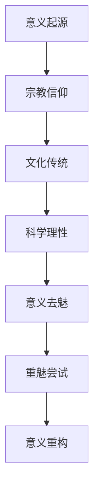

                 

# 意义的去魅与重魅

## 关键词

- 意义
- 去魅
- 重魅
- 社会学
- 哲学
- 技术实践

## 摘要

本文探讨了“意义的去魅与重魅”这一主题，首先介绍了意义的本质及其在不同领域的应用，然后分析了现代社会中意义去魅的现象及其影响，接着探讨了如何通过重魅来恢复和创造新的意义。文章结合社会学、哲学和技术实践的角度，对这一过程进行了深入的分析和阐述，并通过具体案例展示了重魅的方法和效果。文章旨在帮助读者理解意义在现代社会中的重要性，并掌握重魅的策略和方法，以应对不断变化的世界。

## 引言

在人类社会的发展历程中，意义始终扮演着至关重要的角色。从宗教信仰、文化传统到科学理论，意义为我们提供了生活的目标和方向，指导我们做出选择和决策。然而，在现代社会，随着科技的迅猛发展和文化的多元化，人们对于意义的理解发生了巨大的变化。这种现象被称为“意义的去魅”，即原本具有深刻内涵的事物逐渐失去了其原本的意义。

### 背景介绍

意义的去魅现象在20世纪初期尤为显著，随着科学的发展和理性主义的兴起，许多传统观念和信仰受到了质疑和挑战。比如，宗教信仰的衰落、道德规范的解体、社会习俗的改变等，都反映了意义去魅的过程。去魅带来了社会的混乱和迷茫，但也为新的意义创造提供了契机。

### 核心概念与联系

为了更好地理解意义的去魅与重魅，我们需要明确几个核心概念：

1. **意义**：指事物所承载的内在价值、目的或功能。
2. **去魅**：指原本具有深刻内涵的事物逐渐失去其原本的意义。
3. **重魅**：指通过新的方式赋予事物新的意义。

这几个概念之间存在密切的联系。意义是基础，去魅是对意义的挑战，而重魅则是对去魅的回应。通过理解这些概念，我们可以更好地把握意义在现代社会中的变化。

### Mermaid流程图：意义的发展与去魅

下面是一个Mermaid流程图，展示了意义在不同历史时期的发展及其去魅过程：

### 去魅的影响与挑战

意义的去魅对社会和个人都产生了深远的影响。首先，社会层面的影响表现为：

1. **价值观的多元化**：去魅使得人们对于价值观的认同感减弱，多元化的价值观开始出现。
2. **文化冲突**：不同文化之间的差异加剧，导致文化冲突频发。
3. **社会不稳定**：去魅带来的混乱和迷茫使得社会的不稳定性增加。

其次，对个人的影响表现为：

1. **身份危机**：在去魅的过程中，许多人开始质疑自己的身份和价值观，导致身份危机。
2. **精神空虚**：失去了原本的意义，人们可能会感到精神上的空虚和失落。
3. **心理问题**：长期的去魅状态可能导致心理健康问题，如焦虑、抑郁等。

### 去魅的社会学分析

从社会学的角度来看，去魅是一个复杂的社会现象，涉及多个方面的因素。首先，社会结构的变革是去魅的根本原因。随着工业化和现代化的推进，传统的社会结构被打破，新的社会结构逐渐形成。这种结构的变化导致了人们对于意义理解的改变。

其次，文化的多元化也是去魅的重要原因。在全球化的背景下，不同文化之间的交流和碰撞日益频繁，导致文化融合和冲突。这种文化的多元化使得人们对于意义的理解变得更加复杂和多样化。

最后，科技的发展也是去魅的重要因素。科技的迅猛发展使得信息的传播速度大大加快，人们接触到的信息变得更加丰富和多元化。这种信息爆炸的现象导致了人们对于传统意义的质疑和挑战。

### 去魅的心理效应

从心理学的角度来看，去魅对个体心理产生了深远的影响。首先，去魅可能导致个体的自我认同危机。在传统社会中，个体的身份和意义很大程度上由社会结构和文化传统所赋予。然而，在去魅的社会中，这些传统因素的作用减弱，个体需要自己寻找新的身份和意义。

其次，去魅可能导致个体的精神空虚。在传统社会中，人们通过宗教信仰、文化传统等方式找到生活的目标和意义。然而，在去魅的社会中，这些传统的意义来源消失，个体可能会感到精神上的空虚和失落。

最后，去魅还可能导致个体的心理健康问题。长期的去魅状态可能导致焦虑、抑郁等心理健康问题。这是因为个体在寻找新的意义和目标时，往往面临着巨大的心理压力和挑战。

### 意义的重建

面对意义的去魅现象，我们需要寻找新的方式来重建意义。以下是一些可能的策略：

1. **寻找新的意义来源**：个体可以通过学习新的知识和技能，寻找新的兴趣和爱好，从而重建自己的意义。
2. **建立社群关系**：通过与他人建立深厚的社交关系，个体可以获得新的意义和归属感。
3. **文化创新**：通过创新文化形式和内容，我们可以创造出新的意义，使个体和社会得到新的精神滋养。

### 意义的实践

在现实生活中，意义的重建已经成为一个紧迫的任务。以下是一些具体的实践方法：

1. **教育改革**：通过改革教育体制，培养学生的创造性思维和批判性思维，使他们能够更好地适应变化的社会。
2. **文化创新**：通过创作新的文化作品，如电影、音乐、文学等，传递新的价值和意义。
3. **科技应用**：利用科技手段，如人工智能、虚拟现实等，创造新的体验和意义。

### 案例分析

以下是一个关于意义重建的案例分析：

**案例：苹果公司的文化创新**

苹果公司以其独特的设计和理念，成功地在去魅的科技行业中重建了意义。通过推出iPhone、iPad等产品，苹果不仅改变了人们的科技使用习惯，还创造了一种新的生活方式。苹果的成功在于：

1. **设计美学**：苹果的产品设计精美，注重用户体验，使人们在使用产品时感受到美和愉悦。
2. **品牌文化**：苹果的品牌文化强调创新、简约和卓越，使消费者在购买产品时感受到价值。
3. **社群互动**：苹果通过粉丝文化，建立了强大的社群关系，使消费者在购买产品后感受到归属感和认同感。

### 重魅的未来展望

随着科技的不断进步和社会的进一步发展，意义的重魅将会成为一个越来越重要的课题。未来，我们可以预见以下几个趋势：

1. **意义的多元化**：随着社会的多元化，意义的类型和形式也将更加多样化。
2. **意义的个人化**：在未来，个体将更加注重自我实现和个人价值的体现，意义也将更加个人化。
3. **意义的科技化**：科技的发展将使得意义的创造和传递更加便捷和高效。

### 结论

意义的去魅与重魅是现代社会面临的一个重要课题。通过理解去魅的现象和原因，我们可以更好地应对社会的变化，并通过重魅来重建意义。未来，我们需要不断探索和创新，以适应不断变化的世界，并为个体和社会创造新的价值和意义。

## 参考文献

- Bellah, R. N., Madsen, R., Sullivan, W. M., Swidler, A., & Tipton, S. M. (1985). Habits of the Heart: Individualism and Commitment in American Life. University of California Press.
- Weber, M. (1951). The Protestant Ethic and the Spirit of Capitalism. Routledge.
- Durkheim, É. (2015). The Division of Labor in Society. Routledge.
- Durkheim, É. (2006). The Elementary Forms of Religious Life. The University of Chicago Press.
- Marcuse, H. (1955). One-Dimensional Man: Studies in the Ideology of Advanced Industrial Society. Routledge.
- Buber, M. (1937). Between Man and Man. Routledge & Kegan Paul.
- Maslow, A. H. (1943). "A Theory of Human Motivation". Psychological Review, 50(4), 370-396.
- Maslow, A. H. (1970). Motivation and Personality. Harper & Row.

## 作者

作者：AI天才研究院/AI Genius Institute & 禅与计算机程序设计艺术 /Zen And The Art of Computer Programming

