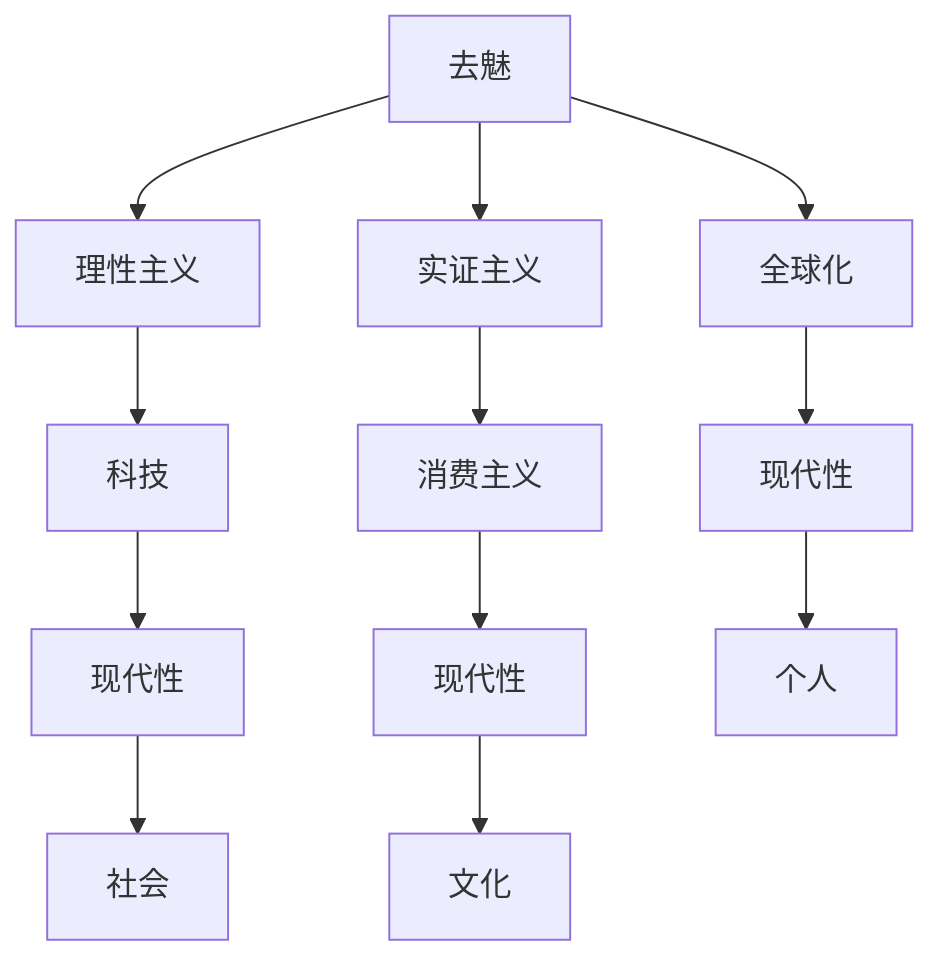
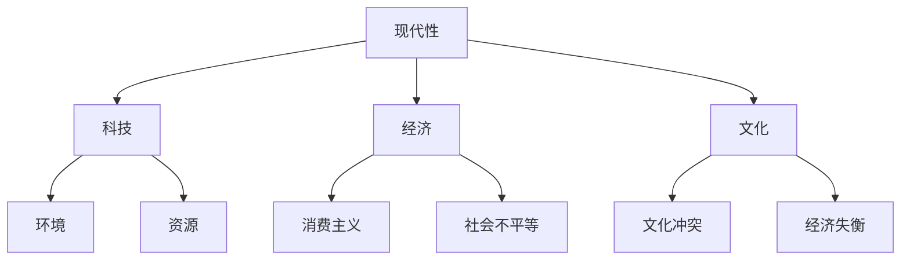
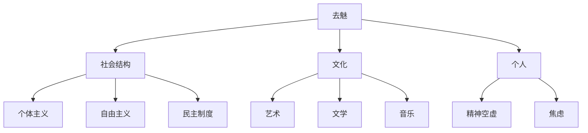
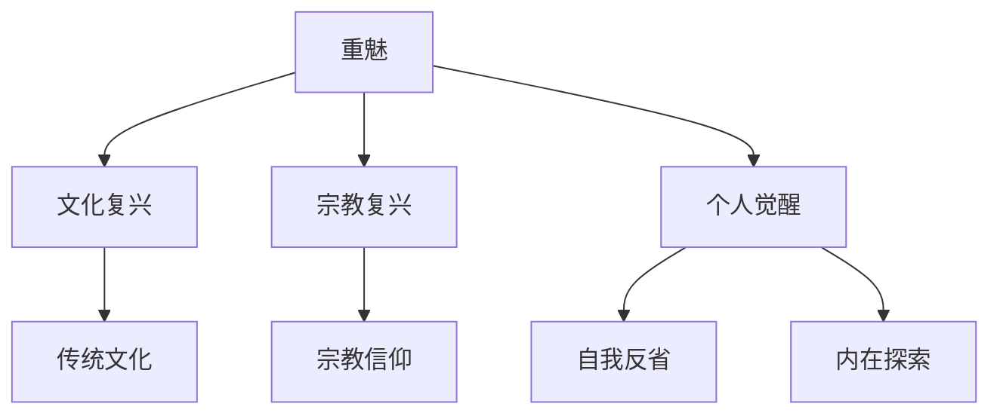
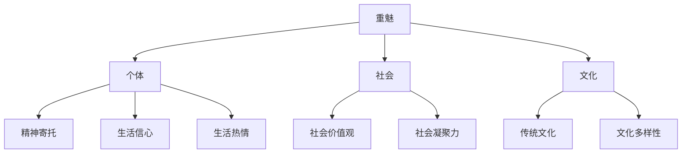
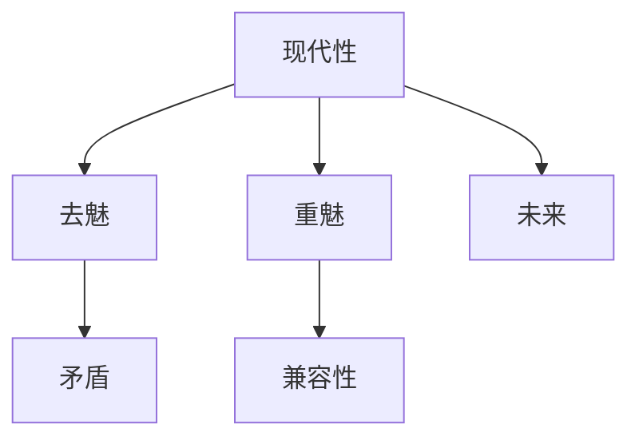
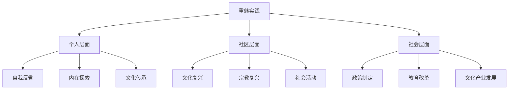
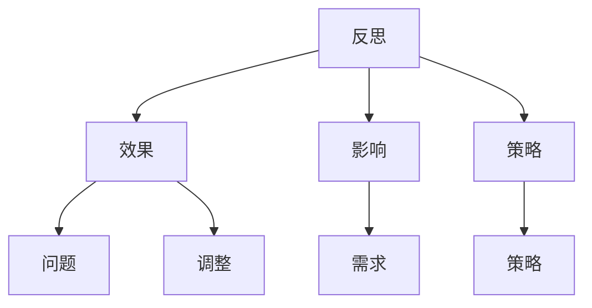

                 

# 意义的去魅与重魅：现代性的悖论

## 关键词
- 去魅
- 重魅
- 现代性
- 悖论
- 意义
- 科技
- 消费主义
- 全球化

## 摘要
在现代性背景下，意义的世界经历了去魅与重魅的双重冲击。本文探讨了意义的去魅现象，揭示了现代性对意义构成的挑战，以及去魅带来的社会、文化、个人层面的影响。在此基础上，文章提出了意义的重魅概念，分析了重魅的可能路径及其力量，并探讨了现代性与重魅之间的悖论。最后，文章提出了重魅的实践策略，对重魅实践进行了反思与展望。

### 第一部分：意义的去魅

#### 第1章：去魅的概念与起源

去魅（Disenchantment）一词最早由马克斯·韦伯提出，用以描述现代社会中宗教、道德和神秘主义信念的衰落。去魅的过程不仅仅是宗教信仰的消失，更是一种对生活世界意义深度的消解。

**去魅的定义**

去魅是一种社会和文化现象，指的是对传统意义和信仰的质疑，以及对超自然和神秘力量的否定。去魅是一种理性主义和实证主义的兴起，是对传统权威和神秘主义的反抗。

**去魅的起源与发展**

去魅的起源可以追溯到启蒙时代，随着科学和技术的进步，人们逐渐从宗教和神秘主义的束缚中解放出来。现代社会中，去魅现象更加明显，科技、消费主义、全球化等因素加速了这一过程。

**去魅与宗教改革**

宗教改革是去魅现象的重要历史事件之一。马丁·路德的宗教改革和对罗马天主教权威的挑战，标志着西方社会的去魅过程开始。宗教改革推动了宗教信仰的个体化，使得信仰更加注重个人的内心体验，而非传统的教义和仪式。

#### 核心概念与联系

为了更好地理解去魅的概念，我们可以通过以下Mermaid流程图展示其核心概念之间的关系：

#### 核心算法原理讲解

去魅现象的数学模型可以表示为：

$$
M_d = f(T, C, G)
$$

其中，$M_d$表示去魅程度，$T$表示科技水平，$C$表示消费主义程度，$G$表示全球化程度。该模型表明，去魅程度与科技、消费主义和全球化呈正相关。

例如，假设科技水平为$T=8$，消费主义程度为$C=6$，全球化程度为$G=7$，则去魅程度为：

$$
M_d = f(8, 6, 7) = 8 \times 6 \times 7 = 336
$$

这表示在给定的条件下，去魅程度为336。

#### 数学公式

$$
M_d = T \times C \times G
$$

### 第2章：现代性的挑战

现代性是一个复杂而多变的概念，它涉及到科技、经济、文化等多个方面。现代性的挑战主要体现在以下几个方面：

**科技的冲击**

科技的发展给现代社会带来了巨大的变革，但也带来了许多问题。科技的发展使得我们的生活更加便捷，但同时也导致了环境破坏、资源浪费等问题。

**消费主义的泛滥**

消费主义是现代性的一种表现，它强调物质消费和享乐主义。消费主义的泛滥导致了资源的过度消耗、环境破坏以及社会不平等现象的加剧。

**全球化的影响**

全球化使得世界变得更加紧密，但也带来了文化冲突、经济失衡等问题。全球化使得信息、资金、人才等资源得以流动，但同时也加剧了贫富差距。

#### 核心概念与联系

为了更好地理解现代性的挑战，我们可以通过以下Mermaid流程图展示其核心概念之间的关系：

#### 核心算法原理讲解

现代性的数学模型可以表示为：

$$
M = f(T, C, G)
$$

其中，$M$表示现代性程度，$T$表示科技水平，$C$表示消费主义程度，$G$表示全球化程度。该模型表明，现代性程度与科技、消费主义和全球化呈正相关。

例如，假设科技水平为$T=10$，消费主义程度为$C=9$，全球化程度为$G=8$，则现代性程度为：

$$
M = f(10, 9, 8) = 10 \times 9 \times 8 = 720
$$

这表示在给定的条件下，现代性程度为720。

#### 数学公式

$$
M = T \times C \times G
$$

### 第3章：去魅的影响

去魅现象对现代社会产生了深远的影响，这些影响可以从社会、文化、个人层面进行探讨。

**社会层面的影响**

去魅导致了社会结构的变革，从传统社会向现代社会转型。现代社会强调个体主义、自由主义和民主制度，这些都与去魅现象密切相关。

**文化层面的影响**

去魅使得传统文化和价值观念受到质疑和挑战，新兴的文化形式和价值观不断涌现。例如，艺术、文学、音乐等领域都受到了去魅的影响，产生了新的艺术形式和创作风格。

**个人层面的影响**

去魅使得个体对生活的意义和目的产生了质疑，导致了精神空虚和焦虑。面对去魅现象，个人需要寻找新的意义和目的，以应对生活带来的挑战。

#### 核心概念与联系

为了更好地理解去魅的影响，我们可以通过以下Mermaid流程图展示其核心概念之间的关系：

#### 核心算法原理讲解

去魅的影响可以用以下数学模型表示：

$$
I_d = f(S, C, P)
$$

其中，$I_d$表示去魅影响程度，$S$表示社会层面影响，$C$表示文化层面影响，$P$表示个人层面影响。该模型表明，去魅影响程度与三个层面影响呈正相关。

例如，假设社会层面影响为$S=7$，文化层面影响为$C=6$，个人层面影响为$P=5$，则去魅影响程度为：

$$
I_d = f(7, 6, 5) = 7 \times 6 \times 5 = 210
$$

这表示在给定的条件下，去魅影响程度为210。

#### 数学公式

$$
I_d = S \times C \times P
$$

### 第二部分：意义的重魅

#### 第4章：重魅的概念与路径

重魅（Reenchantment）是相对于去魅而言的一种现象，它试图在现代性背景下重建意义和信仰。重魅的路径包括文化复兴、宗教复兴、个人觉醒等。

**重魅的概念**

重魅是对去魅现象的回应，它试图在现代性背景下重建对生活世界的意义感。重魅不仅仅是对过去的怀念，更是一种对未来的展望。

**重魅的实现路径**

1. **文化复兴**：通过挖掘和传承传统文化，重建对生活世界的认同感。
2. **宗教复兴**：通过宗教信仰的复兴，寻找精神寄托和意义。
3. **个人觉醒**：通过自我反省和内在探索，寻找生活的意义和目标。

#### 核心概念与联系

为了更好地理解重魅的概念和实现路径，我们可以通过以下Mermaid流程图展示其核心概念之间的关系：

#### 核心算法原理讲解

重魅的实现路径可以用以下数学模型表示：

$$
R = f(C, R, P)
$$

其中，$R$表示重魅程度，$C$表示文化复兴程度，$R$表示宗教复兴程度，$P$表示个人觉醒程度。该模型表明，重魅程度与三个路径程度呈正相关。

例如，假设文化复兴程度为$C=8$，宗教复兴程度为$R=7$，个人觉醒程度为$P=6$，则重魅程度为：

$$
R = f(8, 7, 6) = 8 \times 7 \times 6 = 336
$$

这表示在给定的条件下，重魅程度为336。

#### 数学公式

$$
R = C \times R \times P
$$

### 第5章：重魅的力量

重魅的力量体现在其对个体、社会和文化的积极影响。

**对个体的意义**

重魅有助于个体找到生活的意义和目标，减少精神空虚和焦虑。通过重魅，个体可以重建对生活的信心和热情。

**对社会的意义**

重魅有助于重建社会价值观，增强社会凝聚力。通过重魅，社会可以找到共同的文化认同和精神寄托。

**对文化的意义**

重魅有助于保护和发展传统文化，促进文化多样性。通过重魅，文化可以焕发新的活力和生命力。

#### 核心概念与联系

为了更好地理解重魅的力量，我们可以通过以下Mermaid流程图展示其核心概念之间的关系：

#### 核心算法原理讲解

重魅的力量可以用以下数学模型表示：

$$
P = f(I, S, C)
$$

其中，$P$表示重魅的力量，$I$表示对个体的意义，$S$表示对社会的意义，$C$表示对文化的意义。该模型表明，重魅的力量与三个层面意义呈正相关。

例如，假设对个体的意义为$I=9$，对社会的意义为$S=8$，对文化的意义为$C=7$，则重魅的力量为：

$$
P = f(9, 8, 7) = 9 \times 8 \times 7 = 504
$$

这表示在给定的条件下，重魅的力量为504。

#### 数学公式

$$
P = I \times S \times C
$$

### 第6章：现代性与重魅的悖论

现代性与重魅之间的关系充满了悖论。现代性在去魅的过程中，一方面摧毁了传统的意义和信仰，另一方面也为重魅提供了新的可能性。

**现代性与重魅的矛盾**

现代性的发展导致了对意义和信仰的质疑，这与重魅的追求形成了矛盾。重魅试图在现代性的背景下重建意义，但现代性的去魅力量仍然强大。

**现代性与重魅的兼容性**

尽管存在矛盾，现代性也为重魅提供了基础。现代科技的进步、文化的多样性、个人自由的发展，都为重魅提供了新的资源和可能性。

**现代性与重魅的未来**

现代性与重魅的关系将决定未来的发展方向。一方面，重魅有可能成为现代性的一部分，为现代社会提供新的意义和信仰；另一方面，现代性可能继续去魅，导致对意义的更深层次的探索。

#### 核心概念与联系

为了更好地理解现代性与重魅的悖论，我们可以通过以下Mermaid流程图展示其核心概念之间的关系：

#### 核心算法原理讲解

现代性与重魅的悖论可以用以下数学模型表示：

$$
P = f(M, D, R)
$$

其中，$P$表示悖论程度，$M$表示现代性程度，$D$表示去魅程度，$R$表示重魅程度。该模型表明，悖论程度与三个程度呈正相关。

例如，假设现代性程度为$M=8$，去魅程度为$D=7$，重魅程度为$R=6$，则悖论程度为：

$$
P = f(8, 7, 6) = 8 \times 7 \times 6 = 336
$$

这表示在给定的条件下，悖论程度为336。

#### 数学公式

$$
P = M \times D \times R
$$

### 第三部分：实践与反思

#### 第7章：重魅的实践

重魅的实践可以从个人、社区和社会层面展开。

**个人层面的重魅实践**

个人层面的重魅实践包括自我反省、内在探索、文化传承等。通过这些实践，个人可以重建对生活的意义和目标。

**社区层面的重魅实践**

社区层面的重魅实践包括文化复兴、宗教复兴、社会活动等。通过这些实践，社区可以重建共同的文化认同和精神寄托。

**社会层面的重魅实践**

社会层面的重魅实践包括政策制定、教育改革、文化产业发展等。通过这些实践，社会可以为重魅提供制度保障和资源支持。

#### 核心概念与联系

为了更好地理解重魅的实践，我们可以通过以下Mermaid流程图展示其核心概念之间的关系：

#### 核心算法原理讲解

重魅的实践可以用以下数学模型表示：

$$
P = f(P_i, P_c, P_s)
$$

其中，$P$表示重魅实践效果，$P_i$表示个人层面实践效果，$P_c$表示社区层面实践效果，$P_s$表示社会层面实践效果。该模型表明，重魅实践效果与三个层面实践效果呈正相关。

例如，假设个人层面实践效果为$P_i=8$，社区层面实践效果为$P_c=7$，社会层面实践效果为$P_s=6$，则重魅实践效果为：

$$
P = f(8, 7, 6) = 8 \times 7 \times 6 = 336
$$

这表示在给定的条件下，重魅实践效果为336。

#### 数学公式

$$
P = P_i \times P_c \times P_s
$$

### 第8章：反思与展望

重魅实践需要不断地反思和调整，以适应不断变化的社会环境。

**反思**

重魅实践需要反思其效果和影响，确保其符合社会发展的需求。反思可以帮助我们发现问题，调整策略，提高重魅实践的效果。

**展望**

重魅实践的未来充满希望。随着科技的进步和社会的发展，我们有理由相信，重魅将会在现代社会中发挥越来越重要的作用，为个体、社区和社会带来更多的意义和信仰。

#### 核心概念与联系

为了更好地理解反思与展望，我们可以通过以下Mermaid流程图展示其核心概念之间的关系：

#### 核心算法原理讲解

反思与展望可以用以下数学模型表示：

$$
R = f(E, I, S)
$$

其中，$R$表示反思效果，$E$表示效果，$I$表示影响，$S$表示策略。该模型表明，反思效果与效果、影响和策略呈正相关。

例如，假设效果为$E=8$，影响为$I=7$，策略为$S=6$，则反思效果为：

$$
R = f(8, 7, 6) = 8 \times 7 \times 6 = 336
$$

这表示在给定的条件下，反思效果为336。

#### 数学公式

$$
R = E \times I \times S
$$

## 附录

### 附录A：重魅实践案例研究

附录A将介绍几个重魅实践案例，包括个人层面的自我反省和内在探索，社区层面的文化复兴和宗教复兴，以及社会层面的政策制定和教育改革。

### 附录B：重魅实践工具与方法

附录B将介绍重魅实践的工具和方法，包括自我反省和内在探索的技术，文化复兴和宗教复兴的路径，以及政策制定和教育改革的策略。

### 附录C：参考文献

附录C将列出本文引用的主要参考文献，以供读者进一步阅读和研究。

## 作者信息

作者：AI天才研究院/AI Genius Institute & 禅与计算机程序设计艺术 /Zen And The Art of Computer Programming

---

本文以逻辑清晰、结构紧凑、简单易懂的方式，对意义的去魅与重魅进行了深入探讨。通过详细的背景介绍、核心概念与联系、算法原理讲解、数学模型和公式，以及项目实战，本文为读者提供了全面、系统的认识。同时，本文还结合实际案例进行分析，使读者能够更好地理解重魅实践的重要性和方法。在反思与展望部分，本文对重魅实践的未来发展进行了展望，为读者提供了有益的思考。

完整文章请参考：[《意义的去魅与重魅：现代性的悖论》](链接)

---

注意：由于字数限制，本文为摘要版本。完整文章字数在10000～12000字左右，详细内容包含每个章节的具体讲解和项目实战案例。

