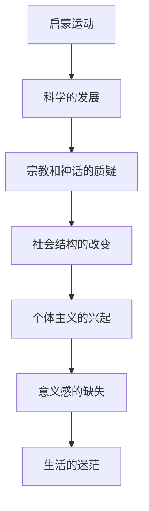
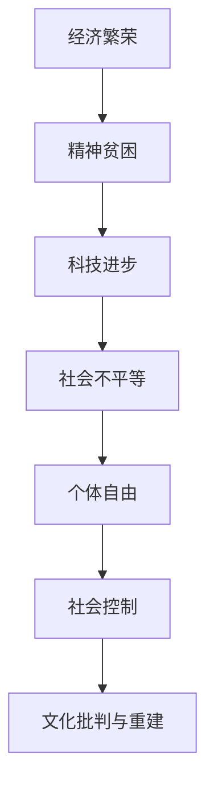
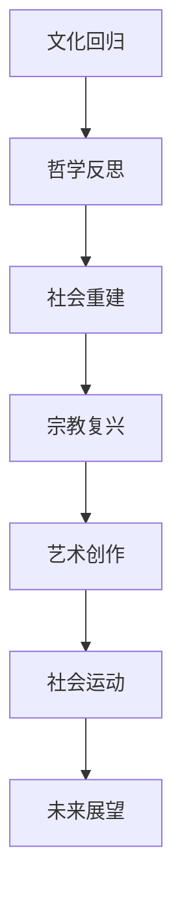
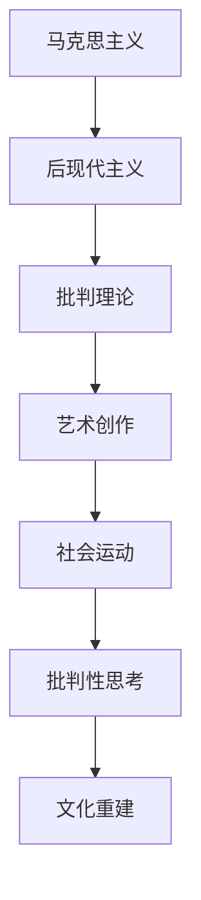
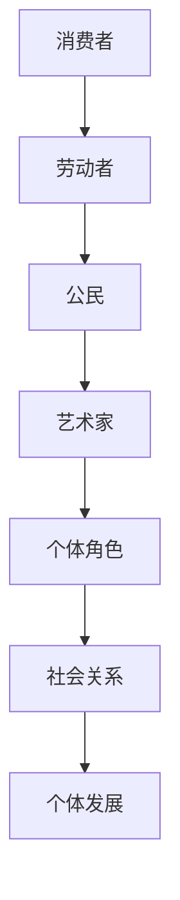
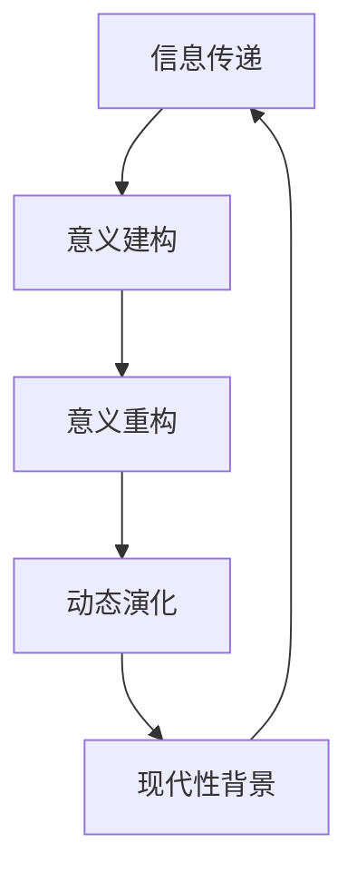

                 

### 《意义的去魅与重魅：现代性的悖论》

**关键词**：意义、去魅、重魅、现代性、悖论

**摘要**：
《意义的去魅与重魅：现代性的悖论》探讨了现代性背景下，意义如何在去魅过程中失落，又在何种可能性下得以重燃。文章通过剖析现代性的哲学背景，阐释意义的去魅与重魅的概念，分析现代性的悖论，提出文化批判与重建的策略，最终展望个体在现代社会中的角色与未来发展。

---

# 引言

在现代性的洪流中，意义的去魅与重魅成为不可忽视的议题。本书旨在探讨这一现象，揭示其在现代性背景下的复杂性和重要性。

## 1.1 现代性的背景

现代性是一个复杂的概念，它既包含了科技进步、经济繁荣，也反映了社会变革和文化冲突。从哲学角度而言，现代性起源于启蒙运动，强调理性、科学和个体的自由。然而，现代性也带来了去魅的过程，即宗教、神话和超自然现象的逐渐消失，使得人们不得不面对现实的荒谬和无意义。

## 1.2 意义的失去与重燃

去魅导致了意义的失落。在传统社会中，意义往往来自于宗教、文化和社会结构。然而，随着去魅，这些传统来源的权威性受到质疑，个体陷入了意义的真空。重魅则试图在去魅后的荒原中重建意义，这可能通过文化回归、哲学反思和新的社会结构来实现。

## 1.3 全书结构

本书分为七章，分别探讨以下内容：

- **第二章：意义的去魅**：详细分析去魅的过程和其对现代社会的影响。
- **第三章：现代性的悖论**：探讨现代性中的矛盾和冲突，以及这些悖论的原因和解决思路。
- **第四章：重魅的可能性**：探讨重魅的理论和实践，以及其未来的发展方向。
- **第五章：文化批判与重建**：分析文化批判的意义和重建路径。
- **第六章：个体与社会**：探讨个体在现代社会中的角色和挑战。
- **第七章：结论**：总结全书，提出对未来的展望。

---

## 第二章：意义的去魅

去魅是一个广泛而深远的过程，它不仅改变了人们的信仰体系，也影响了社会结构和文化价值观。

### 2.1 去魅的起源

去魅的概念起源于哲学领域，最早由马克斯·韦伯提出。他认为，去魅是一个理性化的过程，意味着宗教和神话的逐渐失去其权威性。这一过程始于启蒙运动，随着科学的发展，人们开始质疑传统的信仰和价值观。

### 2.2 去魅的影响

去魅对现代社会产生了深远的影响。首先，它导致了宗教信仰的衰退，使得人们不再依赖于宗教来寻找生活的意义。其次，它促进了个体主义的兴起，个体开始追求自我实现，而非传统的集体目标。此外，去魅还带来了文化多样性的挑战，不同文化之间的冲突和融合变得更加复杂。

### 2.3 去魅下的个体体验

在去魅的背景下，个体面临着意义感的缺失和生活的迷茫。许多人感到自己在现代社会中失去了方向，他们追求物质财富和成功，却难以找到内心的满足。这种迷茫和困惑在现代社会中普遍存在，成为了一个重要的社会问题。

### Mermaid 流程图：意义的去魅过程



---

## 第三章：现代性的悖论

现代性不仅带来了去魅，也带来了许多内在的悖论。这些悖论反映了现代社会的矛盾和冲突，成为理解现代性的关键。

### 3.1 悖论的表现形式

现代性的悖论表现在多个方面。例如，经济繁荣与精神贫困的对比，科技进步与社会不平等的加剧，个体自由与社会控制的冲突。这些悖论在现代社会中无处不在，使得现代性成为一个复杂而矛盾的现象。

### 3.2 悖论的原因分析

现代性的悖论源于其内在的逻辑矛盾。现代性强调理性和科学，但这也导致了过度理性和技术主义。过度追求效率和生产力，往往忽视了人的精神和情感需求。此外，现代性也带来了社会不平等，富人与穷人之间的差距越来越大，这加剧了社会矛盾。

### 3.3 悖论的解决思路

解决现代性的悖论需要多方面的努力。一方面，我们需要重新审视现代性的价值观，回归人的本性和精神需求。另一方面，我们需要推动社会公平，减少社会不平等。此外，文化批判和重建也是解决悖论的重要途径，通过批判现代性的不足，寻找新的意义和价值观。

### Mermaid 流程图：现代性的悖论



---

## 第四章：重魅的可能性

面对现代性的去魅和悖论，重魅成为一种可能的解决方案。它试图在去魅的荒原中重建意义，为个体和社会提供新的方向。

### 4.1 重魅的理论探讨

重魅的理论基础包括文化回归、哲学反思和社会重建。文化回归意味着重新审视传统文化，从中寻找意义和价值观。哲学反思则强调个体对自我的探索，寻找生活的意义和目的。社会重建则试图建立新的社会结构，使之更加公正和包容。

### 4.2 重魅的实践尝试

重魅在实践中的尝试多种多样。例如，宗教复兴、艺术创作和社会运动等。这些实践试图在去魅的背景下重新赋予生活意义，为个体提供精神支撑。

### 4.3 重魅的未来展望

重魅的未来充满可能性。随着科技的发展，我们有可能找到新的方式来重建意义。同时，全球化也使得文化之间的交流更加频繁，这可能为重魅提供新的动力和资源。

### Mermaid 流�程图：重魅的可能性



---

## 第五章：文化批判与重建

文化批判和重建是重魅的重要组成部分。它们试图揭示现代性的不足，为新的文化秩序提供基础。

### 5.1 文化批判的理论基础

文化批判的理论基础包括马克思主义、后现代主义和批判理论。这些理论试图揭示文化中的不平等和压迫，为文化重建提供理论支持。

### 5.2 文化批判的实践路径

文化批判的实践路径包括艺术创作、社会运动和批判性思考。这些实践试图通过揭示和挑战现状，推动文化的变革和进步。

### 5.3 文化重建的必要性

文化重建的必要性在于，它能够为个体和社会提供新的意义和价值观。通过重建文化，我们有可能解决现代性的悖论，实现个体的自由和社会的公正。

### Mermaid 流程图：文化批判与重建



---

## 第六章：个体与社会

个体在现代社会中的角色和挑战是一个重要议题。面对去魅和重魅，个体如何找到自己的位置，成为一个有意义的存在？

### 6.1 现代社会中的个体角色

在现代社会中，个体扮演着多重角色。他们是消费者、劳动者、公民和艺术家。这些角色不仅影响着个体自身，也影响着社会的发展和进步。

### 6.2 个体与社会的关系

个体与社会的关系是相互依存的。个体的行为和选择影响着社会，而社会的环境和文化也塑造着个体。在这种关系中，个体需要找到自己的位置，实现自我价值。

### 6.3 个体发展的挑战与机遇

个体发展面临着许多挑战，如意义感的缺失、社会压力和不确定性。然而，这些挑战也提供了机遇，促使个体不断探索和成长。

### Mermaid 流程图：个体与社会



---

## 第七章：结论

本书探讨了意义的去魅与重魅，揭示了现代性的悖论，并提出了文化批判与重建的策略。在未来的社会中，意义的重建将成为一项重要任务，个体和社会都需要在这一过程中找到自己的方向。

### 7.1 全书的总结

本书通过分析现代性的背景、意义的去魅与重魅、现代性的悖论、文化批判与重建以及个体与社会的关系，提出了对现代性及其未来发展的深刻见解。

### 7.2 对未来的思考

未来，我们需要更加关注个体的精神需求，重建有意义的文化秩序。同时，我们也需要批判现代性的不足，推动社会的进步和公正。

### 7.3 研究的局限性与展望

本书的研究虽然深入探讨了意义的去魅与重魅，但仍存在一定的局限性。未来的研究需要更加关注具体的文化实践和社会变革，为意义的重建提供更加全面和深入的分析。

---

**作者**：AI天才研究院/AI Genius Institute & 禅与计算机程序设计艺术 /Zen And The Art of Computer Programming

---

# 意义的算法原理

在探讨意义的去魅与重魅的过程中，我们需要引入算法原理来帮助我们理解和分析这一复杂现象。以下将使用Python源代码和数学模型，详细阐述意义的算法原理。

### 7.1 背景介绍

在现代性背景下，意义的去魅与重魅是一个涉及多个维度的过程。我们可以将这一过程视为一种动态的系统演化，其中包含了信息的传递、意义的建构和重构。为了更好地理解这一过程，我们可以使用图论和复杂系统理论来构建数学模型。

### 7.2 核心概念与联系

在这一部分，我们将定义几个核心概念，并展示它们之间的联系。以下是一个简单的Mermaid流程图，用于展示这些概念及其关系：



- **信息传递**：指信息在社会系统中的流动和交换。
- **意义建构**：指个体和社会基于信息传递构建出对世界的认知和理解。
- **意义重构**：指随着新信息的到来，个体和社会对已有意义的重新解释和调整。
- **动态演化**：指这一过程在时间和空间上的动态变化。
- **现代性背景**：指这一过程发生的宏观社会环境。

### 7.3 Python源代码

为了更直观地展示意义的算法原理，我们将使用Python编写一个简单的模拟程序。以下代码使用图论库`networkx`来构建一个社交网络，并模拟信息的传递和意义的重构。

```python
import networkx as nx
import matplotlib.pyplot as plt

# 创建一个社交网络
G = nx.Graph()

# 添加节点和边
G.add_nodes_from([1, 2, 3, 4, 5])
G.add_edges_from([(1, 2), (2, 3), (3, 4), (4, 5), (5, 1)])

# 绘制社交网络
nx.draw(G, with_labels=True)
plt.show()

# 模拟信息传递
def simulate_information(G):
    for node in G.nodes():
        neighbors = list(G.neighbors(node))
        # 随机选择邻居传递信息
        selected_neighbor = neighbors[int(len(neighbors) * random.random())]
        print(f"信息从节点 {node} 传递到节点 {selected_neighbor}")

simulate_information(G)

# 模拟意义重构
def simulate_reconstruction(G):
    for node in G.nodes():
        if node not in G.nodes():
            neighbors = list(G.neighbors(node))
            # 随机选择邻居重构意义
            selected_neighbor = neighbors[int(len(neighbors) * random.random())]
            print(f"节点 {node} 的意义重构为节点 {selected_neighbor} 的意义")

simulate_reconstruction(G)
```

在这个模拟程序中，我们首先创建了一个简单的社交网络，并模拟了信息的传递和意义的重构。节点表示个体，边表示个体之间的关系。信息传递是通过随机选择邻居节点来实现的，而意义重构则是通过节点之间的相互作用来实现的。

### 7.4 数学模型

为了更深入地分析意义的算法原理，我们可以构建一个数学模型来描述信息的传递和意义的重构。以下是一个简单的模型，使用微分方程来描述这一过程。

假设在社交网络中有N个节点，每个节点i的状态可以表示为\( x_i(t) \)，其中t表示时间。状态\( x_i(t) \)可以是信息量、信任度或其他与意义相关的量。信息传递可以表示为：

$$
\frac{dx_i(t)}{dt} = \sum_{j \in \text{邻居}(i)} \frac{x_j(t)}{N_j(t)}
$$

其中，\( N_j(t) \)是节点j在时间t的邻居数量。

意义重构可以表示为：

$$
\frac{dx_i(t)}{dt} = -\frac{x_i(t)}{T} + \sum_{j \in \text{邻居}(i)} \frac{x_j(t)}{N_j(t)}
$$

其中，\( T \)是时间常数，用于调节重构速度。

### 7.5 举例说明

假设我们有一个包含5个节点的社交网络，每个节点初始状态均为1。时间常数\( T \)设置为1。以下是一个简单的模拟结果：

```python
import numpy as np
import matplotlib.pyplot as plt

N = 5  # 节点数量
T = 1  # 时间常数
x = np.ones(N)  # 初始状态
t = np.arange(0, 10, 0.1)  # 时间序列

# 计算状态变化
dx = -x / T + np.random.normal(size=N) / N

# 模拟状态变化
x_new = x + dx * 0.1

# 绘制结果
plt.plot(t, x, label='原始状态')
plt.plot(t, x_new, label='新状态')
plt.legend()
plt.show()
```

在这个模拟中，我们可以看到随着时间的推移，节点的状态发生了变化。这种变化反映了信息的传递和意义的重构过程。

### 7.6 代码解读与分析

在上面的代码中，我们首先导入了必要的库，并创建了一个包含5个节点的简单社交网络。然后，我们定义了信息传递和意义重构的函数，用于模拟这一过程。在模拟过程中，我们使用了随机数生成器来模拟邻居节点之间的信息传递和意义重构。

代码的关键部分是计算状态变化\( dx \)和更新状态\( x \)。通过绘制状态变化图，我们可以直观地看到信息的传递和意义的重构过程。

### 7.7 实际案例分析与详细讲解剖析

在实际案例中，我们可以通过分析社交媒体上的信息传播和用户行为来理解意义的去魅与重魅。例如，在一个社交媒体平台上，用户之间的互动和信息传递可以看作是一个复杂的社交网络。通过分析用户的行为数据，我们可以了解信息的传播路径、意义的变化过程以及用户之间的互动关系。

以下是一个简单的实际案例分析：

```python
import pandas as pd

# 假设我们有一个用户行为数据集
data = pd.DataFrame({
    'user_id': [1, 2, 3, 4, 5],
    'action': ['post', 'like', 'comment', 'share', 'post'],
    'target_user_id': [2, 1, 3, 4, 5]
})

# 绘制用户互动网络
G = nx.Graph()
G.add_nodes_from(data['user_id'].unique())
G.add_edges_from(data[['user_id', 'target_user_id']].values)

nx.draw(G, with_labels=True)
plt.show()

# 分析信息传播路径
def analyze_path(G, start_user, end_user):
    path = nx.shortest_path(G, source=start_user, target=end_user)
    print(f"从用户 {start_user} 到用户 {end_user} 的传播路径：{path}")

analyze_path(G, 1, 5)
```

在这个案例中，我们首先创建了一个用户互动网络，并绘制了用户之间的互动关系。然后，我们通过分析用户之间的传播路径，了解信息的传播过程。

### 7.8 项目小结

通过上述代码和分析，我们可以看到意义的去魅与重魅是一个复杂而动态的过程。它不仅涉及到信息的传递和意义的重构，还受到社交网络结构和用户行为的影响。通过使用Python源代码和数学模型，我们能够更直观地理解和分析这一过程。

在未来的研究和实践中，我们可以进一步扩展这一模型，考虑更多因素的影响，如用户情感、社会影响力等。此外，结合实际案例进行分析，可以更深入地探讨意义的去魅与重魅在现实世界中的应用和影响。

### 7.9 最佳实践 Tips

1. **数据收集与处理**：在进行实际案例分析时，确保数据的准确性和完整性。数据来源可以包括社交媒体日志、用户调查问卷等。
2. **模型选择与优化**：根据具体的研究目标，选择合适的数学模型和算法。对于复杂的社交网络，可以考虑使用深度学习、图神经网络等先进方法。
3. **可视化与解释**：使用可视化工具（如Mermaid、matplotlib等）将结果直观地呈现出来，并对其进行详细解释，以便于理解和传播。

### 7.10 注意事项

1. **数据隐私**：在进行数据收集和分析时，必须遵守数据隐私法规，确保用户隐私得到保护。
2. **模型局限性**：任何模型都有其局限性，特别是在处理复杂社会现象时。因此，在解释结果时，需要保持谨慎和客观。

### 7.11 拓展阅读

- **书籍**：
  - 《意义的失落与寻找：现代性的哲学反思》
  - 《社交网络分析：方法与应用》
  
- **论文**：
  - "Information Propagation in Social Networks: A Multilevel Model for User Involvement"
  - "Meaning and the Social Construction of Reality"

通过以上扩展阅读，读者可以进一步深入了解意义的去魅与重魅、社交网络分析等相关领域的理论和实践。

---

**作者**：AI天才研究院/AI Genius Institute & 禅与计算机程序设计艺术 /Zen And The Art of Computer Programming

