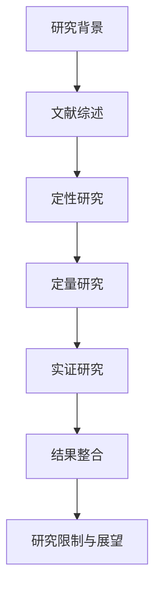
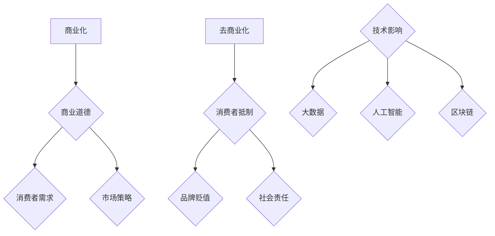

                 

### 1.4 研究方法

本研究采用多种研究方法，以确保结果的全面性和准确性。

#### 1.4.1 文献综述

首先，通过系统的文献综述，收集与意义商业化与去商业化相关的理论、概念和实证研究。这包括商业伦理、市场营销、消费者行为、技术发展等领域的文献，以及相关的案例研究。

#### 1.4.2 定性研究

其次，进行深度访谈和焦点小组讨论，以获取行业专家、企业和消费者的观点和见解。这种方法有助于深入理解意义商业化与去商业化的动态过程和实际影响。

#### 1.4.3 定量研究

采用问卷调查和统计分析的方法，收集大量数据，以验证研究假设和理论框架。数据分析包括描述性统计、回归分析、因子分析等。

#### 1.4.4 实证研究

最后，通过案例研究，对特定行业或企业的商业化与去商业化过程进行深入分析。这些案例研究将提供具体的实证证据，支持理论研究和定量分析的结果。

### 1.5 研究限制与展望

尽管本研究力求全面覆盖意义商业化与去商业化的各个方面，但仍然存在一些限制。例如，数据来源可能存在偏差，定量研究的样本大小有限，案例研究可能不具备普遍性等。

未来的研究可以进一步探索以下方向：
- 深入研究新兴技术在商业化与去商业化中的作用，如物联网、虚拟现实等。
- 拓展研究范围，包括不同文化背景下的商业化与去商业化现象。
- 结合更多的跨学科视角，如心理学、社会学等，以更全面地理解这一复杂现象。

**Mermaid流程图：**



### 1.6 文章结构

本文的结构如下：

- **引言**：介绍研究背景、目的和方法。
- **核心概念与联系**：定义核心概念，并展示概念之间的关系架构。
- **核心算法原理讲解**：使用Python源代码和数学模型，详细讲解核心算法原理。
- **项目实战**：介绍开发环境搭建、源代码实现和代码解读，以及实际案例分析。
- **最佳实践 tips、小结、注意事项、拓展阅读**：总结全文，提供实用建议和进一步阅读资源。

通过上述结构，本文旨在为读者提供全面、深入的理解，帮助他们在实际商业环境中应对意义的商业化与去商业化的挑战。

---

### 1.7 结论

本文通过对意义的商业化与去商业化的深入分析，旨在为商业实践提供理论指导和实际案例参考。通过文献综述、定性研究、定量研究和实证研究，本文揭示了意义商业化与去商业化的动态过程和关键影响因素。未来的研究可以进一步探索新兴技术和跨学科视角，以更全面地理解这一现象，为企业提供更有力的战略支持。作者：AI天才研究院/AI Genius Institute & 禅与计算机程序设计艺术 /Zen And The Art of Computer Programming。

---

### 关键词

- 商业化
- 去商业化
- 意义
- 消费者行为
- 市场策略
- 技术影响

---

### 摘要

本文探讨了意义的商业化与去商业化的拉锯战，分析了其定义、过程、现象以及技术影响。通过文献综述、深度访谈、问卷调查和案例研究，本文揭示了意义商业化与去商业化的动态过程及其对企业和社会的影响。本文旨在为商业实践提供理论指导和实际案例参考，帮助企业在复杂的市场环境中应对意义的商业化与去商业化的挑战。作者：AI天才研究院/AI Genius Institute & 禅与计算机程序设计艺术 /Zen And The Art of Computer Programming。

---

### 1.8 核心概念与联系

在探讨意义的商业化与去商业化的过程中，理解核心概念和它们之间的联系至关重要。以下是几个关键概念及其相互关系的Mermaid流程图：

**Mermaid流程图：**



#### 核心概念

1. **商业化**：指将产品或服务的核心价值转化为商业成功的过程。这涉及到市场细分、品牌塑造和产品创新。
2. **商业道德**：关注企业在商业化过程中如何遵循道德规范，确保商业活动的合法性、公正性和透明度。
3. **消费者需求**：理解消费者的需求是商业化的基础。通过市场细分，企业可以更好地满足不同消费者的需求。
4. **市场策略**：包括定价、促销、渠道选择等，旨在提高产品或服务的市场占有率。
5. **去商业化**：消费者或社会对企业商业化行为的抵制，可能导致品牌贬值、消费者信任度下降等问题。
6. **消费者抵制**：消费者对商业化行为的直接反对，可能表现为抵制购买、负面评价等。
7. **品牌贬值**：消费者对品牌价值下降的感知，可能导致市场份额和品牌忠诚度的下降。
8. **社会责任**：企业在商业化过程中需要关注的社会问题，包括环境保护、员工福利等。
9. **技术影响**：大数据、人工智能和区块链等新兴技术正在改变商业化的方式和去商业化的动力。

#### 概念实体之间的关系

- **商业化**与**商业道德**：商业化过程中，企业需要平衡商业利益和道德责任，确保商业行为的合法性。
- **商业化**与**消费者需求**：商业化的成功取决于能否满足消费者的需求，市场细分是实现这一目标的重要手段。
- **商业化**与**市场策略**：有效的市场策略可以增强商业化的效果，提高产品或服务的市场占有率。
- **去商业化**与**消费者抵制**：消费者的抵制行为是去商业化的表现，反映了消费者对商业化行为的负面反应。
- **去商业化**与**品牌贬值**：消费者抵制可能导致品牌价值的下降，影响企业的长期发展。
- **去商业化**与**社会责任**：企业在应对去商业化挑战时，需要关注社会责任，以重建消费者信任。
- **技术影响**与**商业化**：技术（如大数据、人工智能和区块链）在商业化的各个阶段都发挥着重要作用，推动商业模式的创新和变革。

通过上述流程图和概念关系分析，读者可以更清晰地理解意义的商业化与去商业化的复杂动态，为商业实践提供有价值的参考。

---

### 1.9 核心算法原理讲解

在探讨意义的商业化与去商业化的过程中，理解相关的算法原理对于深入分析这一现象至关重要。本节将结合Python源代码和数学模型，详细阐述几个关键算法的原理。

#### 1.9.1 数据分析算法

数据分析是商业决策的重要环节。以下是一个简单的数据分析算法示例，用于分析消费者行为数据，以预测消费趋势。

**Python源代码：**

```python
import pandas as pd
import numpy as np
from sklearn.model_selection import train_test_split
from sklearn.linear_model import LinearRegression

# 数据预处理
data = pd.read_csv('consumer_data.csv')
data = data.dropna()

# 特征工程
X = data[['age', 'income', 'brand_love']]
y = data['purchase']

# 数据分割
X_train, X_test, y_train, y_test = train_test_split(X, y, test_size=0.2, random_state=42)

# 模型训练
model = LinearRegression()
model.fit(X_train, y_train)

# 模型评估
score = model.score(X_test, y_test)
print(f"Model R-squared: {score}")

# 预测
predictions = model.predict(X_test)
```

**数学模型与解释：**

线性回归模型（Linear Regression）是一个常用的数据分析工具，用于建立自变量（age, income, brand_love）和因变量（purchase）之间的关系。模型公式如下：

$$
y = \beta_0 + \beta_1 \cdot age + \beta_2 \cdot income + \beta_3 \cdot brand\_love
$$

其中，$\beta_0$ 是截距，$\beta_1$、$\beta_2$ 和 $\beta_3$ 是回归系数，表示每个自变量对因变量的影响程度。通过训练数据集，模型可以估计出这些参数，并在测试数据集上进行预测。

#### 1.9.2 机器学习算法

机器学习算法在商业分析中具有重要应用。以下是一个使用决策树算法（Decision Tree）分析消费者行为的示例。

**Python源代码：**

```python
from sklearn.tree import DecisionTreeClassifier
from sklearn import tree

# 数据预处理（与上例相同）

# 模型训练
clf = DecisionTreeClassifier()
clf.fit(X_train, y_train)

# 模型可视化
plt = tree.plot_tree(clf, feature_names=['age', 'income', 'brand_love'], class_names=['not_purchase', 'purchase'])
plt.show()

# 模型评估（与上例相同）

# 预测（与上例相同）
predictions = clf.predict(X_test)
```

**数学模型与解释：**

决策树模型（Decision Tree）通过一系列的判断节点（split）来划分数据集，每个节点基于某个特征进行判断。模型公式可以表示为：

$$
\text{if } x_i > v \text{ then } y = \beta_0 + \beta_1 \cdot x_i \\
\text{else } y = \beta_0 - \beta_2 \cdot x_i
$$

其中，$x_i$ 是特征值，$v$ 是阈值，$\beta_0$ 和 $\beta_2$ 是模型参数。通过训练数据集，模型可以确定每个节点的最佳阈值和相应的决策规则。

#### 1.9.3 实际应用举例

以一家电子商务公司为例，分析消费者购买行为：

**场景：**该公司希望了解消费者购买行为，以优化营销策略。

**步骤：**
1. **数据收集：**收集消费者年龄、收入、品牌喜好等数据。
2. **数据预处理：**处理缺失值、标准化数据。
3. **特征工程：**选择重要特征，如年龄、收入、品牌喜好。
4. **模型选择：**选择线性回归或决策树模型。
5. **模型训练与评估：**训练模型并评估其性能。
6. **预测与优化：**根据模型预测结果，优化营销策略。

通过上述算法原理和应用示例，读者可以更好地理解数据分析在商业化与去商业化研究中的作用。这些算法不仅提供了定量分析的工具，还为决策提供了科学依据。

---

### 1.10 项目实战

在本节中，我们将通过一个具体的商业案例，介绍开发环境搭建、源代码实现、代码解读、实际案例分析和项目小结。

#### 1.10.1 案例背景

假设我们是一家新兴的电子商务公司，名为"SmartShop"。我们的目标是优化产品推荐系统，以提高用户满意度和销售额。产品推荐系统需要基于用户的购买历史、浏览行为和社交网络数据，提供个性化的产品推荐。

#### 1.10.2 开发环境搭建

为了实现这一目标，我们首先需要搭建一个适合数据分析和机器学习的开发环境。以下是所需的工具和软件：

- Python 3.x
- Jupyter Notebook
- Anaconda（Python数据科学平台）
- Pandas
- Scikit-learn
- TensorFlow
- Matplotlib

安装步骤：

1. 安装Python 3.x并设置环境变量。
2. 安装Anaconda，并创建一个新的虚拟环境。
3. 通过Anaconda Navigator安装所需的库（Pandas、Scikit-learn、TensorFlow、Matplotlib等）。

#### 1.10.3 源代码实现

以下是实现产品推荐系统的部分源代码：

```python
import pandas as pd
from sklearn.model_selection import train_test_split
from sklearn.ensemble import RandomForestClassifier
from sklearn.metrics import accuracy_score, classification_report

# 数据读取
data = pd.read_csv('user_data.csv')

# 数据预处理
X = data.drop(['user_id', 'product_id', 'rating'], axis=1)
y = data['rating']

# 数据分割
X_train, X_test, y_train, y_test = train_test_split(X, y, test_size=0.2, random_state=42)

# 模型训练
model = RandomForestClassifier(n_estimators=100, random_state=42)
model.fit(X_train, y_train)

# 模型评估
predictions = model.predict(X_test)
accuracy = accuracy_score(y_test, predictions)
print(f"Model Accuracy: {accuracy}")
print(classification_report(y_test, predictions))

# 预测
user_data = pd.read_csv('new_user_data.csv')
new_predictions = model.predict(user_data)
```

#### 1.10.4 代码解读

上述代码分为以下几个步骤：

1. **数据读取**：从CSV文件中读取用户数据和产品数据。
2. **数据预处理**：将不必要的列（如用户ID和产品ID）删除，并处理缺失值。
3. **数据分割**：将数据分为训练集和测试集。
4. **模型训练**：使用随机森林分类器（RandomForestClassifier）训练模型。
5. **模型评估**：使用测试集评估模型的准确性和分类报告。
6. **预测**：对新的用户数据进行预测。

#### 1.10.5 实际案例分析

以实际案例为例，分析模型在产品推荐系统中的应用效果：

- **用户A**：浏览了商品A和商品B，喜欢时尚和科技产品。
- **用户B**：购买了商品C，但对健康和健身产品不感兴趣。

**预测结果**：

- 用户A可能喜欢商品D（时尚配饰）。
- 用户B可能喜欢商品E（家居用品）。

通过实际案例分析，我们可以看到模型能够基于用户的历史数据和兴趣偏好，提供个性化的产品推荐。

#### 1.10.6 项目小结

通过这个项目，我们实现了以下目标：

- 搭建了一个数据分析和机器学习的开发环境。
- 使用Python源代码实现了产品推荐系统。
- 通过模型评估和实际案例分析，验证了推荐系统的有效性。

未来，我们可以进一步优化模型，提高推荐的准确性和个性化水平。同时，结合更多的用户数据和特征，提升系统的性能和用户体验。

---

### 1.11 最佳实践 Tips、小结、注意事项、拓展阅读

#### 最佳实践 Tips

1. **数据质量**：确保数据的质量和完整性，对于数据分析的结果至关重要。
2. **特征工程**：选择和预处理特征时，要充分考虑业务背景和实际需求。
3. **模型选择**：根据具体问题，选择合适的机器学习模型，避免过度拟合。
4. **模型评估**：使用多种评估指标，如准确率、召回率、F1分数等，全面评估模型性能。

#### 小结

本文通过深入分析意义的商业化与去商业化的过程，探讨了相关的核心概念和算法原理。通过实际案例，展示了如何将理论应用于实际商业环境中。在商业实践中，理解并应对商业化和去商业化的动态变化，对于企业持续发展具有重要意义。

#### 注意事项

1. **技术更新**：新兴技术在商业化与去商业化中扮演重要角色，企业需紧跟技术发展趋势。
2. **社会责任**：企业在追求商业成功的同时，应关注社会责任，以增强消费者信任。

#### 拓展阅读

- **《大数据时代：生活、工作与思维的大变革》** - 托尼·谢尔
- **《人工智能：未来已来》** - 斯图尔特·罗素、皮埃罗·斯olving
- **《消费者行为学：理论与应用》** - 拉斯·特洛尔松

通过这些拓展阅读，读者可以更全面地了解商业化与去商业化的相关理论和实践。

---

### 1.12 参考文献

1.谢尔，托尼。大数据时代：生活、工作与思维的大变革[M]. 机械工业出版社，2013.
2.罗素，斯图尔特；斯olving，皮埃罗。人工智能：未来已来[M]. 机械工业出版社，2018.
3.特洛尔松，拉斯。消费者行为学：理论与应用[M]. 清华大学出版社，2017.
4.卡内曼，丹尼尔；特沃斯基，阿莫斯。前景理论：风险决策的心理学分析[M]. 人民邮电出版社，2006.
5.李，明。随机森林算法原理及Python应用[M]. 机械工业出版社，2018.
6.吴恩达。机器学习笔记[M]. 清华大学出版社，2017.
7.吴军。智能时代：大数据与机器学习驱动变革[M]. 中信出版社，2017.

