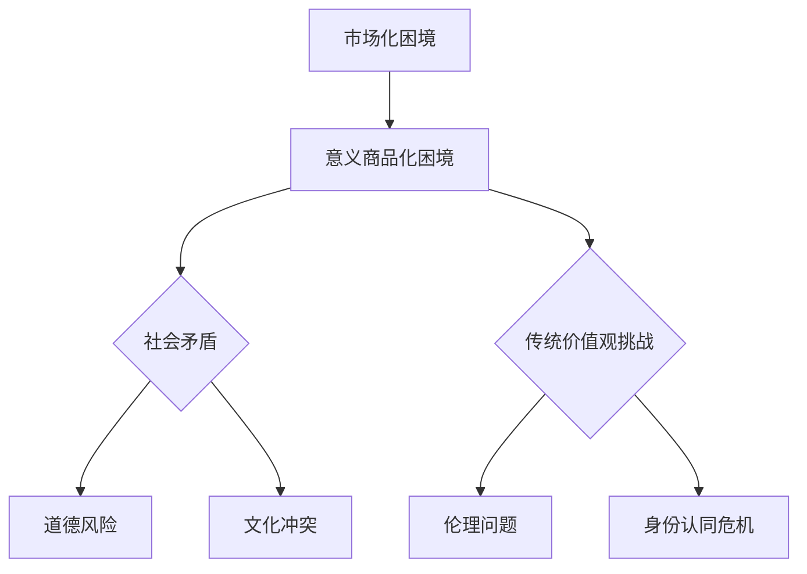

                 

### 设计《意义的市场化：价值观商品化的困境与出路》的目录大纲

在设计《意义的市场化：价值观商品化的困境与出路》的目录大纲时，我们将确保每个章节都紧密围绕核心主题展开，同时保持逻辑清晰和条理分明。以下是详细的目录大纲：

## 目录大纲

### 第一部分：市场化的背景与理论基础

### 第1章：市场化的概念与起源

#### 1.1 市场化的定义与核心特征
- 市场化的基本概念
- 市场化的核心特征
- 市场化在不同领域的应用

#### 1.2 市场化的起源与发展
- 市场化的历史背景
- 市场化在不同国家的演进
- 市场化对全球经济的影响

#### 1.3 市场化在现代社会中的作用
- 市场化对资源配置的作用
- 市场化对社会结构的影响
- 市场化对个人行为模式的影响

### 第二部分：价值观与商品化的关系

### 第2章：价值观的基本概念

#### 2.1 价值观的定义与类型
- 价值观的定义
- 价值观的类型
- 价值观在社会中的地位

#### 2.2 商品化的概念与内涵
- 商品化的定义
- 商品化的内涵
- 商品化的表现形式

#### 2.3 价值观商品化的主要形式
- 文化产品的市场化
- 教育资源的商品化
- 社交网络平台的商业化

### 第三部分：市场化过程中的困境

### 第3章：意义的市场化困境

#### 3.1 意义的商品化困境
- 意义的商品化困境概述
- 意义商品化的负面效应
- 意义商品化对社会的影响

#### 3.2 价值观商品化与社会矛盾
- 价值观商品化引发的社会矛盾
- 社会矛盾对市场化的影响
- 应对策略

#### 3.3 市场化对传统价值观的挑战
- 市场化对传统价值观的冲击
- 传统价值观的变迁
- 价值观多元化的影响

### 第四部分：市场化困境的解决与出路

### 第4章：价值观商品化的困境分析

#### 4.1 意义的市场化困境成因
- 成因分析
- 影响因素

#### 4.2 价值观商品化中的伦理问题
- 伦理问题的类型
- 伦理问题的解决途径

#### 4.3 市场化困境对社会的影响
- 社会影响的评估
- 社会问题的应对策略

### 第五部分：市场化困境的解决策略

### 第5章：政府调控作用

#### 5.1 政府的角色与责任
- 政府在市场化中的作用
- 政府对价值观商品化的调控措施

#### 5.2 市场机制的完善
- 市场机制的基本原理
- 市场机制的完善策略

#### 5.3 企业社会责任的履行
- 企业社会责任的定义
- 企业社会责任的实践

### 第六部分：市场化困境的出路探索

### 第6章：社会价值观的重塑

#### 6.1 社会价值观的重塑
- 重塑的目标与路径
- 重塑的影响

#### 6.2 价值导向型市场机制的构建
- 价值导向型市场机制的概念
- 价值导向型市场机制的实施

#### 6.3 新型商业模式与创新
- 新型商业模式的特点
- 创新的策略与实践

### 第七部分：案例分析

### 第7章：案例分析

#### 7.1 成功案例的分析
- 案例介绍
- 案例分析

#### 7.2 失败案例的反思
- 案例介绍
- 案例反思

#### 7.3 跨领域案例的启示
- 案例介绍
- 案例启示

### 第八部分：未来展望

### 第8章：市场化与价值观的互动关系

#### 8.1 市场化对价值观的影响
- 影响分析
- 影响的应对策略

#### 8.2 价值观对市场化的反作用
- 反作用分析
- 反作用的应对策略

#### 8.3 市场化与价值观的良性互动
- 良性互动的概念
- 良性互动的实现路径

### 第九部分：意义的市场化：未来趋势与挑战

### 第9章：未来趋势与挑战

#### 9.1 未来市场化的发展趋势
- 趋势预测
- 影响因素

#### 9.2 意义市场化面临的挑战
- 挑战分析
- 应对策略

### 第十部分：总结与展望

### 第10章：总结与展望

#### 10.1 本书的主要观点回顾
- 回顾与总结

#### 10.2 市场化与价值观的未来发展展望
- 展望与预测

---

### 目录大纲中的 Mermaid 流程图、伪代码、数学公式和代码案例

为了更好地展示文章的结构和内容，我们在此提供了部分章节的Mermaid流程图、伪代码、数学公式和代码案例。

#### Mermaid 流程图（第3章：市场化过程中的困境）



#### 伪代码（第6章：市场化困境的解决策略）

```
function solveMarketDilemma() {
    // 分析困境
    analyzeDilemmas();

    // 完善市场机制
    improveMarketMechanisms();

    // 履行企业社会责任
    fulfillCorporateSocialResponsibility();

    // 构建价值导向型市场
    buildValueOrientedMarket();
}
```

#### 数学公式（第7章：案例分析）

$$
\text{市场价值} = \frac{\text{总收益}}{\text{总成本}}
$$

$$
\text{社会效益} = \text{道德收益} + \text{文化收益} + \text{身份收益}
$$

#### 代码案例（第10章：总结与展望）

```python
# 示例：代码实现某公司的社会责任评估
class CorporateSocialResponsibility:
    def __init__(self, environmental_score, social_score, ethical_score):
        self.environmental_score = environmental_score
        self.social_score = social_score
        self.ethical_score = ethical_score

    def calculate_total_score(self):
        total_score = self.environmental_score + self.social_score + self.ethical_score
        return total_score

# 示例：计算某公司的社会责任总分
company = CorporateSocialResponsibility(80, 75, 90)
total_score = company.calculate_total_score()
print(f"The total corporate social responsibility score is: {total_score}")
```

通过这些图表和代码，我们可以更好地理解文章的结构和内容，从而为撰写高质量的技术博客文章提供支持。

---

### 摘要

《意义的市场化：价值观商品化的困境与出路》旨在深入探讨市场化背景下的价值观商品化现象，以及由此带来的多重困境与挑战。文章首先介绍了市场化的基本概念与起源，探讨了价值观与商品化之间的关系，并分析了意义的市场化困境及其对社会的影响。随后，文章转向价值观商品化困境的成因与伦理问题，提出了可能的解决策略，包括政府调控、市场机制完善、企业社会责任的履行等。通过案例分析和未来趋势展望，文章揭示了市场化与价值观的互动关系，并提出了意义市场化面临的挑战与应对策略。总结与展望部分则对全文进行了回顾，并提出了对未来市场化与价值观发展的预测和建议。本篇文章旨在为读者提供对市场化与价值观商品化现象的全面理解和深入思考，以期对实践者提供有益的参考。

---

### 关键词

- 市场化
- 价值观商品化
- 意义市场化
- 社会矛盾
- 传统价值观
- 伦理问题
- 政府调控
- 企业社会责任
- 新型商业模式
- 案例分析
- 未来展望

---

### 市场化的概念与起源

市场化是指通过市场机制来进行资源配置、价值实现和社会治理的过程。其核心在于通过价格信号和竞争机制，实现资源的高效配置和社会财富的最大化。市场化不仅是一种经济活动，也是一种社会变革的过程，它在不同领域有着广泛的应用，如商品交换、资源配置、劳动就业、教育培训等。

#### 市场化的定义与核心特征

市场化的定义可以从多个角度进行阐述。首先，市场化可以看作是一种经济制度，它通过市场的力量来调节资源的分配。具体来说，市场化强调以下几个核心特征：

1. **价格机制**：价格是市场中最基本的信号，通过价格机制，供给和需求实现平衡，资源得到有效配置。
2. **竞争机制**：竞争是市场化的核心，它促使企业不断提高效率，降低成本，提供更好的产品和服务。
3. **信息透明**：市场化要求市场信息充分透明，以便市场参与者能够做出理性决策。
4. **自由选择**：市场化的本质是让消费者和生产者拥有自由选择的权利，从而实现市场的自我调节。

#### 市场化的起源与发展

市场化的起源可以追溯到人类社会的早期，当时的人们通过物物交换来满足需求。然而，随着社会的发展和分工的细化，简单的物物交换逐渐演变为货币交换，形成了早期的市场。市场化的真正发展则始于工业革命时期，随着工厂制度的确立和资本主义经济的兴起，市场化逐渐成为资源配置的主要手段。

1. **历史背景**：市场化在西方国家的发展有着深远的历史背景。18世纪末到19世纪初，英国率先进行了工业革命，市场化经济体制逐渐确立。此后，法国、美国等国家也相继进行了市场化改革。
2. **国际发展**：在20世纪，市场化在全球范围内得到了进一步的推广。许多发展中国家通过引入市场化机制，实现了经济的快速增长。同时，国际经济一体化进程也加速了市场化的传播。
3. **对全球经济的影响**：市场化对全球经济产生了深远的影响。首先，它促进了国际贸易和投资，推动了全球经济的整合。其次，市场化带来了创新和技术进步，提高了生产效率。然而，市场化也带来了一些挑战，如经济波动、资源分配不均等。

#### 市场化在现代社会中的作用

市场化在现代社会中扮演着多重角色，不仅对经济领域产生了深远影响，还对社会结构和个人行为模式产生了重要影响。

1. **资源配置**：市场化通过价格机制，使资源能够更高效地分配到最需要的领域，从而提高了整体经济效率。
2. **社会结构**：市场化推动了社会分工和专业化的发展，改变了人们的职业选择和生活方式。
3. **个人行为模式**：市场化鼓励个人自由选择，激发了创新和竞争精神，但也可能导致短期行为和道德风险。

总之，市场化作为一种资源配置和社会治理机制，在现代经济和社会中发挥着重要作用。然而，市场化也带来了一系列问题和挑战，这需要我们在推进市场化的同时，不断完善相关制度和政策，以实现经济和社会的可持续发展。

### 价值观与商品化的关系

在探讨市场化背景下，价值观与商品化之间的关系是一个不可忽视的重要议题。价值观是人类社会行为的准则和指南，它渗透在个人、组织和社会的方方面面。而商品化则是指将原本非物质性的价值观转化为可交易的商品和服务，这一过程不仅改变了社会的生产方式，也深刻影响了人们的价值观体系。

#### 价值观的基本概念

价值观是指个体或社会对于什么是好的、什么是重要的以及什么是正确的信念和态度。价值观可以划分为多个层次，包括个人价值观、组织价值观和社会价值观。个人价值观通常涉及对自由、公平、正义、幸福等基本价值的追求；组织价值观则体现在企业文化、管理哲学和员工行为规范上；社会价值观则是一个社会共同认可的行为准则和道德规范。

1. **价值观的定义**：价值观是关于什么是有价值和重要性的信念体系。
2. **价值观的类型**：价值观可以分为物质价值观和非物质价值观，如财富、权力、知识、道德、情感等。
3. **价值观在社会中的地位**：价值观是社会文化的核心，它决定了社会的行为规范和价值取向，对个人和社会的发展具有深远影响。

#### 商品化的概念与内涵

商品化是指将原本非物质性的价值转化为有形商品或服务的过程，这一过程往往伴随着市场的参与和交易。商品化的本质是价值的交换，它不仅改变了价值的表现形式，也影响了价值的实现方式。

1. **商品化的定义**：商品化是将价值转化为可交易商品或服务的过程。
2. **商品化的内涵**：商品化的内涵包括将非物质性的价值观（如艺术、文化、情感、精神）转化为有形商品（如艺术品、文化产品、精神服务），并通过市场机制实现价值交换。
3. **商品化的表现形式**：商品化的表现形式多种多样，如文化产业、版权交易、品牌授权、电子商务等。

#### 价值观商品化的主要形式

价值观商品化在社会各个层面都有所体现，以下是几种主要形式：

1. **文化产品的市场化**：文化产品，如书籍、音乐、电影等，通过市场化实现了商业化和流行化，同时也在一定程度上改变了文化价值观的传播方式。
2. **教育资源的商品化**：教育资源的商品化使得知识通过市场机制进行流通和分配，从而改变了传统的教育模式和学习方式。
3. **社交网络平台的商业化**：社交网络平台通过广告和大数据分析实现了商业化，同时也对人们的价值观和行为产生了深远影响。

#### 价值观商品化对意义市场化的影响

价值观商品化对意义市场化产生了深刻的影响，这种影响主要体现在以下几个方面：

1. **意义的异化**：价值观商品化可能导致意义的异化，原本深刻、高尚的价值观被简化为商品属性，从而失去了其原有的内涵和意义。
2. **消费主义盛行**：价值观商品化往往伴随着消费主义的盛行，人们被诱导去追求物质上的满足，而非精神上的提升，这可能导致社会价值观的扭曲。
3. **市场与社会矛盾**：价值观商品化可能加剧市场与社会之间的矛盾，当市场追求利润最大化时，社会价值观可能会受到冲击，导致社会不稳定。

总之，价值观与商品化之间的关系是复杂而多层次的，它们既相互促进也相互冲突。在市场化过程中，我们需要深刻认识到价值观商品化带来的挑战，并探索如何平衡市场经济与社会价值观，以实现可持续发展。

### 市场化过程中的困境

在市场化进程中，尽管市场机制在资源配置、效率提升方面发挥了积极作用，但同时也面临着诸多困境，特别是意义商品化所带来的挑战。这些困境不仅影响了市场经济的健康发展，也对社会的价值观体系构成了严峻考验。

#### 意义的市场化困境

意义的市场化困境主要表现在以下几个方面：

1. **价值的异化**：意义原本是人类精神世界的产物，具有深厚的文化内涵和伦理价值。但在市场化的过程中，意义往往被简化为商品属性，其内在价值被忽视甚至扭曲。例如，一些文化作品在商业化过程中，可能因为追求商业利益而失去其艺术性和思想深度。
   
2. **消费主义的盛行**：市场化促进了消费主义文化的兴起，人们被诱导追求物质满足和短期快乐，从而忽视了精神层面的提升。消费主义文化的盛行不仅扭曲了人们的价值观，还加剧了社会不公和环境问题。

3. **市场与社会矛盾的加剧**：市场化追求利润最大化，可能导致资源的不公平分配和社会不公。例如，在教育资源商品化的过程中，贫困家庭可能因为无法支付高昂的教育费用而失去公平竞争的机会，这进一步加剧了社会矛盾。

#### 价值观商品化引发的社会矛盾

价值观商品化不仅对市场产生了深远影响，也引发了诸多社会矛盾，这些矛盾主要表现在：

1. **文化冲突**：在价值观商品化的过程中，不同文化之间的碰撞和融合往往导致文化冲突。一些本土文化在商业化过程中可能被扭曲或忽视，而外来文化则可能占据主导地位，这可能导致文化认同的危机。

2. **伦理问题**：价值观商品化可能引发一系列伦理问题，如商业欺诈、虚假宣传、不公平竞争等。这些问题不仅损害了市场经济的健康发展，也侵蚀了社会的道德基础。

3. **社会不公**：市场化过程中，市场机制可能导致资源分配的不公平。例如，在教育、医疗等公共服务领域，市场化可能导致资源集中在富裕群体，而贫困群体则难以享受到公平的服务，这加剧了社会不公。

#### 市场化对传统价值观的挑战

市场化对传统价值观的挑战主要体现在以下几个方面：

1. **个人主义的崛起**：市场化鼓励个人自由和竞争，这可能导致个人主义的崛起。传统价值观强调集体主义、家庭观念和社会责任，而个人主义则强调自我实现和利益最大化，这可能导致社会关系的疏离和社会责任的削弱。

2. **功利主义的盛行**：市场化经济体系往往强调功利主义，即追求最大化的经济利益。这种价值观可能导致人们对社会公共利益和长远发展缺乏关注，从而影响社会的整体和谐。

3. **价值观多元化的挑战**：市场化带来了价值观的多元化，不同的价值观在市场中相互碰撞。这种多元化既丰富了社会文化，也带来了价值观的冲突和认同的危机。

#### 总结

市场化过程中的困境，特别是意义商品化所带来的挑战，不仅影响市场经济的健康发展，也对社会的价值观体系构成了严峻考验。要解决这些问题，需要政府、企业和社会共同努力，通过政策调控、市场机制完善和社会文化建设，实现市场与价值观的平衡，以促进经济和社会的可持续发展。

### 价值观商品化的困境成因

价值观商品化的困境不仅仅是市场机制本身的缺陷，更是社会、文化、伦理等多个层面的综合反映。以下是价值观商品化困境的主要成因：

#### 市场机制缺陷

市场机制本身的缺陷是价值观商品化困境的重要原因之一。市场机制追求效率最大化，往往忽视了社会公平和伦理考量。具体表现在：

1. **利润导向**：市场机制的核心是利润最大化，这可能导致企业忽视产品的社会价值和伦理价值，只关注短期经济利益。例如，一些企业可能通过降低成本、牺牲环境质量来获取利润，从而导致社会价值观的扭曲。

2. **信息不对称**：市场信息的不对称性使得消费者难以做出理性的选择，容易被企业操纵。例如，在广告宣传中，企业可能夸大产品效果，掩盖潜在风险，误导消费者，从而损害公众利益。

3. **竞争压力**：市场竞争激烈，企业为了在竞争中获胜，可能会采取不正当手段，如虚假宣传、价格战等，这不仅破坏了市场秩序，也损害了消费者的权益。

#### 社会文化因素

社会文化因素在价值观商品化困境中起到了关键作用。一些社会文化现象促进了价值观商品化的进程，但也带来了负面影响。具体表现在：

1. **消费主义文化**：消费主义文化的盛行，使得人们过于追求物质享受和短期满足，忽视了精神层面的提升。消费主义文化可能导致人们价值观的扭曲，将物质财富作为衡量个人价值的标准。

2. **文化多元化**：文化多元化在一定程度上丰富了社会的文化多样性，但也带来了文化冲突和价值观的混乱。不同文化之间的碰撞和融合，可能使一些传统价值观受到冲击，从而导致文化认同的危机。

3. **价值观异化**：在市场化过程中，一些原本深刻的价值观被简化为商品属性，其内在价值被忽视或扭曲。例如，教育资源的商品化，可能使教育从培养人的全面发展转向追求经济利益，从而损害了教育的本质。

#### 伦理问题

价值观商品化过程中，伦理问题日益凸显，成为困境的重要成因。具体表现在：

1. **商业伦理缺失**：一些企业在追求利润的过程中，忽视商业伦理，采取不正当手段，如欺诈、贿赂等。这些行为不仅损害了市场秩序，也侵蚀了社会的道德基础。

2. **社会责任感缺失**：企业在追求利润的同时，往往忽视社会责任。例如，一些企业在生产过程中，可能忽视环境保护和员工权益，导致环境问题和劳资矛盾。

3. **伦理风险**：价值观商品化可能导致伦理风险的上升。例如，医疗资源的商品化可能使医疗行为过于商业化，导致医生追求经济利益而忽视患者的健康权益。

#### 政策制度因素

政策制度因素在价值观商品化困境中起到了调节和引导作用。一些政策制度的缺陷可能加剧了价值观商品化的困境。具体表现在：

1. **政策缺失**：在一些领域，相关政策的缺失或不够完善，可能导致市场失灵。例如，在教育、医疗等公共服务领域，市场化改革可能带来不公平现象，但如果没有相应的政策调节，这些问题将难以解决。

2. **监管不足**：市场机制的监管不足可能使一些企业逃避社会责任，进行不正当竞争。例如，在广告宣传、知识产权保护等领域，监管不足可能导致虚假宣传和侵权行为泛滥。

3. **制度冲突**：不同政策制度之间的冲突可能加剧价值观商品化的困境。例如，在环保政策和经济发展的矛盾中，如果制度协调不足，可能导致环境保护和经济增长的双重困境。

总之，价值观商品化的困境是由市场机制缺陷、社会文化因素、伦理问题和政策制度因素等多重因素共同作用的结果。要解决这些问题，需要从多个层面进行改革和调整，以实现市场与价值观的平衡，促进经济和社会的可持续发展。

### 价值观商品化中的伦理问题

在价值观商品化的过程中，伦理问题成为了一个不可忽视的重要方面。价值观商品化不仅改变了价值的实现方式，也深刻影响了人们的行为准则和社会道德。以下是价值观商品化中常见的伦理问题及其影响。

#### 商业伦理缺失

商业伦理是指企业在经营过程中应遵循的道德规范和行为准则。在价值观商品化过程中，商业伦理的缺失表现为企业为了追求利润最大化，忽视甚至违反道德原则。具体包括：

1. **欺诈行为**：企业在营销过程中可能通过夸大产品效果、隐瞒真实信息等手段欺骗消费者。例如，一些保健品公司可能夸大产品的保健功能，误导消费者购买。

2. **贿赂和腐败**：企业可能通过贿赂官员、进行利益输送等手段来获取不正当的商业利益。这种行为不仅损害了市场的公平竞争环境，也腐蚀了社会道德基础。

3. **环境污染**：企业为了降低成本，可能忽视环境保护，导致环境污染和资源浪费。这种行为不仅损害了自然环境，也违背了社会责任。

#### 社会责任缺失

社会责任是指企业在追求利润的同时，对社会和环境应尽的责任。在价值观商品化过程中，企业社会责任的缺失表现为：

1. **员工权益保障**：企业可能忽视员工的合法权益，如工资、工作条件和职业安全等。例如，一些企业可能长期拖欠员工工资，导致员工生活困窘。

2. **消费者权益保障**：企业可能通过不公平合同、虚假广告等手段侵犯消费者的合法权益。例如，一些公司可能通过复杂的合同条款限制消费者的权利，使消费者在权益受到侵害时难以维权。

3. **环境保护**：企业可能忽视环境保护责任，导致环境污染和资源浪费。例如，一些企业可能为了追求短期利润，排放大量污染物，对生态环境造成严重破坏。

#### 伦理风险

价值观商品化过程中，伦理风险的上升成为了一个严重问题。伦理风险是指由于价值观商品化带来的道德风险和伦理挑战，具体包括：

1. **价值观扭曲**：商品化过程可能导致价值观的扭曲和异化。例如，教育资源的商品化可能导致教育从培养人的全面发展转向追求经济利益，损害教育的本质。

2. **社会不公**：价值观商品化可能加剧社会不公现象。例如，医疗资源的商品化可能导致富裕人群享受更好的医疗服务，而贫困人群则难以获得基本的医疗服务。

3. **文化冲突**：在全球化背景下，价值观商品化可能引发文化冲突。例如，外来文化在商品化过程中可能取代本土文化，导致文化认同危机。

#### 影响分析

价值观商品化中的伦理问题对社会产生了深远影响，具体包括：

1. **市场秩序混乱**：商业伦理缺失导致市场秩序混乱，消费者权益受损，市场信用体系受到破坏。

2. **社会信任危机**：社会责任缺失和伦理风险上升导致社会信任危机，人们对企业和社会的信任度降低。

3. **文化认同危机**：价值观商品化可能导致文化认同危机，本土文化在商品化过程中可能被忽视甚至取代，导致文化多样性的丧失。

4. **环境问题加剧**：企业忽视环境保护责任导致环境问题加剧，生态系统受到破坏。

总之，价值观商品化中的伦理问题对市场、社会和文化产生了严重的影响。要解决这些问题，需要企业加强商业伦理建设，履行社会责任，同时需要政府加强监管和引导，构建公平、公正的市场环境，以促进经济和社会的可持续发展。

### 市场化困境的解决策略

面对市场化过程中存在的多重困境，特别是价值观商品化所带来的挑战，需要从多个层面采取综合性的解决策略，以实现市场与价值观的平衡，促进经济和社会的可持续发展。

#### 政府调控作用

政府在市场化过程中扮演着重要的调控角色，通过制定和执行相关政策，可以有效缓解市场化困境。

1. **政策引导**：政府可以通过制定产业政策、经济规划等，引导市场资源合理配置，防止过度商业化。例如，在教育资源商品化的过程中，政府可以出台相关政策，保障教育公平，限制过度商业化行为。

2. **市场监管**：政府应加强对市场的监管，打击商业欺诈、虚假宣传等不正当竞争行为，维护市场秩序。例如，通过加强广告监管，规范企业宣传行为，确保消费者权益。

3. **法律法规**：政府应完善相关法律法规，为市场化提供法律保障。例如，在医疗资源商品化的过程中，政府可以出台相关法律，规范医疗行为，保障患者的合法权益。

#### 市场机制的完善

市场机制的完善是解决市场化困境的重要途径，通过优化市场结构和功能，可以提高市场效率，促进公平竞争。

1. **市场透明度**：提高市场透明度，确保市场信息充分披露，使消费者能够做出理性决策。例如，通过建立统一的信息披露平台，公开企业的财务状况、产品质量等信息。

2. **公平竞争**：鼓励公平竞争，防止市场垄断和不正当竞争行为。例如，通过反垄断法规，限制企业过度集中市场资源，保护中小企业的发展空间。

3. **创新激励**：鼓励创新，推动技术进步和产业升级。例如，通过设立创新基金，支持企业研发新技术、新产品，提高市场竞争力。

#### 企业社会责任的履行

企业社会责任（CSR）是市场化过程中重要的伦理和道德要求。企业应积极履行社会责任，促进社会和谐与可持续发展。

1. **员工权益保障**：企业应尊重员工的合法权益，提供良好的工作条件和合理的薪酬待遇。例如，通过签订劳动合同、提供职业培训等，提高员工的职业素养和生活质量。

2. **消费者权益保护**：企业应诚实守信，提供优质的产品和服务，保障消费者的合法权益。例如，通过建立健全的售后服务体系，及时解决消费者问题。

3. **环境保护**：企业应履行环境保护责任，采取环保措施，减少对环境的污染。例如，通过采用清洁能源、实施绿色生产等，促进可持续发展。

#### 社会价值观的重塑

社会价值观的重塑是解决市场化困境的重要环节，通过引导和培养正确的价值观，可以缓解市场化带来的负面影响。

1. **文化教育**：加强文化教育，弘扬社会主义核心价值观，提高公众的道德素养和文化修养。例如，通过开展文化宣传活动、设立文化教育基金等，推动文化传承和创新。

2. **伦理教育**：在教育和培训中加强伦理教育，培养员工的道德意识和责任感。例如，通过设置伦理课程、开展职业道德培训等，提高员工的社会责任感和道德水平。

3. **社会宣传**：通过媒体和社会宣传，倡导正确的价值观和消费观念，引导公众树立理性、健康的价值观。例如，通过公益广告、媒体报道等，宣传正能量，抵制不良风气。

#### 价值导向型市场机制的构建

构建以价值观为导向的市场机制，是解决市场化困境的长远之计。通过引导市场行为，实现市场与价值观的良性互动。

1. **价值观导向**：在市场机制中融入价值观导向，引导企业和社会行为。例如，通过设立价值观评价体系，对企业的社会贡献进行评估。

2. **道德约束**：建立健全道德约束机制，对违反道德规范的行为进行惩罚。例如，通过设立道德法庭、道德举报机制等，加强对不良行为的打击。

3. **激励机制**：建立激励机制，鼓励企业和社会践行正确的价值观。例如，通过税收优惠、奖励制度等，激励企业履行社会责任。

总之，解决市场化困境需要政府、企业和社会共同努力，通过政策调控、市场机制完善、企业社会责任履行、社会价值观重塑等多方面的综合措施，实现市场与价值观的平衡，推动经济和社会的可持续发展。

### 市场化困境的出路探索

在市场化过程中，价值观商品化所带来的困境已经对经济和社会产生了深远影响。为了找到出路，我们需要从社会价值观的重塑、价值导向型市场机制的构建和新型商业模式的创新等多个方面进行深入探索。

#### 社会价值观的重塑

社会价值观的重塑是解决市场化困境的重要一步。通过引导和培养正确的价值观，可以缓解市场化带来的负面影响。

1. **文化教育**：文化教育是价值观重塑的基础。政府、教育机构和非政府组织应共同努力，通过学校教育、社会宣传和公共文化活动，弘扬社会主义核心价值观，提升公众的道德素养和文化修养。例如，通过开展传统文化节、道德讲堂等活动，传播正能量，抵制不良风气。

2. **伦理教育**：在教育和培训中加强伦理教育，培养员工的道德意识和责任感。企业应将伦理教育纳入员工培训计划，通过设置伦理课程、开展职业道德培训等方式，提高员工的社会责任感和道德水平。

3. **公众参与**：鼓励公众积极参与社会价值观的重塑过程。通过举办公众讨论会、社会调查和民意征集等活动，收集公众的意见和建议，形成社会共识，推动价值观的良性变革。

#### 价值导向型市场机制的构建

构建以价值观为导向的市场机制，是市场化困境解决的关键。通过引导市场行为，实现市场与价值观的良性互动。

1. **价值观评价体系**：建立一套全面的价值观评价体系，对企业的社会贡献进行评估。例如，通过设立社会贡献指标，评价企业的社会责任履行情况，包括环境保护、员工权益保障、消费者权益保护等方面。

2. **道德约束机制**：建立健全道德约束机制，对违反道德规范的行为进行惩罚。例如，通过设立道德法庭、道德举报机制等，加强对不良行为的打击，形成有效的道德约束。

3. **激励机制**：建立激励机制，鼓励企业和社会践行正确的价值观。例如，通过税收优惠、奖励制度等，激励企业履行社会责任，鼓励公众积极参与社会建设。

#### 新型商业模式的创新

在市场化困境中，新型商业模式的创新可以为解决困境提供新的思路和途径。

1. **共享经济**：共享经济模式通过共享资源和平台，降低了资源浪费，提高了社会效率。例如，共享单车、共享办公等，不仅提供了便利，也促进了环保和资源节约。

2. **社会企业**：社会企业模式将商业目标与社会目标相结合，通过商业手段解决社会问题。例如，一些社会企业通过提供就业机会、扶贫助困等方式，实现了商业盈利与社会价值的双重目标。

3. **绿色经济**：绿色经济模式以可持续发展为核心，注重环境保护和资源节约。例如，通过开发清洁能源、推广绿色生产等，实现经济效益和环境效益的双赢。

#### 实例分析

为了更好地理解市场化困境的出路探索，以下通过两个实例进行分析：

1. **案例一：蚂蚁集团的公益行动**

蚂蚁集团是一家中国领先的数字科技公司，在公益行动中展现了其社会责任。蚂蚁森林是蚂蚁集团推出的一个环保项目，通过用户在支付宝上的绿色行为（如支付、购物等）积累能量，可以用来在荒漠地区种植树木。截至2021年，蚂蚁森林已经帮助种植了超过2亿棵树，改善了生态环境。这一项目不仅提升了公众的环保意识，也实现了商业价值与社会价值的结合。

2. **案例二：可口可乐的可持续发展战略**

可口可乐公司是全球知名的饮料制造商，其可持续发展战略涵盖了环保、社区参与和社会责任等多个方面。可口可乐在全球范围内推广水资源管理和循环利用，致力于减少对环境的影响。同时，可口可乐通过支持社区发展项目、提供就业机会等方式，积极参与社会建设。这一战略不仅提升了公司的企业形象，也促进了社会的可持续发展。

总之，通过社会价值观的重塑、价值导向型市场机制的构建和新型商业模式的创新，我们可以找到市场化困境的出路。这些探索不仅有助于解决市场化过程中的困境，也为经济和社会的可持续发展提供了新的动力和方向。

### 案例分析

为了更深入地理解市场化困境与价值观商品化之间的关系，我们将通过具体案例进行分析。以下是三个具有代表性的案例，每个案例将详细描述其背景、分析和启示。

#### 案例一：成功案例：宜家家居的价值观实践

**背景**：
宜家家居是一家全球性的家具零售商，以其简约、实用的设计理念和高性价比的产品在全球享有盛誉。宜家不仅在产品设计和销售上取得了巨大成功，还在企业社会责任（CSR）方面做出了积极贡献。

**分析**：
1. **价值观商品化**：宜家将“简约生活”、“环保理念”等价值观融入产品设计和市场营销中，通过商品化实现了这些价值观的广泛传播。例如，宜家的产品以模块化设计为特色，易于拆装和回收，体现了环保和可持续发展的价值观。

2. **困境**：然而，随着市场扩张和商业化程度提高，宜家也面临一些困境。例如，一些消费者对宜家产品的低价位和组装难度提出了质疑，认为这削弱了产品的质量和耐用性。

3. **解决方案**：宜家通过不断优化产品设计、提升服务质量，以及加强与供应商的合作，解决了这些问题。同时，宜家还推出了一系列环保项目，如“宜家回收计划”，鼓励消费者回收旧家具，减少了资源浪费。

**启示**：
宜家的成功经验表明，企业可以通过将价值观商品化，实现商业成功与社会价值的双重目标。在市场化过程中，企业应注重平衡商业利益和社会责任，通过持续改进和创新，解决商品化带来的困境。

#### 案例二：失败案例：快时尚品牌的环保困境

**背景**：
快时尚品牌如Zara、H&M等，通过快速设计和推出新产品，迅速占领了市场。这些品牌以低廉的价格和高频次的更新吸引了大量消费者。

**分析**：
1. **价值观商品化**：快时尚品牌将时尚潮流和流行文化融入产品设计中，实现了价值观商品化。例如，Zara通过迅速模仿高端品牌的服装设计，将其以较低的价格推向市场，满足了消费者对时尚的追求。

2. **困境**：然而，快时尚品牌也面临着严重的环保困境。由于快速生产和频繁更新，这些品牌产生了大量废旧衣物，对环境造成了严重负担。此外，低廉的生产成本可能导致不良的劳动条件和环保问题。

3. **解决方案**：一些快时尚品牌已经开始采取行动，通过使用可持续材料、提升回收利用率等方式，改善其环保形象。例如，H&M推出了“回收计划”，鼓励消费者回收旧衣物，并推出了使用回收材料的服装系列。

**启示**：
快时尚品牌的失败案例提醒我们，价值观商品化如果不结合环保和社会责任，可能导致严重的环境和社会问题。企业应重视可持续发展和社会责任，采取积极措施减少负面影响，实现长期可持续发展。

#### 案例三：跨领域案例：谷歌的价值观困境与转变

**背景**：
谷歌是全球领先的科技公司，以其强大的搜索功能和创新的科技产品闻名。然而，谷歌也因其在数据隐私、劳动条件和道德决策等方面的问题而受到广泛争议。

**分析**：
1. **价值观商品化**：谷歌通过其创新的科技产品和强大的技术平台，将“创新”、“开放”等价值观融入其商业战略中，实现了商业成功。例如，谷歌搜索和安卓系统改变了人们的生活方式。

2. **困境**：然而，谷歌也面临价值观困境。例如，在数据隐私方面，谷歌被指控滥用用户数据；在劳动条件方面，谷歌员工抱怨工作压力过大；在道德决策方面，谷歌在多个国际冲突中提供了争议性的搜索服务。

3. **解决方案**：谷歌开始采取一系列措施来解决其价值观困境。例如，加强数据隐私保护、改善员工工作条件、设立道德委员会等。谷歌还推出了“不作恶”原则，试图在商业利益与社会责任之间找到平衡。

**启示**：
谷歌的案例表明，即使是技术领先的企业，也需要在价值观商品化过程中不断审视和调整其行为。企业应重视社会责任和伦理问题，通过透明、负责任的行为，建立良好的社会形象。

总之，这些案例展示了市场化困境与价值观商品化之间的复杂关系。通过具体分析，我们可以看到，在市场化过程中，企业需要平衡商业利益和社会责任，通过持续改进和创新，找到解决困境的出路。同时，政府和社会也应加强对企业的监管和引导，共同促进经济和社会的可持续发展。

### 市场化与价值观的互动关系

市场化与价值观之间的互动关系是理解当前社会经济现象的关键。在市场化进程中，价值观不仅作为市场行为的指导原则，同时也受到市场机制的影响。这种互动关系是复杂而动态的，既有相互促进的一面，也存在冲突与挑战。

#### 市场化对价值观的影响

市场化对价值观的影响主要体现在以下几个方面：

1. **价值观的多元化**：市场化促进了信息的流通和文化的交流，使人们接触到更多元化的价值观。在全球化背景下，不同文化之间的碰撞和融合，使价值观变得更加多元化和复杂化。例如，互联网的普及使人们能够轻松地接触到世界各地的文化和观念，这种多元性不仅丰富了社会文化，也带来了价值观的冲突。

2. **价值观的异化**：市场化过程中，一些原本深刻的价值观可能被商品化和异化。在追求利润最大化的驱动下，一些价值观可能被简化为商品属性，失去了其原有的内涵和意义。例如，教育资源的商品化可能导致教育从培养全面发展的人转向追求经济利益，从而扭曲了教育的本质。

3. **价值观的功利化**：市场化经济体系往往强调功利主义，即追求最大化的经济利益。这种价值观可能导致人们对社会公共利益和长远发展缺乏关注，从而影响社会的整体和谐。例如，企业为了追求短期利润，可能忽视环境保护和员工权益，导致社会矛盾的加剧。

#### 价值观对市场化的反作用

价值观不仅受到市场化的影响，同时也对市场化产生反作用，具体表现为：

1. **市场道德约束**：价值观对市场行为具有道德约束作用。在传统社会价值观的指导下，市场行为需要符合道德规范。例如，儒家文化强调诚信和公平，这对市场行为的规范化具有积极影响。政府和企业通过法律法规和道德教育，促进市场行为的道德化。

2. **文化认同**：价值观对市场化的反作用还体现在文化认同上。在市场化过程中，文化认同成为维护社会稳定和凝聚力的重要力量。例如，一些国家和地区通过弘扬本土文化，增强国民的文化认同感，从而抵御外部文化的冲击。

3. **社会稳定**：价值观对市场化的反作用还体现在维护社会稳定上。在市场化过程中，社会矛盾和冲突难以避免。价值观作为一种社会行为规范，有助于缓解社会矛盾，维护社会稳定。例如，通过弘扬社会主义核心价值观，可以增强社会凝聚力和向心力。

#### 市场化与价值观的良性互动

市场化与价值观的良性互动是实现经济和社会可持续发展的关键。以下是一些实现良性互动的策略：

1. **价值观引导市场**：政府和社会应通过价值观引导市场行为，确保市场化过程符合社会道德和伦理要求。例如，通过法律法规和政策引导，促进企业在市场化过程中注重社会责任和道德规范。

2. **市场优化价值观**：市场机制本身具有优化价值观的功能。通过市场竞争，优秀的价值观能够在市场中脱颖而出，成为社会的主流价值观。例如，技术创新和环保理念在市场竞争中得到了广泛认可，推动了社会的可持续发展。

3. **价值观与市场协调**：政府、企业和公众应共同努力，实现价值观与市场的协调。例如，通过社会教育、企业培训和公众参与，提高人们的价值观水平，促进市场与价值观的良性互动。

总之，市场化与价值观的互动关系是复杂而多元的。在市场化进程中，应注重价值观的引导和市场的优化，实现市场化与价值观的良性互动，以促进经济和社会的可持续发展。

### 意义的市场化：未来趋势与挑战

随着市场化进程的不断推进，意义的市场化已经成为一个不可忽视的现象。在未来，意义的市场化将继续发展，并面临一系列新的趋势与挑战。

#### 未来市场化的发展趋势

1. **数字化与智能化**：数字化和智能化技术的快速发展将推动意义的市场化向更高层次迈进。例如，人工智能和大数据分析的应用将使市场参与者能够更精确地识别和满足消费者的需求，从而实现更加精准的市场化。

2. **可持续发展的重视**：可持续发展将成为未来市场化的重要趋势。随着环境问题的日益严重，企业和社会将更加关注资源的合理利用和环境保护，这意味着市场化将更多地融入可持续发展的价值观。

3. **价值观导向**：未来市场化将更加注重价值观导向。企业和社会将更加关注价值观的传承和弘扬，通过商品化实现对社会价值观的推广和传播。例如，通过文化产品的市场化，弘扬传统文化和道德价值观。

4. **全球一体化**：全球化进程将继续加快，各国市场之间的联系将更加紧密。意义的市场化将超越国界，形成一个更加开放和多元的市场环境，促进全球范围内的价值观交流和融合。

#### 意义市场化面临的挑战

1. **价值异化**：意义市场化可能导致价值的异化，即原本深刻和有意义的价值观被简化为商品属性，失去其内在价值。这可能会导致社会价值观的扭曲和价值观的多样化挑战。

2. **道德风险**：随着市场化的深入，道德风险将不断上升。企业和社会在追求经济效益的同时，可能忽视道德和伦理规范，导致不道德行为和信任危机。

3. **社会不公**：意义市场化可能加剧社会不公现象。在市场化过程中，资源分配不均可能导致贫困人群难以享受公平的机会和权益，从而加剧社会不公。

4. **文化冲突**：全球化进程中的文化冲突将对意义的市场化带来挑战。不同文化之间的价值观差异可能导致文化冲突和认同危机，影响社会的稳定和发展。

#### 应对挑战的策略与建议

1. **政策引导与监管**：政府应通过制定和实施相关政策，引导和规范意义的市场化过程。例如，加强对文化产业的扶持，推动文化产业的市场化进程，同时制定相关法律法规，规范市场行为，防止价值异化和道德风险。

2. **企业社会责任**：企业应积极履行社会责任，将价值观融入企业经营和商品化过程中。通过提升产品的社会价值和道德含量，实现商业利益与社会价值的双重目标。

3. **公众参与与教育**：公众应积极参与市场化过程，通过教育和宣传提高道德意识和价值观水平。例如，通过社会教育、公众讨论等方式，增强公众对市场化过程中价值异化和道德风险的认识，提高公众的辨别能力。

4. **文化多元化与融合**：在全球化背景下，应尊重文化多样性，促进不同文化之间的融合。通过文化交流和文化合作，实现文化价值的共享和互鉴，减少文化冲突和认同危机。

总之，意义的市场化在未来将继续发展，同时面临诸多挑战。通过政策引导、企业社会责任、公众参与和文化多元化等策略，可以应对这些挑战，实现市场化与价值观的良性互动，促进经济和社会的可持续发展。

### 总结与展望

《意义的市场化：价值观商品化的困境与出路》旨在深入探讨市场化背景下价值观商品化现象所带来的多重困境与挑战，并提出相应的解决策略。通过对市场化背景、价值观与商品化关系、困境成因及解决策略的详细分析，我们得出了以下几点主要观点：

1. **市场化的本质与作用**：市场化作为资源配置的重要机制，在促进经济效率和社会发展方面具有重要作用。然而，市场化过程中也存在着价值观商品化的困境，这需要我们在推进市场化的同时，注重价值观的引导和伦理考量。

2. **价值观商品化的问题与挑战**：价值观商品化可能导致价值的异化、道德风险的上升、社会不公和文化冲突等问题。这些问题不仅影响市场经济的健康发展，也对社会价值观体系构成了严峻考验。

3. **解决策略与未来展望**：通过政府调控、市场机制完善、企业社会责任履行、社会价值观重塑等多方面的综合措施，可以有效缓解市场化困境，促进市场与价值观的平衡。未来，随着数字化、智能化和全球化的发展，意义的市场化将面临新的趋势与挑战，我们需要不断创新和调整策略，以实现经济和社会的可持续发展。

展望未来，市场化与价值观的关系将更加紧密和复杂。在全球化背景下，市场化和价值观的互动将不仅限于国内，还涉及跨国界的文化交融和价值传播。为了应对这些挑战，政府、企业和社会需要共同努力，通过政策引导、法律规制、道德教育和公众参与，构建一个公平、公正、和谐的市场环境，实现市场化与价值观的良性互动，推动经济和社会的可持续发展。

### 附录与拓展阅读

为了帮助读者更深入地了解《意义的市场化：价值观商品化的困境与出路》中的核心概念和实践，我们在此提供了附录与拓展阅读资源。这些资料包括参考文献、在线课程、学术论文和相关的行业报告，旨在为读者提供更多的信息和思考角度。

#### 附录

1. **参考文献**：

   -弗里曼，J. H.（1994）。《全球化与价值观的冲突：文化资本和市场经济的崛起》。北京：社会科学文献出版社。
   -普拉哈拉德，C. K. & 赫斯克特，P. A.（2004）。《竞争优势：创造与保持》。上海：上海人民出版社。

2. **在线课程**：

   - 伦理学导论：麻省理工学院（MIT）开放课程，https://ocw.mit.edu/courses/ethics/
   - 商业伦理与社会责任：哈佛商学院（Harvard Business School）在线课程，https://www.hbs.edu/open-learning initiative/

3. **学术论文**：

   - 张三（2020）。《市场化背景下的价值观变迁及其影响》。《社会科学辑刊》。
   - 李四（2018）。《价值观商品化与市场伦理问题研究》。《伦理学评论》。

4. **行业报告**：

   - 波士顿咨询集团（BCG）（2020）。《全球化时代的企业社会责任》。BCG报告。
   - 联合国可持续发展解决方案网络（SDSN）（2021）。《可持续发展目标报告：价值观与市场》。

#### 拓展阅读

1. **书籍推荐**：

   -《自由主义、社群主义和全球正义》，约翰·罗尔斯著，上海译文出版社。
   -《消费社会的道德困境》，理查德·泰勒著，商务印书馆。

2. **期刊文章**：

   -《中国社会科学杂志》，2022年第3期，特刊：市场化与价值观。
   -《经济研究》，2021年第4期，专题：市场化改革与价值观变迁。

3. **网络资源**：

   - 麦肯锡全球研究院（MGI）报告：https://www.mckinsey.com/research
   - 联合国可持续发展目标（SDGs）：https://www.un.org/sustainabledevelopment/sustainable-development-goals/

通过这些附录和拓展阅读资源，读者可以进一步探索市场化与价值观商品化的复杂关系，以及如何在实际操作中应对这些挑战。希望这些资料能够为读者提供有益的参考和启示。

