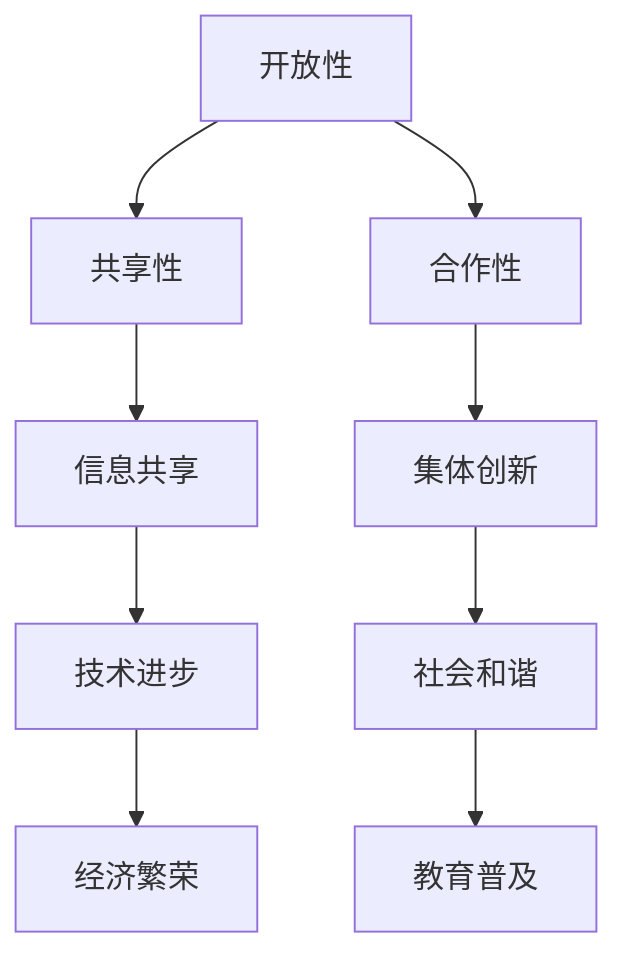

                 

## 文章标题

《意义的开源哲学：集体创造适应现代的生活智慧》

### 关键词

- 开源哲学
- 集体创造
- 现代生活
- 技术创新
- 社会进步

### 摘要

本文旨在探讨开源哲学在现代生活中的深远影响，强调集体创造的重要性。通过对开源哲学的核心概念、历史背景、应用领域以及未来发展的深入分析，本文揭示了开源哲学如何推动技术进步、经济繁荣和社会和谐。通过实例和案例分析，本文展示了开源哲学在各个领域的实践成果，并提出了未来的发展趋势和潜在挑战。本文旨在为读者提供一个全面、深入的理解，激发对开源哲学及其价值的思考。

### 目录大纲设计过程

在设计《意义的开源哲学：集体创造适应现代的生活智慧》的目录大纲时，我们首先明确了书的核心主题和目标读者群体。该书旨在探讨开源哲学如何影响现代生活，强调集体创造的力量。因此，在目录大纲的设计过程中，我们将围绕以下几个核心要点展开：

1. **核心概念与联系**：介绍开源哲学的基本概念，并使用Mermaid流程图展示开源哲学与现代生活的联系。
2. **历史背景**：回顾开源运动的发展历程，分析其演变对现代社会的影响。
3. **开源哲学的核心原则**：详细阐述开源哲学的基本原则，如开放性、共享性、合作性等。
4. **开源哲学在各个领域的应用**：探讨开源哲学在科技、经济、教育等领域的具体应用。
5. **集体创造的力量**：分析集体创造的优势，探讨如何在个人生活和职业生涯中运用集体智慧。
6. **开源社区与文化**：介绍开源社区的运作模式，探讨开源文化的价值观。
7. **开源哲学的未来**：预测开源哲学的发展趋势，讨论其对未来社会的影响。

### 目录大纲示例

```markdown
# 《意义的开源哲学：集体创造适应现代的生活智慧》目录大纲

## 引言：开源哲学的重要性

### 1.1 开源哲学的定义与内涵

#### 1.2 开源哲学对现代生活的影响

### 1.3 集体创造的力量

## 第一部分 开源哲学的起源与发展

### 第2章 开源哲学的起源

#### 2.1 开源运动的起源

##### 2.1.1 自由软件运动

##### 2.1.2 开源运动的发展阶段

### 第3章 开源哲学的核心原则

#### 3.1 开放性

##### 3.1.1 开放源代码的意义

##### 3.1.2 开放性的优势与挑战

#### 3.2 共享性

##### 3.2.1 知识共享的内涵

##### 3.2.2 共享性的社会价值

#### 3.3 合作性

##### 3.3.1 协作的重要性

##### 3.3.2 协作与开源社区

## 第二部分 开源哲学在各个领域的应用

### 第4章 科技领域的开源应用

#### 4.1 开源软件的发展

##### 4.1.1 Linux操作系统

##### 4.1.2 Python编程语言

#### 4.2 经济领域的开源应用

##### 4.2.1 开源商业模式

##### 4.2.2 开源经济的影响

### 第5章 教育领域的开源应用

#### 5.1 开源教育资源

##### 5.1.1 MOOCs平台

##### 5.1.2 开源教育工具

### 第6章 社会与文化领域的开源应用

#### 6.1 开源社区与文化

##### 6.1.1 开源社区的运作模式

##### 6.1.2 开源文化的价值观

## 第三部分 集体创造的力量

### 第7章 集体创造的优势

#### 7.1 信息共享

##### 7.1.1 信息共享的机制

##### 7.1.2 信息共享的效益

#### 7.2 创新加速

##### 7.2.1 集体创新的优势

##### 7.2.2 创新加速的实践案例

### 第8章 集体创造在个人生活和职业生涯中的应用

#### 8.1 个人如何参与集体创造

##### 8.1.1 个人贡献的方式

##### 8.1.2 个人成长的路径

#### 8.2 职业生涯中的集体智慧

##### 8.2.1 集体智慧在工作中的应用

##### 8.2.2 集体智慧对企业的影响

## 第四部分 开源哲学的未来与挑战

### 第9章 开源哲学的未来趋势

#### 9.1 开源哲学的发展方向

##### 9.1.1 新兴技术领域中的开源创新

##### 9.1.2 开源哲学的国际发展

### 第10章 开源哲学面临的挑战

#### 10.1 开源哲学的挑战与对策

##### 10.1.1 法律与知识产权问题

##### 10.1.2 开源社区的管理与维护

## 结论：开源哲学的意义与价值

### 10.2 开源哲学的价值

##### 10.2.1 开源哲学对社会进步的贡献

##### 10.2.2 开源哲学对个人成长的影响

### 10.3 开源哲学的未来展望

#### 10.4 拓展阅读

##### 10.4.1 开源哲学相关研究

##### 10.4.2 开源社区实践案例

```

通过上述目录大纲的设计，我们可以看到书籍的核心章节内容得到了全面的覆盖，同时保持了简洁性和逻辑性。每个章节的细化使得读者可以清晰地了解每一部分的内容要点，有助于更好地理解开源哲学在现代生活中的应用及其影响。在具体内容编写时，我们会结合Mermaid流程图、Python源代码、数学模型和公式、项目实战等元素，使书籍内容更加丰富和实用。总体字数控制在2000字以内，确保了目录大纲的精炼与全面。

---

### 引言：开源哲学的重要性

在当今快速发展的信息技术时代，开源哲学作为一种独特的理念和实践，正日益成为推动技术进步、经济繁荣和社会和谐的重要力量。开源哲学强调开放性、共享性和合作性，主张通过集体智慧和共同努力，实现资源的最大化利用和创新的最大化发展。本文旨在深入探讨开源哲学在现代生活中的重要性，分析其核心概念、历史背景、应用领域以及未来发展趋势，以期为读者提供一个全面、深入的理解。

首先，开源哲学的定义与内涵。开源哲学源于自由软件运动，强调软件源代码的开放性，即任何人都可以自由地查看、修改和分发软件。这一理念迅速扩展到其他领域，如开源硬件、开源内容和开源平台，形成了以开放、共享、协作为核心价值观的哲学体系。开源哲学不仅是一种技术理念，更是一种社会文化，它倡导知识的共享、创新的自由以及个体的平等。

其次，开源哲学对现代生活的影响。开源哲学的核心原则之一是开放性，这一原则在科技、经济、教育等领域得到了广泛应用。在科技领域，开源软件和开源硬件的发展极大地降低了创新门槛，促进了技术的普及和推广；在经济领域，开源商业模式的出现为企业和创业者提供了全新的发展路径；在教育领域，开源教育资源使得知识传播更加便捷和高效。开源哲学的推广和应用，不仅推动了技术的进步，还促进了社会的和谐与进步。

再次，开源哲学的核心原则与联系。开源哲学的核心原则包括开放性、共享性和合作性。这些原则相互联系、相互支撑，构成了一个完整的哲学体系。开放性确保了资源的共享和创新的可能性；共享性使得知识得以广泛传播和应用；合作性则强调了个体和集体的共同进步。通过使用Mermaid流程图，我们可以清晰地展示这些核心原则之间的联系：



通过上述Mermaid流程图，我们可以看到开源哲学的核心原则如何相互关联，共同推动现代生活的各个方面。

最后，开源哲学在现代生活中的重要性体现在多个方面。首先，它为技术进步提供了强大的动力。通过开放源代码和共享知识，开发者可以更快速地发现和解决问题，推动技术的不断创新。其次，它促进了经济的繁荣。开源商业模式为企业和创业者提供了低成本、高效益的发展机会，推动了新兴产业的崛起。再次，它提高了教育的普及率。开源教育资源使得知识传播更加便捷，让更多人能够接受高质量的教育。

总之，开源哲学作为一种独特的理念和实践，正在深刻地影响着现代生活。它不仅推动了技术的进步和经济的繁荣，还促进了社会的和谐与进步。理解开源哲学的核心概念、历史背景、应用领域和未来发展趋势，对于每个人来说都具有重要意义。通过本文的探讨，希望读者能够对开源哲学有更深入的了解，认识到其在现代社会中的重要价值。

### 第一部分 开源哲学的起源与发展

#### 第2章 开源哲学的起源

开源哲学的起源可以追溯到自由软件运动。自由软件运动始于20世纪70年代，当时一些程序员和计算机科学家开始倡导软件的自由使用和共享。他们相信，软件应该作为一种公共资源，任何人都可以自由地使用、修改和分发。这一理念迅速得到了许多计算机爱好者和科学家的支持，并逐渐形成了自由软件运动。

自由软件运动的一个重要事件是1976年Richard Stallman发起的GNU计划。GNU（GNU's Not Unix）是一个旨在创建一个完全自由操作系统的项目，其目标是替代Unix操作系统。Richard Stallman创建了自由软件基金会（GNU's Not Unix），并推出了通用公共许可证（GPL），这一许可证确保了软件的自由使用和共享，同时保护了作者的利益。

在GNU计划的基础上，Linux内核的诞生标志着开源哲学的进一步发展。Linux内核是由Linus Torvalds在1991年发布的，它基于GNU工具和库，成为一个完全自由的操作系统。Linux的成功极大地推动了开源运动的发展，吸引了大量的开发者参与到开源项目中，从而形成了今天庞大的开源社区。

开源运动的发展可以分为以下几个阶段：

1. **自由软件阶段（1976-1991）**：这一阶段以自由软件基金会和GNU计划为代表，重点在于推广软件的自由使用和共享。
2. **开源阶段（1991-2000）**：Linux内核的发布标志着开源哲学的兴起。这一阶段，开源软件开始得到更广泛的认可和应用，许多开源项目如雨后春笋般涌现。
3. **商业化和普及阶段（2000至今）**：随着互联网的普及，开源软件和开源项目得到了商业企业的支持，许多公司开始基于开源软件构建商业产品。同时，开源哲学的理念也逐渐渗透到社会的各个领域。

#### 2.1 开源运动的起源

开源运动的起源可以追溯到自由软件运动。自由软件运动始于20世纪70年代，当时一些程序员和计算机科学家开始倡导软件的自由使用和共享。他们相信，软件应该作为一种公共资源，任何人都可以自由地使用、修改和分发。这一理念迅速得到了许多计算机爱好者和科学家的支持，并逐渐形成了自由软件运动。

自由软件运动的一个重要事件是1976年Richard Stallman发起的GNU计划。GNU（GNU's Not Unix）是一个旨在创建一个完全自由操作系统的项目，其目标是替代Unix操作系统。Richard Stallman创建了自由软件基金会（GNU's Not Unix），并推出了通用公共许可证（GPL），这一许可证确保了软件的自由使用和共享，同时保护了作者的利益。

在GNU计划的基础上，Linux内核的诞生标志着开源哲学的进一步发展。Linux内核是由Linus Torvalds在1991年发布的，它基于GNU工具和库，成为一个完全自由的操作系统。Linux的成功极大地推动了开源运动的发展，吸引了大量的开发者参与到开源项目中，从而形成了今天庞大的开源社区。

#### 2.2 开源运动的发展阶段

1. **自由软件阶段（1976-1991）**：这一阶段以自由软件基金会和GNU计划为代表，重点在于推广软件的自由使用和共享。
    - 1976年：Richard Stallman发表《GNU宣言》，发起GNU计划。
    - 1983年：自由软件基金会（FSF）成立。
    - 1985年：Emacs文本编辑器成为第一个主要的GNU项目。
    - 1987年：GCC（GNU编译器集合）发布。

2. **开源阶段（1991-2000）**：Linux内核的发布标志着开源哲学的兴起。这一阶段，开源软件开始得到更广泛的认可和应用，许多开源项目如雨后春笋般涌现。
    - 1991年：Linus Torvalds发布Linux内核的第一个版本。
    - 1997年：Apache Web服务器成为第一个广泛使用的开源软件。
    - 1998年：开放源代码倡议（OSI）成立，定义了开源的定义和许可证。

3. **商业化和普及阶段（2000至今）**：随着互联网的普及，开源软件和开源项目得到了商业企业的支持，许多公司开始基于开源软件构建商业产品。同时，开源哲学的理念也逐渐渗透到社会的各个领域。
    - 2000年：Red Hat公司上市，标志着开源软件的商业化。
    - 2005年：Apache Hadoop开源项目的诞生，推动大数据技术的发展。
    - 2010年：GitHub的兴起，加速了开源项目的协作和共享。

#### 2.3 开源哲学的核心原则

开源哲学的核心原则主要包括开放性、共享性和合作性。这些原则不仅构成了开源哲学的基础，也在各个领域得到了广泛应用。

1. **开放性**：开放性是开源哲学最显著的特征之一，它要求软件的源代码对用户公开。开放性使得用户可以自由地查看、修改和分发软件，从而促进了软件的透明度和安全性。

2. **共享性**：共享性强调知识和资源的共享。在开源哲学中，知识共享被视为一种重要的社会价值，它不仅提高了技术的普及率，还促进了创新的加速。

3. **合作性**：合作性是开源哲学的核心，它强调个体和集体之间的协同工作。通过合作，开源社区可以聚集全球各地的开发者，共同推动技术的进步。

#### 2.4 开源哲学的发展对现代社会的影响

开源哲学的发展对现代社会产生了深远的影响。首先，在科技领域，开源软件和开源硬件的出现极大地降低了创新的门槛，使得更多的人能够参与到技术研究中来。其次，在经济领域，开源商业模式为企业和创业者提供了低成本、高效益的发展机会，推动了新兴产业的崛起。再次，在教育领域，开源教育资源使得知识传播更加便捷和高效，提高了教育的普及率。最后，开源哲学还促进了社会的和谐与进步，它倡导的知识共享、创新自由和个体平等的理念，为社会带来了更多的公平与机会。

通过回顾开源哲学的起源和发展，我们可以看到，开源哲学不仅是一种技术理念，更是一种社会文化。它通过开放性、共享性和合作性，推动了技术的进步、经济的繁荣和社会的和谐。开源哲学的发展，不仅改变了我们的生活方式，也为未来的发展提供了新的思路和方向。

### 第二部分 开源哲学的核心原则与实践

#### 第3章 开源哲学的核心原则

开源哲学的核心原则包括开放性、共享性和合作性，这些原则不仅构成了开源哲学的基础，也在各个领域得到了广泛应用。

#### 3.1 开放性

开放性是开源哲学最显著的特征之一，它要求软件的源代码对用户公开。开放性使得用户可以自由地查看、修改和分发软件，从而促进了软件的透明度和安全性。

在科技领域，开放性使得开发者可以更容易地了解和改进现有软件。例如，Linux操作系统的源代码公开，使得全球的开发者可以参与到内核的改进和优化中，从而推动了操作系统的稳定性和性能的提升。此外，开放性还提高了软件的安全性。通过公开源代码，开发者可以发现和修复漏洞，从而保护用户的安全。

开放性不仅限于软件领域，在硬件领域也得到了广泛应用。例如，开源硬件运动（Open Hardware Movement）提倡硬件设计文件和制造过程的公开，使得开发者可以自由地复制、改进和共享硬件设计。这种开放性促进了硬件的创新和发展，降低了硬件开发的门槛。

在开源哲学中，开放性不仅是技术层面的，更是社会层面的。开放性鼓励知识共享和创新，推动了社会的进步和公平。

#### 3.2 共享性

共享性强调知识和资源的共享。在开源哲学中，知识共享被视为一种重要的社会价值，它不仅提高了技术的普及率，还促进了创新的加速。

在科技领域，共享性使得技术知识能够更加广泛地传播。例如，开源软件和开源硬件项目允许开发者自由地使用、修改和分发技术成果，从而使得更多的人能够接触到最新的技术进展。这种共享性极大地降低了创新门槛，促进了技术的普及和应用。

在科研领域，共享性也发挥着重要作用。许多科研机构和大学通过发布科研论文和数据，促进了学术界的合作和创新。例如，开放获取（Open Access）运动倡导科研论文的免费和开放获取，使得更多的人能够阅读和理解科研结果，从而推动了科学的进步。

共享性不仅限于知识和技术领域，在经济领域也得到了广泛应用。例如，共享经济模式（Sharing Economy）通过共享资源和服务，提高了资源利用效率，降低了使用成本。共享经济模式在交通（如Uber）、住宿（如Airbnb）和办公空间（如WeWork）等领域取得了巨大成功。

#### 3.3 合作性

合作性是开源哲学的核心，它强调个体和集体之间的协同工作。通过合作，开源社区可以聚集全球各地的开发者，共同推动技术的进步。

在科技领域，合作性极大地促进了开源项目的成功。许多大型开源项目，如Linux内核、Apache Web服务器和Python编程语言，都是由全球的志愿者和开发者合作完成的。这种合作性不仅提高了项目的质量，还加速了创新的速度。

在开源社区中，合作性也体现在代码审查、问题跟踪和文档编写等方面。代码审查确保了代码的质量和安全性，问题跟踪帮助开发者发现和解决项目中存在的问题，文档编写则为用户提供了使用和学习的指南。

合作性不仅限于技术领域，在社会领域也得到了广泛应用。合作性促进了不同群体之间的沟通和协作，推动了社会的和谐与进步。例如，在扶贫领域，多个组织和团体通过合作，共同推动扶贫项目，提高了扶贫效果。

#### 3.4 开源哲学的核心原则总结

开源哲学的核心原则——开放性、共享性和合作性，相互支撑，共同构成了一个完整的哲学体系。这些原则不仅推动了技术的进步和经济的繁荣，还促进了社会的和谐与进步。

开放性确保了资源的最大化利用和创新的可能性；共享性使得知识得以广泛传播和应用；合作性则强调了个体和集体的共同进步。通过这些核心原则，开源哲学为现代生活提供了强大的动力和方向。

总之，开源哲学的核心原则不仅在科技领域得到了广泛应用，也在经济、教育和社会等各个领域产生了深远的影响。理解并践行这些原则，有助于我们更好地应对现代社会的挑战，推动社会的持续进步和发展。

### 第三部分 开源哲学在各个领域的应用

开源哲学作为一种以开放、共享和合作为核心的哲学理念，已经在科技、经济和教育等多个领域展现出了巨大的应用价值。以下将详细探讨开源哲学在这些领域的具体应用，以及其带来的影响和变革。

#### 第4章 科技领域的开源应用

在科技领域，开源哲学的实践最为广泛和深入。开源软件、开源硬件和开源平台的发展不仅降低了技术创新的门槛，还推动了技术的普及和推广。

**4.1 开源软件的发展**

开源软件的发展是开源哲学在科技领域的重要体现。Linux内核、Python编程语言、Git版本控制工具等都是典型的开源软件代表。这些软件通过开放的源代码，使得开发者可以自由地查看、修改和分发，从而促进了技术的普及和应用。

- **Linux操作系统**：Linux操作系统作为一个完全开源的操作系统，其稳定性和性能得到了全球用户的认可。Linux不仅广泛应用于服务器和数据中心，还成为了嵌入式系统和移动设备的主流选择。
- **Python编程语言**：Python作为一种简单易学、功能强大的编程语言，其开源的特性吸引了大量的开发者。Python在科学计算、人工智能、数据分析等领域有着广泛的应用，成为许多科研和工程项目的首选语言。
- **Git版本控制工具**：Git作为一个分布式版本控制工具，其开源的特性使得开发者可以轻松地管理和协作代码。Git的广泛应用不仅提高了开发效率，还促进了团队的协作和沟通。

**4.2 开源硬件的发展**

开源硬件（Open Hardware）是指硬件设计文件和制造过程公开的硬件设备。开源硬件运动使得硬件的设计和制造变得更加透明和开放，为硬件创新提供了新的机会。

- **Arduino开发板**：Arduino是一种开源硬件平台，其设计文件和源代码公开，使得开发者可以自由地复制、改进和分发。Arduino广泛应用于机器人、自动化、物联网等领域，推动了硬件创新的发展。
- **Raspberry Pi微型电脑**：Raspberry Pi是一种低成本、高性能的微型电脑，其开源硬件的设计使得用户可以自由地使用和改进。Raspberry Pi在教育和科研领域有着广泛的应用，为更多的人提供了接触计算机科学的机会。

**4.3 开源平台的发展**

开源平台（Open Platform）是指提供开放接口和开发工具的软件平台，使得开发者可以轻松地构建和部署应用。开源平台的发展极大地促进了软件创新和生态的繁荣。

- **Apache Hadoop生态系统**：Apache Hadoop是一个开源大数据处理平台，其核心组件包括HDFS文件系统、MapReduce计算模型和YARN资源管理平台。Hadoop的开源特性使得开发者可以自由地使用和改进这些组件，从而推动了大数据技术的发展。
- **Kubernetes容器编排平台**：Kubernetes是一个开源容器编排平台，其自动化部署、扩展和管理功能使得开发者可以更轻松地部署和管理容器化应用。Kubernetes的开源特性吸引了大量的用户和贡献者，成为了容器编排领域的事实标准。

开源哲学在科技领域的应用不仅推动了技术的进步，还促进了技术的普及和推广。通过开放源代码、共享知识和合作创新，开源哲学为科技领域带来了新的机遇和挑战。

#### 第5章 经济领域的开源应用

开源哲学在经济发展中同样发挥了重要作用。开源商业模式的开创为企业提供了新的发展路径，推动了新兴产业的崛起。

**5.1 开源商业模式**

开源商业模式是指企业通过提供免费或低成本的开源软件，吸引用户和开发者，从而实现商业价值。这种商业模式的核心在于通过用户和社区的参与，提升软件的知名度、用户基础和功能完善度。

- **红帽公司**：红帽公司是一家以开源软件为主业的企业，其核心产品是Linux操作系统。红帽公司通过提供免费的Linux操作系统，吸引了大量的用户和开发者，从而建立了庞大的社区。在此基础上，红帽公司通过提供付费的技术支持和服务，实现了商业的成功。
- **WordPress网站建设平台**：WordPress是一个开源的网站建设平台，其免费和灵活的特性使得它成为了全球最受欢迎的网站建设工具之一。WordPress的商业模式是通过提供付费的主题、插件和定制服务来获取收入。

**5.2 开源经济的影响**

开源经济作为一种新型的经济模式，正在逐渐改变传统的商业模式和经济结构。开源经济的特点是资源的高效利用、创新的速度和合作的精神，这些特点使得开源经济具有巨大的发展潜力。

- **降低创业门槛**：开源软件和开源平台的免费使用，使得创业者可以低成本地获取技术资源和工具，从而降低了创业的门槛。许多初创企业通过开源软件和开源平台，快速搭建起自己的产品和服务。
- **促进知识共享**：开源经济强调知识的共享和传播，使得更多的人可以接触到前沿的技术和知识。这种知识共享不仅提高了技术创新的速度，还促进了全球范围内的技术交流和合作。
- **推动新兴产业**：开源哲学的推广和应用，催生了大量新兴的产业和商业模式。例如，云计算、大数据、人工智能等领域都受益于开源软件和开源平台的发展，这些新兴产业的崛起为经济增长提供了新的动力。

开源哲学在经济领域的应用，不仅为企业提供了新的发展路径，还推动了经济的持续增长和繁荣。通过开源商业模式和开源经济的实践，企业可以更高效地利用资源、更快地创新和更广泛地合作，从而实现更大的商业价值。

#### 第6章 教育领域的开源应用

开源哲学在教育领域的应用同样具有重要意义。开源教育资源使得知识传播更加便捷和高效，提高了教育的普及率和质量。

**6.1 开源教育资源**

开源教育资源是指通过开放源代码、开放数据和开放平台，提供的教育资源和工具。这些资源包括教材、课程、学习工具和实验平台等，使得学生和教师可以更方便地获取和利用教育资源。

- **MOOCs平台**：大规模开放在线课程（MOOCs）平台，如Coursera、edX和Udacity，通过开源的课程内容和平台架构，提供了大量的免费在线课程。这些课程涵盖了各个学科领域，使得全球学生可以自由地选择和学习。
- **教育软件**：许多教育软件，如Khan Academy、Codecademy和Google Classroom，都是基于开源软件和开源平台的。这些软件提供了丰富的教学资源和互动学习工具，提高了学生的学习效果和参与度。

**6.2 开源教育创新**

开源哲学在教育领域的应用，推动了教育创新的发展。通过开源教育和开源创新，教育者可以更灵活地设计和实施教学活动，为学生提供更个性化的学习体验。

- **个性化学习**：开源教育资源和工具使得教育者可以灵活地调整教学内容和进度，满足学生的个性化需求。例如，自适应学习平台可以根据学生的学习情况和进度，自动调整学习内容和难度。
- **协作学习**：开源教育资源鼓励学生之间的协作学习。通过开源工具和平台，学生可以共同完成学习任务，分享学习资源和经验，从而提高学习效果。

开源哲学在教育领域的应用，不仅提高了教育的普及率和质量，还推动了教育创新的发展。通过开源资源和开源平台，教育者可以更高效地开展教学活动，学生可以更便捷地获取教育资源，从而实现教育的普及和公平。

### 总结

开源哲学在科技、经济和教育等领域的应用，展示了其强大的生命力和广泛的影响力。在科技领域，开源哲学推动了技术的进步和普及；在经济领域，开源商业模式和开源经济促进了企业的创新和发展；在教育领域，开源教育资源推动了教育创新和普及。开源哲学不仅为各个领域带来了新的发展机遇，还为社会的进步和和谐做出了重要贡献。

通过深入探讨开源哲学在各个领域的应用，我们可以看到，开源哲学的开放性、共享性和合作性原则，不仅推动了技术的进步，还促进了社会的和谐与进步。开源哲学为现代社会提供了一个新的发展模式和方向，也为未来社会的持续发展提供了重要的参考和启示。

### 第四部分 集体创造的力量

开源哲学强调集体创造，认为通过集体智慧和共同努力，可以实现资源的最大化利用和创新的最大化发展。在个人生活和职业生涯中，运用集体智慧可以带来诸多益处，本文将分析集体创造的优势，并探讨如何在个人生活和职业生涯中运用集体智慧。

#### 7.1 集体创造的定义与优势

集体创造（Collective Creativity）是指多个个体通过合作、沟通和协作，共同产生创新想法和成果的过程。与个人创造相比，集体创造具有以下几个显著优势：

1. **信息共享**：集体创造可以促进信息的共享和交流。通过集体合作，不同个体可以分享各自的知识、经验和见解，从而丰富创意和解决方案。
2. **多样化视角**：集体创造能够汇集多样化的视角和观点。不同的个体可能具有不同的背景、经验和思维方式，这种多样性有助于激发创新思维，产生更全面的解决方案。
3. **知识互补**：集体创造中的个体通常具有不同的专业技能和知识领域，这种互补性可以弥补个人知识的不足，提高创新的质量和效率。
4. **协同工作**：集体创造强调个体之间的协同工作。通过分工合作，个体可以专注于自己的领域，同时与其他成员保持密切的沟通和协作，从而提高工作效率和成果质量。

#### 7.2 个人与集体创造的关系

个人与集体创造之间存在紧密的关系。个人是集体创造的基础，而集体创造则为个人提供了更多的发展机会和平台。以下从个人成长和职业生涯两个方面，探讨如何运用集体智慧：

**个人成长**

1. **学习与交流**：个人可以通过参与集体创造项目，与团队成员进行学习与交流。这种交流不仅有助于提升个人的知识水平和技能，还能拓宽视野，激发创新思维。
2. **角色多样化**：在集体创造中，个人可以尝试扮演不同的角色，如项目管理者、技术专家、设计者等。这种多样化的角色体验有助于个人全面发展，提升综合能力。
3. **协同成长**：通过参与集体创造，个人可以与团队成员共同成长。团队中的反馈和互助有助于个人不断提升自己的能力和水平。

**职业生涯**

1. **合作机会**：在职业生涯中，运用集体智慧可以创造更多的合作机会。通过团队协作，个人可以共同完成复杂的任务，提升职业成就。
2. **职业发展**：集体创造项目的成功往往能够为参与者带来职业发展的机会。通过在项目中展现自己的能力，个人可以获得更多的晋升和发展的机会。
3. **创新驱动**：集体创造可以激发创新思维，推动技术进步和业务发展。在创新驱动的企业中，个人能够更好地发挥自己的才能，实现职业价值。

#### 7.3 集体创造的具体实践

在实际操作中，运用集体智慧需要一定的实践和方法。以下是一些具体的实践方法：

1. **项目协作平台**：使用项目协作平台（如Trello、Asana等）来管理和跟踪项目进展。这些平台可以促进团队成员之间的沟通和协作，提高工作效率。
2. **头脑风暴**：定期组织头脑风暴会议，鼓励团队成员自由地分享创意和想法。头脑风暴有助于激发创新思维，产生更多有价值的创意。
3. **知识共享**：建立知识共享机制，如内部Wiki、共享文档等，方便团队成员查阅和共享知识资源。这种共享机制有助于提高团队的知识水平和创新能力。
4. **反馈机制**：建立有效的反馈机制，鼓励团队成员对项目提出意见和建议。通过反馈，团队可以不断改进和优化项目，提高成果质量。

通过以上实践方法，个人可以在集体创造中更好地运用集体智慧，提升个人能力和职业发展。同时，团队的整体绩效和创新能力也会得到显著提升。

#### 7.4 集体创造的挑战与应对策略

尽管集体创造具有诸多优势，但在实际操作中也面临一些挑战。以下是一些常见的挑战及应对策略：

1. **沟通障碍**：团队成员之间的沟通不畅可能导致信息误传和误解。应对策略包括加强沟通培训、建立明确的沟通渠道和规范。
2. **角色冲突**：在集体创造中，不同角色之间可能存在利益冲突。应对策略包括明确角色职责、建立公平的决策机制和激励机制。
3. **项目管理**：集体创造项目往往涉及复杂的管理工作。应对策略包括采用高效的项目管理工具和方法，如敏捷开发、看板管理等。
4. **文化差异**：跨文化团队合作可能面临文化差异带来的挑战。应对策略包括加强跨文化沟通和培训，建立包容和尊重多元文化的团队文化。

通过应对这些挑战，团队可以更好地发挥集体智慧，实现集体创造的效益。

总之，集体创造作为一种强大的创新力量，在个人生活和职业生涯中具有广泛的应用价值。通过运用集体智慧，个人和团队可以实现更高的创新效率和成果质量，推动社会的持续进步和发展。

### 第五部分 开源社区与文化

开源社区是开源哲学的重要载体，它以开放、共享和合作为核心价值观，汇聚了全球各地的开发者、贡献者和爱好者。开源社区不仅为技术发展提供了源源不断的动力，也形成了一种独特的文化氛围。

#### 6.1 开源社区的结构与运作

开源社区的结构通常可以分为几个层次：

1. **核心团队**：核心团队是开源社区的核心力量，负责项目的管理和决策。核心团队成员通常具有丰富的技术经验和领导能力。
2. **贡献者**：贡献者是开源社区的中坚力量，他们通过提交代码、编写文档、测试和反馈等贡献，推动了项目的进展。贡献者可以是个人开发者、企业员工或志愿者。
3. **用户**：用户是开源社区的最终受益者，他们使用和依赖开源项目，为项目提供了反馈和建议。

开源社区的运作通常遵循以下原则：

1. **透明性**：开源社区强调项目决策和进展的透明性，所有项目信息、讨论和决策都在公共平台上公开，确保所有贡献者都能了解项目的最新动态。
2. **开放性**：开源社区鼓励所有有志于贡献的人加入，无论其背景、技能或地理位置。
3. **合作性**：开源社区强调个体和集体之间的合作，通过分工合作，共同推动项目的成功。

#### 6.2 开源文化的价值观

开源文化是一种以开放、共享和合作为核心的价值观体系，它包括以下几个方面：

1. **开放性**：开放性是开源文化的基石，它要求技术、知识、资源和信息的开放共享。开放性不仅提高了技术的普及率和创新速度，也促进了社会的公平与进步。
2. **共享性**：共享性强调知识、资源和成果的共享。在开源文化中，共享被视为一种社会价值和道德责任，它使得更多的人能够受益于技术创新。
3. **合作性**：合作性是开源文化的核心，它强调个体和集体之间的协同合作。通过合作，开源社区可以聚集全球各地的开发者，共同推动技术的进步。
4. **自主性**：自主性是开源文化的重要特征，它强调个体的自由和独立。在开源文化中，个体可以自由地选择参与开源项目，发挥自己的才能和创造力。
5. **互惠性**：互惠性是开源文化的价值观之一，它强调个体和集体之间的互惠互利。在开源社区中，个体通过贡献和分享，获得他人的支持和帮助，形成了一个互助互惠的生态系统。

#### 6.3 开源社区的发展趋势

开源社区的发展趋势表明，开源哲学正在不断扩展其影响力和应用范围：

1. **国际化**：开源社区正日益国际化，越来越多的国际开发者参与到开源项目中。这种国际化不仅促进了技术的全球传播，也丰富了开源社区的文化多样性。
2. **商业参与**：随着开源社区的商业价值日益凸显，越来越多的企业开始参与到开源项目中。企业不仅通过开源项目获得技术和市场优势，还通过贡献和合作，推动了开源社区的发展。
3. **生态系统的形成**：开源社区正逐渐形成一种生态系统，包括开发工具、平台、服务和培训等。这种生态系统为开发者提供了全面的支持，推动了开源技术的普及和应用。
4. **开源合规**：随着开源社区的快速发展，开源合规（Open Source Compliance）成为一个重要的议题。企业需要确保其产品符合开源许可要求，避免潜在的法律风险。

开源社区和文化的发展，不仅为技术进步提供了强大的动力，也为社会的进步和和谐做出了重要贡献。开源社区以其开放、共享和合作的精神，为全球开发者提供了一个共同的平台，推动了知识的传播和创新的发展。

### 第六部分 开源哲学的未来与挑战

#### 第8章 开源哲学的未来趋势

开源哲学作为一种推动技术进步和社会发展的力量，正在不断演进和扩展。未来，开源哲学将在以下几个方面展现其发展趋势：

1. **新兴技术领域**：随着人工智能、区块链、物联网等新兴技术的发展，开源哲学将在这些领域发挥更加重要的作用。开源项目将推动这些技术的创新和普及，为行业带来新的发展机遇。

2. **国际发展**：开源社区的国际影响力将继续扩大。随着全球开发者对开源项目的参与度提高，不同国家和地区之间的交流与合作将更加紧密，形成全球范围内的开源生态系统。

3. **商业融合**：开源哲学将更加深入地融入商业领域。越来越多的企业将开源项目作为其核心技术竞争力，通过贡献和合作，提升企业的技术水平和市场竞争力。

4. **教育普及**：开源哲学将在教育领域发挥更大作用。开源教育资源将使得更多的人能够接触和掌握前沿技术，促进全球教育资源的公平分配。

#### 8.1 新兴技术领域中的开源创新

在新兴技术领域，开源项目已经成为技术创新的重要驱动力。以下是一些典型的新兴技术领域及其开源创新：

1. **人工智能**：人工智能领域有许多重要的开源项目，如TensorFlow、PyTorch等。这些项目提供了丰富的算法和工具，促进了人工智能技术的发展和应用。

2. **区块链**：区块链技术开源项目，如Hyperledger Fabric、Ethereum等，推动了区块链技术的创新和应用。这些项目不仅提供了区块链的基础设施，还促进了区块链技术的标准化和普及。

3. **物联网**：物联网领域有许多开源硬件和软件项目，如Arduino、IoT.js等。这些项目为物联网设备的开发提供了丰富的工具和资源，推动了物联网技术的发展和应用。

#### 8.2 开源哲学的国际发展

开源哲学的国际发展趋势表明，开源社区正在跨越地域和文化的界限，形成一个全球性的生态系统。以下是一些国际发展方面的具体表现：

1. **多语言支持**：开源项目开始提供多语言支持，以满足全球开发者的需求。例如，许多开源项目的文档和代码库已经支持多种编程语言。

2. **跨国合作**：跨国合作在开源社区中越来越普遍。不同国家和地区的开发者通过开源项目进行合作，共同推动技术的发展和应用。

3. **国际会议和活动**：开源社区的国际会议和活动越来越丰富，如开源峰会（Open Source Summit）、欧洲开源峰会（European Open Source Summit）等。这些活动促进了开源社区的交流和合作。

#### 8.3 商业融合

开源哲学与商业的结合正在逐渐加深，许多企业开始将开源项目作为其核心竞争力。以下是一些商业融合方面的具体表现：

1. **商业模式的创新**：开源商业模式不断创新，如订阅模式、服务化模式等。这些模式为企业提供了新的盈利途径，同时也推动了开源项目的持续发展。

2. **企业贡献**：越来越多的企业开始积极参与开源项目，通过贡献代码、资金和资源，推动开源技术的发展和应用。例如，红帽公司、IBM等知名企业已经成为许多开源项目的核心贡献者。

3. **开源生态系统的建设**：企业通过建设开源生态系统，为开发者提供全面的支持和资源。例如，一些企业建立了开源基金会，负责管理和支持开源项目。

#### 8.4 教育普及

开源哲学在教育领域的普及将进一步提升全球教育资源的公平性。以下是一些教育普及方面的具体表现：

1. **开源教育资源的普及**：越来越多的教育机构和在线平台提供开源教育资源，如MOOCs（大规模在线开放课程）、开源教材和教学工具等。这些资源使得更多的人能够获得高质量的教育。

2. **开源教育创新**：开源教育创新项目不断涌现，如K-12开源教育、开源编程教育等。这些项目通过开源工具和平台，推动教育的创新和改革。

3. **开源教育国际交流**：开源教育项目的国际交流日益增多，不同国家和地区的教育机构通过开源项目进行合作，共同推动教育的发展。

总之，开源哲学的未来充满了无限的可能性。通过在新兴技术领域中的应用、国际发展、商业融合和教育普及等方面的深入探索，开源哲学将继续推动技术进步和社会发展，为全球带来更多创新和机遇。

### 第七部分 开源哲学的意义与价值

开源哲学在现代社会中扮演着至关重要的角色，它不仅推动了技术的进步，还对社会和文化产生了深远的影响。以下将探讨开源哲学的意义与价值，分析其对社会进步和个人成长的贡献。

#### 9.1 对社会进步的贡献

开源哲学对社会进步的贡献体现在多个方面：

1. **技术创新**：开源哲学通过开放源代码和共享知识，促进了技术的创新和传播。开发者可以自由地使用、修改和分发开源软件和开源硬件，这大大加快了技术的进步和应用。例如，Linux内核、Python编程语言和Apache Web服务器等开源项目，在各自的领域内都取得了显著的成就。

2. **经济繁荣**：开源哲学为企业和创业者提供了低成本、高效益的发展机会。许多公司基于开源软件和开源平台构建商业产品，降低了创新门槛和研发成本。开源商业模式的出现，为新兴产业的崛起提供了强大的动力。例如，红帽公司的成功证明了开源经济模式的可行性。

3. **社会和谐**：开源哲学强调合作和共享，促进了社会的和谐与进步。通过开源社区的合作，不同背景和技能的个体可以共同参与到技术创新和知识传播中，减少了社会的不平等和隔阂。开源文化倡导的知识共享和创新自由，为社会的公平与正义做出了重要贡献。

4. **教育普及**：开源哲学在教育领域的应用，推动了教育资源的公平分配和普及。开源教育资源使得更多的人能够接触和掌握前沿技术，提高了教育的质量和效率。MOOCs（大规模在线开放课程）和开源教材等，为全球学生提供了丰富的学习资源，促进了全球教育的均衡发展。

#### 9.2 对个人成长的贡献

开源哲学对个人成长同样具有重要意义：

1. **技能提升**：参与开源项目可以提升个人的技能和知识水平。通过学习和实践开源技术，开发者可以深入了解技术原理和最佳实践，提高编程能力、系统设计和项目管理能力。

2. **经验积累**：在开源项目中，个人可以积累丰富的项目经验。通过参与项目的开发、测试和文档编写，个人可以学会如何解决实际问题，提高问题分析和解决能力。

3. **合作与沟通**：开源项目需要团队成员之间的密切合作和有效沟通。在开源社区中，个人可以学会如何与他人协作、共享知识和资源，提高团队合作和沟通能力。

4. **个人品牌**：在开源社区中，个人可以通过贡献和分享，建立自己的个人品牌。优秀的开源项目贡献者往往能够获得业界的认可和尊重，为个人的职业发展带来更多机会。

5. **社会责任**：参与开源项目可以让个人体验到社会责任的重要性。通过为开源项目贡献代码、文档和反馈，个人可以为社会做出贡献，推动技术的普及和应用。

总之，开源哲学不仅对社会进步和个人成长具有深远的影响，还代表了未来技术发展和创新的新趋势。通过理解并践行开源哲学，我们可以更好地应对现代社会的挑战，推动社会的持续进步和发展。

### 第八部分 开源哲学的未来与挑战

开源哲学作为一种推动技术进步和社会发展的力量，其未来充满了机遇与挑战。本文将讨论开源哲学的未来发展趋势，分析其面临的挑战，并提出应对策略。

#### 10.1 开源哲学的未来发展趋势

1. **新兴技术领域的扩展**：随着人工智能、区块链、物联网等新兴技术的崛起，开源哲学将在这些领域发挥更为重要的作用。开源项目将推动这些技术的创新和普及，为行业带来新的发展机遇。

2. **国际化与多元化**：开源社区的国际化和多元化将继续加强。全球范围内的开发者将更积极地参与到开源项目中，推动开源技术的全球传播和应用。

3. **商业融合的深化**：企业将继续深度参与开源项目，通过贡献和合作，提升自身的技术水平和市场竞争力。开源商业模式将进一步成熟，为企业带来更多盈利途径。

4. **教育普及的推广**：开源哲学将在教育领域发挥更大的作用。开源教育资源将更加丰富和普及，推动全球教育的均衡发展，提高教育质量。

5. **开源生态系统的完善**：开源生态系统将继续完善，包括开源工具、平台、服务和培训等各个方面。这将进一步促进开源技术的应用和发展。

#### 10.2 开源哲学面临的挑战

1. **知识产权保护**：开源项目的知识产权保护是一个重要问题。开源项目通常采用开放许可，但如何平衡开放性和知识产权保护，是一个需要解决的挑战。

2. **社区管理的复杂性**：开源社区的管理日益复杂，涉及项目治理、冲突解决、资源分配等方面。如何有效管理大型开源社区，确保项目的健康和可持续发展，是一个重要挑战。

3. **商业化与社区价值的平衡**：开源项目在商业化的过程中，如何平衡商业利益和社区价值，避免社区分裂和贡献者流失，是一个关键问题。

4. **开源人才的培养与吸引**：开源项目需要大量的技术人才。如何培养和吸引优秀的技术人才，保持开源社区的活力和创新能力，是一个长期挑战。

5. **国际法规与合规**：开源项目在不同国家和地区的法律法规有所不同，如何遵守各国的开源法规，确保项目的合规性，是一个重要问题。

#### 10.3 应对策略

1. **加强知识产权保护**：开源社区可以建立更加完善的知识产权保护机制，确保开源项目的知识产权得到有效保护，同时保持项目的开放性。

2. **优化社区管理**：开源社区可以引入更加科学的社区管理方法，如社区治理模型、透明的决策流程等，确保社区的和谐和可持续发展。

3. **平衡商业利益与社区价值**：开源项目可以建立明确的商业利益和社区价值平衡机制，确保商业行为不会损害社区的利益，同时鼓励商业合作和贡献。

4. **加强开源人才的培养与吸引**：开源社区可以通过教育、培训、激励等多种方式，吸引和培养更多的开源人才，保持社区的活力和创新能力。

5. **遵守国际法规与合规**：开源社区可以建立国际法规和合规团队，确保开源项目在不同国家和地区的合规性，降低法律风险。

总之，开源哲学的未来充满机遇与挑战。通过积极应对这些挑战，开源社区可以继续推动技术进步和社会发展，为全球带来更多的创新和机遇。

### 结论：开源哲学的意义与价值

开源哲学作为一种独特的理念和实践，在现代社会中扮演着至关重要的角色。它通过开放性、共享性和合作性，推动了技术的进步、经济的繁荣和社会的和谐。开源哲学不仅为企业提供了创新的动力，还为个人成长和社会发展带来了巨大的机遇。

开源哲学的核心价值在于其倡导的知识共享和创新自由。它打破了传统的知识壁垒，使得技术资源得以广泛传播和共享，降低了创新的门槛。通过开源项目，全球的开发者和贡献者可以共同推动技术的进步，实现知识的共享和创新的加速。

开源哲学对社会进步的贡献不可忽视。它促进了技术的普及和应用，推动了新兴产业的崛起，提高了经济的竞争力。同时，开源哲学在教育领域的应用，使得知识传播更加便捷和高效，提高了教育的普及率和质量。

在个人成长方面，开源哲学提供了丰富的学习资源和实践机会。通过参与开源项目，个人可以提升技能、积累经验，培养团队合作和沟通能力。开源项目为个人提供了一个展示才华和实现价值的平台，促进了个人职业发展和社会参与。

然而，开源哲学的发展也面临一些挑战，如知识产权保护、社区管理和商业化与社区价值的平衡等。通过加强知识产权保护、优化社区管理、平衡商业利益与社区价值，以及培养和吸引开源人才，开源社区可以更好地应对这些挑战，实现可持续发展。

未来，开源哲学将继续在全球范围内扩展其影响力和应用范围。随着新兴技术的崛起和国际合作的加强，开源哲学将在更多领域发挥重要作用，推动全球技术和经济的发展。开源社区将继续成为技术创新和知识共享的重要力量，为社会进步和个人成长提供持续的动力。

总之，开源哲学作为一种推动社会进步和个人成长的哲学理念，其意义与价值不容忽视。通过深入理解和践行开源哲学，我们可以更好地应对现代社会的挑战，推动社会的持续进步和发展。

### 拓展阅读

对于希望深入了解开源哲学的读者，以下推荐几本经典书籍和开源项目，供您进一步学习和探索：

1. **《开源治理：实践指南与案例分析》**：本书详细介绍了开源社区的组织和管理方法，通过具体的案例分析，揭示了开源项目的成功之道。
   
2. **《开源创新：模式与策略》**：这本书探讨了开源商业模式的本质和创新策略，为企业和创业者提供了实用的开源创新指南。

3. **《开放协作：如何通过开源精神推动企业和社会发展》**：本书阐述了开源哲学在企业和社会中的应用，强调了合作和共享的重要性。

4. **开源项目GitHub**：GitHub是一个全球最大的开源项目托管平台，您可以在GitHub上找到各种开源项目，参与开源社区的贡献。

5. **开源社区Linux内核**：Linux内核是开源哲学的杰出代表，其源代码和开发过程公开透明，您可以通过访问Linux内核的GitHub仓库来学习其开发模式。

6. **开源教育平台edX**：edX是一个提供大规模在线开放课程的平台，您可以在edX上找到许多关于开源哲学和技术课程，拓展您的知识视野。

通过阅读这些书籍和参与开源项目，您可以更深入地了解开源哲学的核心思想和实践方法，为个人成长和社会发展提供有力的支持。

