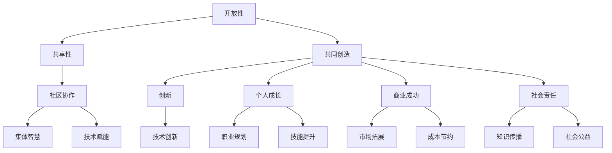

                 

### 第1章 引言：开源哲学的背景与重要性

#### 1.1 开源哲学的概念与历史演变

开源哲学是一种基于开放性、共享性和共同创造的软件开发理念。它源于20世纪70年代，由自由软件运动（Free Software Movement）的倡导者发起，以Richard Stallman为代表。自由软件运动主张软件应该自由分发，用户有权阅读、修改和分发源代码，这一理念推动了开源哲学的发展。

开源哲学的核心原则是开放性、共享性和共同创造。开放性意味着软件开发过程和成果对所有参与者都是开放的，包括源代码、文档和改进建议。共享性则强调知识的共享，通过共同创造，使得软件不断改进和优化。共同创造是指开发者、用户和其他利益相关者共同参与软件的开发和维护。

#### 1.2 开源哲学的核心原则

**1.2.1 开放性**

开放性是开源哲学的核心特征，它体现在以下几个方面：

- **源代码的开放性**：开发者必须将软件的源代码公开，使得其他开发者可以阅读、修改和优化源代码。
- **参与渠道的开放性**：任何人都可以自由地参与到开源项目中，提出改进建议、提交错误报告或直接修改代码。
- **决策过程的开放性**：开源项目的决策过程通常是公开的，包括项目规划、技术路线和重大变更等。

**1.2.2 共享性**

共享性是开源哲学的重要原则，它强调知识和资源的共享，包括：

- **代码的共享**：开发者将代码共享给社区，使得其他人可以复用和优化。
- **文档的共享**：开源项目通常提供详细的文档，包括用户手册、开发指南和设计文档，方便其他开发者学习和使用。
- **经验的共享**：开发者通过分享经验和最佳实践，帮助其他开发者提高技能和效率。

**1.2.3 共同创造**

共同创造是开源哲学的终极目标，它体现在以下几个方面：

- **集体智慧**：开源社区通过协作和集体智慧，不断改进和优化软件。
- **个人成长**：开发者通过参与开源项目，不仅可以提高技术水平，还可以锻炼项目管理能力和团队合作精神。
- **商业成功**：开源项目通过共享和协作，吸引了大量的用户和开发者，为企业提供了丰富的商业机会。

#### 1.3 现代生活智慧平台的需求

随着科技的发展，现代生活面临着诸多挑战，如信息过载、资源短缺和社交孤立等。为了应对这些挑战，现代生活智慧平台应运而生。这些平台旨在通过智能技术和数据驱动的方式，提高生活质量、优化资源利用和促进社交互动。

开源哲学在适应现代生活中的作用主要体现在以下几个方面：

- **技术赋能**：开源哲学提供了丰富的技术资源和工具，使得开发者可以更快速地构建和优化智慧平台。
- **社区协作**：开源社区通过协作和共享，不断推动智慧平台的发展和创新。
- **用户体验**：开源项目通常注重用户体验，通过用户反馈和参与，使得平台更加贴近用户需求。

总之，开源哲学不仅是一种软件开发理念，更是一种适应现代生活需求的智慧平台构建方式。通过开放性、共享性和共同创造，开源哲学为现代生活带来了新的可能性和机遇。

### 第2章 开源哲学在现代生活中的应用

#### 2.1 社区协作与集体智慧

社区协作是开源哲学的核心应用之一。它强调通过协作和共享，实现集体智慧的发挥。在现代生活中，社区协作的应用范围广泛，涵盖了软件开发、科学研究、文化创意等多个领域。

**2.1.1 社区协作的概念与重要性**

社区协作是指一群具有共同目标和兴趣的人，通过共享资源和知识，共同完成某个项目或任务的过程。在开源社区中，社区协作体现在以下几个方面：

- **代码协作**：开发者通过版本控制系统（如Git）协作开发，共同编写和优化代码。
- **文档协作**：开源项目通常提供详细的文档，通过文档协作工具（如Markdown编辑器）共同撰写和维护。
- **决策协作**：开源项目的决策过程通常是公开的，通过邮件列表、论坛或会议等渠道，开发者可以参与讨论和投票。

社区协作的重要性在于：

- **提高开发效率**：通过多人协作，可以快速发现和修复问题，提高项目的开发速度。
- **促进知识共享**：社区协作使得知识和经验得以传播和共享，为开发者提供了学习和成长的机会。
- **激发创新潜力**：集体智慧能够激发创新的火花，推动技术的进步和突破。

**2.1.2 集体智慧的实现方式**

集体智慧是指通过集体协作，实现更高效、更有创造力的决策和解决问题的过程。在开源社区中，集体智慧的实现方式主要包括以下几种：

- **民主决策**：开源项目的决策通常通过民主投票进行，确保每个贡献者都有发言权和表决权。
- **知识共享**：开源项目通过文档、博客、邮件列表等渠道，共享开发经验和技术知识。
- **透明度**：开源项目的决策过程和进展通常是公开透明的，任何人都可以查看和参与。
- **多元化**：开源社区通常汇集了来自不同背景和领域的开发者，多元化视角有助于发现问题和提出创新的解决方案。

**2.1.3 现代生活智慧平台的构建**

现代生活智慧平台是指利用智能技术和数据驱动的方式，为用户提供便捷、高效和个性化的服务。开源哲学在构建现代生活智慧平台中发挥着重要作用，主要体现在以下几个方面：

- **技术选型**：开源社区提供了丰富的技术资源和工具，开发者可以基于这些资源选择最合适的解决方案。
- **快速迭代**：通过社区协作，开发者可以快速响应用户需求，不断优化和改进平台功能。
- **用户体验**：开源项目通常注重用户体验，通过用户反馈和参与，使得平台更加贴近用户需求。
- **安全可靠**：开源项目通过社区协作，可以及时发现和修复安全漏洞，提高平台的安全性和可靠性。

**2.1.4 成功案例分享**

以下是几个开源社区在构建现代生活智慧平台中的成功案例：

- **GitLab**：GitLab是一个基于Git的源代码管理系统，通过开源社区协作，GitLab不断优化和扩展功能，成为全球最受欢迎的Git解决方案之一。
- **Kubernetes**：Kubernetes是一个开源的容器编排平台，通过社区协作，Kubernetes已经成为容器编排领域的领导者，为现代企业提供了高效、可扩展的容器化管理解决方案。
- **TensorFlow**：TensorFlow是一个开源的机器学习框架，通过社区协作，TensorFlow吸引了大量的开发者参与，成为机器学习领域的领先平台。

**案例分析与启示**

通过以上案例，我们可以看到开源社区在构建现代生活智慧平台中的重要作用。开源哲学不仅促进了技术的创新和进步，还推动了社区协作和集体智慧的发挥。对于企业和开发者来说，积极参与开源社区，不仅可以提升自身技能和影响力，还可以获得更多的商业机会和合作资源。

总之，开源哲学在适应现代生活中的应用，不仅体现在软件开发领域，还渗透到科学研究、文化创意和现代生活智慧平台的构建中。通过社区协作和集体智慧，开源哲学为现代生活带来了新的可能性。

### 第3章 开源哲学与个人成长

#### 3.1 开源哲学对个人思维模式的影响

开源哲学对个人思维模式的影响是深远而广泛的。它不仅改变了人们的思维方式，还促进了个人成长和发展。开源哲学的核心原则，如开放性、共享性和共同创造，深刻地影响了个人对知识和资源的获取、处理和分享方式。

**3.1.1 思维方式的转变**

开源哲学强调开放性和共享性，这促使个人从封闭、保守的思维模式转向开放、协作的思维模式。具体来说，开源哲学对个人思维模式的影响体现在以下几个方面：

- **从“拥有”到“共享”**：在开源哲学的影响下，个人不再仅仅关注个人拥有的知识和资源，而是更愿意分享和贡献自己的知识和经验。
- **从“竞争”到“协作”**：开源哲学倡导协作和共同创造，个人从竞争思维转向合作思维，通过协作实现共同的目标。
- **从“依赖”到“独立”**：开源哲学鼓励个人独立思考和解决问题，培养了个人的自主性和创新能力。

**3.1.2 创新能力的提升**

开源哲学不仅改变了个人思维模式，还显著提升了个人的创新能力。以下是一些具体的表现：

- **多元化视角**：开源社区汇聚了来自不同背景和领域的开发者，多元化的视角有助于发现问题和提出创新的解决方案。
- **持续学习**：开源项目通常伴随着持续的学习和改进，个人在参与开源项目的过程中，不断学习和掌握新技术和方法。
- **实践与反思**：开源哲学鼓励个人通过实践和反思，不断优化和改进自己的知识和技能。

**3.1.3 例子：开源社区中的个人成长故事**

开源社区中有很多成功的个人成长故事，以下是一些典型的例子：

- **GitHub**：GitHub是一个全球最大的开源代码托管平台，许多开发者通过参与GitHub上的开源项目，提升了编程技能和项目管理能力，最终获得了更好的职业机会。
- **Linux内核开发**：Linux内核是一个全球开源项目，许多开发者通过参与Linux内核的开发，不仅提高了自己的技术能力，还在开源社区中建立了良好的声誉和影响力。
- **WordPress**：WordPress是一个流行的开源内容管理系统，许多开发者通过参与WordPress的开发和维护，不仅掌握了WordPress的核心技术，还学会了如何构建和运营一个成功的开源项目。

#### 3.2 开源哲学在职业生涯中的应用

开源哲学在职业生涯中的应用同样具有重要意义。它不仅有助于提升个人的技能和职业竞争力，还为个人提供了丰富的职业发展机会。

**3.2.1 职业规划**

开源哲学鼓励个人通过参与开源项目进行职业规划。以下是一些具体的建议：

- **确定兴趣领域**：根据自己的兴趣和特长，选择一个适合自己的开源项目，并参与其中。
- **制定学习计划**：通过学习开源项目的技术文档和代码，不断提升自己的技术能力。
- **积累实战经验**：参与开源项目，可以积累实际项目经验，提高解决问题的能力。
- **建立个人品牌**：通过参与开源项目，建立自己在社区中的声誉和影响力，提升职业竞争力。

**3.2.2 职场技能提升**

开源哲学提供了丰富的学习和提升职场技能的机会。以下是一些具体的方法：

- **技术学习**：通过参与开源项目，可以学习到最新的技术和方法，提高自己的技术水平。
- **项目管理**：参与开源项目的项目管理，可以学习到项目规划、团队协作和决策制定等项目管理技能。
- **沟通能力**：开源社区中的沟通和协作，有助于提高个人的沟通能力和表达能力。
- **团队协作**：开源项目通常需要团队成员之间的紧密合作，通过参与开源项目，可以培养团队协作精神和合作能力。

**3.2.3 个人参与与贡献**

个人参与开源项目，不仅可以提升自己的技能和职业竞争力，还可以为开源社区做出贡献。以下是一些具体的建议：

- **代码贡献**：通过提交代码补丁，修复漏洞或添加新功能，为开源项目做出实际贡献。
- **文档贡献**：撰写和翻译文档，帮助其他开发者更好地理解和使用开源项目。
- **测试与反馈**：参与开源项目的测试和反馈，帮助项目团队发现和解决问题。
- **社区活动**：参加开源社区的活动，如会议、讲座和代码贡献日，与其他开发者交流和合作。

总之，开源哲学不仅对个人思维模式产生了深远影响，还在职业生涯中发挥了重要作用。通过参与开源项目，个人不仅可以提升自己的技能和职业竞争力，还可以为开源社区做出贡献，实现个人成长和职业发展的双赢。

#### 3.3 开源社区的个人参与与贡献

在开源社区中，个人的参与和贡献不仅对项目本身产生积极影响，也为个人的成长和职业发展提供了宝贵机会。以下将详细探讨个人如何参与开源社区，以及如何为开源项目做出贡献。

**3.3.1 参与开源社区的途径**

1. **选择合适的开源项目**：首先，需要根据个人兴趣和技能选择一个适合自己的开源项目。可以通过GitHub、GitLab等开源平台浏览和搜索项目，了解其需求和现状。

2. **阅读项目文档**：在决定参与某个开源项目之前，详细阅读项目的文档，包括项目简介、开发者指南、贡献指南等，了解项目的背景、目标和要求。

3. **加入社区**：大多数开源项目都有邮件列表、论坛、聊天室等社区交流渠道。加入这些社区，可以与其他开发者互动，了解项目的最新动态和问题。

4. **关注项目活动**：开源项目通常会有定期的代码贡献日、会议和讲座等活动。关注这些活动，可以帮助个人更好地融入社区，了解项目的开发进度和方向。

**3.3.2 个人贡献的重要性**

个人在开源项目中的贡献对项目的成功至关重要。以下是一些具体的贡献方式：

1. **代码贡献**：提交代码补丁是开源项目中最直接的贡献方式。可以通过修复已知漏洞、添加新功能或优化现有代码，提升项目的质量和稳定性。

2. **文档贡献**：撰写和翻译文档可以帮助其他开发者更好地理解和使用开源项目。完善项目文档，可以提高项目的可访问性和易用性。

3. **测试与反馈**：参与项目的测试和反馈，可以帮助发现和解决问题。通过提交测试报告和反馈意见，为项目团队提供改进建议。

4. **社区活动**：参与开源社区的会议、代码贡献日等活动，可以与其他开发者交流经验，提升自己的沟通和协作能力。

**3.3.3 贡献的实际案例**

以下是几个开源社区中的个人贡献案例：

1. **GitHub**：GitHub的开发者通过提交代码补丁，修复了数以万计的漏洞和错误，为平台的稳定和安全做出了巨大贡献。

2. **WordPress**：WordPress社区的志愿者撰写和翻译了大量的文档，使得WordPress成为全球最受欢迎的内容管理系统之一。

3. **Kubernetes**：Kubernetes社区的开发者通过参与代码审查和提交补丁，不断优化和扩展了平台的性能和功能。

**3.3.4 个人贡献的回报**

尽管个人在开源项目中的贡献是出于对技术的热爱和社区的奉献，但仍然可以获得多方面的回报：

1. **技能提升**：参与开源项目，可以学习到最新的技术趋势和最佳实践，提升个人技能。

2. **职业发展**：在开源社区中的活跃表现，可以提升个人的职业竞争力，为求职和职业发展带来更多机会。

3. **声誉和影响力**：在开源社区中建立良好的声誉和影响力，可以吸引更多的合作机会和资源。

4. **社交网络**：参与开源项目，可以结识来自不同领域和背景的开发者，扩展社交网络。

总之，开源社区为个人提供了广阔的参与和贡献平台。通过积极参与开源项目，个人不仅可以为社区做出贡献，还可以实现个人成长和职业发展的双赢。

### 第4章 开源哲学与商业成功

#### 4.1 开源商业模式的创新

开源哲学不仅是一种软件开发理念，更是一种创新的商业模式。在开源商业模式中，企业通过开放源代码、共享知识和资源，实现与用户和社区的深度互动，从而获得商业成功。开源商业模式的创新主要体现在以下几个方面：

**4.1.1 商业模式的概念与类型**

商业模式是指企业如何创造、传递和获取价值的一种系统化方法。根据开源哲学的特点，开源商业模式可以分为以下几种类型：

- **服务型商业模式**：企业通过提供与开源项目相关的服务，如定制开发、技术支持、培训等，实现盈利。例如，Red Hat通过提供Linux操作系统的技术支持和服务，成为全球领先的开放源代码服务提供商。
- **许可型商业模式**：企业通过出售开源项目的商业许可，实现盈利。例如，MySQL AB通过出售MySQL数据库的商业许可，获得大量收入。
- **平台型商业模式**：企业通过构建开源平台，吸引开发者和使用者，从而提供增值服务。例如，GitHub通过构建开源代码托管平台，提供各种增值服务，实现盈利。

**4.1.2 开源商业模式的案例分析**

以下是几个典型的开源商业模式案例：

1. **Red Hat**：Red Hat是一家全球领先的开放源代码软件公司，其成功的关键在于将开源与商业服务相结合。Red Hat通过提供Linux操作系统的技术支持和服务，帮助企业客户解决技术问题，从而获得稳定的收入。此外，Red Hat还通过开源项目的开发，吸引和培养了大量优秀的技术人才，进一步提升了企业的竞争力。

2. **WordPress**：WordPress是一个全球流行的开源内容管理系统，其成功的关键在于构建了一个强大的开源社区。WordPress通过提供丰富的主题和插件，满足用户的个性化需求。同时，WordPress社区提供了大量的技术支持和培训资源，帮助用户更好地使用和管理网站。WordPress通过广告和合作伙伴计划，实现了盈利。

3. **Slack**：Slack是一款流行的团队协作工具，其成功的关键在于将开源与平台型商业模式相结合。Slack开源了其核心功能，吸引开发者进行定制和扩展。同时，Slack通过提供增值服务和广告，实现了盈利。Slack的成功在于其创新的商业模式，不仅满足了用户需求，还为企业提供了丰富的商业机会。

**4.1.3 案例启示**

从以上案例中，我们可以得出以下启示：

- **开源与商业服务的结合**：开源商业模式的核心在于将开源与商业服务相结合，通过提供技术支持、培训、定制开发等服务，实现盈利。
- **构建强大的社区**：开源社区是开源项目成功的关键。通过构建一个强大的社区，可以吸引开发者和使用者，为项目提供持续的创新动力。
- **创新商业模式**：企业需要不断创新商业模式，以适应开源哲学的要求。通过提供增值服务、广告和合作伙伴计划等方式，实现商业盈利。

总之，开源商业模式为企业和开发者提供了新的商业机会。通过结合开源与商业服务、构建强大的社区和创新商业模式，企业可以在开源领域中实现商业成功。

#### 4.2 开源哲学在企业发展中的应用

开源哲学在企业发展中的应用不仅是一种技术创新，更是一种战略布局。它通过开放性、共享性和共同创造，为企业带来了诸多优势，包括创新能力提升、企业文化建设、市场拓展等。以下将详细探讨开源哲学在企业发展中的应用。

**4.2.1 企业文化构建**

企业文化是企业发展的灵魂，而开源哲学为构建积极向上的企业文化提供了重要的参考。开源哲学强调开放性、共享性和共同创造，这些价值观在企业文化建设中具有重要作用：

- **开放性**：企业应鼓励员工开放思维，勇于分享知识和经验。通过内部交流、知识分享会议和内部论坛等形式，促进知识的流动和共享，提高整体创新能力。
- **共享性**：企业应鼓励员工分享成功和失败的经验，通过共享最佳实践和教训，促进团队成员之间的学习与成长。
- **共同创造**：企业应倡导团队合作精神，鼓励员工积极参与项目的共同开发和改进。通过集体智慧，实现项目的创新和突破。

**4.2.2 创新能力的提升**

开源哲学的核心在于创新，它通过开放性、共享性和共同创造，为企业提供了丰富的创新资源和环境。以下是一些具体的方法：

- **参与开源社区**：企业可以积极参与开源社区，贡献代码、文档和经验。通过与其他开发者的合作，可以吸收最新的技术趋势和最佳实践，提升企业的技术能力。
- **开源项目孵化**：企业可以自主孵化开源项目，通过内部团队的协作和外部社区的参与，推动项目的创新和发展。
- **内部开源**：企业可以建立内部开源项目，鼓励员工分享技术成果和最佳实践。通过内部开源，可以促进知识的传播和团队的协作，提高整体创新能力。

**4.2.3 市场拓展**

开源哲学在市场拓展方面具有独特的优势。以下是一些具体的方法：

- **免费增值策略**：企业可以通过提供免费的开源软件，吸引大量用户和开发者。在此基础上，通过提供增值服务（如商业许可、技术支持、定制开发等），实现盈利。
- **开源社区营销**：企业可以通过参与开源社区的活动和会议，提升品牌知名度，吸引潜在客户。通过开源社区，企业可以了解市场需求和用户反馈，为产品迭代和优化提供方向。
- **合作伙伴关系**：企业可以与开源社区中的其他企业建立合作伙伴关系，共同推广开源项目。通过合作，可以共享资源、分担风险，实现互利共赢。

**4.2.4 成功企业案例分析**

以下是几个成功应用开源哲学的企业案例：

1. **Red Hat**：Red Hat通过将开源与商业服务相结合，构建了强大的企业生态系统。Red Hat不仅提供了开源的Linux操作系统，还通过提供技术支持、培训和服务，帮助客户解决技术问题。Red Hat的成功在于其积极的企业文化、强大的创新能力以及广泛的合作伙伴关系。

2. **WordPress**：WordPress是一个全球领先的开源内容管理系统，通过构建强大的开源社区，WordPress吸引了大量的用户和开发者。WordPress通过提供丰富的主题和插件，满足用户的个性化需求。此外，WordPress通过广告和合作伙伴计划，实现了盈利。WordPress的成功在于其开放的企业文化、创新的技术解决方案以及广泛的市场拓展。

3. **Atlassian**：Atlassian是一家提供协作工具和服务的公司，其核心产品如Jira、Confluence和Trello都是开源的。Atlassian通过提供商业许可和技术支持，实现了盈利。Atlassian的成功在于其专注于开源项目的长期投资、持续的创新以及与开源社区的紧密合作。

**4.2.5 案例启示**

从以上案例中，我们可以得出以下启示：

- **开源与商业服务的结合**：企业可以通过将开源与商业服务相结合，实现盈利。通过提供技术支持、培训、定制开发等增值服务，企业可以吸引更多的客户和用户。
- **企业文化建设**：企业应积极构建开放、共享和创新的企业文化，鼓励员工参与开源项目，促进知识共享和团队协作。
- **市场拓展**：企业可以通过参与开源社区、提供免费增值策略和建立合作伙伴关系，实现市场拓展。

总之，开源哲学在企业发展中的应用，不仅提升了企业的创新能力、企业文化和市场竞争力，还为企业的长期发展奠定了坚实的基础。

### 第5章 开源哲学与社会责任

#### 5.1 开源哲学与社会责任的结合

开源哲学与社会责任的结合，不仅体现了技术的力量，也彰显了人性的光辉。开源社区通过开放性、共享性和共同创造，不仅推动了技术的进步，还为社会带来了深远的影响。以下将详细探讨开源哲学与社会责任的结合，及其对社会的影响。

**5.1.1 社会责任的概念与内涵**

社会责任是指企业、组织和个人在追求经济效益的同时，承担的对社会、环境和利益相关者的责任。社会责任的内涵包括：

- **环境保护**：企业应承担减少环境污染、资源浪费的责任，促进可持续发展。
- **社会公益**：企业应积极参与社会公益活动，如教育、扶贫、救灾等，为社会做出贡献。
- **员工福利**：企业应关注员工福利，提供良好的工作环境和培训机会，促进员工的职业发展。
- **公平竞争**：企业应在市场竞争中遵守规则，公平竞争，不搞不正当竞争。

**5.1.2 开源哲学与社会责任的结合**

开源哲学与社会责任的结合，主要体现在以下几个方面：

- **开放性**：开源哲学强调开放性，鼓励知识和资源的共享。这种开放性使得开源项目能够吸引更多的参与者，共同解决社会问题，提高社会效益。
- **共享性**：开源哲学倡导共享性，通过共享知识和资源，降低社会成本，提高社会效率。例如，开源软件的共享，使得更多人能够使用先进的技术，提高工作效率。
- **共同创造**：开源哲学鼓励共同创造，通过集体智慧和协作，解决复杂的社会问题。例如，开源项目通过社区协作，可以更快地发现和修复漏洞，保障社会安全。

**5.1.3 开源项目的社会影响力**

开源项目在解决社会问题、促进社会进步方面具有显著的影响力。以下是一些具体案例：

1. **医疗健康领域**：开源项目在医疗健康领域发挥了重要作用。例如，OpenMRS（开源医疗记录系统）帮助医疗机构提高工作效率，优化患者管理。开源的医疗影像处理软件，如OpenCV，为医学影像分析提供了强大的工具，推动了医学研究的进步。

2. **教育领域**：开源项目在教育领域具有广泛的应用。例如，Khan Academy通过提供免费的在线课程，为全球学生提供了优质的教育资源。开源的教材和教学工具，如GitHub教育，帮助教师和学生更好地进行教学和学习。

3. **公共安全领域**：开源项目在公共安全领域也发挥了重要作用。例如，Suricata（开源入侵检测系统）帮助企业和组织提高网络安全水平，防止网络攻击。开源的监控软件，如Nagios，为企业提供了强大的监控系统，保障了企业的正常运行。

**5.1.4 社会责任与个人行为**

社会责任不仅是企业的责任，也是每个人的责任。个人可以通过以下方式履行社会责任：

- **参与开源项目**：个人可以通过参与开源项目，为社区和社会做出贡献。例如，提交代码补丁、撰写文档、参与社区活动等。
- **知识共享**：个人可以通过分享知识和经验，帮助他人提高技能和效率。例如，在博客、论坛和社交媒体上分享技术文章和经验。
- **志愿服务**：个人可以通过志愿服务，为社会做出贡献。例如，参与社区服务、支教、捐款等。

总之，开源哲学与社会责任的结合，不仅推动了技术的进步，还为社会带来了深远的影响。通过开放性、共享性和共同创造，开源项目为社会问题提供了创新的解决方案，促进了社会的进步和发展。

### 第6章 开源哲学的未来展望

#### 6.1 开源哲学的发展趋势

开源哲学正迎来一系列新的发展趋势，这些趋势将深刻影响开源社区、企业和整个社会。以下是开源哲学未来发展的一些关键趋势：

**6.1.1 技术创新**

技术创新是开源哲学发展的重要驱动力。随着人工智能、区块链、云计算等新兴技术的兴起，开源社区在推动技术创新方面发挥着越来越重要的作用。以下是一些具体的技术创新趋势：

- **人工智能**：开源社区在人工智能领域取得了显著进展，如TensorFlow、PyTorch等框架已成为机器学习的标准工具。开源项目通过协作和共享，加速了人工智能技术的发展和应用。
- **区块链**：区块链技术的开源项目，如Hyperledger Fabric、Ethereum等，为分布式账本和智能合约提供了强大的支持。这些项目推动了区块链技术的应用，包括供应链管理、金融交易和身份验证等领域。
- **云计算**：开源云平台，如Kubernetes、OpenStack等，已成为云计算领域的核心解决方案。这些开源项目通过提供灵活、可扩展的云基础设施，帮助企业实现数字化转型。

**6.1.2 社会变革**

开源哲学不仅推动了技术创新，还在社会变革中发挥了重要作用。开源社区通过开放性、共享性和共同创造，促进了知识传播和社会进步。以下是一些社会变革的趋势：

- **数字鸿沟的缩小**：开源项目为全球开发者提供了平等的技术机会，有助于缩小数字鸿沟。例如，Khan Academy等教育项目通过开源资源，为发展中国家提供了优质的教育资源。
- **社会公益**：开源项目在解决社会问题、促进社会公益方面具有巨大潜力。例如，OpenMRS等医疗项目为发展中国家提供了先进的医疗解决方案，提升了医疗服务的质量和可及性。
- **企业社会责任**：越来越多的企业将开源作为企业社会责任的一部分，通过开源项目提升企业的社会价值和品牌形象。例如，IBM、微软等公司积极投资开源项目，推动技术创新和社会进步。

**6.1.3 全球化**

全球化是开源哲学发展的另一个重要趋势。随着互联网的普及，开源社区已成为全球性的合作平台，各国开发者共同参与开源项目的开发、改进和推广。以下是一些全球化趋势：

- **跨国合作**：开源社区吸引了来自世界各地的开发者，他们通过协作和共享，共同推动开源项目的发展。例如，Kubernetes等开源项目在全球范围内拥有庞大的开发者社区。
- **文化多样性**：全球化带来了文化多样性，开源社区通过尊重和包容不同文化，促进了文化的交流和融合。例如，Linux内核开发团队来自全球各地，他们的文化背景和经验为项目的多样性提供了丰富资源。
- **本地化**：开源项目在全球化进程中，越来越注重本地化。例如，许多开源项目提供了多语言支持，以满足不同国家和地区的用户需求。

总之，开源哲学的发展趋势表明，开源社区在技术创新、社会变革和全球化方面具有巨大的潜力。随着技术的不断进步和社会的不断发展，开源哲学将继续为全球开发者和社会带来新的机遇和挑战。

#### 6.2 开源哲学的未来挑战

尽管开源哲学在技术进步和社会变革中发挥了重要作用，但其在未来仍面临一系列挑战。以下是一些主要挑战及其影响：

**6.2.1 法律法规的完善**

随着开源项目在全球范围内的普及，法律法规的完善成为一项重要挑战。以下是一些具体问题：

- **知识产权保护**：开源项目通常涉及大量的知识产权，包括代码、文档和设计。如何平衡开源项目的共享性和知识产权保护，是法律界和开源社区共同面临的难题。
- **版权纠纷**：开源项目在开发过程中，可能涉及到对其他作品的部分引用或修改。如何处理这些引用和修改的版权问题，确保项目的合法性，是开源社区需要关注的问题。
- **责任界定**：开源项目的开发者、用户和贡献者之间的责任如何界定，特别是在项目出现问题时，如何确定责任归属，是法律界需要解决的问题。

**6.2.2 社会观念的适应**

开源哲学的普及需要社会观念的转变和适应。以下是一些具体挑战：

- **信任与透明度**：开源项目通常要求高度的透明度和信任。如何在企业和个人之间建立信任关系，确保开源项目的持续发展，是一个重要的社会问题。
- **利益分配**：开源项目中的利益如何分配，特别是在企业参与开源项目时，如何平衡企业的商业利益和开源社区的利益，是一个复杂的社会问题。
- **开放性与隐私**：开源项目强调开放性，但同时也涉及到个人隐私和数据安全的问题。如何在保护用户隐私和数据安全的同时，实现开源项目的开放性，是一个需要解决的问题。

**6.2.3 技术标准的统一**

开源项目在技术标准的统一方面也面临挑战。以下是一些具体问题：

- **兼容性**：开源项目需要确保其与现有技术标准和生态系统兼容。如何在多样化的技术环境中，实现开源项目的兼容性，是一个技术问题。
- **互操作性**：开源项目需要确保其与其他开源项目或商业软件的互操作性。如何在不同技术之间实现互操作，提高开源项目的整体性能，是一个重要问题。
- **标准化**：开源项目需要遵循一定的技术标准，以确保项目的可持续性和可维护性。如何制定和推广技术标准，确保开源项目的规范化和标准化，是一个关键问题。

总之，开源哲学的未来挑战涉及法律、社会和技术等多个层面。这些挑战不仅需要开源社区和企业的共同努力，还需要政府、法律界和社会各界的支持与合作，以实现开源哲学的持续发展。

### 第7章 结论：开源哲学的力量与价值

#### 7.1 开源哲学的核心价值

开源哲学的核心价值在于其开放性、共享性和共同创造，这些价值对个人、企业和社会都产生了深远的影响。以下是开源哲学在各个层面的核心价值：

**1. 对个人的价值**

- **技能提升**：开源哲学鼓励个人参与项目和协作，通过实践和反思，提升技术能力和解决问题的能力。
- **职业发展**：积极参与开源项目，有助于建立个人品牌，提高职业竞争力，为职业发展提供更多机会。
- **知识共享**：通过参与开源项目，个人可以分享知识和经验，帮助他人，同时从他人的经验中学习。

**2. 对企业的价值**

- **创新能力**：开源项目为企业提供了丰富的创新资源和技术支持，有助于企业保持技术领先地位。
- **成本节约**：通过开源软件和工具，企业可以降低开发和运营成本，提高效率。
- **市场拓展**：开源项目帮助企业建立社区和用户基础，为企业提供市场拓展的机会。

**3. 对社会的价值**

- **知识传播**：开源项目促进了知识和技术的传播，提高了社会的整体技术水平。
- **社会公益**：开源项目在医疗、教育、公共安全等领域发挥了重要作用，为社会问题提供了创新的解决方案。
- **公平竞争**：开源项目促进了技术的普及和共享，为不同背景和领域的人提供了平等的机会，推动了社会公平竞争。

#### 7.2 开源哲学的实践意义

开源哲学的实践意义在于其不仅是一种软件开发理念，更是一种推动社会进步和创新的实践方式。以下是开源哲学的实践意义：

- **促进协作**：开源哲学鼓励协作和共享，通过社区协作，实现集体智慧和高效的工作方式。
- **降低门槛**：开源项目降低了技术门槛，使得更多人能够参与技术创作和改进，促进了技术普及。
- **持续改进**：开源项目通过持续改进和迭代，不断优化和提升软件质量，为用户提供了更好的使用体验。

#### 7.3 开源哲学的未来发展

开源哲学的未来发展充满机遇和挑战。以下是开源哲学未来发展的几个关键方向：

- **技术创新**：随着新技术的不断涌现，开源项目将继续在人工智能、区块链、云计算等领域发挥重要作用，推动技术进步。
- **全球化**：开源社区将更加全球化，跨国合作将成为常态，为全球开发者提供更多机会。
- **社会责任**：开源项目将更注重社会责任，通过解决社会问题和促进社会公益，为社会做出更多贡献。
- **法律法规**：随着开源项目的普及，法律法规的完善将成为开源发展的关键，确保开源项目的合法性和可持续发展。

总之，开源哲学不仅具有强大的核心价值，还在实践中具有重要意义。随着开源哲学的不断发展，它将为个人、企业和社会带来更多机遇和挑战，推动技术和社会的持续进步。

---

### 核心概念与联系

开源哲学的核心概念包括开放性、共享性和共同创造。这些概念相互关联，构成了开源哲学的基础。



### 数学模型与公式

开源社区的成员评价可以通过以下数学模型进行：

$$
\text{Score}(c) = \frac{\sum_{i=1}^{n} w_i \cdot c_i}{\sum_{i=1}^{n} w_i}
$$

其中，$c_i$ 表示第 $i$ 个成员的贡献度，$w_i$ 表示第 $i$ 个贡献度的权重。

### 项目实战案例

**GitLab**

**1. 开发环境搭建：**

- 安装 Linux 操作系统
- 安装必要的软件包（如 Ruby、PostgreSQL、Redis）

**2. 源代码实现：**

```ruby
class Project < ApplicationRecord
  has_many :labels
  has_many :merge_requests
  has_many :users, through: :project_members
end

class Label < ApplicationRecord
  belongs_to :project
end

class MergeRequest < ApplicationRecord
  belongs_to :project
  has_many :review_requests
  has_many :reviewers, through: :review_requests
end

class ReviewRequest < ApplicationRecord
  belongs_to :merge_request
  has_many :reviews
  has_many :users, through: :reviews
end

class Review < ApplicationRecord
  belongs_to :review_request
  belongs_to :user
  # 此处可以添加对评审内容的字段和逻辑
end

class User < ApplicationRecord
  has_many :project_members
  has_many :projects, through: :project_members
  has_many :merge_requests
  has_many :review_requests
  has_many :reviews
end

class ProjectMember < ApplicationRecord
  belongs_to :user
  belongs_to :project
end
```

**3. 代码解读与分析：**

此段代码定义了GitLab项目中的主要模型和它们之间的关系。每个模型都通过关联（belong_to）和聚合（has_many）关系与其他模型进行关联。例如，`Project`模型与`Label`、`MergeRequest`和`User`模型相关联，表示一个项目可以有多个标签、合并请求和成员。

**4. 实际案例分析和详细讲解剖析：**

GitLab作为一个开源项目，通过其强大的版本控制系统和协作工具，吸引了全球范围内的开发者参与。GitLab的社区协作和开放性使其成为许多团队首选的代码托管平台。通过GitLab，开发者可以轻松地管理代码、进行代码审查和协作开发。

**5. 项目小结：**

GitLab作为一个开源项目，成功地实现了开源哲学的核心价值。通过开放性、共享性和共同创造，GitLab不仅为开发者提供了强大的工具，还促进了社区协作和技术的持续创新。GitLab的成功经验为其他开源项目提供了宝贵的启示。

### 最佳实践 tips、小结、注意事项、拓展阅读等内容

**最佳实践 tips：**

- **参与开源项目时，遵守贡献指南**：了解项目的贡献指南，确保您的贡献符合项目的标准和规范。
- **定期参与社区活动**：参与社区会议、代码贡献日等活动，提高社区互动和合作效率。
- **关注代码质量**：编写高质量的代码，确保代码的可读性和可维护性，为开源项目贡献力量。

**小结：**

开源哲学作为一种软件开发理念，不仅推动了技术的进步，还促进了社区协作和社会进步。通过开放性、共享性和共同创造，开源哲学为个人、企业和社会带来了巨大的价值。

**注意事项：**

- **开源项目涉及知识产权问题**：在参与开源项目时，注意保护他人的知识产权，避免侵犯他人的权益。
- **开源项目需要持续维护**：开源项目的成功不仅取决于初始贡献，还需要持续的维护和改进。

**拓展阅读：**

- 《开源创新：推动技术进步和社会变革》
- 《开源之路：构建成功的开源项目》
- 《开源哲学：技术与文化的交融》

---

### 作者信息

作者：AI天才研究院/AI Genius Institute & 禅与计算机程序设计艺术 /Zen And The Art of Computer Programming

---

本文详细阐述了开源哲学的背景、应用、核心价值以及未来展望。开源哲学不仅是一种软件开发理念，更是一种推动技术进步和社会变革的实践方式。通过开放性、共享性和共同创造，开源哲学为个人、企业和社会带来了巨大的价值。随着技术的不断进步和开源社区的持续发展，开源哲学将在未来发挥更加重要的作用。本文旨在鼓励更多人参与开源项目，共同推动技术和社会的进步。作者希望通过本文，为开源哲学的研究和实践提供有益的参考和启示。

---

本文详细阐述了开源哲学的核心概念、历史演变、应用场景及其对个人成长、企业发展和社会责任的影响。通过分析开源哲学的开放性、共享性和共同创造原则，我们看到了其在现代生活中的重要性。开源哲学不仅推动了技术的进步，还促进了社区协作和社会进步。在个人成长方面，开源哲学帮助开发者提升技能、建立个人品牌和实现职业发展；在企业层面，开源哲学促进了创新、降低成本和拓展市场；在社会责任方面，开源项目为解决社会问题、传播知识和促进公益做出了重要贡献。

开源哲学的未来发展趋势表明，开源社区在全球范围内将继续发挥重要作用。然而，开源哲学也面临法律法规完善、社会观念适应和技术标准统一等挑战。通过持续的创新和合作，开源哲学有望克服这些挑战，为个人、企业和社会带来更多机遇和变革。

本文旨在鼓励更多人参与开源项目，共同推动技术和社会的进步。作者希望通过本文，为开源哲学的研究和实践提供有益的参考和启示，同时也为开源社区的发展献上一份力量。开源哲学的力量与价值将随着时间的推移越发显著，我们期待在未来的道路上，与开源社区携手前行，共同开创美好的未来。作者：AI天才研究院/AI Genius Institute & 禅与计算机程序设计艺术 /Zen And The Art of Computer Programming。

