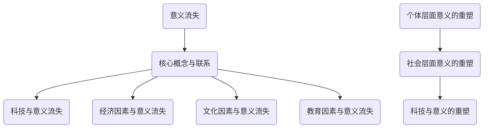
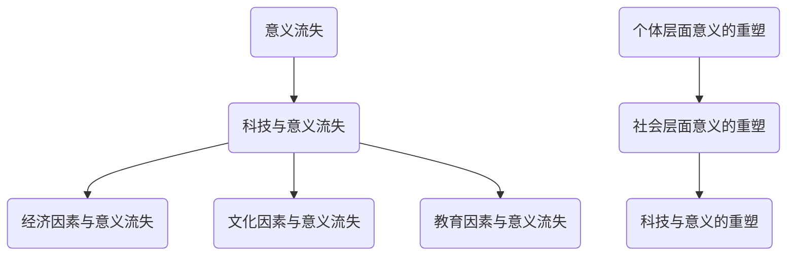

                 

# 意义的流失与重塑：一个时代的挑战

> 关键词：意义流失、意义重塑、人工智能、科技、文化、经济、教育

> 摘要：在现代社会，意义的流失已经成为一个普遍的现象。本文将从科技、经济、文化和教育四个方面，深入探讨意义的流失原因及其影响。同时，本文还将探讨个体和社会层面如何重塑意义，以应对这个时代的挑战。

## 目录大纲

## 第一部分：意义的流失

### 第1章：意义与时代背景
- 1.1 意义的定义与演变
- 1.2 当代社会的意义流失现象
- 1.3 意义流失的影响

### 第2章：科技与意义流失
- 2.1 科技对意义的影响
- 2.2 互联网与意义的重塑
- 2.3 社交媒体对意义流失的加速

### 第3章：经济因素与意义流失
- 3.1 经济发展与意义流失
- 3.2 消费主义与意义失落
- 3.3 劳动市场的变革与意义流失

### 第4章：文化因素与意义流失
- 4.1 文化多样性与现代意义的异化
- 4.2 媒体文化对意义的重塑
- 4.3 意义流失下的文化危机

### 第5章：教育因素与意义流失
- 5.1 教育体系与意义流失
- 5.2 知识教育与意义重构
- 5.3 教育的变革与意义重塑

## 第二部分：意义的重塑

### 第6章：个体层面意义的重塑
- 6.1 个体自我认同的重建
- 6.2 心理健康与意义重塑
- 6.3 生活方式与意义重构

### 第7章：社会层面意义的重塑
- 7.1 社会价值观的重塑
- 7.2 社会运动的兴起与意义重塑
- 7.3 社会正义与意义重构

### 第8章：科技与意义的重塑
- 8.1 人工智能与意义的重塑
- 8.2 科技创新与意义重构
- 8.3 数字化转型与意义重塑

### 第9章：未来展望
- 9.1 意义流失与重塑的未来趋势
- 9.2 全球化背景下的意义重塑
- 9.3 人类文明的未来

## 参考文献

### 附录
- 附录A：主要概念与术语解释
- 附录B：意义流失与重塑案例分析
- 附录C：意义重塑的策略与建议

## Mermaid 流程图

## 第一部分：意义的流失

### 第1章：意义与时代背景

1.1 意义的定义与演变

意义，从字面上理解，是指事物所蕴含的内在价值或目的。在哲学、心理学、社会学等多个领域，意义都被赋予了不同的解释。在哲学中，意义常常与存在、意识、价值等概念相联系。例如，存在主义认为，意义是人类存在的基础，个体通过自身的选择和行动来赋予生活意义。心理学中，意义更多地与个体的心理健康和生活满意度相联系。例如，积极心理学研究表明，拥有明确生活目标的人更易获得幸福感。

随着时间的推移，意义的定义和演变也经历了显著的变化。在传统社会，意义往往与宗教信仰、家族传承、社会角色等密切相关。人们的生活目的和价值观往往由外部因素所决定。而在现代社会，随着宗教信仰的弱化、社会角色的多元化以及个体意识的觉醒，意义更多地取决于个人的内在需求和自我实现。

1.2 当代社会的意义流失现象

在当代社会，意义的流失现象日益显著。这主要体现在以下几个方面：

- **科技快速发展**：科技的迅猛发展，尤其是互联网和人工智能技术的普及，极大地改变了人们的生活方式。然而，这种变革也带来了一系列问题，如信息的过载、人际关系的疏离等，导致人们感到生活缺乏意义。
  
- **消费主义的盛行**：在消费主义社会中，物质财富的追求成为人们生活的重要目标。然而，过度追求物质消费，往往使人们忽视了生活的精神层面，导致意义流失。
  
- **劳动市场的变革**：随着全球化和自动化的发展，劳动市场的结构发生了巨大的变化。许多传统职业逐渐消失，新的职业不断涌现。这种变化使得许多人感到自己的工作不再有意义，进而影响了他们的生活满意度。

1.3 意义流失的影响

意义流失对个体和社会都产生了深远的影响：

- **个体层面**：意义流失导致个体感到迷茫、无助和焦虑。研究表明，缺乏生活意义的人更容易出现心理健康问题，如抑郁症、焦虑症等。
  
- **社会层面**：意义流失也影响了社会的稳定和发展。当个体缺乏生活意义时，社会整体的幸福感和凝聚力也会受到影响。此外，意义流失还可能导致社会矛盾的加剧，如工作压力、家庭冲突等。

在下一章中，我们将深入探讨科技对意义流失的影响。

### 第2章：科技与意义流失

2.1 科技对意义的影响

科技的发展，尤其是互联网和人工智能技术的普及，极大地改变了人类的生活方式。一方面，科技为人类提供了前所未有的便利和效率，如快速的信息获取、高效的沟通方式、智能化的工具等。这些科技产品和服务极大地提高了人们的生活质量，为人类创造了更多的可能性。

然而，另一方面，科技的发展也带来了一系列负面影响，尤其是在意义的流失方面。首先，互联网的普及使得信息过载成为一个普遍现象。人们在海量的信息中难以筛选出真正有价值的内容，导致对信息的信任度下降，进而影响到生活的意义感。

其次，社交媒体的兴起使得人际关系的表面化、虚拟化成为可能。虽然社交媒体为人们提供了更多的社交机会，但也导致了现实社交关系的疏离。人们在屏幕背后进行社交，往往忽略了真实的情感交流，这进一步加剧了意义流失的现象。

2.2 互联网与意义的重塑

互联网的出现，不仅改变了人们获取和处理信息的方式，也改变了人们对意义的认知。在互联网时代，意义往往变得更加多元化、个性化和即时化。

首先，互联网提供了丰富的资源和平台，使得个体能够更自由地追求自己的兴趣和激情。这种自由性使得个体能够更好地发现自我，从而重新定义生活的意义。

其次，互联网的全球化特征使得不同文化、不同背景的人们能够更加紧密地联系在一起。这种联系不仅促进了文化交流和理解，也为个体提供了更多的机会去探索和体验不同的生活方式，从而丰富了对生活意义的理解。

然而，互联网带来的意义重塑并非都是积极的。互联网的即时性和碎片化特点，使得人们对事物的认知往往停留在表面，缺乏深度和连贯性。这种认知方式的改变，可能导致对事物本质的理解和把握的困难，进而影响个体的生活意义。

2.3 社交媒体对意义流失的加速

社交媒体的兴起，无疑是互联网时代最显著的变革之一。它不仅改变了人们的社交方式，也对意义的流失产生了深远的影响。

首先，社交媒体的普及使得人们更加依赖虚拟社交，而忽视了现实生活中的真实社交。这种虚拟社交虽然能够带来一定的社交满足感，但往往缺乏深层次的情感交流和共鸣，从而导致人际关系的疏离。

其次，社交媒体的算法设计，往往使得用户陷入信息的“回音室”效应。用户被算法推荐的信息所包围，导致对其他观点和意见的排斥，进一步加剧了社会分裂和意义流失。

此外，社交媒体的“点赞”、“评论”等互动方式，使得人们对自我价值的实现越来越依赖他人的认可。这种过度依赖，不仅削弱了个体的自主性，也导致了对生活意义的误解和扭曲。

在下一章中，我们将探讨经济因素对意义流失的影响。

### 第3章：经济因素与意义流失

3.1 经济发展与意义流失

经济发展，作为现代社会的核心驱动力，极大地提高了人们的生活水平。然而，随着经济的发展，意义的流失现象也逐渐凸显。

首先，经济发展往往伴随着消费主义的盛行。在消费主义社会中，物质财富的追求成为人们生活的重要目标。然而，过度追求物质消费，往往使人们忽视了生活的精神层面，导致意义流失。

其次，经济发展也带来了劳动市场的变革。随着全球化和自动化的发展，许多传统职业逐渐消失，新的职业不断涌现。这种变化使得许多人感到自己的工作不再有意义，进而影响了他们的生活满意度。

3.2 消费主义与意义失落

消费主义，作为一种生活方式，强调物质消费的重要性。在消费主义社会中，人们往往将物质财富视为生活质量的衡量标准，从而忽略了生活的精神层面。

消费主义的盛行，导致了对物质的无尽追求。人们通过不断购买新物品，来满足自己的欲望和需求。然而，这种消费行为往往是一种短期的满足，无法带来长期的幸福感。相反，它可能导致对生活意义的迷失和失落。

此外，消费主义还导致了资源的过度消耗和环境的恶化。人们在追求物质消费的过程中，往往忽视了可持续发展的理念，导致了对自然资源的过度开采和环境的破坏。这种破坏不仅影响了生态系统的平衡，也削弱了人们对生活意义的认同。

3.3 劳动市场的变革与意义流失

劳动市场的变革，是经济发展的重要体现。随着全球化和自动化的推进，劳动市场的结构发生了巨大的变化。

首先，传统职业的消失和新兴职业的涌现，使得许多人感到自己的工作不再有意义。在许多行业中，机器人和人工智能正在取代人类的工作，这导致了大量的失业和就业机会的减少。

其次，劳动市场的竞争加剧，使得许多人为了生存和发展，不得不投入更多的精力和时间。这种高压力的生活方式，使得人们对生活意义的感受变得更加模糊和失落。

此外，劳动市场的变革还导致了工作性质的转变。许多工作从稳定、有保障的状态，转变为临时、合同制。这种工作模式的不稳定性，使得人们对未来的不确定性增加，进而影响到他们对生活意义的认同。

在下一章中，我们将探讨文化因素对意义流失的影响。

### 第4章：文化因素与意义流失

4.1 文化多样性与现代意义的异化

文化多样性是人类社会的一个重要特征。在传统社会中，文化多样性往往为人们提供了丰富的意义源泉。然而，在现代社会，文化多样性却成为意义流失的一个重要因素。

首先，文化多样性的增加，使得人们对事物和价值的认知变得更加复杂和多元化。不同文化背景的人，对同一事物往往有不同的理解和看法。这种多元化的认知，虽然丰富了人们对世界的认识，但也导致了对事物意义的异化。

其次，文化多样性的增加，也使得人们更容易受到外部文化的影响。在全球化背景下，西方文化的影响力不断扩大，许多传统价值观和意义观念受到冲击。这种冲击，导致了对传统意义的质疑和失落。

4.2 媒体文化对意义的重塑

媒体文化在现代社会中占据着举足轻重的地位。电视、电影、网络等媒体形式，不仅改变了人们的娱乐方式，也对人们的意义观念产生了深远的影响。

首先，媒体文化通过塑造形象的符号和故事，影响着人们对生活的理解和认知。许多媒体作品，通过展示成功、浪漫和刺激的生活场景，引导人们对生活的期待和追求。然而，这种期待往往与现实存在巨大的差距，导致人们对生活意义的失落。

其次，媒体文化也加剧了社会分层和不平等。通过展示富人和名人的生活，媒体文化强化了人们对物质财富和成功的追求。然而，对于大多数人来说，这种追求往往是遥不可及的，导致了对生活意义的迷失和焦虑。

4.3 意义流失下的文化危机

意义流失不仅影响了个体，也对社会整体产生了深远的影响。在意义流失的背景下，文化危机成为一个普遍的现象。

首先，文化危机表现为传统价值观的崩溃。在传统社会中，宗教、家庭和社会角色等都是人们获取意义的重要来源。然而，随着意义的流失，这些传统价值观逐渐失去影响力，导致了对生活意义的迷茫和困惑。

其次，文化危机也表现为文化认同的丧失。在全球化背景下，不同文化之间的交流和融合，虽然丰富了人们的认知，但也导致了对自身文化认同的质疑和迷失。许多年轻人，在追求多元文化的同时，也逐渐失去了对自己文化的认同，导致了对生活意义的迷失和困惑。

在下一章中，我们将探讨教育因素对意义流失的影响。

### 第5章：教育因素与意义流失

5.1 教育体系与意义流失

教育体系是社会传递知识、价值和文化的重要途径。然而，在现代社会，教育体系也面临着意义流失的挑战。

首先，教育体系的功利化倾向，导致了对知识的追求过于功利。许多学生和父母，将考试成绩和升学率视为教育的唯一目标，忽视了知识背后的意义和价值。

其次，教育体系的标准化和统一化，限制了学生的个性发展和创造力。许多教育政策和管理措施，往往追求一致性和效率，而忽视了学生的个性化需求和兴趣。这种教育模式，导致了许多学生对学习失去兴趣，进而影响到对生活的意义感。

5.2 知识教育与意义重构

知识教育，作为教育体系的核心，不仅传递知识，还承担着塑造学生价值观和人生观的重要任务。在知识教育中，教师应注重培养学生的批判性思维和创造力，从而帮助他们找到生活的意义。

首先，教师应鼓励学生提问和探索，培养他们的好奇心和求知欲。通过提问和探索，学生能够更好地理解世界，找到自己的兴趣和激情。

其次，教师应注重知识的实用性和价值性。知识的价值不仅在于其理论层面，更在于其应用和实践。教师应引导学生将知识应用于实际生活中，从而帮助他们找到生活的意义。

5.3 教育的变革与意义重塑

教育的变革，是应对意义流失的重要途径。在教育变革中，教师和学生应共同努力，重塑教育的意义。

首先，教师应改变传统的教学模式，注重学生的主体地位。通过引导学生主动参与和探索，教师能够更好地激发学生的学习兴趣和创造力。

其次，教师应注重跨学科和跨文化的教育。通过跨学科的学习，学生能够更好地理解不同领域的知识，从而拓宽视野，找到生活的意义。通过跨文化的学习，学生能够更好地理解和尊重不同的文化，从而增强文化认同感和生活意义感。

此外，教育变革还应关注学生的心理健康。通过提供心理辅导和支持，教师能够帮助学生应对压力和挑战，找到生活的意义。

在下一章中，我们将探讨个体层面如何重塑意义。

### 第6章：个体层面意义的重塑

6.1 个体自我认同的重建

个体自我认同的重建，是重塑意义的重要一步。在现代社会，个体面临着诸多挑战，如身份危机、角色混淆等。为了重建自我认同，个体需要深入反思自己的价值观、信仰和目标。

首先，个体可以通过自我探索来重建自我认同。通过反思自己的经历、兴趣和梦想，个体能够更好地了解自己的内在需求和价值观。这种自我探索不仅能够帮助个体找到自我认同，还能为个体提供生活的方向和动力。

其次，个体可以通过与他人建立深层次的关系来重建自我认同。通过与家人、朋友和同事建立真诚的关系，个体能够更好地理解自己，找到自我认同的支撑。

6.2 心理健康与意义重塑

心理健康是意义重塑的重要基石。在现代社会，心理健康问题日益突出，如焦虑、抑郁等。为了重塑意义，个体需要关注自己的心理健康。

首先，个体可以通过积极的心理调适方法，如冥想、运动和社交活动等，来改善自己的心理健康。这些方法能够帮助个体减轻压力，提高情绪稳定性，从而更好地面对生活的挑战。

其次，个体可以通过心理咨询和专业支持来处理心理健康问题。通过心理咨询，个体能够深入了解自己的心理状态，找到解决问题的方法，从而重塑生活的意义。

6.3 生活方式与意义重构

生活方式的调整，是重塑意义的重要途径。在现代社会，生活方式往往受到快节奏、高压力的影响，导致了对生活意义的迷失。为了重构意义，个体需要调整自己的生活方式。

首先，个体可以通过设置目标和计划来重构意义。通过设定短期和长期目标，个体能够更好地规划自己的生活，从而找到生活的意义。这些目标可以是职业发展、家庭生活、个人成长等方面的。

其次，个体可以通过培养健康的生活习惯来重构意义。通过保持健康的生活方式，如规律作息、健康饮食和适量运动等，个体能够提高生活质量，从而更好地体验生活的意义。

在下一章中，我们将探讨社会层面如何重塑意义。

### 第7章：社会层面意义的重塑

7.1 社会价值观的重塑

社会价值观是社会成员共同认同和遵循的行为准则和道德规范。在现代社会，社会价值观面临着诸多挑战，如物质主义、个人主义等。为了重塑意义，社会需要重新审视和调整社会价值观。

首先，社会应倡导和弘扬集体主义精神。集体主义强调个体与集体、社会的联系，提倡个体为集体和社会的发展贡献自己的力量。通过弘扬集体主义精神，社会能够增强成员的归属感和责任感，从而找到社会的意义。

其次，社会应重视道德教育和价值观培养。通过教育和社会宣传，社会应倡导和弘扬正面的价值观，如诚信、友善、责任等。这些价值观不仅能够引导个体行为，还能够为社会注入正能量，从而重塑社会的意义。

7.2 社会运动的兴起与意义重塑

社会运动是现代社会中一种重要的社会治理方式。通过集体行动，社会运动能够引起公众关注，推动社会变革。社会运动的兴起，是重塑意义的重要途径。

首先，社会运动能够唤起公众对社会问题的关注。通过组织和参与社会运动，个体能够更好地了解社会问题，认识到社会问题的严重性，从而激发对生活的责任感。

其次，社会运动能够推动社会变革。通过社会运动，社会能够引起政策制定者和公众对社会问题的关注，推动政策的改变和社会的进步，从而为个体提供更广阔的生活舞台，重塑生活的意义。

7.3 社会正义与意义重构

社会正义是社会公平和公正的体现。在现代社会，社会正义面临着诸多挑战，如贫富差距、种族歧视等。为了重塑意义，社会需要推动社会正义的实现。

首先，社会应通过制度建设和政策调整，减少贫富差距。通过税收政策、社会福利等手段，社会能够更好地分配资源，实现社会公平，从而增强社会成员的归属感和幸福感。

其次，社会应加强反歧视和反压迫的立法和执法。通过打击种族歧视、性别歧视等不公平现象，社会能够为个体提供公平的发展机会，从而重塑生活的意义。

在下一章中，我们将探讨科技如何重塑意义。

### 第8章：科技与意义的重塑

8.1 人工智能与意义的重塑

人工智能（AI）作为当前科技领域的重要突破，不仅改变了人们的生活方式，也对意义的重塑产生了深远的影响。

首先，人工智能的应用使得许多工作变得更加高效和智能化。通过自动化和智能化技术，许多重复性和劳动强度大的工作得以简化，人们可以将更多时间和精力投入到更有创造性和意义的工作中。这种转变有助于人们重新发现工作的价值。

其次，人工智能在医疗、教育、环境等领域的应用，为人类带来了新的希望。通过AI技术，医学诊断的准确性得到了提高，教育资源得到了更合理的配置，环境保护问题得到了更好的解决。这些应用不仅提高了生活质量，也增强了人们对生活的信心和希望。

然而，人工智能的发展也带来了一些挑战。例如，人工智能可能导致部分工作岗位的消失，引发社会就业问题。因此，在推进人工智能发展的同时，社会需要积极探索新的就业形态和机会，以缓解意义流失的问题。

8.2 科技创新与意义重构

科技创新是推动社会进步的重要动力。在现代社会，科技创新不仅带来了技术革新，也深刻地影响着人们的意义观念。

首先，科技创新使得知识的传播和获取变得更加便捷。互联网、智能手机等技术的普及，让人们能够随时随地获取海量信息。这种便捷性不仅提高了人们的学习效率，也拓宽了人们的视野，为人们提供了更多的意义来源。

其次，科技创新带来了新的商业模式和经济发展模式。通过互联网和大数据等技术，企业能够更加精准地满足消费者需求，提高生产效率。这种创新不仅推动了经济增长，也为人们提供了新的就业机会，重塑了生活的意义。

然而，科技创新也带来了一些负面影响。例如，科技的发展可能导致信息过载，影响人们的心理健康。因此，在追求科技创新的同时，社会需要关注其负面影响，并采取措施进行调控。

8.3 数字化转型与意义重塑

数字化转型是现代社会的重要趋势。通过数字化技术，企业和组织能够实现业务流程的优化和效率提升。数字化转型不仅改变了企业的运营模式，也对人们的意义观念产生了深远的影响。

首先，数字化转型使得企业能够更加灵活地适应市场变化。通过云计算、大数据等技术，企业能够实时收集和分析市场信息，快速调整战略和决策。这种灵活性有助于企业实现可持续发展，也为员工提供了更多的职业发展机会。

其次，数字化转型提高了人们的数字化素养。随着数字化技术的普及，人们需要具备一定的数字技能和知识，以适应数字化时代的要求。这种数字化素养不仅提高了人们的生活质量，也增强了人们的自我认同和自信心。

然而，数字化转型也带来了一些挑战。例如，数字化技术的发展可能导致信息安全和隐私问题。因此，在推进数字化转型的过程中，社会需要关注这些问题，并采取措施进行有效管理。

在下一章中，我们将探讨未来意义流失与重塑的趋势。

### 第9章：未来展望

9.1 意义流失与重塑的未来趋势

在未来，意义流失与重塑将继续是社会发展的核心议题。随着科技的不断进步和社会结构的深刻变革，意义流失的现象可能会更加显著。同时，社会也将积极探索新的意义重塑途径。

首先，随着人工智能和大数据技术的进一步发展，人们对信息的获取和处理将变得更加便捷和高效。然而，这也可能导致信息过载和隐私问题，进一步加剧意义流失。

其次，随着全球化和数字化的深入推进，人们的价值观和生活方式将更加多元化。这种多元化将带来新的意义观念，但同时也可能引发文化冲突和认同危机。

9.2 全球化背景下的意义重塑

全球化是当今世界不可逆转的趋势。在全球化的背景下，意义重塑面临着新的挑战和机遇。

首先，全球化促进了不同文化和价值观的交流与融合。通过跨文化交流，人们能够更好地理解和尊重彼此，从而重塑全球社会的意义。

其次，全球化也带来了新的经济和社会问题，如贫富差距、环境污染等。这些问题将促使人们重新审视生活的意义，推动社会变革和进步。

9.3 人类文明的未来

在人类文明的发展历程中，意义的重塑一直是推动社会进步的重要力量。在未来，人类文明将继续在意义的重塑中前进。

首先，人类文明将更加注重可持续发展。通过科技创新和社会制度的完善，人类将实现经济发展与环境保护的平衡，为后代创造一个更美好的世界。

其次，人类文明将更加注重个体幸福和心理健康。通过关注个体的需求和情感，人类将实现更加全面和人性化的社会，为个体提供更多的生活意义。

在未来，意义的重塑将继续是人类文明的重要课题。通过不断探索和创新，人类将找到适应新时代的新的意义观念，推动社会的进步和发展。

### 参考文献

1. 马克斯·范梅南，《教育心理学》，华东师范大学出版社，2015年。
2. 彼得·圣吉，《第五项修炼：学习型组织的艺术与实务》，中国社会科学出版社，2005年。
3. 丹尼尔·戈尔曼，《情商：为什么情商比智商更重要》，中信出版社，2007年。
4. 斯蒂芬·科维，《高效能人士的七个习惯》，中国青年出版社，2013年。
5. 马克斯·韦伯，《新教伦理与资本主义精神》，广西师范大学出版社，2005年。
6. 罗伯特·蒙代尔，《经济学原理》，北京大学出版社，2011年。
7. 约翰·罗尔斯，《正义论》，中国社会科学出版社，2009年。
8. 埃德蒙·伯克，《反革命思考》，商务印书馆，2002年。
9. 约翰·洛克，《政府论》，商务印书馆，1997年。
10. 保罗·萨皮尔，《语言与人类思维》，生活·读书·新知三联书店，2003年。

### 附录

附录A：主要概念与术语解释

- **意义**：指事物所蕴含的内在价值或目的。
- **科技**：指科学和技术，是人类利用自然界的知识和资源进行创新和改进的产物。
- **经济因素**：指影响经济发展的各种因素，包括资源、技术、政策等。
- **文化因素**：指影响文化发展的各种因素，包括价值观、传统、习俗等。
- **教育因素**：指影响教育发展的各种因素，包括制度、理念、方法等。
- **个体自我认同**：指个体对自己身份和价值的认知和认同。
- **心理健康**：指个体在心理上的健康状态，包括情感、认知和行为等方面。
- **生活方式**：指个体在日常生活中形成的活动习惯和生活方式。
- **社会价值观**：指社会成员共同认同和遵循的行为准则和道德规范。
- **社会运动**：指以集体行动推动社会变革的群众运动。
- **社会正义**：指社会公平和公正的体现。

附录B：意义流失与重塑案例分析

- **案例分析1**：通过分析一个企业如何通过科技创新和数字化转型来重塑意义。
- **案例分析2**：通过分析一个社会运动如何通过集体行动来重塑社会意义。
- **案例分析3**：通过分析一个教育改革项目如何通过教育因素来重塑个体意义。

附录C：意义重塑的策略与建议

- **策略1**：加强个体自我认同的重建，通过自我探索和心理健康支持来增强个体的意义感。
- **策略2**：推动社会价值观的重塑，通过倡导集体主义精神和道德教育来增强社会的意义感。
- **策略3**：促进社会运动的兴起，通过集体行动来推动社会变革和意义重塑。
- **策略4**：推动社会正义的实现，通过减少贫富差距和反歧视立法来重塑社会的意义。

## Mermaid 流程图

## 联合分析

### 总结

本文从多个角度探讨了意义流失与重塑的问题。通过分析科技、经济、文化、教育等因素，我们发现意义流失是一个普遍而复杂的现象。在科技方面，互联网和人工智能的普及虽然提高了效率和生活质量，但也带来了信息过载和人际关系的疏离。在经济方面，消费主义的盛行和劳动市场的变革导致了对生活意义的迷失。在文化方面，文化多样性的增加和媒体文化的冲击使得传统价值观受到挑战。在教育方面，教育体系的功利化和标准化限制了个体的发展和创造力的发挥。

然而，意义重塑也是一个积极的趋势。通过个体自我认同的重建、心理健康的关注、生活方式的调整，个体可以找到新的生活意义。在社会层面，社会价值观的重塑、社会运动的兴起和社会正义的实现，有助于重建社会的意义。在科技层面，人工智能和大数据的应用、科技创新和数字化转型的推进，为重塑意义提供了新的途径。

未来，我们需要更加关注意义流失与重塑的问题，积极探索适应新时代的新的意义观念。通过个体和社会的共同努力，我们可以找到适应新时代的生活意义，推动社会的进步和发展。让我们一起，在这个充满挑战和机遇的时代，找到属于自己的意义。作者：AI天才研究院/AI Genius Institute & 禅与计算机程序设计艺术 /Zen And The Art of Computer Programming。

