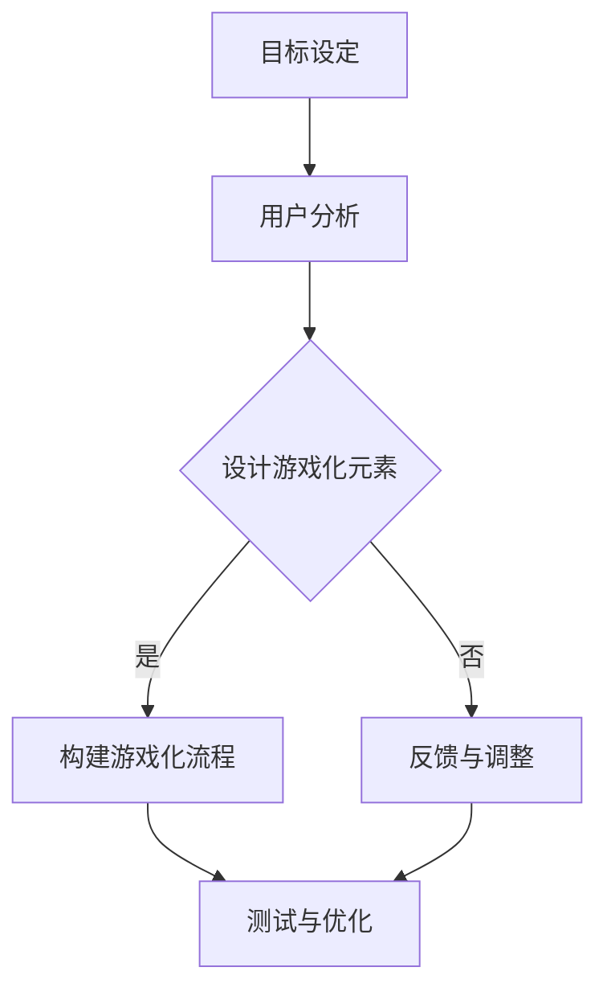
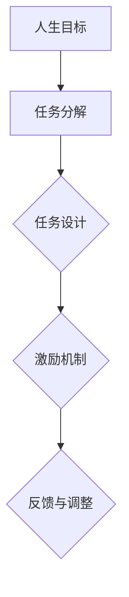

                 

# 意义的游戏化设计：将人生目标转化为任务

> 关键词：游戏化设计、人生目标、任务、激励、心理学

> 摘要：本文深入探讨了游戏化设计的概念、价值及其与人生目标的关联，提出了将人生目标转化为任务的方法和策略。通过剖析游戏化设计的方法与工具，结合心理学原理，本文旨在为读者提供一套系统化的游戏化设计实践指南，帮助人们更有效地实现人生目标。

## 目录大纲

1. **游戏化设计概述**
   1.1 游戏化的概念与价值
   1.2 游戏化设计与人生目标的关联
   1.3 将人生目标转化为游戏化任务的策略

2. **游戏化设计方法与工具**
   2.1 游戏化设计框架
   2.2 任务设计与激励机制
   2.3 游戏化设计与心理学

3. **游戏化设计实践**
   3.1 个人游戏化实践
   3.2 企业游戏化实践

4. **游戏化设计的前景与挑战**
   4.1 社会影响
   4.2 挑战与对策

5. **游戏化设计资源与工具**
   5.1 游戏化设计资源
   5.2 相关术语解释
   5.3 Mermaid流程图

6. **Python代码示例**

7. **最佳实践、小结与注意事项**

## 第一部分：游戏化设计概述

### 1.1 游戏化的概念与价值

游戏化设计（Gamification Design）是将游戏元素和机制应用于非游戏环境，以增强用户参与度和提高效率的一种设计方法。它起源于游戏设计，但逐渐应用于营销、教育、企业管理等多个领域。

游戏化设计的核心价值在于激发用户参与，提高任务完成率，增强用户忠诚度。其原理是通过引入游戏机制，如得分、排名、奖励等，使得原本枯燥、繁琐的任务变得有趣、有挑战性。这种设计方法能够满足人们追求成就、竞争和社交的需求。

### 1.2 游戏化设计与人生目标的关联

人生目标（Life Goals）是指个体希望实现的长远、有意义的目标，如财富自由、家庭幸福、职业成功等。游戏化设计能够帮助人们更好地实现这些目标，其关联点主要体现在以下几个方面：

1. **明确目标**：游戏化设计强调目标的明确性和具体化，通过设定可量化的任务和里程碑，使得人生目标更加具体、可操作。
2. **激励机制**：游戏化设计引入了各种激励手段，如奖励、成就、排名等，这些机制能够激发个体的积极性，提高目标达成的动力。
3. **持续反馈**：游戏化设计提供了持续的反馈机制，帮助个体了解自己的进展，调整策略，保持目标追求的动力。
4. **社交互动**：游戏化设计中的社交元素能够增强个体之间的互动，形成支持性社区，共同追求目标。

### 1.3 将人生目标转化为游戏化任务的策略

要将人生目标转化为游戏化任务，可以遵循以下策略：

1. **目标分解**：将人生目标分解为一系列可操作的子任务，每个子任务都对应一个具体的目标和里程碑。
2. **任务设计**：为每个子任务设计一个有趣、有挑战性的任务描述，引入游戏机制，如得分、奖励等。
3. **激励机制**：根据任务完成情况，设计相应的奖励机制，如物质奖励、虚拟奖励、成就感等。
4. **反馈与调整**：提供持续的反馈机制，帮助个体了解进展，并根据反馈调整策略，保持目标追求的动力。

## 第二部分：游戏化设计方法与工具

### 2.1 游戏化设计框架

游戏化设计框架是指导游戏化设计过程的一系列步骤和方法。一个典型的游戏化设计框架包括以下几个阶段：

1. **目标设定**：明确游戏化设计的目标和预期成果。
2. **用户分析**：分析目标用户的需求、动机和行为模式。
3. **设计游戏化元素**：确定游戏化元素，如任务、奖励、排名等。
4. **构建游戏化流程**：设计游戏化流程，确保用户能够按照既定的路径完成任务。
5. **测试与优化**：通过用户测试，收集反馈，不断优化游戏化设计。

### 2.2 任务设计与激励机制

任务设计是游戏化设计的关键环节。一个有效的任务设计应该具备以下几个特点：

1. **具体明确**：任务描述应该清晰、具体，让用户知道需要做什么。
2. **有挑战性**：任务应该具有一定的难度，激发用户的挑战欲望。
3. **可量化**：任务完成情况应该能够量化，以便进行评估和奖励。

激励机制是游戏化设计的重要组成部分。激励机制的设计应该遵循以下几个原则：

1. **适当性**：激励手段应该与任务性质和用户需求相匹配。
2. **多样性**：激励手段应该多样化，以满足不同用户的偏好。
3. **及时性**：激励手段应该及时给予，以增强用户参与度。

### 2.3 游戏化设计与心理学

游戏化设计与心理学有着紧密的联系。心理学原理能够为游戏化设计提供指导，使其更加有效。以下是一些心理学原理在游戏化设计中的应用：

1. **成就动机**：通过设置成就目标和奖励机制，激发用户的成就动机。
2. **自我决定理论**：通过赋予用户更多的自主权，提高其参与度和满意度。
3. **行为心理学**：通过奖励和惩罚机制，引导用户形成良好的行为习惯。
4. **认知心理学**：通过设计有趣、有挑战性的任务，提高用户的认知参与度。

## 第三部分：游戏化设计实践

### 3.1 个人游戏化实践

个人游戏化实践是将游戏化设计应用于个人目标和任务的实现。以下是一个个人游戏化实践的示例：

1. **目标设定**：设定一个具体的人生目标，如“在一年内减重20公斤”。
2. **任务分解**：将目标分解为每周减重1公斤的任务。
3. **任务设计**：为每个任务设计一个具体的行动计划，如每周进行五次运动，控制饮食等。
4. **激励机制**：设定每周减重1公斤的奖励，如购买心仪的物品或享受一次美食。
5. **反馈与调整**：定期记录体重变化，根据实际情况调整行动计划。

### 3.2 企业游戏化实践

企业游戏化实践是将游戏化设计应用于企业目标和任务的实现。以下是一个企业游戏化实践的示例：

1. **目标设定**：设定一个具体的企业目标，如“提高员工的工作满意度”。
2. **任务分解**：将目标分解为一系列具体的任务，如改善员工福利、提供培训机会等。
3. **任务设计**：为每个任务设计一个具体的行动计划，如定期组织团建活动、提供在线培训课程等。
4. **激励机制**：为任务完成情况设计奖励机制，如评选“最佳员工”或提供奖金。
5. **反馈与调整**：定期收集员工反馈，根据反馈调整任务设计和激励机制。

## 第四部分：游戏化设计的前景与挑战

### 4.1 社会影响

游戏化设计在社会生活中有着广泛的应用前景。它不仅能够提高个体的自我管理和目标实现能力，还能够促进企业和社会的可持续发展。然而，游戏化设计也带来了一些伦理和道德问题，如过度依赖游戏机制、数据隐私问题等。因此，在推广游戏化设计的同时，需要关注其潜在的风险和挑战。

### 4.2 挑战与对策

游戏化设计面临的主要挑战包括：

1. **设计复杂性**：游戏化设计需要综合考虑用户需求、任务性质、激励机制等多方面因素，设计过程较为复杂。
2. **实施难度**：游戏化设计需要一定的时间和资源投入，实施过程中可能面临困难。
3. **效果评估**：游戏化设计的实际效果难以量化，需要建立有效的评估体系。

为应对这些挑战，可以采取以下对策：

1. **科学设计**：遵循游戏化设计框架，进行系统化、科学化的设计。
2. **灵活调整**：在实施过程中，根据实际情况灵活调整设计，以适应变化。
3. **持续评估**：建立持续评估机制，及时发现问题，进行调整和优化。

## 第五部分：游戏化设计资源与工具

### 5.1 游戏化设计资源

1. **书籍推荐**：
   - 《游戏化思维：如何通过游戏元素让工作、生活、教育变得充满乐趣》（Reality is Broken: Why Games Make Us Better and How They Can Change the World）
   - 《游戏化设计实战：创造吸引人的数字体验》（Game-Based Marketing: Inspire Customer Loyalty Through Gamification）

2. **在线课程**：
   - Coursera的“游戏化设计”课程
   - Udemy的“游戏化设计：从入门到精通”

3. **工具介绍**：
   - Game Mechanics Creator：一款在线游戏机制设计工具。
   - Incentivio：一款面向企业的游戏化平台。

### 5.2 相关术语解释

1. **游戏化设计**：将游戏元素和机制应用于非游戏环境的设计方法。
2. **成就动机**：个体追求成就的内在动力。
3. **自我决定理论**：个体追求自主性和自我实现的心理学理论。
4. **行为心理学**：研究行为及其影响因素的心理学分支。

### 5.3 Mermaid流程图

以下是一个简单的游戏化设计流程图的示例：



### 5.4 Python代码示例

以下是一个简单的任务设计与激励机制代码示例：

```python
# 任务设计与激励机制示例

# 定义任务
tasks = {
    "任务1": {"description": "完成每日跑步", "points": 10},
    "任务2": {"description": "阅读一篇技术文章", "points": 20},
    "任务3": {"description": "学习30分钟编程", "points": 15}
}

# 激励机制：根据完成任务的数量发放奖励
def reward(points):
    if points >= 50:
        return "奖励：一次免费按摩"
    elif points >= 30:
        return "奖励：一份甜品"
    else:
        return "继续努力！"

# 完成任务
points = 0
points += tasks["任务1"]["points"]
points += tasks["任务2"]["points"]
points += tasks["任务3"]["points"]

# 打印奖励
print(reward(points))
```

## 附录

### 附录A：游戏化设计资源

- **书籍推荐**：
  - 《游戏化思维：如何通过游戏元素让工作、生活、教育变得充满乐趣》（Reality is Broken: Why Games Make Us Better and How They Can Change the World）
  - 《游戏化设计实战：创造吸引人的数字体验》（Game-Based Marketing: Inspire Customer Loyalty Through Gamification）

- **在线课程**：
  - Coursera的“游戏化设计”课程
  - Udemy的“游戏化设计：从入门到精通”

- **工具介绍**：
  - Game Mechanics Creator：一款在线游戏机制设计工具。
  - Incentivio：一款面向企业的游戏化平台。

### 附录B：相关术语解释

- **游戏化设计**：将游戏元素和机制应用于非游戏环境的设计方法。
- **成就动机**：个体追求成就的内在动力。
- **自我决定理论**：个体追求自主性和自我实现的心理学理论。
- **行为心理学**：研究行为及其影响因素的心理学分支。

### 附录C：Mermaid流程图

- **游戏化设计流程图**：


- **人生目标与游戏化任务关联图**：



### 附录D：Python代码示例

- **任务设计与激励机制代码示例**：

```python
# 任务设计与激励机制示例

# 定义任务
tasks = {
    "任务1": {"description": "完成每日跑步", "points": 10},
    "任务2": {"description": "阅读一篇技术文章", "points": 20},
    "任务3": {"description": "学习30分钟编程", "points": 15}
}

# 激励机制：根据完成任务的数量发放奖励
def reward(points):
    if points >= 50:
        return "奖励：一次免费按摩"
    elif points >= 30:
        return "奖励：一份甜品"
    else:
        return "继续努力！"

# 完成任务
points = 0
points += tasks["任务1"]["points"]
points += tasks["任务2"]["points"]
points += tasks["任务3"]["points"]

# 打印奖励
print(reward(points))
```

### 最佳实践、小结与注意事项

- **最佳实践**：
  - 明确目标：确保人生目标具体、明确，便于分解为游戏化任务。
  - 设计有趣的任务：任务应具有挑战性和趣味性，提高用户参与度。
  - 适当激励：根据任务完成情况，给予适当的奖励，增强用户动力。
  - 持续反馈：提供持续的反馈机制，帮助用户了解进展，保持目标追求的动力。

- **小结**：
  - 游戏化设计是一种有效的方法，将人生目标转化为任务，通过激励和反馈机制，帮助人们更好地实现目标。
  - 个人和企业都可以通过游戏化设计，提高工作效率和用户满意度。

- **注意事项**：
  - 设计游戏化任务时，要充分考虑用户需求和任务性质，确保任务的趣味性和挑战性。
  - 激励机制的设计要公平、合理，避免过度依赖奖励，影响目标的长期实现。
  - 定期评估和优化游戏化设计，确保其能够持续激发用户参与和动力。

