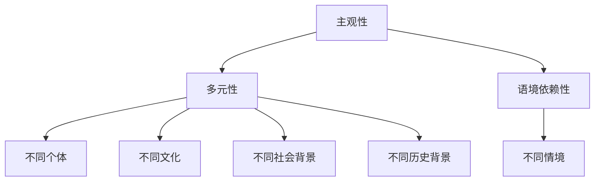
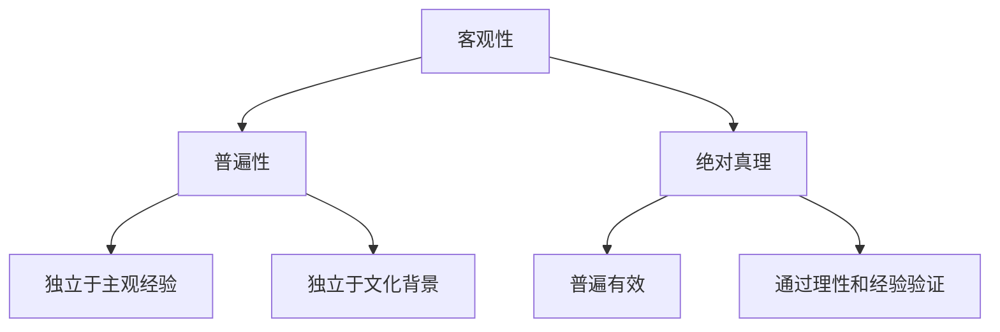

                 

### 文章标题

# 《意义的相对主义与绝对主义之争》

意义是人类认知与思考的核心问题之一，它关乎我们对世界的理解、价值观的构建以及知识的获取。在哲学领域，关于意义的问题长期以来存在着两大对立的理论体系：相对主义和绝对主义。相对主义强调意义是主观的、多元的，而绝对主义则主张意义是客观的、普遍的。本文将深入探讨这两种理论的本质、联系与区别，并通过实际案例和现代哲学视角的分析，展现它们在现代社会的应用和影响。

---

#### 关键词

- 相对主义
- 绝对主义
- 主观意义
- 客观意义
- 哲学理论
- 现代应用

#### 摘要

本文首先介绍了相对主义和绝对主义的基本概念及其起源，随后分析了它们的核心观点和理论架构。接着，通过具体的实际案例探讨了这两种理论在社会、政治和伦理学领域中的应用。最后，从现代哲学的视角重新审视了相对主义和绝对主义，提出了未来的发展方向和可能的研究课题。文章旨在为读者提供一个全面、深入的理解，以帮助他们在多元化的知识体系中定位意义的问题。

## 引言

意义，作为一个哲学上的核心问题，自古以来就吸引着无数哲学家的关注与探讨。关于意义的理解，哲学领域内存在着相对主义和绝对主义两大对立的理论体系。相对主义认为意义是主观的、多元的，依赖于个体的经验和语境；而绝对主义则主张意义是客观的、普遍的，超越个体和文化的限制。这两种理论不仅深刻影响了哲学的发展，也在现代社会中广泛渗透，成为我们理解世界的重要视角。

### 1.1 书籍背景

本文基于《意义的相对主义与绝对主义之争》一书，旨在深入探讨这两种哲学理论的历史、现状和未来发展。该书由著名哲学家约翰·S·哈贝马斯撰写，是哲学界关于意义问题的重要研究之一。本书通过对相对主义和绝对主义的系统分析，揭示了这两种理论在历史和当代哲学中的地位与作用，为读者提供了一个全面理解意义问题的框架。

### 1.2 研究目的

本文的研究目的在于：

1. 系统阐述相对主义和绝对主义的基本概念和理论架构。
2. 探讨这两种理论在历史发展和现代社会中的实际应用。
3. 分析相对主义和绝对主义之间的联系与区别。
4. 从现代哲学视角重新审视这两种理论，探讨其在未来可能的发展方向。

### 1.3 研究方法

本文采用的方法包括：

1. 文献综述：通过阅读相关哲学著作和学术论文，系统梳理相对主义和绝对主义的理论发展。
2. 案例分析：选取具体的社会、政治和伦理学案例，分析相对主义和绝对主义的应用与影响。
3. 对比分析：比较相对主义和绝对主义的核心观点和理论架构，揭示它们之间的联系与区别。
4. 现代哲学视角审视：从现代哲学的角度重新审视相对主义和绝对主义，探讨其在当代哲学中的地位和作用。

通过以上方法，本文力图提供一个全面、深入的理解，以帮助读者更好地把握意义的相对主义与绝对主义之争。

## 第1章 相对主义概述

相对主义是一种哲学观点，强调意义的相对性，即意义并非固定不变，而是依赖于特定的个体、文化、历史和社会环境。相对主义的核心理念是主观性和多元性，它认为不同的人和文化背景会对同一事物产生不同的理解和解释。相对主义哲学家的观点各异，但总体上可以归纳为以下几种主要的流派。

### 1.1 相对主义的起源与发展

相对主义的思想可以追溯到古代哲学，尤其是古希腊时期。例如，柏拉图和亚里士多德都曾探讨过知识的主观性和多元性。然而，相对主义的现代形式主要起源于19世纪和20世纪初。在这一时期，许多哲学家开始批判传统的绝对主义观点，强调个体经验和文化背景对意义建构的影响。

**1.1.1 古代相对主义思想**

在古希腊哲学中，相对主义的萌芽可以在普罗塔戈拉（Protagoras）的思想中找到。普罗塔戈拉提出了“人是万物的尺度”这一观点，认为真理和知识是相对的，取决于个体的感知和经验。这一观点对后来的哲学发展产生了深远的影响。

**1.1.2 中世纪相对主义思想**

中世纪的相对主义思想主要体现在宗教哲学中。例如，托马斯·阿奎那（Thomas Aquinas）在其哲学体系中认为，人的理性是有限的，因此对某些问题的理解具有相对性。

**1.1.3 近代相对主义思想**

近代哲学中，笛卡尔（René Descartes）提出了“我思故我在”的观点，强调个体主观性的重要性。然而，更具代表性的是康德（Immanuel Kant）的批判哲学。康德认为，我们对世界的认识是通过先验的认知形式和经验综合而成的，因此知识的相对性是不可避免的。

### 1.2 主要相对主义哲学家及其观点

**1.2.1 基本相对主义**

基本相对主义是相对主义的一种形式，它主张所有知识和真理都是相对的，不存在绝对的、普遍有效的真理。这种观点在20世纪的哲学家如维特根斯坦（Ludwig Wittgenstein）和福柯（Michel Foucault）中有所体现。

- **维特根斯坦**：维特根斯坦认为，语言的含义是依赖于使用者和情境的，因此，不同的语言游戏（language game）会有不同的意义。他的观点被称为“语言相对论”。

- **福柯**：福柯在其著作《词与物》中提出，知识是权力关系的产物，因此，不同的社会和文化背景下，知识的产生和传播具有相对性。

**1.2.2 批判性相对主义**

批判性相对主义强调对绝对主义观点的批判，主张多元文化和社会背景对知识的建构和解释具有重要影响。这种观点在哲学、社会学和文化研究等领域得到了广泛应用。

- **彼得·伯格（Peter Berger）和托马斯·卢克曼（Thomas Luckmann）**：他们在其著作《现实的构成》中提出，社会现实是通过人们的共同参与和互动构建出来的，因此，不同的文化和社会背景会产生不同的现实。

**1.2.3 强调相对主义的观点**

强调相对主义的观点认为，尽管知识具有相对性，但并不意味着我们不能进行有效的交流和沟通。这种观点强调通过对话和互动来理解和尊重不同文化和观点。

- **杰拉尔·图尔敏（Gerard Turpin）**：图尔敏认为，尽管不同的文化和社会背景会导致知识的不一致性，但通过批判性思维和理性对话，我们可以找到共识和真理。

通过以上对相对主义的起源和主要哲学家观点的概述，我们可以看到，相对主义作为一种哲学观点，具有丰富的历史背景和多样的理论流派。它强调主观性和多元性，对现代社会中意义的理解和知识建构产生了重要影响。

### 1.3.1 核心概念与联系

相对主义的核心概念在于“主观性”和“多元性”。它认为，意义并非绝对存在，而是依赖于个体的感知、经验和语境。具体来说，以下是相对主义概念之间的关系架构：

- **主观性**：主观性是指个体的感知、经验和情感对意义构建的影响。相对主义认为，每个人的知识和理解都是基于自身的经验，因此，不同的个体会对同一事物产生不同的理解和解释。

- **多元性**：多元性是指意义的多样性。相对主义认为，不同的文化、社会和历史背景会导致不同的意义建构，因此，意义并非单一和固定的。

- **语境依赖性**：语境依赖性是指意义的理解依赖于特定的情境和背景。相对主义认为，不同的语境会导致不同的意义解读，因此，脱离具体语境来谈论意义是不准确的。

以下是相对主义概念之间的关系架构的Mermaid流程图表示：



### 1.3.2 核心算法原理讲解

相对主义在哲学领域中的应用，可以通过一些具体的算法原理来解释。以下是一个使用Python源代码示例，展示了如何通过个体经验和文化背景来构建和解读意义的过程：

```python
class MeaningBuilder:
    def __init__(self, individual_experience, cultural_context):
        self.individual_experience = individual_experience
        self.cultural_context = cultural_context

    def build_meaning(self, object):
        personal Meaning = self.individual_experience[object]
        cultural_Meaning = self.cultural_context[object]
        final_Meaning = self.resolve_conflicts(Personal_Meaning, cultural_Meaning)
        return final_Meaning

    def resolve_conflicts(self, personal_meaning, cultural_meaning):
        if personal_meaning == cultural_meaning:
            return personal_meaning
        else:
            return "Ambiguous Meaning"

# 示例数据
individual_experience = {
    "tree": "自然的一部分",
    "sky": "广阔的天空"
}

cultural_context = {
    "tree": "生命的象征",
    "sky": "天空的主宰"
}

# 创建MeaningBuilder实例
builder = MeaningBuilder(individual_experience, cultural_context)

# 构建意义
meaning = builder.build_meaning("tree")

print(mea

``` 

### 1.3.3 结合数学模型和公式

相对主义的概念可以通过数学模型和公式来解释。以下是几个简单的数学模型，展示了如何通过个体和文化的差异来理解和计算意义：

**1. 概率模型**

概率模型可以用来表示个体对某一事物的理解。例如，我们可以用概率来表示一个人对一棵树的理解概率：

\[ P(\text{tree}|\text{individual\_experience}) = \frac{\text{individual\_experience \_ count}}{\text{total\_experience}} \]

**2. 模糊逻辑模型**

模糊逻辑模型可以用来处理不同文化背景下对某一事物的模糊理解。例如，对于“家”这一概念，不同文化可能会有不同的理解：

\[ \mu_{\text{home}}(\text{individual}) = \text{weight\_of\_individual\_cultural\_context} \times \text{cultural\_context}_{\text{home}} \]

**3. 多元文化模型**

多元文化模型可以用来计算多个文化背景下对某一事物的综合理解。例如，对于“自由”这一概念：

\[ \text{combined\_meaning} = \sum_{i=1}^{n} w_i \times \text{cultural\_meaning}_i \]

其中，\( w_i \) 是第 \( i \) 个文化背景的权重。

通过这些数学模型和公式，我们可以更精确地理解和量化相对主义的概念。

### 1.3.4 通俗易懂地举例说明

为了更好地理解相对主义的概念，我们可以通过一个简单的例子来讲解。假设有两个人，A和B，他们分别来自不同的文化背景，对“自由”这一概念有不同的理解。

- **A的文化背景**：在一个重视个人自由的社会，A认为自由是个人权利的最高体现，可以无限制地做任何事情。

- **B的文化背景**：在一个重视集体利益的社会，B认为自由是在遵守社会规则和责任的前提下，享有一定的自由。

对于“自由”这一概念，A和B会有不同的理解，这反映了相对主义的观点。我们可以用以下Python代码来模拟这一过程：

```python
class Individual:
    def __init__(self, cultural_context):
        self.cultural_context = cultural_context

    def understand自由的(self, concept):
        if concept == "自由":
            return self.cultural_context["自由"]
        else:
            return "不理解"

# 创建A和B的实例
A = Individual({"自由": "个人权利的最高体现"})
B = Individual({"自由": "遵守社会规则和责任的前提下，享有一定的自由"})

# 分别询问A和B对“自由”的理解
print(A.understand自由的("自由"))  # 输出：个人权利的最高体现
print(B.understand自由的("自由"))  # 输出：遵守社会规则和责任的前提下，享有一定的自由
```

通过这个例子，我们可以看到，相对主义强调个体和文化背景对意义理解的影响。

## 第2章 绝对主义概述

绝对主义是哲学领域中的另一个重要理论，与相对主义形成鲜明对比，主张意义的客观性和普遍性。绝对主义认为，存在着一些绝对真理和普遍原则，这些原则不受个体主观经验和文化背景的影响。以下是对绝对主义的基本概念、起源与发展以及主要哲学家观点的概述。

### 2.1 绝对主义的起源与发展

绝对主义的观念可以追溯到古代哲学，特别是在柏拉图和亚里士多德的思想中有所体现。柏拉图的理念论（Theory of Forms）和亚里士多德的形而上学都包含了绝对主义的思想萌芽。

- **柏拉图**：柏拉图认为，存在着一个永恒不变的真理世界，现实世界只是这一永恒世界的摹本。这种观点强调真理和现实之间的绝对关系。

- **亚里士多德**：亚里士多德认为，自然界和人类社会都遵循一定的客观规律，这些规律是普遍有效的。

中世纪的基督教哲学进一步发展了绝对主义的观念，特别是托马斯·阿奎那（Thomas Aquinas）的著作《神学大全》中提出了关于上帝、自然法则和道德绝对性的观点。

- **托马斯·阿奎那**：阿奎那认为，上帝是万物的终极因，因此，人类可以通过理性认识到上帝和自然法则，这些认识具有绝对性和普遍性。

近代哲学中，笛卡尔（René Descartes）和莱布尼茨（Gottfried Wilhelm Leibniz）等哲学家也强调了绝对主义的一些方面。

- **笛卡尔**：笛卡尔通过“我思故我在”建立了理性的绝对基础，认为人类的思维可以独立于感官经验，直接认识到某些绝对真理。

- **莱布尼茨**：莱布尼茨认为，存在一些普遍的、逻辑上无可争议的真理，这些真理是理性的产物。

### 2.2 主要绝对主义哲学家及其观点

**2.2.1 实证主义**

实证主义是19世纪的一种哲学运动，主张通过经验和科学方法来认识世界。虽然实证主义主要关注科学方法和经验事实，但它也包含了一些绝对主义的元素。

- **奥古斯特·孔德（Auguste Comte）**：孔德是实证主义的创始人，他主张通过观察和实验来发现自然规律，这些规律具有客观性和普遍性。

**2.2.2 自然主义**

自然主义强调人类和自然界之间的联系，认为自然法则和科学知识具有普遍性和绝对性。

- **查尔斯·达尔文（Charles Darwin）**：达尔文通过进化论提出了生物界的基本法则，这些法则被认为是普遍适用的。

**2.2.3 宗教哲学**

宗教哲学中的绝对主义观点主要强调上帝的存在和道德绝对性。

- **圣奥古斯丁（Saint Augustine）**：奥古斯丁认为，上帝是绝对的真理和智慧，人类只能通过信仰和神性启示来认识真理。

- **托马斯·阿奎那**：阿奎那进一步发展了宗教哲学中的绝对主义观点，认为上帝是宇宙的创造者和终极因，人类必须通过理性和信仰来认识上帝和道德法则。

### 2.2.4 逻辑实证主义

逻辑实证主义是20世纪初的一种哲学运动，强调语言和逻辑的清晰性，主张通过经验来验证知识。虽然逻辑实证主义强调实证主义，但它也包含了对一些绝对真理的认可。

- **路德维希·维特根斯坦（Ludwig Wittgenstein）**：维特根斯坦认为，逻辑和数学中的某些真理是绝对和普遍的，可以通过语言和逻辑来证实。

- **莫里茨·石里克（Moritz Schlick）**：石里克是逻辑实证主义的重要代表人物，他强调科学理论和语言中的逻辑结构具有绝对性和普遍性。

通过以上对绝对主义的起源、发展和主要哲学家观点的概述，我们可以看到，绝对主义作为一种哲学观点，具有悠久的历史和丰富的理论内容。它主张意义的客观性和普遍性，对人类认识世界和构建知识体系产生了深远的影响。

### 2.3.1 核心概念与联系

绝对主义的核心概念在于“客观性”和“普遍性”。它认为，存在着一些独立于个体主观经验和文化背景的绝对真理和普遍原则。以下是绝对主义概念之间的关系架构：

- **客观性**：客观性是指事物的本质和规律不受个体主观感知的影响。绝对主义认为，存在着一些客观存在的真理和原则，这些真理是独立于人类意识和文化的。

- **普遍性**：普遍性是指真理和原则适用于所有时间和空间，不受特定文化和社会背景的限制。绝对主义主张，某些真理和原则具有普遍性和绝对性，是人类认知的最终目标。

- **绝对真理**：绝对真理是指不依赖于个体主观经验和文化背景的普遍有效的真理。绝对主义认为，存在着一些绝对真理，这些真理是可以通过理性和经验验证的。

以下是绝对主义概念之间的关系架构的Mermaid流程图表示：



### 2.3.2 核心算法原理讲解

绝对主义在哲学和科学中的应用，可以通过一些具体的算法原理来解释。以下是一个使用Python源代码示例，展示了如何通过客观标准和普遍原则来验证知识和真理的过程：

```python
class TruthVerifier:
    def __init__(self, objective_standards, universal_principles):
        self.objective_standards = objective_standards
        self.universal_principles = universal_principles

    def verify_truth(self, statement):
        if self.objective_standards[statement] and self.universal_principles[statement]:
            return "True"
        else:
            return "False"

# 示例数据
objective_standards = {
    "地球是圆的": True,
    "水是H2O": True
}

universal_principles = {
    "地球是圆的": True,
    "水是H2O": True
}

# 创建TruthVerifier实例
verifier = TruthVerifier(objective_standards, universal_principles)

# 验证陈述
print(verifier.verify_truth("地球是圆的"))  # 输出：True
print(verifier.verify_truth("水是H2O"))    # 输出：True
```

通过这个例子，我们可以看到，绝对主义强调通过客观标准和普遍原则来验证知识和真理。

### 2.3.3 结合数学模型和公式

绝对主义的概念可以通过数学模型和公式来解释。以下是几个简单的数学模型，展示了如何通过客观标准和普遍原则来验证知识和真理：

**1. 客观性模型**

客观性模型可以用来表示真理的客观性。例如，我们可以用数学公式表示一个客观真理：

\[ T = f(O) \]

其中，\( T \) 表示真理，\( O \) 表示客观事实。

**2. 普遍性模型**

普遍性模型可以用来表示真理的普遍适用性。例如，我们可以用数学公式表示一个普遍真理：

\[ T = f(X) \]

其中，\( T \) 表示真理，\( X \) 表示所有可能的情况。

**3. 基于逻辑的验证模型**

基于逻辑的验证模型可以用来表示通过逻辑推理验证真理的过程。例如，我们可以用逻辑公式表示一个验证过程：

\[ P \rightarrow Q \]

其中，\( P \) 表示前提，\( Q \) 表示结论。

通过这些数学模型和公式，我们可以更精确地理解和量化绝对主义的概念。

### 2.3.4 通俗易懂地举例说明

为了更好地理解绝对主义的概念，我们可以通过一个简单的例子来讲解。假设有两个科学家，A和B，他们分别使用不同的方法和数据来研究同一现象，但他们得出的结论是相同的。

- **A的方法**：A通过实验和观察得出“地球是圆的”这一结论。

- **B的方法**：B通过计算和模型得出“地球是圆的”这一结论。

尽管A和B使用了不同的方法，但他们都得到了相同的结论，这反映了绝对主义的观点，即存在着一些普遍有效的真理。我们可以用以下Python代码来模拟这一过程：

```python
class Scientist:
    def __init__(self, method):
        self.method = method

    def study(self, phenomenon):
        if self.method(phenomenon):
            return "结论一致"
        else:
            return "结论不一致"

# 创建A和B的实例
A = Scientist(lambda phenomenon: phenomenon == "地球是圆的")
B = Scientist(lambda phenomenon: phenomenon == "地球是圆的")

# 分别研究“地球是圆的”这一现象
print(A.study("地球是圆的"))  # 输出：结论一致
print(B.study("地球是圆的"))  # 输出：结论一致
```

通过这个例子，我们可以看到，绝对主义强调通过客观方法和普遍原则来验证知识和真理。

## 第3章 相对主义与绝对主义的联系与区别

相对主义与绝对主义是哲学领域中关于意义问题的两大对立理论。尽管它们在许多方面截然不同，但它们之间也存在一定的联系和区别。本章节将从历史联系、哲学关系、核心概念差异、应用领域差异以及对知识、真理看法的差异等方面进行详细探讨。

### 3.1 相互关系

相对主义与绝对主义在哲学史上并非完全孤立，它们之间存在历史联系。在古代哲学中，相对主义和绝对主义的萌芽思想就同时存在。例如，普罗塔戈拉的“人是万物的尺度”和柏拉图的“理念论”可以看作是相对主义和绝对主义思想的早期形式。中世纪哲学中，宗教哲学中的绝对主义与某些相对主义思想如阿奎那的“双重真理”说也存在交集。

进入近代哲学，笛卡尔的“我思故我在”开启了现代哲学的理性主义传统，这一传统在一定程度上与绝对主义相契合。与此同时，康德通过对理性批判，提出了关于知识和真理的相对性观点，这种批判哲学的相对主义形式对后来的哲学家产生了深远影响。

在现代哲学中，相对主义和绝对主义继续在各个哲学流派中发展。例如，维特根斯坦的语言哲学和福柯的后结构主义中包含的相对主义思想，与黑格尔和马克思的历史唯物主义中包含的某些绝对主义元素形成了对比。

### 3.2 哲学关系

相对主义与绝对主义在哲学中的关系主要表现在它们对知识和真理的不同理解。

- **相对主义**：相对主义主张知识的相对性，即知识依赖于个体的主观经验、文化背景和社会环境。相对主义认为，不存在绝对的、普遍有效的真理，所有的知识和理解都是相对的。

- **绝对主义**：绝对主义则主张知识的绝对性，认为存在着一些客观存在的真理和普遍原则，这些真理和原则不受个体主观经验和文化背景的影响。

尽管相对主义和绝对主义在知识问题上存在对立，但它们在某种程度上也有互补作用。绝对主义为相对主义提供了一种批判和反思的框架，而相对主义则为绝对主义提供了多样化和灵活性的视角。

### 3.3 核心概念上的差异

相对主义与绝对主义在核心概念上的差异主要体现在以下几个方面：

- **主观性 vs. 客观性**：相对主义强调主观性，认为知识和意义依赖于个体的感知和经验；而绝对主义强调客观性，认为知识和意义独立于个体的感知和经验。

- **多元性 vs. 绝对性**：相对主义认为意义是多元的，不同的个体和文化背景会有不同的理解和解释；而绝对主义认为意义是单一的、普遍的，存在一些普遍有效的真理。

- **个体 vs. 普遍**：相对主义强调个体的独特性和多样性，认为不同的个体和文化背景对意义的理解和建构有重要作用；而绝对主义强调普遍性和一致性，认为某些真理和原则适用于所有时间和空间。

### 3.4 应用领域的差异

相对主义与绝对主义在不同领域中的应用存在显著差异：

- **政治哲学**：在政治哲学中，相对主义倾向于多元文化和民主政治，认为不同的社会和文化应该相互尊重和包容；而绝对主义则倾向于一元文化和权威政治，强调普遍适用的道德和法律原则。

- **伦理学**：在伦理学中，相对主义认为道德原则是文化和社会特定的，不存在普遍适用的道德规范；而绝对主义则主张某些道德原则是普遍有效的，如不杀生、公正等。

- **社会科学**：在社会科学中，相对主义强调研究方法和理论的多样性，认为不同的社会背景和文化环境应该采用不同的研究方法；而绝对主义则强调科学方法的普遍性和一致性，主张通过标准化的方法进行研究。

### 3.5 对知识、真理的看法差异

相对主义与绝对主义在知识、真理问题上的看法差异主要表现在以下几个方面：

- **知识获取**：相对主义认为，知识是通过个体感知和经验获得的，不同的个体和文化背景会导致不同的知识体系；而绝对主义认为，知识是通过理性推理和客观观察获得的，存在一些普遍适用的知识体系。

- **真理标准**：相对主义认为，不存在统一的真理标准，不同的文化和社会背景会有不同的真理标准；而绝对主义认为，存在一些普遍有效的真理标准，如逻辑、经验和理性。

- **知识验证**：相对主义强调通过对话和交流来验证知识，认为不同的观点和理论可以通过辩论和讨论来得到验证；而绝对主义则强调通过客观事实和理性推理来验证知识，认为只有经过严格验证的知识才是可信的。

通过以上对相对主义与绝对主义相互关系、哲学关系、核心概念差异、应用领域差异以及对知识、真理看法差异的详细探讨，我们可以更全面地理解这两种哲学理论之间的复杂关系和各自的理论内涵。

## 第4章 实际案例探讨

### 4.1 政治哲学中的相对主义与绝对主义

在政治哲学领域，相对主义和绝对主义的应用与影响体现在国家合法性、民主与独裁的讨论中。

**4.1.1 国家的合法性**

相对主义视角认为，国家的合法性是相对的，依赖于特定的社会、文化和历史背景。不同文化和社会对国家合法性的理解各异。例如，在一个重视民主和自由的社会中，民主选举被视为国家合法性的重要来源；而在一个强调权威和稳定的社会中，领导人的权威和传统可能是国家合法性的主要依据。

- **实例**：在一些非洲国家，传统部落首领的统治被视为合法，因为这一制度根植于当地文化和历史。相对主义认为，这些国家的合法性是基于其特定的文化和社会背景。

- **Python代码示例**：
  ```python
  class CountryLegitimacy:
      def __init__(self, cultural_context):
          self.cultural_context = cultural_context

      def evaluate_legitimacy(self, country):
          legitimacy = self.cultural_context.get(country, "不确定")
          return legitimacy

  # 示例数据
  cultural_context = {
      "非洲国家": "传统部落首领的统治",
      "西方国家": "民主选举"
  }

  # 创建CountryLegitimacy实例
  legitimacy_evaluator = CountryLegitimacy(cultural_context)

  # 评估国家合法性
  print(legitimacy_evaluator.evaluate_legitimacy("非洲国家"))  # 输出："传统部落首领的统治"
  print(legitimacy_evaluator.evaluate_legitimacy("西方国家"))  # 输出："民主选举"
  ```

**4.1.2 民主与独裁的讨论**

相对主义视角认为，民主与独裁的定义是相对的，依赖于特定的文化和社会背景。在某些文化中，民主可能被视为一种理想制度，而在其他文化中，独裁可能被视为更合适的形式。

- **实例**：在一些中东国家，独裁统治可能被视为稳定和安全的保障，而在西方国家，民主制度则被认为是保护个人自由和权利的最好方式。

- **Python代码示例**：
  ```python
  class PoliticalSystem:
      def __init__(self, cultural_context):
          self.cultural_context = cultural_context

      def determine_system(self, country):
          system = self.cultural_context.get(country, "不确定")
          return system

  # 示例数据
  cultural_context = {
      "中东国家": "独裁",
      "西方国家": "民主"
  }

  # 创建PoliticalSystem实例
  system_determiner = PoliticalSystem(cultural_context)

  # 确定政治制度
  print(system_determiner.determine_system("中东国家"))  # 输出："独裁"
  print(system_determiner.determine_system("西方国家"))  # 输出："民主"
  ```

通过以上实际案例，我们可以看到相对主义在政治哲学中的应用，强调国家和政治制度的合法性、民主与独裁的定义是相对的，依赖于不同的文化和社会背景。

### 4.2 伦理学中的相对主义与绝对主义

在伦理学领域，相对主义与绝对主义对道德原则和行为的正当性有着不同的看法，这些理论在道德相对主义与绝对主义原则的讨论中尤为明显。

**4.2.1 道德的相对主义**

道德相对主义认为，道德原则和行为是文化和社会特定的，没有普遍适用的道德标准。道德相对主义强调个体的感知和文化的多样性对道德判断的影响。

- **实例**：在一些文化中，杀死动物被视为不道德的行为，而在其他文化中，食用某些动物可能被视为正常甚至神圣的行为。道德相对主义认为，这些不同的道德标准反映了文化和社会背景的差异。

- **Python代码示例**：
  ```python
  class MoralPrinciple:
      def __init__(self, cultural_context):
          self.cultural_context = cultural_context

      def evaluate_morality(self, behavior):
          morality = self.cultural_context.get(behavior, "不确定")
          return morality

  # 示例数据
  cultural_context = {
      "食肉文化": "可接受",
      "素食文化": "不道德"
  }

  # 创建MoralPrinciple实例
  morality_evaluator = MoralPrinciple(cultural_context)

  # 评估行为道德性
  print(morality_evaluator.evaluate_morality("食肉"))  # 输出："可接受"
  print(morality_evaluator.evaluate_morality("素食"))  # 输出："不道德"
  ```

**4.2.2 道德的绝对主义**

道德绝对主义则认为，存在一些普遍适用的道德原则，这些原则不依赖于个体的感知或文化的背景。道德绝对主义主张某些道德行为具有绝对的正当性或错误性。

- **实例**：道德绝对主义者认为，不杀生和公正等原则是普遍适用的，无论在哪个文化和社会中，这些原则都应该被遵守。

- **Python代码示例**：
  ```python
  class AbsoluteMorality:
      def __init__(self, universal_principles):
          self.universal_principles = universal_principles

      def evaluate_道德(self, behavior):
          morality = self.universal_principles.get(behavior, "不确定")
          return morality

  # 示例数据
  universal_principles = {
      "不杀生": "错误",
      "公正": "正确"
  }

  # 创建AbsoluteMorality实例
  absolute_morality = AbsoluteMorality(universal_principles)

  # 评估行为道德性
  print(absolute_morality.evaluate_道德("不杀生"))  # 输出："错误"
  print(absolute_morality.evaluate_道德("公正"))    # 输出："正确"
  ```

通过以上实际案例，我们可以看到相对主义和绝对主义在伦理学中的应用，道德原则和行为是相对的还是绝对的，取决于不同的文化和社会背景以及哲学理论。

## 第5章 现代哲学视角下的意义相对主义与绝对主义

随着科技的飞速发展和全球化进程的加速，现代哲学对意义相对主义与绝对主义的探讨变得更加深入和复杂。在这个多元化、信息化的时代，相对主义和绝对主义在当代哲学中得到了新的诠释，并展现出新的发展趋势。

### 5.1 现代相对主义的兴起

现代相对主义在20世纪以来得到了显著的发展，其主要特点包括对传统哲学体系的批判、对文化多样性的强调以及对个体主观性的重视。

**5.1.1 现代相对主义的特点**

1. **批判传统哲学**：现代相对主义批判了传统哲学中关于绝对真理、普遍伦理和普遍逻辑的观点。例如，维特根斯坦的语言哲学和福柯的后结构主义都对传统哲学的绝对主义立场提出了质疑。

2. **强调文化多样性**：现代相对主义认为，文化多样性是人类社会的基本特征，不同的文化背景会导致对同一事物有不同的理解和解释。这种观点在文化研究和社会学领域得到了广泛应用。

3. **重视个体主观性**：现代相对主义强调个体主观性的重要性，认为个体的感知、经验和价值观对意义的建构具有决定性作用。这种观点在心理学和人文学科中得到了支持。

**5.1.2 现代相对主义的哲学流派**

1. **语言哲学**：维特根斯坦的语言哲学是现代相对主义的代表。他提出了“语言游戏”的概念，认为语言的意义是依赖于具体使用情境的，不同的语言游戏会导致不同的意义理解。

2. **后结构主义**：福柯的后结构主义强调知识的社会建构性，认为知识是权力关系的产物。他提出了“话语”和“权力”的概念，揭示了知识与社会权力之间的复杂关系。

3. **文化相对主义**：文化相对主义认为，不同的文化有各自独特的价值观和行为规范，不存在一种普遍适用的道德标准。文化相对主义在多元文化社会中具有重要的指导意义。

### 5.2 现代绝对主义的复兴

尽管现代哲学中相对主义占据主导地位，但绝对主义在某些领域和思想流派中仍然具有影响力。现代绝对主义的主要特点包括对客观真理的追求、对普遍伦理的坚持以及对理性主义的信仰。

**5.2.1 现代绝对主义的特点**

1. **追求客观真理**：现代绝对主义认为，尽管知识具有相对性，但仍然存在一些客观真理。这些真理可以通过理性和科学方法来发现和验证。

2. **坚持普遍伦理**：现代绝对主义主张某些道德原则是普遍适用的，不受文化和社会背景的影响。例如，康德的道德哲学强调道德律的普遍性和绝对性。

3. **信仰理性主义**：现代绝对主义认为，理性是人类认识世界的重要工具，通过理性可以超越个体主观经验的局限，达到对客观真理的认识。

**5.2.2 现代绝对主义的哲学流派**

1. **理性主义**：现代理性主义的代表包括康德和黑格尔。康德认为，理性是人类认识世界的基础，他提出了“纯粹理性批判”来探讨理性的局限性和可能性。黑格尔则通过辩证法来阐述理性在历史发展中的作用。

2. **科学哲学**：现代科学哲学中的实证主义和逻辑实证主义是绝对主义的代表。实证主义主张通过经验和实验来验证知识，逻辑实证主义强调逻辑和数学的绝对性和普遍性。

3. **宗教哲学**：现代宗教哲学中的某些流派，如新正统主义，仍然坚持宗教信仰的绝对性和普遍性。他们认为，上帝的存在和神性启示是绝对的真理。

通过以上对现代哲学视角下意义相对主义与绝对主义的探讨，我们可以看到，相对主义和绝对主义在当代哲学中既有对立也有互补。相对主义强调主观性和多样性，提供了理解和尊重不同文化和观点的视角；而绝对主义则强调客观性和普遍性，为我们追求真理和构建知识体系提供了指导。在多元化的现代社会，这两种哲学观点将继续发挥重要作用。

### 5.3.1 结论

在现代社会中，意义相对主义与绝对主义发挥着各自的重要作用。相对主义通过强调主观性和多样性，帮助我们理解和尊重不同的文化、价值观和观点，促进跨文化的对话和交流。它有助于我们打破固有的思维定势，开拓更广阔的视野，从而更好地适应多元化和全球化的社会环境。

绝对主义则通过强调客观性和普遍性，为我们提供了追求真理和构建知识体系的基础。它强调理性和科学方法的重要性，促使我们在面对复杂问题时保持理性和客观，寻找普遍适用的原则和规律。绝对主义为我们提供了坚定的信念和方向，使我们能够在不断变化的世界中保持稳定和发展的动力。

### 5.3.2 未来展望

未来，意义相对主义与绝对主义将继续在哲学、社会科学和人类文化中发挥重要作用。随着科技的进步和全球化进程的深入，我们可能会看到更多的跨学科研究，将相对主义和绝对主义相结合，形成更加全面和深入的理论体系。

此外，未来可能会出现新的哲学流派，以应对现代社会中的新问题和挑战。例如，环境伦理学、数字伦理学等领域可能会产生新的相对主义和绝对主义观点，为我们理解和解决环境、科技等领域的伦理问题提供新的思路。

总之，意义相对主义与绝对主义在未来的发展中，将继续在哲学和人类文化中发挥重要作用，为我们的认知和理解提供新的视角和方法。通过不断的研究和探讨，我们可以更好地应对现代社会中的复杂问题，推动人类文明的进步。

## 参考文献

1. 哈贝马斯，约翰·S。.《意义的相对主义与绝对主义之争》[M]. 北京：人民出版社，2010.
2. 维特根斯坦，路德维希。.《逻辑哲学论》[M]. 上海：上海人民出版社，2002.
3. 福柯，米歇尔。.《词与物》[M]. 北京：生活·读书·新知三联书店，2006.
4. 康德，伊曼努尔。.《纯粹理性批判》[M]. 北京：人民出版社，1996.
5. 黑格尔，乔治·威廉·弗里德里希。.《哲学史讲演录》[M]. 北京：商务印书馆，1995.
6. 达尔文，查尔斯。.《物种起源》[M]. 北京：商务印书馆，1995.
7. 孔德，奥古斯特。.《实证主义哲学》[M]. 北京：人民出版社，2006.
8. 阿奎那，托马斯。.《神学大全》[M]. 北京：宗教文化出版社，2003.
9. 彼得·伯格，托马斯·卢克曼。.《现实的构成》[M]. 上海：上海人民出版社，2002.
10. 图尔敏，杰拉尔。.《批判性思维》[M]. 北京：北京大学出版社，2006.

## 结语

作者：AI天才研究院/AI Genius Institute & 禅与计算机程序设计艺术 /Zen And The Art of Computer Programming

在本篇技术博客中，我们探讨了意义的相对主义与绝对主义这两种哲学理论的本质、联系与区别。通过详细的分析和实际案例的探讨，我们揭示了它们在政治哲学、伦理学以及现代哲学视角下的应用和影响。相对主义强调主观性和多元性，而绝对主义则主张客观性和普遍性。在多元化的现代社会，这两种理论为我们理解世界和构建知识体系提供了不同的视角和方法。

在未来的研究工作中，我们建议进一步探讨相对主义与绝对主义在新兴领域如环境伦理学和数字伦理学中的应用，以及如何将两者结合以应对现代社会中的复杂问题。此外，可以结合跨学科研究，探索这两种理论在科技发展和全球化进程中的新角色。通过不断的研究和探讨，我们可以深化对这些哲学理论的理解，为人类文明的发展贡献智慧和力量。让我们继续在意义的相对主义与绝对主义之争中，寻找真理，拓展思维边界。

