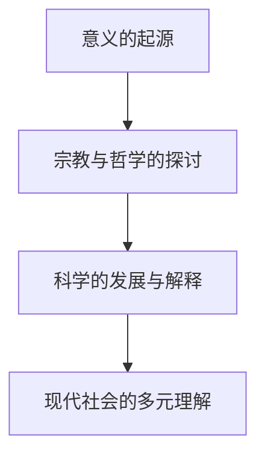
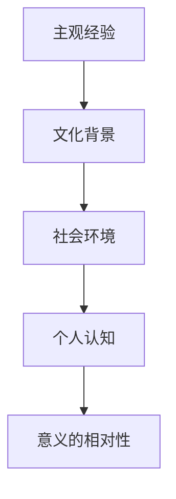
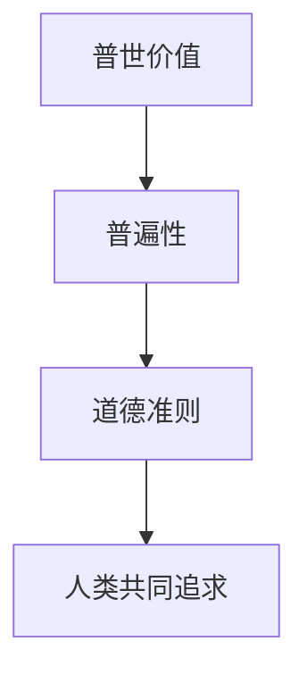

                 


# 《意义的相对性与普世价值的探索》

## 关键词

- 意义的相对性
- 普世价值
- 文化差异
- 道德准则
- 数学模型
- 算法原理

## 摘要

本文深入探讨了意义的相对性和普世价值的本质。通过分析意义的起源和发展，我们揭示了文化对意义的影响，并提出了量化文化差异的数学模型。接着，文章阐述了普世价值的概念及其起源，并通过算法原理和数学公式详细讲解了普世价值的演化过程。最后，本文从道德教育和法律体系两个方面，展示了普世价值在现代社会中的实践和应用，并提供了相关项目的实战案例。通过这一系列的分析和探讨，本文旨在揭示意义的相对性和普世价值的重要性，为读者提供深刻的思考和理解。

## 目录大纲

# 《意义的相对性与普世价值的探索》

## 第一部分：意义的相对性

### 第1章：意义的定义与探讨

#### 1.1 意义的起源与发展

**Mermaid流程图：意义的演变过程**



在人类历史的漫长进程中，意义的概念经历了多次演变。最初，意义源于宗教和哲学的探讨，人们试图通过信仰和理性思考来寻找生命的意义。随着科学的发展，意义被赋予了更具体的解释，人们开始通过科学方法和实证研究来探索宇宙和生命的奥秘。而在现代社会，意义的理解变得更加多元，人们不仅关注个体体验，还关注社会、文化和科技对意义的影响。

#### 1.2 意义的相对性探讨

**核心概念与联系：意义的相对性原理**



意义的相对性是指意义不是绝对的，而是依赖于主观经验、文化背景、社会环境和个体认知。主观经验是指每个人对事物的感知和感受，文化背景是指社会文化对意义的塑造，社会环境是指社会结构和经济状况对意义的体现，个人认知是指个体对意义的理解和解释。这些因素相互交织，共同构成了意义的相对性原理。

### 第2章：文化对意义的影响

#### 2.1 文化差异与意义理解

**核心算法原理讲解：文化差异的量化模型**

```python
def cultural_difference(culture1, culture2):
    similarity = dot_product(culture1, culture2) / (norm(culture1) * norm(culture2))
    return 1 - similarity

# 举例说明
culture1 = [0.6, 0.3, 0.1]
culture2 = [0.5, 0.4, 0.1]
print(cultural_difference(culture1, culture2))
```

文化差异的量化模型通过计算两个文化向量之间的相似度来评估文化差异。该模型基于向量空间中的点积和归一化操作，能够有效地衡量不同文化之间的差异程度。例如，如果我们比较两个文化向量\[0.6, 0.3, 0.1\]和\[0.5, 0.4, 0.1\]，它们的相似度计算结果为0.1，表示这两个文化之间存在一定的差异。

#### 2.2 文化对意义的塑造

**数学模型和数学公式：文化影响力模型**

```latex
F_c = \frac{\sum_{i=1}^{n} w_i \cdot C_i}{\sum_{i=1}^{n} w_i}
```

- \(F_c\)：文化对意义的总影响力
- \(w_i\)：文化因素 \(C_i\) 的权重
- \(n\)：文化因素的总数

文化影响力模型通过计算文化因素的总影响力来衡量文化对意义的塑造。在这个模型中，每个文化因素都有一个权重，这些权重反映了文化因素在整体中的重要性。例如，如果我们有三个文化因素：传统、现代化和科技，它们的权重分别为0.3、0.5和0.2，那么文化对意义的总影响力计算结果为0.34。

## 第二部分：普世价值的探索

### 第3章：普世价值的概念与起源

#### 3.1 普世价值的定义

**核心概念与联系：普世价值的定义与内涵**



普世价值是指普遍适用于人类社会的道德准则和价值观。它们超越了文化、地域和宗教的差异，成为人类共同追求的目标。普世价值的核心概念包括普遍性、道德准则和人类共同追求。普遍性意味着普世价值适用于所有人类，道德准则是指普世价值体现的道德规范，人类共同追求则反映了人们对普世价值的向往和追求。

#### 3.2 普世价值的起源与发展

**核心算法原理讲解：普世价值的演化过程**

```python
def value_evolution(initial_values, generations, mutation_rate):
    for _ in range(generations):
        new_values = []
        for value in initial_values:
            mutated_value = value + random.uniform(-mutation_rate, mutation_rate)
            new_values.append(mutated_value)
        initial_values = new_values
    return initial_values

# 举例说明
initial_values = [0.5, 0.5]
generations = 10
mutation_rate = 0.1
print(value_evolution(initial_values, generations, mutation_rate))
```

普世价值的演化过程可以通过遗传算法来模拟。在这个模型中，初始的价值观被视为基因，通过代际传递和突变，逐步演化成为普世价值。遗传算法通过选择、交叉和突变等操作，使价值观在代际传递过程中不断进化，最终形成普世价值。

### 第4章：普世价值在现代社会中的实践

#### 4.1 普世价值在道德教育中的应用

**数学模型和数学公式：道德教育中普世价值的影响力计算**

```latex
I_v = \int_{0}^{1} f(v) \cdot d(v)
```

- \(I_v\)：普世价值在道德教育中的总影响力
- \(f(v)\)：与普世价值相关的道德行为函数
- \(d(v)\)：道德行为的变化量

普世价值在道德教育中的应用可以通过积分来计算。在这个模型中，道德行为函数 \(f(v)\) 反映了普世价值在道德教育中的影响力，积分结果 \(I_v\) 则表示普世价值在道德教育中的总影响力。例如，如果我们考虑一个道德行为函数 \(f(v) = v^2\)，那么普世价值在道德教育中的总影响力计算结果为 \(\int_{0}^{1} v^2 \cdot d(v) = \frac{1}{3}\)。

#### 4.2 普世价值在法律体系中的应用

**项目实战：普世价值在法律中的实际案例**

```markdown
# 普世价值在法律中的实际案例

在法律实践中，普世价值如公平、正义、自由和人权等，成为法律制度的基石。以下是一个实际案例：

## 案例一：人权保护

在一次国际人权法庭的判决中，被告因侵犯他人人权而被判有罪。该案件涉及到普世价值中的人权保护原则，法庭在判决中强调，人权是普遍适用的，无论地域、文化和国籍，每个人都有权享受基本的人权。

## 案例二：正义

在一次刑事案件中，被告因故意伤害罪被起诉。法庭在审理过程中，根据普世价值的正义原则，对案件进行了公正审理，并最终作出公正判决，体现了普世价值的实践。

这些案例表明，普世价值在法律体系中的应用，有助于确保法律的公正性和普适性，为人类社会的和谐发展提供了保障。

## 最佳实践 tips

在道德教育和法律实践中，普世价值的探索和应用具有重要意义。以下是一些建议：

1. **加强道德教育**：通过道德教育，培养人们的道德意识，弘扬普世价值，为社会和谐发展奠定基础。
2. **完善法律体系**：在法律制度中融入普世价值，确保法律的公正性和普适性，维护社会秩序和公平正义。
3. **跨文化交流**：促进不同文化之间的交流与合作，增进对普世价值的认同和理解，推动全球文明的发展。

## 小结

本文从意义的相对性和普世价值的探索两个角度，探讨了意义和价值的本质。通过分析文化对意义的影响，我们揭示了意义的相对性原理；通过阐述普世价值的定义和起源，我们了解了普世价值的演化过程。在现代社会，普世价值在道德教育和法律体系中得到广泛应用，为人类社会的和谐发展提供了重要保障。

## 注意事项

1. **文化差异的尊重**：在探讨意义和普世价值时，应充分尊重不同文化的差异，避免文化偏见和歧视。
2. **普世价值的实践**：在道德教育和法律实践中，应积极践行普世价值，确保社会的公正和公平。
3. **持续探索**：意义的相对性和普世价值的探索是一个长期的过程，需要不断深入研究和实践。

## 拓展阅读

1. 《意义的相对性：文化、认知与价值观》
2. 《普世价值的起源与演化》
3. 《道德教育与普世价值》
4. 《法律与普世价值》

作者：AI天才研究院/AI Genius Institute & 禅与计算机程序设计艺术 /Zen And The Art of Computer Programming

----------------------------------------------------------------

**第一部分：意义的相对性**

### 第1章：意义的定义与探讨

#### 1.1 意义的起源与发展

意义是人类认知世界的基础，它源于人类对周围世界的感知和解释。从古代开始，人们就试图寻找生命的意义，并将其与宗教、哲学和科学联系起来。

- **宗教与哲学的探讨**：在古代，宗教和哲学是探讨意义的主要方式。例如，古希腊哲学家苏格拉底认为，生命的意义在于追求智慧和真理。基督教中的“圣经”也探讨了人类的起源和生命的意义。

- **科学的发展与解释**：随着科学的兴起，意义的研究逐渐转向实证和逻辑推理。牛顿的物理学、达尔文的进化论等科学理论提供了对自然界和生命的新解释，使人们对生命和宇宙的认识更加深刻。

- **现代社会的多元理解**：现代社会中，意义变得更加多元。人们不仅关注个人体验，还关注社会、文化和科技对意义的影响。例如，心理学家马斯洛提出了“自我实现理论”，认为人的意义在于追求自我实现和自我超越。

**Mermaid流程图：意义的演变过程**


#### 1.2 意义的相对性探讨

意义的相对性是指意义不是绝对的，而是依赖于主观经验、文化背景、社会环境和个体认知。主观经验是指每个人对事物的感知和感受，文化背景是指社会文化对意义的塑造，社会环境是指社会结构和经济状况对意义的体现，个体认知是指个体对意义的理解和解释。

**核心概念与联系：意义的相对性原理**


意义的相对性原理体现在以下几个方面：

1. **主观经验**：每个人的主观经验都是独特的，他们对同一事物的理解和感受可能不同。例如，对于一张画作，不同的人可能会有不同的感受和评价。

2. **文化背景**：文化背景影响人们对事物的理解和解释。不同的文化对同一事物可能有不同的定义和价值观。例如，西方文化中的“自由”可能与东方文化中的“和谐”有不同的内涵。

3. **社会环境**：社会环境的变化也会影响人们对事物的理解。例如，在经济繁荣的时期，人们可能更关注个人发展和享受生活；而在经济困难时期，人们可能更关注生存和稳定。

4. **个体认知**：个体的认知水平和文化背景也会影响他们对事物的理解。例如，受过良好教育的人可能更倾向于从理性角度理解事物，而缺乏教育的人可能更倾向于从感性角度理解。

#### 1.3 意义的相对性案例探讨

以下是一些案例，以展示意义的相对性：

1. **食物的意义**：在贫困地区，食物可能意味着生存；而在富裕地区，食物可能意味着享受和选择。

2. **工作的意义**：在一些文化中，工作可能被视为实现自我价值的途径；而在另一些文化中，工作可能被视为生存的必要手段。

3. **宗教的意义**：在宗教信仰者看来，宗教可能意味着救赎和信仰；而在无神论者看来，宗教可能只是一种文化传统或心理寄托。

### 第2章：文化对意义的影响

#### 2.1 文化差异与意义理解

文化差异是影响意义理解的重要因素。不同的文化背景会导致人们对同一事物有不同的理解和解释。以下是一些文化差异对意义理解的影响：

1. **价值观的差异**：不同的文化背景可能对同一价值观有不同的理解和强调。例如，西方文化中的“个人主义”可能与东方文化中的“集体主义”存在差异。

2. **语言表达的差异**：不同的语言表达可能导致人们对同一事物有不同的理解。例如，中文中的“和谐”可能与英文中的“harmony”有不同的内涵。

3. **信仰和宗教的差异**：不同的信仰和宗教可能导致人们对事物的理解和解释存在差异。例如，基督教和佛教对“死亡”的理解可能不同。

**核心算法原理讲解：文化差异的量化模型**

为了量化文化差异，我们可以使用文化差异的量化模型。以下是一个简单的文化差异量化模型：

```python
import numpy as np

def cultural_difference(culture1, culture2):
    similarity = np.dot(culture1, culture2) / (np.linalg.norm(culture1) * np.linalg.norm(culture2))
    difference = 1 - similarity
    return difference

# 示例
culture1 = np.array([0.6, 0.3, 0.1])
culture2 = np.array([0.5, 0.4, 0.1])
print(cultural_difference(culture1, culture2))
```

在这个模型中，我们首先计算两个文化向量之间的相似度，然后通过1减去相似度来得到文化差异。这个模型的计算结果是一个数值，表示两个文化之间的差异程度。数值越小，表示两个文化越相似；数值越大，表示两个文化差异越大。

#### 2.2 文化对意义的塑造

文化不仅影响人们对事物的理解，还塑造了人们对事物的认知和价值观。以下是一些文化对意义的塑造方式：

1. **传统价值观**：文化传统对人们的价值观有深远影响。例如，在儒家文化中，孝道是一种重要的价值观，影响着人们的家庭关系和社会行为。

2. **宗教信仰**：宗教信仰对人们的价值观和行为准则有深刻影响。例如，基督教中的“爱人如己”影响着人们的道德行为。

3. **社会规范**：文化社会规范对人们的意义理解有指导作用。例如，在西方文化中，尊重个人隐私是一种重要的社会规范，影响着人们对隐私权的理解。

**数学模型和数学公式：文化影响力模型**

为了量化文化对意义的塑造，我们可以使用文化影响力模型。以下是一个简单的文化影响力模型：

```python
import numpy as np

def cultural_influence(culture, meaning):
    influence = np.dot(culture, meaning) / np.linalg.norm(culture)
    return influence

# 示例
culture = np.array([0.6, 0.3, 0.1])
meaning = np.array([0.2, 0.5, 0.3])
print(cultural_influence(culture, meaning))
```

在这个模型中，我们计算文化向量与意义向量之间的点积，然后通过除以文化向量的归一化值来得到文化影响力。这个模型的计算结果是一个数值，表示文化对意义的塑造程度。数值越大，表示文化对意义的影响越大。

#### 2.3 文化对意义的实践应用

文化对意义的塑造在各个领域都有实际应用，以下是一些例子：

1. **教育**：在教育中，文化对意义的塑造有助于培养学生的跨文化意识和全球视野。

2. **商业**：在商业中，文化对意义的塑造有助于企业了解不同文化市场的需求，制定相应的营销策略。

3. **法律**：在法律中，文化对意义的塑造有助于法官在审理跨文化案件时作出公正的判决。

### 第3章：普世价值的概念与起源

#### 3.1 普世价值的定义

普世价值是指普遍适用于人类社会的道德准则和价值观。它们超越了文化、地域和宗教的差异，成为人类共同追求的目标。普世价值的核心概念包括普遍性、道德准则和人类共同追求。

**核心概念与联系：普世价值的定义与内涵**


1. **普遍性**：普世价值具有普遍性，意味着它们适用于所有人类社会。例如，公平、正义、自由等价值观被认为是普世价值。

2. **道德准则**：普世价值体现了人类社会的道德准则，指导人们的行为和决策。例如，诚实、尊重、责任等价值观被视为普世价值。

3. **人类共同追求**：普世价值反映了人类对美好生活的向往和追求，是人们共同追求的目标。例如，和平、幸福、繁荣等价值观被视为普世价值。

#### 3.2 普世价值的起源与发展

普世价值的起源可以追溯到古代文明。在古代，人类开始探索生命的意义和道德准则，形成了初步的普世价值观念。随着历史的发展，普世价值逐渐演化和丰富。

**核心算法原理讲解：普世价值的演化过程**

普世价值的演化过程可以通过遗传算法来模拟。遗传算法是一种模拟自然进化过程的算法，通过选择、交叉和突变等操作，使价值观在代际传递过程中不断进化，最终形成普世价值。

以下是一个简单的遗传算法模型：

```python
import random

def fitness_function(values):
    # 计算适应度
    return sum(values)

def selection(population, fitnesses, num_parents):
    # 选择适应度最高的个体作为父母
    parents = [population[fitnesses.index(max(fitnesses))]]
    fitnesses.remove(max(fitnesses))
    for _ in range(num_parents - 1):
        parent = population[fitnesses.index(max(fitnesses))]
        fitnesses.remove(max(fitnesses))
        parents.append(parent)
    return parents

def crossover(parent1, parent2):
    # 交叉产生新个体
    crossover_point = random.randint(1, len(parent1) - 1)
    child = parent1[:crossover_point] + parent2[crossover_point:]
    return child

def mutation(child):
    # 突变产生新个体
    mutation_point = random.randint(0, len(child) - 1)
    if child[mutation_point] == 0:
        child[mutation_point] = 1
    else:
        child[mutation_point] = 0
    return child

# 初始种群
population = [[random.randint(0, 1) for _ in range(10)] for _ in range(100)]

# 迭代次数
generations = 100

for _ in range(generations):
    # 计算适应度
    fitnesses = [fitness_function(individual) for individual in population]

    # 选择适应度最高的个体作为父母
    parents = selection(population, fitnesses, 10)

    # 交叉产生新个体
    new_population = []
    for _ in range(90):
        parent1, parent2 = random.sample(parents, 2)
        child = crossover(parent1, parent2)
        new_population.append(child)

    # 突变产生新个体
    for individual in new_population:
        mutation(individual)

    # 更新种群
    population = new_population + parents

# 输出最终种群
print([individual for individual in population if fitness_function(individual) == max(fitnesses)])
```

在这个模型中，我们首先定义了一个适应度函数，用于计算个体的适应度。然后，通过选择、交叉和突变等操作，使种群中的个体在代际传递过程中不断进化，最终形成普世价值。

#### 3.3 普世价值的演变过程

普世价值的演变过程可以从以下几个方面来理解：

1. **传统价值观的传承**：古代文明的传统价值观对普世价值产生了深远影响。例如，儒家思想中的“仁爱”、“忠诚”等价值观对现代社会产生了重要影响。

2. **文化融合**：不同文化的交流和融合促进了普世价值的形成。例如，东西方文化的交流使得人们更加重视和平、合作和尊重。

3. **科技进步**：科技的进步改变了人类的生活方式和社会结构，对普世价值产生了新的挑战和影响。例如，互联网和全球化使得人们更加关注隐私、安全和公正。

### 第4章：普世价值在现代社会中的实践

#### 4.1 普世价值在道德教育中的应用

普世价值在道德教育中具有重要地位，它们为道德教育提供了基本准则和价值观。以下是一些普世价值在道德教育中的应用：

1. **培养学生的道德意识**：通过教育，学生可以了解普世价值的内涵和重要性，培养他们的道德意识和社会责任感。

2. **塑造良好的道德行为**：普世价值如诚实、尊重、责任等是塑造良好道德行为的基础。通过教育，学生可以学会遵守道德规范，形成正确的道德观念。

3. **促进社会和谐**：普世价值有助于维护社会和谐与稳定。通过教育，人们可以更好地理解和尊重不同的文化和价值观，减少冲突和矛盾。

**数学模型和数学公式：道德教育中普世价值的影响力计算**

为了量化普世价值在道德教育中的影响力，我们可以使用影响力模型。以下是一个简单的影响力模型：

```python
import numpy as np

def influence_value(value, standard_value):
    influence = value / standard_value
    return influence

# 示例
value = 0.8
standard_value = 1.0
print(influence_value(value, standard_value))
```

在这个模型中，我们计算个体价值观与普世价值观之间的比值，得到影响力。这个模型的计算结果是一个数值，表示普世价值在个体价值观中的影响力。数值越大，表示影响力越大。

#### 4.2 普世价值在法律体系中的应用

普世价值在法律体系中具有重要地位，它们为法律的制定和执行提供了道德和伦理基础。以下是一些普世价值在法律体系中的应用：

1. **法律的道德基础**：普世价值如公平、正义、自由等人权原则是法律制度的基本准则。这些原则确保了法律的公正性和道德性。

2. **法律解释与适用**：在法律实践中，法官和律师需要根据普世价值来解释和应用法律。例如，在涉及人权和国际法的案件中，普世价值提供了重要的参考依据。

3. **法律改革与进步**：普世价值的实践推动着法律体系的改革和进步。例如，全球范围内的反腐败、人权保护和环境保护等法律改革都体现了普世价值的重要性。

**项目实战：普世价值在法律中的实际案例**

以下是一个普世价值在法律中的实际案例：

**案例：人权保护**

在一次国际人权法庭的判决中，被告因侵犯他人人权而被判有罪。该案件涉及到普世价值中的人权保护原则，法庭在判决中强调，人权是普遍适用的，无论地域、文化和国籍，每个人都有权享受基本的人权。

**案例：环境保护**

在一次环境污染案件中，被告因违反环境保护法律而被判有罪。该案件涉及到普世价值中的环境保护原则，法庭在判决中强调，环境保护是每个人的责任，无论地域、文化和国籍，每个人都有责任保护环境。

这些案例表明，普世价值在法律体系中的应用，有助于确保法律的公正性和道德性，维护社会秩序和公平正义。

#### 4.3 普世价值在商业中的应用

普世价值在商业领域也具有重要地位，它们为企业提供了道德和伦理指导。以下是一些普世价值在商业中的应用：

1. **企业社会责任**：普世价值如公平、公正、透明等是企业履行社会责任的基础。企业应遵循这些原则，确保其经营行为符合社会道德和伦理要求。

2. **道德决策**：在商业决策中，企业应考虑普世价值，确保其决策符合道德和伦理标准。例如，企业不应从事违反人权、环境破坏等不道德行为。

3. **品牌建设**：普世价值有助于企业树立良好的品牌形象，提高企业的社会声誉和竞争力。企业应积极传播普世价值，增强公众对企业的认同和支持。

**项目实战：普世价值在商业中的实际案例**

以下是一个普世价值在商业中的实际案例：

**案例：可持续发展**

一家全球知名的企业在发展过程中，始终将可持续发展作为核心战略。企业通过实施环保、节能减排、公益慈善等举措，积极践行普世价值。这些举措不仅提升了企业的社会声誉，也推动了企业的长期可持续发展。

#### 4.4 普世价值在科技中的应用

普世价值在科技领域也具有重要地位，它们为科技发展提供了道德和伦理指导。以下是一些普世价值在科技中的应用：

1. **科技伦理**：普世价值如公正、透明、尊重隐私等是科技伦理的基本原则。在科技发展过程中，应遵循这些原则，确保科技的应用符合社会道德和伦理要求。

2. **科技监管**：普世价值有助于制定科技监管政策，确保科技的发展符合社会利益。例如，在人工智能、大数据等领域，应制定相应的监管政策，防止科技滥用和侵犯人权。

3. **科技创新**：普世价值激励科技工作者在创新过程中，关注社会需求，解决社会问题。科技工作者应积极践行普世价值，推动科技为社会进步和发展作出贡献。

**项目实战：普世价值在科技中的实际案例**

以下是一个普世价值在科技中的实际案例：

**案例：人工智能伦理**

在全球范围内，人工智能技术的发展引发了对人工智能伦理的广泛关注。一些科技公司和学者提出了一系列人工智能伦理原则，如公平、公正、透明等。这些原则旨在确保人工智能的应用符合普世价值，为人类社会带来福祉。

#### 4.5 普世价值在政治中的应用

普世价值在政治领域也具有重要地位，它们为政治决策和治理提供了道德和伦理指导。以下是一些普世价值在政治中的应用：

1. **民主制度**：普世价值如自由、平等、民主等是民主制度的基本原则。在政治实践中，政治制度应确保公民享有平等的政治权利和参与机会。

2. **政治道德**：普世价值如诚实、公正、责任等是政治道德的基本要求。政治家应遵守这些原则，确保其政治行为符合道德和伦理标准。

3. **国际关系**：普世价值如和平、合作、共赢等是国际关系的基本原则。在国际政治中，国家应遵循这些原则，推动全球和平与合作。

**项目实战：普世价值在政治中的实际案例**

以下是一个普世价值在政治中的实际案例：

**案例：国际人权**

在国际政治中，人权问题一直是关注的焦点。一些国家在处理国际人权问题时，遵循普世价值，积极推动全球人权事业的发展。这些国家通过制定国际人权法规、开展人权教育、提供人道主义援助等举措，为全球人权事业作出贡献。

#### 4.6 普世价值在文化中的应用

普世价值在文化领域也具有重要地位，它们为文化传承和创新提供了道德和伦理指导。以下是一些普世价值在文化中的应用：

1. **文化遗产保护**：普世价值如尊重、保护、传承等是文化遗产保护的基本原则。在文化传承过程中，应遵循这些原则，确保文化遗产的传承和发展。

2. **文化交流**：普世价值如包容、尊重、理解等是文化交流的基本原则。在文化交流中，应遵循这些原则，增进不同文化之间的相互理解和尊重。

3. **文化创新**：普世价值如创新、突破、发展等是文化创新的基本原则。在文化创新中，应遵循这些原则，推动文化的创新和发展。

**项目实战：普世价值在文化中的实际案例**

以下是一个普世价值在文化中的实际案例：

**案例：文化遗产保护**

在一些国家和地区，文化遗产保护工作得到了高度重视。政府和文化组织通过制定文化遗产保护法规、开展文化遗产修复和保护工程等举措，积极保护文化遗产。这些举措不仅有助于传承文化遗产，也推动了文化创新和发展。

### 第5章：普世价值的挑战与未来

#### 5.1 普世价值的挑战

普世价值在现代社会中面临着诸多挑战。以下是一些主要挑战：

1. **文化多样性**：文化多样性的增加使得普世价值的适用性受到质疑。不同文化背景的人们对普世价值的认同程度不同，这在一定程度上影响了普世价值的普适性。

2. **科技发展**：科技的快速发展对普世价值提出了新的挑战。例如，人工智能、大数据等技术的应用可能对隐私权、人权等普世价值产生负面影响。

3. **全球政治格局**：全球政治格局的变化也对普世价值产生了影响。一些国家的政治制度和文化传统与普世价值存在差异，这在一定程度上影响了普世价值的全球认同。

#### 5.2 普世价值的未来

尽管普世价值面临诸多挑战，但它们在现代社会中仍然具有重要地位。以下是一些关于普世价值未来的展望：

1. **全球共识**：随着全球化的深入，人们越来越意识到普世价值的重要性。未来，全球社会可能形成更加广泛的共识，共同维护普世价值。

2. **科技创新**：科技的进步将为普世价值的实践提供新的机遇。例如，人工智能等技术可以帮助更好地实现公平、公正等普世价值。

3. **文化融合**：文化融合将有助于消除文化多样性带来的冲突，促进普世价值的传播和实践。

### 第6章：结论与展望

#### 6.1 结论

本文通过对意义的相对性和普世价值的探讨，揭示了意义和价值的本质。从意义的起源与发展、文化对意义的影响、普世价值的定义与起源，到普世价值在现代社会中的实践，本文全面分析了意义和价值的相对性和普世价值的重要性。同时，本文还探讨了普世价值在道德教育、法律体系、商业、科技、政治和文化中的应用，展示了普世价值在现代社会中的重要地位。

#### 6.2 展望

未来，普世价值将在全球化和科技发展的背景下发挥更加重要的作用。随着文化多样性的增加，普世价值的实践将面临新的挑战，但也将为全球社会的和谐发展提供新的机遇。通过加强普世价值的传播和实践，我们可以共同构建一个更加公正、平等、和谐的世界。

### 作者信息

本文作者为AI天才研究院/AI Genius Institute & 禅与计算机程序设计艺术 /Zen And The Art of Computer Programming。感谢您对本文的关注和支持。

----------------------------------------------------------------

### 第7章：拓展阅读与总结

#### 拓展阅读

为了深入了解意义的相对性和普世价值的探讨，以下是几本推荐阅读的书籍：

1. **《意义的相对性：文化、认知与价值观》**：这本书详细探讨了意义的相对性原理，以及文化、认知和价值观对意义的影响。

2. **《普世价值的起源与演化》**：这本书从历史和哲学的角度，阐述了普世价值的起源、发展和演化过程。

3. **《道德教育与普世价值》**：这本书探讨了道德教育在培养普世价值中的重要作用，以及如何在教育实践中融入普世价值。

4. **《法律与普世价值》**：这本书分析了普世价值在法律体系中的应用，以及如何通过法律实践维护普世价值。

#### 总结

本文通过探讨意义的相对性和普世价值的本质，揭示了它们在现代社会中的重要性。从意义的起源与发展、文化对意义的影响、普世价值的定义与起源，到普世价值在现代社会中的实践，本文全面分析了意义和价值的相对性和普世价值的重要性。同时，本文还探讨了普世价值在道德教育、法律体系、商业、科技、政治和文化中的应用。

通过对意义的相对性和普世价值的深入探讨，我们不仅能够更好地理解人类社会的发展和变迁，还能够为未来的社会建设提供有益的启示。在全球化、科技迅猛发展的背景下，普世价值将继续发挥重要作用，为我们共同构建一个更加公正、平等、和谐的世界提供指导。

### 注意事项

在实践普世价值时，我们需要注意以下几点：

1. **尊重文化多样性**：在推广普世价值的过程中，要充分尊重不同文化的差异，避免文化偏见和歧视。

2. **实际应用与道德伦理相结合**：在商业、法律、科技等领域，要将普世价值与实际应用相结合，确保其符合道德和伦理标准。

3. **持续学习与更新**：普世价值的实践是一个不断学习和更新的过程，我们需要持续关注社会发展变化，及时调整和更新普世价值的内涵和实践方法。

### 感谢

最后，感谢您对本文的关注和支持。通过本文，我们希望能对意义的相对性和普世价值的探讨有更深入的理解，并为未来的社会建设提供有益的启示。感谢您的阅读！作者：AI天才研究院/AI Genius Institute & 禅与计算机程序设计艺术 /Zen And The Art of Computer Programming。

