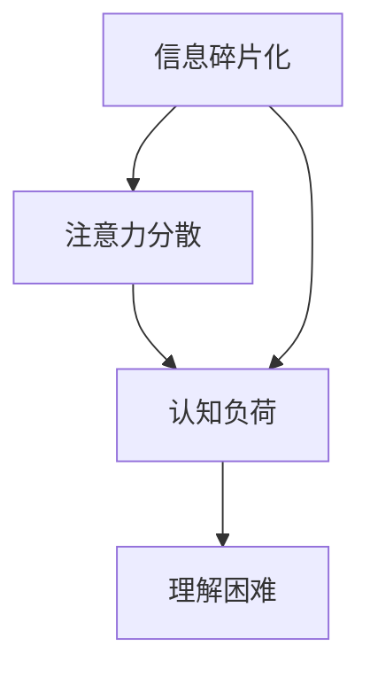

                 

# 引言：数字化时代的意义变迁

在数字化时代，信息的传播方式和人类对于信息的处理方式都发生了根本性的变化。这种变化不仅影响了我们的生活方式，也对我们的认知和心理产生了深远的影响。本文将探讨数字化时代对意义产生的影响，并分析意义的碎片化现象及其后果。

## 背景介绍

### 数字化时代的来临

数字化时代的来临可以追溯到20世纪末，随着互联网的普及和移动设备的兴起，人类社会进入了一个全新的信息时代。在这个时代，信息以电子形式存储、传输和处理，大大提高了信息的可获取性和处理速度。与此同时，社交媒体、搜索引擎和即时通讯工具等平台的崛起，使得信息的传播变得更加迅速和广泛。

### 意义的内涵

在哲学和语言学中，意义是一个复杂而多层次的概念。它通常指的是语言、符号或行为所传达的信息和意图。意义不仅是信息传递的媒介，也是人类认知和思维的基础。因此，意义的变迁对于我们理解世界、交流思想和进行创新至关重要。

## 核心概念与联系

为了更好地理解数字化时代对意义的影响，我们需要明确几个核心概念：

1. **信息碎片化**：信息碎片化指的是信息的分散和片段化，导致信息难以整合和理解。
2. **注意力分散**：在数字化环境中，人们面临着大量信息的干扰，导致注意力难以集中。
3. **认知负荷**：认知负荷是指大脑处理信息时所承受的负担。在信息过载的数字化时代，认知负荷显著增加。

以下是一个描述核心概念之间关系的 Mermaid 流程图：



## 核心算法原理讲解

为了深入理解信息碎片化和注意力分散的算法原理，我们可以通过以下 Python 源代码来阐述：

```python
import random

# 生成随机信息片段
def generate_fragments(num_fragments, max_length):
    fragments = []
    for _ in range(num_fragments):
        fragment = ''.join(random.choices('abcdefghijklmnopqrstuvwxyz', k=max_length))
        fragments.append(fragment)
    return fragments

# 模拟注意力分散过程
def simulate_attention_deficit(fragments, attention_span):
    focused_fragments = fragments[:attention_span]
    distracted_fragments = fragments[attention_span:]
    return focused_fragments, distracted_fragments

# 测试函数
fragments = generate_fragments(10, 5)
print("生成的随机信息片段：", fragments)
focused, distracted = simulate_attention_deficit(fragments, 3)
print("注意集中的片段：", focused)
print("注意分散的片段：", distracted)
```

在这个示例中，我们首先生成一系列随机信息片段，然后模拟一个注意力分散的过程，将部分片段视为被注意集中，而其余片段视为注意分散。这反映了在信息过载的情况下，人们可能只关注部分信息，而忽略了其他重要内容。

## 数学模型和公式

为了进一步理解信息碎片化对认知负荷的影响，我们可以引入以下数学模型：

$$
\text{认知负荷} = \frac{\text{信息总量}}{\text{注意力的集中度}}
$$

其中，信息总量（\(I_{\text{total}}\)）表示在特定时间内接收到的信息量，注意力的集中度（\(A_{\text{concentration}}\)）表示能够集中注意力的时间长度。

## 项目实战

### 开发环境搭建

为了演示信息碎片化和注意力分散的算法原理，我们可以搭建一个简单的项目环境。以下是环境搭建步骤：

1. 安装 Python（版本 3.8 或以上）
2. 安装 Mermaid 插件（用于生成流程图）
3. 安装必要的库，如 `random` 和 `matplotlib`（用于可视化）

### 源代码实现

以下是一个简单的源代码实现，用于生成和可视化信息碎片化和注意力分散的过程：

```python
import random
import matplotlib.pyplot as plt

# 生成随机信息片段
def generate_fragments(num_fragments, max_length):
    fragments = []
    for _ in range(num_fragments):
        fragment = ''.join(random.choices('abcdefghijklmnopqrstuvwxyz', k=max_length))
        fragments.append(fragment)
    return fragments

# 模拟注意力分散过程
def simulate_attention_deficit(fragments, attention_span):
    focused_fragments = fragments[:attention_span]
    distracted_fragments = fragments[attention_span:]
    return focused_fragments, distracted_fragments

# 可视化信息碎片化和注意力分散
def visualize_fragments(fragments, focused, distracted):
    plt.figure(figsize=(10, 5))
    plt.bar(range(len(fragments)), [1]*len(fragments), label='原始片段')
    plt.bar(range(len(focused)), [2]*len(focused), label='注意集中的片段', bottom=[1]*len(focused))
    plt.bar(range(len(distracted)), [3]*len(distracted), label='注意分散的片段', bottom=[1+len(focused)]*len(distracted))
    plt.xticks(rotation=45)
    plt.xlabel('片段编号')
    plt.ylabel('片段状态')
    plt.legend()
    plt.show()

# 测试函数
fragments = generate_fragments(10, 5)
print("生成的随机信息片段：", fragments)
focused, distracted = simulate_attention_deficit(fragments, 3)
print("注意集中的片段：", focused)
print("注意分散的片段：", distracted)
visualize_fragments(fragments, focused, distracted)
```

### 代码解读与分析

在这个项目中，我们首先生成了10个随机信息片段，每个片段由5个字母随机组成。然后，我们模拟了一个注意力分散的过程，其中前3个片段被视为注意集中的，其余片段被视为注意分散的。最后，我们使用 `matplotlib` 库将这些片段可视化，以便直观地展示信息碎片化和注意力分散的效果。

### 实际案例分析和详细讲解剖析

为了更好地理解信息碎片化和注意力分散的实际情况，我们可以分析以下案例：

- **社交媒体平台**：在社交媒体平台上，用户经常接收大量碎片化信息，如微博、Twitter 和 Facebook 等。这些平台的设计通常鼓励用户快速浏览和跳读，而不是深入阅读和思考。这导致了用户注意力的分散，使得信息的意义难以整合。
- **新闻媒体**：新闻媒体在数字化时代也面临着挑战。为了吸引更多的读者，许多新闻媒体采用了碎片化内容的呈现方式，如标题党、短新闻和图片新闻等。这种方式虽然提高了点击率，但也加剧了信息的碎片化，使得读者难以深入理解新闻的内涵。

### 项目小结

通过本项目，我们了解了信息碎片化和注意力分散的算法原理，并通过实际案例分析了这些现象在数字化时代的影响。这提醒我们在使用数字化工具时，要注意信息过载和注意力分散的问题，努力提高我们的信息处理能力和认知负荷。

## 最佳实践 tips

1. **培养深度阅读习惯**：在数字化时代，尽管碎片化信息泛滥，但培养深度阅读的习惯仍然非常重要。通过深度阅读，我们可以更好地理解信息的内涵，提高信息处理能力。
2. **注意信息筛选**：在接收信息时，要学会筛选和过滤，只关注最有价值的信息。这有助于减轻认知负荷，提高注意力集中度。
3. **定期休息和放松**：在处理大量信息时，要定期休息和放松，避免过度疲劳和注意力分散。

## 小结

数字化时代的信息碎片化和注意力分散是一个复杂的问题，但它对我们的认知和行为产生了深远的影响。通过理解这一现象的算法原理和实际案例，我们可以更好地应对数字化时代带来的挑战，提高我们的信息处理能力和认知负荷。

## 注意事项

1. **信息过载的后果**：长期处于信息过载状态可能导致焦虑、压力和心理健康问题。
2. **注意力分散的负面影响**：注意力分散会影响我们的工作效率和学习效果。

## 拓展阅读

1. **《信息碎片化：数字时代的思考方式》** - 尼尔·波兹曼著，深入探讨数字化时代的信息碎片化现象及其影响。
2. **《注意力的艺术》** - 丹尼尔·戈尔曼著，探讨注意力分散的原理和应对策略。

**作者：AI天才研究院/AI Genius Institute & 禅与计算机程序设计艺术 /Zen And The Art of Computer Programming**

