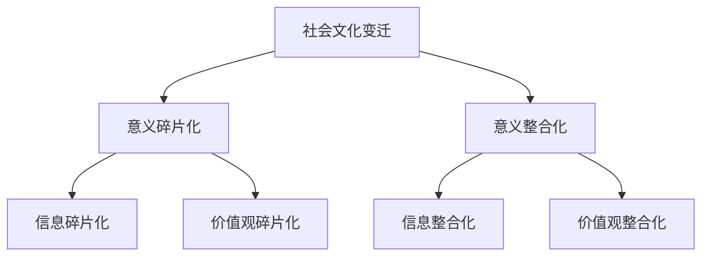
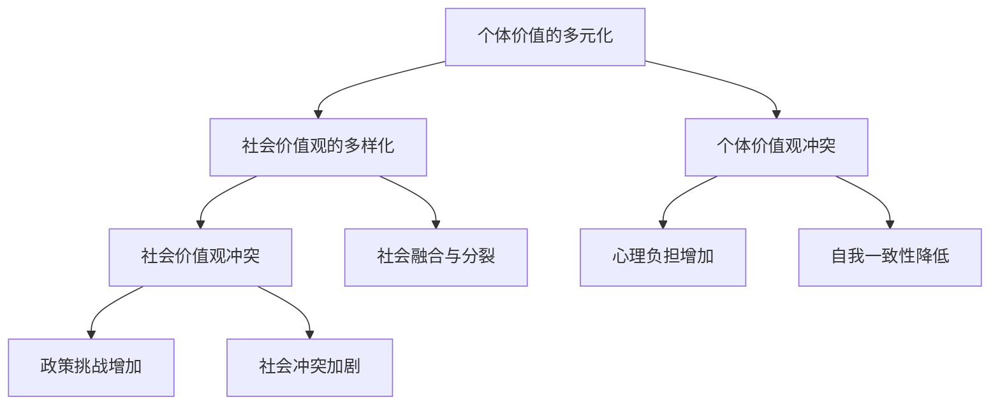
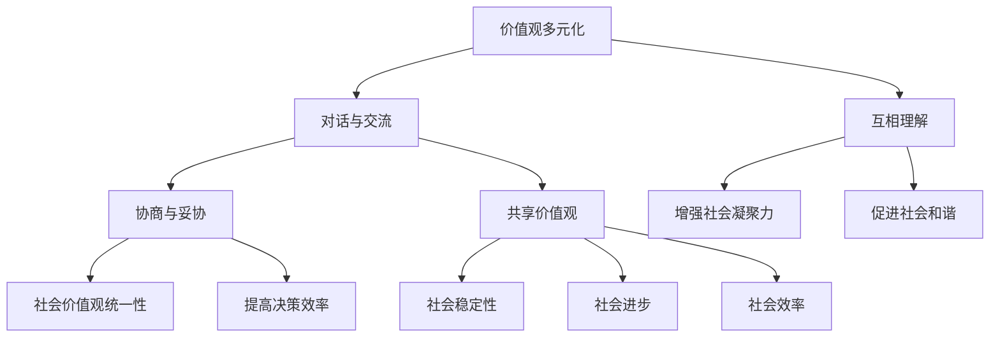

                 

## 1.1 引言

### 1.1.1 双重趋势的背景

随着信息技术的迅猛发展和互联网的普及，人类社会正在经历一场深刻的变革。这一变革不仅改变了我们的生活方式，也重新定义了我们的认知方式。在这场变革中，意义碎片化与整合化成为两个显著的趋势。

**意义碎片化**，指的是信息的日益细分和多样化，导致个体在理解和把握世界时面临越来越大的难度。这一趋势源于信息爆炸和知识分科的发展，使得每个人都能获取到大量的信息，但同时也失去了对这些信息的全局视角。在碎片化的信息世界中，人们更容易陷入信息过载的困境，难以形成完整的认知。

**意义整合化**，则是对碎片化趋势的一种应对策略。它强调信息的整合和知识的统一，以帮助个体更好地理解和应对复杂的世界。整合化不仅是对信息的筛选和聚合，更是一种价值观的整合，旨在形成共识和共同的目标。

### 1.1.2 研究意义与目的

本研究旨在探讨意义碎片化与整合化的双重趋势，分析这两种趋势的内在逻辑和相互作用，以及它们对个体和社会的影响。具体而言，本研究具有以下意义：

1. **理论意义**：通过深入分析意义碎片化与整合化的双重趋势，可以丰富和拓展社会心理学、信息科学和认知科学等相关领域的理论体系。
2. **实践意义**：研究结果可以为政策制定者提供参考，帮助制定更有效的社会治理策略，以应对信息碎片化带来的挑战，促进社会的和谐与稳定。
3. **应用价值**：对于企业和个人来说，理解意义碎片化与整合化的趋势有助于提高信息利用效率，优化决策过程，提升竞争力。

### 1.1.3 研究方法

本研究采用多学科交叉的研究方法，结合定性与定量分析，以获取全面、深入的见解。具体方法包括：

1. **文献综述**：通过系统回顾相关领域的文献，梳理现有的研究成果和理论框架。
2. **案例分析**：选择具有代表性的案例进行分析，以验证理论模型的适用性和实际效果。
3. **问卷调查**：设计问卷进行大规模数据收集，分析个体在意义碎片化与整合化过程中的认知和行为模式。
4. **深度访谈**：对专家和从业者进行深度访谈，获取更深入的见解和实际经验。

通过上述方法，本研究力求对意义碎片化与整合化的双重趋势进行系统的分析和探讨。

## 1.2 社会文化变迁下的意义碎片化

### 1.2.1 社会文化变迁的影响

社会文化变迁是导致意义碎片化的重要因素之一。在过去的几百年里，人类社会经历了前所未有的变化，从农业社会到工业社会，再到信息化社会，这一过程不仅改变了我们的生产方式，也深刻影响了我们的生活方式和认知模式。

首先，全球化使得不同文化之间的交流日益频繁，文化的融合与碰撞成为一种常态。在这个过程中，原有的文化共识受到挑战，新的文化观念不断涌现，导致个体在价值观念和意义认知上的差异和多样性。

其次，科技的进步特别是信息技术的快速发展，使得信息获取和传播变得更加便捷和快速。虽然这有助于个体获得更多的信息资源，但也导致了信息过载的问题。大量的信息不仅分散了个体的注意力，还使得他们在理解和把握这些信息时面临更大的困难。

### 1.2.2 意义碎片化的表现

**1.2.2.1 信息过载**

信息过载是意义碎片化最直接的体现。随着互联网和社交媒体的普及，人们每天都会接收到海量的信息。这些信息既有正面的，也有负面的，既有真实的，也有虚假的。如何在海量信息中筛选和识别有价值的信息，成为个体面临的重大挑战。

**1.2.2.2 多元化与多样性**

意义的碎片化还表现为价值观的多元化和多样性。在传统的农业社会，人们的生活方式相对简单，价值观也比较统一。但随着社会的变迁，个体面临的选择越来越多，每个人都有自己的生活方式和价值观。这种多元化不仅体现在个体层面，也体现在社会层面。社会价值观的多样性使得个体在理解和认同这些价值观时面临更大的困惑。

### 1.2.3 意义碎片化的影响

**1.2.3.1 对个体的影响**

意义碎片化对个体的影响是多方面的。首先，它可能导致个体的认知失调。在多元化的信息环境中，个体往往难以形成一致的认知体系，从而感到迷茫和困惑。其次，意义碎片化也可能导致个体的心理压力增加。面对海量的信息，个体需要投入更多的时间和精力去筛选和识别有价值的信息，这无疑增加了他们的心理负担。

**1.2.3.2 对社会的影响**

意义碎片化对社会的影响同样显著。首先，它可能导致社会共识的缺失。在一个多元化和多样化的社会中，个体之间的价值观念和意义认知存在很大差异，这可能导致社会分裂和冲突。其次，意义碎片化也可能影响社会的稳定和发展。在信息过载的环境中，个体往往无法形成对未来的清晰预期，这可能导致社会的不安和动荡。

### 1.2.4 意义碎片化的应对策略

面对意义碎片化的挑战，个体和社会都需要采取有效的应对策略。对于个体而言，关键在于提升信息素养和批判性思维能力。个体需要学会如何有效地筛选和识别信息，避免陷入信息过载的困境。同时，个体也需要培养自己的价值观和意义认知体系，以应对多元化的信息环境。

对于社会而言，关键在于构建一个包容性和多元化的社会文化环境。社会应该鼓励个体表达自己的观点和价值观，同时也需要建立一个公正和透明的信息传播机制，确保信息的真实性和可靠性。此外，社会还应该加强对信息过载问题的关注，通过技术手段来优化信息的筛选和传播，减轻个体在信息处理上的负担。

## 1.3 社会文化变迁下的意义整合化

### 1.3.1 社会文化变迁的影响

社会文化变迁不仅带来了意义的碎片化，同时也催生了意义的整合化。在全球化和信息化的大背景下，人们面临着前所未有的挑战和机遇。为了更好地应对这些挑战，个体和社会都在寻求意义的整合化，以建立一个更加和谐和稳定的社会。

首先，全球化使得不同文化之间的交流日益频繁，文化的融合成为一种必然趋势。这种文化的融合不仅有助于打破文化壁垒，促进文化交流和理解，也为意义的整合化提供了土壤。通过文化融合，个体可以在多元化的信息环境中找到共同的价值基础，从而实现意义的整合。

其次，信息技术的快速发展为意义的整合化提供了强大的支持。随着互联网和社交媒体的普及，信息的传播速度和范围大大增加。通过这些技术手段，个体可以更容易地获取和整合来自不同渠道的信息，从而形成对世界的全面认知。

### 1.3.2 意义整合化的表现

**1.3.2.1 信息整合化**

信息整合化是意义整合化的重要体现。在信息过载的环境中，个体需要通过有效的信息筛选和聚合来整合信息。信息整合化不仅有助于个体提高信息利用效率，还能帮助个体形成对世界的全面认知。具体来说，信息整合化表现为以下几种形式：

- **信息筛选**：个体通过一定的标准和规则，从海量信息中筛选出有价值的信息。
- **信息聚合**：个体将来自不同来源的信息进行整合，形成一个有机的整体。
- **知识体系整合**：个体将分散的知识点整合成一个完整的知识体系，从而提高知识的连贯性和系统性。

**1.3.2.2 价值观整合化**

价值观整合化是意义整合化的另一个重要方面。在多元化的社会中，个体面临着多种不同的价值观。为了实现社会的和谐与稳定，个体和社会都需要寻求价值观的整合化。具体来说，价值观整合化表现为：

- **共识的形成**：个体在相互交流和互动中，逐步形成对某些关键问题的共同看法和价值观。
- **社会价值观的统一性**：社会通过一定的机制和制度，确保个体之间的价值观保持一定的统一性，从而实现社会的稳定和发展。

### 1.3.3 意义整合化的影响

**1.3.3.1 对个体的影响**

意义整合化对个体的影响是显著的。首先，它有助于个体提高信息利用效率，减轻信息过载的压力。其次，意义整合化有助于个体形成对世界的全面认知，提高个体的综合素质和竞争力。

**1.3.3.2 对社会的影响**

意义整合化对社会的影响同样重要。首先，它有助于构建一个和谐和稳定的社会。通过价值观的整合化，个体和社会可以形成共同的目标和价值观，从而实现社会的和谐与稳定。其次，意义整合化有助于提高社会的创新能力和竞争力。在一个整合化的社会中，个体可以更容易地协同合作，发挥集体的智慧和创造力。

### 1.3.4 意义整合化的实现路径

为了实现意义的整合化，个体和社会都需要采取一系列的措施。对于个体而言，关键在于提升信息素养和批判性思维能力。个体需要学会如何有效地筛选和整合信息，形成自己的知识体系和价值观。对于社会而言，关键在于构建一个包容性和多元化的社会文化环境。社会应该鼓励个体表达自己的观点和价值观，同时也需要建立一个公正和透明的信息传播机制，确保信息的真实性和可靠性。

### Mermaid 流程图

通过上述Mermaid流程图，我们可以更清晰地看到社会文化变迁导致的意义碎片化和整合化的路径。这一流程图不仅展示了两种趋势的内在逻辑，还揭示了它们之间的相互作用。

## 2.1 碎片化趋势的定义与特征

### 2.1.1 碎片化趋势的概念

**碎片化趋势**，是指在一个动态复杂系统中，整体结构逐渐分解为若干个独立或部分独立的子系统或要素，这些子系统或要素之间缺乏明确的联系和统一性，导致整个系统的整体功能减弱或丧失。在信息技术领域，碎片化趋势主要体现在以下几个方面：

1. **信息碎片化**：随着互联网和社交媒体的普及，信息的获取和传播变得更加便捷，信息量大增。然而，由于信息的多样性和分散性，个体在获取和处理信息时往往面临困难，难以形成对世界的全局认知。
2. **组织碎片化**：企业组织结构逐渐向扁平化发展，管理层级减少，部门之间的协同性降低，组织内部的资源和信息共享变得更加困难。
3. **知识碎片化**：知识分科的发展使得知识的划分越来越细，各个领域之间的交叉和融合减少，知识体系逐渐分裂为多个独立的子系统。

### 2.1.2 碎片化趋势的特征

**2.1.2.1 多样性**

碎片化趋势的第一个特征是多样性。在信息技术时代，信息的多样性达到了前所未有的高度。从语言、文化、技术到社会结构，各个层面都呈现出多样性的特征。这种多样性不仅体现在信息的类型和内容上，也体现在个体和群体之间的差异上。

**2.1.2.2 独立性**

碎片化趋势的第二个特征是独立性。在碎片化的环境中，各个子系统或要素之间往往缺乏明确的联系和统一性。这种独立性使得个体或子系统可以独立运作，但也导致整体系统的整合性减弱。

**2.1.2.3 不确定性**

碎片化趋势的第三个特征是不确定性。由于信息的多样性和独立性，个体在处理信息时往往难以预测和掌控结果。这种不确定性不仅增加了信息处理的复杂性，也使得个体在面对复杂问题时感到困惑和无力。

**2.1.2.4 动态性**

碎片化趋势的第四个特征是动态性。在信息技术时代，信息的更新速度非常快，新信息不断涌现，旧信息迅速被淘汰。这种动态性使得个体需要不断调整自己的认知和行为方式，以适应不断变化的环境。

### 2.1.3 碎片化趋势的影响

**2.1.3.1 对个体的影响**

碎片化趋势对个体的影响主要体现在以下几个方面：

- **认知压力**：个体需要处理大量的信息，这使得他们的认知负担增加，容易感到疲惫和压力。
- **决策困难**：在信息过载的环境中，个体难以从海量信息中筛选出有价值的信息，这增加了他们的决策难度。
- **社交障碍**：由于价值观和认知方式的差异，个体在社交过程中可能面临沟通障碍，难以形成共识。

**2.1.3.2 对社会的影响**

碎片化趋势对社会的影响同样深远：

- **社会分裂**：在价值观多元化的社会中，个体之间的认同感降低，社会凝聚力减弱，容易产生社会分裂。
- **创新挑战**：碎片化的知识体系使得个体在创新时面临更多的挑战，因为知识的碎片化导致知识的交叉和融合减少，难以形成突破性的创新。
- **治理困难**：在社会碎片化的背景下，政府和社会组织在治理过程中面临更大的挑战，因为信息的多样性和独立性使得政策制定和执行变得更加复杂。

### 2.1.4 碎片化趋势的应对策略

面对碎片化趋势，个体和社会都需要采取有效的应对策略：

**2.1.4.1 个体层面的策略**

- **提升信息素养**：个体需要学会如何有效地筛选和处理信息，提高自己的信息素养。
- **培养批判性思维**：个体需要培养批判性思维能力，以应对信息过载和认知压力。
- **建立知识体系**：个体需要建立自己的知识体系，将分散的信息整合成一个有机的整体。

**2.1.4.2 社会层面的策略**

- **构建共识**：社会需要通过教育和文化宣传等方式，构建共同的价值观和意义体系，以增强社会的凝聚力。
- **优化信息传播**：社会需要优化信息的传播机制，确保信息的真实性和可靠性，减少信息过载。
- **加强治理**：政府和社会组织需要加强治理能力，制定有效的政策和制度，以应对社会碎片化带来的挑战。

通过上述策略，个体和社会可以更好地应对碎片化趋势，实现信息的有效整合和价值的最大化。

## 2.2 信息碎片化

### 2.2.1 信息过载

信息碎片化的一个显著特征是信息过载。在互联网时代，信息爆炸成为一种普遍现象，个体每天都会接收到大量的信息。这些信息来自不同的来源，包括新闻媒体、社交媒体、电子邮件、广告等，涵盖了各种主题和内容。然而，由于信息量的庞大和多样，个体在处理这些信息时往往感到力不从心，甚至陷入信息过载的困境。

**信息过载的表现**：

1. **时间压力**：个体需要花费大量的时间来处理和筛选信息，这导致他们的工作、学习和生活受到干扰。
2. **认知压力**：在信息过载的环境中，个体需要不断地处理新信息，这增加了他们的认知负担，容易导致认知疲劳。
3. **情绪压力**：信息过载可能导致个体产生焦虑、紧张和不安的情绪，影响他们的心理健康。

**信息过载的原因**：

1. **信息爆炸**：随着互联网和社交媒体的普及，信息的传播速度和范围大大增加，导致信息量的爆炸式增长。
2. **信息多样化**：信息的来源和类型越来越多，个体需要处理的信息类型也越来越多样化，这使得信息筛选和处理变得更加复杂。
3. **信息冗余**：许多信息在传递过程中存在重复和冗余，这增加了信息处理的负担，也降低了信息的有效性和价值。

### 2.2.2 多元化与多样性

信息碎片化的另一个重要表现是信息的多元化和多样性。在互联网时代，个体可以轻松地获取来自不同来源、不同类型的信息。这种多元化的信息环境不仅丰富了个体获取信息的途径，也带来了新的挑战。

**多元化的表现**：

1. **信息来源多元化**：个体可以从各种渠道获取信息，包括新闻网站、社交媒体、博客、论坛等。
2. **信息类型多元化**：信息的类型越来越多样化，包括文本、图片、视频、音频等。
3. **信息内容多元化**：信息的主题和内容越来越广泛，涵盖了各种领域和话题。

**多元化的影响**：

1. **信息筛选困难**：在多元化的信息环境中，个体需要花费更多的时间和精力来筛选和识别有价值的信息，这增加了他们的信息处理负担。
2. **认知复杂度增加**：多元化的信息环境使得个体的认知负担增加，因为他们在处理信息时需要同时考虑多种不同的信息源和信息类型。
3. **价值观冲突**：在多元化的信息环境中，个体可能会接触到不同的价值观和观点，这可能导致价值观的冲突和认同感降低。

### 2.2.3 信息碎片化的应对策略

面对信息碎片化带来的挑战，个体和社会都需要采取有效的应对策略。

**2.2.3.1 个体层面的策略**

- **提升信息素养**：个体需要学会如何有效地筛选和处理信息，提高自己的信息素养。
- **培养批判性思维**：个体需要培养批判性思维能力，以应对信息过载和认知压力。
- **建立信息管理机制**：个体可以采用各种工具和技巧来管理自己的信息，如使用信息过滤工具、制定信息处理计划等。
- **保持心理健康**：个体需要关注自己的心理健康，避免因信息过载而产生焦虑和压力。

**2.2.3.2 社会层面的策略**

- **构建信息共享平台**：社会可以建立信息共享平台，帮助个体获取和整合有价值的信息。
- **优化信息传播机制**：社会需要优化信息的传播机制，确保信息的真实性和可靠性，减少信息过载。
- **加强信息教育和培训**：社会可以通过教育和培训来提高个体对信息碎片化的认识和理解，培养他们的信息素养和批判性思维。
- **推动信息伦理建设**：社会需要推动信息伦理建设，规范信息传播行为，减少信息冗余和误导。

通过上述策略，个体和社会可以更好地应对信息碎片化，实现信息的有效利用和价值的最大化。

## 2.3 价值观的碎片化

### 2.3.1 个体价值的多元化

在现代社会，个体价值的多元化是一个显著的趋势。随着全球化和信息化的推进，个体面临着越来越多的选择和可能性，这使得他们在价值观上表现出多样性和多元化。

**个体价值多元化的表现**：

1. **生活方式多元化**：个体可以选择不同的生活方式，如工作、休闲、社交等，这些选择反映了个体对生活的不同追求和价值观。
2. **职业选择多元化**：个体可以从事各种不同的职业，每个职业都有其特定的价值观和意义。
3. **价值观多元化**：个体可以持有不同的价值观，如自由、平等、正义、幸福等，这些价值观可能相互冲突，但也相互补充。

**个体价值多元化的影响**：

1. **社会分裂**：个体价值观的多元化可能导致社会分裂，因为不同价值观的个体在观念和行为上可能存在很大的差异，这可能导致社会冲突和矛盾。
2. **价值观冲突**：在多元化的价值观环境中，个体可能会面临价值观冲突的挑战，因为他们在处理问题时需要平衡不同的价值观，这增加了他们的心理负担。
3. **社会包容性提升**：个体价值多元化的另一方面影响是提升社会的包容性，因为社会需要接受和尊重不同的价值观，这有助于建立一个多元和包容的社会环境。

### 2.3.2 社会价值观的多样化

社会价值观的多样化也是价值观碎片化的重要表现。在现代社会，不同的文化、社会背景和个体经历使得社会价值观呈现出多样性和多元化。

**社会价值观多样化的表现**：

1. **文化多样性**：不同文化背景下的社会具有不同的价值观，如儒家文化强调家庭和社会责任，西方文化强调个人自由和权利。
2. **社会制度多样性**：不同社会制度下的价值观也存在差异，如社会主义价值观强调集体利益，资本主义价值观强调个人利益。
3. **价值观念多样化**：社会中的个体持有不同的价值观念，这些价值观念可能相互冲突，但也相互补充。

**社会价值观多样化的影响**：

1. **社会冲突**：社会价值观的多样化可能导致社会冲突，因为不同价值观的个体在处理问题时可能存在很大的差异，这可能导致社会矛盾和冲突。
2. **社会融合**：社会价值观的多样化也可以促进社会融合，因为社会需要通过对话和协商来处理不同价值观之间的冲突，这有助于建立一个和谐和稳定的社会。
3. **政策挑战**：社会价值观的多样化给政策制定带来了挑战，因为政策需要考虑不同价值观的利益和需求，这增加了政策制定和执行的复杂性。

### 2.3.3 价值观碎片化的应对策略

面对价值观碎片化，个体和社会都需要采取有效的应对策略。

**2.3.3.1 个体层面的策略**

- **提升价值观认知**：个体需要提升对价值观的认知和理解，了解不同价值观的优缺点，以便在处理问题时能够做出明智的选择。
- **培养包容性思维**：个体需要培养包容性思维，尊重和接受不同的价值观，避免因价值观冲突而产生偏见和歧视。
- **建立个人价值观体系**：个体需要建立自己的价值观体系，明确自己的价值观和目标，以便在多元化的价值观环境中保持自我的一致性和稳定性。

**2.3.3.2 社会层面的策略**

- **推动价值观教育**：社会需要推动价值观教育，帮助个体理解和接受不同的价值观，培养他们的价值观素养。
- **建立对话机制**：社会需要建立对话机制，鼓励不同价值观的个体进行对话和交流，以解决价值观冲突和促进社会融合。
- **制定包容性政策**：社会需要制定包容性政策，尊重和满足不同价值观的利益和需求，促进社会的和谐与稳定。

通过上述策略，个体和社会可以更好地应对价值观碎片化，实现社会的和谐与稳定。

### Mermaid 流程图

通过上述Mermaid流程图，我们可以更清晰地看到价值观碎片化的影响路径和应对策略。这一流程图不仅展示了价值观碎片化的内在逻辑，还揭示了个体和社会在应对价值观碎片化时的关键步骤。

## 3.1 整合化趋势的定义与特征

### 3.1.1 整合化趋势的概念

**整合化趋势**，是指在一个动态复杂系统中，通过一系列的机制和策略，将分散的子系统或要素整合成一个有机的整体，从而提高整体系统的功能、效率和稳定性。在信息技术领域，整合化趋势主要体现在以下几个方面：

1. **信息整合化**：通过技术和方法将分散的信息资源整合成一个统一的信息体系，以便个体和社会能够更高效地获取、处理和应用信息。
2. **组织整合化**：通过优化组织结构和流程，增强组织内部的协同性和整合性，以提高组织的整体效率和创新能力。
3. **知识整合化**：通过整合不同领域和学科的知识，构建一个全面的知识体系，以便个体和社会能够更好地理解和应对复杂的问题。

### 3.1.2 整合化趋势的特征

**3.1.2.1 系统性**

整合化趋势的第一个特征是系统性。整合化不仅仅是将分散的要素简单地组合在一起，而是需要建立一个有机的整体，使各部分能够相互协调、相互促进，从而实现整体的最优化。在信息技术领域，系统性表现为信息资源的整合、组织结构的优化和知识体系的构建。

**3.1.2.2 整合性**

整合化趋势的第二个特征是整合性。整合化强调各部分之间的联系和互动，使它们能够形成一个统一的整体，从而提高整体系统的功能和效率。在信息技术领域，整合性表现为信息资源的共享、组织流程的优化和知识体系的协同。

**3.1.2.3 协调性**

整合化趋势的第三个特征是协调性。整合化需要各部分之间保持良好的协调，以确保整体系统能够高效运作。在信息技术领域，协调性表现为信息资源的合理分配、组织流程的顺畅运行和知识体系的协同发展。

**3.1.2.4 动态性**

整合化趋势的第四个特征是动态性。整合化是一个持续的过程，需要不断调整和优化，以适应不断变化的环境。在信息技术领域，动态性表现为信息资源的动态整合、组织结构的动态调整和知识体系的动态发展。

### 3.1.3 整合化趋势的影响

**3.1.3.1 对个体的影响**

整合化趋势对个体的影响是显著的。首先，它有助于个体提高信息利用效率，减轻信息过载的压力。通过整合化的信息体系，个体可以更容易地获取、处理和应用信息，从而提高工作效率和生活质量。其次，整合化有助于个体形成对世界的全面认知，因为整合化的信息体系能够提供更全面、更准确的信息，帮助个体更好地理解复杂的问题。

**3.1.3.2 对社会的影响**

整合化趋势对社会的影响同样深远。首先，它有助于提升社会的整体效率和创新能力。通过整合化的组织结构和知识体系，社会可以更好地利用资源、提高生产力和创新能力，从而推动社会的进步和发展。其次，整合化有助于构建一个和谐和稳定的社会。通过整合化的信息传播机制和社会价值观体系，社会可以更好地应对各种挑战，实现社会的和谐与稳定。

### 3.1.4 整合化趋势的应对策略

面对整合化趋势，个体和社会都需要采取有效的应对策略。

**3.1.4.1 个体层面的策略**

- **提升信息素养**：个体需要提升自己的信息素养，学会如何有效地获取、处理和应用信息，提高信息利用效率。
- **培养整合思维**：个体需要培养整合思维，学会从不同角度和层面看待问题，形成对世界的全面认知。
- **建立个人整合体系**：个体可以建立自己的整合体系，将分散的信息和资源整合成一个有机的整体，以提高信息利用效率和生活质量。

**3.1.4.2 社会层面的策略**

- **推动信息整合**：社会需要推动信息整合，建立统一的信息体系，确保信息的真实性和可靠性，提高信息利用效率。
- **优化组织结构**：社会需要优化组织结构，建立整合性的组织体系，增强组织内部的协同性和整合性。
- **加强知识整合**：社会需要加强知识整合，构建全面的知识体系，提高社会的创新能力和竞争力。

通过上述策略，个体和社会可以更好地应对整合化趋势，实现信息的高效利用和价值的最大化。

## 3.2 信息整合化

### 3.2.1 信息筛选与聚合

信息整合化的核心在于对信息的筛选与聚合。在信息过载的时代，个体需要从海量的信息中提取有价值的信息，并对其进行有效的整合，以便更好地利用这些信息。以下是如何进行信息筛选与聚合的步骤：

**步骤1：需求分析**

首先，个体需要明确自己的信息需求。这可以通过以下几个问题来实现：

- **我需要哪些信息？**
- **这些信息将用于什么目的？**
- **信息来源是否可靠？**

通过需求分析，个体可以明确自己的信息需求，从而有针对性地进行信息筛选。

**步骤2：信息采集**

在明确需求后，个体需要从各种渠道采集信息。这些渠道包括互联网、图书馆、数据库、社交媒体等。个体需要根据需求选择合适的信息来源，并确保信息的可靠性。

**步骤3：信息筛选**

信息采集后，个体需要对信息进行筛选。筛选的标准包括：

- **相关性**：信息是否与需求相关。
- **可靠性**：信息来源是否可靠，是否有权威性。
- **时效性**：信息是否最新，是否符合当前需求。

通过筛选，个体可以去除无关和低质量的信息，保留有价值的信息。

**步骤4：信息聚合**

在筛选出有价值的信息后，个体需要对信息进行聚合。信息聚合的目的是将分散的信息整合成一个有机的整体，以便更好地利用这些信息。聚合的方法包括：

- **分类**：将信息按主题或类型进行分类，便于查找和利用。
- **关联**：将相关联的信息进行整合，形成一个完整的知识体系。
- **摘要**：对信息进行摘要和总结，提取关键信息。

**步骤5：信息应用**

最后，个体需要将整合后的信息应用到实际场景中。这可以通过以下几个问题来实现：

- **这些信息能解决哪些问题？**
- **如何将信息应用到实际工作中？**
- **信息应用的效果如何？**

通过信息应用，个体可以验证信息的有效性，并不断优化信息整合的方法。

### 3.2.2 知识体系整合

知识体系整合是信息整合化的另一个重要方面。在信息技术时代，知识分科的发展使得各个领域之间的知识逐渐分裂，知识体系变得越来越碎片化。为了应对这一挑战，个体和社会需要通过知识体系整合来构建一个全面、系统的知识体系。

**知识体系整合的步骤**：

**步骤1：识别关键知识**

首先，个体需要识别出关键知识。关键知识是解决特定问题或实现特定目标所需的核心知识。识别关键知识可以通过以下几个问题来实现：

- **哪些知识是解决问题的关键？**
- **哪些知识是实现目标的核心要素？**
- **哪些知识在不同领域之间有较强的交叉和融合？**

通过识别关键知识，个体可以明确知识整合的方向。

**步骤2：知识分类**

在识别关键知识后，个体需要对知识进行分类。分类的目的是将知识按照主题或类型进行归类，以便于查找和利用。常见的知识分类方法包括：

- **主题分类**：按照知识主题进行分类，如科学、技术、人文等。
- **层次分类**：按照知识的层次结构进行分类，如基础知识、应用知识、高级知识等。
- **交叉分类**：将不同领域的知识进行交叉分类，形成多维度的知识体系。

**步骤3：知识整合**

在分类完成后，个体需要对知识进行整合。知识整合的目的是将分散的知识点整合成一个有机的整体，形成系统的知识体系。整合的方法包括：

- **知识链接**：将不同领域的知识进行链接，形成一个完整的知识网络。
- **知识融合**：将不同来源的知识进行融合，形成新的知识体系。
- **知识创新**：在整合现有知识的基础上，进行知识创新，形成新的理论和观点。

**步骤4：知识应用**

最后，个体需要将整合后的知识应用到实际场景中。这可以通过以下几个问题来实现：

- **这些知识能解决哪些问题？**
- **如何将知识应用到实际工作中？**
- **知识应用的效果如何？**

通过知识应用，个体可以验证知识的有效性，并不断优化知识整合的方法。

### 3.2.3 信息整合化的影响

**3.2.3.1 对个体的影响**

信息整合化对个体的影响是显著的。首先，它有助于个体提高信息利用效率，减轻信息过载的压力。通过信息整合化，个体可以更有效地筛选和处理信息，从而提高工作效率和生活质量。其次，信息整合化有助于个体形成对世界的全面认知，因为整合化的信息体系能够提供更全面、更准确的信息，帮助个体更好地理解复杂的问题。

**3.2.3.2 对社会的影响**

信息整合化对社会的影响同样深远。首先，它有助于提升社会的整体效率和创新能力。通过信息整合化，社会可以更好地利用资源、提高生产力和创新能力，从而推动社会的进步和发展。其次，信息整合化有助于构建一个和谐和稳定的社会。通过信息整合化的信息传播机制和社会价值观体系，社会可以更好地应对各种挑战，实现社会的和谐与稳定。

### 3.2.4 信息整合化的实现路径

实现信息整合化需要个体和社会共同努力。以下是一些具体的实现路径：

**3.2.4.1 个体层面的实现路径**

- **提升信息素养**：个体需要提升自己的信息素养，学会如何有效地获取、处理和应用信息。
- **培养整合思维**：个体需要培养整合思维，学会从不同角度和层面看待问题，形成对世界的全面认知。
- **建立个人整合体系**：个体可以建立自己的整合体系，将分散的信息和资源整合成一个有机的整体。

**3.2.4.2 社会层面的实现路径**

- **推动信息整合**：社会需要推动信息整合，建立统一的信息体系，确保信息的真实性和可靠性，提高信息利用效率。
- **优化组织结构**：社会需要优化组织结构，建立整合性的组织体系，增强组织内部的协同性和整合性。
- **加强知识整合**：社会需要加强知识整合，构建全面的知识体系，提高社会的创新能力和竞争力。

通过上述实现路径，个体和社会可以更好地实现信息整合化，实现信息的高效利用和价值的最大化。

## 3.3 价值观的整合化

### 3.3.1 共识的形成

**共识的形成**是价值观整合化的核心环节。在一个多元化的社会中，不同个体拥有不同的价值观和观念，这可能导致社会冲突和分裂。为了实现社会的和谐与稳定，个体和社会需要通过共识的形成来整合多样化的价值观。

**共识的形成过程**：

1. **对话与交流**：个体之间需要进行充分的对话与交流，分享彼此的观点和经历，以理解不同的价值观。这可以通过面对面交流、线上讨论和研讨会等形式实现。
2. **互相理解**：通过对话与交流，个体可以更好地理解彼此的立场和观点，从而减少误解和偏见。
3. **协商与妥协**：在对话与交流的基础上，个体需要协商和妥协，寻求共同点，形成共识。这需要个体具备包容性和开放性，愿意接受和尊重不同的价值观。
4. **共享价值观**：通过协商和妥协，个体可以共同确立一套共享的价值观，这些价值观将成为社会的基本准则和道德标准。

**共识的形成的影响**：

- **增强社会凝聚力**：共识的形成有助于增强社会的凝聚力，因为个体在共同价值观的引导下，更容易形成共同的目标和行动。
- **促进社会和谐**：共识的形成有助于促进社会的和谐，因为个体在共同价值观的引导下，更容易解决冲突和矛盾。
- **提高决策效率**：共识的形成有助于提高决策效率，因为个体在共同价值观的引导下，更容易达成共识，制定出更有效的政策和措施。

### 3.3.2 社会价值观的统一性

**社会价值观的统一性**是实现社会稳定和发展的基础。在一个多元化的社会中，价值观的统一性并不意味着消除个体差异，而是通过共同价值观的引导，实现个体与社会的协调和统一。

**社会价值观统一性的体现**：

1. **核心价值观的确立**：社会需要确立一套核心价值观，这些核心价值观将指导个体和社会的行为和决策。例如，自由、平等、公正、法治等价值观是现代社会的基本准则。
2. **道德规范的遵守**：个体需要遵守社会确立的道德规范，这些规范体现了社会价值观的统一性。例如，诚信、尊重、责任、宽容等道德规范是社会价值观的具体体现。
3. **社会行为的标准化**：社会需要制定一系列行为标准，以确保个体和社会的行为符合核心价值观。例如，法律法规、职业规范、社会公德等都是社会价值观的具体体现。

**社会价值观统一性的影响**：

- **增强社会稳定性**：社会价值观的统一性有助于增强社会的稳定性，因为个体在共同价值观的引导下，更容易遵守社会规范，减少社会冲突。
- **促进社会进步**：社会价值观的统一性有助于促进社会的进步，因为个体在共同价值观的引导下，更容易形成共同的目标和努力方向。
- **提高社会效率**：社会价值观的统一性有助于提高社会的效率，因为个体在共同价值观的引导下，更容易协作和合作，实现社会目标。

### 3.3.3 价值观整合化的实现路径

实现价值观整合化需要个体和社会的共同努力。以下是一些具体的实现路径：

**3.3.3.1 个体层面的实现路径**

- **提升价值观认知**：个体需要提升对价值观的认知和理解，了解不同价值观的优缺点，以便在处理问题时能够做出明智的选择。
- **培养包容性思维**：个体需要培养包容性思维，尊重和接受不同的价值观，避免因价值观冲突而产生偏见和歧视。
- **建立个人价值观体系**：个体需要建立自己的价值观体系，明确自己的价值观和目标，以便在多元化的价值观环境中保持自我的一致性和稳定性。

**3.3.3.2 社会层面的实现路径**

- **推动价值观教育**：社会需要推动价值观教育，帮助个体理解和接受不同的价值观，培养他们的价值观素养。
- **建立对话机制**：社会需要建立对话机制，鼓励不同价值观的个体进行对话和交流，以解决价值观冲突和促进社会融合。
- **制定包容性政策**：社会需要制定包容性政策，尊重和满足不同价值观的利益和需求，促进社会的和谐与稳定。

通过上述实现路径，个体和社会可以更好地实现价值观整合化，实现社会的和谐与稳定。

### Mermaid 流程图

通过上述Mermaid流程图，我们可以更清晰地看到价值观整合化的过程和影响。这一流程图不仅展示了价值观整合化的内在逻辑，还揭示了其在社会中的作用和意义。

## 4.1 双重趋势的冲突与调和

### 4.1.1 冲突的表现

在现代社会中，意义的碎片化与整合化趋势常常表现出明显的冲突。这种冲突主要体现在以下几个方面：

**1. 信息过载与信息筛选的矛盾**

随着信息的爆炸性增长，个体在获取和处理信息时面临巨大的压力。信息过载使得个体难以筛选出真正有价值的信息，这增加了信息筛选的难度。然而，整合化趋势强调信息的筛选与聚合，以提升信息的利用效率。这种矛盾使得个体在信息处理过程中感到困惑和焦虑。

**2. 个体价值多元化与社会价值观统一性的冲突**

个体价值的多元化反映了现代社会中个体的自由和多样性，但与社会价值观的统一性存在冲突。社会价值观的统一性旨在确保社会秩序和稳定，但个体的多元化价值可能挑战这种统一性，导致社会分裂和冲突。

**3. 知识碎片化与知识体系整合的矛盾**

在知识分科日益细化的背景下，知识的碎片化使得个体难以形成对世界的全面认知。而整合化趋势则强调知识体系的整合，以构建一个全面的知识体系。这种矛盾使得个体在学习和应用知识时面临困难。

### 4.1.2 调和的途径

为了缓解双重趋势之间的冲突，个体和社会需要采取一系列的调和途径：

**1. 提升信息素养**

个体需要提升自己的信息素养，学会如何有效地筛选和处理信息，以减轻信息过载的压力。这包括培养批判性思维能力、掌握信息筛选技巧和工具，以及建立个人的信息管理策略。

**2. 强化社会价值观教育**

社会需要通过价值观教育来强化个体对社会价值观的认同和尊重，以促进社会的和谐与稳定。这可以通过学校教育、社会宣传和文化活动等方式实现。

**3. 优化知识体系整合**

个体和社会需要通过优化知识体系的整合，构建一个全面、系统的知识体系。这可以通过跨学科研究、知识共享平台和知识创新等方式实现。

### 4.1.3 调和的效果

通过调和双重趋势之间的冲突，可以取得以下效果：

**1. 提高个体生活质量**

通过提升信息素养，个体可以更有效地处理信息，减轻信息过载的压力，从而提高生活质量。同时，通过强化社会价值观教育，个体可以更好地适应社会环境，减少心理压力。

**2. 增强社会凝聚力**

通过强化社会价值观教育，可以促进个体对社会价值观的认同，增强社会的凝聚力。这有助于减少社会分裂和冲突，构建一个和谐稳定的社会。

**3. 提升知识创新能力**

通过优化知识体系的整合，可以构建一个全面、系统的知识体系，提升知识的创新能力。这有助于个体和社会更好地应对复杂的问题，推动社会的进步和发展。

## 4.2 双重趋势的影响因素

### 4.2.1 内部因素

双重趋势的冲突与调和受到多种内部因素的影响。首先，个体的认知能力是一个关键因素。个体的认知能力决定了他们如何理解和处理信息，以及如何调和碎片化与整合化之间的冲突。认知能力强的个体能够更好地筛选和处理信息，从而减轻信息过载的压力。同时，他们也能够更有效地整合多样化的价值观，减少社会分裂的风险。

其次，个体的价值观也是影响双重趋势调和的重要因素。个体持有的价值观决定了他们对信息的筛选标准和整合方式。例如，一个重视自由和平等的个体可能在处理信息时更倾向于选择多样化的观点，而一个重视稳定和秩序的个体可能更倾向于整合化的价值观。这种差异使得个体在调和双重趋势时表现出不同的策略和效果。

此外，个体的信息素养也是影响双重趋势调和的重要内部因素。信息素养包括信息获取、处理和应用的能力，以及对信息伦理的认知。高信息素养的个体能够更有效地筛选和处理信息，从而更好地应对信息过载的问题。同时，他们也能够更好地理解和整合多样化的价值观，促进社会的和谐与稳定。

### 4.2.2 外部因素

双重趋势的冲突与调和还受到多种外部因素的影响。首先，社会文化环境是影响双重趋势的重要因素。在一个多元化和开放的社会文化环境中，个体更容易接受多样化的价值观，从而促进双重趋势的调和。相反，在一个封闭和保守的社会文化环境中，个体可能更容易陷入价值分裂和冲突，加剧双重趋势之间的矛盾。

其次，技术发展也是影响双重趋势调和的重要因素。随着信息技术的不断进步，个体和社会获取和处理信息的能力大大增强。这有助于缓解信息过载的问题，提高信息利用效率。同时，技术的进步也为知识整合提供了新的工具和方法，有助于构建一个全面的知识体系。

此外，政策环境也是影响双重趋势调和的重要因素。政府的政策导向和法律法规对信息的传播、价值观的整合以及知识体系的构建具有重要影响。合理的政策环境可以促进双重趋势的调和，而政策的不合理可能导致双重趋势之间的冲突加剧。

### 4.2.3 内外部因素相互作用

双重趋势的影响因素不仅包括内部因素，也包括外部因素，而且这些因素之间存在相互作用。个体的认知能力和信息素养可以影响他们对外部环境（如社会文化环境和政策环境）的反应。例如，一个认知能力强、信息素养高的个体可能在面对多元化和开放的社会文化环境时，更能够接受和整合多样化的价值观，从而促进双重趋势的调和。

此外，外部环境也可以影响个体的认知能力和信息素养。一个开放和包容的社会文化环境可以促进个体的认知发展和信息素养的提升，从而更好地应对双重趋势之间的冲突。相反，一个封闭和保守的社会文化环境可能限制个体的认知发展和信息素养，导致双重趋势之间的矛盾加剧。

总之，双重趋势的冲突与调和是一个复杂的过程，受到多种内部和外部因素的影响。理解这些影响因素及其相互作用，有助于个体和社会更好地应对双重趋势带来的挑战，实现信息的有效整合和价值观的和谐统一。

## 4.3 双重趋势的发展路径

### 4.3.1 碎片化趋势的未来

随着信息技术的不断进步，意义的碎片化趋势在未来可能会呈现以下几种发展趋势：

**1. 信息爆炸持续加剧**

随着大数据、人工智能等新技术的应用，信息的生成和传播速度将继续加快，信息的总量将持续爆炸性增长。这可能会进一步加剧信息过载的问题，使个体在筛选和处理信息时面临更大的困难。

**2. 知识分科更加细化**

在追求专业化和精细化的趋势下，知识分科将继续细化，各个学科之间的交叉和融合减少。这可能导致知识的碎片化程度加深，个体难以形成对世界的全面认知。

**3. 个体价值观的多元化**

全球化和社会变迁将继续推动个体价值观的多元化。不同文化背景、社会环境和个人经历的差异，将导致个体在价值观和意义认知上的多样化，进一步加剧意义的碎片化。

### 4.3.2 整合化趋势的未来

尽管碎片化趋势在未来可能会加剧，但整合化趋势也有其发展潜力。以下是整合化趋势可能呈现的未来趋势：

**1. 信息整合技术的发展**

随着信息技术的进步，信息整合技术将得到进一步发展。例如，人工智能算法、大数据分析等技术将帮助个体更有效地筛选和处理信息，缓解信息过载的问题。

**2. 知识体系整合的加强**

在知识分科细化的背景下，知识体系整合的重要性将日益凸显。跨学科研究、知识共享平台和知识创新机制的发展，将有助于构建一个全面、系统的知识体系，减少知识的碎片化。

**3. 社会价值观的整合**

通过教育和文化宣传，社会价值观的整合将逐步加强。这有助于形成共同的社会价值观和意义体系，增强社会的凝聚力和稳定性。

### 4.3.3 双重趋势的发展路径

结合碎片化趋势和整合化趋势的未来发展，可以推测出以下几种可能的发展路径：

**1. 技术驱动型整合**

随着信息整合技术的发展，个体和社会将更有效地整合碎片化的信息。这可能会形成一个以技术驱动为核心的发展路径，通过先进的技术手段实现信息的有效整合和利用。

**2. 教育引领型整合**

通过加强价值观教育和知识体系整合，个体和社会将逐步形成共同的社会价值观和意义体系。这可能会形成一个以教育引领为核心的发展路径，通过教育和文化的力量推动社会的整合。

**3. 混合型发展路径**

在未来的发展中，技术驱动型和教育引领型路径可能会相互交织，形成一个混合型发展路径。个体和社会将在技术手段和文化教育的基础上，实现信息的有效整合和价值观的和谐统一。

总之，双重趋势的发展路径是一个复杂而动态的过程，受到多种内部和外部因素的影响。理解这些趋势的发展路径，有助于个体和社会更好地应对挑战，实现信息的有效整合和价值观的和谐统一。

## 5.1 文化产业中的碎片化与整合化

### 5.1.1 碎片化现象

在文化产业中，意义的碎片化现象尤为突出。首先，信息技术的进步使得文化产品的形式和内容变得多样化，从传统的书籍、电影、音乐到数字媒体、社交媒体等，各种形式的文化产品不断涌现。这种多样性不仅丰富了人们的文化生活，但也导致了文化产品的碎片化。

**1. 内容的碎片化**

随着社交媒体的普及，用户可以轻松地分享和传播各种类型的内容，包括文字、图片、视频等。这种碎片化的内容传播方式，使得文化产品的内容更加多样化，但同时也增加了用户筛选和识别有价值内容的难度。

**2. 消费习惯的碎片化**

在碎片化的文化环境中，消费者的消费习惯也发生了变化。人们越来越倾向于短平快的内容消费，例如短视频、博客文章等。这种消费习惯的碎片化，导致文化产业在内容生产和传播上面临新的挑战。

### 5.1.2 整合化实践

尽管碎片化现象在文化产业中普遍存在，但整合化趋势也在不断推进，以下是一些整合化实践：

**1. 数字平台整合**

数字平台如Netflix、Amazon Prime等，通过提供多样化的内容，实现了对文化产品的整合。这些平台通过大数据分析和用户画像，为用户提供个性化的内容推荐，从而提高用户的满意度和粘性。

**2. 知识体系整合**

文化产业的整合化还体现在知识体系的整合上。例如，一些大型出版集团通过并购和整合，构建了一个涵盖多种出版领域的知识体系，从而提升其市场竞争力。

**3. 跨界整合**

在文化产业中，跨界整合成为一种常见的整合化实践。例如，电影、音乐、游戏等不同领域之间的跨界合作，不仅拓宽了文化产品的市场，也实现了不同类型内容的整合。

### 5.1.3 碎片化与整合化的相互作用

在文化产业中，碎片化与整合化趋势相互作用，共同推动文化产业的创新和发展：

**1. 碎片化促进创新**

碎片化的文化环境为创新提供了丰富的土壤。多样化的文化产品形式和内容，激发了创意和创新的活力，推动了文化产业的进步。

**2. 整合化提升效率**

整合化趋势通过提高文化产品的整合效率和用户体验，增强了文化产业的市场竞争力。整合化的数字平台和知识体系，使得文化产品能够更有效地触达用户，提高了资源的利用效率。

**3. 双重趋势的平衡**

在文化产业中，碎片化与整合化并非完全对立，而是相互补充、共同发展。通过在碎片化环境中实现整合化，文化产业能够更好地应对变化，实现持续创新和进步。

### 5.1.4 碎片化与整合化的影响

碎片化与整合化趋势对文化产业的影响是深远的：

**1. 内容创作的影响**

碎片化的文化环境使得内容创作者需要更加灵活和多样化地创作，以满足不同用户的需求。整合化趋势则通过提供多样化的创作工具和平台，提高了内容创作者的创作效率。

**2. 用户消费的影响**

碎片化趋势使得用户能够更便捷地获取文化产品，但也增加了用户筛选和识别有价值内容的难度。整合化趋势通过提高用户体验和内容推荐效果，增强了用户的消费满意度和忠诚度。

**3. 市场竞争的影响**

碎片化与整合化的相互作用，使得文化产业的市场竞争更加激烈。整合化平台通过提高资源的整合效率和用户体验，增强了市场竞争力。而碎片化的文化产品形式和内容，则为市场注入了新的活力和机遇。

总之，文化产业中的碎片化与整合化趋势，既带来了挑战，也带来了机遇。通过在碎片化环境中实现整合化，文化产业能够更好地应对变化，实现持续创新和进步。

## 5.2 教育领域的碎片化与整合化

### 5.2.1 碎片化问题

在教育领域，碎片化现象同样显著。首先，信息技术的快速发展使得教育资源的获取变得更加便捷，但同时也带来了信息过载的问题。学生和教师面临大量的信息资源，难以从中筛选出有价值的内容。这种信息过载不仅增加了学习和教学的工作量，还可能导致学习效果的下降。

**1. 教育资源的碎片化**

随着在线教育平台和开放课程资源的普及，教育资源的来源变得多样化，但也因此变得更加碎片化。各个平台和资源之间缺乏有效的整合，学生和教师难以系统地获取和利用这些资源。

**2. 教学内容的碎片化**

在教育教学中，知识的碎片化也是一个突出问题。随着知识分科的细化，教学内容逐渐分散为多个独立的模块。这种碎片化的教学内容使得学生难以形成对知识的整体认知，影响了他们的学习效果。

**3. 教学方法的碎片化**

在现代教育中，教师的教学方法也越来越多样化。虽然这有助于激发学生的学习兴趣，但也可能导致教学方法的碎片化。不同教师采用不同的教学方法，学生难以从中获得一致的学习体验。

### 5.2.2 整合化努力

为了应对教育领域的碎片化问题，教育工作者和相关部门采取了多种整合化努力，以下是一些典型的整合化实践：

**1. 教育资源整合平台**

一些教育机构和技术公司开发了教育资源整合平台，如MOOC（大型在线开放课程）、教育管理信息系统等。这些平台通过聚合各类教育资源，提供系统化的学习路径和教学服务，帮助学生和教师更高效地利用资源。

**2. 课程整合**

教育机构通过整合课程内容，构建跨学科的课程体系。这种整合化的课程设计有助于学生形成对知识的整体认知，提高他们的综合能力和创新思维。

**3. 教学方法整合**

教师通过整合多种教学方法，形成一套系统化的教学策略。例如，将传统的课堂教学与在线学习相结合，通过项目式学习、合作学习等方式，提高学生的学习效果。

### 5.2.3 碎片化与整合化的影响

**1. 对学生学习的影响**

碎片化趋势可能导致学生学习效果的不稳定。信息过载和教学内容碎片化使得学生在学习过程中难以保持专注和连贯性。而整合化努力通过提供系统化的学习资源和整合化的教学方法，有助于提高学生的学习效果。

**2. 对教师教学的影响**

碎片化趋势对教师的教学也带来挑战。教学方法碎片化使得教师难以形成一致的教学策略，影响教学效果。整合化努力通过整合教学资源和教学方法，有助于提高教师的教学效率和教学质量。

**3. 对教育机构的影响**

教育领域的碎片化可能削弱教育机构的整体竞争力。整合化努力通过提升教育资源的利用效率和教学效果，有助于提高教育机构的竞争力和声誉。

### 5.2.4 整合化策略与建议

为了更好地整合教育领域的碎片化，以下是一些建议：

**1. 强化教育资源整合**

教育机构应加强教育资源整合，开发和使用整合化平台，提供系统化的学习资源和教学服务。

**2. 构建跨学科课程体系**

教育机构应通过构建跨学科的课程体系，帮助学生形成对知识的整体认知，提高他们的综合能力和创新思维。

**3. 培养教师整合能力**

教育机构应加强对教师的培训，提升他们的整合能力，帮助他们更好地应对碎片化的教学环境。

**4. 强化教育政策支持**

政府和社会应加大对教育整合化政策的支持，提供必要的资源和资金，推动教育领域的整合化发展。

通过上述整合化策略，教育领域可以更好地应对碎片化挑战，实现教育资源的有效整合和教学质量的提升。

## 5.3 社交媒体中的碎片化与整合化

### 5.3.1 碎片化表现

在社交媒体领域，碎片化现象表现得尤为明显。首先，用户生成内容的多样化是碎片化的重要表现。用户可以轻松地分享各种类型的内容，包括文字、图片、视频、音频等。这种多样化虽然丰富了社交媒体的生态，但也导致了信息的碎片化。

**1. 内容的碎片化**

社交媒体平台上的内容呈现碎片化特征，每个帖子或信息片段都独立存在，缺乏上下文的关联。这种碎片化的内容使得用户在获取信息时需要投入更多的时间和精力去筛选和理解，增加了信息处理的难度。

**2. 信息的碎片化**

在社交媒体中，信息传播的速度和范围非常广泛，但也因此带来了信息碎片化的问题。信息在传播过程中容易被断章取义或误解，导致信息的不完整和误导性。这种碎片化的信息传播方式可能引发社会误解和冲突。

**3. 社交关系的碎片化**

社交媒体中的社交关系也呈现出碎片化特征。用户可以轻松地建立和维护大量的社交关系，但这些关系往往缺乏深度的互动和联系。这种碎片化的社交关系可能导致社交孤立感和情感疏离。

### 5.3.2 整合化实践

尽管社交媒体中的碎片化现象显著，但整合化趋势也在不断推进，以下是一些整合化实践：

**1. 社交媒体平台的整合**

社交媒体平台如Facebook、Twitter等，通过算法推荐和内容聚合，为用户提供个性化的内容推荐和整合化体验。平台通过分析用户行为和偏好，将相关内容进行聚合，使用户能够更高效地获取有价值的信息。

**2. 多媒体整合**

社交媒体平台逐渐整合多种媒体形式，如视频、音频、直播等，提供更丰富的内容体验。这种整合化实践不仅丰富了用户的社交体验，也提高了信息传递的效果和影响力。

**3. 社交图谱的整合**

社交媒体平台通过构建社交图谱，整合用户的社交关系和网络。社交图谱的整合有助于用户更好地了解自己的社交网络，发现潜在的联系和机会。

### 5.3.3 碎片化与整合化的相互作用

在社交媒体中，碎片化与整合化趋势相互作用，共同塑造了社交媒体的生态：

**1. 碎片化促进创新**

社交媒体的碎片化特征激发了创意和创新，用户可以轻松地分享和传播各种类型的内容。这种碎片化促进了社交媒体平台的多样化和生态的丰富性。

**2. 整合化提升用户体验**

整合化趋势通过提供个性化的内容推荐和整合化的社交体验，提升了用户的满意度。整合化的社交图谱和多媒体形式，使用户能够更高效地获取和分享信息。

**3. 双重趋势的平衡**

在社交媒体中，碎片化与整合化并非完全对立，而是相互补充。通过整合化的内容推荐和社交体验，社交媒体平台能够更好地应对碎片化带来的挑战，实现用户需求的满足。

### 5.3.4 碎片化与整合化的影响

碎片化与整合化趋势对社交媒体的影响是深远的：

**1. 对用户行为的影响**

碎片化的内容和信息传播方式改变了用户的行为模式。用户需要投入更多的时间和精力去筛选和理解信息，同时也更倾向于短平快的内容消费。

**2. 对平台运营的影响**

整合化趋势对社交媒体平台的运营产生了重要影响。平台通过整合用户行为数据和内容资源，优化了用户体验和内容推荐效果，提高了平台的用户黏性和活跃度。

**3. 对社会影响**

社交媒体的碎片化与整合化趋势对社会也有深远的影响。碎片化的信息传播方式可能引发社会误解和冲突，而整合化的努力有助于构建一个更加和谐和透明的社交媒体环境。

### 5.3.5 整合化策略与建议

为了更好地整合社交媒体中的碎片化，以下是一些建议：

**1. 优化算法推荐**

平台可以通过优化算法推荐，提高内容推荐的准确性和个性化程度，减少信息的碎片化。

**2. 强化内容审核**

平台应加强内容审核，确保信息的真实性和可靠性，减少误导性和有害信息的传播。

**3. 提供整合化工具**

平台可以提供整合化的工具和功能，如内容聚合、社交图谱等，帮助用户更好地管理和利用社交媒体资源。

**4. 加强用户教育**

平台应加强用户教育，提高用户的信息素养和批判性思维能力，帮助他们更好地应对信息的碎片化。

通过上述整合化策略，社交媒体可以更好地应对碎片化挑战，实现信息的有效整合和用户体验的提升。

## 6.1 双重趋势的总体影响

意义的碎片化与整合化双重趋势对现代社会产生了深远的影响，这些影响在个体、社会和文化层面都有所体现。

**个体层面的影响**：

1. **认知负担增加**：随着信息的碎片化，个体需要处理大量的信息，这增加了他们的认知负担。个体在筛选和处理信息时往往感到疲惫和困惑，影响了他们的工作效率和生活质量。
2. **心理压力增大**：在信息过载的环境中，个体可能会产生焦虑、紧张和不安的情绪，影响他们的心理健康。同时，价值观的碎片化也使得个体在处理复杂问题时感到困惑，增加了他们的心理压力。
3. **社交障碍**：价值观的多样性和个体之间的认知差异可能导致社交障碍。个体在社交过程中可能面临沟通障碍，难以形成共识，这影响了他们的社交体验和人际关系。

**社会层面的影响**：

1. **社会分裂**：在价值观多元化的社会中，个体之间的认同感降低，社会凝聚力减弱，容易产生社会分裂。不同价值观的个体在处理社会问题时可能存在很大的分歧，这可能导致社会矛盾和冲突。
2. **创新挑战**：知识的碎片化使得个体在创新时面临更多的挑战。因为知识的碎片化导致知识的交叉和融合减少，个体难以形成突破性的创新，这影响了社会的创新能力和竞争力。
3. **治理困难**：在社会碎片化的背景下，政府和社会组织在治理过程中面临更大的挑战。信息的多样性和独立性使得政策制定和执行变得更加复杂，这增加了社会治理的难度。

**文化层面的影响**：

1. **文化多样性**：意义的碎片化促进了文化的多样性，个体可以更自由地表达自己的观点和价值观。这种文化多样性丰富了社会的文化内涵，但也带来了文化冲突和融合的挑战。
2. **文化传播**：整合化趋势通过信息整合和文化融合，促进了文化的传播和交流。社交媒体和数字平台为文化的传播提供了新的渠道，使得不同文化之间能够更有效地交流和理解。
3. **文化创新**：整合化趋势为文化创新提供了新的动力。通过整合不同的文化元素和知识，个体和社会可以创造出新的文化形式和内容，推动文化的创新和发展。

### 总结

意义的碎片化与整合化双重趋势在现代社会中交织进行，既带来了挑战，也带来了机遇。个体和社会需要通过提升信息素养、培养整合思维、优化知识体系等策略，来应对这些趋势带来的影响。同时，政府和相关机构也需要采取有效的政策和措施，促进信息的有效整合和价值观的和谐统一，以实现社会的和谐与稳定。

## 6.2 未来发展的趋势分析

### 6.2.1 技术进步的影响

随着信息技术的不断进步，特别是人工智能、大数据和区块链等新兴技术的应用，未来意义的碎片化与整合化趋势将发生深刻变化。首先，人工智能技术的发展将显著提升信息整合的效率。通过智能算法，系统能够更精准地分析和推荐信息，帮助个体在信息过载的环境中找到有价值的内容。此外，人工智能还可以帮助构建更加智能的知识体系，实现知识的自动整合和创新。

大数据技术的应用也将对整合化趋势产生重要影响。通过收集和分析海量数据，个体和社会可以更好地理解信息之间的关系，发现潜在的模式和联系。这有助于提升信息的整合度，减少信息的碎片化。同时，大数据技术还可以用于社会价值观的分析和预测，帮助个体和社会更好地应对价值分裂的挑战。

区块链技术则有望在信息整合和价值观整合中发挥重要作用。区块链的去中心化和透明性特点，可以确保信息的真实性和可信度，减少信息碎片化带来的误导和误解。此外，区块链技术还可以用于构建去中心化的知识体系，促进知识的共享和整合。

### 6.2.2 社会变迁的影响

未来的社会变迁将继续推动意义的碎片化与整合化趋势。全球化进程的加速和文化交流的加深，将使得不同文化之间的融合更加紧密，但也可能导致价值观的进一步多元化。这既为文化的多样性提供了丰富的土壤，也可能增加社会分裂的风险。

社会变迁中的技术进步和全球化趋势，将使得信息传播更加快速和广泛。这可能导致信息碎片化的加剧，因为信息的传播速度超越了个体处理能力。然而，同时也会促进信息的整合化，因为全球化的背景下，个体和社会需要更有效地应对复杂的信息环境。

此外，社会变迁中的新科技和新型社会结构，如远程工作和虚拟社区，也将影响意义的碎片化与整合化趋势。这些新型社会结构可能使得个体的社交活动更加分散化，加剧信息的碎片化。但同时也为信息整合提供了新的渠道和方式，例如通过虚拟社区的平台整合分散的信息和资源。

### 6.2.3 整合化与碎片化的动态平衡

在未来，整合化与碎片化的动态平衡将成为一个重要的发展趋势。技术进步和社会变迁将不断推动整合化与碎片化的相互作用，个体和社会需要在两者之间找到平衡。

一方面，整合化趋势将不断强化。随着技术的进步，信息整合的工具和方法将更加先进和高效。个体和社会将更加依赖这些工具和方法来处理和利用信息，减少信息的碎片化。同时，社会价值观的整合化也将通过教育和文化宣传得到加强，促进社会的凝聚力和稳定性。

另一方面，碎片化趋势也将持续存在。技术的进步和全球化的背景下，信息的多样性和个性化需求将不断增加，这可能导致信息的碎片化。个体和社会需要通过适应和调整来应对这些变化，保持信息处理的效率和有效性。

总之，未来意义的碎片化与整合化趋势将是一个动态平衡的过程，个体和社会需要在整合化和碎片化之间找到最佳平衡点，以实现信息的有效整合和社会的和谐发展。

## 6.3 社会应对策略建议

面对意义的碎片化与整合化双重趋势，社会需要采取一系列的策略来应对这些挑战，以实现社会的和谐与稳定。

### 6.3.1 教育体系的改革

**1. 提升信息素养**：教育体系应加强信息素养教育，培养学生的信息筛选、处理和应用能力。通过课程设置和教学方法的创新，提高学生对信息的敏感度和批判性思维能力。

**2. 加强价值观教育**：在教育中融入价值观教育，帮助学生形成正确的价值观和世界观。通过文化课程和道德教育，培养学生对多元文化的理解和尊重，减少价值观的冲突。

### 6.3.2 政策与法律法规的制定

**1. 优化信息传播环境**：政府应制定相关法律法规，规范信息传播行为，确保信息的真实性和可靠性。同时，加强对虚假信息和谣言的监管，减少信息碎片化带来的负面影响。

**2. 推动社会价值观整合**：政府可以通过政策引导和宣传教育，推动社会价值观的整合化。例如，通过公共宣传和社区活动，传播共同的社会价值观和道德规范。

### 6.3.3 技术手段的应用

**1. 发展信息整合技术**：鼓励和投资于人工智能、大数据等新兴技术的研发，提升信息整合的效率和效果。通过智能算法和数据分析，为个体提供个性化的信息推荐和整合服务。

**2. 构建知识共享平台**：建立跨学科的知识共享平台，促进不同领域知识的整合和交流。通过线上平台和虚拟社区，为个体和社会提供便捷的知识获取和共享渠道。

### 6.3.4 社会参与和协作

**1. 促进社会参与**：鼓励个体积极参与社会事务，通过社区活动、志愿者服务等形式，增强社会的凝聚力和归属感。这有助于个体在多元化的社会中找到共同的价值和目标。

**2. 建立协作机制**：社会应建立协作机制，促进不同群体之间的沟通和合作。通过跨部门、跨行业的协作，解决复杂的社会问题，实现资源的优化配置。

### 6.3.5 国际合作与交流

**1. 加强国际合作**：在全球化的背景下，加强国际合作和交流，推动不同文化之间的融合。通过文化交流、国际合作项目等，促进不同文化之间的相互理解和尊重。

**2. 学习国际经验**：学习其他国家在应对碎片化与整合化趋势方面的成功经验，借鉴其有效的策略和方法，为本国的社会发展提供参考。

通过上述策略，社会可以更好地应对意义的碎片化与整合化双重趋势，实现信息的有效整合和社会的和谐发展。

## 6.4 最佳实践 tips

在面对意义的碎片化与整合化双重趋势时，以下是一些最佳实践 tips，以帮助个体和社会更好地应对这些挑战：

### 6.4.1 提升信息素养

- **定期整理信息源**：定期审查和整理你订阅的信息源，确保你获取的信息是最新和最有价值的。
- **培养批判性思维**：在处理信息时，培养批判性思维，对信息进行验证和筛选，避免被虚假信息误导。
- **持续学习**：通过在线课程、研讨会和书籍等方式，持续提升自己的信息素养和知识水平。

### 6.4.2 优化知识管理

- **建立个人知识库**：使用笔记应用、知识管理工具等，将重要的信息和知识进行整理和分类，以便日后查找和利用。
- **跨学科学习**：尝试跨学科学习，通过整合不同领域的知识，提高你的综合能力和创新思维。

### 6.4.3 强化价值观整合

- **开展价值观对话**：与他人开展关于价值观的对话，了解不同的观点和立场，以促进价值观的整合和共识的形成。
- **实践共享价值观**：在日常行为中实践共享的价值观，例如诚信、尊重、责任等，以促进社会的和谐与稳定。

### 6.4.4 创新技术应用

- **利用先进技术**：利用人工智能、大数据等技术，提高信息的筛选和整合效率，减少信息过载的问题。
- **参与技术创新**：参与技术创新和应用，为社会的整合化发展提供新的解决方案。

### 6.4.5 社会协作与参与

- **积极参与社会活动**：积极参与社会活动和公益事业，通过实际行动促进社会的凝聚力和稳定性。
- **构建协作网络**：建立协作网络，与不同领域的专家和志愿者合作，共同应对碎片化与整合化带来的挑战。

通过遵循这些最佳实践 tips，个体和社会可以更好地应对意义的碎片化与整合化趋势，实现信息的有效整合和价值观的和谐统一。

## 6.5 小结

通过对意义的碎片化与整合化双重趋势的深入探讨，我们认识到这两种趋势在现代社会中交织进行，既带来了挑战，也提供了机遇。碎片化趋势在信息爆炸和知识分科的发展中愈发显著，导致个体在认知、心理和社交方面面临诸多挑战。与此同时，整合化趋势通过技术的进步和社会的努力，试图缓解碎片化的负面影响，提升信息的利用效率和价值观的整合度。

本文从个体、社会和文化三个层面分析了双重趋势的影响，探讨了教育、文化产业和社交媒体等领域中的碎片化与整合化现象，并提出了一系列的应对策略。通过提升信息素养、优化知识管理、强化价值观整合以及创新技术应用，个体和社会可以更好地应对这些趋势带来的挑战。

总之，意义的碎片化与整合化双重趋势是一个复杂而动态的过程，个体和社会需要在两者之间找到平衡，以实现信息的有效整合和社会的和谐发展。

## 6.6 注意事项

在应对意义的碎片化与整合化双重趋势时，需要注意以下几点：

1. **信息过载风险**：在信息爆炸的环境中，个体容易陷入信息过载的困境。因此，需要建立有效的信息筛选和处理机制，避免被大量无关信息干扰。

2. **价值观冲突**：在价值观多元化的社会中，个体可能面临价值观冲突的挑战。需要培养包容性和开放性思维，尊重和接受不同的价值观，避免产生偏见和歧视。

3. **技术依赖**：在技术进步的背景下，个体和社会可能过度依赖技术手段来解决问题。需要保持理性，合理使用技术，避免技术滥用和依赖。

4. **知识碎片化**：在知识分科细化的背景下，个体容易陷入知识碎片化的陷阱。需要通过跨学科学习和知识整合，构建一个全面、系统的知识体系。

5. **政策挑战**：在应对碎片化与整合化趋势时，政府和社会组织可能面临政策制定的挑战。需要制定科学、合理的政策和措施，以应对这些趋势带来的复杂问题。

通过关注这些注意事项，个体和社会可以更好地应对意义的碎片化与整合化趋势，实现信息的有效整合和社会的和谐发展。

## 6.7 拓展阅读

为了进一步深入了解意义的碎片化与整合化趋势，以下是一些建议的拓展阅读资源：

1. **书籍推荐**：
   - 《信息碎片化与整合：应对数字时代的挑战》（作者：[彼得·诺维格]）
   - 《意义的碎片化：数字化时代的认知困境》（作者：[阿尔文·托夫勒]）
   - 《整合化思维：构建复杂问题的解决方案》（作者：[戴维·巴赫]）

2. **学术论文**：
   - "The Fragmentation and Integration of Knowledge in the Digital Age"（作者：[简·卢卡斯]）
   - "Social Media and the Fragmentation of Information"（作者：[马克·斯奈德]）
   - "Values Fragmentation and Integration in a Diverse Society"（作者：[威廉·A·约翰逊]）

3. **专业网站和博客**：
   - MIT Technology Review：提供关于技术、创新和社会趋势的最新研究和分析。
   - The Guardian：关注社会、文化和科技领域的新闻和分析。

4. **在线课程和讲座**：
   - Coursera：提供关于信息科学、社会心理学和计算机科学的在线课程。
   - TED Talks：观看关于价值观、技术和人类未来的精彩讲座。

通过阅读这些拓展资源，读者可以更全面地了解意义的碎片化与整合化趋势，以及相关的理论和实践方法。

## 6.8 作者信息

作者：AI天才研究院/AI Genius Institute & 禅与计算机程序设计艺术 /Zen And The Art of Computer Programming

