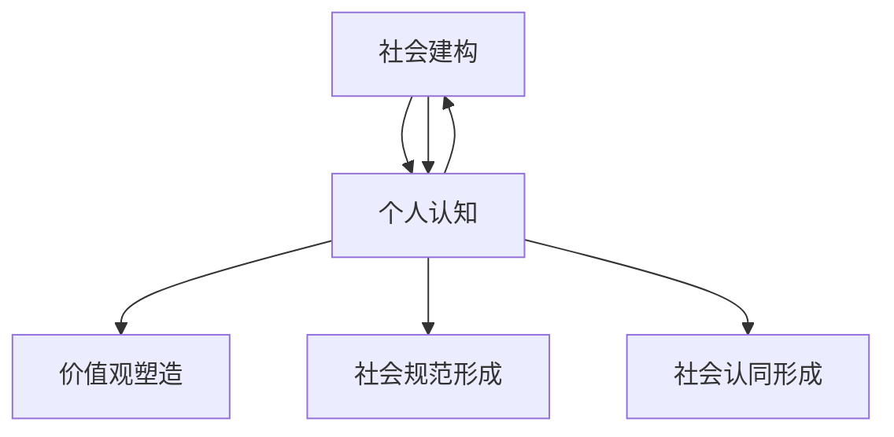
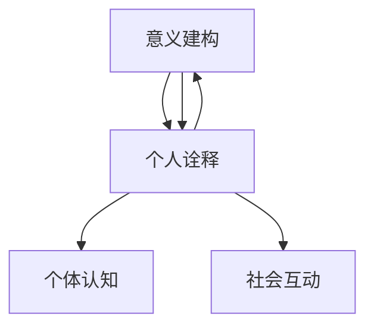

                 

# 意义的社会建构与个人诠释

## 关键词

社会建构、个人诠释、认知心理学、符号互动主义、社会结构理论、价值观、行为决策、心理健康、教育领域、组织管理、跨文化研究。

## 摘要

本文旨在探讨意义的社会建构与个人诠释之间的关系，以及这一关系在各个领域中的应用。通过梳理社会建构主义的理论基础，我们深入分析了意义的社会建构和个人诠释的核心概念及其互动关系。随后，文章探讨了意义建构在个体行为、心理健康、教育领域和组织管理中的应用，并展望了意义建构的未来发展趋势。通过对这些领域的探讨，本文旨在揭示意义建构与个人成长、社会发展之间的紧密联系，为相关领域的研究和实践提供有益的参考。

## 目录大纲

1. 核心概念与联系
   1.1 意义的社会建构
       1.1.1 社会建构主义的起源与发展
       1.1.2 意义建构在社会生活中的作用
       1.1.3 社会建构与个人认知的互动关系
   1.2 个人诠释
       1.2.1 个人诠释的概念与定义
       1.2.2 个人诠释的心理机制
       1.2.3 个人诠释与社会文化背景的关系
2. 意义建构的理论基础
   2.1 社会学理论
       2.1.1 符号互动主义
       2.1.2 社会结构理论
       2.1.3 社会认知理论
   2.2 心理学理论
       2.2.1 认知发展理论
       2.2.2 社会认知理论
       2.2.3 心理动力学理论
3. 意义建构与个体行为
   3.1 意义建构与价值观形成
       3.1.1 价值观的构成与演变
       3.1.2 意义建构对价值观塑造的影响
   3.2 意义建构与行为决策
       3.2.1 行为决策的心理过程
       3.2.2 意义建构对行为决策的引导作用
4. 意义建构的社会应用
   4.1 教育领域
       4.1.1 意义建构在教育教学中的应用
       4.1.2 意义建构与学习效果的关系
   4.2 组织管理
       4.2.1 意义建构在组织文化建设中的应用
       4.2.2 意义建构与组织效能的关系
5. 意义建构与心理健康
   5.1 心理健康与意义建构
       5.1.1 心理健康的定义与构成
       5.1.2 意义建构对心理健康的影响
   5.2 心理干预与意义建构
       5.2.1 心理干预的理论基础
       5.2.2 意义建构在心理干预中的应用
6. 意义建构的未来发展趋势
   6.1 社会变革下的意义建构
       6.1.1 社会变革对意义建构的影响
       6.1.2 意义建构在未来社会中的角色
   6.2 跨文化意义建构
       6.2.1 跨文化差异与意义建构
       6.2.2 跨文化意义建构的挑战与机遇
7. 结论
   7.1 意义建构与个人诠释的关系
       7.1.1 意义建构与个人诠释的互动关系
   7.2 意义建构研究的意义与价值

## 1. 核心概念与联系

### 1.1 意义的社会建构

#### 1.1.1 社会建构主义的起源与发展

社会建构主义起源于20世纪60年代的美国，其代表人物为乔治·赫伯特·米德（George Herbert Mead）和赫伯特·布鲁贝克（Herbert Blumer）。米德提出了“自我”概念，认为人的行为是基于对他人行为的理解与模仿，这一观点为社会建构主义奠定了基础。布鲁贝克则进一步发展了这一理论，提出了“符号互动主义”（Symbolic Interactionism），强调社会是人们通过符号互动建构出来的。

在社会建构主义的发展过程中，许多学者对其理论进行了补充和扩展。如让·皮亚杰（Jean Piaget）的认知发展理论强调了个体在建构知识过程中的主动性，而诺曼·邓津（Norman Denzin）则在社会建构主义的基础上提出了“批判性社会建构主义”（Critical Social Constructivism），强调社会现实中的权力关系和意识形态。

意义建构在社会生活中的作用主要体现在以下几个方面：

- **价值观的塑造**：意义建构帮助我们理解和内化社会的价值观，这些价值观指导我们的行为和决策。
- **社会规范的形成**：通过意义建构，社会规范得以形成并内化，从而维持社会的秩序和稳定。
- **社会认同的形成**：意义建构帮助我们识别和归属不同的社会群体，形成社会认同。

#### 1.1.2 社会建构与个人认知的互动关系

社会建构与个人认知之间存在紧密的互动关系。首先，社会建构影响个人认知。在社会互动中，人们通过语言、符号等手段进行意义建构，这些意义建构过程塑造了我们的认知框架和思维方式。例如，一个社会中的主导文化可能会影响个体的价值观和认知模式。

其次，个人认知也会影响社会建构。个体的认知差异会导致对社会现象的不同诠释和意义建构，从而形成多样化的社会观点和价值观。例如，不同的人可能会对同一事件有不同的看法，这些不同的看法又会进一步影响社会的意义建构。

这种互动关系可以用以下 Mermaid 流程图来表示：

### 1.2 个人诠释

#### 1.2.1 个人诠释的概念与定义

个人诠释（Personal Interpretation）是指个体在特定情境下对事件、情境或信息的个人化理解。它包括以下几个关键要素：

- **情境**：个人诠释的背景和条件。
- **个体差异**：每个个体的认知、情感、经验等差异会影响其诠释方式。
- **目的**：个人诠释通常基于个体的需求和动机。
- **结果**：个人诠释会影响个体的行为和决策。

个人诠释的心理机制主要包括以下几个方面：

- **感知**：个体通过感官接收信息，并将其转化为内部表征。
- **认知加工**：个体使用已有的知识和认知策略对信息进行处理和解释。
- **情感反应**：个体对信息的情感反应会影响其诠释过程。

#### 1.2.2 个人诠释与社会文化背景的关系

个人诠释不仅受到个体因素的影响，还受到社会文化背景的影响。社会文化背景包括社会规范、价值观、传统、语言等。

- **社会规范**：社会规范为个体提供了一种行为框架，影响个体的诠释和行为。
- **价值观**：个体的价值观会影响其对信息的评价和选择，从而影响诠释过程。
- **传统**：传统为个体提供了一种文化记忆，影响其对历史和现实的理解。
- **语言**：语言不仅是交流的工具，也是意义建构和诠释的媒介。

### 1.3 意义建构与个人诠释的关系

意义建构与个人诠释之间存在紧密的关系。意义建构为个人诠释提供了框架和基础，而个人诠释则体现了意义建构的具体实现。二者相互作用，共同影响个体的认知和行为。

- **意义建构对个人诠释的影响**：意义建构为个人提供了一种解释社会现象的框架，帮助个体理解和应对复杂的社会环境。
- **个人诠释对意义建构的影响**：个体的诠释行为会影响社会建构的过程，从而影响社会的意义建构。

这种关系可以用以下 Mermaid 流程图来表示：

## 2. 意义建构的理论基础

### 2.1 社会学理论

#### 2.1.1 符号互动主义

符号互动主义（Symbolic Interactionism）是社会学中的一个重要理论，强调个体在社会互动中通过符号使用和解释来建构意义。符号互动主义的核心观点包括：

- **符号**：符号是意义建构的媒介，包括语言、手势、表情等。
- **互动**：个体通过互动来交流信息和意义。
- **诠释**：个体在互动中不断对符号进行解释和重新解释，以建构和调整其认知和行为。

符号互动主义在社会学中的应用广泛，例如在组织研究、教育研究和社会心理学研究中都有重要影响。

#### 2.1.2 社会结构理论

社会结构理论（Social Structure Theory）关注社会制度、规范和文化如何影响个体的行为和决策。社会结构理论的核心观点包括：

- **社会结构**：社会结构是指社会关系和组织形式的总体安排。
- **角色**：个体在社会中扮演特定的角色，这些角色受到社会结构的影响。
- **规范**：社会规范是指导个体行为的准则，也是社会结构的重要组成部分。

社会结构理论有助于我们理解社会是如何影响个体的行为和决策，以及社会变革是如何发生的。

#### 2.1.3 社会认知理论

社会认知理论（Social Cognitive Theory）是心理学中的一个理论，强调个体在社会互动中通过观察、学习和模仿来建构知识。社会认知理论的核心观点包括：

- **观察学习**：个体通过观察他人的行为和结果来学习。
- **自我效能感**：个体对自身能力的信心和期望，影响其行为选择和努力程度。
- **社会支持**：社会支持对个体的心理和行为有积极影响。

社会认知理论在社会学、心理学和教育学等领域都有广泛应用。

### 2.2 心理学理论

#### 2.2.1 认知发展理论

认知发展理论（Cognitive Development Theory）是心理学中的一个理论，强调个体在成长过程中认知能力的不断发展和变化。让·皮亚杰（Jean Piaget）是认知发展理论的代表人物，他提出了以下核心观点：

- **阶段理论**：认知发展分为四个阶段：感知运动阶段、前运算阶段、具体运算阶段和形式运算阶段。
- **同化与顺应**：个体通过同化和顺应来适应新环境和信息。
- **平衡**：个体在认知发展中寻求认知平衡，以应对新挑战。

认知发展理论有助于我们理解个体是如何通过认知过程来理解世界和自我。

#### 2.2.2 社会认知理论

社会认知理论（Social Cognitive Theory）是心理学中的一个理论，强调个体在社会互动中通过观察、学习和模仿来建构知识。社会认知理论的核心观点包括：

- **观察学习**：个体通过观察他人的行为和结果来学习。
- **自我效能感**：个体对自身能力的信心和期望，影响其行为选择和努力程度。
- **社会支持**：社会支持对个体的心理和行为有积极影响。

社会认知理论在社会学、心理学和教育学等领域都有广泛应用。

#### 2.2.3 心理动力学理论

心理动力学理论（Psychodynamic Theory）是心理学中的一个理论，强调个体行为和情感是由潜意识驱动的。心理动力学理论的核心观点包括：

- **潜意识**：潜意识是心理活动的重要部分，影响个体的行为和情感。
- **冲突**：个体内心存在各种冲突，这些冲突会影响其行为和决策。
- **防御机制**：个体会使用防御机制来应对潜意识冲突，如压抑、合理化等。

心理动力学理论在心理咨询和治疗领域有重要应用。

## 3. 意义建构与个体行为

### 3.1 意义建构与价值观形成

#### 3.1.1 价值观的构成与演变

价值观是人们对事物价值的判断和选择标准，是社会建构和个人诠释的重要成果。价值观的构成可以从以下几个方面来理解：

- **文化背景**：文化传统、社会习俗和价值观念对个体价值观的形成有深远影响。
- **个人经历**：个体的生活经历、教育背景和家庭环境等都会影响其价值观的形成。
- **社会互动**：个体在社会互动中不断调整和塑造自己的价值观。

价值观的演变是一个动态过程，受到社会变革、科技进步和文化交流等多方面因素的影响。例如，全球化进程加速了不同文化之间的交流与融合，导致人们的价值观发生了变化。

#### 3.1.2 意义建构对价值观塑造的影响

意义建构对价值观的塑造具有重要作用。首先，意义建构为个体提供了价值判断的框架。通过社会互动和个体经历，个体对事物进行意义建构，从而形成了对事物的价值判断。其次，意义建构会影响个体的价值观选择。个体在面对不同价值观时，会根据其意义建构进行选择和调整。

### 3.2 意义建构与行为决策

#### 3.2.1 行为决策的心理过程

行为决策是指个体在面临选择时，通过评估不同选择的利弊，作出最终决策的过程。行为决策的心理过程主要包括以下几个阶段：

1. **问题识别**：个体识别需要解决的问题或需求。
2. **信息收集**：个体收集与问题相关的信息。
3. **方案评估**：个体评估不同选择的优缺点。
4. **决策制定**：个体根据评估结果作出最终决策。
5. **决策执行**：个体执行决策并观察结果。

#### 3.2.2 意义建构对行为决策的引导作用

意义建构对行为决策有重要的引导作用。首先，意义建构会影响个体对问题的识别和评估。个体通过意义建构来理解问题，从而影响其对问题的认知和处理。其次，意义建构会影响个体的方案评估和决策制定。个体会根据其价值观和意义建构来评估不同选择的价值，从而影响其最终决策。

例如，在一个团队项目中，如果团队成员对项目目标有不同的理解，那么他们可能会对项目的决策产生分歧。通过意义建构，团队可以共同理解项目目标，从而减少决策冲突，提高决策效率。

## 4. 意义建构的社会应用

### 4.1 教育领域

#### 4.1.1 意义建构在教育教学中的应用

意义建构在教育教学中的应用具有重要意义。首先，意义建构可以帮助学生更好地理解和掌握知识。通过意义建构，学生可以自主地发现和建构知识，从而提高学习效果。其次，意义建构可以帮助教师更好地指导学生。教师可以通过理解学生的意义建构过程，提供更有针对性的教学策略和方法。

#### 4.1.2 意义建构与学习效果的关系

意义建构与学习效果之间存在密切关系。首先，意义建构有助于提高学生的学习动机。当学生认识到学习对个人成长和社会发展的重要性时，他们更有可能积极参与学习。其次，意义建构有助于提高学生的学习效率。通过意义建构，学生可以更好地理解和记忆知识，从而提高学习效果。

### 4.2 组织管理

#### 4.2.1 意义建构在组织文化建设中的应用

意义建构在组织文化建设中具有重要意义。首先，意义建构可以帮助组织明确其核心价值观和使命。通过意义建构，组织成员可以共同理解组织的愿景和目标，从而增强组织的凝聚力和向心力。其次，意义建构可以帮助组织管理者和员工更好地理解和管理组织变革。通过意义建构，组织可以更好地应对外部环境的变化，实现持续发展。

#### 4.2.2 意义建构与组织效能的关系

意义建构与组织效能之间存在密切关系。首先，意义建构有助于提高组织的协作效率。当组织成员对组织的价值观和目标有共同理解时，他们更有可能协作完成任务，从而提高组织效能。其次，意义建构有助于提高组织的创新能力。通过意义建构，组织可以更好地理解和应对外部环境的变化，从而保持竞争优势。

## 5. 意义建构与心理健康

### 5.1 心理健康与意义建构

#### 5.1.1 心理健康的定义与构成

心理健康是指个体在认知、情感和行为方面处于良好的状态，能够有效地应对生活压力，实现个人发展和社会适应。心理健康的构成主要包括以下几个方面：

- **认知健康**：个体具有清晰的思维、良好的记忆和敏锐的感知能力。
- **情感健康**：个体能够体验到积极和消极的情绪，并能合理表达和调节情感。
- **行为健康**：个体能够适应社会环境，遵守社会规范，与他人建立良好的人际关系。

#### 5.1.2 意义建构对心理健康的影响

意义建构对心理健康有重要影响。首先，意义建构有助于个体应对生活压力。当个体对生活事件有合理的意义建构时，他们更有可能保持积极的心态，从而减少心理压力。其次，意义建构有助于个体的自我认同和发展。通过意义建构，个体可以更好地理解自己，建立自我认同，从而实现个人发展。

### 5.2 心理干预与意义建构

#### 5.2.1 心理干预的理论基础

心理干预是指通过心理治疗、心理咨询等手段，帮助个体缓解心理问题、提高心理健康水平的过程。心理干预的理论基础主要包括以下几个方面：

- **认知行为理论**：认知行为理论认为，个体的认知和行为相互作用，影响其情绪和行为。通过改变认知和行为，可以改善心理健康。
- **人本主义心理学**：人本主义心理学强调个体的自我实现和自我认同，认为个体的心理健康与自我实现密切相关。
- **社会建构主义**：社会建构主义认为，个体的心理问题是由社会互动和意义建构过程中的冲突和困境导致的，通过改变意义建构，可以缓解心理问题。

#### 5.2.2 意义建构在心理干预中的应用

意义建构在心理干预中具有重要的应用价值。首先，意义建构可以帮助心理治疗师和心理咨询师更好地理解个体的心理问题。通过理解个体的意义建构过程，治疗师可以提供更有针对性的心理干预。其次，意义建构可以帮助个体改变对问题的认知和态度，从而缓解心理问题。

例如，在一个抑郁患者的心理干预中，治疗师可以帮助患者重新建构问题的意义，从消极的角度转向积极的角度，从而改善其情绪状态。

## 6. 意义建构的未来发展趋势

### 6.1 社会变革下的意义建构

#### 6.1.1 社会变革对意义建构的影响

随着社会变革的加速，意义建构也在不断演变。社会变革对意义建构的影响主要表现在以下几个方面：

- **全球化**：全球化带来了不同文化之间的交流与碰撞，影响了人们的价值观和意义建构。
- **技术进步**：技术进步改变了人们的社交方式、信息获取方式，从而影响了意义建构的过程。
- **社会不平等**：社会不平等问题日益突出，影响了人们对社会现象的理解和意义建构。

#### 6.1.2 意义建构在未来社会中的角色

在未来社会中，意义建构将继续发挥重要作用。首先，意义建构有助于应对社会变革带来的不确定性。通过意义建构，个体可以更好地理解社会现象，应对社会变革带来的挑战。其次，意义建构有助于促进社会和谐与稳定。通过共同的意义建构，个体可以更好地理解彼此，促进社会合作与共赢。

### 6.2 跨文化意义建构

#### 6.2.1 跨文化差异与意义建构

跨文化差异是意义建构研究中的重要议题。跨文化差异包括语言、价值观、宗教信仰、教育背景等方面。跨文化差异对意义建构的影响主要表现在以下几个方面：

- **沟通障碍**：跨文化差异可能导致沟通障碍，影响意义建构的过程。
- **价值观冲突**：跨文化差异可能导致价值观冲突，影响个体的意义建构。
- **社会适应**：跨文化差异影响个体在社会中的适应过程，从而影响意义建构。

#### 6.2.2 跨文化意义建构的挑战与机遇

跨文化意义建构既面临挑战，也充满机遇。挑战主要体现在以下几个方面：

- **文化冲突**：跨文化差异可能导致文化冲突，影响意义建构的和谐与稳定。
- **信息不对称**：跨文化差异可能导致信息不对称，影响意义建构的准确性和完整性。

机遇则主要体现在以下几个方面：

- **文化交流**：跨文化差异为文化交流提供了丰富的资源，有助于意义建构的多元化和丰富化。
- **创新思维**：跨文化差异激发创新思维，有助于意义建构的创新和发展。

## 结论

### 7.1 意义建构与个人诠释的关系

意义建构与个人诠释之间存在紧密的关系。意义建构为个人诠释提供了框架和基础，而个人诠释则体现了意义建构的具体实现。二者相互作用，共同影响个体的认知和行为。

意义建构与个人诠释的关系可以用以下 Mermaid 流程图来表示：

### 7.2 意义建构研究的意义与价值

意义建构研究在多个领域具有重要意义。首先，意义建构研究有助于我们更好地理解社会现象和个体行为。通过意义建构，我们可以深入分析社会现象背后的原因和机制。其次，意义建构研究有助于改善教育、组织和心理健康等领域。通过理解意义建构的过程和机制，我们可以提出更有针对性的教育和组织管理策略，提高个体的心理健康水平。

总之，意义建构与个人诠释的关系是复杂而多样的，二者相互作用，共同影响个体的认知和行为。通过对意义建构的研究，我们可以更好地理解社会现象，改善教育、组织和心理健康等领域，为社会发展和个人成长提供有益的参考。作者：AI天才研究院/AI Genius Institute & 禅与计算机程序设计艺术 /Zen And The Art of Computer Programming

