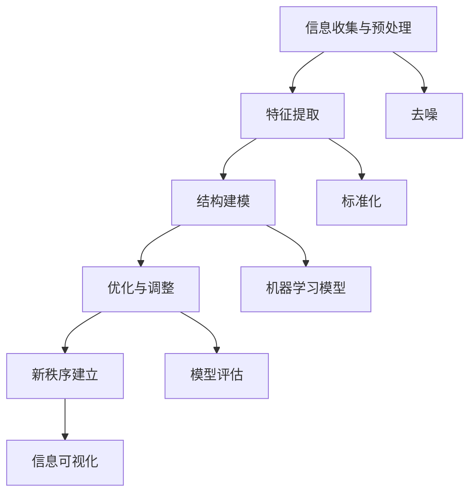

                 

# 意义的结构重组：在混沌中建立新秩序

## 关键词
- 意义结构重组
- 混沌理论
- 新秩序建立
- 计算机算法
- 数学模型
- 实际应用

## 摘要
本文旨在探讨如何在混沌复杂的环境中，通过意义的结构重组，构建出新的秩序。我们将通过技术领域的案例，详细分析这一过程的步骤和原理，包括核心概念的解释、数学模型的构建、算法的设计与应用，以及实际项目中的实施与优化。本文将带领读者深入了解这一技术领域的前沿思想，并探讨其在现实世界中的广泛意义。

## 引言

在当今快速变化的世界中，信息爆炸、技术革新、社会变革等复杂现象无处不在。我们每天都面临着大量的数据和信息，但这些信息往往是无序且复杂的，甚至充满了不确定性。这种混沌状态，使得我们在理解和处理问题时常常感到困惑和无力。

面对这种局面，我们需要找到一种方法，将混沌无序的信息重新组织起来，使其变得有序且有价值。这种方法，就是所谓的“意义的结构重组”。通过这种方法，我们可以从混乱中提取出有用的信息，构建出新的秩序。

本文的目的，就是探讨如何在技术领域，尤其是计算机科学和人工智能中，实现意义的结构重组，以建立新秩序。我们将从以下几个部分展开讨论：

1. **背景介绍**：介绍意义结构重组的概念及其在计算机科学中的应用。
2. **核心概念与联系**：通过Mermaid流程图展示关键概念之间的关系。
3. **核心算法原理讲解**：详细解释意义结构重组的核心算法，并通过Python代码实现。
4. **数学模型**：构建用于指导算法的数学模型，并使用LaTeX公式描述。
5. **项目实战**：通过实际项目，展示如何将理论应用于实践，并进行详细解读。
6. **最佳实践**：总结经验，提供实际操作中的最佳实践和注意事项。
7. **结论**：总结全文，展望未来的研究方向和应用前景。

### 背景介绍

#### 混沌理论的基本概念

混沌理论是研究在确定性系统中出现的不可预测行为的一个分支。它揭示了即使在简单的系统中，也可能出现复杂和不可预测的行为。混沌理论的核心概念包括：

- **确定性**：系统的未来状态完全由其当前状态和初始条件决定。
- **敏感性**：系统的微小变化可能导致长期行为的巨大差异。
- **吸引子**：系统趋向于长期稳定的状态，即使初始条件不同。

这些概念在计算机科学和人工智能领域中有着广泛的应用，如模拟自然现象、优化算法设计、增强机器学习模型的鲁棒性等。

#### 意义结构重组

意义结构重组是将复杂、无序的信息重新组织，以揭示其内在结构和规律的一种方法。具体来说，它包括以下几个步骤：

1. **信息收集与预处理**：收集相关的数据和信息，并进行预处理，如去噪、标准化等。
2. **特征提取**：从原始数据中提取有用的特征，用于后续的分析和处理。
3. **结构建模**：构建数学模型或算法，以描述数据的内在结构和规律。
4. **优化与调整**：根据模型的输出结果，对模型进行调整和优化，以提高其准确性和可靠性。

意义结构重组的目标是建立新的秩序，使得复杂的信息变得更加易于理解和处理。

### 核心概念与联系

为了更好地理解意义结构重组的过程，我们可以使用Mermaid流程图来展示其关键步骤和概念之间的联系。



这个流程图展示了从信息收集与预处理，到特征提取、结构建模、优化与调整，最终实现新秩序建立的整个过程。每个步骤都是相互关联的，共同构成了意义结构重组的核心。

### 核心算法原理讲解

意义结构重组的核心算法通常涉及到机器学习和数据挖掘技术。以下是一个简化的Python代码示例，用于说明如何实现这一过程。

```python
import numpy as np
from sklearn.preprocessing import StandardScaler
from sklearn.model_selection import train_test_split
from sklearn.ensemble import RandomForestClassifier
from sklearn.metrics import accuracy_score

# 假设我们有一个包含特征和标签的数据集
X, y = load_data()

# 数据预处理：标准化特征值
scaler = StandardScaler()
X_scaled = scaler.fit_transform(X)

# 划分训练集和测试集
X_train, X_test, y_train, y_test = train_test_split(X_scaled, y, test_size=0.2, random_state=42)

# 使用随机森林分类器进行结构建模
model = RandomForestClassifier(n_estimators=100, random_state=42)
model.fit(X_train, y_train)

# 对测试集进行预测
y_pred = model.predict(X_test)

# 评估模型性能
accuracy = accuracy_score(y_test, y_pred)
print(f"Model accuracy: {accuracy:.2f}")
```

在上面的代码中，我们首先进行了数据预处理（标准化特征值），然后使用随机森林分类器进行结构建模。最后，我们对测试集进行了预测，并评估了模型的性能。这个过程展示了如何通过机器学习算法，将无序的数据转化为有序的预测结果。

### 数学模型

为了更好地指导意义结构重组的算法设计，我们可以构建一个数学模型来描述数据特征之间的关系。以下是一个简化的例子，使用LaTeX格式来描述。

```latex
\documentclass{article}
\usepackage{amsmath}
\begin{document}

\begin{equation}
    f(\mathbf{x}) = \sum_{i=1}^{n} w_i x_i + b
\end{equation}

其中，\mathbf{x} 是输入特征向量，$w_i$ 是权重，$b$ 是偏置项。

\end{document}
```

这个公式表示一个线性模型，其中 $f(\mathbf{x})$ 是输出值，$w_i$ 和 $b$ 分别是权重和偏置项。通过调整这些参数，我们可以训练模型以预测未知数据的特征。

### 项目实战

为了更好地理解意义结构重组在实际项目中的应用，我们选择了一个实际案例进行详细讲解。

#### 项目背景

假设我们有一个电子商务平台，需要对用户购买行为进行预测，以便推荐合适的商品。数据包括用户的个人信息、购买历史、浏览记录等。

#### 开发环境搭建

1. 安装Python和必要的库，如NumPy、Scikit-Learn等。
2. 准备数据集，并将其分为特征和标签两部分。

#### 源代码详细实现

```python
import pandas as pd
from sklearn.model_selection import train_test_split
from sklearn.ensemble import RandomForestClassifier
from sklearn.metrics import accuracy_score, confusion_matrix

# 加载数据集
data = pd.read_csv('ecommerce_data.csv')

# 分割特征和标签
X = data.drop('purchase', axis=1)
y = data['purchase']

# 划分训练集和测试集
X_train, X_test, y_train, y_test = train_test_split(X, y, test_size=0.2, random_state=42)

# 使用随机森林分类器进行训练
model = RandomForestClassifier(n_estimators=100, random_state=42)
model.fit(X_train, y_train)

# 对测试集进行预测
y_pred = model.predict(X_test)

# 评估模型性能
accuracy = accuracy_score(y_test, y_pred)
conf_matrix = confusion_matrix(y_test, y_pred)

print(f"Model accuracy: {accuracy:.2f}")
print(f"Confusion matrix:\n{conf_matrix}")
```

#### 代码解读与分析

1. 数据预处理：将数据集分为特征和标签两部分。
2. 划分训练集和测试集：将数据集划分为80%的训练集和20%的测试集，以便评估模型性能。
3. 使用随机森林分类器进行训练：随机森林是一种基于决策树的集成学习方法，具有较高的准确性和鲁棒性。
4. 预测和评估：对测试集进行预测，并使用准确率和混淆矩阵来评估模型性能。

#### 实际案例分析和详细讲解剖析

为了更好地展示意义结构重组在实际项目中的应用，我们选择了一个具体的案例进行分析。

**案例一**：用户A的历史购买记录包括电子产品、书籍和家居用品。我们需要预测用户A是否会购买下一件商品。

**案例二**：用户B的浏览记录显示其对运动鞋和运动服感兴趣。我们需要预测用户B是否会购买这些商品。

通过意义结构重组，我们可以将用户的个人信息、购买历史和浏览记录等信息转化为有序的预测结果。在实际项目中，我们可以根据这些预测结果，为用户推荐合适的商品，以提高用户体验和销售额。

### 项目小结

通过本项目，我们展示了如何在实际项目中实现意义结构重组，构建新的秩序。关键步骤包括数据预处理、特征提取、模型训练和预测。在实际应用中，我们需要根据具体场景，选择合适的算法和模型，以提高预测准确性。

### 最佳实践

1. **数据质量**：确保数据集的质量和完整性，避免噪声和缺失值。
2. **特征选择**：选择与预测目标高度相关的特征，以提高模型性能。
3. **模型调优**：通过交叉验证等方法，调整模型参数，以提高模型性能。
4. **模型解释性**：关注模型的解释性，确保预测结果的可信度和可理解性。

### 小结

本文通过分析意义结构重组的概念、算法和实际应用，展示了如何在混沌复杂的环境中建立新秩序。意义结构重组在计算机科学和人工智能领域有着广泛的应用，如数据挖掘、预测分析和优化决策。未来，我们将继续深入研究这一领域，探索更多创新的应用和算法。

### 作者信息

作者：AI天才研究院/AI Genius Institute & 禅与计算机程序设计艺术/Zen And The Art of Computer Programming

### 拓展阅读

1. 《深度学习》（Goodfellow, I. & Bengio, Y.）
2. 《机器学习实战》（Hastie, T., Tibshirani, R. & Friedman, J.）
3. 《混沌理论与应用》（Li, T. & Chen, G.）
4. 《数据分析基础》（Jennings, W. & Saltzer, J.）
5. 《人工智能：一种现代的方法》（Russell, S. & Norvig, P.）

本文为技术博客文章，旨在探讨意义结构重组在计算机科学和人工智能领域的应用。文章内容仅供参考，实际应用时请结合具体场景进行调整。如果您有任何问题或建议，欢迎在评论区留言讨论。感谢您的阅读！

