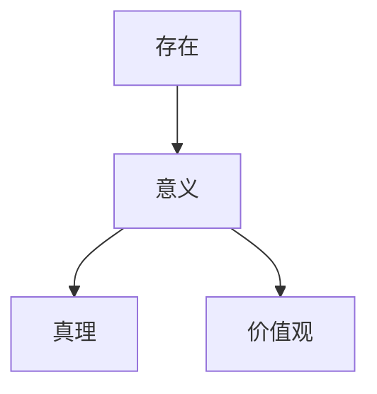

                 

# 意义的解构与重构：21世纪的哲学任务

> 关键词：21世纪哲学、意义、解构、重构、人工智能、逻辑思维

> 摘要：随着21世纪的到来，科技飞速发展，人工智能和哲学的结合成为了新的研究热点。本文将探讨意义的概念，以及其在21世纪哲学中的解构与重构。我们将通过逻辑分析和实例，揭示意义在现代社会中的重要性，并探讨如何通过解构与重构的方法，推动哲学和科技的发展。

## 引言

在当今时代，意义成为了哲学研究的一个重要议题。人工智能的发展进一步加深了人们对意义的探讨。传统哲学中，意义通常与存在、真理和价值观等概念紧密相连。然而，随着科技的发展，这些概念也在不断演变。因此，对意义的解构与重构成为了21世纪哲学的重要任务。

## 核心概念与联系

### 意义的定义

意义可以被理解为事物存在的目的和意义。在哲学中，意义通常与存在、真理和价值观等概念密切相关。我们可以用 Mermaid 流程图来展示这些概念之间的联系：

### 解构

解构是一种哲学方法，旨在揭示事物内部的矛盾和复杂性。解构的过程包括分析、拆解和重新组合。通过解构，我们可以更深入地理解事物的本质。

### 重构

重构是在解构的基础上，重新组合和分析事物的过程。重构的目标是通过重新组合和分析，形成新的意义和认识。

### 21世纪哲学背景

在21世纪，哲学面临着前所未有的挑战。人工智能的发展使得意义的概念变得更加复杂。例如，人工智能能否拥有意义？人工智能的意义是什么？这些问题成为了21世纪哲学的重要议题。

## 解构与重构的方法

### 解构方法

1. **现象学方法**：通过直接观察和感知，揭示事物表面的现象。
2. **结构主义方法**：分析事物的结构和组成，揭示其内在的矛盾和复杂性。
3. **分析哲学方法**：通过逻辑分析和推理，揭示事物的本质。

### 重构方法

1. **综合方法**：将不同的理论和观点综合起来，形成新的理论框架。
2. **创造方法**：通过创新和创造，形成新的意义和认识。

## 具体领域应用

### 人工智能领域

在人工智能领域，解构与重构的方法可以用于以下几个方面：

1. **人工智能系统的设计**：通过解构现有的人工智能系统，分析其优缺点，并重构出更高效、更智能的人工智能系统。
2. **人工智能伦理**：通过解构传统伦理观念，重新构建适应人工智能时代的伦理框架。

### 哲学领域

在哲学领域，解构与重构的方法可以用于以下几个方面：

1. **哲学理论的创新**：通过解构现有的哲学理论，重新构建适应新时代的哲学理论。
2. **哲学教育**：通过重构哲学课程，使其更贴近现代社会和人工智能的发展。

## 案例研究

### 人工智能与哲学的结合

1. **案例一**：自然语言处理。通过解构自然语言处理的技术和方法，重构出更高效、更智能的自然语言处理系统。
2. **案例二**：伦理学。通过解构传统的伦理观念，重构适应人工智能时代的伦理学理论。

## 结论

在21世纪，意义的解构与重构成为了哲学的重要任务。通过解构与重构的方法，我们可以更深入地理解意义，推动哲学和科技的发展。在未来，我们期待看到更多的研究成果，为人类社会的发展提供新的思路。

## 最佳实践 tips

1. **持续学习**：哲学和科技的发展迅速，持续学习是保持竞争力的重要手段。
2. **实践与应用**：将解构与重构的方法应用到实际领域，通过实践来验证理论的正确性。

## 小结

本文探讨了意义的解构与重构在21世纪哲学中的重要性。通过逻辑分析和实例，我们揭示了意义在现代社会中的重要性，并探讨了如何通过解构与重构的方法，推动哲学和科技的发展。在未来，我们期待看到更多的研究成果，为人类社会的发展提供新的思路。

## 注意事项

1. **谨慎应用**：在应用解构与重构的方法时，需要谨慎考虑其适用范围和局限性。
2. **伦理问题**：在人工智能和哲学的结合中，需要特别关注伦理问题，确保技术的发展符合人类价值观。

## 拓展阅读

1. **《意义的追寻：哲学导论》**：一本关于意义哲学的入门书籍，适合对哲学感兴趣的读者。
2. **《人工智能哲学导论》**：一本关于人工智能与哲学结合的书籍，适合对人工智能和哲学感兴趣的读者。

## 作者信息

作者：AI天才研究院/AI Genius Institute & 禅与计算机程序设计艺术 /Zen And The Art of Computer Programming

本文版权归AI天才研究院/AI Genius Institute所有，未经授权，不得转载。如有疑问，请联系作者。

