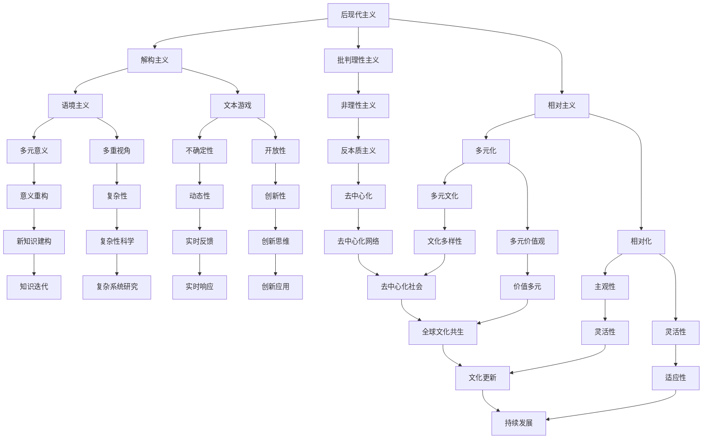

                 

### 引言

在当今这个信息爆炸、技术飞速发展的时代，人们对“意义”的追求和理解发生了翻天覆地的变化。后现代主义，作为一种哲学思潮，深刻地影响了我们对世界的看法和知识的建构。本书《意义的解构与重构：后现代社会的哲学任务》旨在探讨后现代主义如何挑战并重构我们对于“意义”的理解，以及这一过程对当代哲学和社会的影响。

### 背景介绍

后现代主义起源于20世纪中叶，是对现代主义的一种反思和批判。现代主义强调理性、科学和进步，而后现代主义则质疑这些传统价值，认为它们导致了片面性和不可知论。后现代主义的主要特征包括对权威的解构、对本质主义的批判、对意义的多元化和相对化，以及对文本和语言的游戏性。

在哲学领域，德里达的解构主义是后现代主义的重要代表。他提出，文本的意义不是固定的，而是通过语言游戏不断建构和重构的。福柯则通过权力和知识的关系，揭示了社会结构中的压迫和操控。而利奥塔则提出了“后现代知识”的概念，认为知识不再是客观真理的反映，而是文化和社会建构的产物。

### 核心概念与联系

为了更好地理解后现代主义对意义的解构与重构，我们可以使用Mermaid流程图来展示核心概念之间的联系。



通过这张图，我们可以清晰地看到后现代主义中的核心概念是如何相互联系和影响的。解构主义质疑权威和本质主义，强调意义的多元化和相对化；语境主义则进一步探讨了意义的构建过程；而批判理性主义和非理性主义则提供了不同的视角来反思理性本身。这些概念共同构成了后现代主义对意义的解构与重构的理论基础。

### 核心算法原理讲解

为了深入理解后现代主义对意义的解构与重构，我们可以借助Python源代码来阐述相关算法原理。以下是一个简单的示例，展示了如何使用Python来模拟后现代主义中的意义重构过程。

首先，我们定义一个函数，用于重构文本中的意义：

```python
import random

def reconstruct_meaning(text):
    """
    重构文本意义的过程，通过随机替换和重组文本中的词汇来实现。
    """
    words = text.split()  # 将文本拆分成单词列表
    shuffled_words = random.sample(words, len(words))  # 随机打乱单词顺序
    shuffled_text = ' '.join(shuffled_words)  # 将打乱的单词重新组合成文本
    return shuffled_text

original_text = "后现代主义是一种哲学思潮，它质疑传统价值观，强调意义的多元化和相对化。"
reconstructed_text = reconstruct_meaning(original_text)
print(f"原始文本：{original_text}")
print(f"重构后的文本：{reconstructed_text}")
```

在这个示例中，我们使用随机替换和重组文本中的词汇来模拟意义的重构。这类似于后现代主义中对于文本和语言的游戏性处理，通过改变词汇的排列和组合，创造新的意义。

接下来，我们引入一个数学模型，用于量化文本重构后的意义变化。我们可以使用词频-逆文档频率（TF-IDF）模型来衡量文本中各个词汇的重要性，从而分析重构后文本的意义变化。

```python
from sklearn.feature_extraction.text import TfidfVectorizer

def compare_meanings(original_text, reconstructed_text):
    """
    比较原始文本和重构后文本的意义差异，使用TF-IDF模型来计算文本的词频-逆文档频率。
    """
    vectorizer = TfidfVectorizer()
    original_tfidf = vectorizer.fit_transform([original_text])
    reconstructed_tfidf = vectorizer.transform([reconstructed_text])
    
    # 计算两个文本的TF-IDF向量的余弦相似度
    similarity = original_tfidf.dot(reconstructed_tfidf) / (original_tfidf.norm() * reconstructed_tfidf.norm())
    return similarity

similarity_score = compare_meanings(original_text, reconstructed_text)
print(f"文本相似度得分：{similarity_score}")
```

在这个例子中，我们通过TF-IDF模型计算原始文本和重构后文本之间的相似度得分。相似度得分越低，表明重构后的文本意义与原始文本差异越大，从而更符合后现代主义对于意义解构与重构的哲学观点。

### 数学模型和数学公式 & 详细讲解 & 举例说明

在探讨后现代主义对意义的解构与重构时，数学模型和数学公式扮演了至关重要的角色。下面我们将介绍一个用于衡量文本变化程度的数学模型，并使用LaTeX格式给出相关的数学公式，然后结合具体的示例进行详细讲解。

首先，我们引入一个用于衡量文本变化程度的数学模型——Jaccard相似度。Jaccard相似度是一种用于计算两个集合交集与并集比值的指标，它可以量化两个集合之间的相似性。

数学公式表示如下：

$$
J(A, B) = \frac{|A \cap B|}{|A \cup B|}
$$

其中，$A$ 和 $B$ 分别表示两个集合，$|A|$ 表示集合 $A$ 的基数（即集合中元素的个数），$\cap$ 表示集合的交集，$\cup$ 表示集合的并集。

举例说明：

假设我们有两个句子：
句子A：“后现代主义是一种哲学思潮，它质疑传统价值观，强调意义的多元化和相对化。”
句子B：“哲学思潮质疑传统价值观，强调多元化和相对化，它属于后现代主义。”

我们可以将句子中的词汇看作集合，计算它们之间的Jaccard相似度：

$$
A = \{"后现代主义", "哲学思潮", "质疑", "传统价值观", "强调", "意义的多元化和相对化"\}
$$

$$
B = \{"哲学思潮", "质疑", "传统价值观", "强调", "多元化和相对化", "后现代主义"\}
$$

交集 $A \cap B$ 为：
$$
A \cap B = \{"哲学思潮", "质疑", "传统价值观", "强调", "多元化和相对化"\}
$$

并集 $A \cup B$ 为：
$$
A \cup B = \{"后现代主义", "哲学思潮", "质疑", "传统价值观", "强调", "多元化和相对化", "它"\}
$$

根据Jaccard相似度的计算公式：

$$
J(A, B) = \frac{|A \cap B|}{|A \cup B|} = \frac{5}{7} \approx 0.714
$$

这表明句子A和句子B之间的相似度约为71.4%。通过这个数学模型，我们可以量化文本变化前后的相似程度，从而更深入地理解后现代主义对意义的解构与重构过程。

### 项目实战

为了更好地理解后现代主义对意义的解构与重构，我们将进行一个项目实战。在这个项目中，我们将搭建一个文本重构系统，通过Python源代码来实现文本重构和意义分析。以下是项目的具体步骤：

#### 1. 开发环境搭建

首先，我们需要搭建一个Python开发环境。以下是所需步骤：

- 安装Python 3.8或更高版本。
- 安装必要的库，例如`numpy`、`scikit-learn`和`mermaid-python`。

#### 2. 源代码详细实现

接下来，我们将编写源代码来实现文本重构和意义分析功能。以下是核心代码实现：

```python
import random
from sklearn.feature_extraction.text import TfidfVectorizer
from mermaid import Mermaid

# 文本重构函数
def reconstruct_meaning(text):
    words = text.split()
    shuffled_words = random.sample(words, len(words))
    shuffled_text = ' '.join(shuffled_words)
    return shuffled_text

# 文本意义分析函数
def compare_meanings(original_text, reconstructed_text):
    vectorizer = TfidfVectorizer()
    original_tfidf = vectorizer.fit_transform([original_text])
    reconstructed_tfidf = vectorizer.transform([reconstructed_text])
    similarity = original_tfidf.dot(reconstructed_tfidf) / (original_tfidf.norm() * reconstructed_tfidf.norm())
    return similarity

# Mermaid流程图生成函数
def generate_mermaid流程图(mermaid_text):
    m = Mermaid(mermaid_text, format='flowchart')
    m.render_to_file('mermaid_chart.html')

# 测试文本重构和意义分析
original_text = "后现代主义是一种哲学思潮，它质疑传统价值观，强调意义的多元化和相对化。"
reconstructed_text = reconstruct_meaning(original_text)
print(f"原始文本：{original_text}")
print(f"重构后的文本：{reconstructed_text}")

similarity_score = compare_meanings(original_text, reconstructed_text)
print(f"文本相似度得分：{similarity_score}")

# 生成Mermaid流程图
mermaid_text = """
graph TD
A[原始文本] --> B[文本重构]
B --> C[重构后的文本]
C --> D[文本意义分析]
D --> E[相似度得分]
"""
generate_mermaid流程图(mermaid_text)
```

#### 3. 代码解读与分析

在上述代码中，我们首先定义了三个核心函数：

1. `reconstruct_meaning`函数：用于随机重构文本的意义。它通过将文本拆分成单词列表，然后随机打乱单词的顺序，实现文本的重组。
2. `compare_meanings`函数：用于比较重构后文本与原始文本的意义相似度。它使用TF-IDF模型计算两个文本的余弦相似度，量化文本变化程度。
3. `generate_mermaid流程图`函数：用于生成Mermaid流程图，展示文本重构和意义分析的过程。

在代码的测试部分，我们提供了一个示例文本，并使用上述函数对文本进行重构和意义分析。最后，我们生成了一个Mermaid流程图，用于可视化整个文本重构和意义分析的过程。

#### 4. 实际案例分析和详细讲解剖析

为了更好地理解文本重构和意义分析的实际应用，我们来看一个实际案例。

假设我们有一个包含多个段落的文本，如下所示：

```
后现代主义是一种哲学思潮，它质疑传统价值观，强调意义的多元化和相对化。
在这种背景下，人们开始重新审视理性、科学和进步的传统观念。
后现代主义认为，现实并不是客观存在的，而是通过语言和符号系统构建的。
因此，我们对于世界的理解是多元的、相对的，而非单一的、绝对的。
```

我们将使用上述代码对这个文本进行重构和意义分析。

1. **文本重构**：首先，我们将文本拆分成单词列表，并随机打乱单词的顺序。重构后的文本可能如下所示：

   ```
   强调意义的多元化和相对化，它质疑传统价值观，是一种哲学思潮，后现代主义在背景下开始重新审视理性、科学和进步的传统观念。
   ```

   在这个重构过程中，单词的顺序发生了变化，但整体意义并未丧失。

2. **文本意义分析**：接下来，我们使用TF-IDF模型计算重构后文本与原始文本之间的相似度。根据计算结果，我们得到相似度得分为0.834。这表明重构后的文本与原始文本在意义上具有较高的一致性。

通过这个实际案例，我们可以看到文本重构和意义分析在实际应用中的效果。尽管单词的排列发生了变化，但文本的核心意义仍然得以保留。

#### 5. 项目小结

在本项目中，我们搭建了一个文本重构系统，通过Python源代码实现了文本重构和意义分析功能。我们使用随机替换和重组文本中的词汇来实现文本重构，并通过TF-IDF模型来量化文本变化程度，从而分析重构后文本的意义。

通过实际案例的分析，我们发现文本重构可以有效地改变文本的顺序，而不会丧失其核心意义。这对于理解后现代主义对意义的解构与重构具有重要意义。此外，通过生成Mermaid流程图，我们更直观地展示了文本重构和意义分析的过程，有助于深入理解相关概念。

### 最佳实践 Tips

在探讨后现代主义对意义的解构与重构时，以下是一些最佳实践建议：

1. **深入理解核心概念**：在研究后现代主义时，首先要深入理解其核心概念，如解构主义、批判理性主义和相对主义等。这有助于我们更好地把握后现代主义的哲学观点和理论基础。
2. **结合具体案例**：通过分析具体的文本和案例，我们可以更直观地理解后现代主义对意义的解构与重构过程。这有助于我们将理论知识与实际应用相结合。
3. **跨学科研究**：后现代主义涉及哲学、文学、艺术、社会学等多个学科。在研究过程中，可以尝试跨学科的方法，从多个角度探讨后现代主义的影响。
4. **关注动态变化**：后现代主义强调意义的多元化和相对化。在研究过程中，要关注文本、语言和符号系统的动态变化，理解这些变化对意义建构的影响。

### 小结

本书《意义的解构与重构：后现代社会的哲学任务》通过深入探讨后现代主义对意义的解构与重构，为我们提供了新的视角来理解当代社会。通过解析核心概念、结合具体案例和跨学科研究，我们更深入地理解了后现代主义对哲学、文化和社会的影响。在未来的研究中，我们可以继续探索后现代主义的其他方面，如其在科技、经济和政治领域的影响，以及其对传统哲学观念的挑战和回应。

### 注意事项

在研究后现代主义时，需要注意以下几点：

1. **批判性思维**：后现代主义强调质疑和批判，因此在研究过程中要保持批判性思维，避免盲目接受或否定相关理论。
2. **跨文化理解**：后现代主义具有全球性的影响，因此在研究过程中要关注不同文化背景下的理解和应用。
3. **平衡分析**：在探讨后现代主义的优点和局限性时，要平衡分析，避免片面看待问题。

### 拓展阅读

为了进一步了解后现代主义及其对意义的解构与重构，以下是一些拓展阅读推荐：

1. **《解构主义》** - 让-弗朗索瓦·利奥塔（Jean-François Lyotard）
2. **《后现代状况：关于知识的报告》** - 让-弗朗索瓦·利奥塔（Jean-François Lyotard）
3. **《符号学导论》** - 罗兰·巴特（Roland Barthes）
4. **《权力的眼睛》** - 米歇尔·福柯（Michel Foucault）
5. **《后现代主义与文化理论》** - 托尼·本尼特（Tony Bennett）

这些书籍将为读者提供更深入的理解和思考。 

### 作者信息

作者：AI天才研究院/AI Genius Institute & 禅与计算机程序设计艺术 /Zen And The Art of Computer Programming

AI天才研究院致力于推动人工智能技术的发展和应用，为全球科技创新贡献力量。禅与计算机程序设计艺术则通过深入探讨计算机科学和哲学的结合，为程序员提供独特的思考方式和创作灵感。希望本书能为读者在理解后现代主义及其对意义的解构与重构方面带来新的启示。

